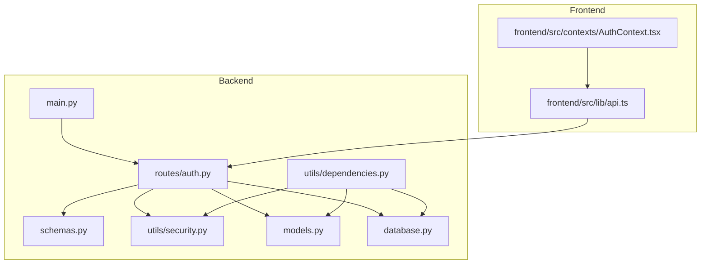
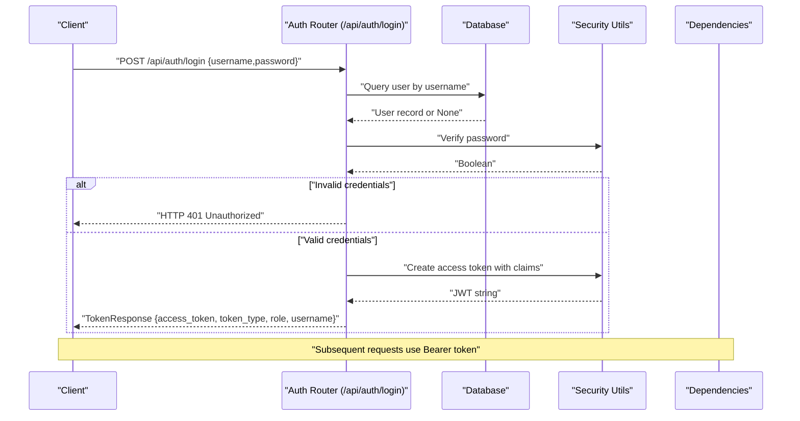
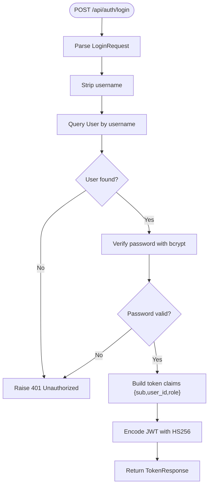
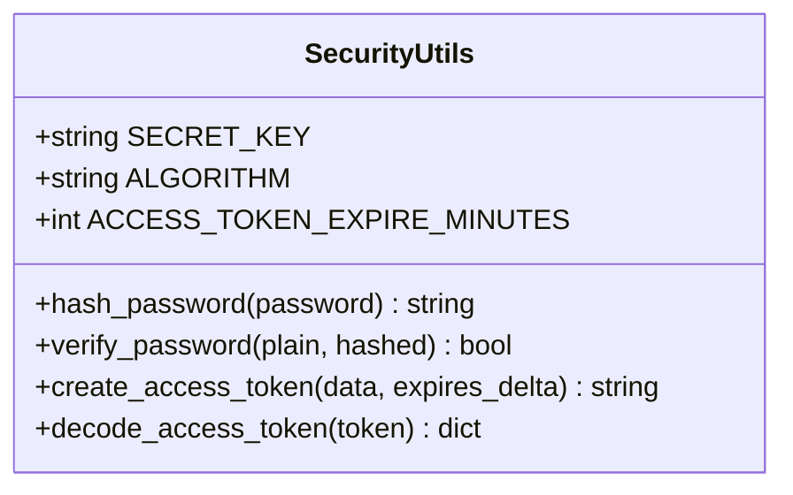
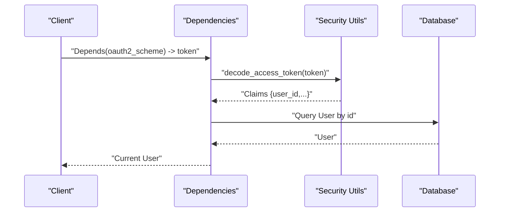
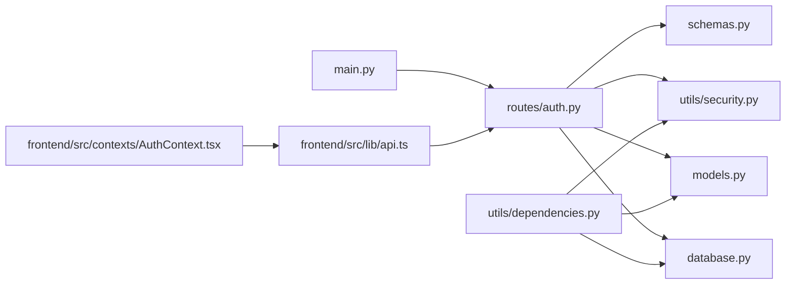

# Authentication API

<cite>
**Referenced Files in This Document**
- [main.py](file://main.py)
- [routes/auth.py](file://routes/auth.py)
- [schemas.py](file://schemas.py)
- [utils/security.py](file://utils/security.py)
- [utils/dependencies.py](file://utils/dependencies.py)
- [models.py](file://models.py)
- [database.py](file://database.py)
- [frontend/src/lib/api.ts](file://frontend/src/lib/api.ts)
- [frontend/src/contexts/AuthContext.tsx](file://frontend/src/contexts/AuthContext.tsx)
</cite>

## Table of Contents
1. [Introduction](#introduction)
2. [Project Structure](#project-structure)
3. [Core Components](#core-components)
4. [Architecture Overview](#architecture-overview)
5. [Detailed Component Analysis](#detailed-component-analysis)
6. [Dependency Analysis](#dependency-analysis)
7. [Performance Considerations](#performance-considerations)
8. [Troubleshooting Guide](#troubleshooting-guide)
9. [Conclusion](#conclusion)

## Introduction
This document provides comprehensive API documentation for the authentication endpoints, focusing on the POST /api/auth/login endpoint. It explains request and response schemas, error handling, JWT token structure and expiration, token-based authentication flow, and practical usage examples. It also documents the LoginRequest and TokenResponse Pydantic models, along with security considerations and middleware usage.

## Project Structure
The authentication system spans backend routes, schemas, security utilities, database models, and frontend integration:
- Backend entrypoint registers routers and initializes the database.
- The auth router defines the login endpoint.
- Schemas define request/response models.
- Security utilities handle password hashing/verification and JWT encoding/decoding.
- Dependencies provide OAuth2 Bearer token extraction and user resolution.
- Frontend integrates with the API and stores tokens locally.

**Diagram sources**
- [main.py:17-32](file://main.py#L17-L32)
- [routes/auth.py:10-35](file://routes/auth.py#L10-L35)
- [schemas.py:10-19](file://schemas.py#L10-L19)
- [utils/security.py:9-39](file://utils/security.py#L9-L39)
- [utils/dependencies.py:12-70](file://utils/dependencies.py#L12-L70)
- [models.py:11-21](file://models.py#L11-L21)
- [database.py:28-33](file://database.py#L28-L33)
- [frontend/src/lib/api.ts:11-13](file://frontend/src/lib/api.ts#L11-L13)
- [frontend/src/contexts/AuthContext.tsx:95-111](file://frontend/src/contexts/AuthContext.tsx#L95-L111)

**Section sources**
- [main.py:17-32](file://main.py#L17-L32)
- [routes/auth.py:10-35](file://routes/auth.py#L10-L35)
- [schemas.py:10-19](file://schemas.py#L10-L19)
- [utils/security.py:9-39](file://utils/security.py#L9-L39)
- [utils/dependencies.py:12-70](file://utils/dependencies.py#L12-L70)
- [models.py:11-21](file://models.py#L11-L21)
- [database.py:28-33](file://database.py#L28-L33)
- [frontend/src/lib/api.ts:11-13](file://frontend/src/lib/api.ts#L11-L13)
- [frontend/src/contexts/AuthContext.tsx:95-111](file://frontend/src/contexts/AuthContext.tsx#L95-L111)

## Core Components
- Authentication endpoint: POST /api/auth/login
- Request model: LoginRequest (username, password)
- Response model: TokenResponse (access_token, token_type, role, username)
- Password handling: bcrypt hashing and verification
- JWT handling: HS256 signing with configurable secret and expiration
- Authentication middleware: OAuth2 Bearer scheme and current user resolution

**Section sources**
- [routes/auth.py:13-35](file://routes/auth.py#L13-L35)
- [schemas.py:10-19](file://schemas.py#L10-L19)
- [utils/security.py:17-39](file://utils/security.py#L17-L39)
- [utils/dependencies.py:12-70](file://utils/dependencies.py#L12-L70)

## Architecture Overview
The authentication flow involves:
- Client sends credentials to the login endpoint.
- Backend validates credentials against stored hashed passwords.
- On success, backend creates a JWT containing user identity and role.
- Client receives TokenResponse and stores the token.
- Subsequent protected requests include the token in Authorization header.

**Diagram sources**
- [routes/auth.py:13-35](file://routes/auth.py#L13-L35)
- [utils/security.py:22-39](file://utils/security.py#L22-L39)
- [utils/dependencies.py:12-70](file://utils/dependencies.py#L12-L70)

## Detailed Component Analysis

### POST /api/auth/login Endpoint
- Method: POST
- Path: /api/auth/login
- Request body: LoginRequest
- Successful response: TokenResponse
- Error responses: HTTP 401 Unauthorized for invalid credentials

Request schema (LoginRequest):
- username: string, min length 3, max length 100
- password: string, min length 4, max length 128

Successful response schema (TokenResponse):
- access_token: string (JWT)
- token_type: string, default "bearer"
- role: string literal "admin" or "juez"
- username: string

Error response:
- Status: 401 Unauthorized
- Detail: "Credenciales inválidas"
- Headers: WWW-Authenticate: Bearer

Processing logic:
- Strip leading/trailing whitespace from username.
- Query user by username.
- Verify password using bcrypt.
- Raise 401 if user not found or password mismatch.
- Create access token with claims: sub (username), user_id, role.
- Return TokenResponse.

**Diagram sources**
- [routes/auth.py:13-35](file://routes/auth.py#L13-L35)
- [utils/security.py:22-39](file://utils/security.py#L22-L39)

**Section sources**
- [routes/auth.py:13-35](file://routes/auth.py#L13-L35)
- [schemas.py:10-19](file://schemas.py#L10-L19)

### Pydantic Models: LoginRequest and TokenResponse
- LoginRequest
  - Fields: username, password
  - Validation: min_length and max_length constraints
- TokenResponse
  - Fields: access_token, token_type (default "bearer"), role, username
  - Validation: role constrained to "admin" or "juez"

These models define the contract for request/response serialization and validation.

**Section sources**
- [schemas.py:10-19](file://schemas.py#L10-L19)

### JWT Token Structure and Expiration
- Algorithm: HS256
- Secret key: loaded from environment variable JWT_SECRET_KEY, defaults to a development value
- Expiration: ACCESS_TOKEN_EXPIRE_MINUTES environment variable, default 720 minutes
- Claims:
  - sub: username
  - user_id: numeric identifier
  - role: "admin" or "juez"
  - exp: UTC expiration timestamp

Token creation and decoding utilities:
- create_access_token(data, expires_delta): encodes claims with expiration
- decode_access_token(token): decodes JWT and verifies signature

**Diagram sources**
- [utils/security.py:9-39](file://utils/security.py#L9-L39)

**Section sources**
- [utils/security.py:9-39](file://utils/security.py#L9-L39)

### Token-Based Authentication Flow
- Client obtains token by logging in.
- Client stores token (e.g., in local storage).
- Client includes Authorization: Bearer <token> header on protected requests.
- Backend validates token and resolves current user.

Authentication middleware:
- OAuth2PasswordBearer configured to use /api/login as tokenUrl.
- get_current_user extracts token from Authorization header and resolves user.
- get_current_admin/get_current_judge enforce role-based access.

**Diagram sources**
- [utils/dependencies.py:12-70](file://utils/dependencies.py#L12-L70)
- [utils/security.py:38-39](file://utils/security.py#L38-L39)
- [models.py:11-21](file://models.py#L11-L21)

**Section sources**
- [utils/dependencies.py:12-70](file://utils/dependencies.py#L12-L70)

### Practical Usage Examples

curl login request:
- Method: POST
- URL: http://localhost:8000/api/auth/login
- Headers: Content-Type: application/json
- Body: { "username": "<your_username>", "password": "<your_password>" }

Example response:
{
  "access_token": "<JWT>",
  "token_type": "bearer",
  "role": "admin|juez",
  "username": "<your_username>"
}

Using the token in subsequent requests:
- Header: Authorization: Bearer <JWT>

Note: Replace localhost:8000 with your server address if different.

**Section sources**
- [frontend/src/lib/api.ts:4-13](file://frontend/src/lib/api.ts#L4-L13)
- [frontend/src/contexts/AuthContext.tsx:95-111](file://frontend/src/contexts/AuthContext.tsx#L95-L111)

## Dependency Analysis
The authentication stack depends on:
- FastAPI router registration in main.py
- SQLAlchemy session management
- Pydantic models for validation
- bcrypt for password hashing/verification
- python-jose for JWT encoding/decoding
- OAuth2 Bearer scheme for token extraction

**Diagram sources**
- [main.py:17-32](file://main.py#L17-L32)
- [routes/auth.py:13-35](file://routes/auth.py#L13-L35)
- [schemas.py:10-19](file://schemas.py#L10-L19)
- [utils/security.py:17-39](file://utils/security.py#L17-L39)
- [utils/dependencies.py:12-70](file://utils/dependencies.py#L12-L70)
- [models.py:11-21](file://models.py#L11-L21)
- [database.py:28-33](file://database.py#L28-L33)
- [frontend/src/lib/api.ts:11-13](file://frontend/src/lib/api.ts#L11-L13)
- [frontend/src/contexts/AuthContext.tsx:95-111](file://frontend/src/contexts/AuthContext.tsx#L95-L111)

**Section sources**
- [main.py:17-32](file://main.py#L17-L32)
- [routes/auth.py:13-35](file://routes/auth.py#L13-L35)
- [utils/dependencies.py:12-70](file://utils/dependencies.py#L12-L70)

## Performance Considerations
- Password hashing uses bcrypt; cost factors are managed by bcrypt library defaults.
- JWT encoding/decoding is lightweight compared to database operations.
- Consider rate limiting login attempts to mitigate brute-force attacks.
- Token expiration reduces long-lived credential exposure risk.

## Troubleshooting Guide
Common issues and resolutions:
- 401 Unauthorized on login:
  - Verify username exists and password matches hash.
  - Ensure credentials are sent as JSON with correct field names.
- Invalid token errors:
  - Confirm token was received and stored correctly.
  - Check that Authorization header uses Bearer scheme.
  - Verify JWT_SECRET_KEY matches backend configuration.
- CORS issues:
  - Ensure frontend base URL matches backend CORS configuration.

**Section sources**
- [routes/auth.py:17-21](file://routes/auth.py#L17-L21)
- [utils/dependencies.py:50-70](file://utils/dependencies.py#L50-L70)
- [frontend/src/lib/api.ts:4-13](file://frontend/src/lib/api.ts#L4-L13)

## Conclusion
The authentication system provides a secure, standards-compliant login flow with robust request/response validation, strong password handling, and flexible JWT-based token management. The frontend integrates seamlessly with the backend, enabling straightforward token-based authentication for protected resources.