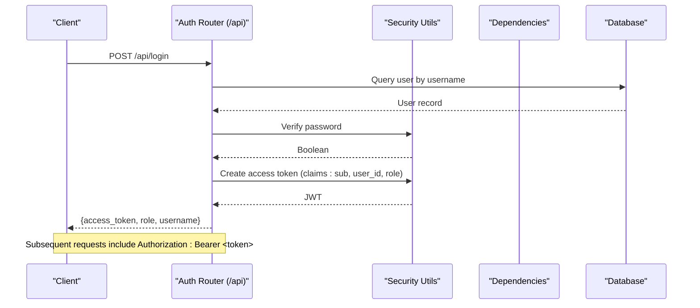
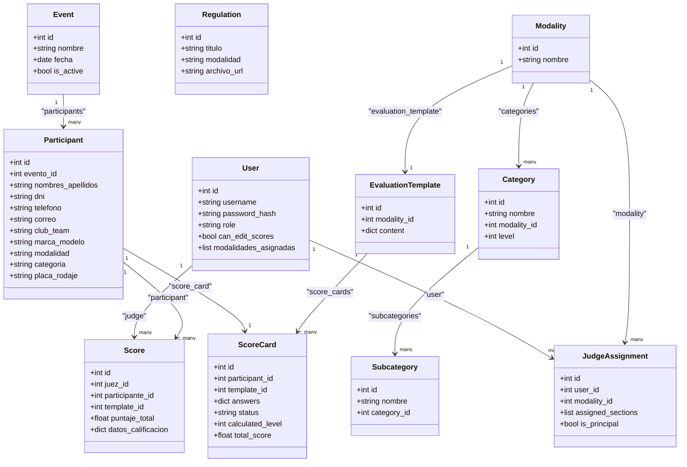

# Backend API Reference

<cite>
**Referenced Files in This Document**
- [main.py](file://main.py)
- [routes/auth.py](file://routes/auth.py)
- [routes/events.py](file://routes/events.py)
- [routes/participants.py](file://routes/participants.py)
- [routes/scorecards.py](file://routes/scorecards.py)
- [routes/evaluation_templates.py](file://routes/evaluation_templates.py)
- [routes/regulations.py](file://routes/regulations.py)
- [routes/users.py](file://routes/users.py)
- [routes/modalities.py](file://routes/modalities.py)
- [routes/categories.py](file://routes/categories.py)
- [routes/judge_assignments.py](file://routes/judge_assignments.py)
- [schemas.py](file://schemas.py)
- [models.py](file://models.py)
- [utils/security.py](file://utils/security.py)
- [utils/dependencies.py](file://utils/dependencies.py)
- [database.py](file://database.py)
- [seed.py](file://seed.py)
- [requirements.txt](file://requirements.txt)
- [start.sh](file://start.sh)
</cite>

## Update Summary
**Changes Made**
- Added comprehensive documentation for new API endpoints: categories, modalities, judge assignments, evaluation templates, and regulations
- Enhanced existing endpoints with improved functionality and security enforcement
- Updated scorecards API with advanced scoring system, section validation, and automated categorization
- Integrated new route configurations and improved endpoint coverage for category management
- Added detailed error handling and validation rules for all new endpoints
- Enhanced participant management with category integration and hierarchical structure support

## Table of Contents
1. [Introduction](#introduction)
2. [Project Structure](#project-structure)
3. [Core Components](#core-components)
4. [Architecture Overview](#architecture-overview)
5. [Detailed Component Analysis](#detailed-component-analysis)
6. [Dependency Analysis](#dependency-analysis)
7. [Performance Considerations](#performance-considerations)
8. [Troubleshooting Guide](#troubleshooting-guide)
9. [Conclusion](#conclusion)
10. [Appendices](#appendices)

## Introduction
This document describes the Juzgamiento backend REST API. It covers authentication, event management, participant operations, scoring system, template management, category management, regulation handling, evaluation template management, judge assignment management, scorecard operations, and user administration. It specifies HTTP methods, URL patterns, request/response schemas, authentication requirements, role-based access control (admin and judge), CORS configuration, rate limiting considerations, and security practices. Practical examples with curl commands and expected responses are included.

## Project Structure
The backend is a FastAPI application with modular route groups and shared utilities for security and dependency injection. The database is SQLite with SQLAlchemy ORM models and migrations. The application now includes comprehensive category management with hierarchical modalities, categories, and subcategories, along with regulation management for PDF document handling, evaluation template management for master templates, judge assignment management for section-based scoring, and advanced scorecard operations with automated categorization.

```mermaid
graph TB
subgraph "Application"
A["main.py<br/>App init, CORS, routers"]
B["routes/auth.py<br/>/api/login"]
C["routes/events.py<br/>/api/events"]
D["routes/participants.py<br/>/api/participants"]
E["routes/scorecards.py<br/>/api/scorecards"]
F["routes/evaluation_templates.py<br/>/api/evaluation-templates"]
G["routes/users.py<br/>/api/users"]
H["routes/regulations.py<br/>/api/regulations"]
I["routes/modalities.py<br/>/api/modalities"]
J["routes/categories.py<br/>/api/modalities (categories)"]
K["routes/judge_assignments.py<br/>/api/judge-assignments"]
L["routes/scores.py<br/>/api/scores"]
M["routes/templates.py<br/>/api/templates"]
end
subgraph "Utilities"
U1["utils/security.py<br/>JWT, hashing"]
U2["utils/dependencies.py<br/>OAuth2, roles"]
end
subgraph "Persistence"
P1["database.py<br/>SQLite, engine, migrations"]
M1["models.py<br/>ORM entities"]
S1["schemas.py<br/>Pydantic models"]
end
A --> B
A --> C
A --> D
A --> E
A --> F
A --> G
A --> H
A --> I
A --> J
A --> K
A --> L
A --> M
B --> U1
C --> U2
D --> U2
E --> U2
F --> U2
G --> U2
H --> U2
I --> U2
J --> U2
K --> U2
L --> U2
M --> U2
B --> S1
C --> S1
D --> S1
E --> S1
F --> S1
G --> S1
H --> S1
I --> S1
J --> S1
K --> S1
L --> S1
M --> S1
B --> M1
C --> M1
D --> M1
E --> M1
F --> M1
G --> M1
H --> M1
I --> M1
J --> M1
K --> M1
L --> M1
M --> M1
A --> P1
B --> P1
C --> P1
D --> P1
E --> P1
F --> P1
G --> P1
H --> P1
I --> P1
J --> P1
K --> P1
L --> P1
M --> P1
```

**Diagram sources**
- [main.py:17-44](file://main.py#L17-L44)
- [routes/auth.py:10](file://routes/auth.py#L10)
- [routes/events.py:10](file://routes/events.py#L10)
- [routes/participants.py:21](file://routes/participants.py#L21)
- [routes/scorecards.py:20](file://routes/scorecards.py#L20)
- [routes/evaluation_templates.py:14](file://routes/evaluation_templates.py#L14)
- [routes/users.py:18](file://routes/users.py#L18)
- [routes/regulations.py:15](file://routes/regulations.py#L15)
- [routes/modalities.py:16](file://routes/modalities.py#L16)
- [routes/categories.py:9](file://routes/categories.py#L9)
- [routes/judge_assignments.py:12](file://routes/judge_assignments.py#L12)

**Section sources**
- [main.py:17-44](file://main.py#L17-L44)
- [database.py:20-33](file://database.py#L20-L33)

## Core Components
- Authentication and Authorization
  - OAuth2 Bearer tokens issued via JWT.
  - Roles: admin and judge.
  - Token validation middleware and role guards.
- Data Models
  - Users, Events, Participants, EvaluationTemplates, Scores, Regulations, Modalities, Categories, Subcategories, JudgeAssignments, ScoreCards.
- Request/Response Schemas
  - Pydantic models define request/response shapes and validation rules.
- Database
  - SQLite with SQLAlchemy ORM and runtime migrations for schema compatibility.

**Section sources**
- [utils/security.py:9-35](file://utils/security.py#L9-L35)
- [utils/dependencies.py:12-70](file://utils/dependencies.py#L12-L70)
- [schemas.py:10-267](file://schemas.py#L10-L267)
- [models.py:11-225](file://models.py#L11-L225)
- [database.py:36-93](file://database.py#L36-L93)

## Architecture Overview
High-level API architecture and data flow.

**Diagram sources**
- [routes/auth.py:13-35](file://routes/auth.py#L13-L35)
- [utils/security.py:22-35](file://utils/security.py#L22-L35)
- [utils/dependencies.py:12-20](file://utils/dependencies.py#L12-L20)

## Detailed Component Analysis

### Authentication: /api/login
- Method: POST
- URL: /api/login
- Request body: LoginRequest
  - username: string (min length 3, max 100)
  - password: string (min length 4, max 128)
- Response: TokenResponse
  - access_token: string
  - token_type: string ("bearer")
  - role: "admin" | "juez"
  - username: string
  - can_edit_scores: boolean
- Security
  - Validates credentials against stored hash.
  - Returns 401 Unauthorized with WWW-Authenticate header on failure.
- Example curl
  - curl -X POST "$BASE_URL/api/login" -H "Content-Type: application/json" -d '{"username":"<user>","password":"<pass>"}'
- Expected response
  - 200 OK with {access_token, token_type, role, username, can_edit_scores}
  - 401 Unauthorized on invalid credentials

**Section sources**
- [routes/auth.py:13-35](file://routes/auth.py#L13-L35)
- [schemas.py:10-20](file://schemas.py#L10-L20)
- [schemas.py:15-20](file://schemas.py#L15-L20)
- [utils/security.py:22-35](file://utils/security.py#L22-L35)

### Events: /api/events
- List events
  - GET /api/events
  - Requires: authenticated user
  - Response: array of EventResponse
- Create event
  - POST /api/events
  - Requires: admin
  - Request body: EventCreate
    - nombre: string (1–150)
    - fecha: date
    - is_active: boolean (default true)
  - Response: EventResponse
- Update event
  - PATCH /api/events/{event_id}
  - Requires: admin
  - Request body: EventUpdate
    - nombre?: string (1–150)
    - fecha?: date
    - is_active?: boolean
  - Response: EventResponse
  - Errors: 404 Not Found if event does not exist; 400 Bad Request if no fields provided
- Example curl
  - curl -X POST "$BASE_URL/api/events" -H "Authorization: Bearer $TOKEN" -H "Content-Type: application/json" -d '{"nombre":"Test","fecha":"2025-12-25","is_active":true}'
  - curl -X PATCH "$BASE_URL/api/events/1" -H "Authorization: Bearer $TOKEN" -H "Content-Type: application/json" -d '{"is_active":false}'

**Section sources**
- [routes/events.py:13-74](file://routes/events.py#L13-L74)
- [schemas.py:47-66](file://schemas.py#L47-L66)
- [schemas.py:53-59](file://schemas.py#L53-L59)

### Participants: /api/participants
- Create participant
  - POST /api/participants
  - Requires: admin
  - Request body: ParticipantCreate
  - Response: ParticipantResponse
  - Constraints: Unique combination of evento_id and placa_rodaje per event
- Update participant
  - PUT /api/participants/{participant_id}
  - Requires: authenticated user
  - Request body: ParticipantUpdate
  - Response: ParticipantResponse
  - Behavior: Admin can update all fields; judge can only update modalidad and categoria
- Update participant name only
  - PATCH /api/participants/{participant_id}/nombre
  - Requires: admin
  - Request body: ParticipantNameUpdate
  - Response: ParticipantResponse
- Delete participant
  - DELETE /api/participants/{participant_id}
  - Requires: admin
  - Response: Success message
- List participants
  - GET /api/participants
  - Query params: evento_id?, modalidad?, categoria?
  - Requires: authenticated user
  - Response: array of ParticipantResponse
- Bulk upload Excel
  - POST /api/participants/upload
  - Requires: admin
  - Form fields:
    - file: .xlsx (only)
    - evento_id: int
  - Response: ParticipantUploadResponse
  - Validation rules:
    - Columns are matched by flexible aliases (case-insensitive, diacritics normalized)
    - Required columns must be present; optional columns are ignored if missing
    - Duplicate plates within the same event cause skip entries
- Example curl
  - curl -X POST "$BASE_URL/api/participants" -H "Authorization: Bearer $TOKEN" -H "Content-Type: application/json" -d '{"evento_id":1,"nombres_apellidos":"...","marca_modelo":"...","modalidad":"...","categoria":"...","placa_rodaje":"..."}'
  - curl -X POST "$BASE_URL/api/participants/upload" -H "Authorization: Bearer $TOKEN" -F "file=@data.xlsx" -F "evento_id=1"

**Section sources**
- [routes/participants.py:181-230](file://routes/participants.py#L181-L230)
- [routes/participants.py:202-230](file://routes/participants.py#L202-L230)
- [routes/participants.py:233-256](file://routes/participants.py#L233-L256)
- [routes/participants.py:259-283](file://routes/participants.py#L259-L283)
- [routes/participants.py:271-287](file://routes/participants.py#L271-L287)
- [routes/participants.py:289-314](file://routes/participants.py#L289-L314)
- [routes/participants.py:316-430](file://routes/participants.py#L316-L430)
- [schemas.py:84-103](file://schemas.py#L84-L103)
- [schemas.py:68-81](file://schemas.py#L68-L81)
- [schemas.py:110-116](file://schemas.py#L110-L116)

### Evaluation Templates: /api/evaluation-templates
- List evaluation templates
  - GET /api/evaluation-templates
  - Requires: authenticated user
  - Response: array of EvaluationTemplateAdminResponse
  - Behavior: Returns templates with modality names loaded via joinedload
- Get evaluation template by ID
  - GET /api/evaluation-templates/{template_id}
  - Requires: authenticated user
  - Response: EvaluationTemplateAdminResponse
  - Errors: 404 Not Found if template doesn't exist
- Get evaluation template by modality
  - GET /api/evaluation-templates/by-modality/{modality_id}
  - Requires: authenticated user
  - Response: EvaluationTemplateAdminResponse
  - Errors: 404 Not Found if template doesn't exist for the specified modality
- Create evaluation template
  - POST /api/evaluation-templates
  - Requires: admin
  - Request body: EvaluationTemplateCreate
    - modality_id: int
    - content: dict (JSON content for evaluation form)
  - Response: EvaluationTemplateAdminResponse
  - Validation:
    - Each modality can have only one master template
    - Automatically adds modality name to content
    - Sanitizes content structure
  - Errors: 404 Not Found for missing modality; 409 Conflict if template already exists
- Update evaluation template
  - PUT /api/evaluation-templates/{template_id}
  - Requires: admin
  - Request body: EvaluationTemplateUpdate
    - content: dict (JSON content for evaluation form)
  - Response: EvaluationTemplateAdminResponse
  - Behavior: Sanitizes content and sets modality name if available
  - Errors: 404 Not Found if template doesn't exist
- Example curl
  - curl "$BASE_URL/api/evaluation-templates" -H "Authorization: Bearer $TOKEN"
  - curl "$BASE_URL/api/evaluation-templates/1" -H "Authorization: Bearer $TOKEN"
  - curl "$BASE_URL/api/evaluation-templates/by-modality/1" -H "Authorization: Bearer $TOKEN"
  - curl -X POST "$BASE_URL/api/evaluation-templates" -H "Authorization: Bearer $TOKEN" -H "Content-Type: application/json" -d '{"modality_id":1,"content":{"sections":[{"name":"Technical Assessment","criteria":[{"name":"Engine Performance","max_points":10},{"name":"Sound Quality","max_points":10}]}]}}'
  - curl -X PUT "$BASE_URL/api/evaluation-templates/1" -H "Authorization: Bearer $TOKEN" -H "Content-Type: application/json" -d '{"content":{"sections":[{"name":"Technical Assessment","criteria":[{"name":"Engine Performance","max_points":10},{"name":"Sound Quality","max_points":10}]}]}}'

**Section sources**
- [routes/evaluation_templates.py:42-53](file://routes/evaluation_templates.py#L42-L53)
- [routes/evaluation_templates.py:103-120](file://routes/evaluation_templates.py#L103-L120)
- [routes/evaluation_templates.py:123-140](file://routes/evaluation_templates.py#L123-L140)
- [routes/evaluation_templates.py:143-171](file://routes/evaluation_templates.py#L143-L171)
- [schemas.py:180-194](file://schemas.py#L180-L194)
- [models.py:115-129](file://models.py#L115-L129)

### Modalities, Categories, and Subcategories: /api/modalities
- List modalities with nested categories
  - GET /api/modalities
  - Requires: authenticated user
  - Response: array of ModalityResponse
  - Behavior: Returns modalities with nested categories loaded via joinedload
- Create modality
  - POST /api/modalities
  - Requires: admin
  - Request body: ModalityCreate
    - nombre: string (1–100)
  - Response: ModalityResponse
  - Errors: 400 Bad Request if modality name already exists
- Create category within modality
  - POST /api/modalities/{modality_id}/categories
  - Requires: admin
  - Request body: CategoryCreate
    - nombre: string (1–100)
    - level: int (1–4, default 1)
  - Response: CategoryResponse
  - Errors: 404 Not Found if modality doesn't exist; 400 Bad Request if category name already exists in that modality
- Update category
  - PUT /api/modalities/categories/{category_id}
  - Requires: admin
  - Request body: CategoryUpdate
    - nombre?: string (1–100)
    - level?: int (1–4)
  - Response: CategoryResponse
  - Validation: Name uniqueness checked within same modality
  - Errors: 404 Not Found if category doesn't exist
- Delete modality (with cascade)
  - DELETE /api/modalities/{modality_id}
  - Requires: admin
  - Response: Success message
  - Behavior: Deletes modality and all its categories (cascade)
- Delete category
  - DELETE /api/modalities/categories/{category_id}
  - Requires: admin
  - Response: Success message
  - Errors: 404 Not Found if category doesn't exist
- Example curl
  - curl -X POST "$BASE_URL/api/modalities" -H "Authorization: Bearer $TOKEN" -H "Content-Type: application/json" -d '{"nombre":"Open"}'
  - curl -X POST "$BASE_URL/api/modalities/1/categories" -H "Authorization: Bearer $TOKEN" -H "Content-Type: application/json" -d '{"nombre":"Production","level":1}'
  - curl -X PUT "$BASE_URL/api/modalities/categories/1" -H "Authorization: Bearer $TOKEN" -H "Content-Type: application/json" -d '{"level":2}'
  - curl -X DELETE "$BASE_URL/api/modalities/1" -H "Authorization: Bearer $TOKEN"
  - curl -X DELETE "$BASE_URL/api/modalities/categories/1" -H "Authorization: Bearer $TOKEN"

**Section sources**
- [routes/modalities.py:19-33](file://routes/modalities.py#L19-L33)
- [routes/modalities.py:36-54](file://routes/modalities.py#L36-L54)
- [routes/modalities.py:57-94](file://routes/modalities.py#L57-L94)
- [routes/modalities.py:97-134](file://routes/modalities.py#L97-L134)
- [routes/modalities.py:137-153](file://routes/modalities.py#L137-L153)
- [routes/modalities.py:156-172](file://routes/modalities.py#L156-L172)
- [routes/modalities.py:175-191](file://routes/modalities.py#L175-L191)
- [schemas.py:165-170](file://schemas.py#L165-L170)
- [models.py:174-225](file://models.py#L174-L225)

### Categories: /api/modalities (categories)
- List modalities with nested categories
  - GET /api/modalities
  - Requires: authenticated user
  - Response: array of ModalityResponse
  - Behavior: Returns modalities with nested categories loaded via joinedload
- Create modality
  - POST /api/modalities
  - Requires: admin
  - Request body: ModalityCreate
    - nombre: string (1–100)
  - Response: ModalityResponse
  - Errors: 400 Bad Request if modality name already exists
- Create category within modality
  - POST /api/modalities/{modality_id}/categories
  - Requires: admin
  - Request body: CategoryCreate
    - nombre: string (1–100)
    - level: int (1–4, default 1)
  - Response: CategoryResponse
  - Errors: 404 Not Found if modality doesn't exist; 400 Bad Request if category name already exists in that modality
- Update category
  - PUT /api/modalities/categories/{category_id}
  - Requires: admin
  - Request body: CategoryUpdate
    - nombre?: string (1–100)
    - level?: int (1–4)
  - Response: CategoryResponse
  - Validation: Name uniqueness checked within same modality
  - Errors: 404 Not Found if category doesn't exist
- Delete category
  - DELETE /api/modalities/categories/{category_id}
  - Requires: admin
  - Response: Success message
  - Errors: 404 Not Found if category doesn't exist
- Delete modality (with cascade)
  - DELETE /api/modalities/{modality_id}
  - Requires: admin
  - Response: Success message
  - Behavior: Deletes modality and all its categories (cascade)
- Example curl
  - curl -X POST "$BASE_URL/api/modalities" -H "Authorization: Bearer $TOKEN" -H "Content-Type: application/json" -d '{"nombre":"Open"}'
  - curl -X POST "$BASE_URL/api/modalities/1/categories" -H "Authorization: Bearer $TOKEN" -H "Content-Type: application/json" -d '{"nombre":"Production","level":1}'
  - curl -X PUT "$BASE_URL/api/modalities/categories/1" -H "Authorization: Bearer $TOKEN" -H "Content-Type: application/json" -d '{"level":2}'
  - curl -X DELETE "$BASE_URL/api/modalities/1" -H "Authorization: Bearer $TOKEN"
  - curl -X DELETE "$BASE_URL/api/modalities/categories/1" -H "Authorization: Bearer $TOKEN"

**Section sources**
- [routes/categories.py:12-24](file://routes/categories.py#L12-L24)
- [routes/categories.py:27-45](file://routes/categories.py#L27-L45)
- [routes/categories.py:48-85](file://routes/categories.py#L48-L85)
- [routes/categories.py:88-104](file://routes/categories.py#L88-L104)
- [routes/categories.py:107-124](file://routes/categories.py#L107-L124)
- [routes/categories.py:138-155](file://routes/categories.py#L138-L155)
- [routes/categories.py:157-174](file://routes/categories.py#L157-L174)
- [schemas.py:165-170](file://schemas.py#L165-L170)
- [models.py:174-225](file://models.py#L174-L225)

### Regulations: /api/regulations
- Upload regulation PDF
  - POST /api/regulations
  - Requires: admin
  - Form fields:
    - titulo: string (title of regulation)
    - modalidad: string (category/competition type)
    - file: UploadFile (PDF only)
  - Response: RegulationResponse
  - Validation:
    - Only PDF files are accepted
    - Generates unique filename using UUID
    - Stores file in uploads directory
    - Creates database record with archivo_url pointing to uploaded file
- List regulations
  - GET /api/regulations
  - Query params: modalidad? (optional filter)
  - Requires: authenticated user
  - Response: array of RegulationResponse
  - Sorting: ordered by modalidad ascending, then titulo ascending
- Delete regulation
  - DELETE /api/regulations/{regulation_id}
  - Requires: admin
  - Response: Success message
  - Behavior: Deletes both database record and physical file from uploads directory
- Example curl
  - curl -X POST "$BASE_URL/api/regulations" -H "Authorization: Bearer $TOKEN" -F "titulo=Test Regulation" -F "modalidad=Open" -F "file=@regulation.pdf"
  - curl "$BASE_URL/api/regulations?modalidad=Open" -H "Authorization: Bearer $TOKEN"
  - curl -X DELETE "$BASE_URL/api/regulations/1" -H "Authorization: Bearer $TOKEN"

**Section sources**
- [routes/regulations.py:20-64](file://routes/regulations.py#L20-L64)
- [routes/regulations.py:67-79](file://routes/regulations.py#L67-L79)
- [routes/regulations.py:82-109](file://routes/regulations.py#L82-L109)
- [schemas.py:122-128](file://schemas.py#L122-L128)
- [models.py:165-173](file://models.py#L165-L173)

### Judge Assignments: /api/judge-assignments
- List judge assignments
  - GET /api/judge-assignments
  - Requires: admin
  - Response: array of JudgeAssignmentResponse
  - Behavior: Returns assignments with user and modality names loaded via joinedload
- Get my judge assignment
  - GET /api/judge-assignments/me
  - Query params: modality_id (required)
  - Requires: judge
  - Response: JudgeAssignmentResponse
  - Errors: 404 Not Found if no assignment exists for the judge and modality
- Upsert judge assignment
  - POST /api/judge-assignments
  - Requires: admin
  - Request body: JudgeAssignmentUpsertRequest
    - user_id: int
    - modality_id: int
    - assigned_sections: array of strings
    - is_principal: boolean (default false)
  - Response: JudgeAssignmentResponse
  - Validation:
    - Only users with role "juez" can be assigned
    - Template must exist for the modality
    - At least one valid section must be assigned
    - Principal judge gets automatic bonus section assignment
    - Bonus section is automatically included for principal judge
  - Errors: 404 Not Found for missing user/modality; 400 Bad Request for invalid sections or missing template
- Delete judge assignment
  - DELETE /api/judge-assignments/{assignment_id}
  - Requires: admin
  - Response: Success message
  - Behavior: Also updates user's modalidades_asignadas field
- Example curl
  - curl "$BASE_URL/api/judge-assignments" -H "Authorization: Bearer $TOKEN"
  - curl "$BASE_URL/api/judge-assignments/me?modality_id=1" -H "Authorization: Bearer $TOKEN"
  - curl -X POST "$BASE_URL/api/judge-assignments" -H "Authorization: Bearer $TOKEN" -H "Content-Type: application/json" -d '{"user_id":2,"modality_id":1,"assigned_sections":["technical_assessment"],"is_principal":true}'
  - curl -X DELETE "$BASE_URL/api/judge-assignments/1" -H "Authorization: Bearer $TOKEN"

**Section sources**
- [routes/judge_assignments.py:106-130](file://routes/judge_assignments.py#L106-L130)
- [routes/judge_assignments.py:133-161](file://routes/judge_assignments.py#L133-L161)
- [routes/judge_assignments.py:164-280](file://routes/judge_assignments.py#L164-L280)
- [routes/judge_assignments.py:283-307](file://routes/judge_assignments.py#L283-L307)
- [schemas.py:203-220](file://schemas.py#L203-L220)
- [models.py:131-145](file://models.py#L131-L145)

### Scorecards: /api/scorecards
- List scorecards
  - GET /api/scorecards
  - Query params: evento_id?, modalidad?, categoria?, status_filter?
  - Requires: authenticated user
  - Response: array of ScoreCardResponseV2
  - Filtering: supports filtering by event, modality, category, and status
- Partial update scorecard
  - PATCH /api/scorecards/{participant_id}/partial-update
  - Requires: judge
  - Request body: ScoreCardPartialUpdateRequest
    - answers: object (key-value pairs of item_id to answer)
  - Response: ScoreCardResponseV2
  - Validation:
    - Judge must be assigned to the participant's modality
    - Judge can only edit items in their assigned sections
    - Principal judge can edit bonus items
    - Answers must be validated against template definition
    - Supports both numeric scores and categorical selections
  - Errors: 404 Not Found for missing participant; 403 Forbidden for unauthorized items; 400 Bad Request for invalid answers
- Get scorecard for participant
  - GET /api/scorecards/{participant_id}
  - Requires: judge
  - Response: ScoreCardResponseV2
  - Errors: 404 Not Found if no scorecard exists for participant
- Finalize scorecard
  - POST /api/scorecards/{participant_id}/finalize
  - Requires: judge
  - Response: ScoreCardFinalizeResponse
  - Validation:
    - Only principal judge can finalize
    - All required items must be answered
    - Calculates total score and category level
    - Updates participant category and modalidad
    - Automatically determines best category based on answers
  - Errors: 404 Not Found for missing participant; 403 Forbidden if not principal judge; 400 Bad Request for incomplete card
- Get results by modality
  - GET /api/results/{modality_id}
  - Requires: authenticated user
  - Response: ResultsByModalityResponse
  - Behavior: Groups participants by category and sorts by score
  - Filters by modality using category association or modalidad field
- Example curl
  - curl "$BASE_URL/api/scorecards?modalidad=Tuning&categoria=Pro" -H "Authorization: Bearer $TOKEN"
  - curl -X PATCH "$BASE_URL/api/scorecards/1/partial-update" -H "Authorization: Bearer $TOKEN" -H "Content-Type: application/json" -d '{"answers":{"ext_01":{"score":5,"category_level_selected":3}}}'
  - curl "$BASE_URL/api/scorecards/1" -H "Authorization: Bearer $TOKEN"
  - curl -X POST "$BASE_URL/api/scorecards/1/finalize" -H "Authorization: Bearer $TOKEN"
  - curl "$BASE_URL/api/results/1" -H "Authorization: Bearer $TOKEN"

**Section sources**
- [routes/scorecards.py:422-443](file://routes/scorecards.py#L422-L443)
- [routes/scorecards.py:445-504](file://routes/scorecards.py#L445-L504)
- [routes/scorecards.py:506-532](file://routes/scorecards.py#L506-L532)
- [routes/scorecards.py:535-608](file://routes/scorecards.py#L535-L608)
- [routes/scorecards.py:610-725](file://routes/scorecards.py#L610-L725)
- [schemas.py:226-267](file://schemas.py#L226-L267)
- [models.py:147-163](file://models.py#L147-L163)

### Users: /api/users
- Get current user profile
  - GET /api/users/me
  - Requires: authenticated user
  - Response: UserResponse
- List users
  - GET /api/users
  - Requires: admin
  - Response: array of UserResponse
- Create user
  - POST /api/users
  - Requires: admin (or first user creation)
  - Request body: UserCreate
    - username: string (3–100)
    - password: string (4–128)
    - role: "admin" | "juez"
    - can_edit_scores: boolean (default false)
    - modalidades_asignadas: list[str] (default [])
  - Response: UserResponse
  - Constraints: First user must be admin; usernames must be unique
- Update user permissions
  - PUT /api/users/{user_id}/permissions
  - Requires: admin
  - Request body: UserPermissionUpdate
    - can_edit_scores: boolean
  - Response: UserResponse
- Update user modalities (admin action)
  - PUT /api/users/{user_id}/modalidades
  - Requires: admin
  - Request body: UserModalidadesUpdate
    - modalidades_asignadas: list[str]
  - Response: UserResponse
  - Validation: Only judges can have modalities assigned
- Update user credentials (admin action)
  - PATCH /api/users/{user_id}/credentials
  - Requires: admin
  - Request body: UserCredentialsUpdate
    - username?: string (3–100)
    - password?: string (4–128)
  - Response: UserResponse
  - Constraints: At least one of username/password must be provided; username uniqueness enforced
- Update own credentials (admin-only endpoint)
  - PATCH /api/users/me/credentials
  - Requires: admin
  - Request body: UserCredentialsUpdate
    - username?: string (3–100)
    - password?: string (4–128)
  - Response: UserResponse
- Change own password
  - PUT /api/users/me/password
  - Requires: authenticated user
  - Request body: PasswordChangeRequest
    - current_password: string (4–128)
    - new_password: string (4–128)
  - Response: UserResponse
  - Validation: Current password must be verified before changing
- Example curl
  - curl -X POST "$BASE_URL/api/users" -H "Authorization: Bearer $TOKEN" -H "Content-Type: application/json" -d '{"username":"judge1","password":"pass","role":"juez","can_edit_scores":false}'
  - curl -X PATCH "$BASE_URL/api/users/2/credentials" -H "Authorization: Bearer $TOKEN" -H "Content-Type: application/json" -d '{"username":"newname"}'

**Section sources**
- [routes/users.py:21-191](file://routes/users.py#L21-L191)
- [routes/users.py:190-257](file://routes/users.py#L190-L257)
- [schemas.py:22-45](file://schemas.py#L22-L45)
- [schemas.py:29-35](file://schemas.py#L29-L35)
- [schemas.py:38-40](file://schemas.py#L38-L40)
- [schemas.py:42-45](file://schemas.py#L42-L45)

## Dependency Analysis
- Authentication and Authorization
  - OAuth2PasswordBearer tokenUrl points to /api/login.
  - get_current_user decodes token and loads user from DB.
  - get_current_admin/get_current_judge enforce role checks.
- Data Models and Relationships
  - Users (role, can_edit_scores), Events, Participants (unique plate per event), EvaluationTemplates (one-to-one with Modalities), Scores (unique judge+participant), Regulations (PDF documents), Modalities, Categories (one-to-many relationship), Subcategories (one-to-many relationship), JudgeAssignments (many-to-many), ScoreCards (one-to-one with Participants).
- Request/Response Schemas
  - Strong typing ensures consistent payloads and responses across endpoints.

**Diagram sources**
- [models.py:11-225](file://models.py#L11-L225)

**Section sources**
- [utils/dependencies.py:12-70](file://utils/dependencies.py#L12-L70)
- [models.py:11-225](file://models.py#L11-L225)

## Performance Considerations
- Token validation occurs on each protected endpoint; caching decoded claims client-side reduces redundant server calls.
- Bulk operations (e.g., participant uploads) process dataframes and batch writes; ensure adequate memory for large files.
- Queries use indexes on frequently filtered fields (e.g., participant names, event IDs, template keys).
- SQLite is suitable for development and small scale; consider connection pooling and migration strategies for production.
- File uploads for regulations are stored on disk; ensure adequate storage space and consider implementing file size limits.
- Modalities, categories, and subcategories operations use joinedload to efficiently load nested relationships in a single query.
- Evaluation templates use joinedload to include modality names in responses for better performance.
- Judge assignments and score cards leverage foreign key relationships for efficient querying.
- Scorecard operations include template validation and score calculation that may require additional processing time for complex templates.
- Category resolution uses level-based lookup for efficient category determination.

## Troubleshooting Guide
- Authentication failures
  - 401 Unauthorized: Invalid username/password or malformed/expired token.
  - 403 Forbidden: Insufficient role (admin/judge) for requested endpoint.
- Validation errors
  - 400 Bad Request: Missing required fields, invalid file type (.xlsx), empty Excel, or conflicting data (e.g., duplicate plate).
  - 400 Bad Request: PDF upload failed due to invalid file type or file size limits.
  - 400 Bad Request: Modality, category, or subcategory name already exists.
  - 400 Bad Request: Evaluation template content validation failed.
  - 400 Bad Request: Judge assignment validation failed (invalid sections, missing template).
  - 400 Bad Request: Scorecard validation failed (invalid answers, out of range scores).
  - 400 Bad Request: Scorecard finalization failed (missing items, incomplete card).
- Resource not found
  - 404 Not Found: Event, participant, template, user, regulation, modality, category, subcategory, evaluation template, or scorecard not found.
- Conflict
  - 409 Conflict: Username or plate already exists.
  - 409 Conflict: Evaluation template already exists for the modality.
- CORS
  - Cross-origin requests are allowed from any origin for development; adjust origins in production deployments.
- Rate limiting
  - Not implemented in code; consider adding rate limiting middleware for production.
- Health check
  - GET /health returns {"status":"ok"} for service readiness verification.
- File handling
  - Uploads directory must exist and be writable; the application creates it automatically during startup.
  - PDF files are stored in uploads directory with UUID-based filenames for uniqueness.
  - Static file serving is configured for the uploads directory.

**Section sources**
- [routes/auth.py:17-21](file://routes/auth.py#L17-L21)
- [utils/dependencies.py:32-47](file://utils/dependencies.py#L32-L47)
- [routes/participants.py:295-320](file://routes/participants.py#L295-L320)
- [routes/participants.py:175-178](file://routes/participants.py#L175-L178)
- [routes/regulations.py:29-34](file://routes/regulations.py#L29-L34)
- [routes/modalities.py:34-39](file://routes/modalities.py#L34-L39)
- [routes/modalities.py:75-79](file://routes/modalities.py#L75-L79)
- [routes/modalities.py:116-120](file://routes/modalities.py#L116-L120)
- [routes/evaluation_templates.py:52-56](file://routes/evaluation_templates.py#L52-L56)
- [routes/evaluation_templates.py:72-76](file://routes/evaluation_templates.py#L72-L76)
- [routes/judge_assignments.py:170-180](file://routes/judge_assignments.py#L170-L180)
- [routes/judge_assignments.py:212-216](file://routes/judge_assignments.py#L212-L216)
- [routes/scorecards.py:140-154](file://routes/scorecards.py#L140-L154)
- [routes/scorecards.py:208-213](file://routes/scorecards.py#L208-L213)
- [routes/scorecards.py:436-440](file://routes/scorecards.py#L436-L440)
- [main.py:19-25](file://main.py#L19-L25)

## Conclusion
The Juzgamiento backend provides a comprehensive REST API for managing audio and tuning competitions. It supports role-based access control, secure authentication via JWT, and structured CRUD operations across events, participants, evaluation templates, modalities, categories, subcategories, regulations, scoring, judge assignments, scorecards, and user administration. The enhanced category management system now supports a hierarchical structure with modalities, categories, and subcategories, while the regulation management system handles PDF document storage and retrieval. The evaluation template management system provides master template administration for standardized evaluation forms. The judge assignment system enables section-based scoring with validation and principal judge privileges. The scorecard system offers advanced scoring with automated categorization, section-based permissions, and comprehensive result reporting. The template operations have been expanded with comprehensive CRUD functionality. Production deployments should configure CORS, implement rate limiting, and manage file storage for PDF uploads.

## Appendices

### Authentication and Headers
- Include Authorization header for protected endpoints:
  - Authorization: Bearer <access_token>
- Obtain token from /api/login.

**Section sources**
- [routes/auth.py:13-35](file://routes/auth.py#L13-L35)
- [utils/dependencies.py:12-20](file://utils/dependencies.py#L12-L20)

### CORS Configuration
- Development allows all origins/methods/headers.
- Adjust allow_origins for production environments.

**Section sources**
- [main.py:19-25](file://main.py#L19-L25)

### Environment Variables and Secrets
- JWT_SECRET_KEY: Used to sign tokens.
- ACCESS_TOKEN_EXPIRE_MINUTES: Token lifetime in minutes.
- Database: SQLite app.db created automatically.

**Section sources**
- [utils/security.py:9-14](file://utils/security.py#L9-L14)
- [database.py:12](file://database.py#L12)

### Dependencies Overview
- FastAPI, Uvicorn, SQLAlchemy, pandas, openpyxl, python-multipart, bcrypt, python-jose.

**Section sources**
- [requirements.txt:1-10](file://requirements.txt#L1-L10)

### Development Startup
- Starts backend on port 8000 and frontend on port 5173.

**Section sources**
- [start.sh:9-16](file://start.sh#L9-L16)

### File Uploads and Storage
- Uploads directory is automatically created during application startup.
- PDF files are stored with UUID-based filenames to prevent conflicts.
- Static file serving is configured for the uploads directory.

**Section sources**
- [main.py:18-19](file://main.py#L18-L19)
- [main.py:47](file://main.py#L47)
- [routes/regulations.py:36-39](file://routes/regulations.py#L36-L39)

### Seed Data
- Official templates are seeded during initialization with predefined structures for different modalities and categories.
- Template structures include sections with criteria and maximum points for quality assessment.
- Evaluation templates provide standardized master templates for different modalities.
- Categories are pre-populated with standard levels (Intro: 1, Aficionado: 2, Pro: 3, Master: 4).

**Section sources**
- [seed.py:57-199](file://seed.py#L57-L199)
- [seed.py:202-266](file://seed.py#L202-L266)