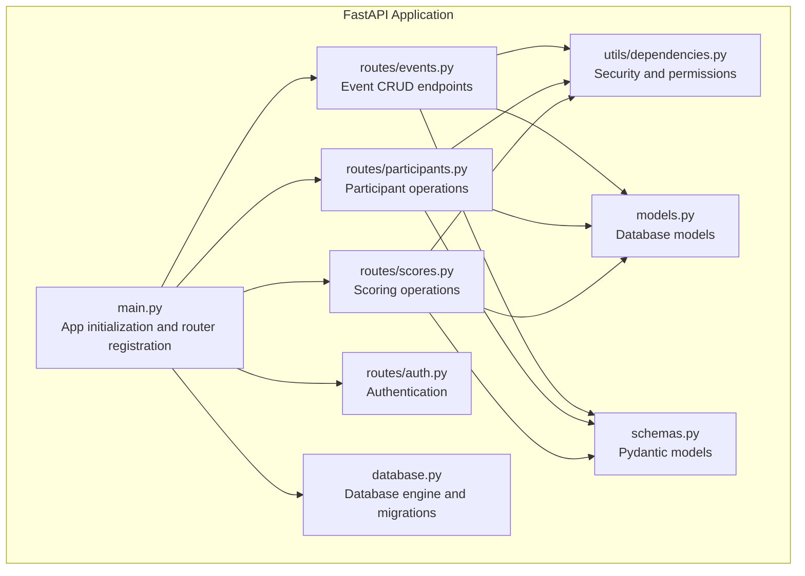
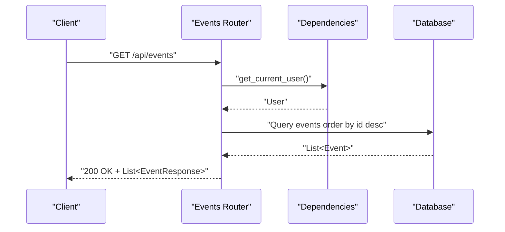
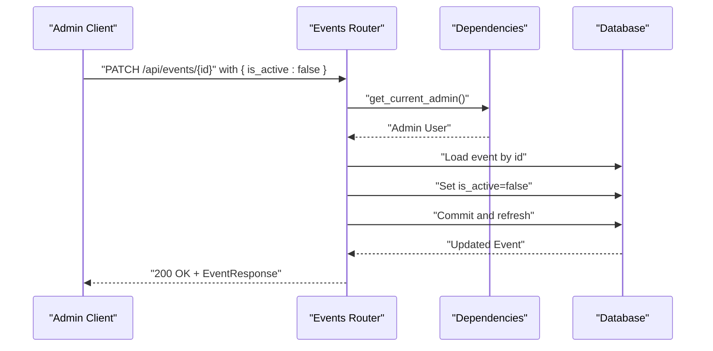
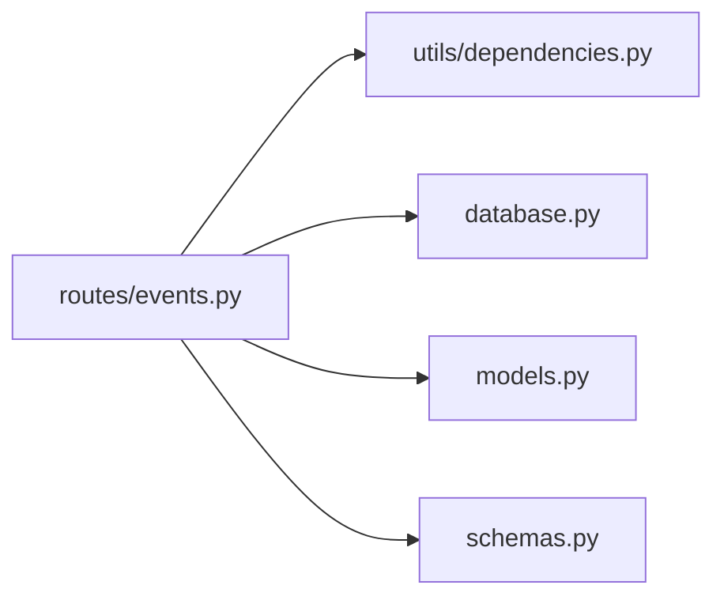

# Event Management API

<cite>
**Referenced Files in This Document**
- [main.py](file://main.py)
- [routes/events.py](file://routes/events.py)
- [routes/participants.py](file://routes/participants.py)
- [routes/scores.py](file://routes/scores.py)
- [routes/auth.py](file://routes/auth.py)
- [models.py](file://models.py)
- [schemas.py](file://schemas.py)
- [database.py](file://database.py)
- [utils/dependencies.py](file://utils/dependencies.py)
- [frontend/src/pages/admin/Eventos.tsx](file://frontend/src/pages/admin/Eventos.tsx)
- [frontend/src/lib/api.ts](file://frontend/src/lib/api.ts)
</cite>

## Table of Contents
1. [Introduction](#introduction)
2. [Project Structure](#project-structure)
3. [Core Components](#core-components)
4. [Architecture Overview](#architecture-overview)
5. [Detailed Component Analysis](#detailed-component-analysis)
6. [Dependency Analysis](#dependency-analysis)
7. [Performance Considerations](#performance-considerations)
8. [Troubleshooting Guide](#troubleshooting-guide)
9. [Conclusion](#conclusion)

## Introduction
This document provides comprehensive API documentation for event management operations. It covers all CRUD endpoints for events, including listing with ordering, creating events, retrieving specific events, updating events, and deleting events. It also documents event activation/deactivation endpoints, search/filtering capabilities, request/response schemas, validation rules, business logic constraints, and error handling scenarios such as duplicate events, invalid dates, and permission restrictions.

## Project Structure
The backend is a FastAPI application structured around modular routers for different resources. The event management functionality is primarily implemented under the events router, with supporting models, schemas, and database utilities.

**Diagram sources**
- [main.py:17-32](file://main.py#L17-L32)
- [routes/events.py:10](file://routes/events.py#L10)
- [routes/participants.py:21](file://routes/participants.py#L21)
- [routes/scores.py:13](file://routes/scores.py#L13)
- [routes/auth.py:10](file://routes/auth.py#L10)
- [utils/dependencies.py:12](file://utils/dependencies.py#L12)
- [models.py:23](file://models.py#L23)
- [schemas.py:47](file://schemas.py#L47)
- [database.py:20](file://database.py#L20)

**Section sources**
- [main.py:17-32](file://main.py#L17-L32)
- [routes/events.py:10](file://routes/events.py#L10)
- [routes/participants.py:21](file://routes/participants.py#L21)
- [routes/scores.py:13](file://routes/scores.py#L13)
- [routes/auth.py:10](file://routes/auth.py#L10)
- [utils/dependencies.py:12](file://utils/dependencies.py#L12)
- [models.py:23](file://models.py#L23)
- [schemas.py:47](file://schemas.py#L47)
- [database.py:20](file://database.py#L20)

## Core Components
- Event model: Represents an event with fields for identifier, name, date, and active status.
- Event schemas: Define validation rules for creating, updating, and responding with event data.
- Event routes: Provide endpoints for listing, creating, updating, and deleting events.
- Dependencies: Enforce authentication and authorization (admin-only for event management).
- Database: SQLite-backed ORM with automatic migrations for participant compatibility.

Key characteristics:
- Events are ordered by ID descending by default.
- Activation/deactivation is supported via PATCH updates.
- No explicit search/filter endpoint exists for events; filtering is achieved client-side or via future enhancements.

**Section sources**
- [models.py:23-32](file://models.py#L23-L32)
- [schemas.py:47](file://schemas.py#L47)
- [schemas.py:53](file://schemas.py#L53)
- [schemas.py:62](file://schemas.py#L62)
- [routes/events.py:13](file://routes/events.py#L13)
- [routes/events.py:21](file://routes/events.py#L21)
- [routes/events.py:38](file://routes/events.py#L38)
- [utils/dependencies.py:32](file://utils/dependencies.py#L32)

## Architecture Overview
The event management API follows a layered architecture:
- Router layer: Defines endpoints and request/response models.
- Dependency layer: Handles authentication and authorization checks.
- Service/data layer: Interacts with the database using SQLAlchemy ORM.
- Model/schema layer: Validates input and shapes output.

**Diagram sources**
- [routes/events.py:13](file://routes/events.py#L13)
- [utils/dependencies.py:16](file://utils/dependencies.py#L16)
- [models.py:23](file://models.py#L23)

**Section sources**
- [routes/events.py:13](file://routes/events.py#L13)
- [utils/dependencies.py:16](file://utils/dependencies.py#L16)
- [models.py:23](file://models.py#L23)

## Detailed Component Analysis

### Event Endpoints

#### GET /api/events
- Purpose: Retrieve all events ordered by ID descending.
- Authentication: Required (any authenticated user).
- Response: Array of EventResponse objects.
- Notes: No built-in server-side filtering/search is implemented.

Example usage:
- Request: GET /api/events with Authorization header.
- Response: 200 OK with array of events.

**Section sources**
- [routes/events.py:13](file://routes/events.py#L13)
- [utils/dependencies.py:16](file://utils/dependencies.py#L16)
- [schemas.py:53](file://schemas.py#L53)

#### POST /api/events
- Purpose: Create a new event.
- Authentication: Required, admin role.
- Request body: EventCreate schema.
- Response: EventResponse (201 Created).
- Validation rules:
  - nombre: required, length 1–150.
  - fecha: required date.
  - is_active: optional boolean, defaults to true.
- Business logic:
  - Name is stripped before saving.
  - Active status defaults to true if not provided.

Example request payload:
- {
  "nombre": "Grand Prix Weekend",
  "fecha": "2025-06-15",
  "is_active": true
}

**Section sources**
- [routes/events.py:21](file://routes/events.py#L21)
- [routes/events.py:27](file://routes/events.py#L27)
- [schemas.py:47](file://schemas.py#L47)
- [utils/dependencies.py:32](file://utils/dependencies.py#L32)

#### GET /api/events/{id}
- Purpose: Retrieve a specific event by ID.
- Authentication: Required (any authenticated user).
- Path parameters: id (integer).
- Response: EventResponse.
- Error handling:
  - 404 Not Found if event does not exist.

Note: The current implementation does not define a dedicated GET by ID endpoint. The frontend code demonstrates usage of PATCH for activation/deactivation, indicating that retrieval by ID is not exposed in the current backend.

**Section sources**
- [routes/events.py:13](file://routes/events.py#L13)
- [frontend/src/pages/admin/Eventos.tsx:84](file://frontend/src/pages/admin/Eventos.tsx#L84-L91)

#### PATCH /api/events/{id}
- Purpose: Update an event’s attributes (activation/deactivation).
- Authentication: Required, admin role.
- Path parameters: id (integer).
- Request body: EventUpdate schema (partial fields).
- Response: EventResponse.
- Validation rules:
  - At least one of nombre, fecha, or is_active must be provided; otherwise 400 Bad Request.
- Business logic:
  - Name is stripped before saving.
  - Only provided fields are updated.

Activation/deactivation example:
- Payload: { "is_active": false }
- Response: Updated EventResponse reflecting new is_active value.

**Section sources**
- [routes/events.py:38](file://routes/events.py#L38)
- [routes/events.py:42](file://routes/events.py#L42)
- [routes/events.py:66](file://routes/events.py#L66)
- [schemas.py:62](file://schemas.py#L62)
- [utils/dependencies.py:32](file://utils/dependencies.py#L32)

#### DELETE /api/events/{id}
- Purpose: Delete an event by ID.
- Authentication: Required, admin role.
- Path parameters: id (integer).
- Response: No content (204) or appropriate error.
- Current status: Not implemented in the backend.

Note: The frontend code does not show a delete action for events, and the backend router does not expose a DELETE endpoint.

**Section sources**
- [routes/events.py:38](file://routes/events.py#L38)
- [utils/dependencies.py:32](file://utils/dependencies.py#L32)

### Event Activation/Deactivation Workflow
The activation/deactivation feature is implemented via PATCH /api/events/{id} with is_active field. The frontend toggles the active state and updates the UI accordingly.

**Diagram sources**
- [routes/events.py:38](file://routes/events.py#L38)
- [routes/events.py:42](file://routes/events.py#L42)
- [utils/dependencies.py:32](file://utils/dependencies.py#L32)

**Section sources**
- [routes/events.py:38](file://routes/events.py#L38)
- [routes/events.py:42](file://routes/events.py#L42)
- [frontend/src/pages/admin/Eventos.tsx:75](file://frontend/src/pages/admin/Eventos.tsx#L75-L104)

### Search and Filtering Capabilities
- Events: No server-side filtering/search endpoint exists. Ordering is by ID descending.
- Participants: Filtering by evento_id, modalidad, and categoria is supported via query parameters.

Example participant filtering:
- GET /api/participants?evento_id=1&modalidad=Street&categoria=Open

**Section sources**
- [routes/events.py:13](file://routes/events.py#L13)
- [routes/participants.py:259](file://routes/participants.py#L259)

### Request/Response Schemas

#### EventCreate
- Fields:
  - nombre: string, required, length 1–150
  - fecha: date, required
  - is_active: boolean, optional, default true

**Section sources**
- [schemas.py:47](file://schemas.py#L47)

#### EventResponse
- Fields:
  - id: integer
  - nombre: string
  - fecha: date
  - is_active: boolean

**Section sources**
- [schemas.py:53](file://schemas.py#L53)

#### EventUpdate
- Fields:
  - nombre: string, optional, length 1–150
  - fecha: date, optional
  - is_active: boolean, optional

Validation rule: At least one field must be provided.

**Section sources**
- [schemas.py:62](file://schemas.py#L62)
- [routes/events.py:66](file://routes/events.py#L66)

### Business Logic Constraints
- Name normalization: Leading/trailing whitespace is removed before persistence.
- Default activation: is_active defaults to true when not provided during creation.
- Admin-only operations: Creation and updates require admin role.
- Ordering: Events are returned ordered by ID descending.

**Section sources**
- [routes/events.py:27](file://routes/events.py#L27)
- [routes/events.py:29](file://routes/events.py#L29)
- [routes/events.py:47](file://routes/events.py#L47)
- [routes/events.py:62](file://routes/events.py#L62)
- [utils/dependencies.py:32](file://utils/dependencies.py#L32)

### Example Scenarios

#### Creating an Event with Date Range Considerations
- While the Event model stores a single date, the system supports activation/deactivation to control visibility and participation eligibility.
- Example payload:
  - {
    "nombre": "Car Audio Challenge",
    "fecha": "2025-07-20",
    "is_active": true
  }

**Section sources**
- [schemas.py:47](file://schemas.py#L47)
- [routes/events.py:27](file://routes/events.py#L27)

#### Updating Event Attributes
- To change the event name and deactivation status:
  - {
    "nombre": "Updated Grand Prix",
    "is_active": false
  }

**Section sources**
- [routes/events.py:56](file://routes/events.py#L56)
- [routes/events.py:62](file://routes/events.py#L62)

#### Activating/Deactivating an Event
- Toggle is_active to true or false via PATCH.

**Section sources**
- [routes/events.py:62](file://routes/events.py#L62)
- [frontend/src/pages/admin/Eventos.tsx:75](file://frontend/src/pages/admin/Eventos.tsx#L75-L104)

### Error Handling
Common HTTP errors for event operations:
- 401 Unauthorized: Invalid or missing authentication token.
- 403 Forbidden: Non-admin attempts to create/update events.
- 404 Not Found: Event not found when updating.
- 400 Bad Request: Missing required fields or no fields provided for update.
- 409 Conflict: Not applicable for events; conflicts are handled for participants.

**Section sources**
- [utils/dependencies.py:32](file://utils/dependencies.py#L32)
- [routes/events.py:49](file://routes/events.py#L49)
- [routes/events.py:66](file://routes/events.py#L66)

## Dependency Analysis
The event management module depends on:
- Authentication and authorization utilities for enforcing admin-only access.
- Database session management for ORM operations.
- Pydantic schemas for input validation and response serialization.

**Diagram sources**
- [routes/events.py:1](file://routes/events.py#L1)
- [utils/dependencies.py:1](file://utils/dependencies.py#L1)
- [database.py:28](file://database.py#L28)
- [models.py:23](file://models.py#L23)
- [schemas.py:47](file://schemas.py#L47)

**Section sources**
- [routes/events.py:1](file://routes/events.py#L1)
- [utils/dependencies.py:1](file://utils/dependencies.py#L1)
- [database.py:28](file://database.py#L28)
- [models.py:23](file://models.py#L23)
- [schemas.py:47](file://schemas.py#L47)

## Performance Considerations
- Database queries: The list endpoint performs a simple ordered query; ensure indexes on frequently filtered columns if extended.
- Pagination: Not implemented; consider adding pagination for large datasets.
- Concurrency: Use database transactions appropriately; commits occur per operation.

## Troubleshooting Guide
- Authentication failures:
  - Ensure a valid bearer token is included in the Authorization header.
  - Verify token correctness and expiration.

- Permission denied:
  - Only users with admin role can create or update events.

- Event not found:
  - Confirm the event ID exists before attempting updates.

- Validation errors:
  - Ensure nombre length is within bounds and fecha is a valid date.
  - For updates, include at least one of nombre, fecha, or is_active.

- Frontend integration:
  - The admin page demonstrates activation toggling via PATCH; confirm the backend responds with updated EventResponse.

**Section sources**
- [routes/auth.py:13](file://routes/auth.py#L13)
- [utils/dependencies.py:32](file://utils/dependencies.py#L32)
- [routes/events.py:49](file://routes/events.py#L49)
- [routes/events.py:66](file://routes/events.py#L66)
- [frontend/src/pages/admin/Eventos.tsx:75](file://frontend/src/pages/admin/Eventos.tsx#L75-L104)

## Conclusion
The event management API provides essential CRUD operations with admin-only write access and straightforward activation/deactivation controls. While server-side filtering for events is not currently implemented, the system’s design allows for easy extension. The provided schemas, validation rules, and error handling ensure predictable behavior for clients integrating with the API.