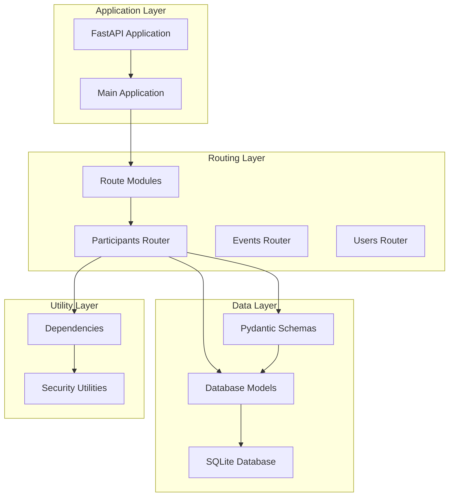
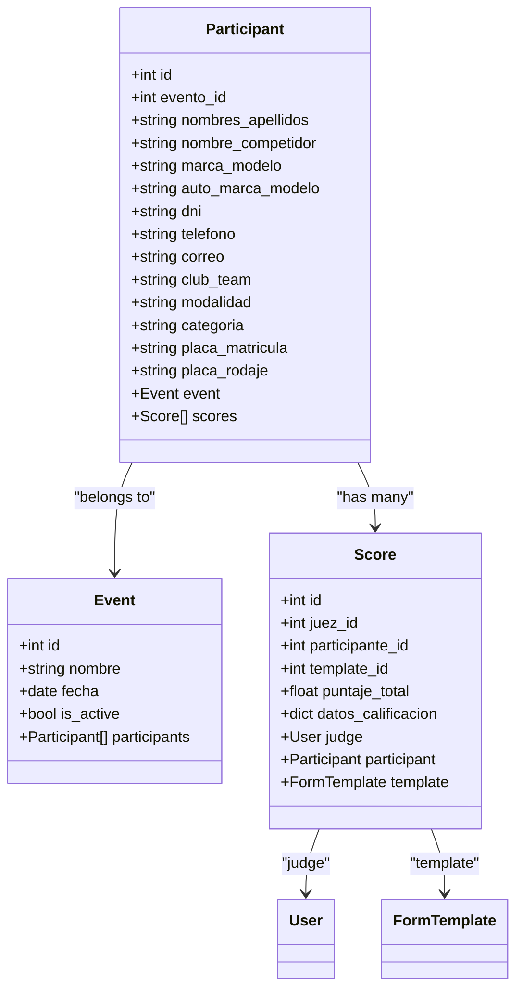
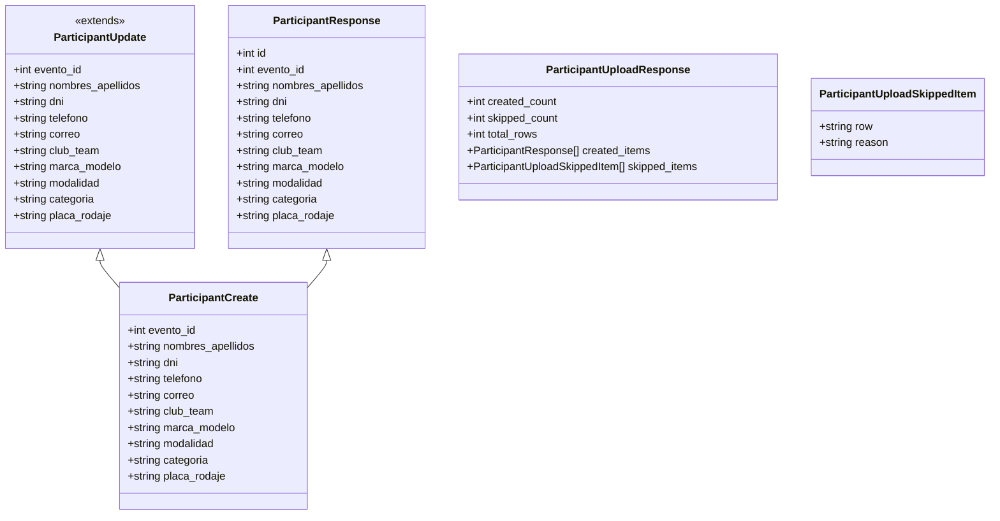
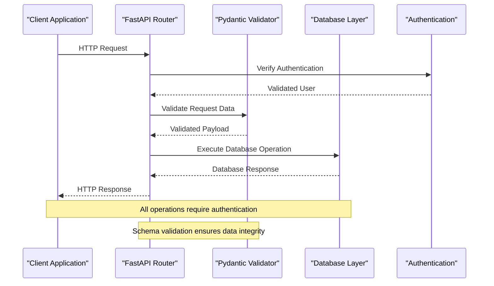
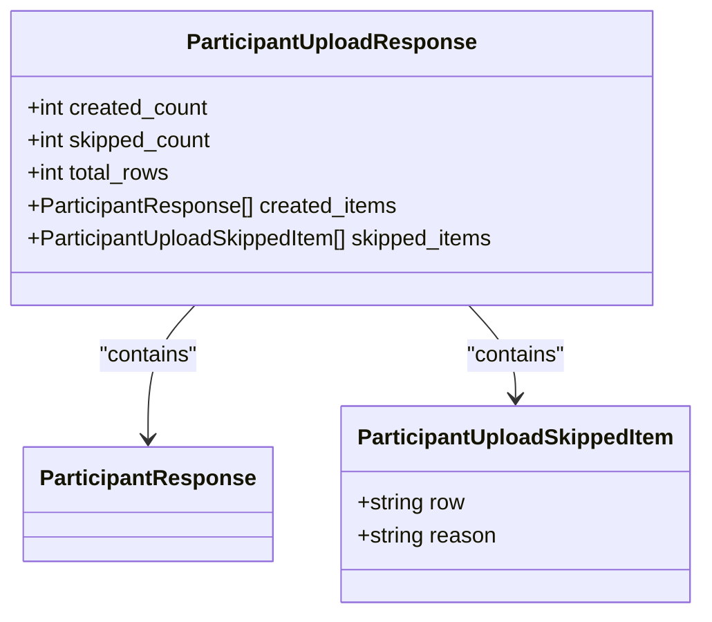
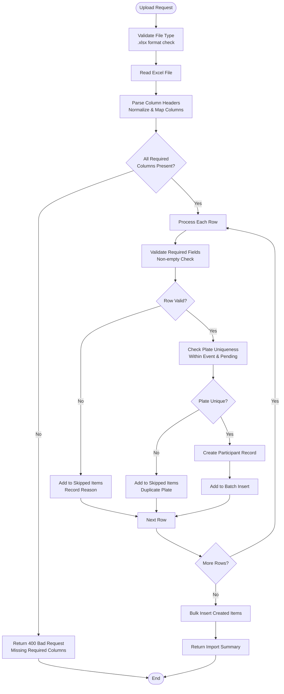
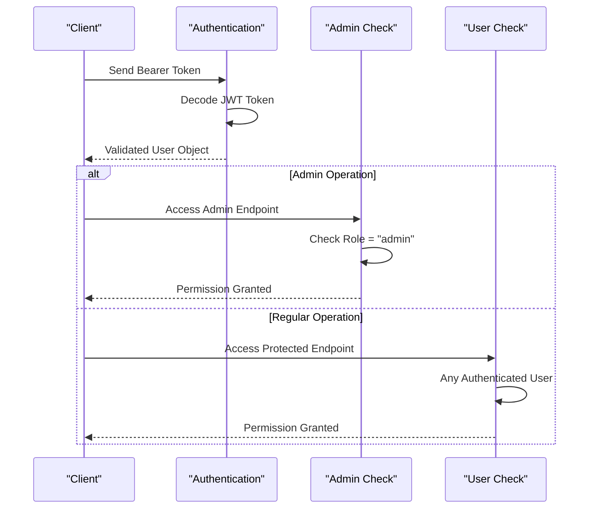
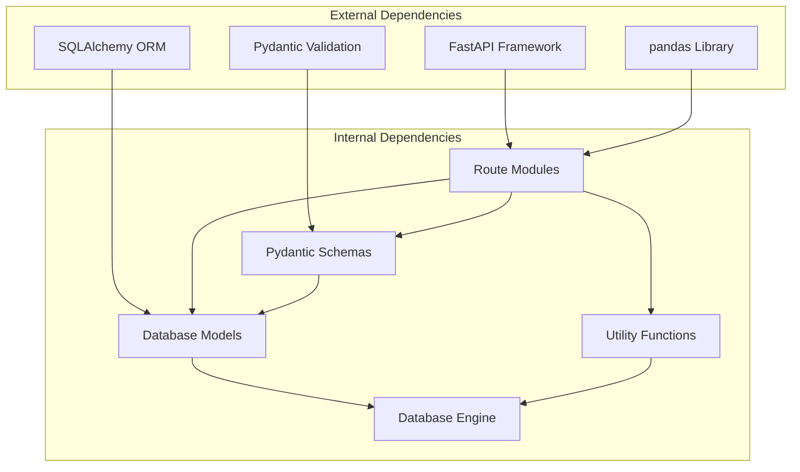

# Participant Management API

<cite>
**Referenced Files in This Document**
- [main.py](file://main.py)
- [routes/participants.py](file://routes/participants.py)
- [models.py](file://models.py)
- [schemas.py](file://schemas.py)
- [database.py](file://database.py)
- [utils/dependencies.py](file://utils/dependencies.py)
- [frontend/src/pages/admin/Participantes.tsx](file://frontend/src/pages/admin/Participantes.tsx)
- [frontend/src/lib/api.ts](file://frontend/src/lib/api.ts)
</cite>

## Table of Contents
1. [Introduction](#introduction)
2. [Project Structure](#project-structure)
3. [Core Components](#core-components)
4. [Architecture Overview](#architecture-overview)
5. [Detailed Component Analysis](#detailed-component-analysis)
6. [Dependency Analysis](#dependency-analysis)
7. [Performance Considerations](#performance-considerations)
8. [Troubleshooting Guide](#troubleshooting-guide)
9. [Conclusion](#conclusion)

## Introduction

The Participant Management API provides comprehensive functionality for managing car audio and tuning competition participants. This system enables administrators to create, update, and manage participant records, while also supporting bulk Excel import operations for efficient data management.

The API follows RESTful conventions and implements robust validation, conflict detection, and error handling mechanisms. It integrates with a SQLite database backend and provides both individual participant operations and batch processing capabilities.

## Project Structure

The API is built using FastAPI with a modular architecture:

**Diagram sources**
- [main.py:17-33](file://main.py#L17-L33)
- [routes/participants.py:21](file://routes/participants.py#L21)

**Section sources**
- [main.py:1-38](file://main.py#L1-L38)
- [routes/participants.py:1-400](file://routes/participants.py#L1-L400)

## Core Components

### Database Model: Participant

The Participant model defines the core data structure for car audio and tuning competition participants:

**Diagram sources**
- [models.py:34-62](file://models.py#L34-L62)

### Pydantic Schemas

The API uses Pydantic models for request/response validation:

**Diagram sources**
- [schemas.py:84-116](file://schemas.py#L84-L116)

**Section sources**
- [models.py:34-62](file://models.py#L34-L62)
- [schemas.py:68-116](file://schemas.py#L68-L116)

## Architecture Overview

The API follows a layered architecture pattern with clear separation of concerns:

**Diagram sources**
- [routes/participants.py:181-200](file://routes/participants.py#L181-L200)
- [utils/dependencies.py:16-38](file://utils/dependencies.py#L16-L38)

## Detailed Component Analysis

### Individual Participant Endpoints

#### POST /api/participants
Creates a new participant record with comprehensive validation and duplicate detection.

**Request Schema:**
- Content-Type: application/json
- Body: ParticipantCreate (fields validated by Pydantic)

**Response:** ParticipantResponse (201 Created)

**Validation Rules:**
- All required fields must be present and non-empty
- Event ID must reference an existing event
- Plate number must be unique within the event
- String fields have length constraints (1-150 for names, 1-50 for plates)

**Error Handling:**
- 400 Bad Request: Invalid input data
- 403 Forbidden: Non-admin user attempts operation
- 404 Not Found: Event does not exist
- 409 Conflict: Duplicate plate number in event

#### PUT /api/participants/{participant_id}
Updates an existing participant record with validation.

**Path Parameters:**
- participant_id: integer (required)

**Request Schema:** ParticipantUpdate

**Response:** ParticipantResponse (200 OK)

**Validation Rules:**
- Participant must exist
- Event ID must reference existing event
- Plate number must be unique within the event (excluding current participant)

#### PATCH /api/participants/{participant_id}/nombre
Updates only the participant's name field.

**Path Parameters:**
- participant_id: integer (required)

**Request Schema:** ParticipantNameUpdate

**Response:** ParticipantResponse (200 OK)

**Validation Rules:**
- Participant must exist
- Name field must be non-empty

#### GET /api/participants
Retrieves filtered participant lists with sorting capabilities.

**Query Parameters:**
- evento_id: integer (optional) - Filter by event
- modalidad: string (optional) - Filter by category (case-insensitive partial match)
- categoria: string (optional) - Filter by category (case-insensitive partial match)

**Response:** List of ParticipantResponse

**Sorting:** Event ID (desc), Modalidad (asc), Categoria (asc), Nombre (asc)

**Section sources**
- [routes/participants.py:181-283](file://routes/participants.py#L181-L283)
- [schemas.py:84-103](file://schemas.py#L84-L103)

### Bulk Excel Import Functionality

#### POST /api/participants/upload
Imports participants from Excel files with comprehensive validation and conflict detection.

**Request Type:** multipart/form-data

**Form Fields:**
- file: UploadFile (required) - Excel file (.xlsx format)
- evento_id: integer (required) - Target event ID

**Excel File Requirements:**
- Must be .xlsx format
- Must contain at least one data row
- Column names are case-insensitive and support multiple aliases

**Column Mapping:**
Required fields (aliases shown below):
- nombres_apellidos: "nombres_apellidos", "nombres y apellidos", "nombre completo", "nombre", "competidor", "participante", "nombre del competidor"
- marca_modelo: "marca_modelo", "marca modelo", "auto_marca_modelo", "auto marca modelo", "auto", "vehiculo", "vehículo"
- modalidad: "modalidad"
- categoria: "categoria", "categoría"
- placa_rodaje: "placa_rodaje", "placa rodaje", "placa", "rodaje", "matricula", "matrícula", "placa matrícula", "placa-matricula"

Optional fields (aliases shown below):
- dni: "dni", "documento", "id", "cedula", "cédula"
- telefono: "telefono", "teléfono", "tel", "phone"
- correo: "correo", "email", "e-mail", "e_mail"
- club_team: "club_team", "club/team", "club", "team", "equipo"

**Import Validation Rules:**
- All required columns must be present in the Excel file
- All required fields must have non-empty values
- Plate numbers must be unique within the event
- File must be a valid Excel file
- File cannot be empty

**Conflict Detection:**
- Duplicate plate numbers within the same event
- Duplicate plate numbers across imported rows
- Existing participants with same plate number in target event

**Response Schema:**

**Diagram sources**
- [schemas.py:105-116](file://schemas.py#L105-L116)

**Import Processing Flow:**

**Diagram sources**
- [routes/participants.py:286-399](file://routes/participants.py#L286-L399)

**Section sources**
- [routes/participants.py:286-399](file://routes/participants.py#L286-L399)
- [schemas.py:105-116](file://schemas.py#L105-L116)

### Authentication and Authorization

The API implements role-based access control:

**Diagram sources**
- [utils/dependencies.py:16-38](file://utils/dependencies.py#L16-L38)

**Section sources**
- [utils/dependencies.py:16-38](file://utils/dependencies.py#L16-L38)

## Dependency Analysis

The API has well-defined dependencies between components:

**Diagram sources**
- [main.py:1-16](file://main.py#L1-L16)
- [routes/participants.py:1-18](file://routes/participants.py#L1-L18)

**Section sources**
- [main.py:1-38](file://main.py#L1-L38)
- [routes/participants.py:1-400](file://routes/participants.py#L1-L400)

## Performance Considerations

### Database Optimization
- Unique constraints prevent duplicate entries at database level
- Indexes on frequently queried fields (evento_id, modalidad, categoria, nombres_apellidos)
- Efficient bulk insert operations for Excel imports

### Memory Management
- Streaming file processing for Excel uploads
- Batch processing for multiple participant creation
- Lazy loading of related objects

### Caching Strategy
- No explicit caching implemented
- Consider implementing Redis cache for frequently accessed participant lists

## Troubleshooting Guide

### Common Error Scenarios

**Excel Import Issues:**
- **Invalid File Format**: Ensure file extension is .xlsx
- **Empty File**: Verify Excel file contains data rows
- **Missing Required Columns**: Check column names match supported aliases
- **Invalid Data Types**: Ensure all required fields have non-empty values

**Participant Operations:**
- **Duplicate Plate Numbers**: Modify plate numbers to be unique within the event
- **Event Not Found**: Verify evento_id references an existing event
- **Authentication Required**: Ensure valid Bearer token is provided
- **Authorization Denied**: Only admin users can create/update participants

**Database Migration Issues:**
- The system automatically handles database schema migrations
- Legacy column compatibility maintained during migration process

**Section sources**
- [routes/participants.py:295-320](file://routes/participants.py#L295-L320)
- [database.py:36-93](file://database.py#L36-L93)

## Conclusion

The Participant Management API provides a robust, scalable solution for car audio and tuning competition participant management. Its key strengths include:

- Comprehensive validation and error handling
- Flexible Excel import with intelligent column mapping
- Strong authentication and authorization controls
- Efficient database operations with bulk processing capabilities
- Clear separation of concerns and maintainable code architecture

The API supports both individual participant operations and bulk data management, making it suitable for various use cases from small competitions to large-scale events. The implementation demonstrates good software engineering practices with proper error handling, validation, and performance considerations.