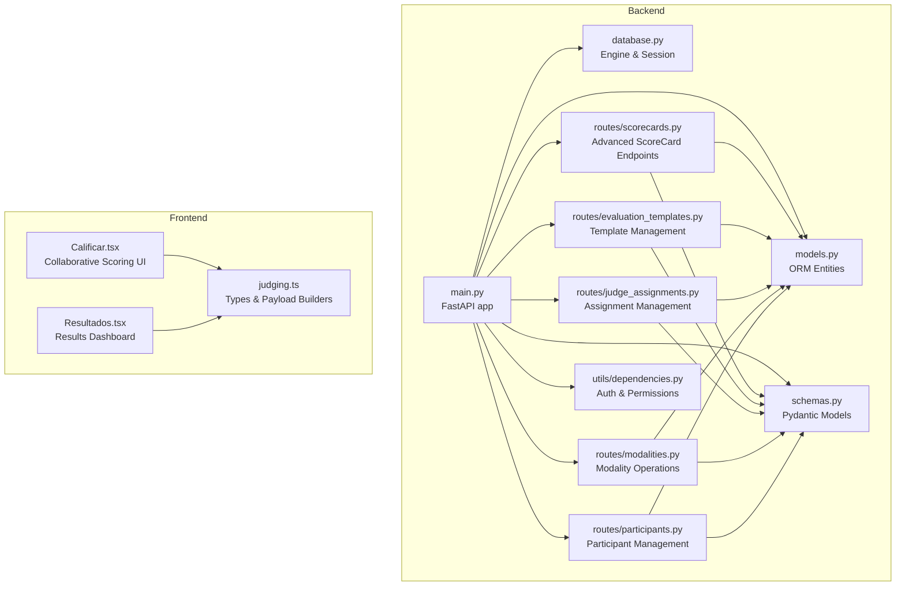
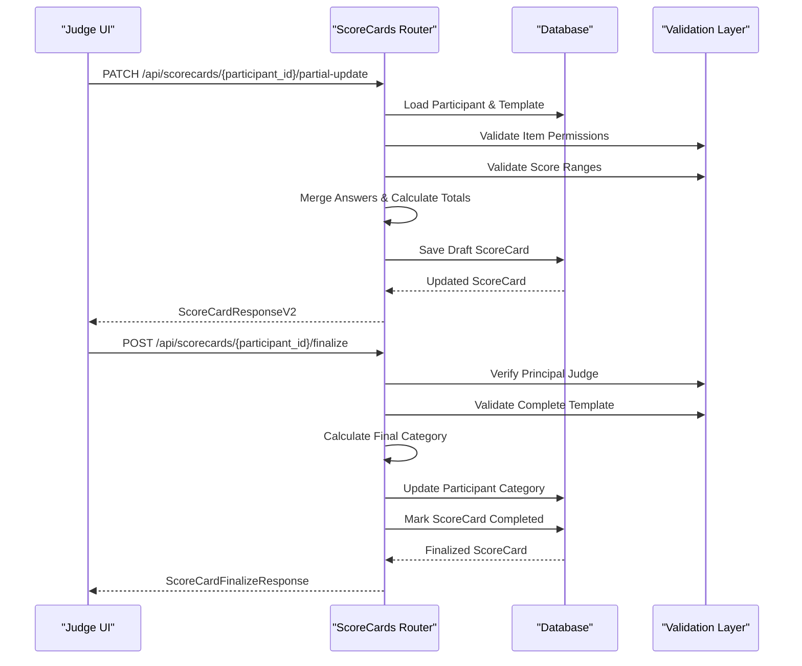
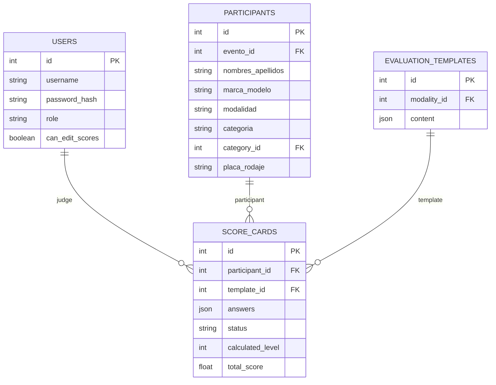
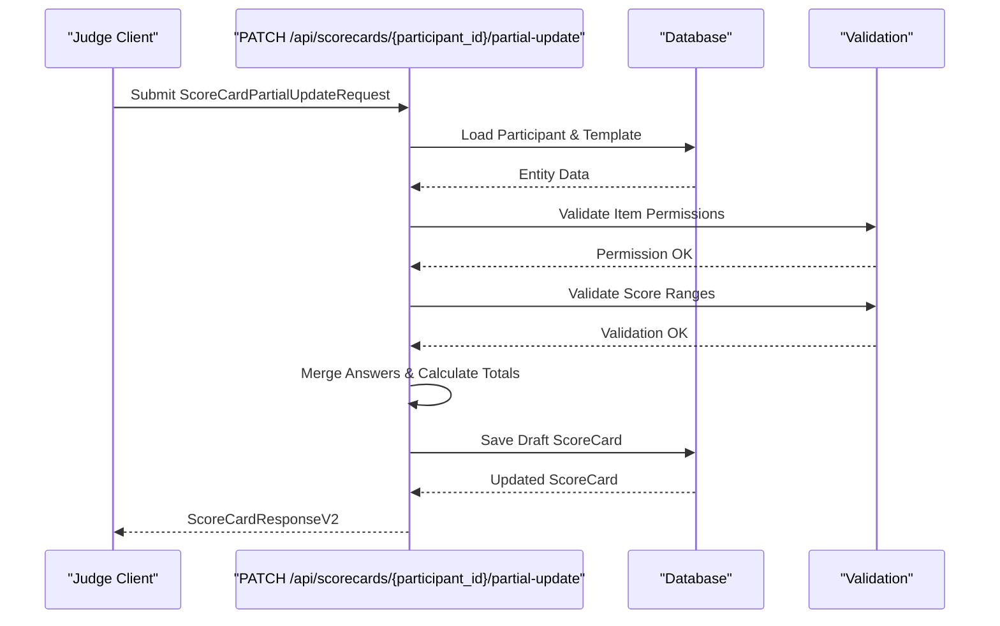
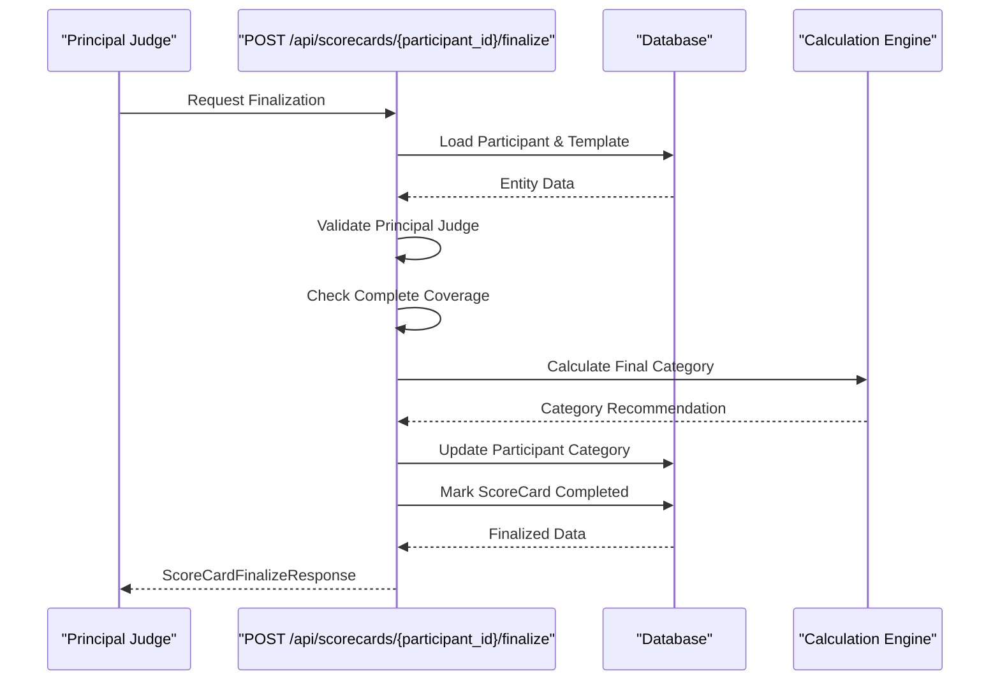
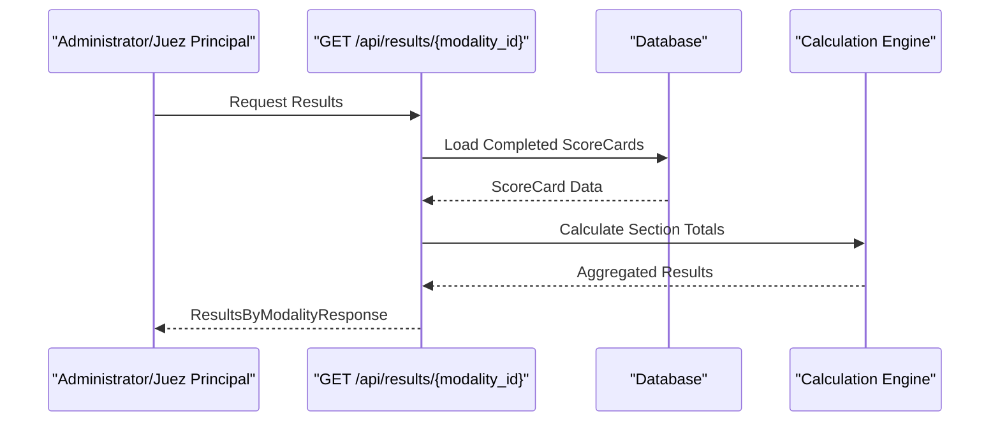
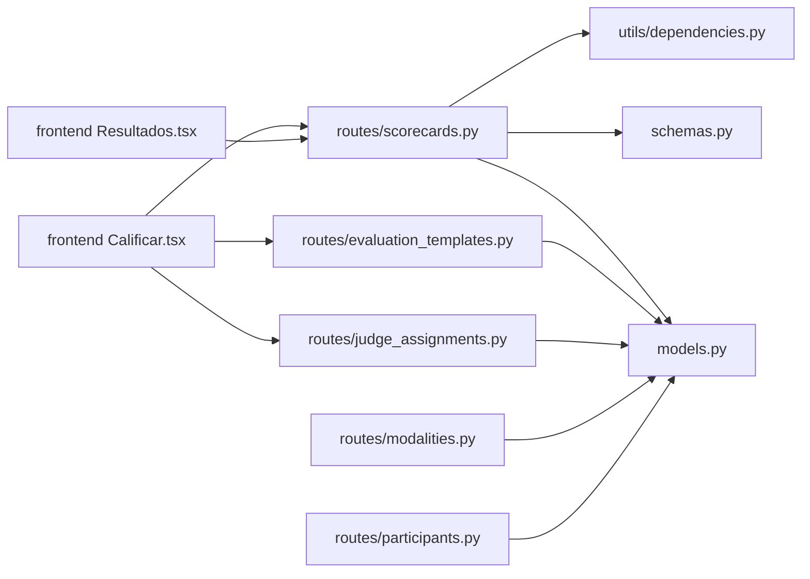
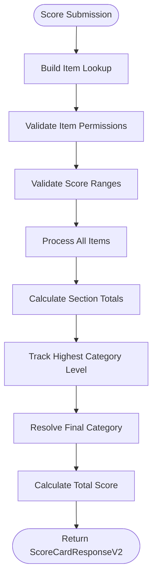

# Scoring System API

<cite>
**Referenced Files in This Document**
- [main.py](file://main.py)
- [database.py](file://database.py)
- [models.py](file://models.py)
- [schemas.py](file://schemas.py)
- [routes/scorecards.py](file://routes/scorecards.py)
- [routes/evaluation_templates.py](file://routes/evaluation_templates.py)
- [routes/judge_assignments.py](file://routes/judge_assignments.py)
- [routes/modalities.py](file://routes/modalities.py)
- [routes/participants.py](file://routes/participants.py)
- [utils/dependencies.py](file://utils/dependencies.py)
- [frontend/src/pages/juez/Calificar.tsx](file://frontend/src/pages/juez/Calificar.tsx)
- [frontend/src/lib/judging.ts](file://frontend/src/lib/judging.ts)
- [frontend/src/pages/shared/Resultados.tsx](file://frontend/src/pages/shared/Resultados.tsx)
</cite>

## Update Summary
**Changes Made**
- Complete replacement of old scoring system with new advanced ScoreCard workflow
- Added collaborative scoring with draft/completed status tracking
- Implemented partial updates with real-time validation
- Added finalization process with automatic category assignment
- Enhanced template validation with item-level permissions
- Added comprehensive results calculation and leaderboard functionality
- Updated frontend integration for new collaborative scoring interface

## Table of Contents
1. [Introduction](#introduction)
2. [Project Structure](#project-structure)
3. [Core Components](#core-components)
4. [Architecture Overview](#architecture-overview)
5. [Detailed Component Analysis](#detailed-component-analysis)
6. [Dependency Analysis](#dependency-analysis)
7. [Performance Considerations](#performance-considerations)
8. [Troubleshooting Guide](#troubleshooting-guide)
9. [Conclusion](#conclusion)
10. [Appendices](#appendices)

## Introduction
This document provides comprehensive API documentation for the advanced scoring system with collaborative workflows. The system now features a sophisticated ScoreCard-based approach that enables judges to collaboratively evaluate participants through draft/completed workflows with real-time validation, partial updates, and automatic category assignment upon finalization.

Key features include:
- **Collaborative Scoring Workflow**: Draft/completed status tracking with partial updates
- **Advanced Template Validation**: Item-level permissions and comprehensive validation rules
- **Automatic Category Assignment**: Dynamic categorization based on scoring criteria
- **Real-time Results Calculation**: Live leaderboard generation with section breakdowns
- **Principal Judge Authorization**: Special permissions for finalization and re-editing
- **Enhanced Score Calculation**: Section-wise totals with configurable scoring scales

The scoring system integrates with a template-driven evaluation framework where judges collaborate through ScoreCards that capture individual item scores, categorization levels, and final category assignments.

## Project Structure
The scoring system is implemented as a FastAPI application with SQLAlchemy ORM models and Pydantic schemas. The backend routes are organized by domain with enhanced scoring capabilities:

**Diagram sources**
- [main.py:16-44](file://main.py#L16-L44)
- [database.py:19-33](file://database.py#L19-L33)
- [models.py:147-163](file://models.py#L147-L163)
- [schemas.py:211-256](file://schemas.py#L211-L256)
- [routes/scorecards.py:20-691](file://routes/scorecards.py#L20-L691)
- [routes/evaluation_templates.py:1-63](file://routes/evaluation_templates.py#L1-L63)
- [routes/judge_assignments.py:1-63](file://routes/judge_assignments.py#L1-L63)
- [routes/modalities.py:1-63](file://routes/modalities.py#L1-L63)
- [routes/participants.py:1-63](file://routes/participants.py#L1-L63)
- [utils/dependencies.py:16-70](file://utils/dependencies.py#L16-L70)
- [frontend/src/pages/juez/Calificar.tsx:203-551](file://frontend/src/pages/juez/Calificar.tsx#L203-L551)
- [frontend/src/lib/judging.ts:39-144](file://frontend/src/lib/judging.ts#L39-L144)
- [frontend/src/pages/shared/Resultados.tsx:13-255](file://frontend/src/pages/shared/Resultados.tsx#L13-L255)

**Section sources**
- [main.py:16-44](file://main.py#L16-L44)
- [database.py:19-33](file://database.py#L19-L33)

## Core Components
- **ScoreCard Model**: Advanced scoring entity with draft/completed status, item-level answers, and automatic calculations
- **Enhanced Template System**: EvaluationTemplate with sections, items, and categorization options
- **Judge Assignment System**: Role-based permissions with assigned sections and principal judge designation
- **Category Management**: Hierarchical categorization with level-based progression
- **Real-time Validation**: Comprehensive validation for score ranges, item permissions, and category constraints
- **Results Calculation**: Automatic leaderboard generation with section-wise breakdowns

**Section sources**
- [models.py:147-163](file://models.py#L147-L163)
- [models.py:115-129](file://models.py#L115-L129)
- [models.py:131-144](file://models.py#L131-L144)
- [models.py:195-212](file://models.py#L195-L212)
- [schemas.py:211-256](file://schemas.py#L211-L256)

## Architecture Overview
The advanced scoring system follows a collaborative workflow architecture:

**Diagram sources**
- [routes/scorecards.py:435-597](file://routes/scorecards.py#L435-L597)
- [routes/scorecards.py:525-597](file://routes/scorecards.py#L525-L597)

## Detailed Component Analysis

### ScoreCard Model Schema
The ScoreCard entity captures collaborative scoring workflows:

**Diagram sources**
- [models.py:147-163](file://models.py#L147-L163)
- [models.py:115-129](file://models.py#L115-L129)
- [models.py:42-81](file://models.py#L42-L81)

**Section sources**
- [models.py:147-163](file://models.py#L147-L163)

### Collaborative Scoring Workflow
The new ScoreCard system implements a sophisticated collaborative workflow:

#### Partial Update Endpoint: PATCH /api/scorecards/{participant_id}/partial-update
Behavior:
- Validates judge assignment and template permissions
- Merges new answers with existing ScoreCard
- Calculates real-time totals and category levels
- Supports draft mode editing with principal judge re-edit privileges
- Enforces item-level permissions based on judge assignments

**Diagram sources**
- [routes/scorecards.py:435-493](file://routes/scorecards.py#L435-L493)

#### Finalization Endpoint: POST /api/scorecards/{participant_id}/finalize
Behavior:
- Requires principal judge authorization
- Validates complete template coverage
- Calculates final category based on highest level reached
- Updates participant category and modalidad
- Marks ScoreCard as completed with immutable status

**Diagram sources**
- [routes/scorecards.py:525-597](file://routes/scorecards.py#L525-L597)

**Section sources**
- [routes/scorecards.py:435-597](file://routes/scorecards.py#L435-L597)

### Template-Based Scoring with Advanced Validation
Enhanced template validation system with comprehensive constraints:

#### Template Resolution and Validation
- **Item Lookup Building**: Creates hierarchical mapping of item IDs to sections and definitions
- **Permission Validation**: Ensures judges can only edit assigned sections and bonifications
- **Score Range Validation**: Validates scores against min/max constraints or scale definitions
- **Category Validation**: Enforces categorical selections and level triggers

#### Advanced Scoring Features
- **Section-wise Totals**: Real-time calculation of subsection scores
- **Category Level Progression**: Automatic level advancement based on highest category reached
- **Bonification Items**: Separate scoring for special recognition items
- **Hierarchical Categories**: Multi-level categorization with automatic assignment

**Section sources**
- [routes/scorecards.py:79-328](file://routes/scorecards.py#L79-L328)

### Results Calculation and Leaderboard Generation
Comprehensive results system for administrative oversight:

#### Results Endpoint: GET /api/results/{modality_id}
Behavior:
- Aggregates completed ScoreCards by category and section
- Generates hierarchical leaderboard with section subtotals
- Supports event filtering and principal judge authorization
- Provides detailed participant breakdowns with scores

**Diagram sources**
- [routes/scorecards.py:600-690](file://routes/scorecards.py#L600-L690)

**Section sources**
- [routes/scorecards.py:600-690](file://routes/scorecards.py#L600-L690)

### Frontend Integration and Collaborative Interface
Enhanced judge interface supporting collaborative scoring:

#### Collaborative Scoring UI Features
- **Section Visibility**: Judges only see assigned sections based on assignments
- **Real-time Calculations**: Live score updates as judges enter scores
- **Category Selection**: Interactive categorization with level progression
- **Progress Tracking**: Draft/completed status with re-edit capabilities
- **Finalization Workflow**: Principal judge authorization for completion

#### Template Integration
- **Dynamic Loading**: Evaluation templates loaded per modality
- **Permission-based Rendering**: Only visible sections are shown
- **Validation Feedback**: Real-time validation messages for score ranges
- **Category Option Handling**: Dynamic category selection based on template options

**Section sources**
- [frontend/src/pages/juez/Calificar.tsx:203-551](file://frontend/src/pages/juez/Calificar.tsx#L203-L551)
- [frontend/src/lib/judging.ts:39-144](file://frontend/src/lib/judging.ts#L39-L144)

## Dependency Analysis
The advanced scoring system introduces new dependencies and relationships:

**Diagram sources**
- [routes/scorecards.py:4-17](file://routes/scorecards.py#L4-L17)
- [routes/evaluation_templates.py:1-7](file://routes/evaluation_templates.py#L1-L7)
- [routes/judge_assignments.py:1-7](file://routes/judge_assignments.py#L1-L7)
- [routes/modalities.py:1-7](file://routes/modalities.py#L1-L7)
- [routes/participants.py:1-7](file://routes/participants.py#L1-L7)
- [utils/dependencies.py:16-47](file://utils/dependencies.py#L16-L47)
- [frontend/src/pages/juez/Calificar.tsx:1-20](file://frontend/src/pages/juez/Calificar.tsx#L1-L20)
- [frontend/src/pages/shared/Resultados.tsx:1-7](file://frontend/src/pages/shared/Resultados.tsx#L1-L7)

**Section sources**
- [routes/scorecards.py:4-17](file://routes/scorecards.py#L4-L17)
- [routes/evaluation_templates.py:1-7](file://routes/evaluation_templates.py#L1-L7)
- [routes/judge_assignments.py:1-7](file://routes/judge_assignments.py#L1-L7)
- [routes/modalities.py:1-7](file://routes/modalities.py#L1-L7)
- [routes/participants.py:1-7](file://routes/participants.py#L1-L7)
- [utils/dependencies.py:16-47](file://utils/dependencies.py#L16-L47)

## Performance Considerations
- **Database Optimization**: ScoreCard queries use joinedloads for efficient participant and template resolution
- **Template Caching**: Evaluation templates cached per modality to reduce repeated database queries
- **Validation Efficiency**: Item lookup built once per request and reused for validation and calculation
- **Results Aggregation**: Batch processing of completed ScoreCards for leaderboard generation
- **Frontend Optimization**: Real-time calculations performed client-side to reduce server load

## Troubleshooting Guide
Common errors and resolutions:

### Collaboration Workflow Errors
- **403 Forbidden - Item Permission Denied**
  - Cause: Judge attempting to edit items outside assigned sections
  - Solution: Verify judge assignment and assigned sections
- **400 Bad Request - Incomplete Template**
  - Cause: Missing required items in finalization request
  - Solution: Ensure all template items are scored before finalization
- **403 Forbidden - Principal Judge Required**
  - Cause: Non-principal judge attempting finalization
  - Solution: Assign principal judge role or delegate authorization

### Validation Errors
- **400 Bad Request - Score Range Violation**
  - Cause: Score outside configured min/max bounds
  - Solution: Adjust score to match template constraints
- **400 Bad Request - Category Validation Failure**
  - Cause: Selected category level mismatch with category selection
  - Solution: Ensure category and level selections are compatible

### Entity Reference Errors
- **404 Not Found - Participant/Template Missing**
  - Cause: Invalid participant ID or missing evaluation template
  - Solution: Verify entity existence and relationships

**Section sources**
- [routes/scorecards.py:144-328](file://routes/scorecards.py#L144-L328)
- [routes/scorecards.py:525-597](file://routes/scorecards.py#L525-L597)

## Conclusion
The advanced scoring system provides a comprehensive collaborative evaluation framework with sophisticated workflow management, real-time validation, and automated category assignment. The ScoreCard-based approach enables judges to work together efficiently while maintaining strict validation controls and transparent results tracking. The system's modular design supports future enhancements while providing a robust foundation for competitive car audio and tuning evaluations.

## Appendices

### API Definitions

#### ScoreCard Management Endpoints
- **PATCH /api/scorecards/{participant_id}/partial-update**
  - Description: Submit partial scoring updates with real-time validation
  - Authentication: Judge required with assignment to modality
  - Request body: ScoreCardPartialUpdateRequest
  - Response: ScoreCardResponseV2
  - Notes: Merges with existing answers, calculates totals, supports draft mode

- **POST /api/scorecards/{participant_id}/finalize**
  - Description: Finalize scoring with automatic category assignment
  - Authentication: Principal judge required
  - Request body: Empty
  - Response: ScoreCardFinalizeResponse
  - Notes: Validates complete coverage, assigns final category, marks completed

- **GET /api/scorecards/{participant_id}**
  - Description: Retrieve specific ScoreCard for participant
  - Authentication: Judge required with assignment
  - Response: ScoreCardResponseV2
  - Notes: Returns current draft/completed state

- **GET /api/scorecards**
  - Description: List ScoreCards with filtering options
  - Authentication: Any authenticated user
  - Query Parameters: evento_id, modalidad, categoria, status_filter
  - Response: Array of ScoreCardResponseV2

#### Results and Reporting
- **GET /api/results/{modality_id}**
  - Description: Generate comprehensive leaderboard with section breakdowns
  - Authentication: Admin or principal judge required
  - Query Parameters: evento_id (optional)
  - Response: ResultsByModalityResponse
  - Notes: Aggregates completed ScoreCards by category and section

**Section sources**
- [routes/scorecards.py:412-690](file://routes/scorecards.py#L412-L690)

### Data Models and Validation Rules

#### ScoreCard Models
- **ScoreCardPartialUpdateRequest**
  - Fields: answers (dict of item_id to AnswerDetail)
  - Validation: Only permitted items based on judge assignment

- **ScoreCardResponseV2**
  - Fields: id, participant_id, template_id, answers, status, calculated_level, total_score
  - Status Values: draft, completed

- **ScoreCardFinalizeResponse**
  - Fields: score_card, previous_category_id, previous_category_name, current_category_id, current_category_name, calculated_level, total_score

#### Template and Validation Models
- **EvaluationTemplateResponse**
  - Fields: id, modality_id, content (structured template definition)
  - Validation: Contains sections, items, and categorization options

- **JudgeAssignmentResponse**
  - Fields: id, user_id, user_username, modality_id, modality_name, assigned_sections, is_principal
  - Validation: Unique constraint on (user_id, modality_id)

**Section sources**
- [schemas.py:211-256](file://schemas.py#L211-L256)
- [schemas.py:161-183](file://schemas.py#L161-L183)
- [schemas.py:199-209](file://schemas.py#L199-L209)

### Advanced Scoring Validation Rules
Comprehensive validation system for score quality assurance:

#### Item Permission Validation
- **Section Assignment Check**: Verifies judge has permission for target section
- **Principal Judge Override**: Allows principal judges to edit bonification items
- **Unauthorized Item Detection**: Prevents editing of unassigned items

#### Score Range Validation
- **Explicit Min/Max**: Uses template-defined score bounds
- **Scale-based Validation**: Parses scale definitions (scale_min_max)
- **Fallback Defaults**: Defaults to 0-5 point scale when unspecified

#### Category Validation
- **Level Compatibility**: Ensures selected level matches category selection
- **Required Selections**: Enforces category selection when levels are chosen
- **Hierarchical Consistency**: Validates category and level relationships

#### Template Coverage Validation
- **Complete Template Check**: Ensures all required items are scored
- **Missing Item Reporting**: Identifies incomplete templates during finalization
- **Section-wise Validation**: Validates each section meets scoring requirements

**Section sources**
- [routes/scorecards.py:144-328](file://routes/scorecards.py#L144-L328)

### Score Calculation Algorithm
Advanced calculation system for comprehensive scoring:

#### Real-time Calculation Engine
- **Section-wise Totals**: Calculates separate totals for each section
- **Category Level Determination**: Tracks highest category level reached
- **Automatic Category Assignment**: Assigns final category based on scoring performance
- **Bonification Integration**: Includes special recognition items in final totals

#### Calculation Flow
1. **Item Processing**: Iterates through all scored items
2. **Section Aggregation**: Sums scores by section for detailed breakdowns
3. **Level Tracking**: Determines highest category level achieved
4. **Final Category Resolution**: Selects appropriate category based on performance
5. **Total Score Calculation**: Computes final numerical score

**Diagram sources**
- [routes/scorecards.py:308-410](file://routes/scorecards.py#L308-L410)

**Section sources**
- [routes/scorecards.py:308-410](file://routes/scorecards.py#L308-L410)