# Template Management API

<cite>
**Referenced Files in This Document**
- [main.py](file://main.py)
- [database.py](file://database.py)
- [models.py](file://models.py)
- [schemas.py](file://schemas.py)
- [routes/templates.py](file://routes/templates.py)
- [routes/scores.py](file://routes/scores.py)
- [utils/dependencies.py](file://utils/dependencies.py)
- [utils/security.py](file://utils/security.py)
- [frontend/src/pages/admin/TemplateBuilder.tsx](file://frontend/src/pages/admin/TemplateBuilder.tsx)
- [frontend/src/pages/admin/TemplatesList.tsx](file://frontend/src/pages/admin/TemplatesList.tsx)
- [frontend/src/lib/api.ts](file://frontend/src/lib/api.ts)
- [frontend/src/App.tsx](file://frontend/src/App.tsx)
- [seed_templates.py](file://seed_templates.py)
- [init_db.py](file://init_db.py)
</cite>

## Update Summary
**Changes Made**
- Enhanced Template Builder with comprehensive editing capabilities and improved UI
- Added new TemplatesList component for template management and administration
- Implemented advanced template validation with real-time JSON preview
- Added template statistics and summary cards in the new list interface
- Enhanced routing structure with dedicated template management routes
- Improved error handling and user feedback mechanisms
- Added template deletion confirmation and JSON preview modals
- Implemented comprehensive real-time validation with immediate error feedback
- Added advanced template statistics with section, criterion, and point calculations
- Enhanced template CRUD operations with improved error handling

## Table of Contents
1. [Introduction](#introduction)
2. [Project Structure](#project-structure)
3. [Core Components](#core-components)
4. [Architecture Overview](#architecture-overview)
5. [Detailed Component Analysis](#detailed-component-analysis)
6. [Template Builder Functionality](#template-builder-functionality)
7. [TemplatesList Component](#templateslist-component)
8. [Template Validation Rules](#template-validation-rules)
9. [Scoring Structure Definition](#scoring-structure-definition)
10. [Template Assignment to Events](#template-assignment-to-events)
11. [Template CRUD Operations](#template-crud-operations)
12. [Template Sharing, Copying, and Versioning](#template-sharing-copying-and-versioning)
13. [Performance Considerations](#performance-considerations)
14. [Troubleshooting Guide](#troubleshooting-guide)
15. [Conclusion](#conclusion)

## Introduction

The Template Management API provides comprehensive functionality for managing scoring templates in a car audio and tuning competition system. This API enables administrators to create, manage, and assign dynamic scoring templates to different competition modalities and categories. The system supports real-time template building through an enhanced web interface, dynamic scoring validation, and flexible template assignment to participants.

The API follows RESTful principles with FastAPI, providing type-safe endpoints for template CRUD operations while maintaining strong data validation and security through role-based access control. The enhanced interface now includes both TemplateBuilder for creating/editing templates and TemplatesList for comprehensive template management.

**Updated** Enhanced with real-time validation, comprehensive error handling, and improved user experience through advanced frontend components.

## Project Structure

The template management system is organized into several key architectural layers with enhanced frontend components:

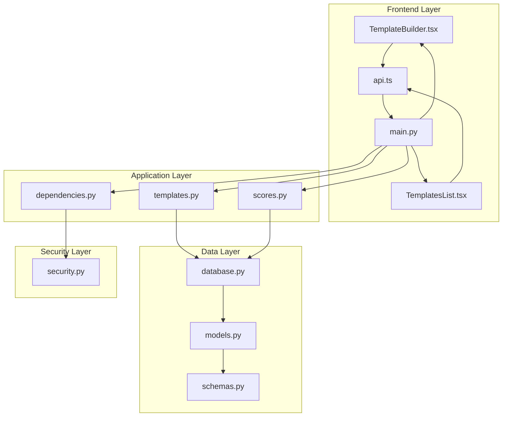

**Diagram sources**
- [main.py:1-53](file://main.py#L1-L53)
- [routes/templates.py:1-134](file://routes/templates.py#L1-L134)
- [routes/scores.py:1-132](file://routes/scores.py#L1-L132)
- [frontend/src/App.tsx:94-125](file://frontend/src/App.tsx#L94-L125)

**Section sources**
- [main.py:1-53](file://main.py#L1-L53)
- [database.py:1-93](file://database.py#L1-L93)

## Core Components

The template management system consists of several interconnected components that work together to provide comprehensive template functionality:

### Database Models

The system uses SQLAlchemy ORM models to define the data structure for templates, scoring, and related entities:

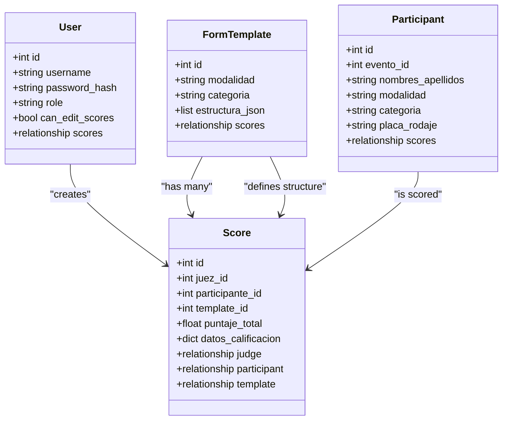

**Diagram sources**
- [models.py:72-101](file://models.py#L72-L101)

### API Endpoints

The system exposes RESTful endpoints for template management operations:

| Endpoint | Method | Description | Authentication |
|----------|--------|-------------|----------------|
| `/api/templates` | GET | List all templates ordered by modalidad and categoria | User required |
| `/api/templates` | POST | Create or update template by modalidad+categoria | Admin required |
| `/api/templates/{template_id}` | GET | Retrieve template by ID | User required |
| `/api/templates/{template_id}` | PUT | Update existing template by ID | Admin required |
| `/api/templates/{template_id}` | DELETE | Delete template by ID | Admin required |
| `/api/templates/{modalidad}/{categoria}` | GET | Retrieve template by modality and category | User required |

**Section sources**
- [routes/templates.py:13-134](file://routes/templates.py#L13-L134)
- [routes/scores.py:43-132](file://routes/scores.py#L43-L132)

## Architecture Overview

The template management architecture follows a layered approach with clear separation of concerns and enhanced frontend components:

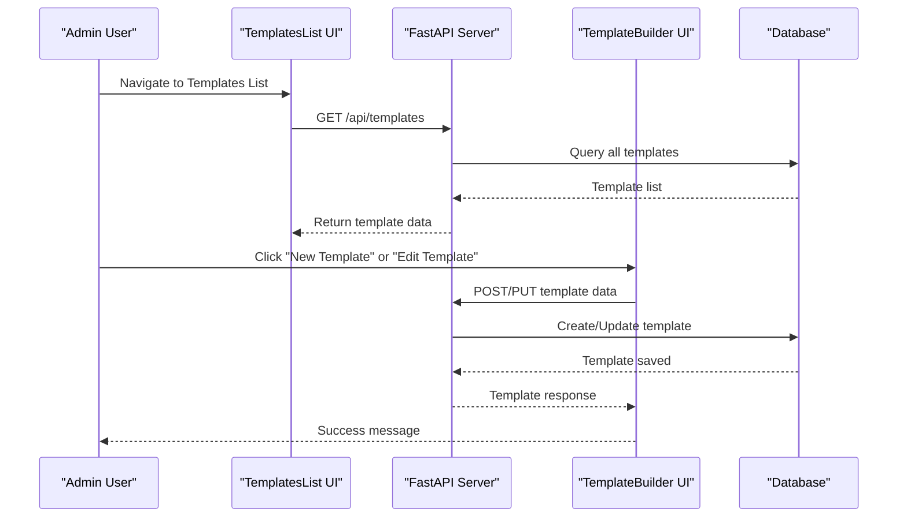

**Diagram sources**
- [routes/templates.py:13-91](file://routes/templates.py#L13-L91)
- [frontend/src/pages/admin/TemplatesList.tsx:39-58](file://frontend/src/pages/admin/TemplatesList.tsx#L39-L58)
- [frontend/src/pages/admin/TemplateBuilder.tsx:178-248](file://frontend/src/pages/admin/TemplateBuilder.tsx#L178-L248)

The architecture ensures:
- **Security**: Role-based access control with admin-only template modifications
- **Data Integrity**: Unique constraints prevent duplicate templates
- **Flexibility**: Dynamic JSON structure allows customizable scoring categories
- **Validation**: Frontend and backend validation ensure data quality
- **User Experience**: Comprehensive template management interface with real-time feedback

## Detailed Component Analysis

### Template Model Schema

The `FormTemplate` model defines the core structure for scoring templates:

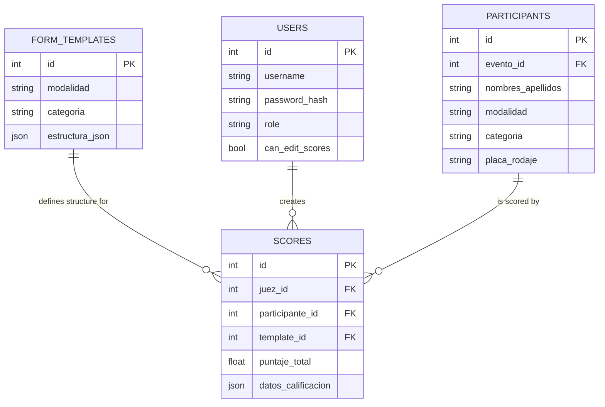

**Diagram sources**
- [models.py:72-101](file://models.py#L72-L101)

**Section sources**
- [models.py:72-84](file://models.py#L72-L84)

### Scoring Model Integration

The scoring system integrates tightly with templates through foreign key relationships:

| Field | Type | Description | Constraints |
|-------|------|-------------|-------------|
| `id` | Integer | Primary key | Auto-increment |
| `juez_id` | Integer | Foreign key to User | Required |
| `participante_id` | Integer | Foreign key to Participant | Required |
| `template_id` | Integer | Foreign key to FormTemplate | Required |
| `puntaje_total` | Float | Sum of all criteria scores | Required, default 0 |
| `datos_calificacion` | JSON | Dynamic scoring structure | Required, default empty dict |

**Section sources**
- [models.py:86-101](file://models.py#L86-L101)

## Template Builder Functionality

The Template Builder provides a comprehensive interface for creating dynamic scoring templates with enhanced editing capabilities and real-time validation:

### Enhanced Builder Interface Components

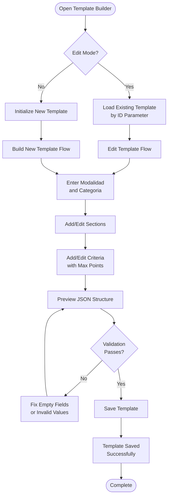

**Diagram sources**
- [frontend/src/pages/admin/TemplateBuilder.tsx:55-87](file://frontend/src/pages/admin/TemplateBuilder.tsx#L55-L87)

### Dynamic Template Structure

The builder creates a hierarchical structure for templates with enhanced editing capabilities:

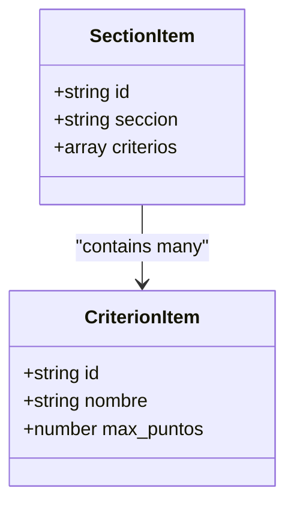

**Diagram sources**
- [frontend/src/pages/admin/TemplateBuilder.tsx:7-17](file://frontend/src/pages/admin/TemplateBuilder.tsx#L7-L17)

**Section sources**
- [frontend/src/pages/admin/TemplateBuilder.tsx:47-539](file://frontend/src/pages/admin/TemplateBuilder.tsx#L47-L539)

### Advanced Validation Features

The Template Builder implements comprehensive validation with real-time feedback:

| Validation Rule | Condition | Error Message |
|----------------|-----------|---------------|
| Modalidad/Categoria | Non-empty strings | "Completa modalidad y categoría antes de guardar." |
| Section Name | Non-empty after trim | "Cada sección debe tener nombre" |
| Criterion Name | Non-empty after trim | "Cada criterio debe tener nombre" |
| Max Points | Greater than 0 | "Cada criterio debe tener puntaje máximo mayor a cero" |
| Template ID | Valid integer | "Plantilla no encontrada" (when loading by ID) |

**Updated** Enhanced validation now includes real-time JSON preview with immediate validation feedback and comprehensive error messaging.

## TemplatesList Component

The new TemplatesList component provides a comprehensive interface for managing all templates with advanced features:

### Template Management Interface

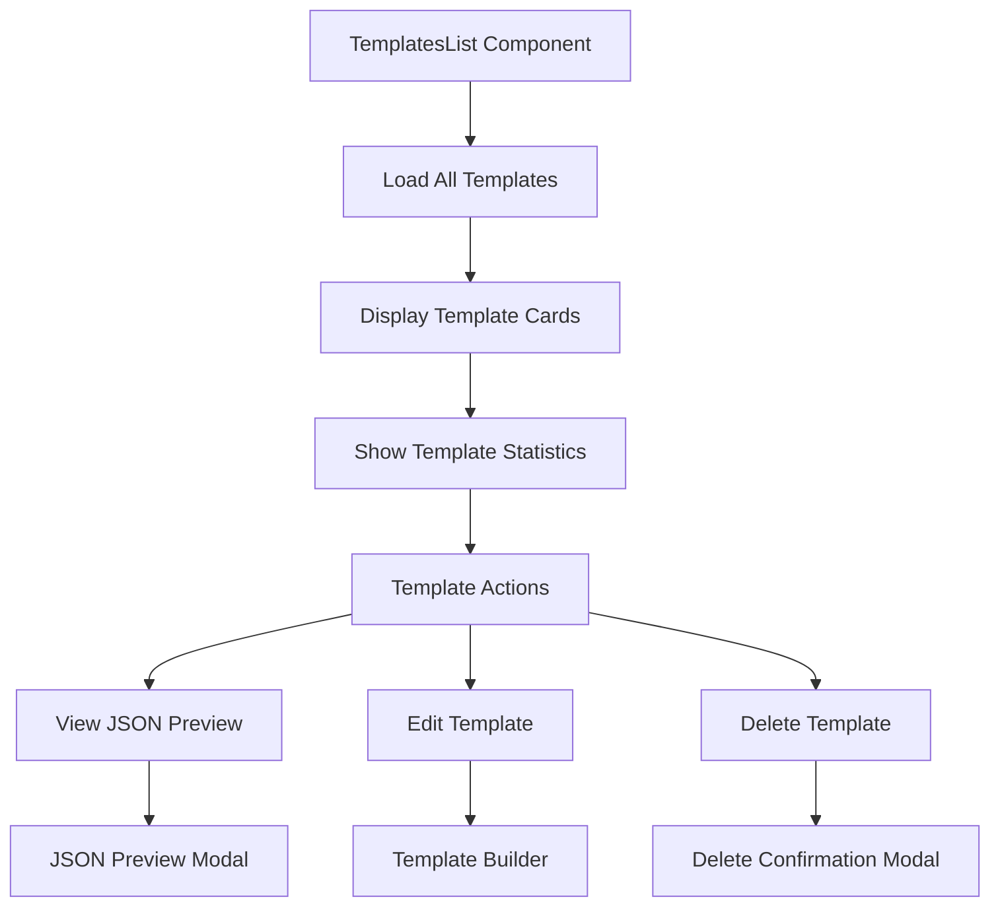

**Diagram sources**
- [frontend/src/pages/admin/TemplatesList.tsx:24-284](file://frontend/src/pages/admin/TemplatesList.tsx#L24-L284)

### Template Statistics and Cards

The TemplatesList displays comprehensive statistics for each template:

| Statistic | Calculation | Display |
|-----------|-------------|---------|
| Sections Count | `estructura_json.length` | Large bold number |
| Criteria Count | Sum of all criteria across sections | Medium bold number |
| Maximum Points | Sum of all `max_puntos` values | Emerald green number |
| Template ID | `id` field | Small badge with hash |

**Updated** Enhanced statistics calculation now includes real-time point totals and improved visual presentation.

**Section sources**
- [frontend/src/pages/admin/TemplatesList.tsx:77-89](file://frontend/src/pages/admin/TemplatesList.tsx#L77-L89)

### Template Actions and Modals

The component provides three main actions for each template:

1. **View JSON**: Opens modal showing the raw JSON structure
2. **Edit**: Navigates to TemplateBuilder with pre-loaded data
3. **Delete**: Opens confirmation modal with delete functionality

**Section sources**
- [frontend/src/pages/admin/TemplatesList.tsx:189-212](file://frontend/src/pages/admin/TemplatesList.tsx#L189-L212)

## Template Validation Rules

The system implements comprehensive validation at multiple levels with enhanced error handling:

### Frontend Validation

The Template Builder enforces immediate validation with improved error messages:

| Validation Rule | Condition | Error Message |
|----------------|-----------|---------------|
| Modalidad/Categoria | Non-empty strings | "Completa modalidad y categoría antes de guardar." |
| Section Name | Non-empty after trim | "Cada sección debe tener nombre" |
| Criterion Name | Non-empty after trim | "Cada criterio debe tener nombre" |
| Max Points | Greater than 0 | "Cada criterio debe tener puntaje máximo mayor a cero" |
| Template ID | Valid integer | "Plantilla no encontrada" (when loading by ID) |

**Updated** Frontend validation now includes real-time JSON preview with immediate validation feedback and comprehensive error messaging.

### Backend Validation

The server validates template uniqueness and structure with comprehensive error handling:

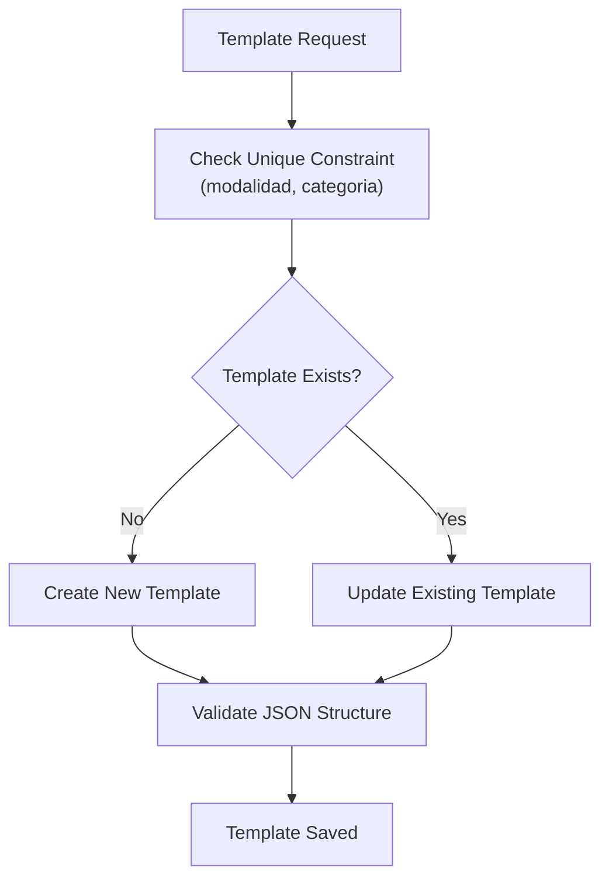

**Diagram sources**
- [routes/templates.py:26-53](file://routes/templates.py#L26-L53)

**Section sources**
- [routes/templates.py:13-134](file://routes/templates.py#L13-L134)

## Scoring Structure Definition

Templates define dynamic scoring structures that guide judges during evaluation:

### Template Structure Format

Each template consists of sections containing criteria with maximum points:

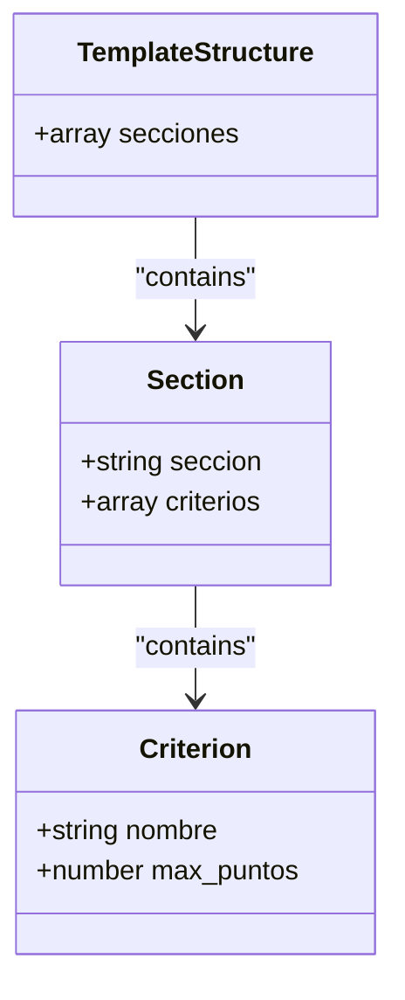

**Diagram sources**
- [seed_templates.py:5-86](file://seed_templates.py#L5-L86)

### Example Template Structure

The system includes pre-defined templates for demonstration:

| Template | Modalidad | Categoría | Sections | Total Max Points |
|----------|-----------|-----------|----------|------------------|
| SQ Master | SQ | Master | 5 sections | 250 points |
| Tuning Pro | Tuning | Pro | 4 sections | 150 points |

**Section sources**
- [seed_templates.py:5-137](file://seed_templates.py#L5-L137)

## Template Assignment to Events

Templates are automatically associated with participants through their modalidad and categoria fields:

### Assignment Process

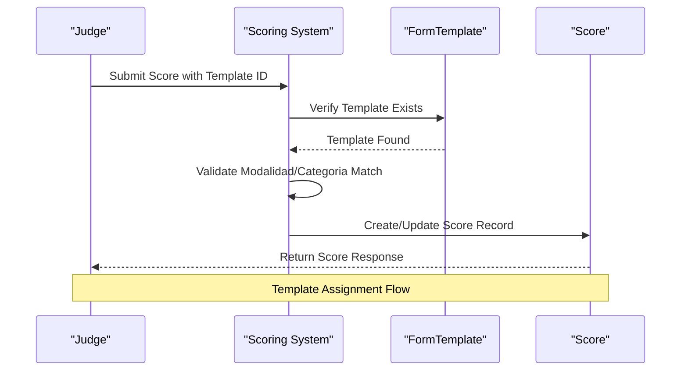

**Diagram sources**
- [routes/scores.py:44-114](file://routes/scores.py#L44-L114)

**Section sources**
- [routes/scores.py:43-114](file://routes/scores.py#L43-L114)

## Template CRUD Operations

### GET /api/templates - List All Templates

Retrieves all templates ordered by modalidad and categoria for comprehensive management.

**Response:** Array of TemplateResponse objects sorted alphabetically

**Authentication:** User required

**Section sources**
- [routes/templates.py:13-23](file://routes/templates.py#L13-L23)
- [schemas.py:126-133](file://schemas.py#L126-L133)

### POST /api/templates - Create or Update Template

Creates a new template or updates an existing one based on modalidad and categoria combination.

**Request Body:**
- `modalidad`: String (1-100 characters)
- `categoria`: String (1-100 characters)  
- `estructura_json`: Array of template sections and criteria

**Response:** TemplateResponse object with template details

**Authentication:** Admin required

**Section sources**
- [routes/templates.py:26-53](file://routes/templates.py#L26-L53)
- [schemas.py:120-133](file://schemas.py#L120-L133)

### GET /api/templates/{template_id} - Retrieve Template by ID

Fetches a template by its unique identifier.

**Path Parameters:**
- `template_id`: Integer (template identifier)

**Response:** TemplateResponse object

**Authentication:** User required

**Section sources**
- [routes/templates.py:56-68](file://routes/templates.py#L56-L68)
- [schemas.py:126-133](file://schemas.py#L126-L133)

### PUT /api/templates/{template_id} - Update Template

Updates an existing template by its unique identifier.

**Path Parameters:**
- `template_id`: Integer (template identifier)

**Request Body:**
- `modalidad`: String (1-100 characters)
- `categoria`: String (1-100 characters)  
- `estructura_json`: Array of template sections and criteria

**Response:** TemplateResponse object

**Authentication:** Admin required

**Section sources**
- [routes/templates.py:71-91](file://routes/templates.py#L71-L91)
- [schemas.py:120-133](file://schemas.py#L120-L133)

### DELETE /api/templates/{template_id} - Delete Template

Deletes a template by its unique identifier.

**Path Parameters:**
- `template_id`: Integer (template identifier)

**Response:** Success message indicating deletion

**Authentication:** Admin required

**Section sources**
- [routes/templates.py:94-110](file://routes/templates.py#L94-L110)

### GET /api/templates/{modalidad}/{categoria} - Retrieve Template by Modality and Category

Fetches a template by its modalidad and categoria combination.

**Path Parameters:**
- `modalidad`: String (template identifier)
- `categoria`: String (template identifier)

**Response:** TemplateResponse object

**Authentication:** User required

**Section sources**
- [routes/templates.py:113-133](file://routes/templates.py#L113-L133)
- [schemas.py:126-133](file://schemas.py#L126-L133)

### Template Validation During Score Submission

The scoring system validates template compatibility with enhanced error handling:

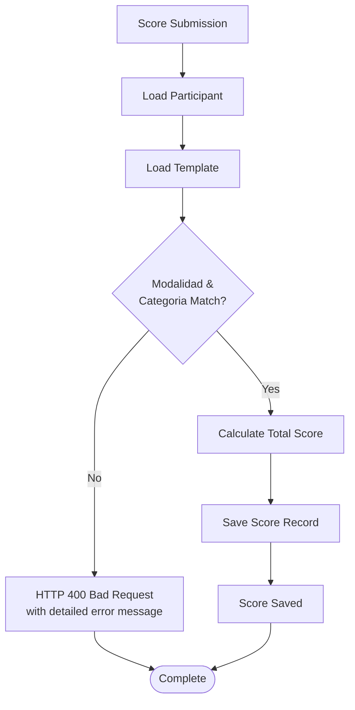

**Diagram sources**
- [routes/scores.py:49-67](file://routes/scores.py#L49-L67)

**Section sources**
- [routes/scores.py:43-114](file://routes/scores.py#L43-L114)

## Template Sharing, Copying, and Versioning

### Current Implementation Status

The template management system currently supports:

- **Template Sharing:** Templates are shared across all users with appropriate permissions
- **Template Editing:** Enhanced editing capabilities via template ID parameter
- **Template Lookup:** Multiple lookup methods (ID and modalidad-categoria combination)
- **Template Versioning:** No built-in version control system exists
- **Template Management:** New comprehensive TemplatesList component for administration

### Recommended Enhancement Areas

For future development, consider implementing:

1. **Template Version Control:** Track changes and maintain version history
2. **Template Sharing Permissions:** Granular access controls for template sharing
3. **Template Templates:** Ability to create templates from existing ones
4. **Template Export/Import:** JSON-based template portability
5. **Template Categories:** Organize templates by competition categories

## Performance Considerations

### Database Optimization

The system implements several performance optimizations:

- **Unique Constraints:** Prevents duplicate templates and ensures efficient lookups
- **Indexed Fields:** Modalidad and categoria fields are indexed for fast queries
- **Connection Pooling:** SQLAlchemy session management for efficient database connections

### API Performance

- **Response Models:** Pydantic models provide efficient serialization
- **Lazy Loading:** Database relationships are loaded on-demand
- **Pagination:** Score listings support pagination for large datasets

**Section sources**
- [models.py:74-76](file://models.py#L74-L76)
- [database.py:25-34](file://database.py#L25-L34)

## Troubleshooting Guide

### Common Issues and Solutions

#### Template Not Found Errors
**Symptoms:** HTTP 404 when retrieving templates
**Causes:** Incorrect template_id, modalidad/categoria combination, or template deletion
**Solutions:** Verify template exists in database, check parameter correctness, ensure proper authentication

#### Validation Errors
**Symptoms:** HTTP 400 errors during template creation/editing
**Causes:** Empty fields, invalid JSON structure, or missing required fields
**Solutions:** Use Template Builder interface, ensure all sections have names and criteria have positive max points, validate template ID parameter

#### Permission Errors
**Symptoms:** HTTP 403 Forbidden when accessing endpoints
**Causes:** Insufficient user roles or invalid authentication tokens
**Solutions:** Ensure user has admin role for template operations, verify JWT token validity

#### Score Validation Failures
**Symptoms:** HTTP 400 errors when submitting scores
**Causes:** Template mismatch with participant's modalidad/categoria
**Solutions:** Verify template matches participant's category, ensure template exists and is accessible

#### Template Editing Issues
**Symptoms:** Template not loading in edit mode
**Causes:** Invalid template ID parameter or template not found
**Solutions:** Verify template ID exists, ensure proper URL format with :id parameter

#### TemplatesList Loading Issues
**Symptoms:** Templates not displaying in list interface
**Causes:** API connectivity issues or authentication problems
**Solutions:** Check network connectivity, verify JWT token validity, ensure proper authentication

**Updated** Enhanced error handling now provides more specific error messages and improved user feedback mechanisms.

**Section sources**
- [routes/templates.py:56-133](file://routes/templates.py#L56-L133)
- [routes/scores.py:56-67](file://routes/scores.py#L56-L67)
- [utils/dependencies.py:32-47](file://utils/dependencies.py#L32-L47)

## Conclusion

The Template Management API provides a robust foundation for dynamic scoring template management in competitive environments. The system successfully balances flexibility with security, allowing administrators to create customizable scoring structures while maintaining strict validation and access controls.

Key strengths of the implementation include:
- **Flexible Template Structure:** JSON-based templates support diverse scoring requirements
- **Enhanced CRUD Operations:** Comprehensive template management with ID and modalidad-categoria lookup
- **Strong Validation:** Multi-layered validation ensures data integrity
- **Secure Access Control:** Role-based permissions protect sensitive operations
- **Real-time Builder:** Intuitive interface for template creation and management with editing capabilities
- **Comprehensive Management:** New TemplatesList component provides advanced template administration
- **Multiple Access Methods:** Various ways to retrieve templates for different use cases
- **Advanced UI Features:** Real-time validation, JSON previews, and comprehensive error handling

**Updated** The enhanced Template Builder functionality now supports both creating new templates and editing existing ones, providing administrators with comprehensive template management capabilities. The addition of the TemplatesList component significantly improves the user experience with advanced template management features including statistics display, JSON previews, and bulk operations.

The system now includes comprehensive real-time validation with immediate error feedback, enhanced error handling with detailed messages, and improved user experience through advanced frontend components. The template management system provides a solid foundation for template management in competitive environments while maintaining flexibility for future enhancements.

Future enhancements could focus on template versioning, advanced sharing capabilities, and export/import functionality to further improve the system's usability and portability. The current implementation provides a comprehensive solution for template management with strong validation, security, and user experience considerations.