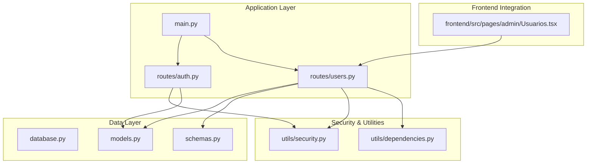
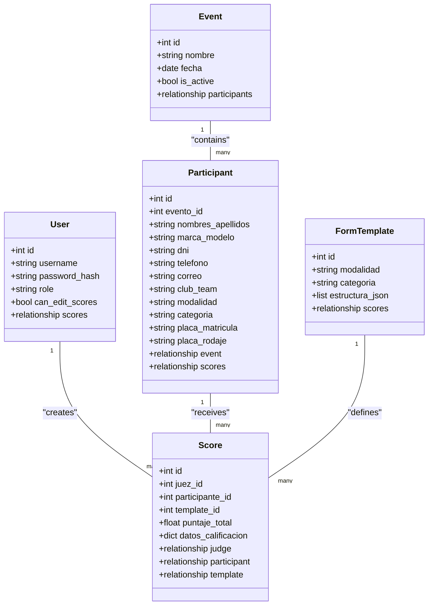
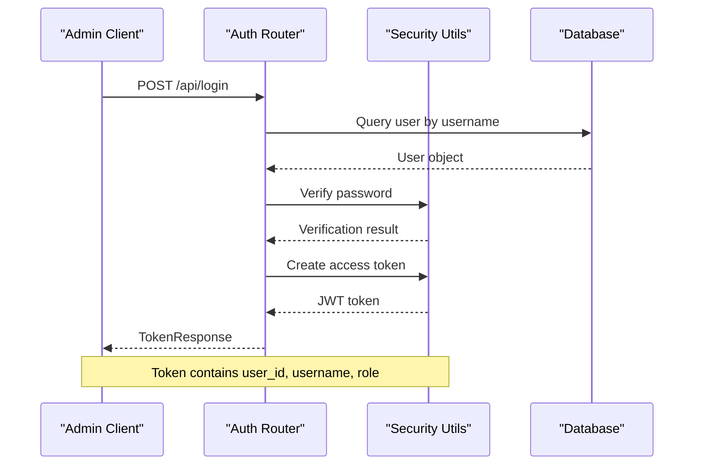
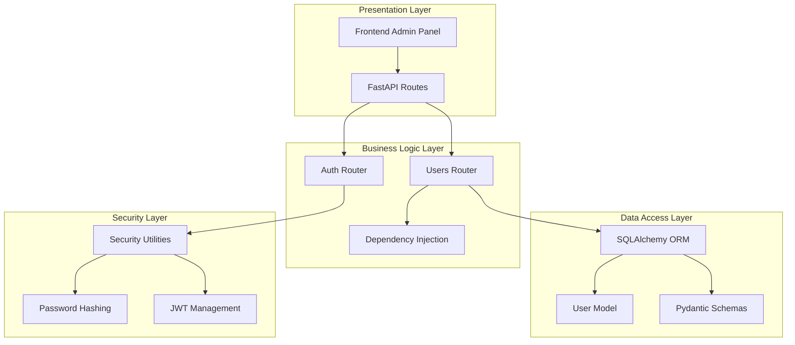
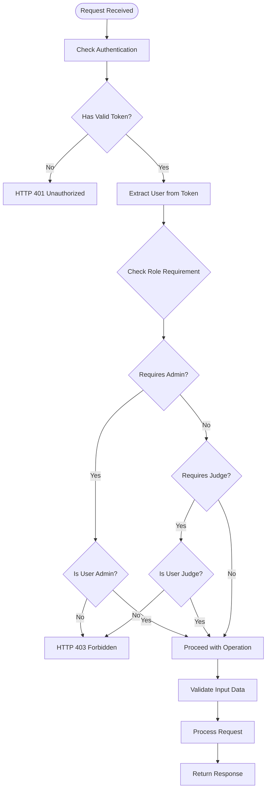
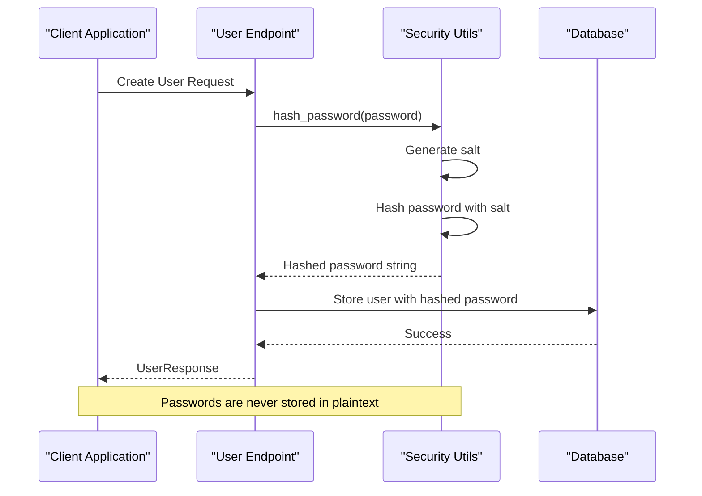
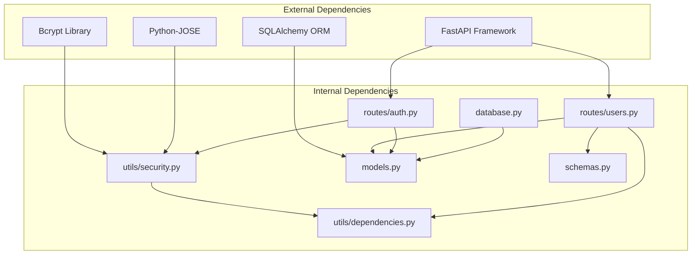

# User Management API

<cite>
**Referenced Files in This Document**
- [main.py](file://main.py)
- [database.py](file://database.py)
- [routes/users.py](file://routes/users.py)
- [routes/auth.py](file://routes/auth.py)
- [models.py](file://models.py)
- [schemas.py](file://schemas.py)
- [utils/security.py](file://utils/security.py)
- [utils/dependencies.py](file://utils/dependencies.py)
- [frontend/src/pages/admin/Usuarios.tsx](file://frontend/src/pages/admin/Usuarios.tsx)
</cite>

## Table of Contents
1. [Introduction](#introduction)
2. [Project Structure](#project-structure)
3. [Core Components](#core-components)
4. [Architecture Overview](#architecture-overview)
5. [Detailed Component Analysis](#detailed-component-analysis)
6. [Dependency Analysis](#dependency-analysis)
7. [Performance Considerations](#performance-considerations)
8. [Troubleshooting Guide](#troubleshooting-guide)
9. [Conclusion](#conclusion)

## Introduction
This document provides comprehensive API documentation for user administration endpoints in the Car Audio and Tuning Judging system. The API enables administrators to manage users, assign roles, control permissions, and handle credential updates. It includes detailed endpoint specifications, data models, role-based access control mechanisms, and security considerations.

## Project Structure
The user management functionality is implemented as part of a FastAPI application with SQLAlchemy ORM for persistence and bcrypt for password hashing. The system follows a modular structure with dedicated routes, models, schemas, and utility modules.

**Diagram sources**
- [main.py:17-32](file://main.py#L17-L32)
- [routes/users.py:18](file://routes/users.py#L18)
- [routes/auth.py:10](file://routes/auth.py#L10)

**Section sources**
- [main.py:14-38](file://main.py#L14-L38)
- [database.py:15-34](file://database.py#L15-L34)

## Core Components
The user management system consists of several key components working together to provide secure user administration capabilities.

### Database Model
The User entity serves as the central data structure for user accounts, storing essential authentication and authorization information.

**Diagram sources**
- [models.py:11-95](file://models.py#L11-L95)

### Authentication and Authorization
The system implements JWT-based authentication with role-based access control (RBAC) to secure user management operations.

**Diagram sources**
- [routes/auth.py:13-35](file://routes/auth.py#L13-L35)
- [utils/security.py:29-39](file://utils/security.py#L29-L39)

**Section sources**
- [models.py:11-21](file://models.py#L11-L21)
- [utils/security.py:17-26](file://utils/security.py#L17-L26)
- [utils/dependencies.py:16-47](file://utils/dependencies.py#L16-L47)

## Architecture Overview
The user management API follows a layered architecture with clear separation of concerns between presentation, business logic, data access, and security layers.

**Diagram sources**
- [main.py:27-32](file://main.py#L27-L32)
- [routes/users.py:3-15](file://routes/users.py#L3-L15)
- [routes/auth.py:1-7](file://routes/auth.py#L1-L7)

## Detailed Component Analysis

### User Administration Endpoints

#### GET /api/users
Lists all users in the system with ascending ID order. Requires administrator privileges.

**Endpoint Details:**
- Method: GET
- Path: `/api/users`
- Authentication: Required (Administrator)
- Response: Array of UserResponse objects

**Security Implementation:**
- Uses `get_current_admin` dependency for role verification
- Returns all users sorted by ID for consistent ordering

**Section sources**
- [routes/users.py:21-26](file://routes/users.py#L21-L26)
- [utils/dependencies.py:32-38](file://utils/dependencies.py#L32-L38)

#### POST /api/users
Creates a new user account with role assignment. Implements special logic for initial system setup.

**Endpoint Details:**
- Method: POST
- Path: `/api/users`
- Authentication: Optional (requires token for non-initial users)
- Request Body: UserCreate schema
- Response: UserResponse object

**Business Logic:**
- **Initial User Creation**: First user must be assigned admin role
- **Subsequent Creations**: Only admins can create new users
- **Username Validation**: Prevents duplicate usernames
- **Password Security**: Automatically hashes passwords using bcrypt

**Section sources**
- [routes/users.py:29-65](file://routes/users.py#L29-L65)
- [routes/users.py:37-47](file://routes/users.py#L37-L47)
- [routes/users.py:49-54](file://routes/users.py#L49-L54)
- [utils/security.py:17-19](file://utils/security.py#L17-L19)

#### PUT /api/users/{user_id}/permissions
Updates a user's permission to edit scores. Primarily used for judge accounts.

**Endpoint Details:**
- Method: PUT
- Path: `/api/users/{user_id}/permissions`
- Authentication: Required (Administrator)
- Path Parameters: user_id (integer)
- Request Body: UserPermissionUpdate schema
- Response: UserResponse object

**Permission Logic:**
- Only administrators can modify user permissions
- Can only grant/revoke score editing privileges for judges
- No role changes are permitted through this endpoint

**Section sources**
- [routes/users.py:68-85](file://routes/users.py#L68-L85)
- [utils/dependencies.py:32-38](file://utils/dependencies.py#L32-L38)

#### PATCH /api/users/{user_id}/credentials
Updates another user's credentials (username/password). Primarily for judge accounts.

**Endpoint Details:**
- Method: PATCH
- Path: `/api/users/{user_id}/credentials`
- Authentication: Required (Administrator)
- Path Parameters: user_id (integer)
- Request Body: UserCredentialsUpdate schema
- Response: UserResponse object

**Validation Rules:**
- Only administrators can update other users' credentials
- Target user must be a judge (role validation)
- At least one field (username or password) must be provided
- Username uniqueness enforced across the system

**Section sources**
- [routes/users.py:88-143](file://routes/users.py#L88-L143)
- [routes/users.py:105-109](file://routes/users.py#L105-L109)
- [routes/users.py:111-115](file://routes/users.py#L111-L115)

#### PATCH /api/users/me/credentials
Allows administrators to update their own credentials.

**Endpoint Details:**
- Method: PATCH
- Path: `/api/users/me/credentials`
- Authentication: Required (Administrator)
- Request Body: UserCredentialsUpdate schema
- Response: UserResponse object

**Key Features:**
- Self-service credential updates for administrators
- Same validation rules apply as for other users
- Maintains audit trail through standard user model

**Section sources**
- [routes/users.py:146-191](file://routes/users.py#L146-L191)
- [routes/users.py:153-157](file://routes/users.py#L153-L157)

### Data Models and Schemas

#### User Model Schema
The User entity defines the core structure for user accounts in the system.

**Fields:**
- `id`: Primary key identifier (integer)
- `username`: Unique username (string, 100 chars max)
- `password_hash`: Bcrypt-hashed password (string, 255 chars max)
- `role`: User role (string, either "admin" or "juez")
- `can_edit_scores`: Permission flag for score editing (boolean)

**Constraints:**
- Username must be unique and non-null
- Role must be one of the predefined values
- Password hash is required for authentication

**Section sources**
- [models.py:14-18](file://models.py#L14-L18)

#### Request/Response Schemas
The system uses Pydantic schemas for input validation and response formatting.

**UserCreate Schema:**
- `username`: Required string (3-100 chars)
- `password`: Required string (4-128 chars)
- `role`: Required role type ("admin" or "juez")
- `can_edit_scores`: Optional boolean (default: false)

**UserResponse Schema:**
- `id`: Integer identifier
- `username`: String username
- `role`: Role type ("admin" or "juez")
- `can_edit_scores`: Boolean permission flag

**UserPermissionUpdate Schema:**
- `can_edit_scores`: Boolean permission value

**Section sources**
- [schemas.py:22-45](file://schemas.py#L22-L45)
- [schemas.py:29-35](file://schemas.py#L29-L35)
- [schemas.py:38-40](file://schemas.py#L38-L40)

### Role-Based Access Control
The system implements a hierarchical RBAC model with two primary roles:

**Diagram sources**
- [utils/dependencies.py:16-47](file://utils/dependencies.py#L16-L47)
- [routes/users.py:23](file://routes/users.py#L23)
- [routes/users.py:72](file://routes/users.py#L72)

**Section sources**
- [utils/dependencies.py:32-47](file://utils/dependencies.py#L32-L47)
- [routes/users.py:37-47](file://routes/users.py#L37-L47)

### Password Security Implementation
The system implements robust password security using industry-standard practices.

**Diagram sources**
- [utils/security.py:17-19](file://utils/security.py#L17-L19)
- [routes/users.py:58](file://routes/users.py#L58)

**Security Features:**
- bcrypt hashing with automatic salt generation
- Password verification using bcrypt comparison
- Secure JWT token generation with configurable expiration
- Input validation and sanitization

**Section sources**
- [utils/security.py:17-26](file://utils/security.py#L17-L26)
- [utils/security.py:29-39](file://utils/security.py#L29-L39)

## Dependency Analysis
The user management system exhibits clear dependency relationships that support maintainable and testable code architecture.

**Diagram sources**
- [requirements.txt:1-10](file://requirements.txt#L1-L10)
- [main.py:1-38](file://main.py#L1-L38)

**Key Dependencies:**
- FastAPI for routing and request handling
- SQLAlchemy for database abstraction
- Bcrypt for secure password hashing
- Python-JOSE for JWT token management
- Pydantic for data validation and serialization

**Section sources**
- [requirements.txt:1-10](file://requirements.txt#L1-L10)
- [main.py:1-38](file://main.py#L1-L38)

## Performance Considerations
The user management API is designed with performance and scalability in mind through several optimization strategies:

### Database Optimization
- **Indexing**: Primary keys and frequently queried fields are indexed
- **Connection Pooling**: SQLAlchemy session management for efficient database connections
- **Query Optimization**: Direct SQL queries for bulk operations
- **Unique Constraints**: Database-level uniqueness enforcement prevents duplicate entries

### Caching Strategy
- **Token-based Authentication**: JWT tokens eliminate repeated database lookups
- **Minimal Data Transfer**: Response schemas limit payload size
- **Efficient Sorting**: Database-side ordering reduces client-side processing

### Scalability Features
- **Modular Design**: Separate concerns enable independent scaling
- **Asynchronous Operations**: Non-blocking database operations
- **Resource Cleanup**: Proper session management prevents memory leaks

## Troubleshooting Guide

### Common Authentication Issues
**Problem**: Users receive 401 Unauthorized errors
**Causes**: Invalid or expired JWT tokens, malformed requests
**Solutions**: 
- Verify token format and expiration
- Check token URL encoding
- Ensure proper Authorization header format

**Problem**: Login failures despite correct credentials
**Causes**: Database connectivity issues, password hash mismatches
**Solutions**:
- Verify database connection string
- Check bcrypt library installation
- Validate password hashing process

### User Management Errors

**Problem**: 403 Forbidden when creating users
**Causes**: Non-admin users attempting privileged operations
**Solutions**:
- Verify requesting user has admin role
- Check JWT token claims
- Review role-based access control implementation

**Problem**: Username conflicts during user creation
**Causes**: Duplicate username entries
**Solutions**:
- Verify username uniqueness
- Check for case-insensitive duplicates
- Implement proper validation feedback

**Problem**: Credential update failures
**Causes**: Insufficient permissions, invalid input data
**Solutions**:
- Ensure target user is judge role
- Validate input field presence
- Check username uniqueness constraints

### Database Connectivity Issues
**Problem**: Database connection errors
**Causes**: Incorrect database path, missing migrations
**Solutions**:
- Verify SQLite database file location
- Run database initialization scripts
- Check file permissions for database directory

**Section sources**
- [routes/users.py:37-47](file://routes/users.py#L37-L47)
- [routes/users.py:49-54](file://routes/users.py#L49-L54)
- [routes/users.py:105-109](file://routes/users.py#L105-L109)
- [routes/auth.py:16-21](file://routes/auth.py#L16-L21)

## Conclusion
The User Management API provides a comprehensive, secure, and scalable solution for administrative user operations. Its implementation demonstrates strong adherence to security best practices, including bcrypt password hashing, JWT-based authentication, and role-based access control. The modular architecture ensures maintainability while the clear separation of concerns facilitates future enhancements and extensions.

The system successfully balances security requirements with usability, providing administrators with powerful tools for user management while maintaining strict access controls and data integrity. The comprehensive error handling and validation mechanisms ensure reliable operation across various deployment scenarios.