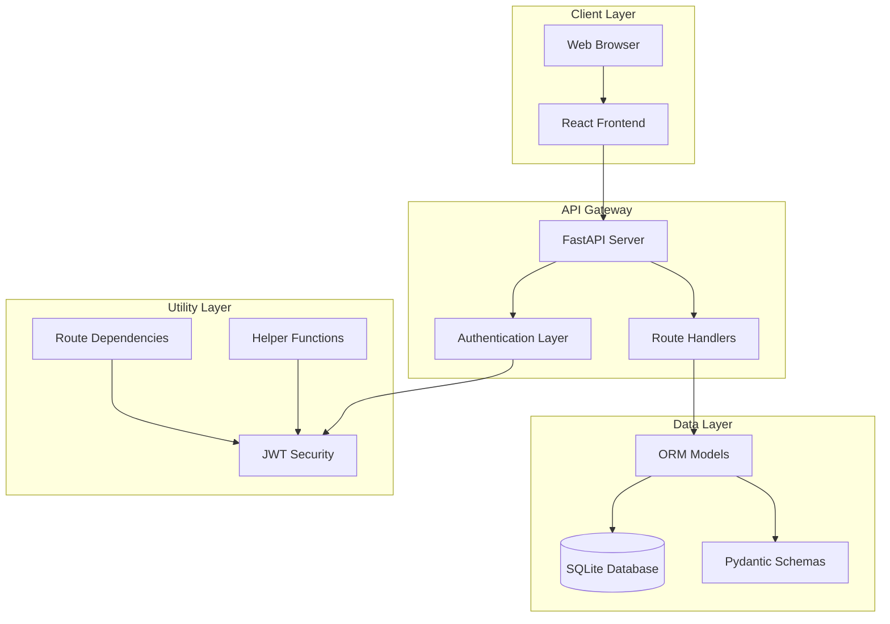
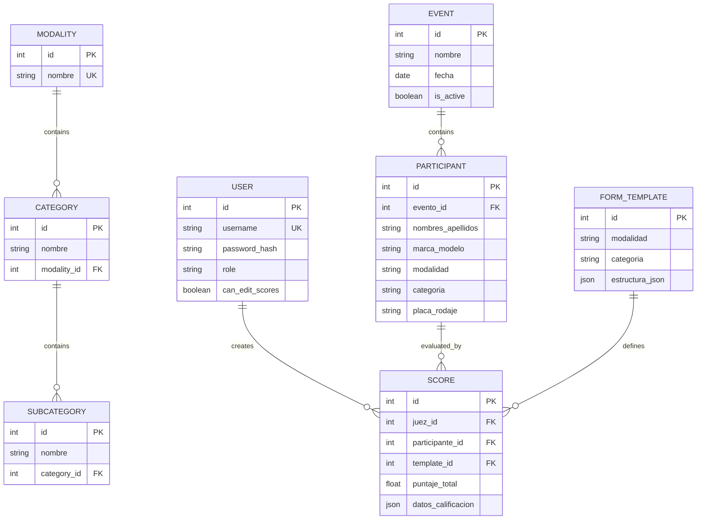
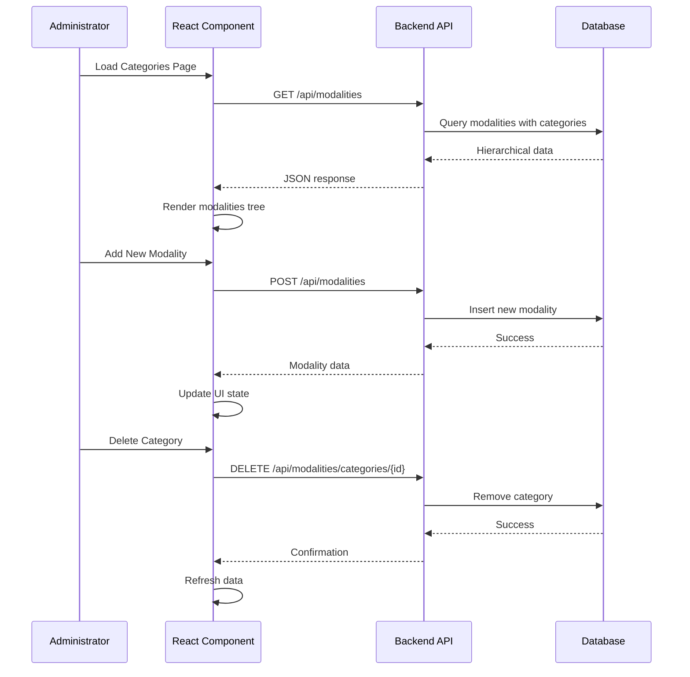
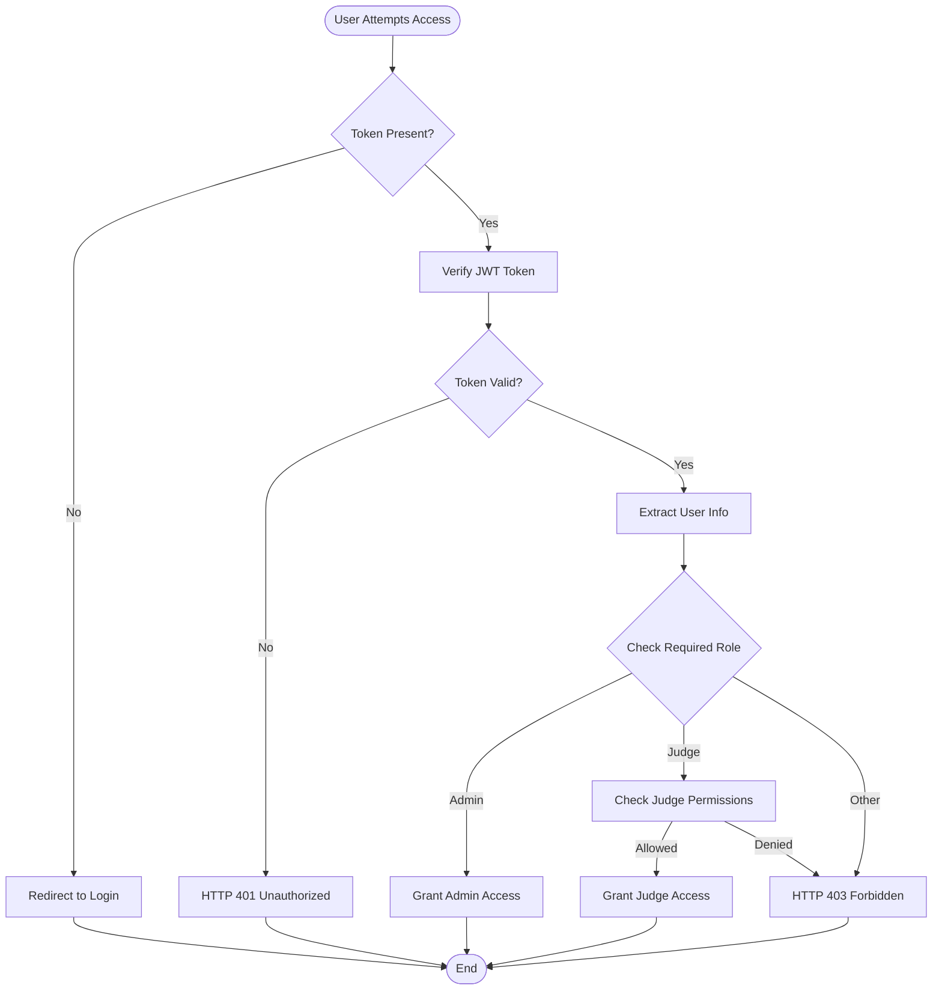
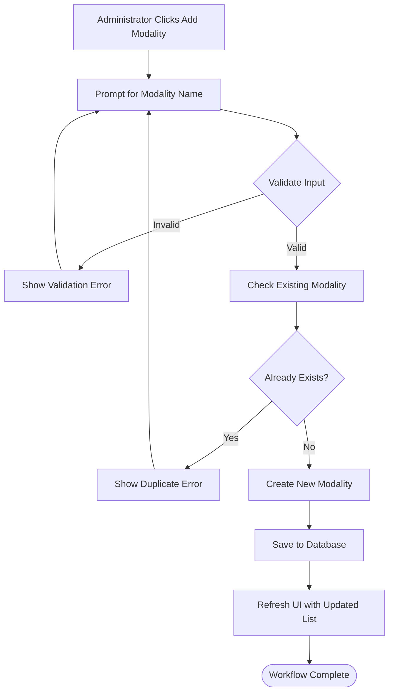
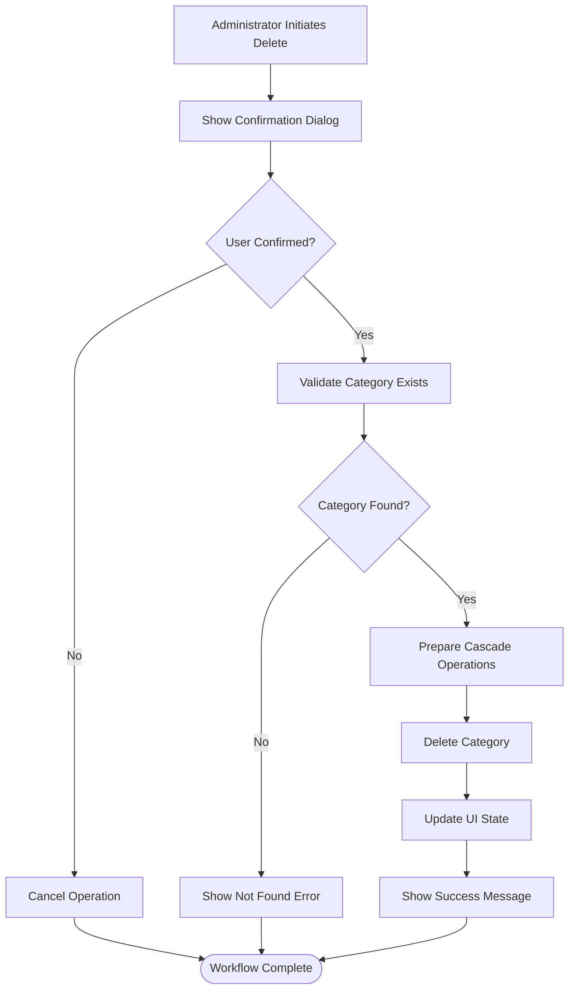

# Category Management System

<cite>
**Referenced Files in This Document**
- [main.py](file://main.py)
- [models.py](file://models.py)
- [schemas.py](file://schemas.py)
- [routes/categories.py](file://routes/categories.py)
- [database.py](file://database.py)
- [init_db.py](file://init_db.py)
- [frontend/src/pages/admin/Categorias.tsx](file://frontend/src/pages/admin/Categorias.tsx)
- [frontend/src/lib/api.ts](file://frontend/src/lib/api.ts)
- [frontend/src/contexts/AuthContext.tsx](file://frontend/src/contexts/AuthContext.tsx)
- [utils/dependencies.py](file://utils/dependencies.py)
- [utils/security.py](file://utils/security.py)
- [routes/auth.py](file://routes/auth.py)
- [seed_init.py](file://seed_init.py)
- [requirements.txt](file://requirements.txt)
</cite>

## Table of Contents
1. [Introduction](#introduction)
2. [System Architecture](#system-architecture)
3. [Database Design](#database-design)
4. [API Endpoints](#api-endpoints)
5. [Frontend Implementation](#frontend-implementation)
6. [Authentication & Authorization](#authentication--authorization)
7. [Data Models](#data-models)
8. [Category Management Workflows](#category-management-workflows)
9. [Security Implementation](#security-implementation)
10. [Deployment & Setup](#deployment--setup)
11. [Troubleshooting Guide](#troubleshooting-guide)
12. [Conclusion](#conclusion)

## Introduction

The Category Management System is a comprehensive web application designed for managing competition categories in the automotive audio and tuning industry. This system provides administrators with the ability to organize competitions through a hierarchical structure of modalities, categories, and subcategories, while judges can efficiently evaluate participants based on predefined scoring templates.

The platform consists of a FastAPI backend with a PostgreSQL database and a modern React frontend, offering real-time category management capabilities with robust authentication, authorization, and data validation mechanisms.

## System Architecture

The system follows a client-server architecture with clear separation of concerns between the frontend and backend components.



**Diagram sources**
- [main.py:1-53](file://main.py#L1-L53)
- [routes/categories.py:1-124](file://routes/categories.py#L1-L124)
- [models.py:1-153](file://models.py#L1-L153)

The architecture ensures scalability, maintainability, and clear separation between presentation, business logic, and data persistence layers.

## Database Design

The database design implements a hierarchical structure for competition organization with proper relationships and constraints.



**Diagram sources**
- [models.py:113-153](file://models.py#L113-L153)
- [models.py:24-102](file://models.py#L24-L102)

The design supports complex queries through joined loading and maintains referential integrity through foreign key constraints.

## API Endpoints

The system exposes RESTful APIs for comprehensive category management operations.

### Category Management Endpoints

| Endpoint | Method | Description | Authentication |
|----------|--------|-------------|----------------|
| `/api/modalities` | GET | Retrieve all modalities with nested categories | User |
| `/api/modalities` | POST | Create a new modality | Admin |
| `/api/modalities/{modality_id}/categories` | POST | Create a new category within a modality | Admin |
| `/api/modalities/categories/{category_id}` | DELETE | Delete a category by ID | Admin |
| `/api/modalities/{modality_id}` | DELETE | Delete a modality and all its categories | Admin |

### Authentication Endpoints

| Endpoint | Method | Description |
|----------|--------|-------------|
| `/api/login` | POST | User authentication and token generation |

**Section sources**
- [routes/categories.py:12-124](file://routes/categories.py#L12-L124)
- [routes/auth.py:13-36](file://routes/auth.py#L13-L36)

## Frontend Implementation

The frontend provides an intuitive interface for administrators to manage the competition hierarchy through a React-based single-page application.



**Diagram sources**
- [frontend/src/pages/admin/Categorias.tsx:32-51](file://frontend/src/pages/admin/Categorias.tsx#L32-L51)
- [frontend/src/pages/admin/Categorias.tsx:104-132](file://frontend/src/pages/admin/Categorias.tsx#L104-L132)

The frontend implements responsive design principles and provides real-time feedback through loading states and error handling.

**Section sources**
- [frontend/src/pages/admin/Categorias.tsx:1-337](file://frontend/src/pages/admin/Categorias.tsx#L1-L337)
- [frontend/src/lib/api.ts:1-41](file://frontend/src/lib/api.ts#L1-L41)

## Authentication & Authorization

The system implements JWT-based authentication with role-based access control to ensure secure access to administrative functions.



**Diagram sources**
- [utils/dependencies.py:32-47](file://utils/dependencies.py#L32-L47)
- [routes/auth.py:13-36](file://routes/auth.py#L13-L36)

The authentication flow ensures that only authorized users can perform administrative actions while maintaining session security through token expiration and validation.

**Section sources**
- [utils/dependencies.py:16-71](file://utils/dependencies.py#L16-L71)
- [utils/security.py:1-54](file://utils/security.py#L1-54)

## Data Models

The system uses Pydantic models for data validation and serialization, ensuring type safety and consistent data exchange between frontend and backend.

### Core Data Models

| Model | Purpose | Key Fields |
|-------|---------|------------|
| **Modality** | Competition discipline (e.g., SPL, SQ) | `id`, `nombre` |
| **Category** | Specific competition category | `id`, `nombre`, `modality_id` |
| **Subcategory** | Fine-grained divisions | `id`, `nombre`, `category_id` |
| **User** | System users with roles | `id`, `username`, `role`, `can_edit_scores` |
| **Event** | Competition events | `id`, `nombre`, `fecha`, `is_active` |
| **Participant** | Competitor entries | `id`, `evento_id`, `modalidad`, `categoria` |
| **FormTemplate** | Scoring form definitions | `id`, `modalidad`, `categoria`, `estructura_json` |
| **Score** | Judge evaluations | `id`, `juez_id`, `participante_id`, `template_id`, `puntaje_total` |

**Section sources**
- [schemas.py:165-202](file://schemas.py#L165-L202)
- [models.py:113-153](file://models.py#L113-L153)

## Category Management Workflows

The system supports comprehensive workflows for managing the competition hierarchy from modalities down to subcategories.

### Modality Creation Workflow



**Diagram sources**
- [routes/categories.py:27-45](file://routes/categories.py#L27-L45)
- [frontend/src/pages/admin/Categorias.tsx:53-68](file://frontend/src/pages/admin/Categorias.tsx#L53-L68)

### Category Deletion Workflow

The deletion process includes cascade operations to remove associated categories and subcategories safely.



**Diagram sources**
- [routes/categories.py:88-104](file://routes/categories.py#L88-L104)
- [frontend/src/pages/admin/Categorias.tsx:119-132](file://frontend/src/pages/admin/Categorias.tsx#L119-L132)

**Section sources**
- [routes/categories.py:88-124](file://routes/categories.py#L88-L124)
- [frontend/src/pages/admin/Categorias.tsx:104-147](file://frontend/src/pages/admin/Categorias.tsx#L104-L147)

## Security Implementation

The system implements multiple layers of security to protect against unauthorized access and ensure data integrity.

### JWT Token Security

The authentication system uses JSON Web Tokens with configurable expiration times and secure signing algorithms.

| Security Feature | Implementation | Configuration |
|------------------|----------------|---------------|
| **Token Expiration** | 720 minutes (12 hours) default | `ACCESS_TOKEN_EXPIRE_MINUTES` |
| **Signing Algorithm** | HS256 with secret key | `ALGORITHM` constant |
| **Password Hashing** | bcrypt with salt | `hash_password()` function |
| **Role-Based Access** | Admin/judge role validation | `get_current_admin()` |
| **Token Validation** | Centralized JWT decoding | `decode_access_token()` |

### Database Security

The database implementation includes several security measures:

- **SQL Injection Prevention**: SQLAlchemy ORM automatically handles parameter binding
- **Unique Constraints**: Prevents duplicate entries at database level
- **Foreign Key Constraints**: Maintains referential integrity
- **Column-Level Validation**: Ensures data consistency

**Section sources**
- [utils/security.py:9-54](file://utils/security.py#L9-L54)
- [models.py:127-146](file://models.py#L127-L146)

## Deployment & Setup

The system can be deployed using various methods, with Docker support recommended for production environments.

### Prerequisites

```bash
# Install Python dependencies
pip install -r requirements.txt

# Initialize database
python init_db.py

# Seed initial data (creates admin user and official modalities)
python seed_init.py
```

### Environment Configuration

| Environment Variable | Purpose | Default Value |
|---------------------|---------|---------------|
| `JWT_SECRET_KEY` | JWT signing key | `change-this-secret-key-before-production` |
| `ACCESS_TOKEN_EXPIRE_MINUTES` | Token lifetime in minutes | `720` |
| `DATABASE_URL` | Database connection string | SQLite app.db |

### Startup Commands

```bash
# Development mode
uvicorn main:app --host 0.0.0.0 --port 8000 --reload

# Production mode
uvicorn main:app --host 0.0.0.0 --port 8000 --workers 4
```

**Section sources**
- [requirements.txt:1-10](file://requirements.txt#L1-L10)
- [seed_init.py:13-109](file://seed_init.py#L13-L109)

## Troubleshooting Guide

### Common Issues and Solutions

| Issue | Symptoms | Solution |
|-------|----------|----------|
| **Authentication Failures** | 401 errors on protected routes | Verify JWT secret key and token validity |
| **Database Connection Errors** | OperationalError on startup | Check DATABASE_URL and file permissions |
| **CORS Issues** | Cross-origin request blocked | Verify CORS middleware configuration |
| **Category Creation Fails** | 400 Bad Request errors | Check unique constraints on modality/category names |
| **Frontend API Errors** | Network errors in browser console | Verify API base URL and server availability |

### Debugging Steps

1. **Check Server Logs**: Monitor uvicorn logs for error messages
2. **Validate Database**: Run `python init_db.py` to recreate tables
3. **Test Authentication**: Use curl to test login endpoint
4. **Verify Dependencies**: Ensure all Python packages are installed
5. **Check Environment Variables**: Validate JWT and database configurations

### Performance Considerations

- **Database Indexes**: Foreign key columns are indexed for optimal query performance
- **Connection Pooling**: SQLAlchemy session management handles connection reuse
- **Frontend Caching**: React components implement efficient re-rendering
- **API Response Optimization**: Joined loading reduces database queries

## Conclusion

The Category Management System provides a robust foundation for organizing automotive competition categories with comprehensive administrative capabilities. The system's modular architecture, strong security implementation, and intuitive user interface make it suitable for both small-scale and enterprise-level competition management.

Key strengths include:
- **Hierarchical Organization**: Flexible modality-category-subcategory structure
- **Role-Based Access Control**: Secure administration with judge permissions
- **Real-Time Updates**: Responsive frontend with immediate feedback
- **Data Integrity**: Comprehensive validation and constraint enforcement
- **Scalable Architecture**: Clean separation of concerns and extensible design

The system is ready for production deployment with proper environment configuration and security hardening, providing administrators with powerful tools to manage complex competition structures efficiently.