# Data Models and Database Schema

<cite>
**Referenced Files in This Document**
- [models.py](file://models.py)
- [schemas.py](file://schemas.py)
- [database.py](file://database.py)
- [routes/users.py](file://routes/users.py)
- [routes/events.py](file://routes/events.py)
- [routes/participants.py](file://routes/participants.py)
- [routes/scorecards.py](file://routes/scorecards.py)
- [routes/evaluation_templates.py](file://routes/evaluation_templates.py)
- [routes/regulations.py](file://routes/regulations.py)
- [routes/categories.py](file://routes/categories.py)
- [routes/modalities.py](file://routes/modalities.py)
- [routes/judge_assignments.py](file://routes/judge_assignments.py)
- [utils/dependencies.py](file://utils/dependencies.py)
- [utils/security.py](file://utils/security.py)
- [seed_init.py](file://seed_init.py)
- [init_db.py](file://init_db.py)
- [main.py](file://main.py)
</cite>

## Update Summary
**Changes Made**
- Enhanced documentation to include comprehensive coverage of five new database models: EvaluationTemplate, ScoreCard, JudgeAssignment, and Regulation
- Updated participant entity with enhanced legacy field support and improved category relationships
- Documented the new ScoreCard system for structured evaluation workflows with draft/completed status tracking
- Added JudgeAssignment system for judge permissions and section assignments with principal judge designation
- Enhanced migration system documentation with comprehensive SQLite schema evolution capabilities
- Updated entity relationship diagrams to reflect all model relationships and cascade delete functionality
- Added comprehensive validation rules for new evaluation systems and judge permissions
- Updated performance considerations for new scoring workflows and hierarchical structures

## Table of Contents
1. [Introduction](#introduction)
2. [Project Structure](#project-structure)
3. [Core Components](#core-components)
4. [Architecture Overview](#architecture-overview)
5. [Detailed Component Analysis](#detailed-component-analysis)
6. [Dependency Analysis](#dependency-analysis)
7. [Performance Considerations](#performance-considerations)
8. [Troubleshooting Guide](#troubleshooting-guide)
9. [Conclusion](#conclusion)
10. [Appendices](#appendices)

## Introduction
This document describes the data model and database schema for the Juzgamiento application. It covers entity definitions, relationships, indexes, constraints, and referential integrity enforced by SQLAlchemy. It also documents Pydantic validation schemas used for API requests and responses, ORM mappings, and practical data access patterns. Guidance on query optimization, performance, data lifecycle, security, and migrations is included, along with sample data examples and common query patterns.

The application now features a comprehensive three-tier hierarchical structure for competition organization, advanced evaluation systems with master templates, sophisticated judge assignment management, and complete competition document management capabilities.

## Project Structure
The data model is centered around ten entities: Users, Events, Participants, FormTemplates, Scores, Regulations, Modalities, Categories, EvaluationTemplates, ScoreCards, and JudgeAssignments. These are defined in the SQLAlchemy declarative base and exposed via FastAPI routes with Pydantic schemas for validation and serialization. A lightweight SQLite engine is configured with a comprehensive migration helper to evolve the schema safely.

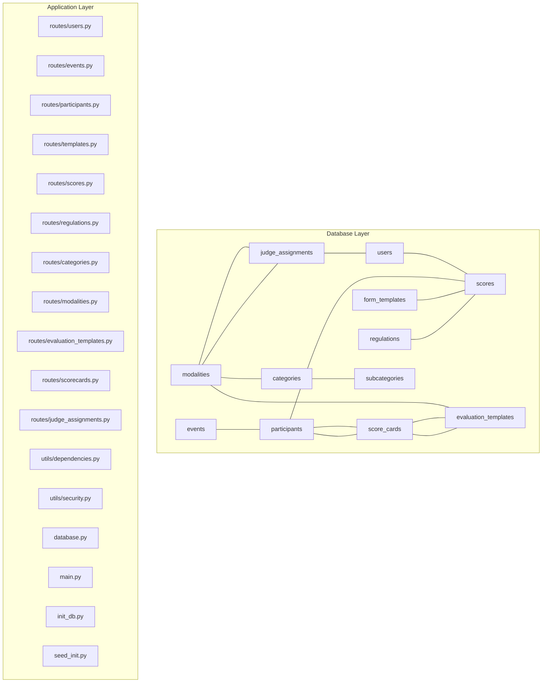

**Diagram sources**
- [models.py:11-225](file://models.py#L11-L225)
- [database.py:19-34](file://database.py#L19-L34)
- [routes/users.py:1-221](file://routes/users.py#L1-L221)
- [routes/events.py:1-116](file://routes/events.py#L1-L116)
- [routes/participants.py:1-430](file://routes/participants.py#L1-L430)
- [routes/scorecards.py:1-725](file://routes/scorecards.py#L1-L725)
- [routes/evaluation_templates.py:1-172](file://routes/evaluation_templates.py#L1-L172)
- [routes/regulations.py:1-110](file://routes/regulations.py#L1-L110)
- [routes/categories.py:1-174](file://routes/categories.py#L1-L174)
- [routes/modalities.py:1-180](file://routes/modalities.py#L1-L180)
- [routes/judge_assignments.py:1-308](file://routes/judge_assignments.py#L1-L308)
- [utils/dependencies.py:1-71](file://utils/dependencies.py#L1-L71)
- [utils/security.py:1-54](file://utils/security.py#L1-L54)
- [main.py:1-53](file://main.py#L1-L53)
- [init_db.py:1-32](file://init_db.py#L1-L32)
- [seed_init.py:1-109](file://seed_init.py#L1-L109)

**Section sources**
- [models.py:11-225](file://models.py#L11-L225)
- [database.py:19-34](file://database.py#L19-L34)

## Core Components
This section defines each entity, its fields, data types, and constraints. It also documents indexes and foreign keys, and explains how relationships are mapped in SQLAlchemy.

- Users
  - Purpose: Stores judge and administrator accounts with credentials and permissions.
  - Fields:
    - id: integer, primary key, indexed.
    - username: string(100), unique, indexed, not null.
    - password_hash: string(255), not null.
    - role: string(20), not null; values constrained to "admin" or "juez".
    - can_edit_scores: boolean, default false, not null.
    - modalidades_asignadas: JSON array, default empty, stores assigned modalities for judges.
  - Indexes: username unique, id index.
  - Constraints: none explicit at ORM level; uniqueness enforced by database.
  - Relationships: one-to-many to Scores via judge; one-to-many to JudgeAssignments via user.

- Events
  - Purpose: Represents competition events with dates and activity flag.
  - Fields:
    - id: integer, primary key, indexed.
    - nombre: string(150), not null, indexed.
    - fecha: date, not null, indexed.
    - is_active: boolean, default true, not null.
  - Indexes: id, nombre, fecha.
  - Constraints: none explicit at ORM level.
  - Relationships: one-to-many to Participants via event with cascade delete-orphan.

- Participants
  - Purpose: Represents competitors registered for an event with enhanced category assignment and legacy field support.
  - Fields:
    - id: integer, primary key, indexed.
    - evento_id: integer, foreign key to events.id, not null, indexed.
    - category_id: integer, foreign key to categories.id, nullable, indexed.
    - nombres_apellidos: string(150), not null, indexed.
    - dni: string(50), nullable.
    - telefono: string(50), nullable.
    - correo: string(150), nullable.
    - club_team: string(150), nullable.
    - marca_modelo: string(150), not null.
    - modalidad: string(100), not null, indexed.
    - categoria: string(100), not null, indexed.
    - placa_rodaje: string(50), not null, indexed.
    - nombre_competidor: string(150), not null (legacy field).
    - auto_marca_modelo: string(150), not null (legacy field).
    - placa_matricula: string(50), not null (legacy field).
  - Indexes: id, evento_id, category_id, nombres_apellidos, modalidad, categoria, placa_rodaje.
  - Constraints:
    - UniqueConstraint on (evento_id, placa_rodaje).
  - Relationships: many-to-one to Event via event; many-to-one to Category via category; one-to-many to Scores via participant with cascade delete-orphan; one-to-one to ScoreCard via participant with cascade delete-orphan.

- FormTemplates
  - Purpose: Defines scoring rubrics per modalidad and categoria.
  - Fields:
    - id: integer, primary key, indexed.
    - modalidad: string(100), not null, indexed.
    - categoria: string(100), not null, indexed.
    - estructura_json: JSON, not null.
  - Indexes: id, modalidad, categoria.
  - Constraints:
    - UniqueConstraint on (modalidad, categoria).
  - Relationships: one-to-many to Scores via template.

- Scores
  - Purpose: Stores judge ratings for a specific participant using a given template.
  - Fields:
    - id: integer, primary key, indexed.
    - juez_id: integer, foreign key to users.id, not null, indexed.
    - participante_id: integer, foreign key to participants.id, not null, indexed.
    - template_id: integer, foreign key to form_templates.id, not null, indexed.
    - puntaje_total: float, not null, default 0.
    - datos_calificacion: JSON, not null.
  - Indexes: id, juez_id, participante_id, template_id.
  - Constraints:
    - UniqueConstraint on (juez_id, participante_id).
  - Relationships: many-to-one to User via judge; many-to-one to Participant via participant; many-to-one to FormTemplate via template.

- Regulations
  - Purpose: Stores official competition regulations as downloadable PDF files.
  - Fields:
    - id: integer, primary key, indexed.
    - titulo: string(200), not null.
    - modalidad: string(100), not null, indexed.
    - archivo_url: string(500), not null.
  - Indexes: id, modalidad.
  - Constraints: none explicit at ORM level.
  - Relationships: none (standalone entity).

- Modalities
  - Purpose: Represents competition modalities (e.g., SQ, SPL, SQL) with hierarchical organization.
  - Fields:
    - id: integer, primary key, indexed.
    - nombre: string(100), unique, not null, indexed.
  - Indexes: id, nombre unique.
  - Constraints: none explicit at ORM level; uniqueness enforced by database.
  - Relationships: one-to-many to Categories via modality with cascade delete-orphan; one-to-one to EvaluationTemplate via modality with cascade delete-orphan; one-to-many to JudgeAssignments via modality with cascade delete-orphan.

- Categories
  - Purpose: Represents competition categories within modalities with level-based organization.
  - Fields:
    - id: integer, primary key, indexed.
    - nombre: string(100), not null.
    - level: integer, not null, default 1, server_default="1".
    - modality_id: integer, foreign key to modalities.id, not null, indexed.
  - Indexes: id, modality_id.
  - Constraints:
    - UniqueConstraint on (modality_id, nombre).
  - Relationships: many-to-one to Modality via modality; one-to-many to Participants via category; one-to-many to Subcategories via category with cascade delete-orphan.

- EvaluationTemplate
  - Purpose: Defines master scoring rubrics for each modality with structured sections and items.
  - Fields:
    - id: integer, primary key, indexed.
    - modality_id: integer, foreign key to modalities.id, not null, unique, indexed.
    - content: JSON, not null.
  - Indexes: id, modality_id unique.
  - Constraints:
    - UniqueConstraint on (modality_id).
  - Relationships: many-to-one to Modality via modality; one-to-many to ScoreCards via template.

- ScoreCard
  - Purpose: Stores judge evaluations for participants using EvaluationTemplate structure.
  - Fields:
    - id: integer, primary key, indexed.
    - participant_id: integer, foreign key to participants.id, not null, unique, indexed.
    - template_id: integer, foreign key to evaluation_templates.id, not null, indexed.
    - answers: JSON, not null, default {}.
    - status: string(20), not null, default "draft", server_default="draft".
    - calculated_level: integer, not null, default 1.
    - total_score: float, not null, default 0.
  - Indexes: id, participant_id unique, template_id.
  - Constraints:
    - UniqueConstraint on (participant_id).
  - Relationships: many-to-one to Participant via participant; many-to-one to EvaluationTemplate via template.

- JudgeAssignment
  - Purpose: Manages judge permissions and section assignments for modalities.
  - Fields:
    - id: integer, primary key, indexed.
    - user_id: integer, foreign key to users.id, not null, indexed.
    - modality_id: integer, foreign key to modalities.id, not null, indexed.
    - assigned_sections: JSON, not null, default [], server_default="[]".
    - is_principal: boolean, not null, default false.
  - Indexes: id, user_id, modality_id.
  - Constraints:
    - UniqueConstraint on (user_id, modality_id).
  - Relationships: many-to-one to User via user; many-to-one to Modality via modality.

- Subcategories
  - Purpose: Provides the third tier of hierarchical organization within categories.
  - Fields:
    - id: integer, primary key, indexed.
    - nombre: string(100), not null.
    - category_id: integer, foreign key to categories.id, not null, indexed.
  - Indexes: id, category_id.
  - Constraints:
    - UniqueConstraint on (category_id, nombre).
  - Relationships: many-to-one to Category via category; one-to-many to Participants via category with cascade delete-orphan.

**Section sources**
- [models.py:11-225](file://models.py#L11-L225)

## Architecture Overview
The application uses a layered architecture with a comprehensive three-tier hierarchical structure:
- Data Access: SQLAlchemy ORM models backed by a SQLite engine with advanced relationships.
- API Layer: FastAPI routes handle requests, enforce authorization, and orchestrate database operations.
- Validation: Pydantic schemas validate request/response payloads.
- Security: JWT-based authentication and bcrypt password hashing.
- File Management: PDF files are stored separately and referenced by URL in the database.
- Hierarchical Organization: Modalities contain Categories which contain Subcategories, organizing Participants and FormTemplates in a three-tier structure.
- Advanced Evaluation: EvaluationTemplate provides master rubrics, ScoreCard manages structured evaluations, and JudgeAssignment controls judge permissions.

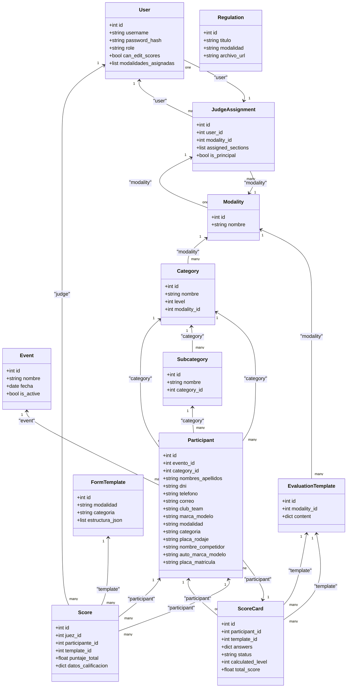

**Diagram sources**
- [models.py:11-225](file://models.py#L11-L225)

## Detailed Component Analysis

### Users
- ORM mapping: SQLAlchemy mapped columns with primary key and indexes; relationship to Score via back_populates and JudgeAssignment via back_populates.
- Pydantic validation: UserCreate, UserResponse, UserPermissionUpdate, UserCredentialsUpdate define input/output shapes and constraints (min/max lengths, role literal).
- Access control: Routes enforce admin-only creation and permission updates; credential updates are role-scoped.
- Judge assignment integration: modalidades_asignadas field tracks assigned modalities for judges.

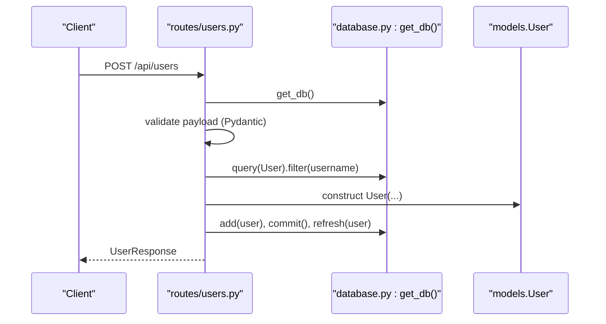

**Diagram sources**
- [routes/users.py:29-73](file://routes/users.py#L29-L73)
- [schemas.py:22-47](file://schemas.py#L22-L47)
- [database.py:28-34](file://database.py#L28-L34)

**Section sources**
- [routes/users.py:21-221](file://routes/users.py#L21-L221)
- [schemas.py:10-47](file://schemas.py#L10-L47)
- [models.py:11-25](file://models.py#L11-L25)

### Events
- ORM mapping: Event entity with indexes on name and date; relationship to Participant with cascade delete-orphan.
- Pydantic validation: EventCreate, EventResponse, EventUpdate define allowed fields and constraints.
- Operations:
  - List events ordered by newest first.
  - Create event (admin).
  - Partially update event (admin); at least one field must be provided.

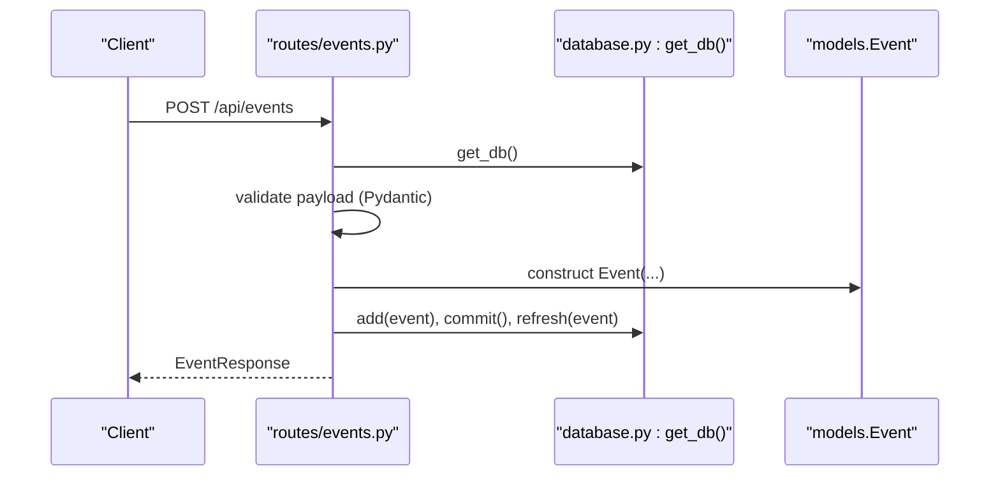

**Diagram sources**
- [routes/events.py:21-35](file://routes/events.py#L21-L35)
- [schemas.py:49-71](file://schemas.py#L49-L71)
- [database.py:28-34](file://database.py#L28-L34)

**Section sources**
- [routes/events.py:13-116](file://routes/events.py#L13-L116)
- [schemas.py:49-71](file://schemas.py#L49-L71)
- [models.py:28-39](file://models.py#L28-L39)

### Participants
- ORM mapping: Participant with foreign key to Event and Category; unique constraint on (evento_id, placa_rodaje); indexes on multiple fields; relationships to Event, Category, Score, and ScoreCard with cascade delete-orphan.
- Pydantic validation: ParticipantCreate, ParticipantUpdate, ParticipantResponse define allowed fields and constraints; ParticipantNameUpdate supports partial name updates.
- Data ingestion:
  - Excel upload endpoint normalizes column names, validates required fields, deduplicates plates per event, and bulk inserts records.
  - Normalization ensures legacy columns are populated for SQLite compatibility.
- Validation rules:
  - Unique plate per event within the same evento_id.
  - Required fields include nombres_apellidos, marca_modelo, modalidad, categoria, placa_rodaje.
  - Optional fields include dni, telefono, correo, club_team.
  - Legacy fields (nombre_competidor, auto_marca_modelo, placa_matricula) maintained for backward compatibility.

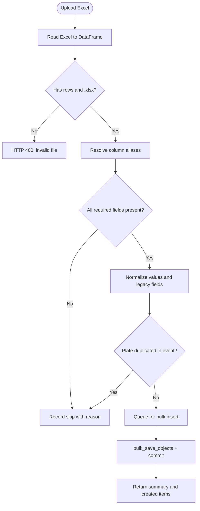

**Diagram sources**
- [routes/participants.py:316-430](file://routes/participants.py#L316-L430)
- [schemas.py:86-118](file://schemas.py#L86-L118)

**Section sources**
- [routes/participants.py:181-287](file://routes/participants.py#L181-L287)
- [routes/participants.py:316-430](file://routes/participants.py#L316-L430)
- [schemas.py:70-118](file://schemas.py#L70-L118)
- [models.py:42-80](file://models.py#L42-L80)

### FormTemplates
- ORM mapping: FormTemplate with unique constraint on (modalidad, categoria); relationship to Score.
- Pydantic validation: TemplateCreate, TemplateResponse define allowed fields and constraints.
- Operations:
  - Upsert template by modalidad and categoria (admin).
  - Retrieve template by modalidad and categoria (any authenticated user).

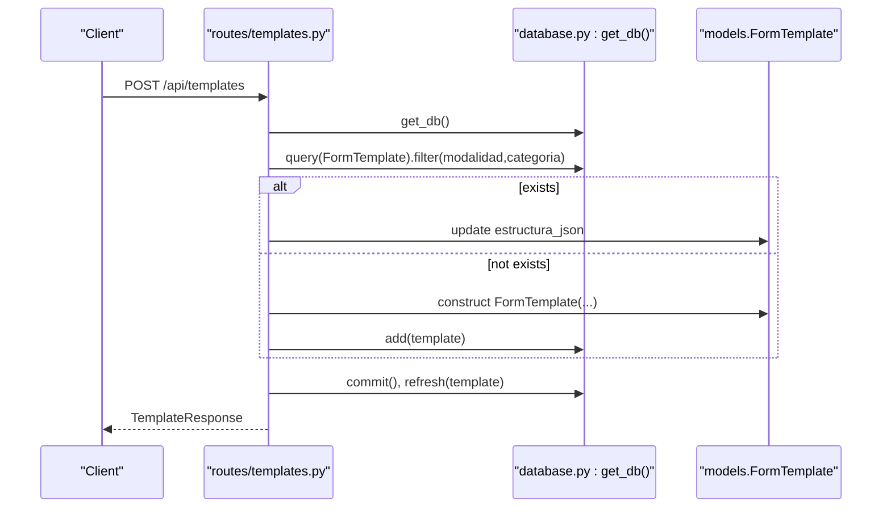

**Diagram sources**
- [routes/templates.py:26-53](file://routes/templates.py#L26-L53)
- [schemas.py:120-133](file://schemas.py#L120-L133)
- [database.py:28-34](file://database.py#L28-L34)

**Section sources**
- [routes/templates.py:13-134](file://routes/templates.py#L13-L134)
- [schemas.py:120-133](file://schemas.py#L120-L133)
- [models.py:83-94](file://models.py#L83-L94)

### Scores
- ORM mapping: Score with foreign keys to User, Participant, and FormTemplate; unique constraint on (juez_id, participante_id); relationship to all three entities.
- Pydantic validation: ScoreCreate, ScoreResponse define allowed fields and computed fields for enriched responses.
- Scoring logic:
  - Validates participant/template match by modalidad and categoria.
  - Computes puntaje_total recursively by summing numeric values in datos_calificacion.
  - Supports create or update; editing existing scores requires can_edit_scores permission for the judge.

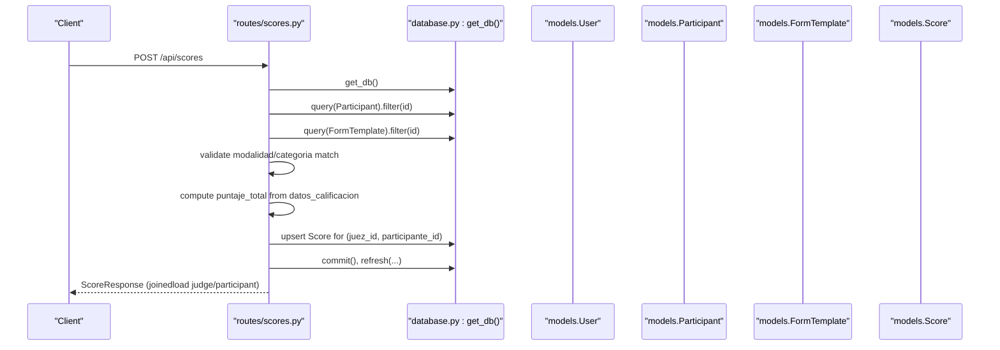

**Diagram sources**
- [routes/scores.py:43-114](file://routes/scores.py#L43-L114)
- [schemas.py:135-154](file://schemas.py#L135-L154)
- [database.py:28-34](file://database.py#L28-L34)

**Section sources**
- [routes/scores.py:43-132](file://routes/scores.py#L43-L132)
- [schemas.py:135-154](file://schemas.py#L135-L154)
- [models.py:97-112](file://models.py#L97-L112)

### Regulations
- ORM mapping: Regulation entity with fields for title, modalidad, and archivo_url; no foreign keys or relationships.
- Pydantic validation: RegulationResponse defines the structure for API responses.
- File management:
  - PDF files are uploaded to the server's uploads directory with unique filenames.
  - Only PDF files are accepted (.pdf extension).
  - File URLs are stored in the database for later retrieval.
- Operations:
  - Upload PDF with title and modalidad (admin only).
  - List all regulations with optional modalidad filtering.
  - Delete regulation and remove associated file from disk.
- Application integration:
  - Routes are included in the main application router.
  - Static file serving enabled for uploaded PDFs.

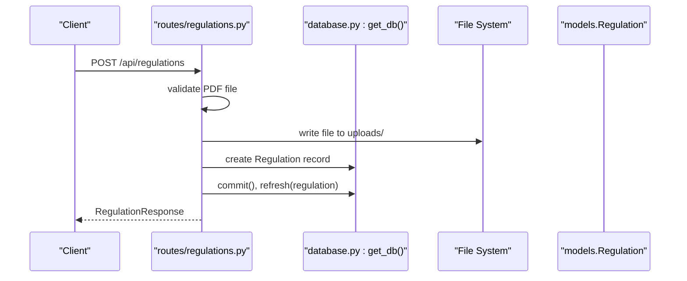

**Diagram sources**
- [routes/regulations.py:20-64](file://routes/regulations.py#L20-L64)
- [schemas.py:156-163](file://schemas.py#L156-L163)
- [database.py:28-34](file://database.py#L28-L34)

**Section sources**
- [routes/regulations.py:1-110](file://routes/regulations.py#L1-L110)
- [schemas.py:156-163](file://schemas.py#L156-L163)
- [models.py:165-171](file://models.py#L165-L171)
- [main.py:52-53](file://main.py#L52-L53)

### Modalities, Categories, and Subcategories
- ORM mapping: Modality entity with unique constraint on nombre; Category entity with unique constraint on (modality_id, nombre) and foreign key to Modality with cascade delete-orphan; Subcategory entity with unique constraint on (category_id, nombre) and foreign key to Category.
- Pydantic validation: ModalityCreate, ModalityResponse, CategoryCreate, CategoryResponse, SubcategoryCreate, SubcategoryResponse define allowed fields and nested structures.
- Hierarchical organization:
  - Modalities represent competition modalities (e.g., SQ, SPL, SQL).
  - Categories are sub-divisions within modalities with level-based organization (Intro: 1, Aficionado: 2, Pro: 3, Master: 4).
  - Subcategories provide the third tier of organization within categories.
  - Cascade delete ensures categories are automatically removed when modality is deleted, and subcategories are removed when categories are deleted.
- Operations:
  - List all modalities with nested categories and subcategories (admin).
  - Create new modality (admin).
  - Create new category within specific modality (admin).
  - Create new subcategory within specific category (admin).
  - Delete subcategory by ID (admin).
  - Delete category and all its subcategories (admin).
  - Delete modality and all its categories and subcategories (admin).

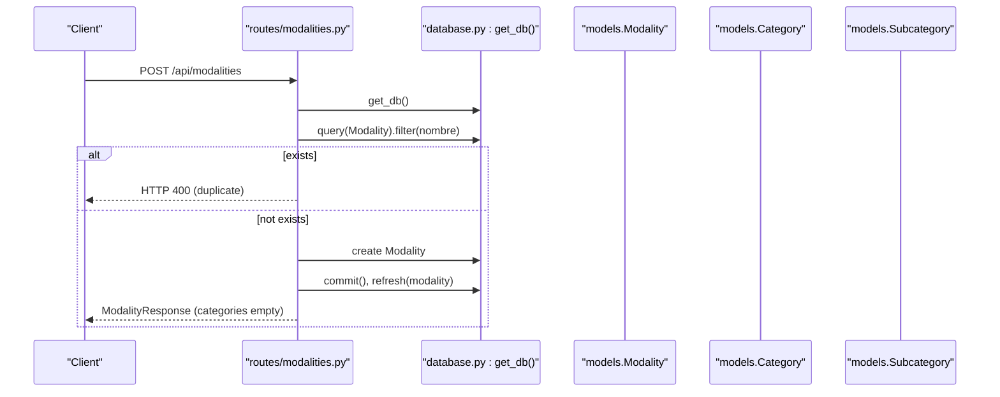

**Diagram sources**
- [routes/modalities.py:36-54](file://routes/modalities.py#L36-L54)
- [schemas.py:192-202](file://schemas.py#L192-L202)
- [database.py:28-34](file://database.py#L28-L34)

**Section sources**
- [routes/modalities.py:1-180](file://routes/modalities.py#L1-L180)
- [routes/categories.py:1-174](file://routes/categories.py#L1-L174)
- [schemas.py:165-202](file://schemas.py#L165-L202)
- [models.py:174-225](file://models.py#L174-L225)

### EvaluationTemplate System
- ORM mapping: EvaluationTemplate with unique constraint on modality_id; relationship to Modality and ScoreCards.
- Pydantic validation: EvaluationTemplateResponse, EvaluationTemplateAdminResponse, EvaluationTemplateUpdate define allowed fields and nested structures.
- Master scoring rubrics:
  - Provides structured evaluation templates with sections and items.
  - Supports both regular sections and bonus sections.
  - Content includes hierarchical structure with items and scoring definitions.
- Operations:
  - List all evaluation templates with modality names (admin).
  - Get template by ID with modality details (admin).
  - Get template by modality ID (admin).
  - Update template content (admin).
  - Sanitization ensures modality name is preserved in content.

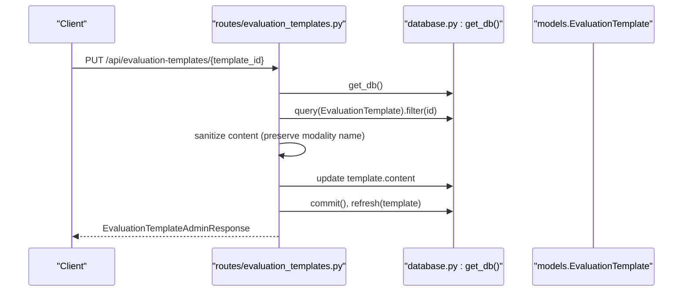

**Diagram sources**
- [routes/evaluation_templates.py:80-107](file://routes/evaluation_templates.py#L80-L107)
- [schemas.py:208-225](file://schemas.py#L208-L225)
- [database.py:28-34](file://database.py#L28-L34)

**Section sources**
- [routes/evaluation_templates.py:1-172](file://routes/evaluation_templates.py#L1-L172)
- [schemas.py:208-225](file://schemas.py#L208-L225)
- [models.py:115-128](file://models.py#L115-L128)

### ScoreCard System
- ORM mapping: ScoreCard with unique constraint on participant_id; relationship to Participant and EvaluationTemplate.
- Pydantic validation: ScoreCardResponseV2, ScoreCardFinalizeResponse, ScoreCardPartialUpdateRequest define allowed fields and computed responses.
- Structured evaluation workflow:
  - Supports draft and completed status tracking.
  - Calculates scores from evaluation template structure.
  - Determines category level based on evaluation results.
  - Integrates with judge assignment permissions.
- Operations:
  - Partial update of scorecard answers (judge).
  - Get scorecard for participant (judge).
  - Finalize scorecard (principal judge only).
  - Calculate results by modality with category grouping.
- Advanced features:
  - Item permission validation based on judge assignments.
  - Automatic category resolution by level.
  - Section-wise score calculation.
  - Level-based category progression.

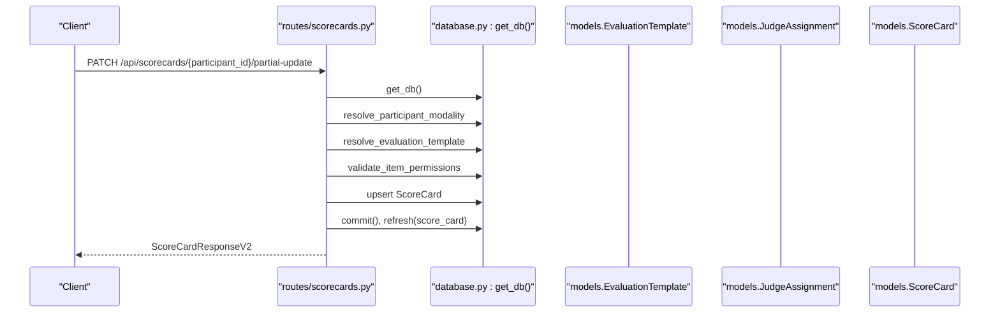

**Diagram sources**
- [routes/scorecards.py:227-277](file://routes/scorecards.py#L227-L277)
- [schemas.py:253-277](file://schemas.py#L253-L277)
- [database.py:28-34](file://database.py#L28-L34)

**Section sources**
- [routes/scorecards.py:1-725](file://routes/scorecards.py#L1-L725)
- [schemas.py:253-277](file://schemas.py#L253-L277)
- [models.py:147-162](file://models.py#L147-L162)

### JudgeAssignment System
- ORM mapping: JudgeAssignment with unique constraint on (user_id, modality_id); relationship to User and Modality.
- Pydantic validation: JudgeAssignmentCreate, JudgeAssignmentUpsertRequest, JudgeAssignmentResponse define allowed fields and computed responses.
- Judge permissions management:
  - Controls which sections judges can evaluate.
  - Manages principal judge designation.
  - Syncs judge modalities in user profile.
- Operations:
  - List all judge assignments (admin).
  - Get current judge's assignment (judge).
  - Upsert judge assignment (admin).
  - Delete judge assignment (admin).
- Validation:
  - Ensures only judges can be assigned.
  - Validates against evaluation template sections.
  - Maintains principal judge consistency.

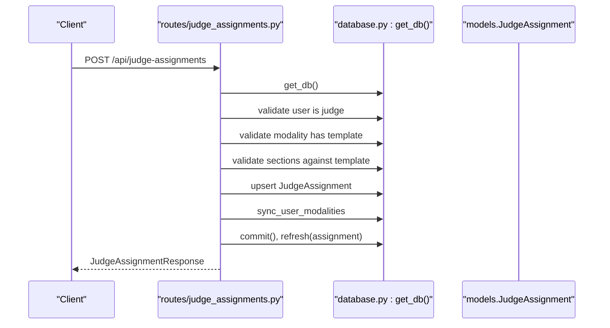

**Diagram sources**
- [routes/judge_assignments.py:100-206](file://routes/judge_assignments.py#L100-L206)
- [schemas.py:227-251](file://schemas.py#L227-L251)
- [database.py:28-34](file://database.py#L28-L34)

**Section sources**
- [routes/judge_assignments.py:1-308](file://routes/judge_assignments.py#L1-L308)
- [schemas.py:227-251](file://schemas.py#L227-L251)
- [models.py:131-144](file://models.py#L131-L144)

## Dependency Analysis
- Authentication and authorization:
  - OAuth2 bearer tokens are validated centrally; roles are enforced via dependency helpers.
  - Password hashing and JWT encoding/decoding are handled in security utilities.
- Data access:
  - All routes depend on a database session factory; queries leverage relationships and joinedloads for efficient retrieval.
- Migration and schema evolution:
  - SQLite migration helper adds columns and indexes to participants and backfills legacy fields to preserve historical data.
  - Modalities, Categories, EvaluationTemplates, ScoreCards, and JudgeAssignments tables are created automatically with the initial database setup.
  - Comprehensive migration system handles legacy schema evolution including ScoreCard schema updates.
  - Category level migration automatically assigns levels based on category names.
  - Subcategory relationships are established through foreign key constraints.
- File storage:
  - Regulations use separate file system storage with UUID-based filenames for security and uniqueness.
- Application routing:
  - Main application includes all new route modules and serves uploaded files as static content.

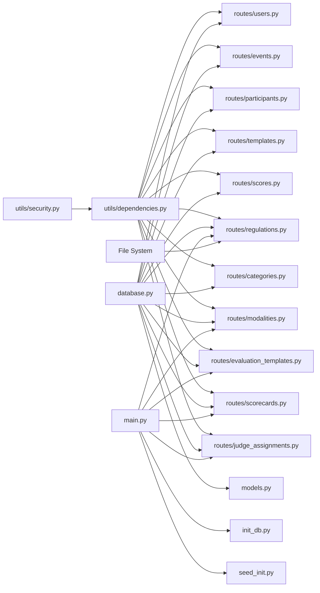

**Diagram sources**
- [utils/dependencies.py:16-71](file://utils/dependencies.py#L16-L71)
- [utils/security.py:17-39](file://utils/security.py#L17-L39)
- [database.py:28-34](file://database.py#L28-L34)
- [routes/*.py:1-180](file://routes/modalities.py#L1-L180)
- [main.py:12-53](file://main.py#L12-L53)
- [init_db.py:1-32](file://init_db.py#L1-L32)
- [seed_init.py:1-109](file://seed_init.py#L1-L109)

**Section sources**
- [utils/dependencies.py:16-71](file://utils/dependencies.py#L16-L71)
- [utils/security.py:17-39](file://utils/security.py#L17-L39)
- [database.py:36-193](file://database.py#L36-L193)
- [main.py:12-53](file://main.py#L12-L53)
- [init_db.py:1-32](file://init_db.py#L1-L32)
- [seed_init.py:1-109](file://seed_init.py#L1-L109)

## Performance Considerations
- Indexes and filtering:
  - Entities have targeted indexes on frequently queried fields (e.g., usernames, event name/date, participant fields, regulation modalidad, modality name).
  - Queries filter by evento_id, modalidad, categoria, and placa_rodaje to minimize scans.
  - Category queries use composite unique constraints for efficient duplicate detection.
  - EvaluationTemplate queries use unique modality_id index for fast lookups.
  - ScoreCard queries use unique participant_id constraint for efficient access.
  - Subcategory queries use composite unique constraints for efficient duplicate detection.
- Relationship loading:
  - Joined loads are used for Score responses to avoid N+1 selects for judge and participant details.
  - Modalities are loaded with nested categories and subcategories using joinedload for efficient hierarchical retrieval.
  - Evaluation templates are loaded with modality details for admin operations.
  - Score cards are loaded with participant and category details for result calculations.
  - Cascade delete operations ensure referential integrity without additional query overhead.
- Bulk operations:
  - Excel uploads use bulk_save_objects to reduce round-trips during ingestion.
  - Batch operations for judge assignments and category level updates.
- Query optimization strategies:
  - Prefer filtered queries with equality predicates on indexed columns.
  - Use pagination for large lists (not currently implemented; consider adding limit/offset).
  - Avoid SELECT *; select only required columns for read-heavy endpoints.
  - Leverage joinedload for complex hierarchical queries.
- Caching:
  - Consider caching template structures and recent scores for frequently accessed rubrics.
  - Cache frequently accessed modalities, categories for category management operations.
  - Cache evaluation templates for scorecard operations.
- File storage optimization:
  - PDF files are stored separately to avoid bloating the database with binary data.
  - File URLs are cached in the database for quick retrieval.
  - Static file serving is configured for efficient PDF delivery.
- Advanced performance features:
  - ScoreCard calculations use pre-built item lookup tables for O(1) item validation.
  - Category level resolution uses efficient level-to-name mapping.
  - Judge assignment validation uses set-based lookups for performance.
  - Legacy field backfilling occurs during migration to maintain data integrity.

## Troubleshooting Guide
- Authentication failures:
  - Ensure valid JWT bearer token is sent; verify secret key and expiration settings.
- Authorization errors:
  - Admin-only endpoints require role "admin"; judge-only endpoints require role "juez".
  - Judge assignment operations require proper permissions and template validation.
- Integrity errors:
  - Unique violations for usernames, (evento_id, placa_rodaje), (juez_id, participante_id), modality names, (modality_id, nombre), and (user_id, modality_id) are enforced; adjust inputs accordingly.
  - Subcategory unique constraint violations for (category_id, nombre) require checking parent category assignment.
- Data migration issues:
  - SQLite migration helper adds missing columns to participants and backfills legacy fields; verify presence of evento_id, nombres_apellidos, dni, telefono, correo, club_team, marca_modelo, placa_rodaje, category_id, and level after upgrade.
  - Modalities, Categories, EvaluationTemplates, ScoreCards, and JudgeAssignments tables are created automatically with the initial database setup.
  - ScoreCard schema migration handles legacy table backup and recreation.
  - Category level migration automatically assigns levels based on category names.
  - Subcategory relationships are established through proper foreign key constraints.
- Excel upload problems:
  - Verify required columns are present (case-insensitive aliases supported); ensure .xlsx extension and non-empty content; check for duplicate plates per event.
  - Legacy field normalization ensures backward compatibility with existing data.
- PDF upload issues:
  - Ensure file is a valid PDF with .pdf extension; check file size limits; verify write permissions to uploads directory.
  - File deletion problems: If file deletion fails, the database record is still removed but the file remains on disk; manual cleanup may be required.
- Static file serving issues:
  - Ensure uploads directory exists and is writable; verify static file mounting configuration.
- Category management issues:
  - Ensure modality exists before creating categories; verify unique constraint on (modality_id, nombre) is respected.
  - Ensure category exists before creating subcategories; verify unique constraint on (category_id, nombre) is respected.
  - Cascade deletion removes categories when modality is deleted; verify referential integrity.
  - Subcategory deletion cascades to participant records.
- Evaluation template issues:
  - Ensure modality has a template before assigning judges; verify template content structure is valid.
  - Template updates preserve modality name in content; verify content sanitization works correctly.
- ScoreCard issues:
  - Ensure participant has category assignment; verify evaluation template exists for modality.
  - Judge assignment validation ensures only authorized sections can be edited.
  - Finalization requires principal judge and complete item set.
  - Status tracking ensures proper workflow enforcement.
- Judge assignment issues:
  - Ensure user has role "juez" before assignment; verify modality has evaluation template.
  - Principal judge designation is mutually exclusive; verify assignment synchronization.
  - Section validation ensures only valid template sections are assigned.
  - Subcategory issues:
  - Ensure category exists before creating subcategories; verify unique constraint on (category_id, nombre) is respected.
  - Cascade deletion ensures proper cleanup of subcategory relationships.

**Section sources**
- [utils/dependencies.py:32-47](file://utils/dependencies.py#L32-L47)
- [routes/participants.py:316-430](file://routes/participants.py#L316-L430)
- [database.py:36-193](file://database.py#L36-L193)
- [routes/regulations.py:29-34](file://routes/regulations.py#L29-L34)
- [routes/modalities.py:43-54](file://routes/modalities.py#L43-L54)
- [routes/modalities.py:116-124](file://routes/modalities.py#L116-L124)
- [routes/modalities.py:182-188](file://routes/modalities.py#L182-L188)
- [routes/evaluation_templates.py:80-107](file://routes/evaluation_templates.py#L80-L107)
- [routes/scorecards.py:227-381](file://routes/scorecards.py#L227-L381)
- [routes/judge_assignments.py:100-206](file://routes/judge_assignments.py#L100-L206)
- [main.py:52-53](file://main.py#L52-L53)

## Conclusion
The Juzgamiento data model centers on ten core entities with a comprehensive three-tier hierarchical structure and advanced evaluation capabilities. SQLAlchemy ORM mappings and Pydantic schemas provide robust validation and serialization. The SQLite engine and migration helper support safe evolution of the schema with sophisticated legacy handling.

The addition of five new database models significantly enhances the application's capabilities:

- **Hierarchical Organization**: Modalities → Categories → Subcategories provide fine-grained competition structure with level-based organization
- **Advanced Evaluation**: EvaluationTemplate system with structured rubrics, ScoreCard workflow for systematic judging, and JudgeAssignment permissions
- **Enhanced Participant Management**: Improved legacy field support and category relationships for comprehensive participant tracking
- **Comprehensive Management**: Complete CRUD operations for all hierarchical entities with proper validation and cascade delete functionality
- **Document Management**: Regulation entity for official competition document storage and retrieval

The Regulations entity complements this by managing official competition documents through a comprehensive upload, storage, and retrieval system. By leveraging indexes, joined loads, bulk operations, and separate file storage, the system achieves predictable performance. The cascade delete functionality ensures referential integrity across the entire hierarchy, preventing orphaned records and maintaining data consistency.

The new evaluation system introduces sophisticated features including structured scoring rubrics, judge permission management, automated category progression, and comprehensive result calculations. The JudgeAssignment system provides granular control over judge capabilities and ensures proper authorization for evaluation activities.

The migration system provides comprehensive schema evolution capabilities, including legacy participant schema migration, ScoreCard schema evolution, and intelligent category level assignment. The Subcategory system completes the three-tier hierarchical structure for comprehensive competition organization.

Adhering to the documented constraints and access controls ensures data integrity and security while supporting the complex workflows required for professional competition management.

## Appendices

### Entity Relationship Diagram (ERD)
```mermaid
erDiagram
USERS {
int id PK
string username UK
string password_hash
string role
boolean can_edit_scores
json modalidades_asignadas
}
EVENTS {
int id PK
string nombre
date fecha
boolean is_active
}
PARTICIPANTS {
int id PK
int evento_id FK
int category_id FK
string nombres_apellidos
string dni
string telefono
string correo
string club_team
string marca_modelo
string modalidad
string categoria
string placa_rodaje
string nombre_competidor
string auto_marca_modelo
string placa_matricula
}
FORM_TEMPLATES {
int id PK
string modalidad
string categoria
json estructura_json
}
SCORES {
int id PK
int juez_id FK
int participante_id FK
int template_id FK
float puntaje_total
json datos_calificacion
}
REGULATIONS {
int id PK
string titulo
string modalidad
string archivo_url
}
MODALITIES {
int id PK
string nombre UK
}
CATEGORIES {
int id PK
string nombre
int level
int modality_id FK
}
EVALUATION_TEMPLATES {
int id PK
int modality_id UK FK
json content
}
SCORE_CARDS {
int id PK
int participant_id UK FK
int template_id FK
json answers
string status
int calculated_level
float total_score
}
JUDGE_ASSIGNMENTS {
int id PK
int user_id FK
int modality_id FK
json assigned_sections
boolean is_principal
}
SUBCATEGORIES {
int id PK
string nombre
int category_id FK
}
USERS ||--o{ SCORES : "judge"
USERS ||--o{ JUDGE_ASSIGNMENTS : "user"
EVENTS ||--o{ PARTICIPANTS : "event"
CATEGORIES ||--o{ PARTICIPANTS : "category"
CATEGORIES ||--o{ SUBCATEGORIES : "category"
MODALITIES ||--o{ CATEGORIES : "modality"
MODALITIES ||--o{ EVALUATION_TEMPLATES : "modality"
MODALITIES ||--o{ JUDGE_ASSIGNMENTS : "modality"
PARTICIPANTS ||--o{ SCORES : "participant"
PARTICIPANTS ||--o{ SCORE_CARDS : "participant"
FORM_TEMPLATES ||--o{ SCORES : "template"
EVALUATION_TEMPLATES ||--o{ SCORE_CARDS : "template"
PARTICIPANTS ||--o{ SCORES : "participant"
SCORE_CARDS ||--o| PARTICIPANTS : "participant"
EVALUATION_TEMPLATES ||--o{ SCORE_CARDS : "template"
JUDGE_ASSIGNMENTS ||--o| USERS : "user"
JUDGE_ASSIGNMENTS ||--o| MODALITIES : "modality"
SUBCATEGORIES ||--o{ PARTICIPANTS : "category"
```

**Diagram sources**
- [models.py:11-225](file://models.py#L11-L225)

### Sample Data Examples
- Users
  - Example: id=1, username="admin", role="admin", can_edit_scores=false, modalidades_asignadas=[].
  - Example: id=2, username="juez1", role="juez", can_edit_scores=true, modalidades_asignadas=["SQ"].
- Events
  - Example: id=1, nombre="Concurso Anual", fecha="2025-06-15", is_active=true.
- Participants
  - Example: id=1, evento_id=1, category_id=1, nombres_apellidos="Juan Pérez", modalidad="SQ", categoria="Master", placa_rodaje="ABC123".
- FormTemplates
  - Example: id=1, modalidad="SQ", categoria="Master", estructura_json=[...].
- Scores
  - Example: id=1, juez_id=2, participante_id=1, template_id=1, puntaje_total=95.5, datos_calificacion={...}.
- Regulations
  - Example: id=1, titulo="Reglamento General 2025", modalidad="SQ", archivo_url="/uploads/abc123.pdf".
- Modalities
  - Example: id=1, nombre="SQ".
- Categories
  - Example: id=1, nombre="Master", level=4, modality_id=1.
- EvaluationTemplates
  - Example: id=1, modality_id=1, content={"sections": [...], "bonifications": {...}}.
- ScoreCards
  - Example: id=1, participant_id=1, template_id=1, answers={}, status="draft", calculated_level=1, total_score=0.
- JudgeAssignments
  - Example: id=1, user_id=2, modality_id=1, assigned_sections=["section1", "section2"], is_principal=false.
- Subcategories
  - Example: id=1, nombre="Intro 1", category_id=1.

### Common Query Patterns
- List participants by event, modalidad, and categoria with ordering.
- Upsert template by modalidad and categoria.
- Compute total score from nested JSON and update existing score if present.
- Upload participants via Excel with normalization and deduplication.
- Upload PDF regulations with validation and file storage.
- List regulations with optional modalidad filtering.
- Delete regulations and clean up associated files.
- Serve PDF files through static file routing.
- List modalities with nested categories and subcategories using joinedload.
- Create new modality with unique name validation.
- Create new category within specific modality with duplicate prevention.
- Create new subcategory within specific category with duplicate prevention.
- Delete subcategory by ID with cascade effects.
- Delete category and all its subcategories with cascade deletion.
- Delete modality and all its categories with cascade deletion.
- List evaluation templates with modality details for admin operations.
- Get evaluation template by modality with content validation.
- Update evaluation template content with sanitization.
- Partial update scorecard with judge permission validation.
- Finalize scorecard with category resolution and judge principal validation.
- Calculate results by modality with category grouping and section totals.
- List judge assignments with user and modality details.
- Upsert judge assignment with section validation and principal management.
- Delete judge assignment with user modalities synchronization.
- Create subcategory with proper category relationship validation.

**Section sources**
- [routes/participants.py:289-314](file://routes/participants.py#L289-L314)
- [routes/templates.py:26-53](file://routes/templates.py#L26-L53)
- [routes/scores.py:16-26](file://routes/scores.py#L16-L26)
- [routes/participants.py:316-430](file://routes/participants.py#L316-L430)
- [routes/regulations.py:20-110](file://routes/regulations.py#L20-L110)
- [routes/modalities.py:19-33](file://routes/modalities.py#L19-L33)
- [routes/modalities.py:36-54](file://routes/modalities.py#L36-L54)
- [routes/modalities.py:57-94](file://routes/modalities.py#L57-L94)
- [routes/modalities.py:97-134](file://routes/modalities.py#L97-L134)
- [routes/modalities.py:137-153](file://routes/modalities.py#L137-L153)
- [routes/modalities.py:156-172](file://routes/modalities.py#L156-L172)
- [routes/modalities.py:175-191](file://routes/modalities.py#L175-L191)
- [routes/evaluation_templates.py:26-77](file://routes/evaluation_templates.py#L26-L77)
- [routes/evaluation_templates.py:80-107](file://routes/evaluation_templates.py#L80-L107)
- [routes/scorecards.py:227-381](file://routes/scorecards.py#L227-L381)
- [routes/judge_assignments.py:100-206](file://routes/judge_assignments.py#L100-L206)

### Data Lifecycle, Retention, and Migration Procedures
- Data lifecycle:
  - Users: created by admin; credentials managed per policy.
  - Events: created by admin; used as container for Participants.
  - Participants: ingested via admin actions or Excel upload; updated by admin.
  - Templates: created/updated by admin; immutable rubric definitions.
  - Scores: created/updated by judges; editable only if can_edit_scores is true.
  - Regulations: created by admin; PDF files stored separately; deletable.
  - Modalities: created by admin; serve as containers for Categories.
  - Categories: created by admin; organized within Modalities; cascade deletion with Modalities.
  - EvaluationTemplates: created/updated by admin; immutable master rubric definitions.
  - ScoreCards: created/updated by judges; managed through structured workflow.
  - JudgeAssignments: created/updated by admin; manage judge permissions.
  - Subcategories: created by admin; organized within Categories; cascade deletion with Categories.
- Retention:
  - No explicit retention policies are defined in the codebase; implement at application level if needed.
- Migration:
  - SQLite migration helper adds missing columns to participants, creates indexes, and backfills legacy fields to maintain compatibility.
  - Comprehensive migration system handles Modalities, Categories, EvaluationTemplates, ScoreCards, and JudgeAssignments tables.
  - ScoreCard schema migration handles legacy table backup and recreation with proper foreign key constraints.
  - Category level migration automatically assigns levels based on category names using intelligent pattern matching.
  - Category_id backfill automatically resolves participant categories based on modalidad and categoria fields.
  - Subcategory relationships are established through proper foreign key constraints.
- File management:
  - PDF files are stored in the uploads directory with UUID-based filenames.
  - File cleanup is attempted during regulation deletion but is not guaranteed.
  - Static file serving is configured for uploaded PDFs.
- Cascade deletion:
  - Modality deletion cascades to all associated Categories and EvaluationTemplates.
  - Category deletion cascades to all associated Subcategories and Participants.
  - ScoreCard deletion cascades to participant records.
  - JudgeAssignment deletion updates user modalities list.
  - Subcategory deletion cascades to participant records.
- Schema evolution:
  - Legacy participant schema migration preserves historical data integrity.
  - ScoreCard schema evolution maintains backward compatibility through backup and recreation.
  - Category level evolution provides intelligent level assignment based on naming conventions.
  - Subcategory relationships ensure proper hierarchical organization.

**Section sources**
- [database.py:36-193](file://database.py#L36-L193)
- [seed_init.py:89-132](file://seed_init.py#L89-L132)
- [routes/regulations.py:89-109](file://routes/regulations.py#L89-L109)
- [routes/modalities.py:137-153](file://routes/modalities.py#L137-L153)
- [routes/modalities.py:156-172](file://routes/modalities.py#L156-L172)
- [routes/modalities.py:175-191](file://routes/modalities.py#L175-L191)
- [routes/evaluation_templates.py:80-107](file://routes/evaluation_templates.py#L80-L107)
- [routes/scorecards.py:227-381](file://routes/scorecards.py#L227-L381)
- [routes/judge_assignments.py:100-206](file://routes/judge_assignments.py#L100-L206)
- [main.py:26-27](file://main.py#L26-L27)

### Security, Access Control, and Backup Strategies
- Security:
  - Passwords are hashed with bcrypt; JWT tokens are signed with HS256 and configurable expiration.
  - Role-based access control restricts administrative functions.
  - PDF upload validation prevents malicious file types.
  - Static file serving configuration ensures proper file access.
  - Category management requires admin privileges with proper validation.
  - Evaluation template management requires admin privileges with content validation.
  - ScoreCard operations require judge permissions and principal judge validation for finalization.
  - Judge assignment management requires admin privileges with proper validation.
  - Subcategory management requires proper category relationships.
- Access control:
  - Admin-only endpoints enforce role checks.
  - Judge-only endpoints enforce role checks.
  - Regulation management requires admin privileges.
  - Category management requires admin privileges with proper validation.
  - Evaluation template management requires admin privileges with content validation.
  - ScoreCard operations require judge permissions and section assignment validation.
  - Judge assignment management requires admin privileges with proper validation.
  - Subcategory management requires admin privileges with proper validation.
- File storage security:
  - PDF files are stored outside the database for better performance.
  - UUID-based filenames prevent directory traversal attacks.
  - File extensions are validated to ensure only PDFs are accepted.
- Backup strategies:
  - SQLite database file is stored locally; implement regular filesystem backups or export SQL dumps as part of operational procedures.
  - PDF files should be backed up separately as they contain important competition documents.
  - Consider implementing version control for regulations to track changes over time.
  - Static file serving configuration should be included in backup procedures.
  - Modalities, Categories, EvaluationTemplates, ScoreCards, JudgeAssignments, and Subcategories data should be included in database backups.
  - Cascade deletion ensures data consistency during backup and restore operations.
  - Legacy schema migrations should be documented for proper restoration procedures.
- Audit and compliance:
  - ScoreCard finalization logs category changes and score calculations.
  - Judge assignment changes are tracked for compliance monitoring.
  - Evaluation template updates maintain content history for audit trails.
  - User permission changes are logged for security compliance.
  - Subcategory relationships are tracked for hierarchical integrity.

**Section sources**
- [utils/security.py:17-39](file://utils/security.py#L17-L39)
- [utils/dependencies.py:32-47](file://utils/dependencies.py#L32-L47)
- [database.py:12](file://database.py#L12)
- [routes/regulations.py:29-34](file://routes/regulations.py#L29-L34)
- [routes/modalities.py:43-54](file://routes/modalities.py#L43-L54)
- [routes/modalities.py:116-124](file://routes/modalities.py#L116-L124)
- [routes/modalities.py:182-188](file://routes/modalities.py#L182-L188)
- [routes/evaluation_templates.py:80-107](file://routes/evaluation_templates.py#L80-L107)
- [routes/scorecards.py:227-381](file://routes/scorecards.py#L227-L381)
- [routes/judge_assignments.py:100-206](file://routes/judge_assignments.py#L100-L206)
- [main.py:52-53](file://main.py#L52-L53)