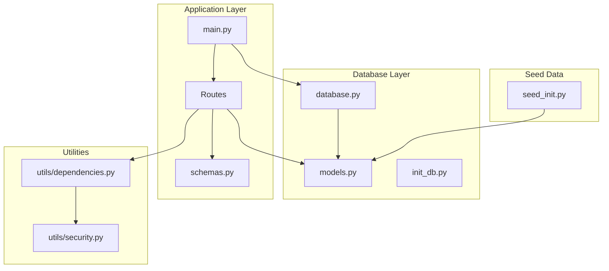
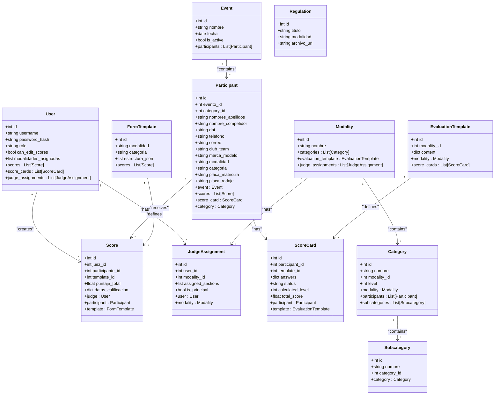
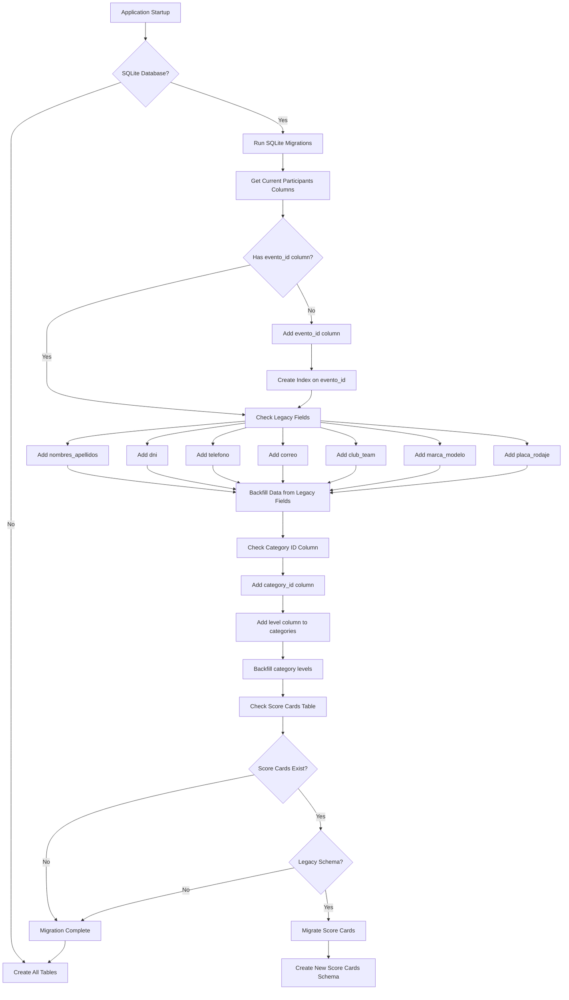
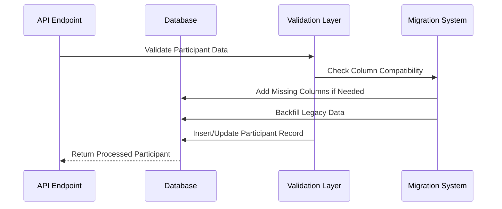
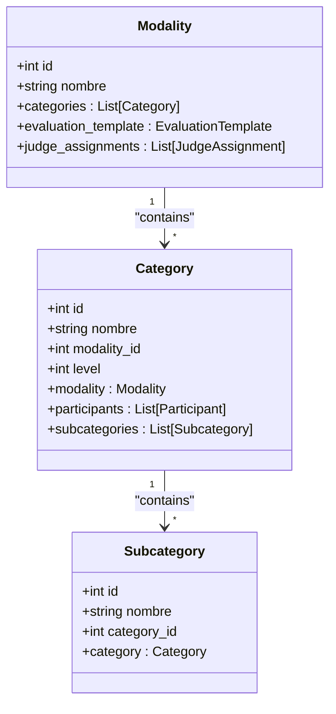
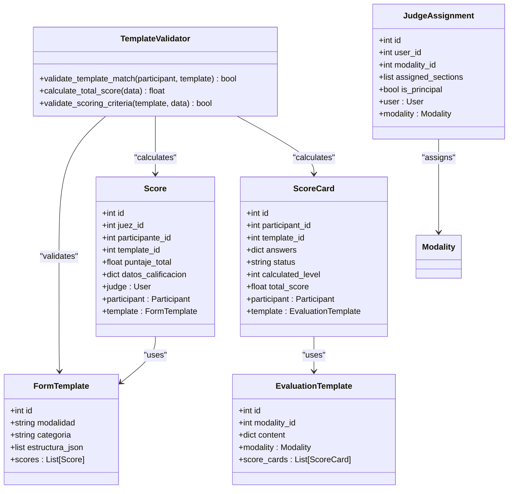
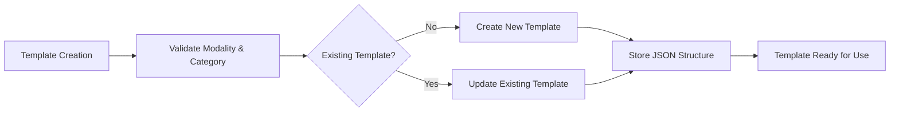
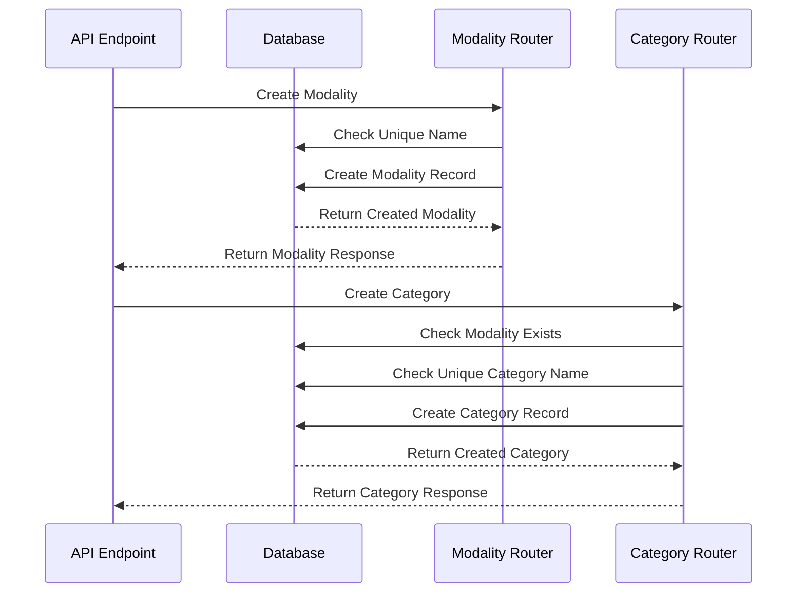
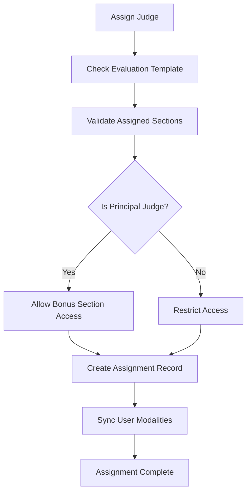
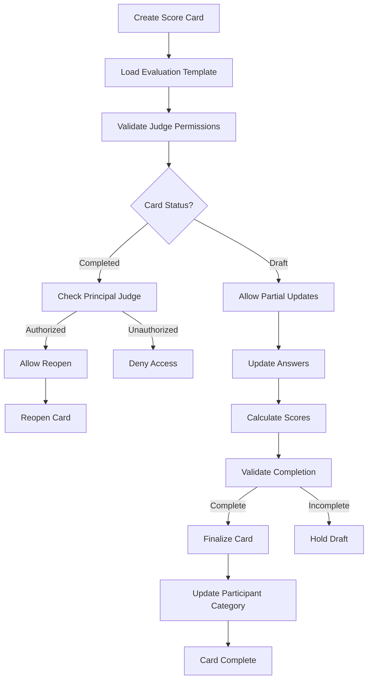

# Database Schema Updates

<cite>
**Referenced Files in This Document**
- [models.py](file://models.py)
- [database.py](file://database.py)
- [init_db.py](file://init_db.py)
- [main.py](file://main.py)
- [schemas.py](file://schemas.py)
- [routes/participants.py](file://routes/participants.py)
- [routes/scorecards.py](file://routes/scorecards.py)
- [routes/evaluation_templates.py](file://routes/evaluation_templates.py)
- [routes/judge_assignments.py](file://routes/judge_assignments.py)
- [routes/regulations.py](file://routes/regulations.py)
- [routes/categories.py](file://routes/categories.py)
- [routes/modalities.py](file://routes/modalities.py)
- [seed_init.py](file://seed_init.py)
- [utils/dependencies.py](file://utils/dependencies.py)
- [utils/security.py](file://utils/security.py)
- [requirements.txt](file://requirements.txt)
</cite>

## Update Summary
**Changes Made**
- Updated to reflect the current database schema with comprehensive hierarchical competition structure
- Enhanced participant model with improved field mappings and validation
- Implemented regulation management system with PDF upload capabilities
- Added template-based scoring system with JSON structure validation
- **Added new tables**: score_cards, judge_assignments, evaluation_templates with enhanced relationships
- **Improved data integrity constraints**: Added unique constraints and foreign key relationships
- **Enhanced scoring system**: Implemented comprehensive score card management with status tracking
- **Strengthened database migration system**: Advanced SQLite handling with schema evolution
- Enhanced role-based access control with granular permissions

## Table of Contents
1. [Introduction](#introduction)
2. [Project Structure](#project-structure)
3. [Core Components](#core-components)
4. [Architecture Overview](#architecture-overview)
5. [Detailed Component Analysis](#detailed-component-analysis)
6. [Dependency Analysis](#dependency-analysis)
7. [Performance Considerations](#performance-considerations)
8. [Troubleshooting Guide](#troubleshooting-guide)
9. [Conclusion](#conclusion)

## Introduction

This document provides comprehensive documentation about the database schema updates in the Juzgamiento Car Audio y Tuning system. The project is a FastAPI-based application that manages car audio and tuning competitions, featuring a robust database schema with SQLite as the primary database backend. The schema has undergone significant enhancements to support a hierarchical competition organization system with comprehensive regulations, modalities, categories, and participant management capabilities.

The system now manages participants, scoring systems, templates, administrative functions, regulatory frameworks, and **NEW**: comprehensive score card management with judge assignments and evaluation templates. The database schema includes sophisticated relationships between events, participants, judges, scoring criteria, evaluation templates, and the new hierarchical competition structure with modalities, categories, and subcategories.

## Project Structure

The database-related components are organized across several key files with enhanced routing for the new hierarchical structure:



**Diagram sources**
- [database.py:1-93](file://database.py#L1-L93)
- [models.py:1-183](file://models.py#L1-L183)
- [main.py:1-55](file://main.py#L1-L55)

**Section sources**
- [database.py:1-93](file://database.py#L1-L93)
- [models.py:1-183](file://models.py#L1-L183)
- [main.py:1-55](file://main.py#L1-L55)

## Core Components

### Database Engine and Connection Management

The application uses SQLAlchemy with SQLite as the primary database backend. The database configuration includes automatic migration capabilities for handling schema evolution and comprehensive foreign key constraint enforcement.

Key database features:
- SQLite database stored as `app.db` in the project root
- Automatic table creation during application startup
- Advanced SQLite-specific migration handling for backward compatibility
- Thread-safe connection management with proper session handling
- Comprehensive foreign key constraint enforcement

### Enhanced Entity Models

The database schema now consists of **TEN interconnected models** representing different aspects of the competition system with a hierarchical structure:



**Diagram sources**
- [models.py:11-225](file://models.py#L11-L225)

**Section sources**
- [models.py:11-225](file://models.py#L11-L225)
- [database.py:15-34](file://database.py#L15-L34)

## Architecture Overview

The database architecture follows a sophisticated hierarchical structure designed for comprehensive competition management:

```mermaid
graph TB
subgraph "Competition Hierarchy"
EVENT[Event]
MODALITY[Modality]
CATEGORY[Category]
SUBCATEGORY[Subcategory]
REGULATION[Regulation]
END
subgraph "Participant Management"
PARTICIPANT[Participant]
SCORE[Score]
SCORE_CARD[ScoreCard]
TEMPLATE[FormTemplate]
EVAL_TEMPLATE[EvaluationTemplate]
END
subgraph "User Management"
USER[User]
ADMIN[Admin]
JUEZ[Juez]
JUDGE_ASSIGNMENT[JudgeAssignment]
END
EVENT --> PARTICIPANT
MODALITY --> CATEGORY
CATEGORY --> SUBCATEGORY
PARTICIPANT --> SCORE
PARTICIPANT --> SCORE_CARD
TEMPLATE --> SCORE
EVAL_TEMPLATE --> SCORE_CARD
USER --> SCORE
USER --> JUDGE_ASSIGNMENT
MODALITY --> REGULATION
MODALITY --> EVAL_TEMPLATE
JUDGE_ASSIGNMENT --> USER
JUDGE_ASSIGNMENT --> MODALITY
```

**Diagram sources**
- [models.py:24-225](file://models.py#L24-L225)
- [routes/participants.py:181-200](file://routes/participants.py#L181-L200)
- [routes/scorecards.py:43-114](file://routes/scorecards.py#L43-L114)
- [routes/evaluation_templates.py:20-65](file://routes/evaluation_templates.py#L20-L65)
- [routes/judge_assignments.py:20-65](file://routes/judge_assignments.py#L20-L65)

## Detailed Component Analysis

### Advanced Database Migration System

The application includes a sophisticated SQLite migration system that handles complex schema evolution without manual intervention:



**Diagram sources**
- [database.py:36-193](file://database.py#L36-L193)

The migration system ensures backward compatibility by:
- Adding new columns conditionally with proper data type handling
- Creating indexes for performance optimization on foreign key columns
- Backfilling data from legacy fields to new standardized columns
- Maintaining referential integrity through foreign key constraints
- Supporting complex column transformations and data migrations
- **NEW**: Handling score cards table migration with schema evolution

**Section sources**
- [database.py:36-193](file://database.py#L36-L193)

### Enhanced Participant Management System

The participant management system has evolved to handle complex data structures with comprehensive validation and unique constraints:



**Diagram sources**
- [routes/participants.py:181-200](file://routes/participants.py#L181-L200)
- [database.py:61-93](file://database.py#L61-L93)

Key features of the enhanced participant system:
- Comprehensive validation for required fields with intelligent column mapping
- Automatic plate number uniqueness checking per event with conflict resolution
- Support for Excel bulk uploads with intelligent column mapping and validation
- Legacy field compatibility for backward data migration with data transformation
- Role-based access control for data modifications with granular permissions
- Advanced normalization and cleaning of participant data
- **NEW**: Category ID integration for hierarchical organization

**Section sources**
- [routes/participants.py:181-200](file://routes/participants.py#L181-L200)
- [routes/participants.py:316-429](file://routes/participants.py#L316-L429)

### Hierarchical Competition Organization System

The new three-tier competition organization system provides comprehensive structure for managing different competition categories:



**Diagram sources**
- [models.py:174-225](file://models.py#L174-L225)

The hierarchical system includes:
- **Modality Level**: Top-level competition categories (e.g., SQ, SPL, Tuning)
- **Category Level**: Intermediate divisions within modalities (e.g., Intro, Pro, Master) with level-based organization
- **Subcategory Level**: Fine-grained classifications within categories
- **Cascade Operations**: Automatic deletion propagation through the hierarchy
- **Unique Constraints**: Prevent duplicate entries at each level
- **NEW**: Evaluation template association for each modality

**Section sources**
- [routes/modalities.py:19-192](file://routes/modalities.py#L19-L192)
- [routes/categories.py:12-124](file://routes/categories.py#L12-L124)
- [models.py:174-225](file://models.py#L174-L225)

### Comprehensive Regulation Management System

The new regulation management system provides centralized control over competition rules and guidelines:


**Diagram sources**
- [routes/regulations.py:20-65](file://routes/regulations.py#L20-L65)

Key features of the regulation system:
- **PDF File Management**: Secure upload and storage of regulation documents
- **File Validation**: MIME type checking and file size restrictions
- **Unique Naming**: UUID-based filename generation to prevent conflicts
- **Database Integration**: URL-based file references with automatic cleanup
- **Access Control**: Admin-only creation and deletion permissions
- **Search Capabilities**: Filter regulations by modality with case-insensitive matching

**Section sources**
- [routes/regulations.py:20-110](file://routes/regulations.py#L20-L110)
- [models.py:165-172](file://models.py#L165-L172)

### Advanced Scoring System Architecture

The scoring system provides flexible evaluation mechanisms with template-based criteria and comprehensive validation:



**Diagram sources**
- [models.py:97-163](file://models.py#L97-L163)
- [routes/scorecards.py:43-114](file://routes/scorecards.py#L43-L114)

The scoring system includes:
- Template-based evaluation criteria with JSON structure validation
- Automatic score calculation from structured data with mathematical precision
- Judge permission controls for score modifications with role-based access
- Comprehensive validation of scoring data integrity with constraint enforcement
- Unique constraint prevention of duplicate scoring entries
- **NEW**: Score card management with status tracking and completion workflows
- **NEW**: Judge assignment system with section-level permissions

**Section sources**
- [routes/scorecards.py:43-114](file://routes/scorecards.py#L43-L114)
- [models.py:97-163](file://models.py#L97-L163)

### Template Management System

The template system allows for flexible scoring criteria definition with comprehensive validation:



**Diagram sources**
- [routes/evaluation_templates.py:26-53](file://routes/evaluation_templates.py#L26-L53)

Template management features:
- JSON-based template structure definition with comprehensive validation
- Automatic template validation against participant categories and modalities
- Support for multiple template types (Sound Quality, Tuning, Installation)
- Admin-only template modification permissions with access control
- Unique constraint enforcement preventing duplicate template combinations
- **NEW**: Evaluation template system with modality-specific configurations

**Section sources**
- [routes/evaluation_templates.py:26-53](file://routes/evaluation_templates.py#L26-L53)

### Enhanced Modality and Category Management

The modality and category management system provides comprehensive hierarchical organization for competition structure:



**Diagram sources**
- [routes/modalities.py:36-94](file://routes/modalities.py#L36-L94)
- [routes/categories.py:27-85](file://routes/categories.py#L27-L85)

Key features of the enhanced modality system:
- **Hierarchical Structure**: Three-tier organization (Modality → Category → Subcategory)
- **Cascade Operations**: Automatic deletion of child entities when parent is removed
- **Unique Constraints**: Prevent duplicate entries at each hierarchical level
- **Nested Queries**: Efficient retrieval with joined loading for performance
- **Admin-Only Access**: Restricted creation and deletion operations
- **Validation**: Comprehensive input validation and error handling
- **NEW**: Category level system with Intro, Aficionado, Pro, Master classification

**Section sources**
- [routes/modalities.py:19-192](file://routes/modalities.py#L19-L192)
- [routes/categories.py:12-124](file://routes/categories.py#L12-L124)
- [models.py:174-225](file://models.py#L174-L225)

### Judge Assignment Management System

The new judge assignment system provides comprehensive control over judge permissions and responsibilities:



**Diagram sources**
- [routes/judge_assignments.py:164-281](file://routes/judge_assignments.py#L164-L281)

Key features of the judge assignment system:
- **Section-Level Permissions**: Granular control over judge access to specific evaluation sections
- **Principal Judge Control**: Special permissions for lead judges to access bonus sections
- **Template Validation**: Ensures assigned sections match available template sections
- **Automatic Sync**: Updates user modalities list based on assignments
- **Unique Constraints**: Prevents duplicate judge-modalities combinations
- **Role-Based Access**: Restricts assignments to users with judge role

**Section sources**
- [routes/judge_assignments.py:164-281](file://routes/judge_assignments.py#L164-L281)
- [models.py:131-145](file://models.py#L131-L145)

### Score Card Management System

The new score card system provides comprehensive evaluation tracking and management:



**Diagram sources**
- [routes/scorecards.py:354-517](file://routes/scorecards.py#L354-L517)

Key features of the score card system:
- **Status Tracking**: Draft, In Progress, Completed states with appropriate permissions
- **Section-Level Editing**: Judges can only edit assigned sections
- **Automatic Calculations**: Total scores and category level calculations
- **Principal Judge Authority**: Only lead judges can finalize cards
- **Category Updates**: Automatic participant category advancement based on scores
- **Template Validation**: Ensures all required evaluation items are completed
- **Unique Constraints**: One score card per participant

**Section sources**
- [routes/scorecards.py:354-517](file://routes/scorecards.py#L354-L517)
- [models.py:147-163](file://models.py#L147-L163)

## Dependency Analysis

The database schema maintains strict referential integrity through comprehensive foreign key relationships with cascading operations:

```mermaid
erDiagram
USERS {
int id PK
string username UK
string password_hash
string role
boolean can_edit_scores
}
EVENTS {
int id PK
string nombre
date fecha
boolean is_active
}
PARTICIPANTS {
int id PK
int evento_id FK
int category_id FK
string nombres_apellidos
string dni
string telefono
string correo
string club_team
string marca_modelo
string modalidad
string categoria
string placa_matricula
string placa_rodaje
}
FORM_TEMPLATES {
int id PK
string modalidad
string categoria
}
EVALUATION_TEMPLATES {
int id PK
int modality_id FK UK
json content
}
SCORES {
int id PK
int juez_id FK
int participante_id FK
int template_id FK
float puntaje_total
json datos_calificacion
}
SCORE_CARDS {
int id PK
int participant_id FK UK
int template_id FK
json answers
string status
int calculated_level
float total_score
}
JUDGE_ASSIGNMENTS {
int id PK
int user_id FK
int modality_id FK
json assigned_sections
boolean is_principal
}
MODALITIES {
int id PK
string nombre UK
}
CATEGORIES {
int id PK
int modality_id FK
string nombre
int level
}
SUBCATEGORIES {
int id PK
int category_id FK
string nombre
}
REGULATIONS {
int id PK
string titulo
string modalidad
string archivo_url
}
USERS ||--o{ SCORES : "creates"
USERS ||--o{ JUDGE_ASSIGNMENTS : "has"
EVENTS ||--o{ PARTICIPANTS : "contains"
MODALITIES ||--o{ CATEGORIES : "contains"
MODALITIES ||--o{ JUDGE_ASSIGNMENTS : "has"
MODALITIES ||--o{ EVALUATION_TEMPLATES : "has"
CATEGORIES ||--o{ SUBCATEGORIES : "contains"
CATEGORIES ||--o{ PARTICIPANTS : "has"
PARTICIPANTS ||--o{ SCORES : "receives"
PARTICIPANTS ||--o{ SCORE_CARDS : "has"
FORM_TEMPLATES ||--o{ SCORES : "defines"
EVALUATION_TEMPLATES ||--o{ SCORE_CARDS : "defines"
JUDGE_ASSIGNMENTS ||--o{ USERS : "assigns"
JUDGE_ASSIGNMENTS ||--o{ MODALITIES : "assigns"
MODALITIES ||--o{ REGULATIONS : "has"
```

**Diagram sources**
- [models.py:11-225](file://models.py#L11-L225)

**Section sources**
- [models.py:11-225](file://models.py#L11-L225)

## Performance Considerations

The database schema includes several performance optimizations with enhanced indexing strategy:

### Advanced Indexing Strategy
- Primary keys automatically indexed by SQLAlchemy with proper naming conventions
- Foreign key columns indexed for join performance with composite indexes
- Unique constraints for data integrity with automatic index creation
- Text search indexes on frequently queried fields with case-insensitive matching
- Event-based indexing for participant queries with performance optimization
- **NEW**: Category level indexing for hierarchical organization queries

### Enhanced Data Type Optimization
- String fields sized appropriately for content length with validation
- JSON fields for flexible template storage with structural validation
- Float precision for scoring calculations with decimal handling
- Boolean flags for permission and status management with default values
- Date fields with proper timezone handling and validation
- **NEW**: JSON array fields for assigned sections in judge assignments

### Optimized Query Patterns
- Relationship-based lazy loading to minimize data transfer with selectinload
- Joined loading for frequently accessed related data with performance optimization
- Efficient filtering through indexed columns with query optimization
- Bulk operations for data import scenarios with transaction batching
- Cascade operations for hierarchical data with performance considerations
- **NEW**: Category level-based filtering for performance optimization

## Troubleshooting Guide

### Common Database Issues

**Migration Failures**
- Verify SQLite version compatibility with migration system requirements
- Check database file permissions with proper write access
- Ensure sufficient disk space for migration operations and file storage
- Validate foreign key constraint compatibility with existing data
- **NEW**: Handle score cards table migration conflicts during schema updates

**Connection Problems**
- Validate database URL configuration with absolute path resolution
- Check thread safety settings for SQLite with connection pooling
- Monitor connection pool limits with proper resource management
- Verify migration system compatibility with database state

**Data Integrity Errors**
- Review foreign key constraint violations with proper error messages
- Verify unique constraint compliance with constraint violation details
- Check for null value violations in NOT NULL columns with validation
- Validate hierarchical constraint violations in modality-category-subcategory relationships
- **NEW**: Handle evaluation template unique constraint violations

### Schema Evolution Best Practices

When implementing future schema updates:
- Always wrap migrations in transaction blocks with rollback support
- Test migration scripts on backup databases with data preservation
- Maintain backward compatibility for legacy data with transformation scripts
- Document all schema changes with version tracking and migration history
- Implement graceful fallback for failed migrations with error handling
- Validate hierarchical relationships during schema evolution
- **NEW**: Test score card migration procedures for data integrity

**Section sources**
- [database.py:36-193](file://database.py#L36-L193)
- [init_db.py:23-27](file://init_db.py#L23-L27)

## Conclusion

The Juzgamiento Car Audio y Tuning system demonstrates a well-architected database schema that balances flexibility with performance through comprehensive enhancements. The schema updates show careful consideration for:

- **Hierarchical Organization**: Three-tier competition structure (Modalities → Categories → Subcategories) provides comprehensive competition management
- **Regulatory Framework**: Centralized regulation management with PDF document storage and access control
- **Enhanced Participant Management**: Comprehensive validation, unique constraints, and backward compatibility
- **Advanced Migration System**: Sophisticated SQLite migration handling with data transformation capabilities
- **NEW**: Comprehensive Score Card Management System with status tracking and completion workflows
- **NEW**: Judge Assignment System with section-level permissions and principal judge controls
- **NEW**: Evaluation Template System with modality-specific configurations
- **Scalability**: Hierarchical organization supports growing competition complexity with cascade operations
- **Maintainability**: Clear relationships, constraints, and comprehensive validation simplify database management
- **Performance**: Strategic indexing, optimization, and efficient query patterns for real-time scoring

The implementation of automatic migrations, comprehensive validation, flexible template systems, hierarchical competition organization, **NEW**: score card management, **NEW**: judge assignment controls, and **NEW**: evaluation templates positions the application for continued growth while maintaining data integrity and system reliability. The modular design allows for easy extension of new features while preserving existing functionality.

Future enhancements could include:
- Advanced analytics and reporting capabilities with hierarchical aggregation
- Enhanced audit trail functionality with comprehensive logging
- Multi-database backend support with migration compatibility
- Automated backup and recovery procedures with transaction safety
- Enhanced search capabilities with full-text indexing and advanced filtering
- Real-time synchronization capabilities for distributed deployment scenarios
- **NEW**: Integration with external judging systems for remote evaluation
- **NEW**: Mobile app support for real-time score entry and validation
- **NEW**: Integration with competition management software for automated participant registration