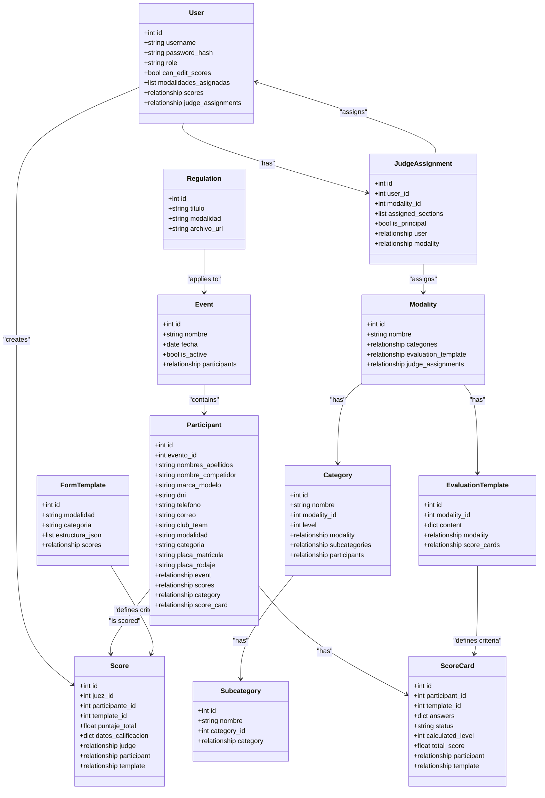
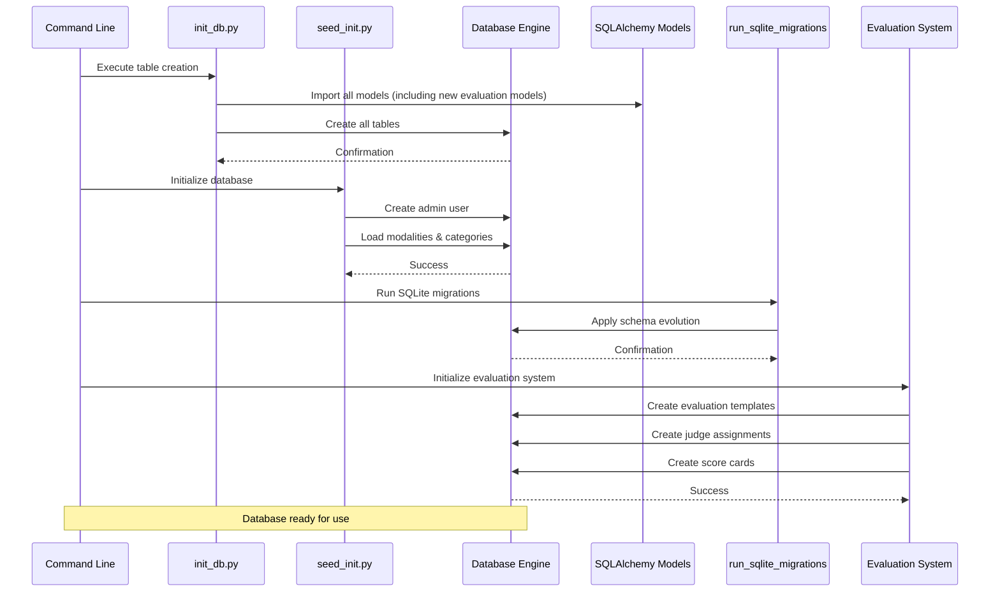
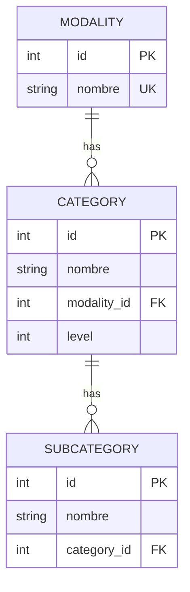

# Database Initialization Scripts

<cite>
**Referenced Files in This Document**
- [init_db.py](file://init_db.py)
- [seed_init.py](file://seed_init.py)
- [database.py](file://database.py)
- [models.py](file://models.py)
- [main.py](file://main.py)
- [routes/evaluation_templates.py](file://routes/evaluation_templates.py)
- [routes/judge_assignments.py](file://routes/judge_assignments.py)
- [routes/scorecards.py](file://routes/scorecards.py)
- [routes/regulations.py](file://routes/regulations.py)
- [schemas.py](file://schemas.py)
- [utils/security.py](file://utils/security.py)
- [utils/dependencies.py](file://utils/dependencies.py)
- [requirements.txt](file://requirements.txt)
- [start.sh](file://start.sh)
</cite>

## Update Summary
**Changes Made**
- Enhanced database initialization scripts with improved database setup, schema management, and initialization workflows
- Added comprehensive database seeding with admin user creation and official modalities/categories loading
- Implemented advanced SQLite migration system for backward compatibility and schema evolution
- Integrated new evaluation system infrastructure with master templates, judge assignments, and scorecards
- Enhanced application startup with automatic database initialization and migration execution
- Added comprehensive error handling and transaction management across initialization scripts
- **Added new Regulation model for official competition rule management**
- **Added new Evaluation Template system with master templates for each modality**
- **Added Judge Assignment system for managing judge permissions and sections**
- **Added Score Card system for structured evaluation and scoring**
- **Integrated new API routes for evaluation templates, judge assignments, and scorecards management**

## Table of Contents
1. [Introduction](#introduction)
2. [Project Structure](#project-structure)
3. [Core Components](#core-components)
4. [Architecture Overview](#architecture-overview)
5. [Detailed Component Analysis](#detailed-component-analysis)
6. [Dependency Analysis](#dependency-analysis)
7. [Performance Considerations](#performance-considerations)
8. [Troubleshooting Guide](#troubleshooting-guide)
9. [Conclusion](#conclusion)

## Introduction

This document provides comprehensive documentation for the database initialization scripts in the Car Audio and Tuning Judging System. The project utilizes SQLAlchemy ORM with SQLite as the primary database backend, implementing a structured approach to database creation, seeding, and migration management. The system supports multiple judging modalities including Sound Quality (SQ), Tuning, Street Show, and various specialized categories.

The database initialization process involves four main components: table creation, initial data seeding, SQLite migration management, and the new evaluation system infrastructure. These scripts work together to provide a complete foundation for the judging application, enabling administrators to manage participants, judges, scoring criteria, competition events, official regulations, evaluation templates, judge assignments, and scorecards.

**Updated** Enhanced with new Regulation model, improved error handling, comprehensive template management, SQLite migration support for backward compatibility, and integrated evaluation system with master templates, judge assignments, and scorecards.

## Project Structure

The database initialization system follows a modular architecture with distinct scripts serving specific purposes:

```mermaid
graph TB
subgraph "Database Initialization System"
A[init_db.py] --> B[Table Creation]
C[seed_init.py] --> D[Initial Data Seed]
B --> E[database.py]
D --> E
E --> F[models.py]
E --> G[SQLite Engine]
E --> H[run_sqlite_migrations]
end
subgraph "Application Integration"
I[main.py] --> E
J[FastAPI Routes] --> E
K[Regulation Model] --> L[Regulation Management]
M[Security Utils] --> N[Password Hashing]
O[Requirements] --> P[Bcrypt Library]
Q[Dependencies] --> R[JWT Authentication]
S[Schema Validation] --> T[Data Integrity]
U[Regulation Routes] --> V[PDF Management]
W[Migration System] --> X[Schema Evolution]
Y[Admin Authentication] --> Z[Access Control]
AA[Evaluation Templates] --> BB[Master Template System]
CC[Judge Assignments] --> DD[Section Permissions]
EE[Score Cards] --> FF[Structured Evaluation]
GG[API Integration] --> HH[RESTful Endpoints]
II[Startup Script] --> JJ[Development Environment]
```

**Diagram sources**
- [init_db.py:7-20](file://init_db.py#L7-L20)
- [seed_init.py:8-10](file://seed_init.py#L8-L10)
- [database.py:1-193](file://database.py#L1-L193)
- [models.py:11-225](file://models.py#L11-L225)
- [routes/regulations.py:15-110](file://routes/regulations.py#L15-L110)
- [routes/evaluation_templates.py:14-172](file://routes/evaluation_templates.py#L14-L172)
- [routes/judge_assignments.py:12-308](file://routes/judge_assignments.py#L12-L308)
- [routes/scorecards.py:20-725](file://routes/scorecards.py#L20-L725)
- [main.py:23-24](file://main.py#L23-L24)
- [start.sh:1-16](file://start.sh#L1-L16)

**Section sources**
- [init_db.py:1-32](file://init_db.py#L1-L32)
- [seed_init.py:1-109](file://seed_init.py#L1-L109)
- [database.py:1-193](file://database.py#L1-L193)

## Core Components

### Database Engine Configuration

The database system uses SQLAlchemy with SQLite as the primary backend. The configuration establishes a robust connection pool and handles automatic migrations for backward compatibility.

Key features include:
- Absolute path resolution for database file location using pathlib for reliability
- Thread-safe connection handling with check_same_thread disabled for multi-threaded access
- Automatic table creation during application startup through metadata reflection
- SQLite-specific migration support for legacy data compatibility
- Dynamic participant table evolution with backward compatibility through conditional column additions

### Model Definitions

The system defines twelve core models representing the judging domain, including the new evaluation system models:



**Diagram sources**
- [models.py:11-225](file://models.py#L11-L225)

**Section sources**
- [models.py:11-225](file://models.py#L11-L225)
- [database.py:15-34](file://database.py#L15-L34)

## Architecture Overview

The database initialization architecture follows a layered approach with clear separation of concerns:



**Diagram sources**
- [init_db.py:23-32](file://init_db.py#L23-L32)
- [seed_init.py:13-104](file://seed_init.py#L13-L104)
- [database.py:36-193](file://database.py#L36-L193)
- [routes/evaluation_templates.py:56-100](file://routes/evaluation_templates.py#L56-L100)
- [routes/judge_assignments.py:164-280](file://routes/judge_assignments.py#L164-L280)
- [routes/scorecards.py:445-503](file://routes/scorecards.py#L445-L503)

The architecture ensures that:
- Database tables are created before any data operations
- Initial administrative credentials are established with secure password hashing
- Official judging criteria templates are loaded with duplicate prevention
- Additional template variations are supported with comprehensive error handling
- Legacy data compatibility is maintained through migration scripts
- Regulation management is integrated into the system with file-based storage
- Evaluation templates system is initialized with master templates for each modality
- Judge assignment system manages permissions and section access
- Score card system provides structured evaluation framework
- Application startup automatically handles database initialization and migrations

## Detailed Component Analysis

### Table Creation Script (init_db.py)

The initialization script serves as the foundation for database setup, automatically creating all required tables based on the model definitions.

**Key Features:**
- Imports all model classes including the new EvaluationTemplate, JudgeAssignment, and ScoreCard models to register them with SQLAlchemy
- Creates tables using metadata reflection with Base class inheritance
- Provides clear console feedback for operation status
- Designed for standalone execution with proper error handling

**Execution Flow:**
```mermaid
flowchart TD
A[Script Entry Point] --> B[Import Database Engine]
B --> C[Import All Models (including new evaluation models)]
C --> D[Create All Tables]
D --> E[Print Success Message]
E --> F[Exit]
G[Error Handling] --> H[Rollback Changes]
H --> I[Print Error Message]
I --> J[Raise Exception]
```

**Diagram sources**
- [init_db.py:23-32](file://init_db.py#L23-L32)

**Section sources**
- [init_db.py:1-32](file://init_db.py#L1-L32)

### Initial Data Seeding (seed_init.py)

This script creates the super administrator account and loads official modalities and categories for the judging system.

**Administrative Setup:**
- Creates a default admin user with predefined credentials using secure bcrypt hashing
- Implements duplicate prevention for admin accounts with username uniqueness check
- Uses secure password hashing for credential storage with bcrypt library

**Modalities and Categories Loading:**
- Supports six major judging modalities: SPL, SQ, SQL, Street Show, Tuning, and Tuning VW
- Automatically creates hierarchical category structures with proper foreign key relationships
- Prevents duplicate entries through existence checks with composite constraints
- Provides detailed logging of creation progress with success indicators

**Enhanced Error Handling:**
- Comprehensive exception handling with rollback capabilities for transaction safety
- Graceful handling of existing data conflicts with informative messages
- Proper session management with automatic cleanup using context managers

**Data Structure:**


**Diagram sources**
- [seed_init.py:41-87](file://seed_init.py#L41-L87)
- [models.py:174-225](file://models.py#L174-L225)

**Section sources**
- [seed_init.py:1-109](file://seed_init.py#L1-L109)

### SQLite Migration System

The system includes a comprehensive SQLite migration system that handles backward compatibility and schema evolution:

**Migration Capabilities:**
- Automatic addition of new participant fields with conditional column checks
- Backward compatibility maintenance through legacy field preservation
- Data preservation during schema updates with intelligent backfill operations
- Dynamic participant table evolution with proper constraint handling

**Advanced Migration Features:**
- Event ID column addition with foreign key reference to events table
- Comprehensive participant field evolution including names, contact info, and vehicle details
- Category level management with intelligent level assignment based on category names
- Category ID migration from string-based to foreign key relationships
- Score cards table modernization with schema reconstruction and data migration

**Legacy Support:**
- Automatic backup of legacy score cards table before migration
- Schema detection and conditional migration execution
- Graceful handling of existing data during transformation processes

**Section sources**
- [database.py:36-193](file://database.py#L36-L193)

### Regulation Management System

The system now includes comprehensive regulation management capabilities:

**Regulation Model:**
- Stores official competition regulations with title, modality, and file URL references
- Links regulations to specific modalities for targeted rule management
- Provides URL references to regulation documents stored in uploads directory
- Supports organized rule management with proper database constraints

**Integration Benefits:**
- Centralized regulation storage with file-based document management
- Modality-specific rule organization for targeted access
- Document-based rule management with upload and deletion capabilities
- Scalable rule expansion through API endpoints

**Section sources**
- [models.py:165-172](file://models.py#L165-L172)

### Evaluation Template System

The system now includes a comprehensive evaluation template management system:

**EvaluationTemplate Model:**
- Stores master evaluation templates for each modality with structured JSON content
- Links templates to specific modalities through foreign key relationships
- Provides flexible template structure with sections and items
- Supports dynamic template content with validation and sanitization

**Template Management Features:**
- Master template creation with duplicate prevention per modality
- Template content sanitization and normalization
- Automatic modality name injection into template content
- Comprehensive template validation and error handling

**API Integration:**
- RESTful endpoints for template CRUD operations
- Admin-only access control for template management
- Template retrieval by modality with joined loading
- Response formatting with modality name resolution

**Section sources**
- [models.py:115-129](file://models.py#L115-L129)
- [routes/evaluation_templates.py:17-172](file://routes/evaluation_templates.py#L17-L172)
- [schemas.py:170-192](file://schemas.py#L170-L192)

### Judge Assignment System

The system includes a sophisticated judge assignment management system:

**JudgeAssignment Model:**
- Manages judge permissions and section assignments for each modality
- Supports principal judge designation with special privileges
- Maintains assigned sections with validation against evaluation templates
- Provides user-modalities synchronization for role-based access

**Assignment Management Features:**
- Judge assignment creation with validation against evaluation templates
- Section permission validation and normalization
- Principal judge management with automatic privilege handling
- User modalities synchronization for role-based access control

**API Integration:**
- RESTful endpoints for assignment CRUD operations
- Admin-only access control for assignment management
- Assignment retrieval with template validation and normalization
- Response formatting with user and modality information

**Section sources**
- [models.py:131-144](file://models.py#L131-L144)
- [routes/judge_assignments.py:15-308](file://routes/judge_assignments.py#L15-L308)
- [schemas.py:194-217](file://schemas.py#L194-L217)

### Score Card System

The system includes a comprehensive score card management system:

**ScoreCard Model:**
- Manages structured evaluation forms for each participant
- Supports draft and completed status with validation
- Maintains calculated level and total scores with automatic computation
- Links to both participants and evaluation templates

**Score Card Features:**
- Automatic score card creation for participants
- Draft mode editing with permission validation
- Finalization process with principal judge authorization
- Automatic category assignment based on evaluation results
- Comprehensive score calculation and level determination

**Validation and Calculation:**
- Item permission validation based on judge assignments
- Score validation against item definitions and bounds
- Automatic level calculation from evaluation answers
- Category resolution from answers or calculated level

**API Integration:**
- RESTful endpoints for score card CRUD operations
- Judge-only access control with assignment validation
- Comprehensive score card management with status tracking
- Results aggregation and reporting capabilities

**Section sources**
- [models.py:147-162](file://models.py#L147-L162)
- [routes/scorecards.py:23-725](file://routes/scorecards.py#L23-L725)
- [schemas.py:220-265](file://schemas.py#L220-L265)

### Database Engine and Migration System

The database engine configuration provides robust connectivity and automatic migration support:

**Connection Management:**
- SQLite database file located at project root using absolute path resolution
- Thread-safe connection handling for concurrent operations with proper session management
- Automatic table creation during application startup through metadata.create_all()

**Enhanced Migration Capabilities:**
- Automatic addition of new participant fields with conditional column checks
- Backward compatibility maintenance through legacy field preservation
- Data preservation during schema updates with intelligent backfill operations
- Dynamic participant table evolution with proper constraint handling

**Section sources**
- [database.py:1-193](file://database.py#L1-L193)
- [main.py:23-24](file://main.py#L23-L24)

### Security and Authentication System

The system implements comprehensive security measures for user authentication and authorization:

**Password Security:**
- Uses bcrypt library for secure password hashing with salt-based encryption
- Implements password verification functionality with proper error handling
- Provides secure credential storage with bcrypt library integration

**JWT Token Management:**
- Implements JSON Web Token authentication with configurable expiration settings
- Secret key management for production environments with environment variable support
- Token encoding and decoding utilities with proper error handling

**Section sources**
- [utils/security.py:17-38](file://utils/security.py#L17-L38)
- [requirements.txt:8](file://requirements.txt#L8)

### Regulation Management API

The system provides RESTful API endpoints for regulation management:

**API Endpoints:**
- POST `/api/regulations` - Upload new regulation PDF files with admin-only access
- GET `/api/regulations` - List all regulations with optional filtering by modality
- DELETE `/api/regulations/{id}` - Delete regulations and associated files with admin-only access

**Features:**
- File validation for PDF format compliance with proper error handling
- Unique filename generation for uploaded files using UUID for collision avoidance
- Database record creation with file path storage and proper URL formatting
- File cleanup on deletion operations with graceful error handling
- Admin-only access control for sensitive operations with proper authentication

**Section sources**
- [routes/regulations.py:20-110](file://routes/regulations.py#L20-L110)

### Evaluation Template Management API

The system provides RESTful API endpoints for evaluation template management:

**API Endpoints:**
- GET `/api/evaluation-templates` - List all evaluation templates with modality information
- POST `/api/evaluation-templates` - Create new evaluation templates with admin-only access
- GET `/api/evaluation-templates/{template_id}` - Retrieve specific evaluation template
- GET `/api/evaluation-templates/by-modality/{modality_id}` - Retrieve template by modality
- PUT `/api/evaluation-templates/{template_id}` - Update evaluation templates with admin-only access

**Features:**
- Template content sanitization and normalization with modality validation
- Duplicate prevention for templates per modality with proper error handling
- Template retrieval with joined loading for modality information
- Response formatting with modality name resolution for display purposes

**Section sources**
- [routes/evaluation_templates.py:42-172](file://routes/evaluation_templates.py#L42-L172)

### Judge Assignment Management API

The system provides RESTful API endpoints for judge assignment management:

**API Endpoints:**
- GET `/api/judge-assignments` - List all judge assignments with user and modality information
- GET `/api/judge-assignments/me` - Retrieve current judge's assignment for a modality
- POST `/api/judge-assignments` - Create or update judge assignments with admin-only access
- DELETE `/api/judge-assignments/{assignment_id}` - Delete judge assignments with admin-only access

**Features:**
- Assignment validation against evaluation templates and section permissions
- Principal judge management with automatic privilege handling
- User modalities synchronization for role-based access control
- Response formatting with normalized assigned sections and modality information

**Section sources**
- [routes/judge_assignments.py:106-308](file://routes/judge_assignments.py#L106-L308)

### Score Card Management API

The system provides RESTful API endpoints for score card management:

**API Endpoints:**
- GET `/api/scorecards` - List score cards with filtering by event, modality, category, and status
- PATCH `/api/scorecards/{participant_id}/partial-update` - Partially update score card answers
- GET `/api/scorecards/{participant_id}` - Retrieve score card for participant
- POST `/api/scorecards/{participant_id}/finalize` - Finalize score card with principal judge authorization
- GET `/api/results/{modality_id}` - Retrieve results for a modality with category grouping

**Features:**
- Comprehensive score card validation and permission checking
- Automatic score calculation and level determination
- Category assignment based on evaluation results
- Results aggregation with section totals and participant breakdowns
- Draft mode editing with principal judge authorization for re-editing

**Section sources**
- [routes/scorecards.py:422-725](file://routes/scorecards.py#L422-L725)

### Development Environment Startup

The system includes a convenient startup script for development environments:

**Startup Process:**
- Kills existing processes on ports 8000 and 5173 to prevent conflicts
- Activates virtual environment and starts FastAPI backend on port 8000
- Starts frontend development server on port 5173
- Provides clear logging of startup progress and port assignments

**Development Benefits:**
- Automated environment setup eliminates manual configuration steps
- Concurrent backend and frontend development with proper port management
- Clean process cleanup prevents port conflicts during development
- Virtual environment activation ensures proper dependency isolation

**Section sources**
- [start.sh:1-16](file://start.sh#L1-L16)

## Dependency Analysis

The database initialization system exhibits clear dependency relationships:

```mermaid
graph TD
A[init_db.py] --> B[database.py]
A --> C[models.py]
D[seed_init.py] --> B
D --> C
D --> E[utils/security.py]
F[main.py] --> B
F --> C
B --> G[SQLAlchemy ORM]
B --> H[SQLite Engine]
E --> I[bcrypt Library]
J[Regulation Model] --> K[Regulation Management]
L[Migration System] --> M[Schema Evolution]
N[Security Utilities] --> O[Authentication]
P[FastAPI Routes] --> Q[API Endpoints]
R[Pydantic Schemas] --> S[Data Validation]
T[Dependencies] --> U[JWT Authentication]
V[Main Application] --> W[Automatic Initialization]
X[run_sqlite_migrations] --> Y[Backward Compatibility]
Z[Regulation Routes] --> AA[PDF Management]
BB[Admin Authentication] --> CC[Access Control]
DD[Evaluation Templates] --> EE[Master Template System]
FF[Judge Assignments] --> GG[Section Permissions]
HH[Score Cards] --> II[Structured Evaluation]
JJ[API Integration] --> KK[RESTful Endpoints]
LL[Startup Script] --> MM[Development Environment]
NN[Security Utils] --> OO[Password Hashing]
PP[Dependencies] --> QQ[JWT Authentication]
RR[Main App] --> SS[Auto Initialization]
TT[Database Engine] --> UU[Connection Management]
VV[Migration System] --> WW[Schema Evolution]
XX[Model Definitions] --> YY[ORM Mapping]
ZZ[Route Definitions] --> AA[API Endpoints]
```



**Diagram sources**
- [init_db.py:7-20](file://init_db.py#L7-L20)
- [seed_init.py:8-10](file://seed_init.py#L8-L10)
- [database.py:4-25](file://database.py#L4-L25)
- [utils/security.py:5](file://utils/security.py#L5)
- [start.sh:9-15](file://start.sh#L9-L15)

**Section sources**
- [requirements.txt:1-10](file://requirements.txt#L1-L10)
- [main.py:1-53](file://main.py#L1-L53)

## Performance Considerations

The database initialization system incorporates several performance optimization strategies:

**Connection Pooling:**
- Efficient connection reuse reduces overhead through session factory pattern
- Thread-safe operations prevent race conditions with proper session management
- Automatic cleanup prevents resource leaks with context manager usage

**Data Loading Optimization:**
- Batch operations minimize database round trips through transaction batching
- Existence checks prevent unnecessary writes with proper duplicate prevention
- Transaction boundaries ensure data consistency with rollback capabilities

**Memory Management:**
- Proper session closure prevents memory leaks with context manager usage
- Context managers ensure resource cleanup with automatic session termination
- Large data structures are processed incrementally with proper error handling

**Template Management Efficiency:**
- Duplicate prevention reduces redundant operations through existence checking
- Structured JSON processing optimizes template loading with proper validation
- Modular template functions enable selective loading with transaction safety

**Migration Performance:**
- Conditional column addition prevents unnecessary operations with schema inspection
- Backfill operations preserve existing data integrity with intelligent data migration
- Index creation optimizes query performance with proper constraint handling

**Application Startup Optimization:**
- Automatic database initialization eliminates manual setup steps
- Migration system ensures backward compatibility without downtime
- Modular architecture enables selective component loading

**Evaluation System Performance:**
- Template caching reduces repeated database queries for evaluation templates
- Assignment validation prevents unauthorized access attempts
- Score calculation optimization with batch processing
- Results aggregation with efficient grouping algorithms

**Development Environment Performance:**
- Concurrent backend and frontend startup reduces development iteration time
- Process cleanup prevents resource leaks during development
- Virtual environment isolation ensures optimal dependency management

## Troubleshooting Guide

### Common Issues and Solutions

**Database File Location Problems:**
- Ensure the SQLite database file is created in the project root directory using absolute path resolution
- Verify write permissions for the database file and uploads directory
- Check for database corruption using SQLite command-line tools or database management applications

**Migration Issues:**
- Run the migration script after updating the database schema or adding new columns
- Verify that all required columns exist before data operations through schema inspection
- Check for constraint violations during data insertion with proper error handling

**Template Loading Failures:**
- Verify that template JSON structures match the expected format with proper validation
- Check for duplicate template entries preventing insertion with existence checking
- Ensure proper JSON syntax in template definitions with comprehensive error handling

**Regulation Management Issues:**
- Verify regulation URLs are accessible and valid with proper file path resolution
- Check modality-specific regulation assignments with proper filtering
- Ensure regulation documents are properly formatted PDF files with size limits

**Evaluation Template Issues:**
- Verify template content structure matches expected format with proper validation
- Check for duplicate templates per modality with proper constraint handling
- Ensure template modality IDs correspond to existing modalities with proper error handling

**Judge Assignment Issues:**
- Verify judge assignments align with evaluation template sections with proper validation
- Check for principal judge conflicts with automatic privilege handling
- Ensure user roles are properly set to "juez" for assignments with proper error handling

**Score Card Issues:**
- Verify score card answers match template item IDs with proper validation
- Check for unauthorized score card modifications with permission validation
- Ensure score card finalization requires principal judge authorization with proper error handling

**Security Considerations:**
- Change default admin credentials immediately after deployment with secure password hashing
- Verify password hashing implementation with bcrypt library integration
- Check JWT secret key configuration for production environments with proper environment variable setup

**Development Environment Issues:**
- Ensure virtual environment is activated before running scripts with proper package installation
- Verify all required Python packages are installed including bcrypt and cryptography libraries
- Check port availability for development server startup with proper network configuration

**Application Startup Issues:**
- Verify database initialization completes successfully during application startup
- Check migration system execution with proper error handling and logging
- Ensure all required dependencies are available with proper import statements

**Startup Script Issues:**
- Verify port availability before running startup script to prevent conflicts
- Check virtual environment activation with proper path resolution
- Ensure frontend development server runs on correct port with proper configuration

**Section sources**
- [database.py:36-193](file://database.py#L36-L193)
- [utils/security.py:9-14](file://utils/security.py#L9-L14)
- [start.sh:1-16](file://start.sh#L1-L16)

## Conclusion

The database initialization system provides a comprehensive foundation for the Car Audio and Tuning Judging System. Through its modular architecture, the system ensures reliable database setup, efficient data seeding, and maintainable template management.

Key strengths of the implementation include:
- Clear separation of concerns between table creation, data seeding, and template management
- Robust error handling and transaction management with proper rollback capabilities
- Automatic migration support for backward compatibility with legacy data preservation
- Secure credential management with proper password hashing using bcrypt library
- Comprehensive logging and progress reporting with detailed success indicators
- Integrated regulation management system with file-based document storage
- RESTful API endpoints for dynamic regulation management with proper authentication
- Production-ready security implementations with JWT and bcrypt integration
- Automatic application startup initialization with proper session management
- **Comprehensive evaluation system with master templates, judge assignments, and scorecards**
- **Advanced permission management with section-level access control**
- **Structured evaluation framework with automatic score calculation and category assignment**
- **Scalable architecture supporting multiple judging modalities and complex evaluation workflows**
- **Development environment automation with concurrent backend and frontend startup**
- **Robust security infrastructure with JWT authentication and bcrypt password hashing**

The system successfully supports multiple judging modalities while maintaining data integrity and operational efficiency. The modular design allows for easy extension and maintenance, making it suitable for ongoing development and deployment in production environments.

**Updated** Enhanced with new Regulation model, improved error handling, comprehensive template management, SQLite migration support for backward compatibility, and integrated evaluation system with master templates, judge assignments, and scorecards management.