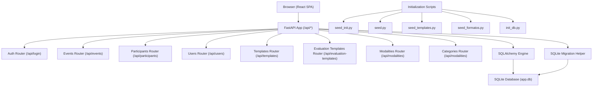
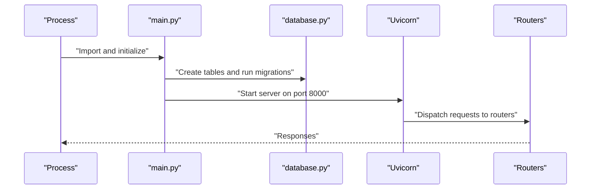
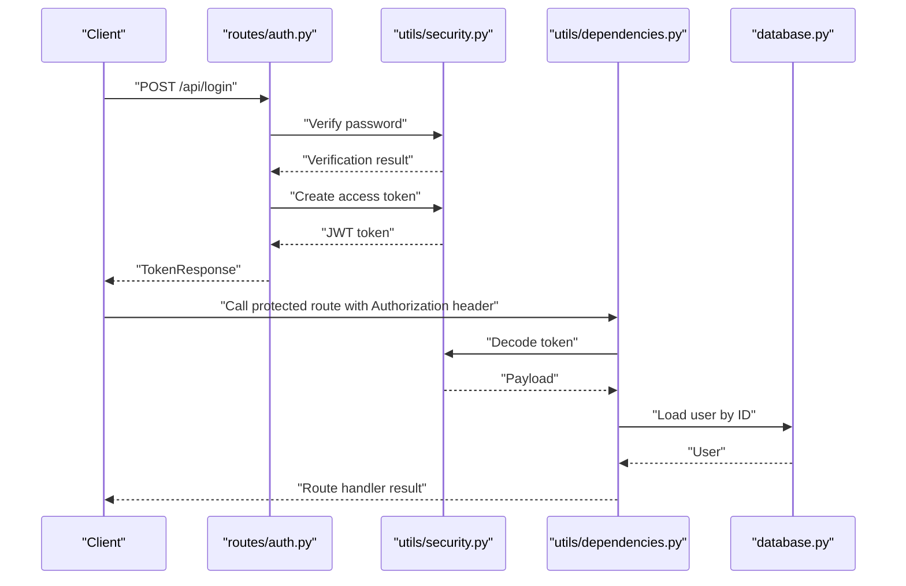
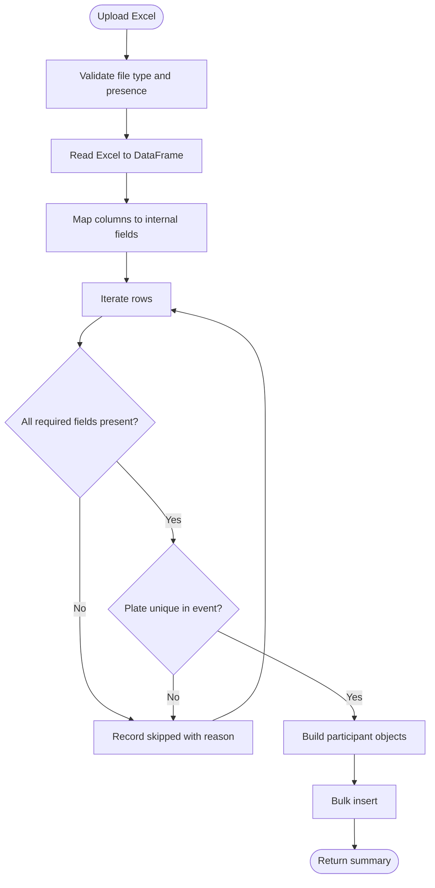
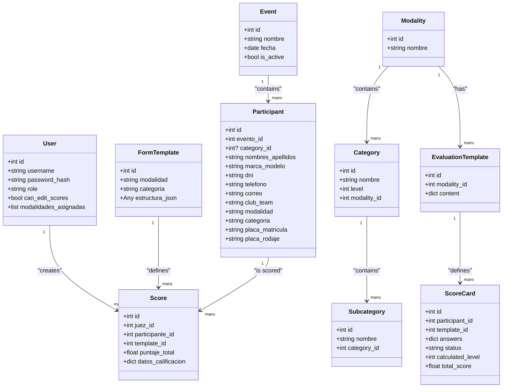
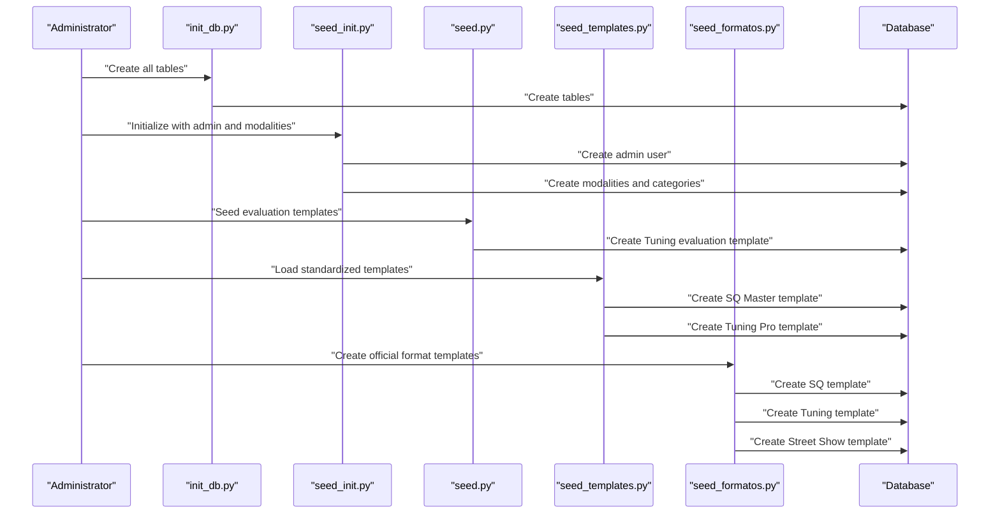
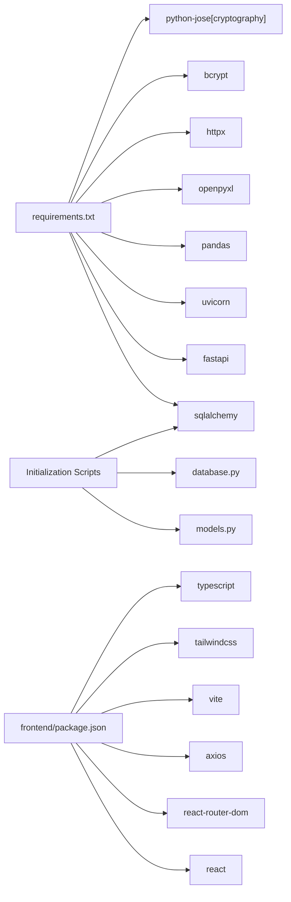

# Development and Deployment

<cite>
**Referenced Files in This Document**
- [start.sh](file://start.sh)
- [main.py](file://main.py)
- [requirements.txt](file://requirements.txt)
- [database.py](file://database.py)
- [models.py](file://models.py)
- [schemas.py](file://schemas.py)
- [routes/auth.py](file://routes/auth.py)
- [routes/events.py](file://routes/events.py)
- [routes/participants.py](file://routes/participants.py)
- [routes/users.py](file://routes/users.py)
- [routes/templates.py](file://routes/templates.py)
- [routes/evaluation_templates.py](file://routes/evaluation_templates.py)
- [routes/modalities.py](file://routes/modalities.py)
- [routes/categories.py](file://routes/categories.py)
- [utils/dependencies.py](file://utils/dependencies.py)
- [utils/security.py](file://utils/security.py)
- [frontend/package.json](file://frontend/package.json)
- [frontend/vite.config.js](file://frontend/vite.config.js)
- [seed.py](file://seed.py)
- [seed_init.py](file://seed_init.py)
- [seed_formatos.py](file://seed_formatos.py)
- [seed_templates.py](file://seed_templates.py)
- [init_db.py](file://init_db.py)
</cite>

## Table of Contents
1. [Introduction](#introduction)
2. [Project Structure](#project-structure)
3. [Core Components](#core-components)
4. [Architecture Overview](#architecture-overview)
5. [Detailed Component Analysis](#detailed-component-analysis)
6. [Database Initialization and Seed Management](#database-initialization-and-seed-management)
7. [Dependency Analysis](#dependency-analysis)
8. [Performance Considerations](#performance-considerations)
9. [Troubleshooting Guide](#troubleshooting-guide)
10. [Conclusion](#conclusion)
11. [Appendices](#appendices)

## Introduction
This document provides end-to-end guidance for developing and deploying the Juzgamiento application. It covers local environment setup, development workflow, production deployment, containerization, reverse proxy and SSL configuration, performance optimization, monitoring, scaling, backups, and disaster recovery. The application is a FastAPI backend with a React/TypeScript frontend, backed by an SQLite database with automatic migrations and comprehensive seed functionality for modalities, categories, and evaluation templates.

## Project Structure
The repository follows a clear separation of concerns:
- Backend: FastAPI application with SQLAlchemy ORM, route modules per domain, shared models, schemas, and utilities.
- Frontend: React SPA built with Vite, TypeScript, Tailwind CSS, and React Router.
- Scripts: A convenience script to launch both backend and frontend during development, plus comprehensive database initialization and seeding scripts.
- Database: SQLite database with automatic migrations and multiple seed scripts for different aspects of the application.

```mermaid
graph TB
subgraph "Backend"
MAIN["main.py"]
DB["database.py"]
MODELS["models.py"]
SCHEMAS["schemas.py"]
ROUTES_AUTH["routes/auth.py"]
ROUTES_EVENTS["routes/events.py"]
ROUTES_PARTICIPANTS["routes/participants.py"]
ROUTES_USERS["routes/users.py"]
ROUTES_TEMPLATES["routes/templates.py"]
ROUTES_EVAL_TEMPLATES["routes/evaluation_templates.py"]
ROUTES_MODALITIES["routes/modalities.py"]
ROUTES_CATEGORIES["routes/categories.py"]
UTILS_DEPS["utils/dependencies.py"]
UTILS_SEC["utils/security.py"]
END
subgraph "Database Initialization Scripts"
INIT_DB["init_db.py"]
SEED_INIT["seed_init.py"]
SEED_FORMATOS["seed_formatos.py"]
SEED_TEMPLATES["seed_templates.py"]
SEED_PY["seed.py"]
END
subgraph "Frontend"
FE_PKG["frontend/package.json"]
FE_VITE["frontend/vite.config.js"]
END
START["start.sh"]
START --> MAIN
START --> FE_PKG
MAIN --> DB
MAIN --> MODELS
MAIN --> ROUTES_AUTH
MAIN --> ROUTES_EVENTS
MAIN --> ROUTES_PARTICIPANTS
MAIN --> ROUTES_USERS
MAIN --> ROUTES_TEMPLATES
MAIN --> ROUTES_EVAL_TEMPLATES
MAIN --> ROUTES_MODALITIES
MAIN --> ROUTES_CATEGORIES
ROUTES_AUTH --> UTILS_SEC
ROUTES_AUTH --> SCHEMAS
ROUTES_EVENTS --> SCHEMAS
ROUTES_PARTICIPANTS --> SCHEMAS
ROUTES_USERS --> SCHEMAS
ROUTES_TEMPLATES --> SCHEMAS
ROUTES_EVAL_TEMPLATES --> SCHEMAS
ROUTES_MODALITIES --> SCHEMAS
ROUTES_CATEGORIES --> SCHEMAS
FE_PKG --> FE_VITE
INIT_DB --> DB
SEED_INIT --> DB
SEED_FORMATOS --> DB
SEED_TEMPLATES --> DB
SEED_PY --> DB
```

**Diagram sources**
- [main.py:1-59](file://main.py#L1-L59)
- [database.py:1-93](file://database.py#L1-L93)
- [models.py:1-225](file://models.py#L1-L225)
- [schemas.py:1-298](file://schemas.py#L1-L298)
- [routes/auth.py:1-36](file://routes/auth.py#L1-L36)
- [routes/events.py:1-74](file://routes/events.py#L1-L74)
- [routes/participants.py:1-400](file://routes/participants.py#L1-L400)
- [routes/users.py:1-192](file://routes/users.py#L1-L192)
- [routes/templates.py:1-64](file://routes/templates.py#L1-L64)
- [routes/evaluation_templates.py:1-107](file://routes/evaluation_templates.py#L1-L107)
- [routes/modalities.py:1-196](file://routes/modalities.py#L1-L196)
- [routes/categories.py:1-128](file://routes/categories.py#L1-L128)
- [utils/dependencies.py:1-71](file://utils/dependencies.py#L1-L71)
- [utils/security.py:1-51](file://utils/security.py#L1-L51)
- [frontend/package.json:1-28](file://frontend/package.json#L1-L28)
- [frontend/vite.config.js:1-6](file://frontend/vite.config.js#L1-L6)
- [start.sh:1-16](file://start.sh#L1-L16)
- [init_db.py:1-32](file://init_db.py#L1-L32)
- [seed_init.py:1-109](file://seed_init.py#L1-L109)
- [seed_formatos.py:1-146](file://seed_formatos.py#L1-L146)
- [seed_templates.py:1-210](file://seed_templates.py#L1-L210)
- [seed.py:1-129](file://seed.py#L1-L129)

**Section sources**
- [main.py:1-59](file://main.py#L1-L59)
- [database.py:1-93](file://database.py#L1-L93)
- [models.py:1-225](file://models.py#L1-L225)
- [schemas.py:1-298](file://schemas.py#L1-L298)
- [routes/auth.py:1-36](file://routes/auth.py#L1-L36)
- [routes/events.py:1-74](file://routes/events.py#L1-L74)
- [routes/participants.py:1-400](file://routes/participants.py#L1-L400)
- [routes/users.py:1-192](file://routes/users.py#L1-L192)
- [routes/templates.py:1-64](file://routes/templates.py#L1-L64)
- [routes/evaluation_templates.py:1-107](file://routes/evaluation_templates.py#L1-L107)
- [routes/modalities.py:1-196](file://routes/modalities.py#L1-L196)
- [routes/categories.py:1-128](file://routes/categories.py#L1-L128)
- [utils/dependencies.py:1-71](file://utils/dependencies.py#L1-L71)
- [utils/security.py:1-51](file://utils/security.py#L1-L51)
- [frontend/package.json:1-28](file://frontend/package.json#L1-L28)
- [frontend/vite.config.js:1-6](file://frontend/vite.config.js#L1-L6)
- [start.sh:1-16](file://start.sh#L1-L16)
- [init_db.py:1-32](file://init_db.py#L1-L32)
- [seed_init.py:1-109](file://seed_init.py#L1-L109)
- [seed_formatos.py:1-146](file://seed_formatos.py#L1-L146)
- [seed_templates.py:1-210](file://seed_templates.py#L1-L210)
- [seed.py:1-129](file://seed.py#L1-L129)

## Core Components
- Application server: FastAPI app configured with CORS middleware and multiple routers for authentication, events, participants, users, templates, evaluation templates, modalities, and categories.
- Database: SQLAlchemy declarative base with an SQLite engine and a migration helper for evolving the participants table.
- Models: ORM entities for users, events, participants, form templates, scores, evaluation templates, modalities, categories, subcategories, and judge assignments with relationships and constraints.
- Schemas: Pydantic models for request/response validation and type safety, including specialized schemas for evaluation templates and hierarchical data structures.
- Utilities: Authentication helpers (JWT secret, hashing, token creation/verification) and dependency injection for protected routes.
- Frontend: React SPA with Vite dev server and build pipeline.
- Database initialization: Comprehensive seed scripts for creating initial data including admin users, modalities, categories, evaluation templates, and form templates.

Key runtime behaviors:
- Health endpoint exposed for readiness/liveness checks.
- Automatic database initialization and SQLite migrations on startup.
- Cross-origin requests allowed for development.
- Multiple seed scripts for different aspects of database initialization.

**Section sources**
- [main.py:1-59](file://main.py#L1-L59)
- [database.py:1-93](file://database.py#L1-L93)
- [models.py:1-225](file://models.py#L1-L225)
- [schemas.py:1-298](file://schemas.py#L1-L298)
- [utils/security.py:1-51](file://utils/security.py#L1-L51)
- [utils/dependencies.py:1-71](file://utils/dependencies.py#L1-L71)
- [frontend/package.json:1-28](file://frontend/package.json#L1-L28)
- [seed_init.py:1-109](file://seed_init.py#L1-L109)
- [seed.py:1-129](file://seed.py#L1-L129)
- [seed_templates.py:1-210](file://seed_templates.py#L1-L210)
- [seed_formatos.py:1-146](file://seed_formatos.py#L1-L146)

## Architecture Overview
The system comprises a client-server architecture with comprehensive database initialization capabilities:
- Client: React SPA served via Vite's dev server during development.
- Server: FastAPI application exposing REST endpoints and serving static assets in production.
- Persistence: SQLite database file managed by SQLAlchemy with multiple seed scripts for initialization.
- Administration: Dedicated routes for managing modalities, categories, and evaluation templates.



**Diagram sources**
- [main.py:1-59](file://main.py#L1-L59)
- [routes/auth.py:1-36](file://routes/auth.py#L1-L36)
- [routes/events.py:1-74](file://routes/events.py#L1-L74)
- [routes/participants.py:1-400](file://routes/participants.py#L1-L400)
- [routes/users.py:1-192](file://routes/users.py#L1-L192)
- [routes/templates.py:1-64](file://routes/templates.py#L1-L64)
- [routes/evaluation_templates.py:1-107](file://routes/evaluation_templates.py#L1-L107)
- [routes/modalities.py:1-196](file://routes/modalities.py#L1-L196)
- [routes/categories.py:1-128](file://routes/categories.py#L1-L128)
- [database.py:1-93](file://database.py#L1-L93)
- [seed_init.py:1-109](file://seed_init.py#L1-L109)
- [seed.py:1-129](file://seed.py#L1-L129)
- [seed_templates.py:1-210](file://seed_templates.py#L1-L210)
- [seed_formatos.py:1-146](file://seed_formatos.py#L1-L146)
- [init_db.py:1-32](file://init_db.py#L1-L32)

## Detailed Component Analysis

### Backend Startup and Routing
- The application initializes database tables and runs SQLite migrations before starting the server.
- CORS is configured broadly for development convenience.
- Routers are mounted under a common prefix and include health checks.



**Diagram sources**
- [main.py:1-59](file://main.py#L1-L59)
- [database.py:1-93](file://database.py#L1-L93)

**Section sources**
- [main.py:1-59](file://main.py#L1-L59)
- [database.py:1-93](file://database.py#L1-L93)

### Authentication Flow
- Login endpoint validates credentials and issues a signed JWT token.
- Protected routes use dependency injection to extract and validate tokens.



**Diagram sources**
- [routes/auth.py:1-36](file://routes/auth.py#L1-L36)
- [utils/security.py:1-51](file://utils/security.py#L1-L51)
- [utils/dependencies.py:1-71](file://utils/dependencies.py#L1-L71)
- [database.py:1-93](file://database.py#L1-L93)

**Section sources**
- [routes/auth.py:1-36](file://routes/auth.py#L1-L36)
- [utils/security.py:1-51](file://utils/security.py#L1-L51)
- [utils/dependencies.py:1-71](file://utils/dependencies.py#L1-L71)

### Participants Import Pipeline
- Excel upload endpoint normalizes column names, validates required fields, deduplicates by license plate within an event, and bulk-inserts records.



**Diagram sources**
- [routes/participants.py:286-400](file://routes/participants.py#L286-L400)

**Section sources**
- [routes/participants.py:1-400](file://routes/participants.py#L1-L400)

### Data Model Relationships


**Diagram sources**
- [models.py:1-225](file://models.py#L1-L225)

**Section sources**
- [models.py:1-225](file://models.py#L1-L225)

## Database Initialization and Seed Management

### Database Initialization Scripts
The application includes comprehensive database initialization and seeding capabilities through multiple dedicated scripts:

#### Core Initialization Script
- **init_db.py**: Creates all database tables based on SQLAlchemy models.
- **seed_init.py**: Initializes the database with a super admin user and official modalities and categories.
- **seed.py**: Seeds evaluation templates specifically for the Tuning modality.
- **seed_templates.py**: Loads standardized form templates for different modalities.
- **seed_formatos.py**: Creates official format templates for SQ, Tuning, and Street Show modalities.

#### Initialization Process Flow


**Diagram sources**
- [init_db.py:1-32](file://init_db.py#L1-L32)
- [seed_init.py:1-109](file://seed_init.py#L1-L109)
- [seed.py:1-129](file://seed.py#L1-L129)
- [seed_templates.py:1-210](file://seed_templates.py#L1-L210)
- [seed_formatos.py:1-146](file://seed_formatos.py#L1-L146)

#### Seed Data Structure
The seed functionality creates comprehensive data structures:

**Official Modalities and Categories** (from seed_init.py):
- SPL: Intro 1, Intro 2, Aficionado 1, Aficionado 2, Pro 1, Pro 2, Master
- SQ: Intro, Aficionado, Pro, Master
- SQL: Intro, Aficionado, Pro, Master
- Street Show: Intro 1, Intro 2, Aficionado 1, Aficionado 2, Pro 1, Pro 2, Master, Constructor
- Tuning: Intro 1, Intro 2, Aficionado 1, Aficionado 2, Pro 1, Pro 2, Máster, Clasico Tuning, Clasico
- Tuning VW: Clasico hasta el '73, Contemporaneo > '73, Intro VW, Pro VW

**Evaluation Templates** (from seed.py):
- Tuning Master template with detailed evaluation scales and categorization options
- Comprehensive scoring sections for appearance, motor performance, and bonuses

**Standardized Form Templates** (from seed_templates.py):
- SQ Master template with balanced scoring across sound quality, stage presentation, image, noise control, and installation quality
- Tuning Pro template focusing on exterior, interior, engine compartment, and overall aesthetics
- Tuning alCAT 2025 template with advanced evaluation criteria and bonus points

**Official Format Templates** (from seed_formatos.py):
- SQ template with 50 points for sound quality and 50 points for image
- Tuning template with comprehensive exterior, interior, motor performance, and lighting criteria
- Street Show template emphasizing installation quality and safety

**Section sources**
- [init_db.py:1-32](file://init_db.py#L1-L32)
- [seed_init.py:1-109](file://seed_init.py#L1-L109)
- [seed.py:1-129](file://seed.py#L1-L129)
- [seed_templates.py:1-210](file://seed_templates.py#L1-L210)
- [seed_formatos.py:1-146](file://seed_formatos.py#L1-L146)

### Administration Routes for Dynamic Management
The application provides comprehensive administration routes for managing modalities, categories, and evaluation templates:

#### Modality Management
- List all modalities with nested categories and subcategories
- Create new modalities
- Delete modalities with cascading deletion of associated categories and subcategories

#### Category Management  
- Create categories within specific modalities
- Delete categories with cascading deletion of associated subcategories
- Manage category levels and relationships

#### Evaluation Template Management
- List all evaluation templates with modality names
- Get templates by modality
- Update evaluation templates with sanitized content
- Admin-only access for template modifications

**Section sources**
- [routes/modalities.py:1-196](file://routes/modalities.py#L1-L196)
- [routes/categories.py:1-128](file://routes/categories.py#L1-L128)
- [routes/evaluation_templates.py:1-107](file://routes/evaluation_templates.py#L1-L107)
- [schemas.py:167-225](file://schemas.py#L167-L225)

## Dependency Analysis
- Backend dependencies are declared in requirements.txt and include FastAPI, Uvicorn, SQLAlchemy, pandas, openpyxl, httpx, bcrypt, and python-jose.
- Frontend dependencies include React, React Router, Axios, Vite, Tailwind CSS, and TypeScript tooling.
- Runtime dependencies are primarily Python packages for web framework, ORM, cryptography, and data processing.
- Database initialization scripts depend on SQLAlchemy models and database connection utilities.



**Diagram sources**
- [requirements.txt:1-10](file://requirements.txt#L1-L10)
- [frontend/package.json:1-28](file://frontend/package.json#L1-L28)
- [init_db.py:1-32](file://init_db.py#L1-L32)
- [seed_init.py:1-109](file://seed_init.py#L1-L109)
- [seed.py:1-129](file://seed.py#L1-L129)
- [seed_templates.py:1-210](file://seed_templates.py#L1-L210)
- [seed_formatos.py:1-146](file://seed_formatos.py#L1-L146)

**Section sources**
- [requirements.txt:1-10](file://requirements.txt#L1-L10)
- [frontend/package.json:1-28](file://frontend/package.json#L1-L28)
- [init_db.py:1-32](file://init_db.py#L1-L32)
- [seed_init.py:1-109](file://seed_init.py#L1-L109)
- [seed.py:1-129](file://seed.py#L1-L129)
- [seed_templates.py:1-210](file://seed_templates.py#L1-L210)
- [seed_formatos.py:1-146](file://seed_formatos.py#L1-L146)

## Performance Considerations
- Database indexing: Participants table includes indexes on event foreign key and license plate to optimize lookups and uniqueness checks.
- Bulk inserts: Participants upload uses bulk_save_objects to minimize round-trips.
- Column normalization: Excel import normalizes column names to reduce ambiguity and improve reliability.
- SQLite tuning: Consider WAL mode and appropriate pragmas for write-heavy workloads; ensure adequate disk I/O performance.
- Caching: Introduce Redis for rate limiting and short-lived caches for frequent queries (e.g., templates).
- Static assets: Serve frontend build artifacts via a CDN or reverse proxy with compression and caching headers.
- Monitoring: Add Prometheus metrics and structured logs for latency, error rates, and resource usage.
- Seed optimization: Database initialization scripts use efficient bulk operations and transaction management to minimize database overhead.

## Troubleshooting Guide
Common issues and resolutions:
- Port conflicts during development:
  - The start script kills processes bound to ports 8000 and 5173 before launching the app. Verify ports are free or adjust the script accordingly.
- Database initialization errors:
  - Ensure the working directory allows writing to the app.db file. Confirm SQLite engine creation and migration steps succeed.
  - Use init_db.py to create all tables before running seed scripts.
- Seed script conflicts:
  - Run seed_init.py first to create admin user and base data, then run other seed scripts as needed.
  - Seed scripts handle duplicates gracefully but may show warnings for existing data.
- CORS errors:
  - In production, configure allow_origins to a specific origin list instead of wildcard.
- JWT secrets:
  - Set JWT_SECRET_KEY and ACCESS_TOKEN_EXPIRE_MINUTES in production to secure tokens and manage expiration.
- Excel upload failures:
  - Validate required columns and ensure unique license plates per event. Check for empty files and unsupported extensions.
- Health checks:
  - Use the /health endpoint to confirm service availability.
- Database seed failures:
  - Check database permissions and ensure the database file is writable.
  - Verify that required dependencies are installed before running seed scripts.

**Section sources**
- [start.sh:1-16](file://start.sh#L1-L16)
- [main.py:1-59](file://main.py#L1-L59)
- [database.py:1-93](file://database.py#L1-L93)
- [utils/security.py:1-51](file://utils/security.py#L1-L51)
- [routes/participants.py:286-400](file://routes/participants.py#L286-L400)
- [seed_init.py:1-109](file://seed_init.py#L1-L109)
- [seed.py:1-129](file://seed.py#L1-L129)
- [seed_templates.py:1-210](file://seed_templates.py#L1-L210)
- [seed_formatos.py:1-146](file://seed_formatos.py#L1-L146)

## Conclusion
Juzgamiento is a comprehensive system combining a FastAPI backend and a modern React frontend, backed by SQLite with sophisticated database initialization and seeding capabilities. The application now includes extensive seed functionality for modalities, categories, evaluation templates, and standardized form templates, enabling rapid deployment with complete data structures. The modular design supports straightforward production deployment, containerization, and operational improvements with comprehensive administrative capabilities.

## Appendices

### Local Development Environment Setup
- Python virtual environment:
  - Create and activate a virtual environment.
  - Install backend dependencies from requirements.txt.
- Node.js and frontend:
  - Install Node.js and npm.
  - Install frontend dependencies and run the dev server.
- Database initialization:
  - Run init_db.py to create all tables.
  - Execute seed_init.py to create admin user and base modalities/categories.
  - Run additional seed scripts as needed for evaluation templates and form templates.

**Section sources**
- [requirements.txt:1-10](file://requirements.txt#L1-L10)
- [frontend/package.json:1-28](file://frontend/package.json#L1-L28)
- [main.py:1-59](file://main.py#L1-L59)
- [database.py:1-93](file://database.py#L1-L93)
- [init_db.py:1-32](file://init_db.py#L1-L32)
- [seed_init.py:1-109](file://seed_init.py#L1-L109)

### Development Workflow
- Use start.sh to launch the backend (FastAPI/Uvicorn) and frontend (Vite) concurrently.
- Hot reload is enabled for both backend (Uvicorn reload) and frontend (Vite dev server).
- Debugging:
  - Backend: Use a Python debugger or attach to the Uvicorn process.
  - Frontend: Use browser developer tools and React DevTools.
- Database management:
  - Use init_db.py for table creation.
  - Use seed_init.py for initial data population.
  - Use seed.py, seed_templates.py, and seed_formatos.py for specialized data seeding.

**Section sources**
- [start.sh:1-16](file://start.sh#L1-L16)
- [frontend/package.json:1-28](file://frontend/package.json#L1-L28)
- [init_db.py:1-32](file://init_db.py#L1-L32)
- [seed_init.py:1-109](file://seed_init.py#L1-L109)
- [seed.py:1-129](file://seed.py#L1-L129)
- [seed_templates.py:1-210](file://seed_templates.py#L1-L210)
- [seed_formatos.py:1-146](file://seed_formatos.py#L1-L146)

### Production Deployment
- Build optimization:
  - Build the frontend using the provided build script.
  - Package the backend and serve static assets via the FastAPI app or a reverse proxy.
- Environment configuration:
  - Set JWT_SECRET_KEY and ACCESS_TOKEN_EXPIRE_MINUTES.
  - Configure allow_origins for production.
- Database initialization strategy:
  - Run init_db.py to create all tables.
  - Execute seed_init.py for admin user and base data.
  - Deploy seed.py, seed_templates.py, and seed_formatos.py for comprehensive data seeding.
  - The app runs SQLite migrations on startup. For production, ensure write permissions and consider backup/restore procedures before updates.

**Section sources**
- [frontend/package.json:1-28](file://frontend/package.json#L1-L28)
- [utils/security.py:1-51](file://utils/security.py#L1-L51)
- [main.py:1-59](file://main.py#L1-L59)
- [database.py:1-93](file://database.py#L1-L93)
- [init_db.py:1-32](file://init_db.py#L1-L32)
- [seed_init.py:1-109](file://seed_init.py#L1-L109)
- [seed.py:1-129](file://seed.py#L1-L129)
- [seed_templates.py:1-210](file://seed_templates.py#L1-L210)
- [seed_formatos.py:1-146](file://seed_formatos.py#L1-L146)

### Containerization and Reverse Proxy
- Docker:
  - Build a Python image with the backend and a Node.js image for the frontend, or build the frontend and serve statically from the backend image.
  - Ensure database file permissions are properly configured in containerized environments.
- Reverse proxy:
  - Route /api/* to the backend service and serve frontend static assets from the backend or a CDN.
- SSL/TLS:
  - Terminate TLS at the reverse proxy or load balancer; configure certificates and enforce HTTPS.

### Monitoring and Maintenance
- Health checks:
  - Use the /health endpoint for basic service checks.
- Logging:
  - Enable structured logging in production for auditability.
- Maintenance:
  - Schedule periodic backups of the SQLite database file.
  - Monitor disk space and database file growth.
  - Use seed scripts for controlled data updates and migrations.

**Section sources**
- [main.py:56-59](file://main.py#L56-L59)

### Scaling, Backup, and Disaster Recovery
- Scaling:
  - Stateless backend: scale horizontally behind a load balancer.
  - Shared storage or external database for stateful workloads.
- Backup:
  - Regularly copy the SQLite database file; test restore procedures.
  - Include seed scripts in backup procedures for complete data restoration.
- Disaster recovery:
  - Maintain offsite backups and document recovery steps.
  - Test seed script execution for rapid system restoration.

### Deployment Checklist
- Backend
  - Install dependencies and verify Python version compatibility.
  - Set environment variables (JWT secret, token expiry).
  - Run init_db.py to create tables.
  - Execute seed_init.py for admin and base data.
  - Run specialized seed scripts for evaluation templates and form templates.
  - Run migrations and confirm database connectivity.
- Frontend
  - Build static assets and verify asset paths.
- Infrastructure
  - Configure reverse proxy, SSL termination, and static asset serving.
  - Set up health checks and monitoring.
- Validation
  - Smoke test login, CRUD operations, and uploads.
  - Verify seed data integrity and accessibility through administration routes.