# Enhanced Judge Interfaces

<cite>
**Referenced Files in This Document**
- [main.py](file://main.py)
- [models.py](file://models.py)
- [schemas.py](file://schemas.py)
- [database.py](file://database.py)
- [routes/judge_assignments.py](file://routes/judge_assignments.py)
- [routes/scorecards.py](file://routes/scorecards.py)
- [routes/evaluation_templates.py](file://routes/evaluation_templates.py)
- [utils/dependencies.py](file://utils/dependencies.py)
- [frontend/src/pages/juez/Dashboard.tsx](file://frontend/src/pages/juez/Dashboard.tsx)
- [frontend/src/pages/juez/Calificar.tsx](file://frontend/src/pages/juez/Calificar.tsx)
- [frontend/src/pages/juez/Selector.tsx](file://frontend/src/pages/juez/Selector.tsx)
- [frontend/src/pages/juez/JuezLayout.tsx](file://frontend/src/pages/juez/JuezLayout.tsx)
- [frontend/src/pages/juez/Reglamentos.tsx](file://frontend/src/pages/juez/Reglamentos.tsx)
- [frontend/src/pages/admin/EvaluationTemplateEditor.tsx](file://frontend/src/pages/admin/EvaluationTemplateEditor.tsx)
- [frontend/src/pages/admin/TemplatesList.tsx](file://frontend/src/pages/admin/TemplatesList.tsx)
- [frontend/src/pages/shared/Resultados.tsx](file://frontend/src/pages/shared/Resultados.tsx)
- [frontend/src/lib/judging.ts](file://frontend/src/lib/judging.ts)
- [frontend/src/lib/api.ts](file://frontend/src/lib/api.ts)
- [frontend/src/App.tsx](file://frontend/src/App.tsx)
- [frontend/src/main.tsx](file://frontend/src/main.tsx)
</cite>

## Update Summary
**Changes Made**
- Enhanced judge dashboard with improved participant filtering and real-time completion tracking
- Streamlined navigation with three-step workflow: Selector → Dashboard → Calificar
- Improved participant cards with completion status indicators and visual feedback
- Enhanced real-time progress tracking with avance de sala metrics
- Added comprehensive toast notifications and error handling
- Improved judge assignment management with role-based access control
- Enhanced collaborative evaluation interface with real-time scoring and categorization
- Added comprehensive results reporting interface for judges and administrators
- Enhanced navigation structure with improved layout components and routing
- **Updated** Enhanced judge scoring interface with improved template rendering, real-time calculations, and better user experience
- **Updated** Added new partial score update functionality with draft/completed status management
- **Updated** Enhanced finalization workflows with automated result calculations and category assignments
- **Updated** Improved scorecard management with comprehensive validation and audit trails

## Table of Contents
1. [Introduction](#introduction)
2. [System Architecture](#system-architecture)
3. [Core Judge Components](#core-judge-components)
4. [Enhanced Interface Design](#enhanced-interface-design)
5. [Data Flow Architecture](#data-flow-architecture)
6. [Security and Access Control](#security-and-access-control)
7. [Template Management System](#template-management-system)
8. [Results and Scoring Engine](#results-and-scoring-engine)
9. [Frontend Implementation Patterns](#frontend-implementation-patterns)
10. [Performance Considerations](#performance-considerations)
11. [Troubleshooting Guide](#troubleshooting-guide)
12. [Conclusion](#conclusion)

## Introduction

The Enhanced Judge Interfaces system represents a comprehensive digital solution for automotive competition judging, specifically designed for Car Audio and Tuning events. This system provides judges with intuitive, role-based interfaces for evaluating participants while maintaining strict security controls and administrative oversight.

The platform consists of two primary user interfaces: a judge-facing interface for real-time scoring and evaluation, and an administrative interface for managing competitions, templates, and participants. Built with modern web technologies, the system ensures seamless collaboration between multiple judges while maintaining data integrity and security.

Key features include role-based access control, collaborative scoring workflows, dynamic template systems, automated category assignments, and comprehensive result reporting capabilities. The system supports multiple competition modalities including SPL, SQ, SQL, Street Show, Tuning, and Tuning VW categories.

## System Architecture

The Enhanced Judge Interfaces follows a modern client-server architecture with clear separation of concerns between frontend presentation, backend APIs, and database persistence.

```mermaid
graph TB
subgraph "Frontend Layer"
JL[JuezLayout]
DJ[Dashboard]
JC[Calificar]
JS[Selector]
JR[Reglamentos]
AJ[AdminLayout]
TE[TemplateEditor]
TL[TemplatesList]
RS[Resultados]
end
subgraph "API Layer"
JA[Judge Assignments API]
SC[Scorecards API]
ET[Evaluation Templates API]
AU[Auth Utilities]
end
subgraph "Backend Services"
DB[(SQLite Database)]
Models[Data Models]
Schemas[Validation Schemas]
end
subgraph "External Systems"
Uploads[/uploads/ Directory]
Static[Static Files]
end
JL --> DJ
JL --> JC
JL --> JS
JL --> JR
AJ --> TE
AJ --> TL
AJ --> RS
DJ --> JA
DJ --> SC
DJ --> ET
JC --> SC
JC --> ET
JS --> JA
JA --> Models
SC --> Models
ET --> Models
Models --> DB
Schemas --> DB
DB --> Uploads
DB --> Static
```

**Diagram sources**
- [frontend/src/App.tsx:13-125](file://frontend/src/App.tsx#L13-L125)
- [routes/judge_assignments.py:12](file://routes/judge_assignments.py#L12)
- [routes/scorecards.py:20](file://routes/scorecards.py#L20)
- [routes/evaluation_templates.py:14](file://routes/evaluation_templates.py#L14)

The architecture employs a modular FastAPI backend with SQLAlchemy ORM for database operations, supporting both judge and administrative workflows. The frontend utilizes React with TypeScript for type-safe development and responsive design.

**Section sources**
- [frontend/src/App.tsx:96-131](file://frontend/src/App.tsx#L96-L131)
- [database.py:1-193](file://database.py#L1-L193)

## Core Judge Components

### Judge Assignment Management

The judge assignment system provides granular control over which judges can evaluate specific competition sections and modalities.

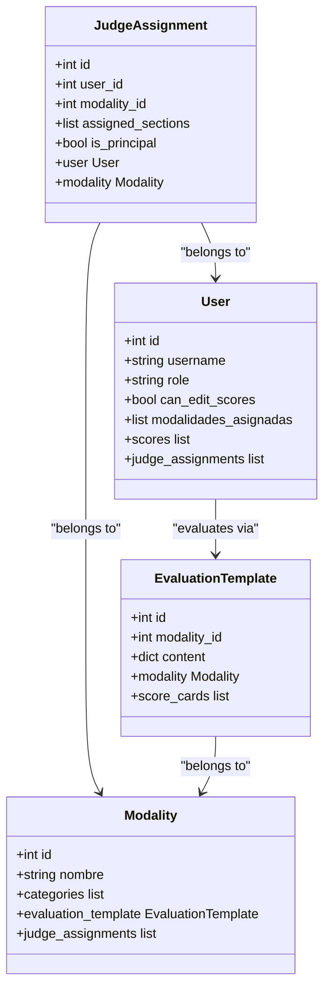

**Diagram sources**
- [models.py:131-144](file://models.py#L131-L144)
- [models.py:11-25](file://models.py#L11-L25)
- [models.py:174-192](file://models.py#L174-L192)
- [models.py:115-128](file://models.py#L115-L128)

The system enforces role-based permissions where only administrators can assign judges to modalities, while judges receive automatic synchronization of their assigned modalities. Principal judges have elevated privileges including access to bonus sections and finalization capabilities.

**Section sources**
- [routes/judge_assignments.py:69-81](file://routes/judge_assignments.py#L69-L81)
- [routes/judge_assignments.py:164-280](file://routes/judge_assignments.py#L164-L280)

### Scorecard Management System

The scorecard system provides collaborative evaluation capabilities with real-time validation and automated calculations.

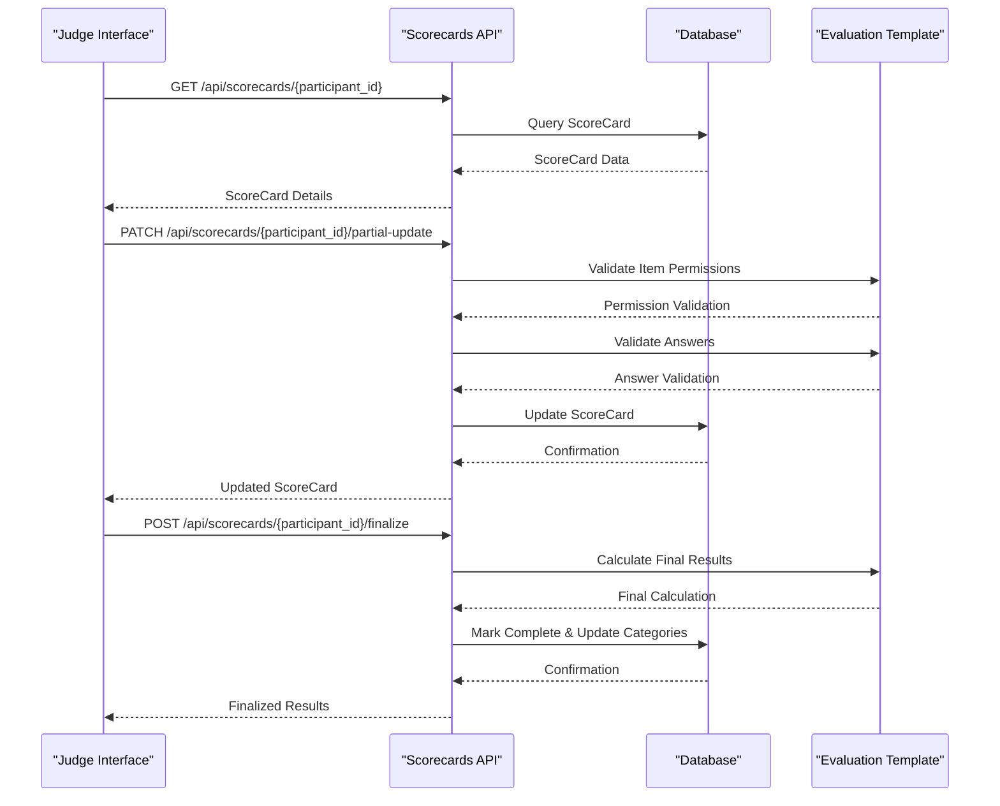

**Diagram sources**
- [routes/scorecards.py:445-503](file://routes/scorecards.py#L445-L503)
- [routes/scorecards.py:535-607](file://routes/scorecards.py#L535-L607)

The system automatically validates judge permissions against their assigned sections, performs comprehensive answer validation including score ranges and category consistency, and maintains audit trails through status tracking.

**Section sources**
- [routes/scorecards.py:144-174](file://routes/scorecards.py#L144-L174)
- [routes/scorecards.py:207-316](file://routes/scorecards.py#L207-L316)

## Enhanced Interface Design

### Judge Dashboard Interface

The judge dashboard provides a streamlined workflow for managing multiple participants within assigned modalities with enhanced navigation and real-time progress tracking.

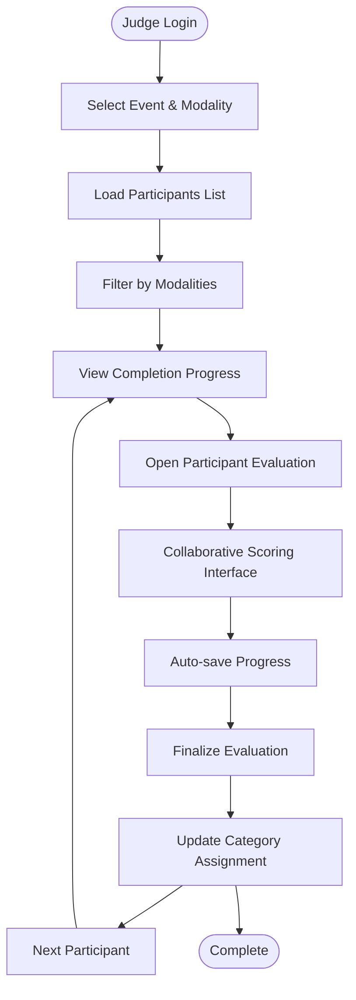

**Diagram sources**
- [frontend/src/pages/juez/Dashboard.tsx:28-84](file://frontend/src/pages/juez/Dashboard.tsx#L28-L84)
- [frontend/src/pages/juez/Calificar.tsx:291-402](file://frontend/src/pages/juez/Calificar.tsx#L291-L402)

The interface displays real-time completion statistics, participant filtering capabilities, and progress tracking with visual indicators for completed evaluations. The dashboard now includes enhanced navigation with back buttons and improved visual feedback for participant states.

**Updated** The dashboard now features:
- Real-time completion tracking with avance de sala metrics
- Enhanced participant cards with completion status indicators
- Improved navigation with step-by-step workflow progression
- Visual feedback for participant states (completed vs pending)
- Streamlined filtering by event and modality
- Comprehensive error handling and loading states
- Enhanced toast notifications for user actions

**Section sources**
- [frontend/src/pages/juez/Dashboard.tsx:9-268](file://frontend/src/pages/juez/Dashboard.tsx#L9-L268)
- [frontend/src/pages/juez/Selector.tsx:33-208](file://frontend/src/pages/juez/Selector.tsx#L33-L208)

### Collaborative Evaluation Interface

The evaluation interface provides judges with role-specific access to scoring sections while maintaining collaborative capabilities with real-time scoring and categorization.

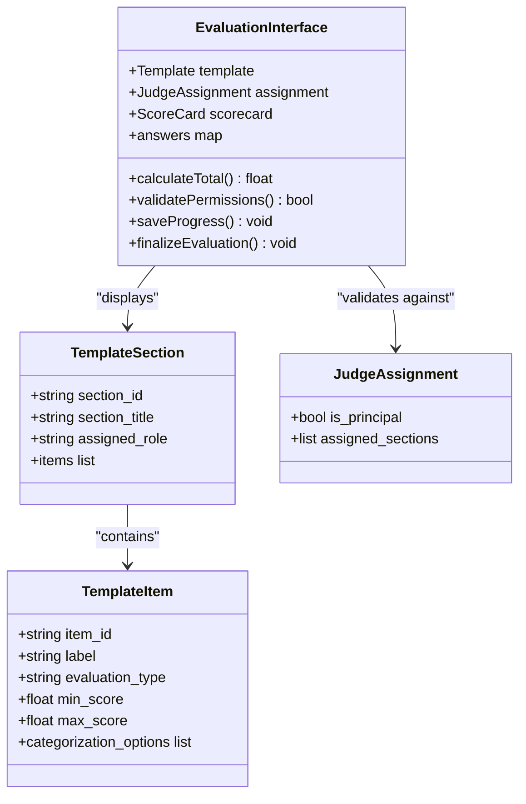

**Diagram sources**
- [frontend/src/pages/juez/Calificar.tsx:207-800](file://frontend/src/pages/juez/Calificar.tsx#L207-L800)
- [frontend/src/lib/judging.ts:48-83](file://frontend/src/lib/judging.ts#L48-L83)

The interface dynamically renders only permitted sections based on judge assignments, provides real-time score calculations, and supports both numeric scoring and categorical assignments. The collaborative interface now includes enhanced real-time scoring with immediate visual feedback and comprehensive categorization options.

**Section sources**
- [frontend/src/pages/juez/Calificar.tsx:472-556](file://frontend/src/pages/juez/Calificar.tsx#L472-L556)
- [frontend/src/lib/judging.ts:92-111](file://frontend/src/lib/judging.ts#L92-L111)

### Enhanced Participant Selector

The participant selector interface provides improved filtering capabilities with event and modality selection, replacing the previous basic dropdown approach with a more comprehensive selection process.

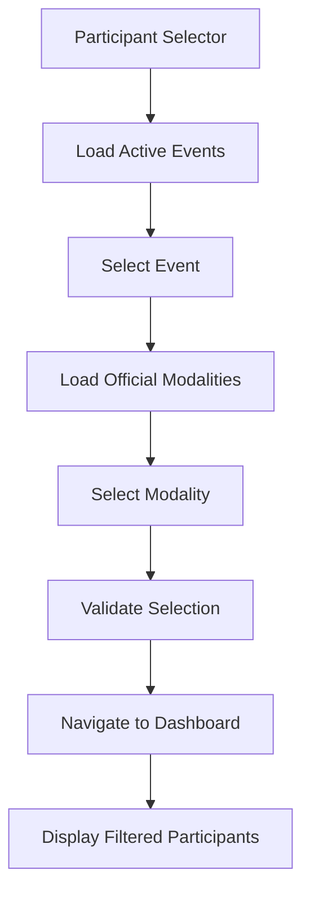

**Diagram sources**
- [frontend/src/pages/juez/Selector.tsx:51-82](file://frontend/src/pages/juez/Selector.tsx#L51-L82)
- [frontend/src/pages/juez/Dashboard.tsx:41-59](file://frontend/src/pages/juez/Dashboard.tsx#L41-L59)

The selector now includes comprehensive event filtering, official modality validation, and improved user feedback with error handling and loading states.

**Section sources**
- [frontend/src/pages/juez/Selector.tsx:33-208](file://frontend/src/pages/juez/Selector.tsx#L33-L208)
- [frontend/src/lib/judging.ts:1-17](file://frontend/src/lib/judging.ts#L1-L17)

### Real-Time Scoring Interface Enhancements

The judge scoring interface has been significantly enhanced with improved template rendering, real-time calculations, and better user experience.

**Updated** The interface now features:
- Real-time score calculation with immediate visual feedback
- Enhanced participant cards with completion status indicators
- Improved toast notifications for user actions
- Better error handling with contextual messages
- Enhanced navigation with back buttons and progress indicators
- Comprehensive section-based scoring summaries
- Fixed score range validation allowing minimum score of 0
- Improved categorization options with category assignment support
- Enhanced bonification section management for principal judges
- Draft/completed status management with automatic re-edit mode
- Partial score update functionality with real-time validation

**Section sources**
- [frontend/src/pages/juez/Dashboard.tsx:161-182](file://frontend/src/pages/juez/Dashboard.tsx#L161-L182)
- [frontend/src/pages/juez/Calificar.tsx:166-190](file://frontend/src/pages/juez/Calificar.tsx#L166-L190)
- [frontend/src/pages/juez/Calificar.tsx:558-573](file://frontend/src/pages/juez/Calificar.tsx#L558-L573)

### Comprehensive Results Reporting Interface

The results system provides detailed analytics and reporting capabilities for both judges and administrators with enhanced filtering and visualization.

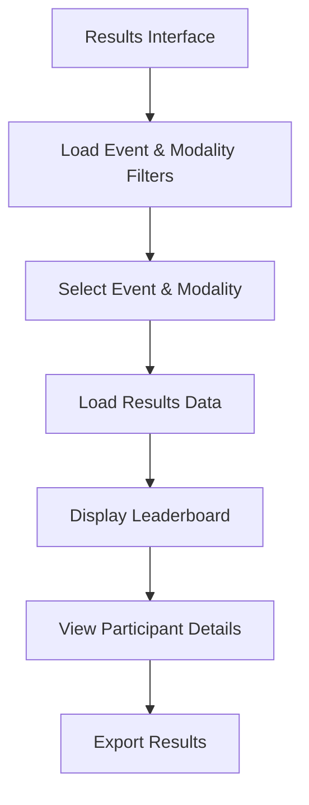

**Diagram sources**
- [frontend/src/pages/shared/Resultados.tsx:62-87](file://frontend/src/pages/shared/Resultados.tsx#L62-L87)
- [frontend/src/pages/shared/Resultados.tsx:169-249](file://frontend/src/pages/shared/Resultados.tsx#L169-L249)

The results interface includes comprehensive filtering capabilities, category-based leaderboards, and detailed participant score breakdowns with section-wise totals.

**Section sources**
- [frontend/src/pages/shared/Resultados.tsx:13-255](file://frontend/src/pages/shared/Resultados.tsx#L13-L255)

### Enhanced Navigation and Layout Components

The judge interface now includes comprehensive navigation patterns with improved layout components and consistent user experience across all judge pages.

**Updated** The navigation system now features:
- Enhanced JuezLayout with improved header navigation
- Consistent three-step workflow: Selector → Dashboard → Calificar
- Integrated regulation viewing with modal interface
- Responsive design patterns for mobile and desktop
- Enhanced breadcrumb navigation and progress indicators
- Improved accessibility with proper semantic markup
- Consistent styling patterns across all judge interface components

**Section sources**
- [frontend/src/pages/juez/JuezLayout.tsx:8-199](file://frontend/src/pages/juez/JuezLayout.tsx#L8-L199)
- [frontend/src/pages/juez/Reglamentos.tsx:15-173](file://frontend/src/pages/juez/Reglamentos.tsx#L15-L173)

## Data Flow Architecture

### Real-time Data Synchronization

The system implements efficient data flow patterns to ensure real-time updates and synchronization between judge interfaces and backend services.

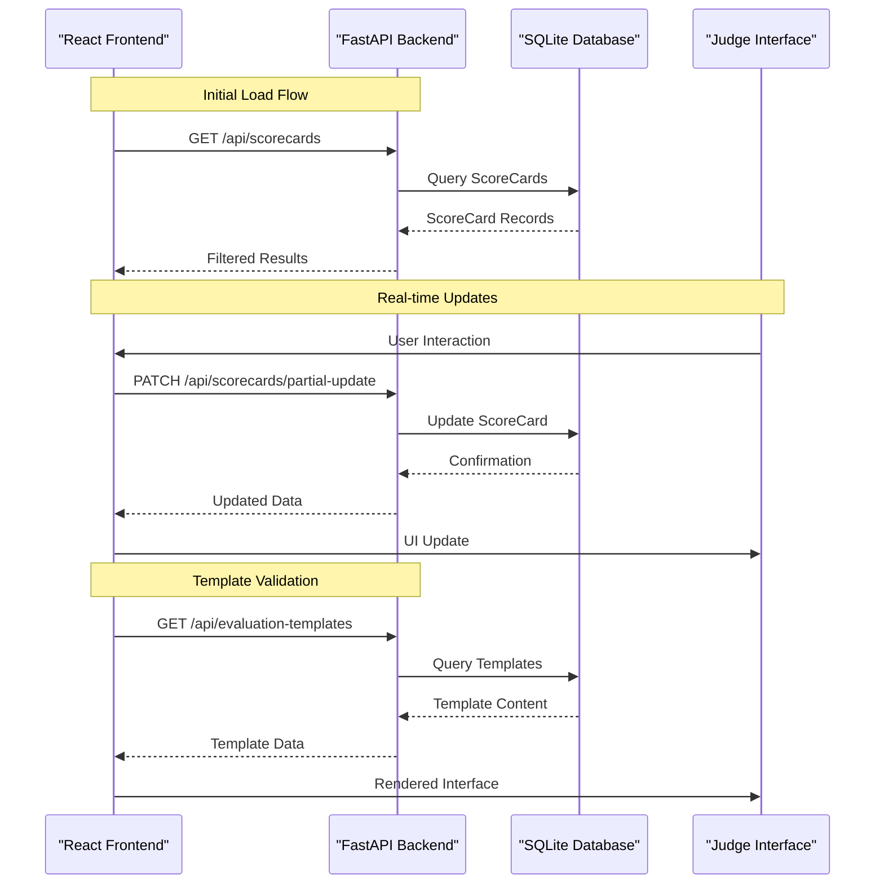

**Diagram sources**
- [frontend/src/pages/juez/Dashboard.tsx:41-59](file://frontend/src/pages/juez/Dashboard.tsx#L41-L59)
- [frontend/src/pages/juez/Calificar.tsx:333-344](file://frontend/src/pages/juez/Calificar.tsx#L333-L344)

The architecture ensures minimal latency through optimized API calls, efficient database queries, and intelligent caching strategies for template data.

**Section sources**
- [frontend/src/lib/api.ts:1-41](file://frontend/src/lib/api.ts#L1-L41)
- [routes/scorecards.py:422-442](file://routes/scorecards.py#L422-L442)

### Data Validation and Sanitization

Comprehensive validation ensures data integrity throughout the evaluation process.

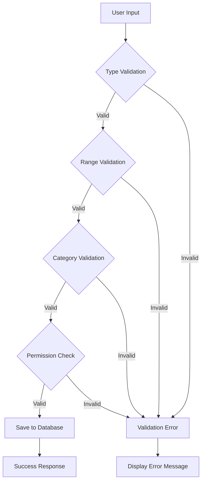

**Diagram sources**
- [routes/scorecards.py:207-316](file://routes/scorecards.py#L207-L316)
- [routes/scorecards.py:144-174](file://routes/scorecards.py#L144-L174)

The validation pipeline covers input sanitization, score range verification, category consistency checks, and permission enforcement to prevent data corruption and unauthorized modifications.

**Section sources**
- [routes/scorecards.py:318-352](file://routes/scorecards.py#L318-L352)
- [routes/scorecards.py:370-420](file://routes/scorecards.py#L370-L420)

## Security and Access Control

### Role-Based Authentication System

The system implements a robust role-based access control mechanism ensuring appropriate permissions for different user types.

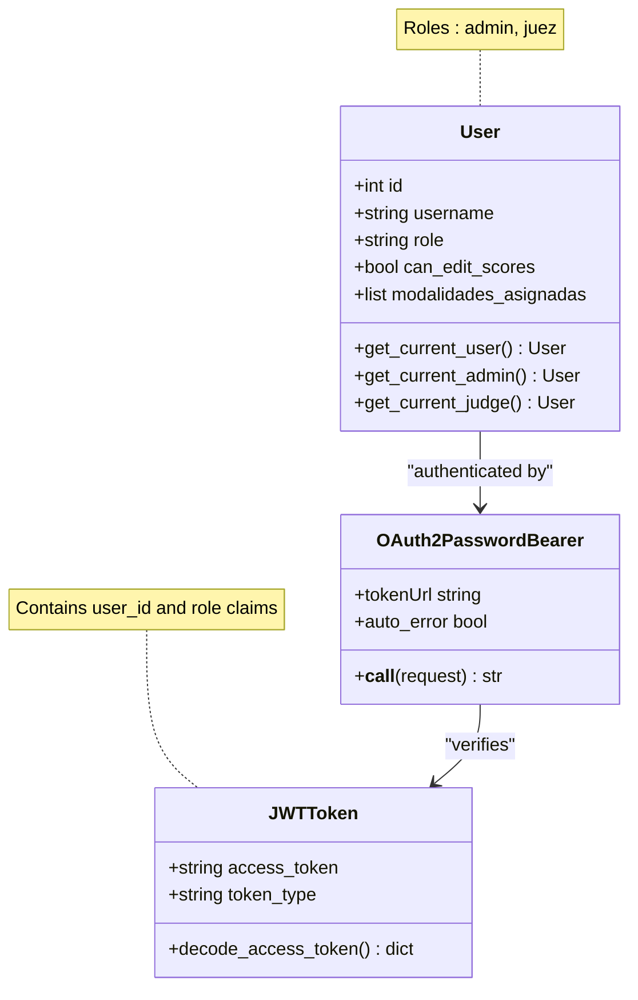

**Diagram sources**
- [utils/dependencies.py:16-71](file://utils/dependencies.py#L16-L71)
- [models.py:11-25](file://models.py#L11-L25)

The authentication system uses JWT tokens with role-based authorization, ensuring that only authorized users can access specific endpoints and perform privileged actions.

**Section sources**
- [utils/dependencies.py:32-47](file://utils/dependencies.py#L32-L47)
- [schemas.py:15-21](file://schemas.py#L15-L21)

### Judge Permission Management

Judge permissions are dynamically managed through assignment records that control access to specific evaluation sections.

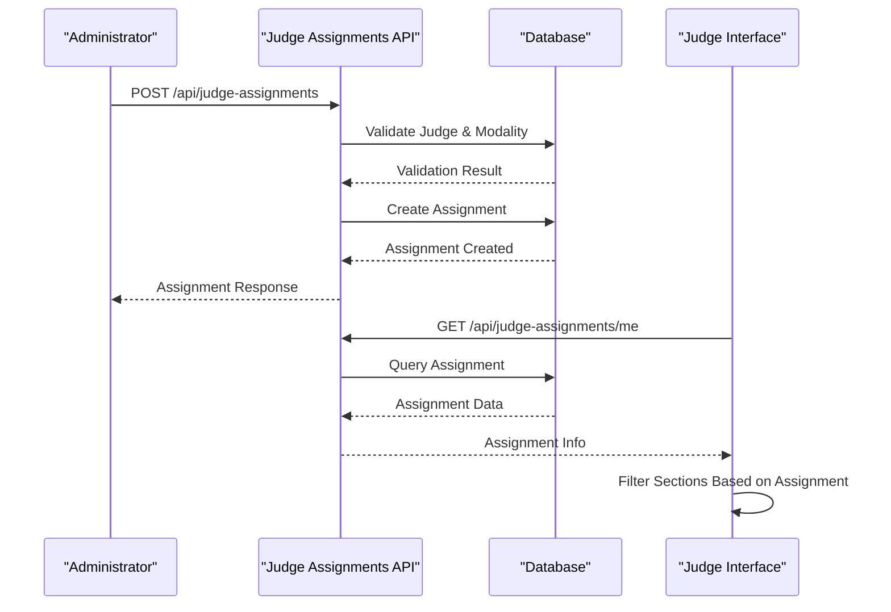

**Diagram sources**
- [routes/judge_assignments.py:164-280](file://routes/judge_assignments.py#L164-L280)
- [routes/judge_assignments.py:133-161](file://routes/judge_assignments.py#L133-L161)

The system automatically synchronizes judge permissions with their assigned modalities, ensuring real-time access control updates.

**Section sources**
- [routes/judge_assignments.py:69-81](file://routes/judge_assignments.py#L69-L81)
- [routes/judge_assignments.py:106-130](file://routes/judge_assignments.py#L106-L130)

## Template Management System

### Dynamic Template Architecture

The template system provides flexible evaluation frameworks that can be customized per competition modality.

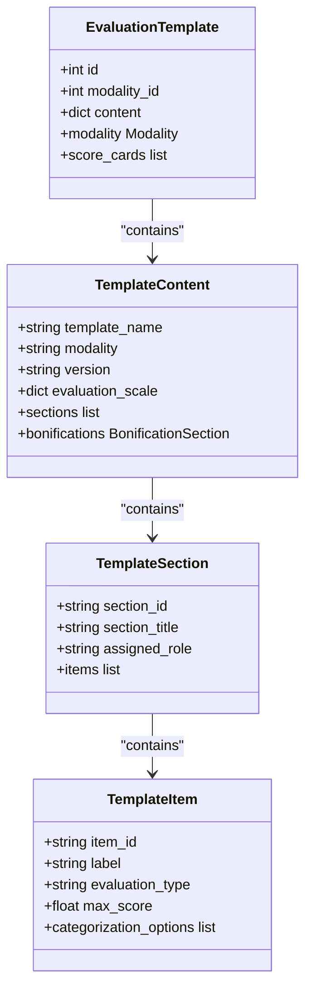

**Diagram sources**
- [models.py:115-128](file://models.py#L115-L128)
- [frontend/src/lib/judging.ts:71-90](file://frontend/src/lib/judging.ts#L71-L90)
- [frontend/src/lib/judging.ts:57-62](file://frontend/src/lib/judging.ts#L57-L62)

The template system supports both scored and categorization-only evaluation types, with configurable scoring scales and automatic category assignment based on evaluation results.

**Section sources**
- [frontend/src/pages/admin/EvaluationTemplateEditor.tsx:171-184](file://frontend/src/pages/admin/EvaluationTemplateEditor.tsx#L171-L184)
- [frontend/src/pages/admin/EvaluationTemplateEditor.tsx:330-357](file://frontend/src/pages/admin/EvaluationTemplateEditor.tsx#L330-L357)

### Template Editor Interface

The administrative template editor provides comprehensive tools for creating and modifying evaluation frameworks.

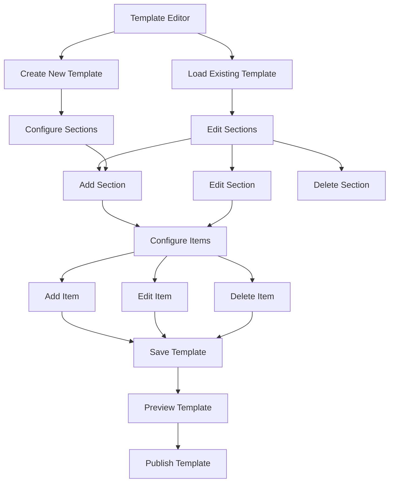

**Diagram sources**
- [frontend/src/pages/admin/EvaluationTemplateEditor.tsx:546-748](file://frontend/src/pages/admin/EvaluationTemplateEditor.tsx#L546-L748)
- [frontend/src/pages/admin/TemplatesList.tsx:73-252](file://frontend/src/pages/admin/TemplatesList.tsx#L73-L252)

The editor interface supports drag-and-drop section management, automatic ID generation for unique identifiers, and real-time template validation to prevent configuration errors.

**Section sources**
- [frontend/src/pages/admin/EvaluationTemplateEditor.tsx:698-748](file://frontend/src/pages/admin/EvaluationTemplateEditor.tsx#L698-L748)
- [frontend/src/pages/admin/TemplatesList.tsx:108-221](file://frontend/src/pages/admin/TemplatesList.tsx#L108-L221)

## Results and Scoring Engine

### Automated Category Assignment

The system automatically assigns participants to appropriate categories based on their evaluation performance and template configurations.

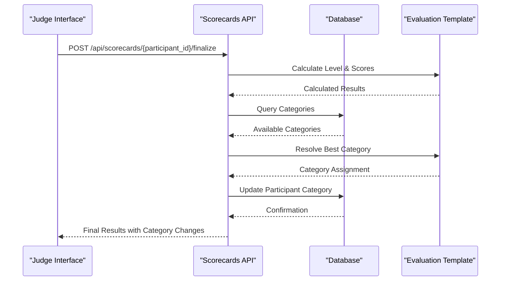

**Diagram sources**
- [routes/scorecards.py:535-607](file://routes/scorecards.py#L535-L607)
- [routes/scorecards.py:355-367](file://routes/scorecards.py#L355-L367)

The category assignment algorithm considers both calculated levels from evaluation scores and explicit category selections, ensuring accurate placement within the hierarchical category system.

**Section sources**
- [routes/scorecards.py:370-420](file://routes/scorecards.py#L370-L420)
- [routes/scorecards.py:610-724](file://routes/scorecards.py#L610-L724)

### Comprehensive Results Reporting

The results system provides detailed analytics and reporting capabilities for both judges and administrators.

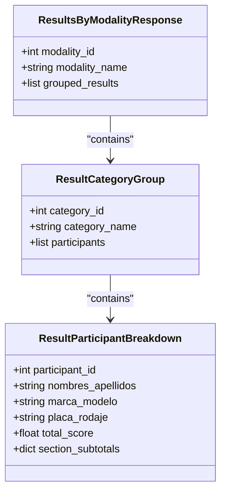

**Diagram sources**
- [schemas.py:261-265](file://schemas.py#L261-L265)
- [schemas.py:255-259](file://schemas.py#L255-L259)
- [schemas.py:246-253](file://schemas.py#L246-L253)

The reporting system organizes results by category hierarchy, provides section-wise score breakdowns, and maintains chronological ordering for fair competition outcomes.

**Section sources**
- [schemas.py:224-244](file://schemas.py#L224-L244)
- [routes/scorecards.py:610-724](file://routes/scorecards.py#L610-L724)

## Frontend Implementation Patterns

### React Component Architecture

The frontend follows modern React patterns with TypeScript for enhanced type safety and maintainability.

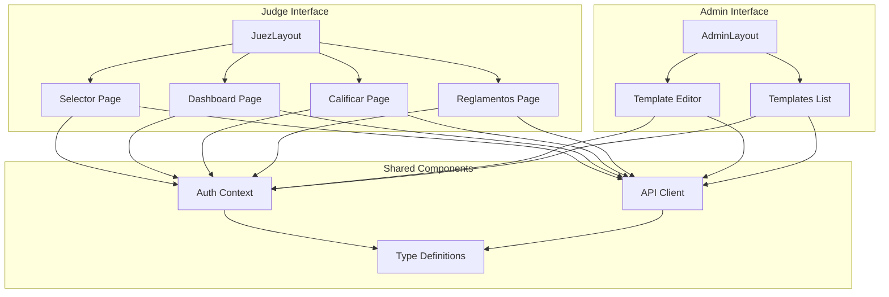

**Diagram sources**
- [frontend/src/pages/juez/JuezLayout.tsx:8-199](file://frontend/src/pages/juez/JuezLayout.tsx#L8-L199)
- [frontend/src/pages/admin/AdminLayout.tsx:25-252](file://frontend/src/pages/admin/AdminLayout.tsx#L25-L252)

Each interface maintains consistent navigation patterns, responsive design principles, and comprehensive error handling for optimal user experience.

**Section sources**
- [frontend/src/pages/juez/JuezLayout.tsx:65-128](file://frontend/src/pages/juez/JuezLayout.tsx#L65-L128)
- [frontend/src/pages/admin/AdminLayout.tsx:102-172](file://frontend/src/pages/admin/AdminLayout.tsx#L102-L172)

### State Management and Data Flow

The application implements centralized state management with automatic data synchronization and offline capability support.

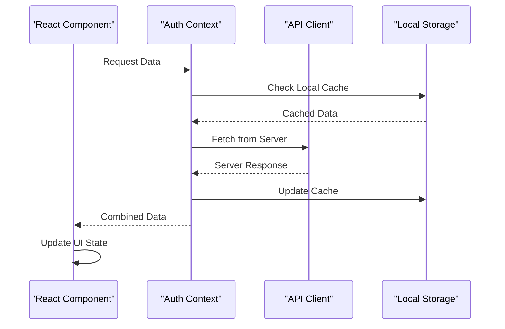

**Diagram sources**
- [frontend/src/contexts/AuthContext.tsx](file://frontend/src/contexts/AuthContext.tsx)
- [frontend/src/lib/api.ts:11-13](file://frontend/src/lib/api.ts#L11-L13)

The state management system ensures data consistency across component boundaries while providing fallback mechanisms for network failures.

**Section sources**
- [frontend/src/lib/api.ts:24-40](file://frontend/src/lib/api.ts#L24-L40)
- [frontend/src/pages/juez/Calificar.tsx:291-402](file://frontend/src/pages/juez/Calificar.tsx#L291-L402)

### Enhanced User Interface Patterns

The judge interface now includes comprehensive real-time feedback, improved navigation, and enhanced visual indicators for participant states and evaluation progress.

**Updated** The interface now features:
- Real-time score calculation with immediate visual feedback
- Enhanced participant cards with completion status indicators
- Improved toast notifications for user actions
- Better error handling with contextual messages
- Enhanced navigation with back buttons and progress indicators
- Comprehensive section-based scoring summaries
- Fixed score range validation allowing minimum score of 0
- Improved categorization options with category assignment support
- Enhanced bonification section management for principal judges
- Draft/completed status management with automatic re-edit mode
- Partial score update functionality with real-time validation

**Section sources**
- [frontend/src/pages/juez/Dashboard.tsx:161-182](file://frontend/src/pages/juez/Dashboard.tsx#L161-L182)
- [frontend/src/pages/juez/Calificar.tsx:166-190](file://frontend/src/pages/juez/Calificar.tsx#L166-L190)
- [frontend/src/pages/juez/Calificar.tsx:558-573](file://frontend/src/pages/juez/Calificar.tsx#L558-L573)

## Performance Considerations

### Database Optimization Strategies

The system employs several optimization techniques to ensure efficient data retrieval and storage operations.

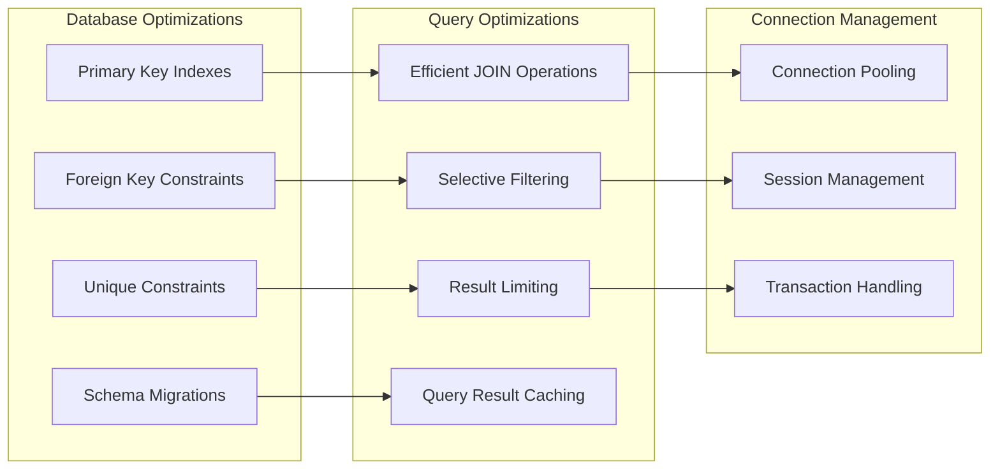

**Diagram sources**
- [database.py:36-193](file://database.py#L36-L193)
- [models.py:44-101](file://models.py#L44-L101)

The database layer implements comprehensive indexing strategies, foreign key constraints for data integrity, and automatic migration handling for schema evolution.

**Section sources**
- [database.py:28-34](file://database.py#L28-L34)
- [models.py:10-8](file://models.py#L10-L8)

### Frontend Performance Enhancements

The frontend implements various performance optimizations to ensure smooth user interactions and rapid data loading.

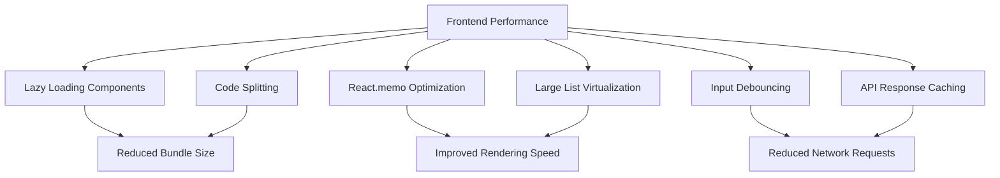

**Diagram sources**
- [frontend/src/pages/juez/Dashboard.tsx:23-26](file://frontend/src/pages/juez/Dashboard.tsx#L23-L26)
- [frontend/src/pages/juez/Calificar.tsx:278-289](file://frontend/src/pages/juez/Calificar.tsx#L278-L289)

The frontend architecture leverages React's built-in optimization features, implements efficient rendering strategies for large datasets, and minimizes bundle sizes through strategic code splitting.

**Section sources**
- [frontend/src/pages/juez/Dashboard.tsx:161-182](file://frontend/src/pages/juez/Dashboard.tsx#L161-L182)
- [frontend/src/pages/juez/Calificar.tsx:166-190](file://frontend/src/pages/juez/Calificar.tsx#L166-L190)

## Troubleshooting Guide

### Common Issues and Solutions

The system provides comprehensive error handling and user feedback mechanisms to address common operational challenges.

**Authentication and Authorization Issues**
- Verify JWT token validity and expiration
- Check user role permissions for requested endpoints
- Ensure proper bearer token formatting in API requests
- Confirm user account status and active permissions

**Template Configuration Problems**
- Validate template JSON structure and required fields
- Check section and item ID uniqueness requirements
- Verify evaluation type compatibility with scoring ranges
- Ensure category assignments align with template definitions

**Data Validation Errors**
- Review score ranges against template specifications
- Validate categorical selections against available options
- Check permission assignments for judge access control
- Confirm participant eligibility for target modalities

**Network Connectivity Issues**
- Verify API endpoint accessibility and response times
- Check CORS configuration for cross-origin requests
- Monitor database connection pooling and timeouts
- Validate static file serving for uploaded content

**Section sources**
- [utils/dependencies.py:50-71](file://utils/dependencies.py#L50-L71)
- [routes/scorecards.py:82-85](file://routes/scorecards.py#L82-L85)
- [frontend/src/lib/api.ts:24-40](file://frontend/src/lib/api.ts#L24-L40)

### Debugging Tools and Techniques

The development environment includes comprehensive debugging capabilities for identifying and resolving system issues efficiently.

**API Endpoint Testing**
- Utilize built-in health check endpoints for system monitoring
- Test individual API endpoints with curl or Postman for detailed response analysis
- Monitor request/response timing and error codes for performance diagnostics
- Validate data serialization and deserialization accuracy

**Database Query Analysis**
- Enable SQL logging for query performance monitoring
- Analyze query execution plans for optimization opportunities
- Monitor connection pool utilization and timeout patterns
- Track schema migration progress and potential conflicts

**Frontend Debugging**
- Leverage browser developer tools for network request inspection
- Monitor React component rendering and state updates
- Validate TypeScript compilation and type checking results
- Test responsive design across different viewport sizes and devices

**Section sources**
- [main.py:50-53](file://main.py#L50-L53)
- [database.py:36-57](file://database.py#L36-L57)
- [frontend/src/pages/juez/Calificar.tsx:394-402](file://frontend/src/pages/juez/Calificar.tsx#L394-L402)

## Conclusion

The Enhanced Judge Interfaces system represents a sophisticated solution for automotive competition management, combining modern web technologies with robust backend services to deliver an exceptional user experience for both judges and administrators.

The system's strength lies in its comprehensive role-based architecture, flexible template management, and collaborative evaluation capabilities. Through careful attention to security, performance, and user experience, the platform successfully addresses the complex requirements of competitive automotive judging environments.

Key achievements include seamless judge assignment management, automated category assignment based on evaluation performance, comprehensive results reporting, and intuitive administrative tools for template creation and management. The system's modular architecture ensures maintainability and extensibility for future enhancements.

Recent enhancements focus on improving the judge experience with:
- Enhanced dashboard navigation with real-time progress tracking
- Improved participant selector with filtering capabilities
- Collaborative evaluation interface with real-time scoring and categorization
- Comprehensive toast notifications and visual feedback
- Better error handling and user guidance
- Significantly enhanced judge scoring interface with improved template rendering, real-time calculations, and better user experience
- New partial score update functionality with draft/completed status management
- Enhanced finalization workflows with automated result calculations and category assignments
- Improved scorecard management with comprehensive validation and audit trails
- Comprehensive results reporting interface for judges and administrators
- Enhanced navigation structure with improved layout components and routing

Future development opportunities include expanding support for additional competition modalities, implementing advanced analytics and reporting features, enhancing mobile responsiveness, and integrating with external scoring systems for real-time results publication.

The platform stands as a testament to thoughtful software engineering, providing a solid foundation for digital competition management in specialized domains like automotive tuning and car audio competitions.