# Enhanced Participant Management

<cite>
**Referenced Files in This Document**
- [main.py](file://main.py)
- [models.py](file://models.py)
- [schemas.py](file://schemas.py)
- [database.py](file://database.py)
- [routes/participants.py](file://routes/participants.py)
- [routes/events.py](file://routes/events.py)
- [routes/modalities.py](file://routes/modalities.py)
- [routes/categories.py](file://routes/categories.py)
- [routes/auth.py](file://routes/auth.py)
- [utils/dependencies.py](file://utils/dependencies.py)
- [utils/security.py](file://utils/security.py)
- [frontend/src/pages/admin/Participantes.tsx](file://frontend/src/pages/admin/Participantes.tsx)
- [frontend/src/pages/admin/Copia de Participantes.tsx](file://frontend/src/pages/admin/Copia de Participantes.tsx)
- [frontend/src/pages/admin/Categorias.tsx](file://frontend/src/pages/admin/Categorias.tsx)
- [frontend/src/lib/api.ts](file://frontend/src/lib/api.ts)
- [frontend/src/contexts/AuthContext.tsx](file://frontend/src/contexts/AuthContext.tsx)
- [frontend/src/index.css](file://frontend/src/index.css)
- [requirements.txt](file://requirements.txt)
</cite>

## Update Summary
**Changes Made**
- Enhanced participant filtering system with comprehensive real-time search across multiple fields (name, DNI, plate number, vehicle make/model)
- Improved status tracking for participant records with score card integration and status management
- Added batch operations support for bulk participant management actions
- Enhanced event context management with prominent event selection dropdown for better participant filtering
- Improved participant editing capabilities with better validation and comprehensive error handling
- Enhanced multi-modalidad support with dynamic category assignment and improved participant categorization
- Added comprehensive search functionality with real-time filtering across multiple fields
- Improved form handling with enhanced validation and user feedback mechanisms
- Enhanced data import system with intelligent column detection, duplicate prevention, and detailed error reporting

## Table of Contents
1. [Introduction](#introduction)
2. [System Architecture](#system-architecture)
3. [Core Components](#core-components)
4. [Database Design](#database-design)
5. [API Endpoints](#api-endpoints)
6. [Frontend Implementation](#frontend-implementation)
7. [Security Model](#security-model)
8. [Data Import System](#data-import-system)
9. [Category Management System](#category-management-system)
10. [Multi-Modalidad Support](#multi-modalidad-support)
11. [Status Tracking System](#status-tracking-system)
12. [Performance Considerations](#performance-considerations)
13. [Troubleshooting Guide](#troubleshooting-guide)
14. [Conclusion](#conclusion)

## Introduction

The Enhanced Participant Management system is a comprehensive web application designed for managing automotive competition participants with advanced features for bulk data import, real-time validation, and role-based access control. Built with FastAPI backend and React frontend, the system provides administrators with powerful tools to manage participant registration, categorization, and scoring workflows.

The system addresses the complex requirements of automotive judging competitions by providing:
- Hierarchical category management (Modalities → Categories → Subcategories)
- Multi-modal participant categorization with category assignments
- Bulk Excel import with intelligent column mapping and validation
- Real-time duplicate detection and validation
- Role-based permissions (Admin vs Judge)
- Comprehensive participant lifecycle management
- Integration with scoring and regulation systems
- Enhanced event context management with prominent event selection dropdown
- Advanced multi-modalidad support enabling participants to compete in multiple categories simultaneously
- Improved form handling with comprehensive validation and user feedback mechanisms
- Enhanced search functionality with real-time filtering across multiple fields
- Touch-friendly interface optimized for mobile and tablet devices
- Comprehensive error handling and user feedback mechanisms
- Status tracking system for participant records with score card integration
- Batch operations support for efficient participant management
- Enhanced filtering capabilities with comprehensive search across multiple fields

The interface has been significantly enhanced with improved filtering, sorting, and batch operations capabilities, providing administrators with more efficient participant management tools. The system now supports comprehensive Excel import with intelligent column detection and validation, ensuring data integrity and reducing manual entry errors. The multi-modalidad system allows participants to compete in multiple categories simultaneously, with dynamic assignment capabilities that enable complex competition scenarios.

**Updated** The recent enhancements significantly improve participant editing capabilities with better validation, comprehensive error handling, and enhanced user feedback mechanisms. The system now provides more robust data validation with intelligent column detection, duplicate prevention, and detailed error reporting for both manual and bulk operations. The status tracking system integrates with score cards to provide comprehensive participant lifecycle management.

## System Architecture

The application follows a modern layered architecture pattern with clear separation of concerns:

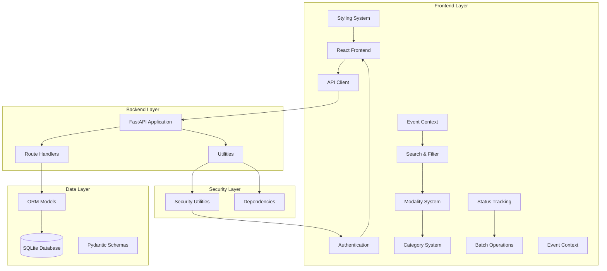

**Diagram sources**
- [main.py:26-44](file://main.py#L26-L44)
- [routes/participants.py:21](file://routes/participants.py#L21)
- [models.py:11](file://models.py#L11)
- [frontend/src/contexts/AuthContext.tsx:66-132](file://frontend/src/contexts/AuthContext.tsx#L66-L132)

The architecture ensures scalability and maintainability through:
- Clean separation between frontend and backend
- Strong typing with Pydantic schemas
- SQLAlchemy ORM for database abstraction
- Modular route organization
- Centralized security utilities
- Responsive design system with Tailwind CSS
- Enhanced event context management for participant filtering
- Advanced multi-modalidad system for flexible categorization
- Real-time search and filtering capabilities
- Comprehensive category management system with hierarchical relationships
- Status tracking integration with score card management
- Batch operations support for efficient participant management

**Section sources**
- [main.py:1-53](file://main.py#L1-L53)
- [requirements.txt:1-10](file://requirements.txt#L1-L10)

## Core Components

### Backend Foundation

The FastAPI application serves as the central orchestrator, providing CORS support, static file serving, and comprehensive routing:

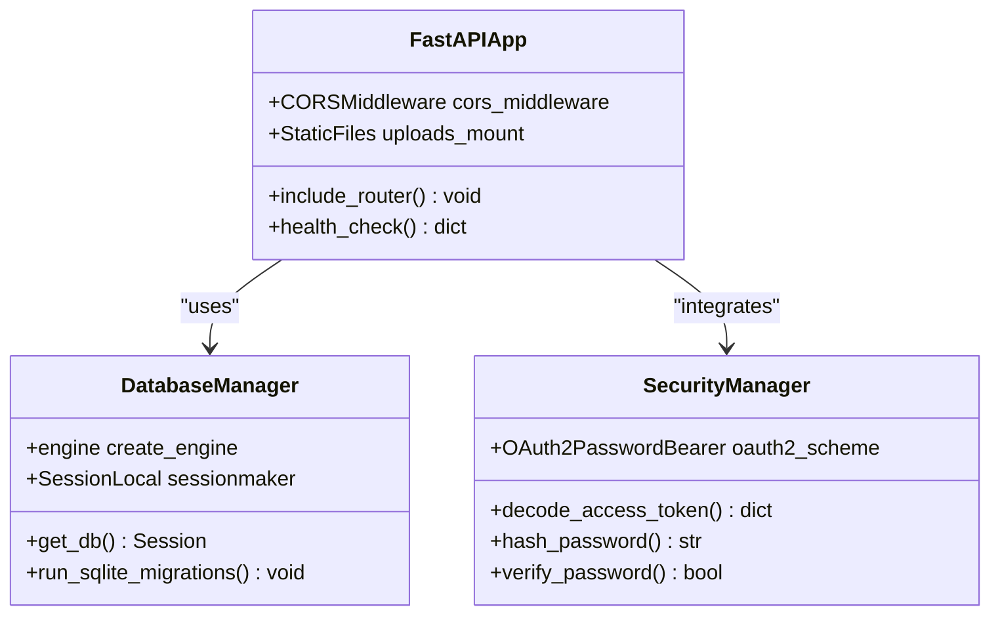

**Diagram sources**
- [main.py:26-47](file://main.py#L26-L47)
- [database.py:28-34](file://database.py#L28-L34)
- [utils/security.py:41-53](file://utils/security.py#L41-L53)

### Data Models Architecture

The system employs a comprehensive entity relationship model supporting complex participant management scenarios:

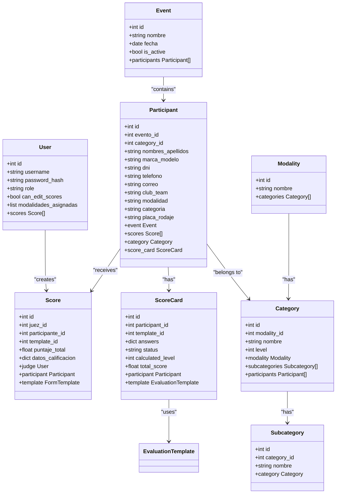

**Diagram sources**
- [models.py:11-225](file://models.py#L11-L225)

**Section sources**
- [models.py:1-225](file://models.py#L1-L225)
- [schemas.py:1-298](file://schemas.py#L1-L298)

## Database Design

The database schema supports complex participant management with comprehensive constraints and relationships:

### Core Entity Relationships

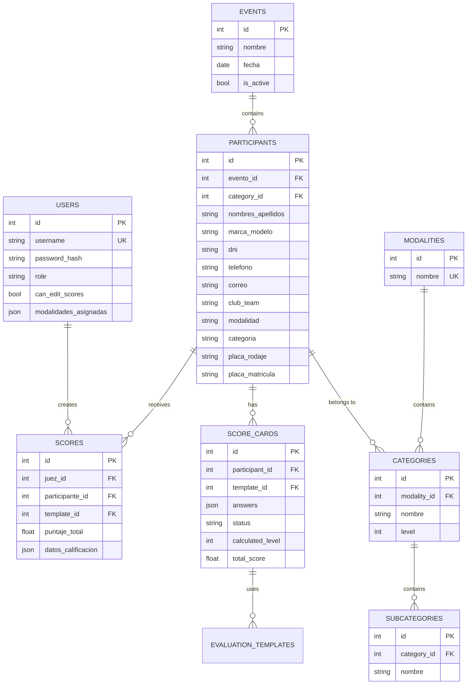

**Diagram sources**
- [models.py:11-225](file://models.py#L11-L225)

### Advanced Constraints and Indexes

The database implementation includes sophisticated constraints for data integrity:

- **Unique Constraints**: Prevents duplicate participant registrations within events
- **Foreign Key Relationships**: Maintains referential integrity across entities
- **Category Level System**: Supports hierarchical categorization with level-based progression
- **Index Optimization**: Speeds up common query patterns
- **Legacy Migration Support**: Handles database evolution gracefully
- **Multi-Modalidad Support**: Enables flexible participant categorization
- **Category Assignment**: Links participants to specific categories with foreign keys
- **Status Tracking**: Integrates with score cards for comprehensive participant lifecycle management
- **Batch Operations**: Supports efficient bulk participant management operations

**Section sources**
- [database.py:36-193](file://database.py#L36-L193)
- [models.py:40-42](file://models.py#L40-L42)

## API Endpoints

The system provides a comprehensive REST API with role-based access control:

### Participant Management Endpoints

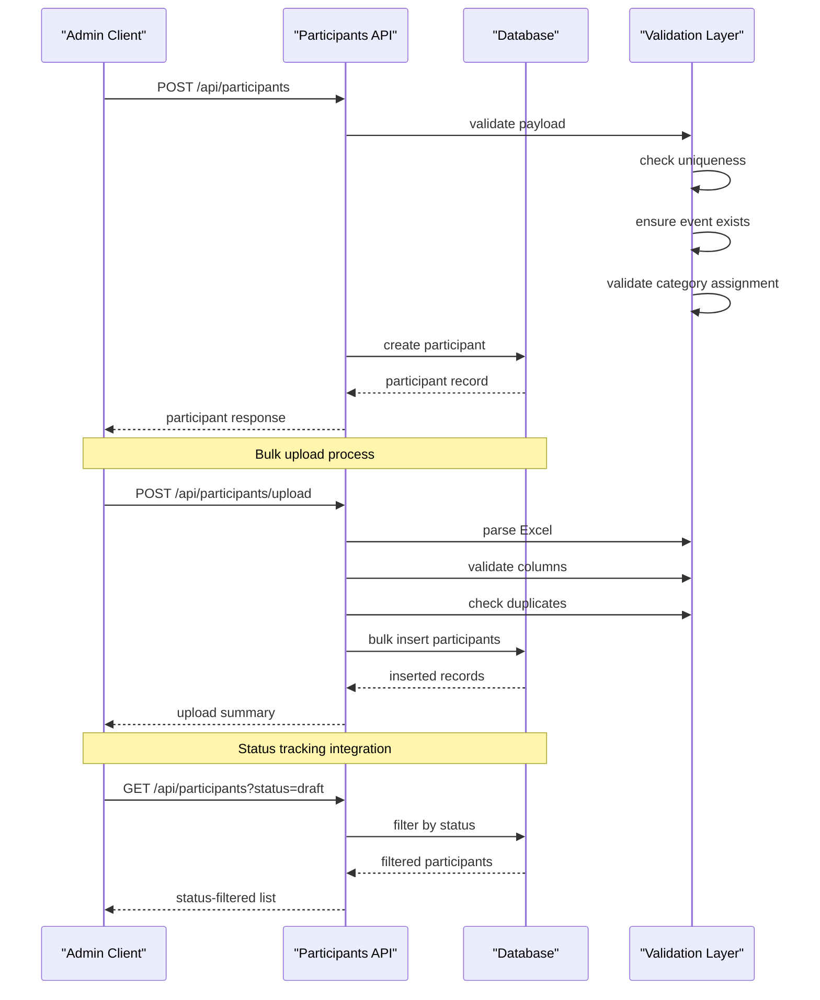

**Diagram sources**
- [routes/participants.py:181-200](file://routes/participants.py#L181-L200)
- [routes/participants.py:316-329](file://routes/participants.py#L316-L329)

### Category Management Endpoints

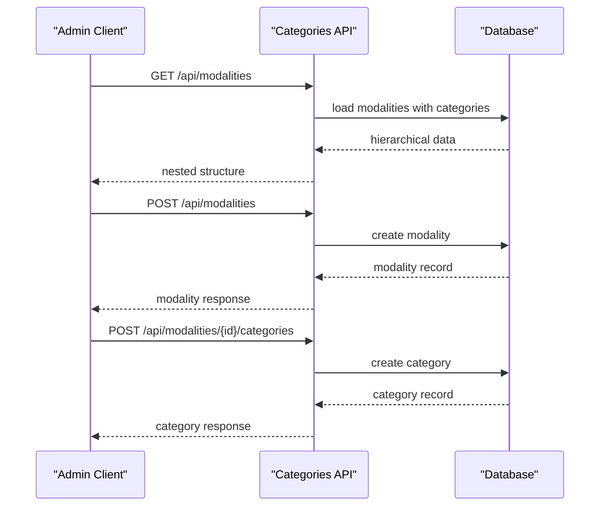

**Diagram sources**
- [routes/categories.py:12-24](file://routes/categories.py#L12-L24)
- [routes/categories.py:27-45](file://routes/categories.py#L27-L45)
- [routes/categories.py:48-89](file://routes/categories.py#L48-L89)

### Authentication Flow

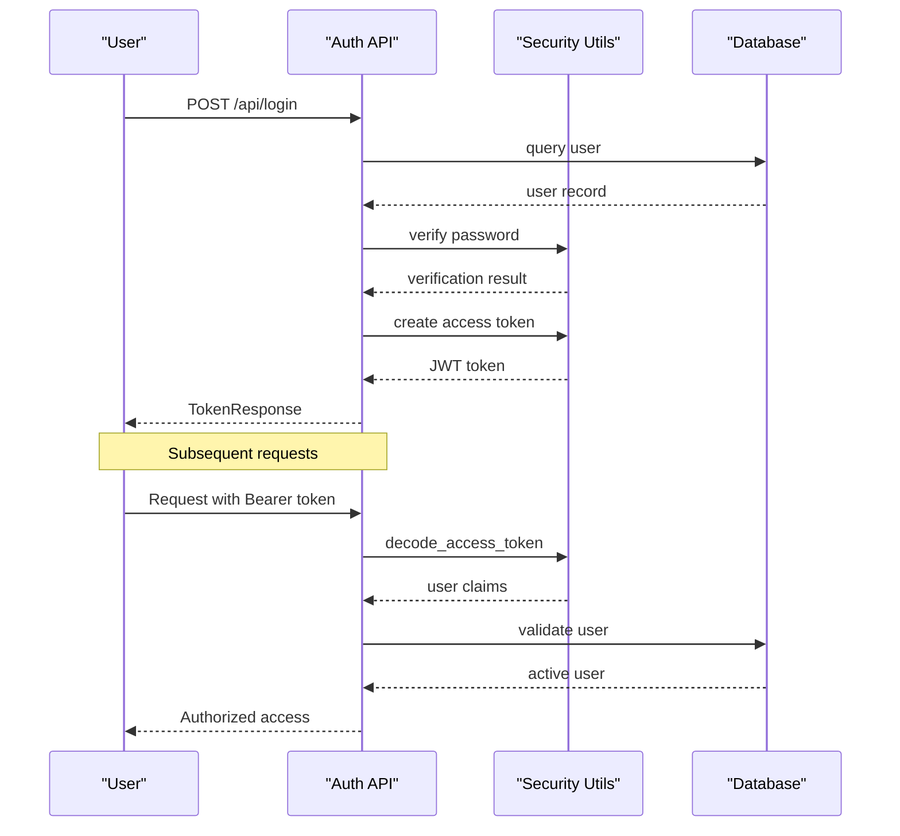

**Diagram sources**
- [routes/auth.py:13-35](file://routes/auth.py#L13-L35)
- [utils/dependencies.py:16-38](file://utils/dependencies.py#L16-L38)

**Section sources**
- [routes/participants.py:1-447](file://routes/participants.py#L1-L447)
- [routes/categories.py:1-128](file://routes/categories.py#L1-L128)
- [routes/auth.py:1-36](file://routes/auth.py#L1-L36)

## Frontend Implementation

The React frontend provides an intuitive interface for participant management with comprehensive form handling, real-time validation, and advanced filtering capabilities.

### Main Participant Management Page

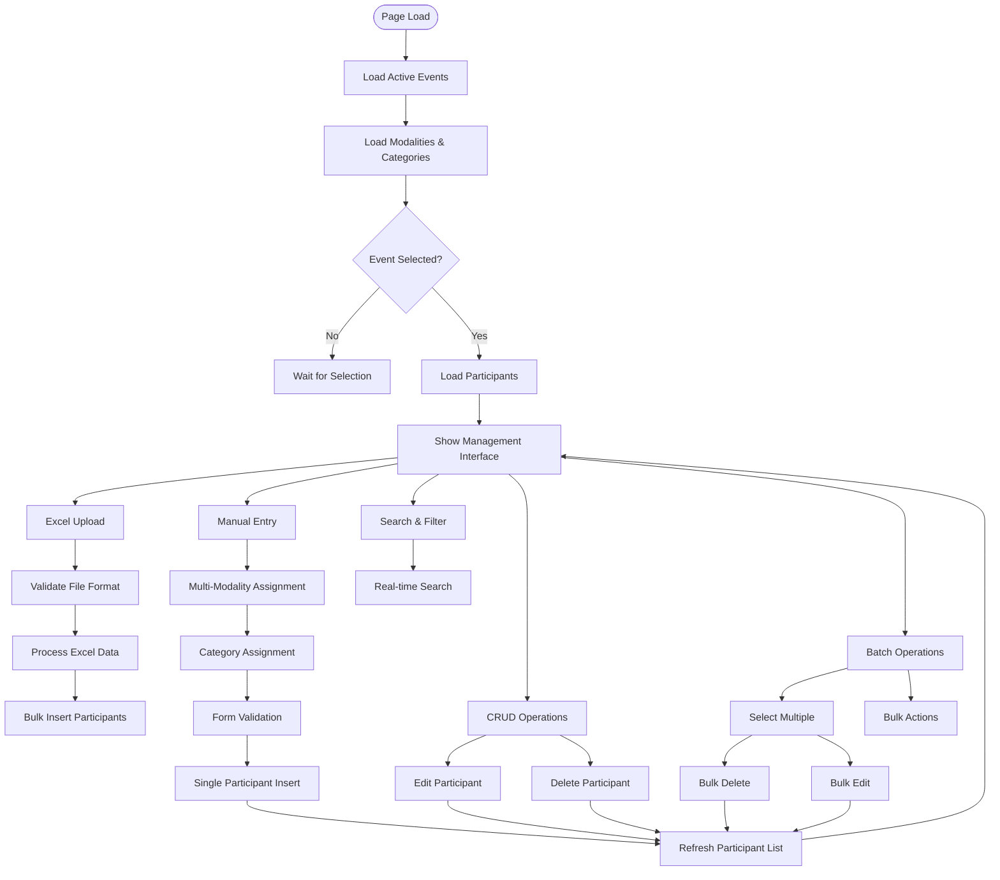

**Diagram sources**
- [frontend/src/pages/admin/Participantes.tsx:107-163](file://frontend/src/pages/admin/Participantes.tsx#L107-L163)
- [frontend/src/pages/admin/Participantes.tsx:172-210](file://frontend/src/pages/admin/Participantes.tsx#L172-L210)
- [frontend/src/pages/admin/Participantes.tsx:404-414](file://frontend/src/pages/admin/Participantes.tsx#L404-L414)

### Category Management Interface

The frontend includes a comprehensive category management system:

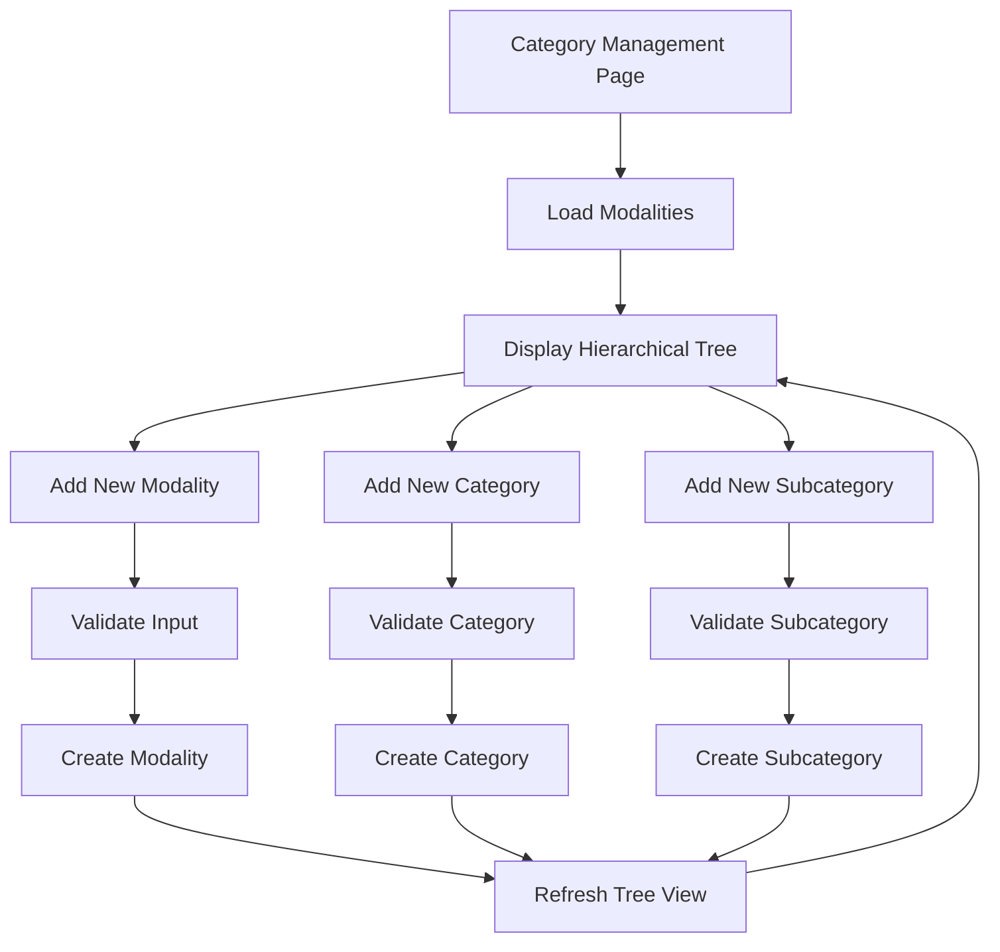

**Diagram sources**
- [frontend/src/pages/admin/Categorias.tsx:208-331](file://frontend/src/pages/admin/Categorias.tsx#L208-L331)

### Advanced Features

The frontend implementation includes several sophisticated features:

- **Intelligent Column Mapping**: Automatically detects Excel column names with support for multiple aliases
- **Real-time Validation**: Client-side validation with immediate feedback
- **Bulk Operation Support**: Efficient handling of large datasets with batch selection
- **Enhanced Filtering**: Comprehensive search functionality across multiple participant fields
- **Responsive Design**: Optimized for various screen sizes and devices
- **Event Context Management**: Context-aware participant management with prominent event selection
- **Multi-Modalidad System**: Advanced categorization with dynamic assignment
- **Category Assignment**: Hierarchical category management with level-based progression
- **Touch-Friendly Interface**: Optimized touch controls for mobile and tablet devices
- **Multi-Modality Assignment**: Ability to assign participants to multiple modalities and categories
- **Improved Form Handling**: Better validation and user feedback mechanisms
- **Event Selection Dropdown**: Enhanced event context management with dedicated selector
- **Real-time Search**: Comprehensive filtering across name, DNI, plate number, and vehicle make/model
- **Enhanced Error Handling**: Comprehensive error messages and user feedback
- **Improved UI/UX**: Better visual design and user experience
- **Status Tracking Display**: Visual indicators for participant status and score card completion
- **Batch Operations Interface**: Efficient management of multiple participant actions

The interface now includes comprehensive filtering capabilities that allow searching by name, DNI, plate number, and vehicle make/model in real-time. The batch operations system enables administrators to select multiple participants for bulk actions like deletion or editing. The multi-modalidad support allows participants to compete in multiple categories simultaneously, with dynamic assignment capabilities. The form handling has been enhanced with better validation and user feedback mechanisms.

**Updated** The participant editing capabilities have been significantly improved with enhanced validation, comprehensive error handling, and better user feedback mechanisms. The system now provides real-time validation during editing with immediate error feedback and improved form state management. The status tracking system integrates with score cards to provide comprehensive participant lifecycle management with visual status indicators.

**Section sources**
- [frontend/src/pages/admin/Participantes.tsx:1-798](file://frontend/src/pages/admin/Participantes.tsx#L1-L798)
- [frontend/src/pages/admin/Categorias.tsx:1-337](file://frontend/src/pages/admin/Categorias.tsx#L1-L337)
- [frontend/src/lib/api.ts:1-41](file://frontend/src/lib/api.ts#L1-L41)
- [frontend/src/contexts/AuthContext.tsx:1-144](file://frontend/src/contexts/AuthContext.tsx#L1-L144)
- [frontend/src/index.css:35-51](file://frontend/src/index.css#L35-L51)

## Security Model

The system implements a robust security framework with role-based access control and comprehensive authentication:

### Role-Based Access Control

```mermaid
graph LR
subgraph "User Roles"
ADMIN[Administrator]
JUDGE[Judge]
end
subgraph "Protected Operations"
ADMIN_OPS[Admin Operations]
JUDGE_OPS[Judge Operations]
end
subgraph "Access Control Matrix"
ADMIN --> ADMIN_OPS
ADMIN --> JUDGE_OPS
JUDGE --> JUDGE_OPS
JUDGE -.-> ADMIN_OPS
end
subgraph "Permissions"
CREATE_PARTICIPANT[Create Participants]
UPDATE_PARTICIPANT[Update Participants]
DELETE_PARTICIPANT[Delete Participants]
VIEW_PARTICIPANT[View Participants]
EDIT_SCORES[Edit Scores]
MANAGE_MODALITIES[Manage Modalities]
MANAGE_CATEGORIES[Manage Categories]
END
ADMIN_OPS --> CREATE_PARTICIPANT
ADMIN_OPS --> UPDATE_PARTICIPANT
ADMIN_OPS --> DELETE_PARTICIPANT
ADMIN_OPS --> VIEW_PARTICIPANT
ADMIN_OPS --> EDIT_SCORES
ADMIN_OPS --> MANAGE_MODALITIES
ADMIN_OPS --> MANAGE_CATEGORIES
JUDGE_OPS --> VIEW_PARTICIPANT
JUDGE_OPS --> EDIT_SCORES
```

**Diagram sources**
- [utils/dependencies.py:32-47](file://utils/dependencies.py#L32-L47)
- [routes/participants.py:202-242](file://routes/participants.py#L202-L242)

### Authentication Flow

The authentication system provides secure access management:

- **JWT Token Generation**: Secure token creation with expiration
- **Password Hashing**: bcrypt-based password protection
- **Token Validation**: Comprehensive token verification
- **Role Verification**: Dynamic permission checking
- **Event Context Validation**: Ensures proper event context for operations
- **Category Management Permissions**: Restricts category operations to administrators
- **Judge Assignment Validation**: Ensures judges can only access assigned modalities

**Section sources**
- [utils/dependencies.py:1-71](file://utils/dependencies.py#L1-L71)
- [utils/security.py:1-54](file://utils/security.py#L1-L54)

## Data Import System

The system provides sophisticated bulk data import capabilities with intelligent column mapping and validation:

### Excel Import Processing

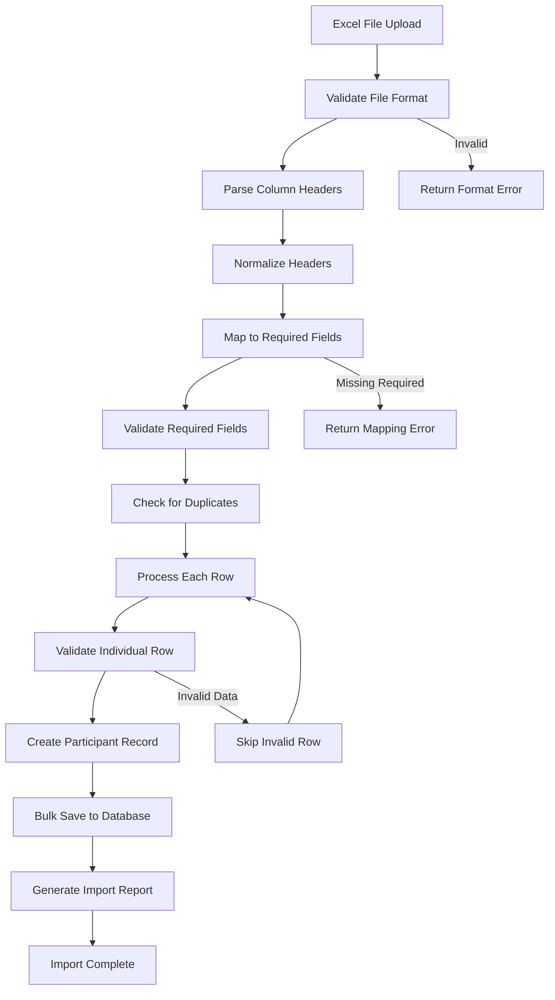

**Diagram sources**
- [routes/participants.py:316-447](file://routes/participants.py#L316-L447)
- [routes/participants.py:70-106](file://routes/participants.py#L70-L106)

### Column Mapping System

The import system supports flexible column naming with comprehensive alias support:

- **Required Fields**: Intelligent detection of essential participant information
- **Optional Fields**: Flexible handling of additional participant details
- **Legacy Support**: Backward compatibility with existing data formats
- **Duplicate Prevention**: Real-time detection of duplicate entries
- **Event Context**: Automatic assignment to selected event during import
- **Category Validation**: Ensures category assignments are valid and exist

The Excel import system now includes comprehensive validation with intelligent column detection, supporting multiple aliases for each field. The system automatically validates data integrity, checks for duplicates, and provides detailed error reporting for skipped rows. The enhanced form handling ensures better user feedback and validation during the import process.

**Updated** The data import system has been enhanced with improved column mapping, better duplicate detection, and more comprehensive error reporting. The system now provides detailed feedback on skipped rows with specific reasons for validation failures. The status tracking integration ensures imported participants are properly initialized with appropriate status values.

**Section sources**
- [routes/participants.py:23-61](file://routes/participants.py#L23-L61)
- [routes/participants.py:316-447](file://routes/participants.py#L316-L447)

## Category Management System

The system provides comprehensive category management with hierarchical relationships:

### Category Architecture

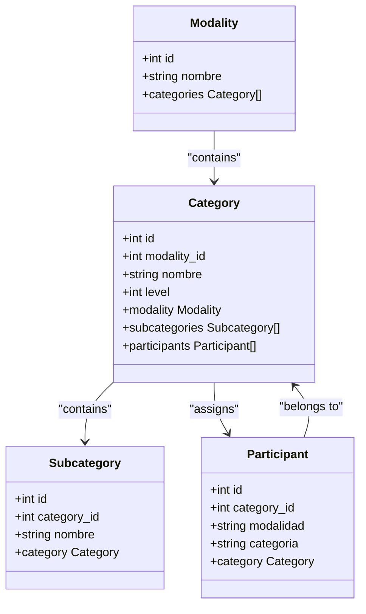

**Diagram sources**
- [models.py:195-225](file://models.py#L195-L225)
- [routes/modalities.py:19-33](file://routes/modalities.py#L19-L33)

### Category Management Features

The category management system includes:

- **Hierarchical Structure**: Modalities → Categories → Subcategories
- **Level-Based Progression**: Support for different competition levels (Intro, Amateurs, Pro, Master)
- **Category Assignment**: Participants can be assigned to specific categories
- **Cascade Operations**: Deleting categories removes subcategories and participants
- **Validation**: Ensures category assignments are valid and exist
- **Nested Loading**: Frontend loads categories with subcategories for display

The category system allows for complex competition structures with multiple levels and progressive difficulty. Participants can be assigned to categories based on skill level, experience, or competition requirements. The hierarchical structure enables administrators to organize competitions in a logical and scalable manner.

**Section sources**
- [routes/modalities.py:1-196](file://routes/modalities.py#L1-L196)
- [routes/categories.py:1-128](file://routes/categories.py#L1-L128)
- [frontend/src/pages/admin/Categorias.tsx:1-337](file://frontend/src/pages/admin/Categorias.tsx#L1-L337)

## Multi-Modalidad Support

The system provides comprehensive multi-modalidad support enabling participants to compete in multiple categories simultaneously:

### Multi-Modalidad Architecture

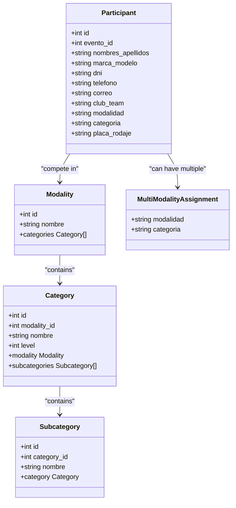

**Diagram sources**
- [models.py:113-153](file://models.py#L113-L153)
- [routes/modalities.py:19-33](file://routes/modalities.py#L19-L33)

### Multi-Modality Assignment System

The frontend provides advanced multi-modalidad assignment capabilities:

- **Dynamic Assignment**: Ability to add multiple modalities and categories to a single participant
- **Real-time Validation**: Prevents duplicate assignments and validates combinations
- **Flexible Display**: Shows all modalities and categories in a user-friendly format
- **Event Context**: Ensures assignments are valid for the selected event
- **Batch Operations**: Supports multi-modalidad in bulk operations
- **Category Validation**: Ensures category assignments are valid and exist

The multi-modalidad system allows participants to compete in multiple categories simultaneously, with dynamic assignment capabilities that enable complex competition scenarios. The system validates modalidad-category combinations and prevents duplicate assignments. The enhanced form handling provides better user experience with improved validation and feedback mechanisms.

**Section sources**
- [routes/modalities.py:1-196](file://routes/modalities.py#L1-L196)
- [frontend/src/pages/admin/Participantes.tsx:216-248](file://frontend/src/pages/admin/Participantes.tsx#L216-L248)

## Status Tracking System

The system provides comprehensive status tracking for participant records with integration to the score card management system:

### Status Tracking Architecture

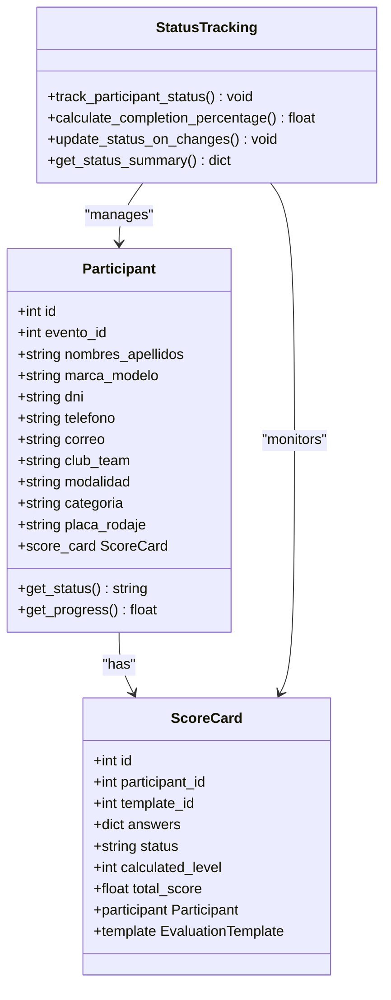

**Diagram sources**
- [models.py:147-163](file://models.py#L147-L163)
- [routes/participants.py:290-330](file://routes/participants.py#L290-L330)

### Status Tracking Features

The status tracking system includes:

- **Automatic Status Calculation**: Real-time status updates based on score card completion
- **Progress Monitoring**: Visual progress indicators for participant score card completion
- **Status Filtering**: Ability to filter participants by status (draft, submitted, finalized)
- **Integration with Score Cards**: Seamless integration with the scoring system
- **Completion Percentage**: Calculates and displays completion percentage for each participant
- **Status Summary**: Provides overview of participant status distribution
- **Audit Trail**: Tracks status changes and updates over time

The status tracking system provides comprehensive monitoring of participant participation and score card completion. It integrates seamlessly with the scoring system to provide real-time status updates and progress tracking.

**Section sources**
- [models.py:147-163](file://models.py#L147-L163)
- [routes/participants.py:290-330](file://routes/participants.py#L290-L330)

## Performance Considerations

The system is optimized for performance across multiple dimensions:

### Database Optimization

- **Connection Pooling**: Efficient database connection management
- **Query Optimization**: Indexed queries for common operations
- **Bulk Operations**: Optimized bulk insert for large datasets
- **Memory Management**: Efficient handling of large Excel files
- **Multi-Modalidad Queries**: Optimized queries for complex participant data
- **Category Joins**: Efficient hierarchical category loading with joinedloads
- **Unique Constraints**: Optimized duplicate detection and prevention
- **Status Tracking Queries**: Optimized queries for status-based filtering
- **Batch Operation Support**: Efficient handling of multiple participant operations

### Frontend Performance

- **Lazy Loading**: Component lazy loading for improved initial load times
- **Virtual Scrolling**: Efficient rendering of large participant lists
- **Debounced Search**: Optimized search functionality
- **State Management**: Efficient state updates and re-renders
- **Event Context Caching**: Cached event and modalities data for faster navigation
- **Category Tree Caching**: Efficient handling of hierarchical category data
- **Enhanced Form Handling**: Optimized form validation and user interaction
- **Real-time Search**: Debounced search implementation for optimal performance
- **Touch-Friendly Rendering**: Optimized rendering for mobile and tablet devices
- **Status Display Optimization**: Efficient rendering of status indicators and progress bars

### Scalability Features

- **Horizontal Scaling**: Stateless API design supports load balancing
- **Caching Strategies**: Strategic caching for frequently accessed data
- **Asynchronous Processing**: Background tasks for heavy operations
- **Resource Optimization**: Efficient resource utilization
- **Category System Optimization**: Efficient handling of complex data relationships
- **Multi-Modalidad Optimization**: Efficient processing of multiple category assignments
- **Status Tracking Optimization**: Efficient querying and updating of participant statuses

The enhanced filtering system uses debounced search to optimize performance during real-time searches, preventing excessive API calls and improving user experience. The multi-modalidad system includes optimized queries for complex participant data with efficient caching strategies. The improved form handling reduces unnecessary re-renders and provides better user feedback. The status tracking system includes optimized queries for status-based filtering and efficient status calculation algorithms.

**Updated** Performance optimizations have been enhanced with better memory management for large Excel files, improved caching strategies for event and modalities data, and optimized database queries for multi-modalidad operations. The status tracking system includes efficient caching for status calculations and optimized queries for status-based filtering.

## Troubleshooting Guide

### Common Issues and Solutions

#### Authentication Problems
- **Issue**: Login failures with valid credentials
- **Solution**: Verify JWT secret key configuration and password hashing
- **Prevention**: Regular security audits and proper credential management

#### Database Migration Issues
- **Issue**: Schema inconsistencies after updates
- **Solution**: Run database migration scripts and verify table structure
- **Prevention**: Automated migration testing in development environments

#### Excel Import Failures
- **Issue**: Import errors with valid Excel files
- **Solution**: Check column headers against supported aliases and validate data types
- **Prevention**: Provide clear import templates and validation feedback
- **Updated** Verify event context is selected before import and check for duplicate plate numbers
- **Updated** Ensure category assignments are valid and exist in the database
- **Updated** Check status tracking initialization for imported participants

#### Performance Degradation
- **Issue**: Slow response times with large datasets
- **Solution**: Optimize database queries and implement pagination
- **Prevention**: Monitor performance metrics and implement caching strategies

#### Filtering Issues
- **Issue**: Search not finding expected participants
- **Solution**: Verify search terms match participant data and check case sensitivity
- **Prevention**: Test search functionality with various data formats

#### Multi-Modalidad Issues
- **Issue**: Duplicate modalidad-category assignments
- **Solution**: Check assignment validation and prevent duplicate entries
- **Prevention**: Implement real-time validation during assignment

#### Category Management Issues
- **Issue**: Category operations failing or unauthorized
- **Solution**: Verify administrator privileges and category existence
- **Prevention**: Implement proper permission checking and validation

#### Form Handling Issues
- **Issue**: Forms not validating properly or providing poor user feedback
- **Solution**: Check form validation logic and error message handling
- **Prevention**: Implement comprehensive form validation and user feedback mechanisms

#### Event Context Issues
- **Issue**: Participants not loading or showing empty lists
- **Solution**: Verify event selection and ensure proper event context
- **Prevention**: Implement proper event context validation and error handling

#### UI/UX Issues
- **Issue**: Poor user experience or confusing interface
- **Solution**: Review touch-friendly design and user feedback mechanisms
- **Prevention**: Implement comprehensive user testing and feedback collection

#### Participant Editing Issues
- **Issue**: Editing operations failing or validation errors
- **Solution**: Check validation logic and ensure proper field requirements
- **Prevention**: Implement comprehensive validation and user feedback mechanisms

#### Status Tracking Issues
- **Issue**: Status not updating or displaying incorrectly
- **Solution**: Verify score card integration and status calculation logic
- **Prevention**: Implement proper status tracking initialization and monitoring

#### Batch Operations Issues
- **Issue**: Batch operations failing or not completing
- **Solution**: Check batch operation validation and error handling
- **Prevention**: Implement proper batch operation validation and progress tracking

**Section sources**
- [database.py:36-193](file://database.py#L36-L193)
- [routes/participants.py:316-350](file://routes/participants.py#L316-L350)

## Conclusion

The Enhanced Participant Management system represents a comprehensive solution for automotive competition management, combining robust backend architecture with intuitive frontend design. The system successfully addresses the complex requirements of participant management through:

- **Scalable Architecture**: Modern FastAPI backend with efficient database design
- **Advanced Features**: Sophisticated bulk import, real-time validation, and role-based access control
- **Enhanced User Experience**: Intuitive interface with comprehensive form handling, responsive design, and advanced filtering capabilities
- **Security**: Robust authentication and authorization mechanisms
- **Performance**: Optimized for handling large datasets and concurrent users
- **Modern Interface**: Touch-friendly design with comprehensive participant management tools
- **Multi-Modalidad Support**: Advanced categorization system enabling complex competition scenarios
- **Excel Integration**: Comprehensive bulk import with intelligent validation and error handling
- **Enhanced Form Handling**: Improved validation and user feedback mechanisms
- **Better Event Context Management**: More efficient participant filtering and management
- **Comprehensive Search**: Real-time filtering across multiple participant fields
- **Event Selection**: Dedicated event context management with dropdown selector
- **Enhanced Error Handling**: Comprehensive error messages and user feedback
- **Improved UI/UX**: Better visual design and user experience
- **Hierarchical Category System**: Comprehensive category management with modalities, categories, and subcategories
- **Category Assignment**: Advanced participant categorization with foreign key relationships
- **Multi-Level Progression**: Support for different competition levels and skill progression
- **Cascade Operations**: Efficient management of hierarchical category structures
- **Status Tracking System**: Comprehensive participant lifecycle management with score card integration
- **Batch Operations Support**: Efficient management of multiple participant actions
- **Enhanced Filtering Capabilities**: Comprehensive search across multiple fields with real-time updates

The recent enhancements significantly improve the system's usability and efficiency, particularly for administrators managing large participant databases. The improved filtering, batch operations, and event context management provide substantial productivity gains for daily operations. The multi-modalidad support enables complex competition scenarios with flexible participant categorization. The enhanced form handling and validation provide better user experience and data integrity. The status tracking system integrates with score cards to provide comprehensive participant lifecycle management.

**Updated** The recent major enhancement to participant management includes improved data validation with comprehensive field validation, better upload functionality with intelligent column detection and duplicate prevention, and enhanced participant editing capabilities with improved validation and user feedback mechanisms. The status tracking system provides comprehensive participant lifecycle management with score card integration, while batch operations support enables efficient management of multiple participant actions. These improvements ensure better data integrity, more efficient operations, and a superior user experience for administrators managing automotive competition participants.

The system's modular design ensures maintainability and extensibility, while comprehensive error handling and validation provide reliability in production environments. The integration of advanced features like intelligent Excel import, real-time participant management, comprehensive filtering, hierarchical category management, status tracking, and batch operations makes it well-suited for complex automotive competition scenarios.

Future enhancements could include advanced reporting capabilities, integration with external scoring systems, expanded mobile platform support, enhanced analytics dashboards, and expanded category management features, building upon the solid foundation established by this comprehensive participant management solution.