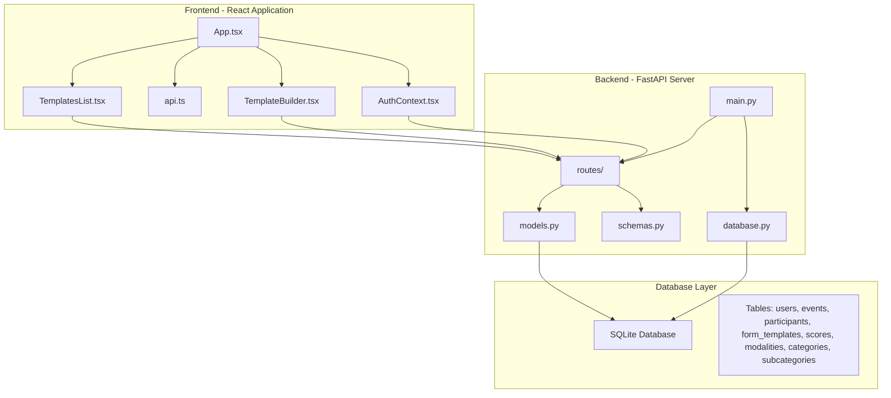
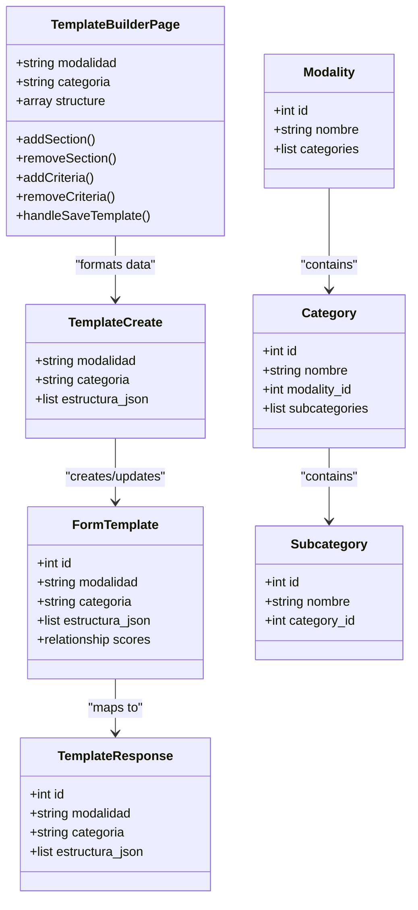
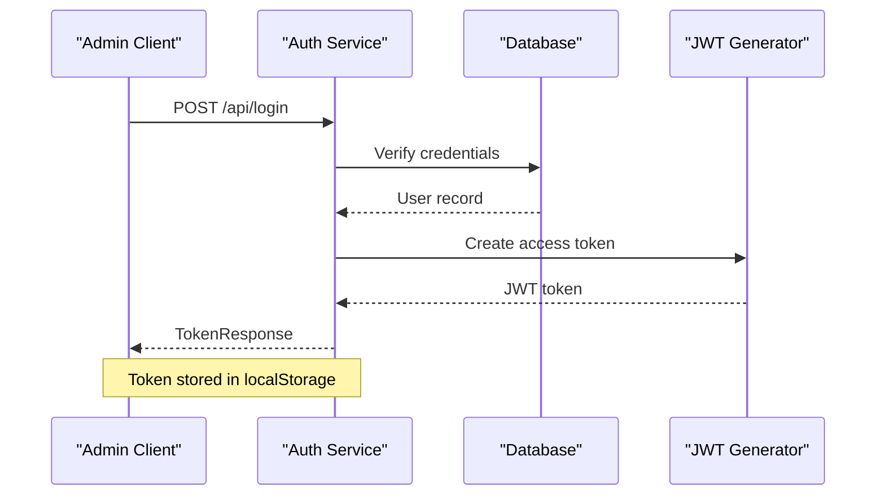
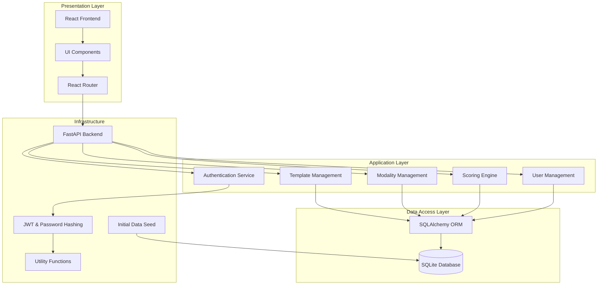
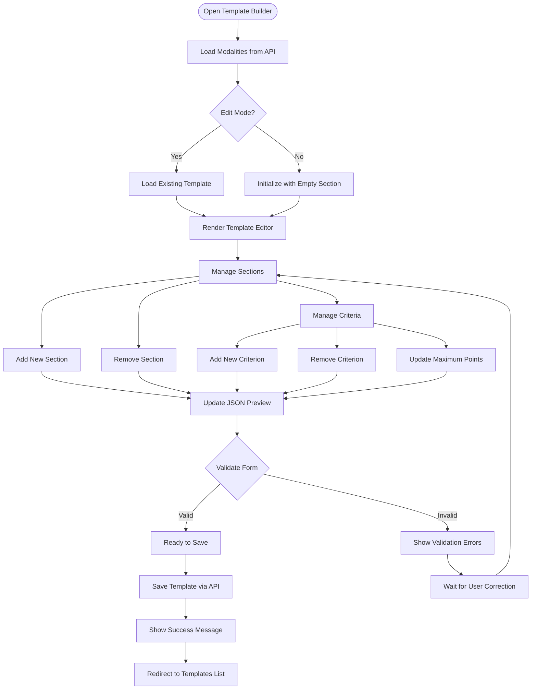
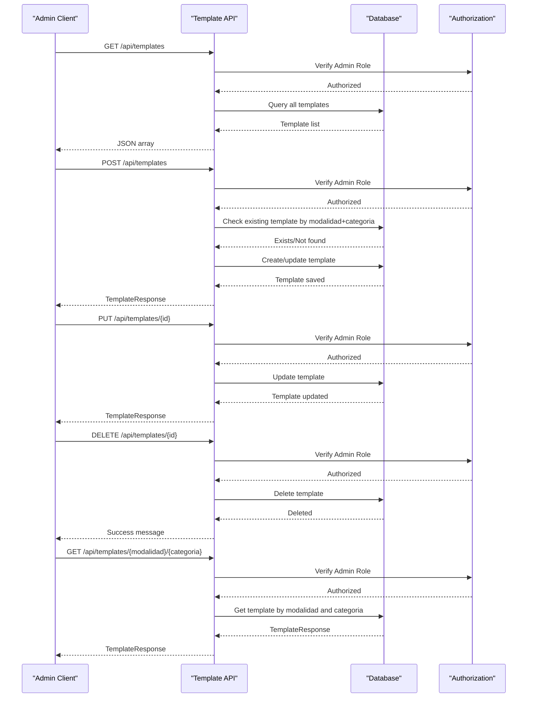
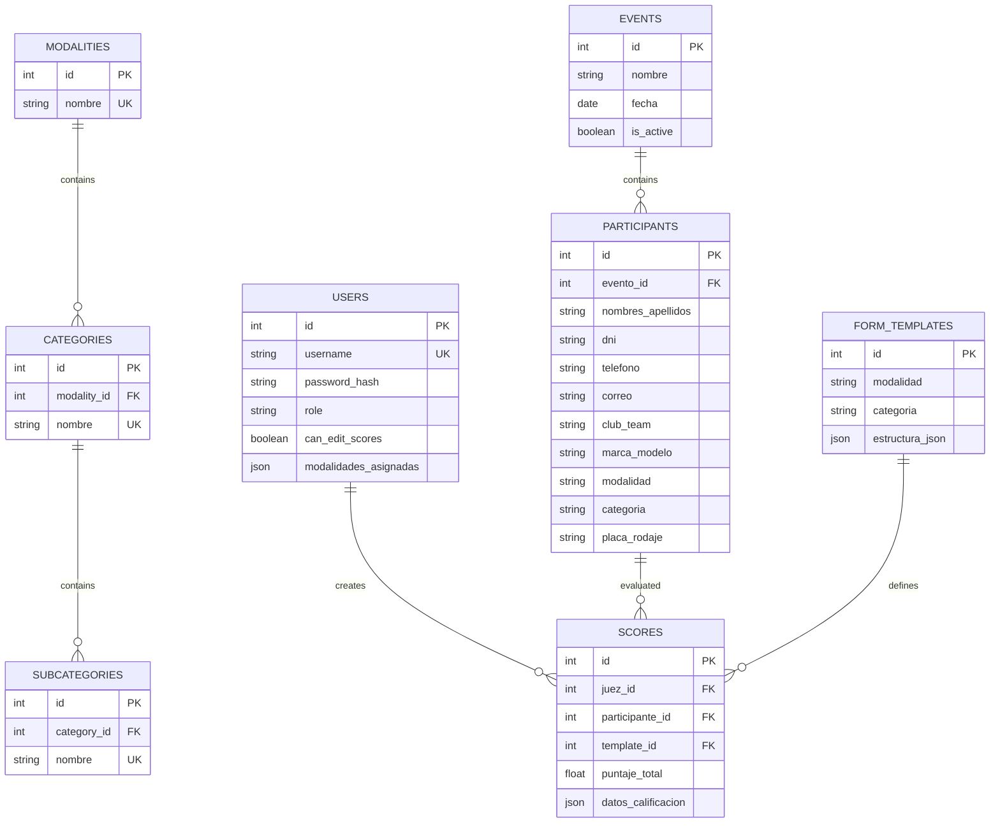
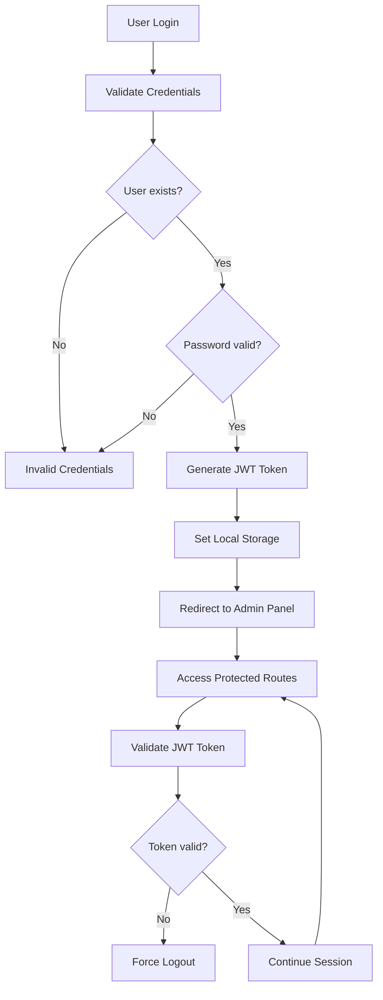
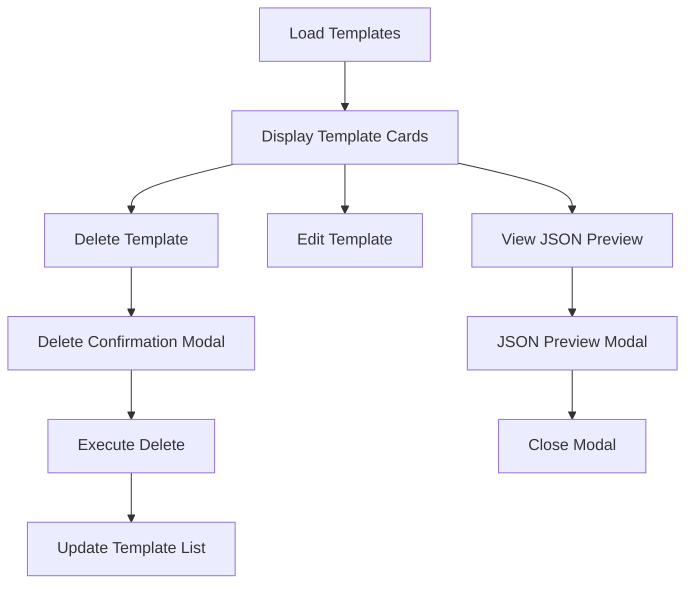
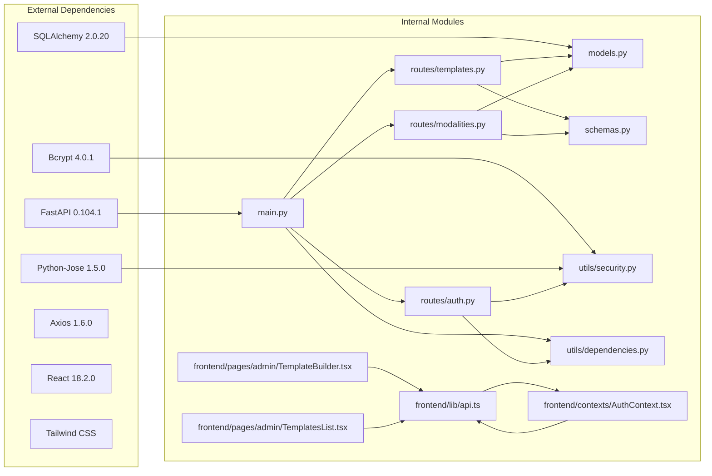

# Enhanced Template Builder

<cite>
**Referenced Files in This Document**
- [main.py](file://main.py)
- [models.py](file://models.py)
- [schemas.py](file://schemas.py)
- [routes/templates.py](file://routes/templates.py)
- [routes/modalities.py](file://routes/modalities.py)
- [frontend/src/pages/admin/TemplateBuilder.tsx](file://frontend/src/pages/admin/TemplateBuilder.tsx)
- [frontend/src/pages/admin/TemplatesList.tsx](file://frontend/src/pages/admin/TemplatesList.tsx)
- [frontend/src/lib/api.ts](file://frontend/src/lib/api.ts)
- [frontend/src/contexts/AuthContext.tsx](file://frontend/src/contexts/AuthContext.tsx)
- [frontend/src/App.tsx](file://frontend/src/App.tsx)
- [database.py](file://database.py)
- [seed_templates.py](file://seed_templates.py)
- [requirements.txt](file://requirements.txt)
- [frontend/package.json](file://frontend/package.json)
</cite>

## Update Summary
**Changes Made**
- Dramatically enhanced Template Builder interface with major improvements to TemplateBuilder.tsx (+886 lines) including new features and better interface
- Added comprehensive real-time JSON preview with automatic validation and error handling
- Enhanced template management with modalities and categories support including hierarchical structure
- Improved Templates List page with JSON preview modals and enhanced delete confirmation
- Implemented comprehensive validation and error handling throughout the template management system
- Added real-time statistics and summary calculations for template complexity assessment
- Enhanced UI with Tailwind CSS styling and responsive design
- Improved user experience with loading states, success/error messaging, and better form controls
- Added comprehensive modality and category management system with hierarchical organization
- Implemented real-time validation with immediate feedback and error prevention
- Enhanced template statistics display with section, criteria, and maximum points calculation

## Table of Contents
1. [Introduction](#introduction)
2. [Project Structure](#project-structure)
3. [Core Components](#core-components)
4. [Architecture Overview](#architecture-overview)
5. [Detailed Component Analysis](#detailed-component-analysis)
6. [Dependency Analysis](#dependency-analysis)
7. [Performance Considerations](#performance-considerations)
8. [Troubleshooting Guide](#troubleshooting-guide)
9. [Conclusion](#conclusion)

## Introduction
The Enhanced Template Builder is a specialized evaluation form builder for car audio and tuning competitions. It enables administrators to create, manage, and maintain standardized scoring templates tailored to specific competition modalities and categories. The system provides a comprehensive solution for organizing evaluation criteria, managing scoring workflows, and ensuring consistent judging standards across events.

**Updated** The system now features extensive UI improvements with real-time validation, comprehensive template management capabilities, and enhanced user experience through modalities and categories support. The Template Builder interface has been dramatically enhanced with 886 additional lines of code, providing a more intuitive and powerful template creation experience with improved validation, error handling, and user feedback mechanisms.

The platform consists of a FastAPI backend with SQLAlchemy ORM for data persistence, a React frontend with TypeScript for the user interface, and a SQLite database for storage. Administrators can define evaluation sections with weighted criteria, while judges can apply these templates during live scoring sessions.

## Project Structure
The project follows a clean architecture pattern with clear separation between frontend and backend concerns:

**Diagram sources**
- [main.py:1-55](file://main.py#L1-L55)
- [frontend/src/App.tsx:95-128](file://frontend/src/App.tsx#L95-L128)

The frontend is organized into distinct pages for administration and judging workflows, while the backend provides RESTful APIs for template management, user authentication, and scoring operations.

**Section sources**
- [main.py:1-55](file://main.py#L1-L55)
- [frontend/src/App.tsx:1-128](file://frontend/src/App.tsx#L1-L128)

## Core Components

### Template Management System
The template system centers around the FormTemplate model and associated CRUD operations:

**Diagram sources**
- [models.py:77-89](file://models.py#L77-L89)
- [schemas.py:120-133](file://schemas.py#L120-L133)
- [frontend/src/pages/admin/TemplateBuilder.tsx:30-539](file://frontend/src/pages/admin/TemplateBuilder.tsx#L30-L539)
- [models.py:143-183](file://models.py#L143-L183)

**Updated** The template system now includes comprehensive modality and category management with hierarchical structure support, providing a more robust foundation for template organization. The enhanced Template Builder interface provides better management of these hierarchical structures with real-time validation and comprehensive error handling.

### Authentication and Authorization
The system implements role-based access control with JWT tokens:

**Diagram sources**
- [routes/auth.py:13-36](file://routes/auth.py#L13-L36)
- [utils/security.py:32-42](file://utils/security.py#L32-L42)
- [frontend/src/contexts/AuthContext.tsx:95-116](file://frontend/src/contexts/AuthContext.tsx#L95-L116)

**Section sources**
- [models.py:77-89](file://models.py#L77-L89)
- [schemas.py:120-133](file://schemas.py#L120-L133)
- [frontend/src/pages/admin/TemplateBuilder.tsx:30-539](file://frontend/src/pages/admin/TemplateBuilder.tsx#L30-L539)

## Architecture Overview

The Enhanced Template Builder follows a modern web architecture with clear separation of concerns:

**Diagram sources**
- [main.py:26-44](file://main.py#L26-L44)
- [routes/templates.py:10-134](file://routes/templates.py#L10-L134)
- [routes/modalities.py:16-192](file://routes/modalities.py#L16-L192)
- [utils/dependencies.py:16-71](file://utils/dependencies.py#L16-L71)

The architecture ensures scalability, maintainability, and clear separation between presentation, business logic, and data persistence layers.

**Section sources**
- [main.py:26-44](file://main.py#L26-L44)
- [routes/templates.py:10-134](file://routes/templates.py#L10-L134)

## Detailed Component Analysis

### Enhanced Template Builder Interface
The Template Builder provides an intuitive drag-and-drop interface for creating evaluation forms with extensive UI improvements:

**Updated** The interface now includes real-time JSON preview, comprehensive validation, automatic JSON generation, and enhanced error handling to ensure template integrity. The Template Builder has been dramatically enhanced with 886 additional lines of code, providing a more intuitive and powerful template creation experience with improved user feedback and validation. The interface features comprehensive validation with immediate feedback, real-time statistics display, and enhanced error handling throughout the template creation process.

**Diagram sources**
- [frontend/src/pages/admin/TemplateBuilder.tsx:74-277](file://frontend/src/pages/admin/TemplateBuilder.tsx#L74-L277)

**Section sources**
- [frontend/src/pages/admin/TemplateBuilder.tsx:74-277](file://frontend/src/pages/admin/TemplateBuilder.tsx#L74-L277)

### Comprehensive Template Management API
The backend provides comprehensive CRUD operations for template management with enhanced functionality:

**Updated** The API now includes additional endpoints for getting templates by modalidad and categoria combination, providing more flexible template retrieval options. The enhanced Template Builder interface provides better user experience with real-time validation and comprehensive error handling. The API supports hierarchical modality and category management with proper validation and error handling.

**Diagram sources**
- [routes/templates.py:13-134](file://routes/templates.py#L13-L134)
- [utils/dependencies.py:32-38](file://utils/dependencies.py#L32-L38)

**Section sources**
- [frontend/src/pages/admin/TemplateBuilder.tsx:74-277](file://frontend/src/pages/admin/TemplateBuilder.tsx#L74-L277)
- [routes/templates.py:13-134](file://routes/templates.py#L13-L134)

### Advanced Database Schema Design
The system employs a normalized relational schema optimized for evaluation workflows with enhanced modality and category support:

**Updated** The schema now includes dedicated tables for modalities, categories, and subcategories with proper foreign key relationships, enabling hierarchical organization of competition structures. The enhanced Template Builder interface provides better management of these hierarchical structures with comprehensive validation and real-time updates. The schema supports complex relationships between competitions, participants, and evaluation criteria while maintaining referential integrity.

**Diagram sources**
- [models.py:11-183](file://models.py#L11-L183)

The schema supports complex relationships between competitions, participants, and evaluation criteria while maintaining referential integrity.

**Section sources**
- [models.py:11-183](file://models.py#L11-L183)
- [database.py:36-93](file://database.py#L36-L93)

### Enhanced Authentication Flow
The system implements secure authentication using JWT tokens with comprehensive error handling:

**Diagram sources**
- [routes/auth.py:13-36](file://routes/auth.py#L13-L36)
- [utils/security.py:32-42](file://utils/security.py#L32-L42)
- [frontend/src/contexts/AuthContext.tsx:95-116](file://frontend/src/contexts/AuthContext.tsx#L95-L116)

**Section sources**
- [routes/auth.py:13-36](file://routes/auth.py#L13-L36)
- [utils/security.py:32-42](file://utils/security.py#L32-L42)
- [frontend/src/contexts/AuthContext.tsx:95-116](file://frontend/src/contexts/AuthContext.tsx#L95-L116)

### Enhanced Templates List Management Interface
The Templates List page provides a comprehensive management interface with JSON preview modals and enhanced delete confirmation:

**Updated** The Templates List interface now includes comprehensive JSON preview modals, enhanced delete confirmation dialogs, and improved template statistics display. The interface provides better user experience with real-time template validation and comprehensive error handling. Each template card displays comprehensive statistics including sections count, criteria count, and maximum points calculation.

**Diagram sources**
- [frontend/src/pages/admin/TemplatesList.tsx:24-284](file://frontend/src/pages/admin/TemplatesList.tsx#L24-L284)

**Section sources**
- [frontend/src/pages/admin/TemplatesList.tsx:24-284](file://frontend/src/pages/admin/TemplatesList.tsx#L24-L284)

## Dependency Analysis

The Enhanced Template Builder maintains clean dependency relationships:

**Updated** The dependency graph now includes enhanced frontend components with Tailwind CSS styling and comprehensive API communication layers. The dramatic enhancement of the Template Builder interface includes improved styling and user experience components. The frontend dependencies include React 18.3.1, TypeScript 5.6.3, Tailwind CSS 3.4.17, and Vite 5.4.10 for modern development workflow.

**Diagram sources**
- [requirements.txt:1-10](file://requirements.txt#L1-L10)
- [main.py:3-17](file://main.py#L3-L17)
- [frontend/package.json:11-26](file://frontend/package.json#L11-L26)

The dependency graph shows clear separation between external libraries and internal modules, facilitating maintenance and updates.

**Section sources**
- [requirements.txt:1-10](file://requirements.txt#L1-L10)
- [main.py:3-17](file://main.py#L3-L17)
- [frontend/package.json:11-26](file://frontend/package.json#L11-L26)

## Performance Considerations
The system is designed with several performance optimizations:

- **Database Indexing**: Strategic indexing on frequently queried fields (username, event_id, modalidad, categoria)
- **Connection Pooling**: SQLAlchemy session management for efficient database connections
- **Lazy Loading**: Eager loading strategies to minimize N+1 query problems
- **CORS Configuration**: Optimized CORS settings for production deployment
- **Static File Serving**: Efficient serving of uploaded files and assets
- **Real-time Validation**: Client-side validation reduces server load and improves user experience
- **JSON Preview Optimization**: Memoized computations prevent unnecessary re-renders
- **State Management**: Efficient React state management with useMemo for computed values
- **Conditional Rendering**: Optimized rendering based on loading states and user interactions
- **Hierarchical Data Loading**: Efficient loading of modalities with nested categories and subcategories
- **Template Statistics Computation**: Optimized calculations for template complexity assessment

**Updated** The system now includes real-time validation and optimization techniques to handle complex template structures efficiently, with the enhanced Template Builder interface providing better performance through optimized state management and memoization. The hierarchical modality and category system uses efficient eager loading to minimize database queries.

## Troubleshooting Guide

### Common Issues and Solutions

**Template Creation Failures**
- Verify modalidad and categoria uniqueness constraints
- Ensure JSON structure validates against expected schema
- Check admin role permissions
- Validate that modalidad and categoria are properly selected
- Ensure real-time validation passes before saving

**Enhanced Template Builder Issues**
- Verify modalidad and categoria dropdowns are populated correctly
- Check real-time JSON preview updates
- Ensure validation messages are displayed properly
- Verify that section and criterion management works correctly
- Check loading states and error handling for API calls
- Validate Tailwind CSS styling is properly applied
- Ensure responsive design works on mobile devices

**Templates List Management**
- Verify template cards display correct statistics
- Check JSON preview modal functionality
- Ensure delete confirmation works properly
- Validate navigation between pages
- Check responsive design on different screen sizes
- Ensure template statistics are calculated correctly

**Authentication Problems**
- Verify JWT secret key configuration
- Check token expiration settings
- Validate bcrypt password hashing
- Ensure local storage persistence works correctly

**Database Migration Issues**
- Run initialization scripts before first use
- Verify SQLite file permissions
- Check for concurrent database access conflicts
- Validate unique constraints on modalidad+categoria combinations
- Ensure hierarchical modality and category relationships are maintained

**Frontend API Communication**
- Verify API base URL configuration
- Check CORS policy settings
- Validate token storage in localStorage
- Ensure proper error handling for network failures
- Check that real-time validation prevents invalid submissions

**Section sources**
- [routes/templates.py:41-53](file://routes/templates.py#L41-L53)
- [utils/security.py:9-14](file://utils/security.py#L9-L14)
- [frontend/src/lib/api.ts:24-40](file://frontend/src/lib/api.ts#L24-L40)

## Conclusion
The Enhanced Template Builder provides a robust, scalable solution for managing evaluation templates in competitive car audio and tuning events. Its architecture supports extensibility, maintainability, and performance while providing an intuitive administrative interface for template creation and management.

**Updated** The system now features extensive UI improvements with real-time validation, comprehensive template management capabilities, and enhanced user experience through modalities and categories support. The dramatic enhancement of the Template Builder interface with 886 additional lines of code provides a more intuitive and powerful template creation experience with improved user feedback, validation, and error handling.

Key strengths include:
- Clean separation of concerns between frontend and backend
- Comprehensive role-based access control
- Flexible template structure supporting complex evaluation criteria
- Real-time validation and feedback mechanisms
- Scalable database design with proper indexing and relationships
- Enhanced UI with real-time JSON preview and comprehensive error handling
- Hierarchical modality and category management system
- Comprehensive template management with JSON preview and deletion capabilities
- Responsive design with Tailwind CSS styling
- Improved user experience through better state management and loading indicators
- Comprehensive statistics display for template complexity assessment
- Efficient API communication with proper error handling
- Modern development stack with React, TypeScript, and Vite

The system is well-positioned for future enhancements, including support for additional competition types, advanced reporting capabilities, and integration with external systems. The enhanced Template Builder interface provides a solid foundation for these future developments while maintaining excellent usability and performance. The comprehensive validation system and real-time feedback mechanisms ensure data integrity and improve the overall user experience for administrators managing complex evaluation templates.