# Administrator Features

<cite>
**Referenced Files in This Document**
- [frontend/src/pages/admin/AdminHome.tsx](file://frontend/src/pages/admin/AdminHome.tsx)
- [frontend/src/pages/admin/AdminLayout.tsx](file://frontend/src/pages/admin/AdminLayout.tsx)
- [frontend/src/pages/admin/Usuarios.tsx](file://frontend/src/pages/admin/Usuarios.tsx)
- [frontend/src/pages/admin/Eventos.tsx](file://frontend/src/pages/admin/Eventos.tsx)
- [frontend/src/pages/admin/Participantes.tsx](file://frontend/src/pages/admin/Participantes.tsx)
- [frontend/src/pages/admin/TemplatesList.tsx](file://frontend/src/pages/admin/TemplatesList.tsx)
- [frontend/src/pages/admin/EvaluationTemplateEditor.tsx](file://frontend/src/pages/admin/EvaluationTemplateEditor.tsx)
- [frontend/src/pages/admin/Categorias.tsx](file://frontend/src/pages/admin/Categorias.tsx)
- [frontend/src/pages/admin/Reglamentos.tsx](file://frontend/src/pages/admin/Reglamentos.tsx)
- [frontend/src/pages/juez/Reglamentos.tsx](file://frontend/src/pages/juez/Reglamentos.tsx)
- [frontend/src/components/FileViewer.tsx](file://frontend/src/components/FileViewer.tsx)
- [frontend/src/App.tsx](file://frontend/src/App.tsx)
- [frontend/src/contexts/AuthContext.tsx](file://frontend/src/contexts/AuthContext.tsx)
- [frontend/src/lib/api.ts](file://frontend/src/lib/api.ts)
- [frontend/src/lib/judging.ts](file://frontend/src/lib/judging.ts)
- [routes/auth.py](file://routes/auth.py)
- [routes/users.py](file://routes/users.py)
- [routes/events.py](file://routes/events.py)
- [routes/participants.py](file://routes/participants.py)
- [routes/modalities.py](file://routes/modalities.py)
- [routes/categories.py](file://routes/categories.py)
- [routes/evaluation_templates.py](file://routes/evaluation_templates.py)
- [routes/judge_assignments.py](file://routes/judge_assignments.py)
- [routes/regulations.py](file://routes/regulations.py)
- [routes/scores.py](file://routes/scores.py)
- [utils/dependencies.py](file://utils/dependencies.py)
- [utils/security.py](file://utils/security.py)
- [models.py](file://models.py)
- [schemas.py](file://schemas.py)
- [main.py](file://main.py)
</cite>

## Update Summary
**Changes Made**
- **Enhanced User Management System**: Expanded judge account creation with comprehensive modalidad assignment, credential updates, and profile editing capabilities
- **Comprehensive Judge Assignment Management**: Implemented sophisticated judge assignment system with section-level assignments, principal judge coordination, and template validation
- **Advanced Template Management System**: Developed centralized template management with JSON editing, real-time preview, and modalidad-specific template handling
- **Hierarchical Category Management**: Introduced comprehensive category management system with modalities, categories, and subcategories
- **Enhanced Navigation Structure**: Added "Categorías" and "Resultados" navigation items alongside existing admin sections
- **Updated Backend API Endpoints**: Added new endpoints for comprehensive user management, judge assignments, and category management
- **Improved Judge Interface**: Judge dashboard now integrates with assignment system and template validation
- **Enhanced Regulation Management**: Enhanced PDF upload system with modalidad filtering and comprehensive admin interface

## Table of Contents
1. [Introduction](#introduction)
2. [Project Structure](#project-structure)
3. [Core Components](#core-components)
4. [Architecture Overview](#architecture-overview)
5. [Detailed Component Analysis](#detailed-component-analysis)
6. [Dependency Analysis](#dependency-analysis)
7. [Performance Considerations](#performance-considerations)
8. [Troubleshooting Guide](#troubleshooting-guide)
9. [Conclusion](#conclusion)
10. [Appendices](#appendices)

## Introduction
This document explains the administrator features implemented in the Juzgamiento application. It covers the administrative workflow for:
- **Enhanced User Management**: Creating judge accounts with modalidad assignment, comprehensive credential updates, and profile editing capabilities
- **Judge Assignment Management**: Sophisticated judge assignment system with section-level assignments, principal judge coordination, and template validation
- **Template Management**: Comprehensive template lifecycle management with centralized list interface, JSON preview, and full CRUD operations
- **Category Management**: Hierarchical competition structure with modalities, categories, and subcategories management
- **Regulation Management**: Enhanced PDF upload system with modalidad filtering, comprehensive admin interface, and judge access control

It also documents the implementation details of each administrative interface, component interactions, data validation, security controls, and integration with backend APIs. Step-by-step usage instructions and troubleshooting guidance are included.

## Project Structure
The application follows a clear separation of concerns:
- Frontend (React + TypeScript) under frontend/src with dedicated admin pages
- Backend (FastAPI) under routes/ for API endpoints
- Shared utilities for security and dependency injection
- Data models and Pydantic schemas for validation

```mermaid
graph TB
subgraph "Frontend"
AC["AuthContext.tsx"]
API["api.ts"]
AH["AdminHome.tsx"]
USU["Usuarios.tsx"]
EVT["Eventos.tsx"]
PAT["Participantes.tsx"]
TMP_LIST["TemplatesList.tsx"]
EVAL_EDITOR["EvaluationTemplateEditor.tsx"]
CAT["Categorias.tsx"]
REG_ADMIN["Reglamentos.tsx (Admin)"]
REG_JUEZ["Reglamentos.tsx (Juez)"]
FV["FileViewer.tsx"]
JUDGE_LAYOUT["JuezLayout.tsx"]
JUDGE_DASHBOARD["Dashboard.tsx"]
JUDGE_SELECTOR["Selector.tsx"]
JUDGE_CALIFICAR["Calificar.tsx"]
END
subgraph "Backend"
AUTH["routes/auth.py"]
USERS["routes/users.py"]
EVENTS["routes/events.py"]
PARTIC["routes/participants.py"]
MODAL["routes/modalities.py"]
CATS["routes/categories.py"]
EVAL_TEMPL["routes/evaluation_templates.py"]
JUDGE_ASS["routes/judge_assignments.py"]
REGS["routes/regulations.py"]
SCORES["routes/scores.py"]
SEC["utils/security.py"]
DEPS["utils/dependencies.py"]
MODELS["models.py"]
SCHEMAS["schemas.py"]
END
AC --> API
AH --> API
USU --> API
EVT --> API
PAT --> API
TMP_LIST --> API
EVAL_EDITOR --> API
CAT --> API
REG_ADMIN --> API
REG_JUEZ --> API
FV --> API
JUDGE_LAYOUT --> API
JUDGE_DASHBOARD --> API
JUDGE_SELECTOR --> API
JUDGE_CALIFICAR --> API
API --> AUTH
API --> USERS
API --> EVENTS
API --> PARTIC
API --> MODAL
API --> CATS
API --> EVAL_TEMPL
API --> JUDGE_ASS
API --> REGS
AUTH --> DEPS
USERS --> DEPS
EVENTS --> DEPS
PARTIC --> DEPS
MODAL --> DEPS
CATS --> DEPS
EVAL_TEMPL --> DEPS
JUDGE_ASS --> DEPS
REGS --> DEPS
AUTH --> SEC
USERS --> SEC
EVENTS --> SEC
PARTIC --> SEC
MODAL --> SEC
CATS --> SEC
EVAL_TEMPL --> SEC
JUDGE_ASS --> SEC
REGS --> SEC
USERS --> MODELS
EVENTS --> MODELS
PARTIC --> MODELS
MODAL --> MODELS
CATS --> MODELS
EVAL_TEMPL --> MODELS
JUDGE_ASS --> MODELS
USERS --> SCHEMAS
EVENTS --> SCHEMAS
PARTIC --> SCHEMAS
MODAL --> SCHEMAS
CATS --> SCHEMAS
EVAL_TEMPL --> SCHEMAS
JUDGE_ASS --> SCHEMAS
REGS --> SCHEMAS
```

**Diagram sources**
- [frontend/src/contexts/AuthContext.tsx:1-144](file://frontend/src/contexts/AuthContext.tsx#L1-L144)
- [frontend/src/lib/api.ts:1-41](file://frontend/src/lib/api.ts#L1-L41)
- [frontend/src/pages/admin/AdminHome.tsx:1-49](file://frontend/src/pages/admin/AdminHome.tsx#L1-L49)
- [frontend/src/pages/admin/Usuarios.tsx:1-1058](file://frontend/src/pages/admin/Usuarios.tsx#L1-L1058)
- [frontend/src/pages/admin/Eventos.tsx:1-482](file://frontend/src/pages/admin/Eventos.tsx#L1-L482)
- [frontend/src/pages/admin/Participantes.tsx:1-693](file://frontend/src/pages/admin/Participantes.tsx#L1-L693)
- [frontend/src/pages/admin/TemplatesList.tsx:1-252](file://frontend/src/pages/admin/TemplatesList.tsx#L1-L252)
- [frontend/src/pages/admin/EvaluationTemplateEditor.tsx:1-1241](file://frontend/src/pages/admin/EvaluationTemplateEditor.tsx#L1-L1241)
- [frontend/src/pages/admin/Categorias.tsx:1-344](file://frontend/src/pages/admin/Categorias.tsx#L1-L344)
- [frontend/src/pages/admin/Reglamentos.tsx:1-302](file://frontend/src/pages/admin/Reglamentos.tsx#L1-L302)
- [frontend/src/pages/juez/Reglamentos.tsx:1-171](file://frontend/src/pages/juez/Reglamentos.tsx#L1-L171)
- [frontend/src/components/FileViewer.tsx:1-157](file://frontend/src/components/FileViewer.tsx#L1-L157)
- [frontend/src/App.tsx:1-131](file://frontend/src/App.tsx#L1-L131)
- [routes/auth.py:1-36](file://routes/auth.py#L1-L36)
- [routes/users.py:1-257](file://routes/users.py#L1-L257)
- [routes/events.py:1-74](file://routes/events.py#L1-L74)
- [routes/participants.py:1-400](file://routes/participants.py#L1-L400)
- [routes/modalities.py:1-180](file://routes/modalities.py#L1-L180)
- [routes/categories.py:1-174](file://routes/categories.py#L1-L174)
- [routes/evaluation_templates.py:1-172](file://routes/evaluation_templates.py#L1-L172)
- [routes/judge_assignments.py:1-308](file://routes/judge_assignments.py#L1-L308)
- [routes/regulations.py:1-110](file://routes/regulations.py#L1-L110)
- [routes/scores.py](file://routes/scores.py)
- [utils/dependencies.py:1-71](file://utils/dependencies.py#L1-L71)
- [utils/security.py:1-51](file://utils/security.py#L1-L51)
- [models.py:1-225](file://models.py#L1-L225)
- [schemas.py:1-303](file://schemas.py#L1-L303)

**Section sources**
- [frontend/src/pages/admin/AdminHome.tsx:1-49](file://frontend/src/pages/admin/AdminHome.tsx#L1-L49)
- [frontend/src/pages/admin/Usuarios.tsx:1-1058](file://frontend/src/pages/admin/Usuarios.tsx#L1-L1058)
- [frontend/src/pages/admin/Eventos.tsx:1-482](file://frontend/src/pages/admin/Eventos.tsx#L1-L482)
- [frontend/src/pages/admin/Participantes.tsx:1-693](file://frontend/src/pages/admin/Participantes.tsx#L1-L693)
- [frontend/src/pages/admin/TemplatesList.tsx:1-252](file://frontend/src/pages/admin/TemplatesList.tsx#L1-L252)
- [frontend/src/pages/admin/EvaluationTemplateEditor.tsx:1-1241](file://frontend/src/pages/admin/EvaluationTemplateEditor.tsx#L1-L1241)
- [frontend/src/pages/admin/Categorias.tsx:1-344](file://frontend/src/pages/admin/Categorias.tsx#L1-L344)
- [frontend/src/pages/admin/Reglamentos.tsx:1-302](file://frontend/src/pages/admin/Reglamentos.tsx#L1-L302)
- [frontend/src/pages/juez/Reglamentos.tsx:1-171](file://frontend/src/pages/juez/Reglamentos.tsx#L1-L171)
- [frontend/src/App.tsx:1-131](file://frontend/src/App.tsx#L1-L131)
- [routes/auth.py:1-36](file://routes/auth.py#L1-L36)
- [routes/users.py:1-257](file://routes/users.py#L1-L257)
- [routes/events.py:1-74](file://routes/events.py#L1-L74)
- [routes/participants.py:1-400](file://routes/participants.py#L1-L400)
- [routes/modalities.py:1-180](file://routes/modalities.py#L1-L180)
- [routes/categories.py:1-174](file://routes/categories.py#L1-L174)
- [routes/evaluation_templates.py:1-172](file://routes/evaluation_templates.py#L1-L172)
- [routes/judge_assignments.py:1-308](file://routes/judge_assignments.py#L1-L308)
- [routes/regulations.py:1-110](file://routes/regulations.py#L1-L110)
- [routes/scores.py](file://routes/scores.py)
- [utils/dependencies.py:1-71](file://utils/dependencies.py#L1-L71)
- [utils/security.py:1-51](file://utils/security.py#L1-L51)
- [models.py:1-225](file://models.py#L1-L225)
- [schemas.py:1-303](file://schemas.py#L1-L303)

## Core Components
- **Authentication and session management**: JWT-based login, token parsing, and role enforcement
- **Administrative pages**:
  - **Users**: Create judges, assign modalidades, toggle edit permission, update credentials, and manage profiles
  - **Events**: Create, activate/deactivate, edit schedule
  - **Participants**: Bulk upload Excel, manual registration, edit participant records
  - **Templates**: Comprehensive template management with centralized list interface, JSON preview, and full CRUD operations
  - **Categories**: Hierarchical competition structure management with modalities, categories, and subcategories
  - **Regulations**: Enhanced PDF management system with admin interface, modalidad filtering, and judge access
- **Judge interface**: Separate regulations page with modalidad filtering for judge access
- **Backend endpoints**: Protected by role checks, strict validation, and data normalization

Key implementation highlights:
- Frontend uses a centralized API client and shared error handling
- Backend enforces admin-only actions and validates payloads
- Security utilities handle hashing, tokens, and optional/required claims
- **Enhanced template management includes comprehensive CRUD operations with real-time validation and statistics**
- **Advanced category management includes hierarchical structure with cascading deletes and relationship validation**
- **Sophisticated evaluation template management includes JSON validation, unique constraint enforcement, and modalidad-specific management**
- **Judge interface provides filtered access to regulations based on selected modalidad**
- **Enhanced navigation with dedicated "Categorías" and "Resultados" sections alongside existing "Reglamentos" navigation**
- **Advanced evaluation template editor provides JSON editing with syntax validation and real-time preview**
- **Sophisticated judge assignment system provides section-level assignments with template validation and principal judge coordination**
- **Enhanced user management includes comprehensive profile editing with enhanced credential update capabilities**

**Section sources**
- [frontend/src/contexts/AuthContext.tsx:1-144](file://frontend/src/contexts/AuthContext.tsx#L1-L144)
- [frontend/src/lib/api.ts:1-41](file://frontend/src/lib/api.ts#L1-L41)
- [routes/auth.py:1-36](file://routes/auth.py#L1-L36)
- [routes/users.py:1-257](file://routes/users.py#L1-L257)
- [routes/events.py:1-74](file://routes/events.py#L1-L74)
- [routes/participants.py:1-400](file://routes/participants.py#L1-L400)
- [routes/modalities.py:1-180](file://routes/modalities.py#L1-L180)
- [routes/categories.py:1-174](file://routes/categories.py#L1-L174)
- [routes/evaluation_templates.py:1-172](file://routes/evaluation_templates.py#L1-L172)
- [routes/judge_assignments.py:1-308](file://routes/judge_assignments.py#L1-L308)
- [routes/regulations.py:1-110](file://routes/regulations.py#L1-L110)
- [utils/security.py:1-51](file://utils/security.py#L1-L51)
- [utils/dependencies.py:1-71](file://utils/dependencies.py#L1-L71)
- [models.py:1-225](file://models.py#L1-L225)
- [schemas.py:1-303](file://schemas.py#L1-L303)

## Architecture Overview
The admin workflow is a client-server interaction:
- The admin authenticates and receives a JWT
- The admin page calls backend endpoints with Authorization headers
- Backend validates token, enforces role, normalizes/validates data, persists changes, and returns structured responses
- Frontend updates UI state and displays feedback

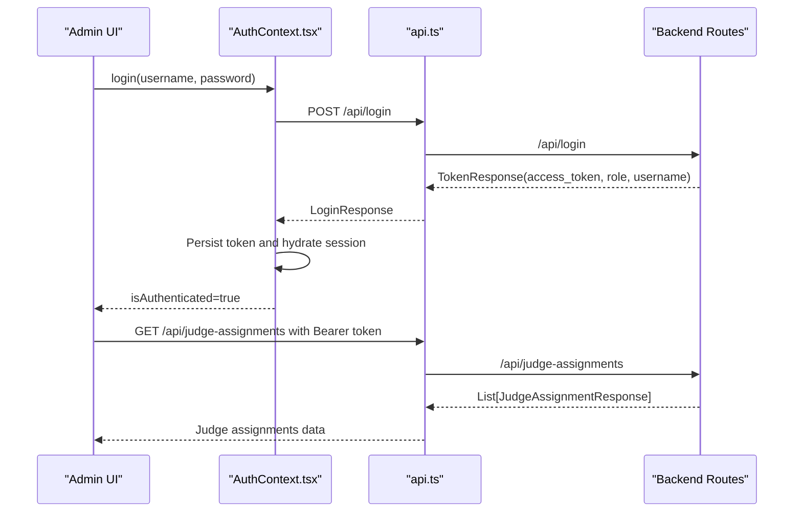

**Diagram sources**
- [frontend/src/contexts/AuthContext.tsx:95-111](file://frontend/src/contexts/AuthContext.tsx#L95-L111)
- [frontend/src/lib/api.ts:11-13](file://frontend/src/lib/api.ts#L11-L13)
- [routes/auth.py:13-35](file://routes/auth.py#L13-L35)
- [routes/judge_assignments.py:106-130](file://routes/judge_assignments.py#L106-L130)

## Detailed Component Analysis

### Authentication and Security
- Login endpoint verifies credentials and issues a signed JWT with user_id, role, and username
- Token decoding and user lookup are performed centrally
- Role guards enforce admin-only access to sensitive endpoints
- Password hashing uses bcrypt

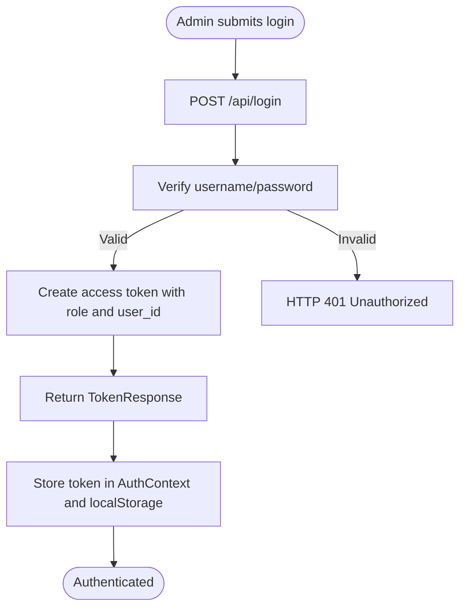

**Diagram sources**
- [routes/auth.py:13-35](file://routes/auth.py#L13-L35)
- [utils/security.py:29-35](file://utils/security.py#L29-L35)
- [utils/dependencies.py:50-70](file://utils/dependencies.py#L50-70)
- [frontend/src/contexts/AuthContext.tsx:95-111](file://frontend/src/contexts/AuthContext.tsx#L95-L111)

**Section sources**
- [routes/auth.py:1-36](file://routes/auth.py#L1-L36)
- [utils/security.py:1-51](file://utils/security.py#L1-L51)
- [utils/dependencies.py:1-71](file://utils/dependencies.py#L1-L71)
- [frontend/src/contexts/AuthContext.tsx:1-144](file://frontend/src/contexts/AuthContext.tsx#L1-L144)

### Enhanced User Management (Usuarios)
**Enhanced** - Comprehensive user management capabilities with modalidad assignment and profile editing:

Administrative capabilities:
- Create judge accounts with username, temporary password, and modalidad assignment
- Toggle "can_edit_scores" permission for judges
- Update judge credentials (username/password) with validation
- **Manage modalidad assignments for judges**
- **Edit user profiles with comprehensive credential updates**
- **View and manage judge assignments across modalidades**

Frontend interactions:
- Fetch users list with bearer token
- Submit create/update/toggle requests
- Show success/error messages and loading states
- **Manage modalidad assignments through dedicated interface**
- **Edit user profiles with validation and save/cancel functionality**
- **View judge assignments in comprehensive assignment management modal**

Backend validations:
- First user must be admin
- Only admins can create users
- Username uniqueness enforced
- Judge-only credential updates allowed
- Payload validation via Pydantic models
- **Modalidad assignment management with cascading updates**
- **Profile credential updates restricted to authenticated user only**

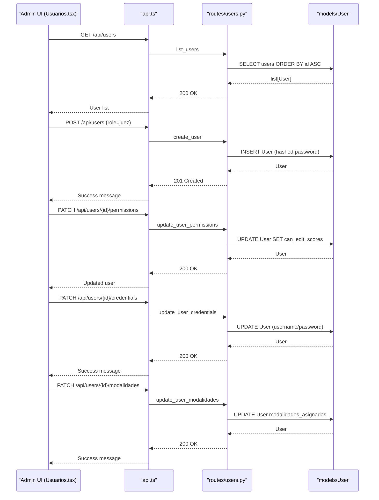

**Diagram sources**
- [frontend/src/pages/admin/Usuarios.tsx:35-96](file://frontend/src/pages/admin/Usuarios.tsx#L35-L96)
- [frontend/src/pages/admin/Usuarios.tsx:250-320](file://frontend/src/pages/admin/Usuarios.tsx#L250-L320)
- [routes/users.py:21-65](file://routes/users.py#L21-L65)
- [routes/users.py:68-85](file://routes/users.py#L68-L85)
- [routes/users.py:88-143](file://routes/users.py#L88-L143)
- [routes/users.py:105-129](file://routes/users.py#L105-L129)

**Section sources**
- [frontend/src/pages/admin/Usuarios.tsx:1-1058](file://frontend/src/pages/admin/Usuarios.tsx#L1-L1058)
- [routes/users.py:1-257](file://routes/users.py#L1-L257)
- [schemas.py:22-45](file://schemas.py#L22-L45)
- [models.py:11-21](file://models.py#L11-L21)

### Event Management (Eventos)
**Enhanced** - Improved event management with better UI and functionality:

Administrative capabilities:
- Create events with name and date; defaults to active
- Activate/deactivate events with improved toggle UI
- Edit event metadata (name, date, active flag) with enhanced form
- Delete events with confirmation dialog and cascade warnings

Frontend interactions:
- Load events with improved table layout and status indicators
- Show status badges with color coding (green for active, gray for inactive)
- Enable toggling with loading states and success/error feedback
- Edit mode with validation and save/cancel functionality
- Delete confirmation modal with cascade warnings

Backend validations:
- Admin-only access
- At least one field must be provided for updates
- Strict field length/type validation

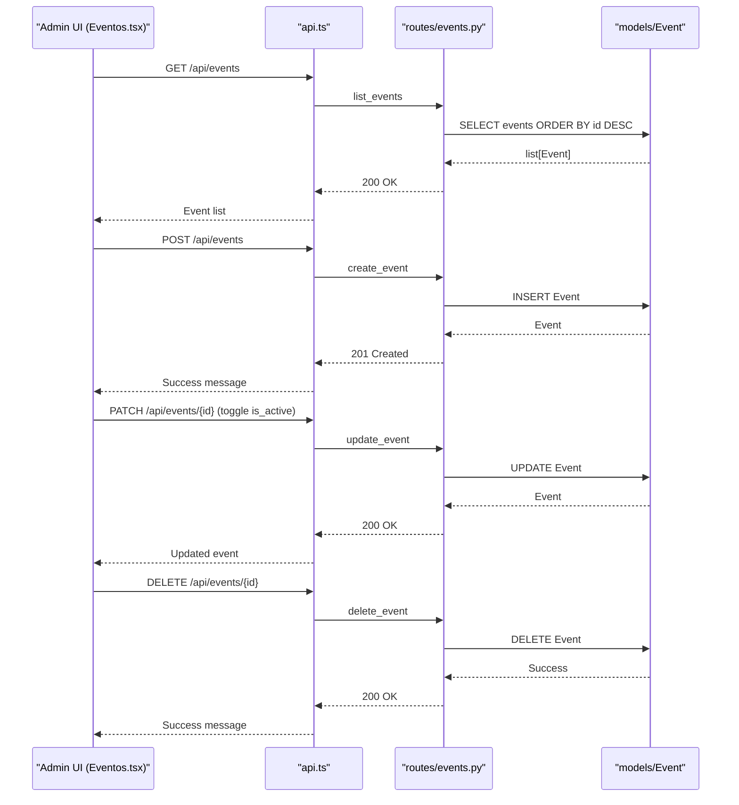

**Diagram sources**
- [frontend/src/pages/admin/Eventos.tsx:56-76](file://frontend/src/pages/admin/Eventos.tsx#L56-L76)
- [frontend/src/pages/admin/Eventos.tsx:87-107](file://frontend/src/pages/admin/Eventos.tsx#L87-L107)
- [frontend/src/pages/admin/Eventos.tsx:142-179](file://frontend/src/pages/admin/Eventos.tsx#L142-L179)
- [frontend/src/pages/admin/Eventos.tsx:181-215](file://frontend/src/pages/admin/Eventos.tsx#L181-L215)
- [routes/events.py:13-18](file://routes/events.py#L13-L18)
- [routes/events.py:21-35](file://routes/events.py#L21-L35)
- [routes/events.py:38-73](file://routes/events.py#L38-L73)

**Section sources**
- [frontend/src/pages/admin/Eventos.tsx:1-482](file://frontend/src/pages/admin/Eventos.tsx#L1-L482)
- [routes/events.py:1-74](file://routes/events.py#L1-L74)
- [schemas.py:49-68](file://schemas.py#L49-L68)
- [models.py:24-36](file://models.py#L24-L36)

### Participant Management (Participantes)
Administrative capabilities:
- Bulk import via Excel (.xlsx) with intelligent column mapping
- Manual registration with multiple modalities/categories per participant
- Edit participant records with validation

Frontend interactions:
- Select active event, upload file, show summary
- Manual form with modalities/categories selector
- Editable cards with validation and save/cancel

Backend validations and processing:
- Normalize column names (case-insensitive, diacritics removed)
- Enforce required fields; skip rows with missing required data
- Prevent duplicate plates within an event
- Normalize payloads and maintain legacy fields for compatibility

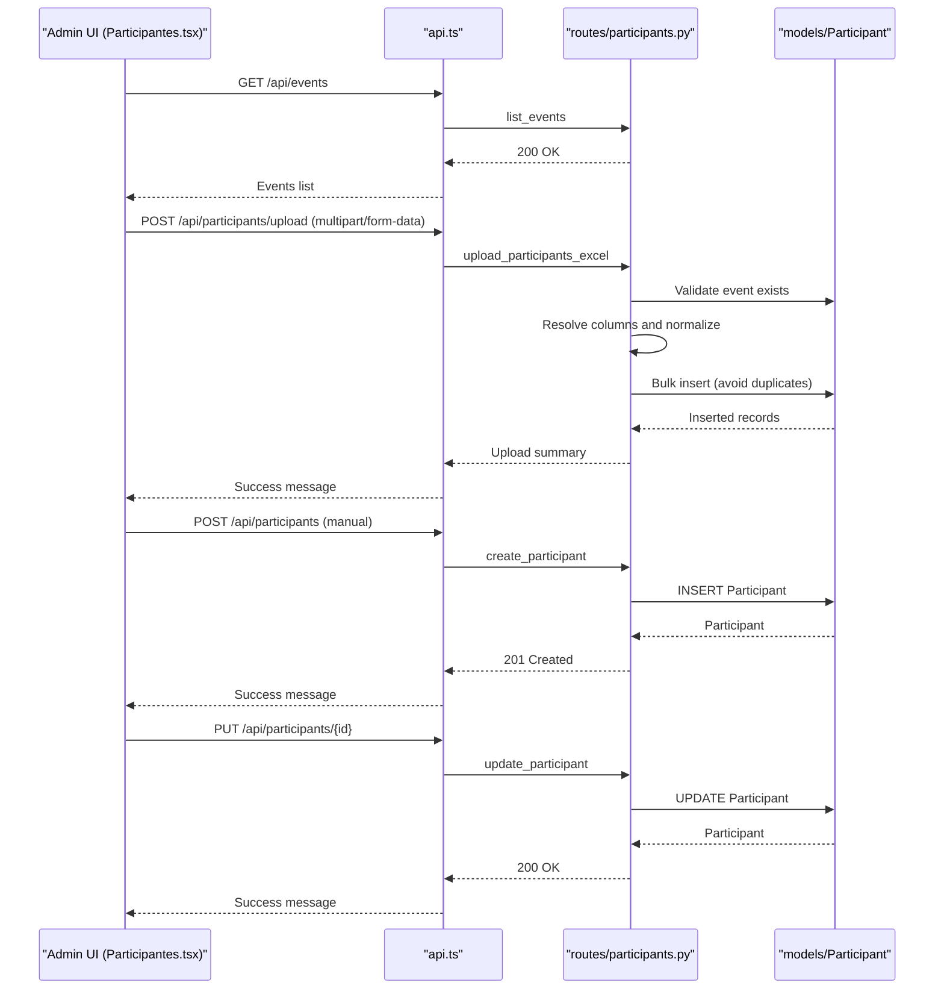

**Diagram sources**
- [frontend/src/pages/admin/Participantes.tsx:104-140](file://frontend/src/pages/admin/Participantes.tsx#L104-L140)
- [frontend/src/pages/admin/Participantes.tsx:149-187](file://frontend/src/pages/admin/Participantes.tsx#L149-L187)
- [frontend/src/pages/admin/Participantes.tsx:227-271](file://frontend/src/pages/admin/Participantes.tsx#L227-L271)
- [frontend/src/pages/admin/Participantes.tsx:299-379](file://frontend/src/pages/admin/Participantes.tsx#L299-L379)
- [routes/participants.py:286-399](file://routes/participants.py#L286-L399)
- [routes/participants.py:181-199](file://routes/participants.py#L181-L199)
- [routes/participants.py:202-230](file://routes/participants.py#L202-L230)

**Section sources**
- [frontend/src/pages/admin/Participantes.tsx:1-693](file://frontend/src/pages/admin/Participantes.tsx#L1-L693)
- [routes/participants.py:1-400](file://routes/participants.py#L1-L400)
- [schemas.py:86-116](file://schemas.py#L86-L116)
- [models.py:38-70](file://models.py#L38-L70)

### Advanced Template Management System
**Enhanced** - Comprehensive template management with centralized list interface and full CRUD operations:

#### TemplatesList Component
**Enhanced** - The new TemplatesList component provides a centralized interface for managing all scoring templates with improved UI:

- Grid view displaying all templates with modalidad, categoria, and statistics
- Real-time calculation of sections, criteria, and maximum points
- JSON preview modal for template inspection
- Edit and delete functionality with confirmation dialogs
- Empty state handling with call-to-action buttons
- Improved responsive design with card-based layout
- Better visual hierarchy with color-coded status indicators

Frontend interactions:
- Load all templates on mount with bearer token authentication
- Display templates in responsive grid layout with statistics cards
- Show statistics cards with template metrics (sections, criteria, max points)
- Implement JSON preview modal with copy-ready JSON
- Handle delete operations with confirmation dialogs
- Navigate to TemplateBuilder for create/edit operations

Backend validations and processing:
- Admin-only access to template management endpoints
- Comprehensive template validation and normalization
- Atomic upsert operations for template updates
- Proper error handling and user feedback

#### TemplateBuilder Component Enhancement
The TemplateBuilder component now integrates seamlessly with the new list system:
- Enhanced validation with real-time JSON preview
- Improved user experience with better error messaging
- Automatic navigation to TemplatesList after successful saves
- Consistent styling and UX patterns across both components

Backend API enhancements:
- Full CRUD support with comprehensive validation
- Unique constraint enforcement for modalidad+categoria combinations
- Efficient upsert logic for template updates
- Proper error handling and response formatting

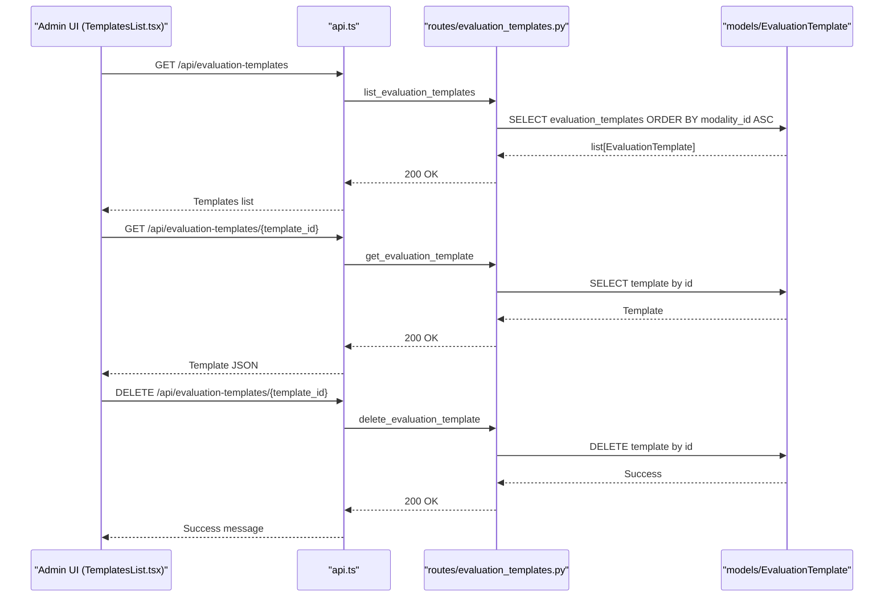

**Diagram sources**
- [frontend/src/pages/admin/TemplatesList.tsx:45-58](file://frontend/src/pages/admin/TemplatesList.tsx#L45-L58)
- [frontend/src/pages/admin/TemplatesList.tsx:60-75](file://frontend/src/pages/admin/TemplatesList.tsx#L60-L75)
- [routes/evaluation_templates.py:42-53](file://routes/evaluation_templates.py#L42-L53)
- [routes/evaluation_templates.py:103-120](file://routes/evaluation_templates.py#L103-L120)
- [routes/evaluation_templates.py:143-171](file://routes/evaluation_templates.py#L143-L171)

**Section sources**
- [frontend/src/pages/admin/TemplatesList.tsx:1-252](file://frontend/src/pages/admin/TemplatesList.tsx#L1-L252)
- [frontend/src/pages/admin/EvaluationTemplateEditor.tsx:1-1241](file://frontend/src/pages/admin/EvaluationTemplateEditor.tsx#L1-L1241)
- [routes/evaluation_templates.py:1-172](file://routes/evaluation_templates.py#L1-L172)
- [models.py:115-129](file://models.py#L115-L129)

### Advanced Category Management System
**New** - Comprehensive hierarchical competition structure management with modalities, categories, and subcategories:

#### Categorias Component
**New** - The new Categorias component provides a complete interface for managing the hierarchical competition structure:

- Tree view displaying modalities, categories, and subcategories with expandable/collapsible sections
- CRUD operations for all three levels with cascading deletes
- Real-time updates and confirmation dialogs
- Empty state handling with call-to-action buttons
- Improved visual hierarchy with icons and badges
- Responsive design with mobile-friendly touch targets

Frontend interactions:
- Load all modalities with nested categories and subcategories
- Display hierarchical tree with expandable/collapsible sections
- Implement add/delete operations with confirmation dialogs
- Handle cascading deletes for parent entities
- Provide visual feedback for loading states and errors

Backend validations and processing:
- Admin-only access to all category management operations
- Unique constraint enforcement for each level (modalidad, categoria, subcategoria)
- Cascade delete operations for hierarchical relationships
- Proper error handling and user feedback

#### Backend API for Category Management
The backend provides comprehensive CRUD operations for the hierarchical structure:
- Modality management: create, list, delete with cascade
- Category management: create within modality, list with nested subcategories, delete with cascade
- Subcategory management: create within category, list, delete
- Relationship validation and constraint enforcement

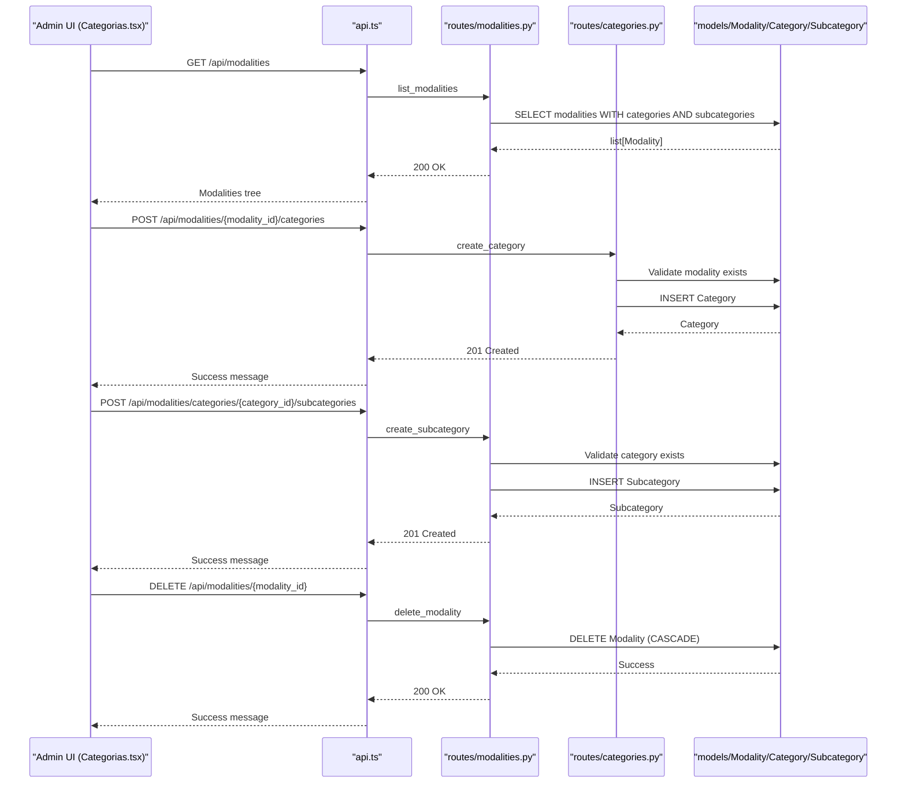

**Diagram sources**
- [frontend/src/pages/admin/Categorias.tsx:38-51](file://frontend/src/pages/admin/Categorias.tsx#L38-L51)
- [frontend/src/pages/admin/Categorias.tsx:70-85](file://frontend/src/pages/admin/Categorias.tsx#L70-L85)
- [frontend/src/pages/admin/Categorias.tsx:87-102](file://frontend/src/pages/admin/Categorias.tsx#L87-L102)
- [frontend/src/pages/admin/Categorias.tsx:104-117](file://frontend/src/pages/admin/Categorias.tsx#L104-L117)
- [routes/modalities.py:18-30](file://routes/modalities.py#L18-L30)
- [routes/modalities.py:54-95](file://routes/modalities.py#L54-L95)
- [routes/modalities.py:144-160](file://routes/modalities.py#L144-L160)
- [routes/categories.py:12-24](file://routes/categories.py#L12-L24)
- [routes/categories.py:48-89](file://routes/categories.py#L48-L89)
- [routes/categories.py:138-154](file://routes/categories.py#L138-L154)
- [routes/categories.py:157-173](file://routes/categories.py#L157-L173)

**Section sources**
- [frontend/src/pages/admin/Categorias.tsx:1-344](file://frontend/src/pages/admin/Categorias.tsx#L1-L344)
- [routes/modalities.py:1-180](file://routes/modalities.py#L1-L180)
- [routes/categories.py:1-174](file://routes/categories.py#L1-L174)
- [models.py:174-225](file://models.py#L174-L225)
- [schemas.py:167-206](file://schemas.py#L167-L206)

### Advanced Evaluation Template Management System
**New** - Comprehensive master template management system with JSON editing capabilities:

#### EvaluationTemplateEditor Component
**New** - The new EvaluationTemplateEditor component provides a dedicated interface for managing master evaluation templates:

- JSON editor with syntax highlighting and validation
- Real-time preview of parsed JSON structure
- Master template loading by ID with comprehensive error handling
- Save functionality with validation and success/error feedback
- Back navigation to templates list
- Template metadata display (modality name, template ID)

Frontend interactions:
- Load template by ID from URL parameters
- Display JSON editor with syntax highlighting
- Show real-time preview of parsed JSON
- Handle save operations with validation
- Provide revert functionality to undo changes
- Navigate back to templates list

Backend validations and processing:
- Admin-only access to template editing
- JSON validation with error handling
- Template content sanitization
- Proper error handling and user feedback

#### Backend API for Evaluation Templates
The backend provides comprehensive CRUD operations for master evaluation templates:
- Template listing with modality information
- Individual template retrieval by ID
- Template retrieval by modality
- Template update with content validation
- Proper error handling and response formatting

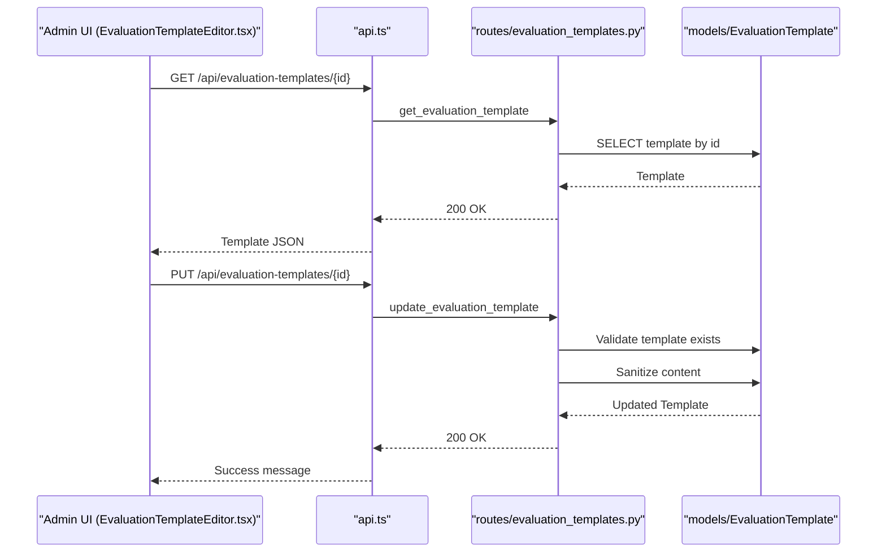

**Diagram sources**
- [frontend/src/pages/admin/EvaluationTemplateEditor.tsx:26-47](file://frontend/src/pages/admin/EvaluationTemplateEditor.tsx#L26-L47)
- [frontend/src/pages/admin/EvaluationTemplateEditor.tsx:57-96](file://frontend/src/pages/admin/EvaluationTemplateEditor.tsx#L57-L96)
- [routes/evaluation_templates.py:103-120](file://routes/evaluation_templates.py#L103-L120)
- [routes/evaluation_templates.py:143-171](file://routes/evaluation_templates.py#L143-L171)

**Section sources**
- [frontend/src/pages/admin/EvaluationTemplateEditor.tsx:1-1241](file://frontend/src/pages/admin/EvaluationTemplateEditor.tsx#L1-L1241)
- [routes/evaluation_templates.py:1-172](file://routes/evaluation_templates.py#L1-L172)
- [models.py:115-129](file://models.py#L115-L129)
- [schemas.py:208-230](file://schemas.py#L208-L230)

### Advanced Judge Assignment Management System
**New** - Sophisticated judge assignment system with section-level assignments, principal judge coordination, and template validation:

#### Judge Assignment Backend API
The new judge assignment system provides comprehensive management of judge assignments:

- **List all judge assignments with template validation and normalization**
- **Get current judge assignment by modality for judge access**
- **Create or update judge assignments with section validation**
- **Delete judge assignments with user modalidades synchronization**
- **Principal judge coordination with automatic deactivation of other principals**

Backend validations and processing:
- Admin-only access to assignment management
- Template-based section validation and normalization
- Principal judge uniqueness enforcement
- User modalidades synchronization after assignment changes
- Comprehensive error handling for invalid sections and missing templates

#### Section-Level Assignment Logic
The system implements sophisticated section-level assignment logic:
- **Extract valid sections from evaluation templates**
- **Normalize assigned sections (remove duplicates, strip whitespace)**
- **Handle bonus section assignment for principal judges**
- **Validate sections against template definitions**
- **Automatic section filtering for bonus sections**

#### User Modalidades Synchronization
The system maintains user modalidades information:
- **Sync user modalidades_asignadas with assigned modalities**
- **Update user.modalidades_asignadas with assigned modalities**
- **Enable judge access to specific modalidades only**

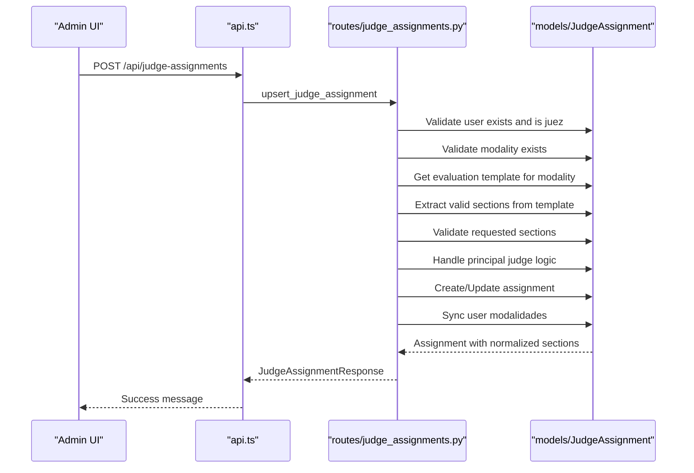

**Diagram sources**
- [routes/judge_assignments.py:164-280](file://routes/judge_assignments.py#L164-L280)
- [routes/judge_assignments.py:45-66](file://routes/judge_assignments.py#L45-L66)
- [routes/judge_assignments.py:69-81](file://routes/judge_assignments.py#L69-L81)

**Section sources**
- [routes/judge_assignments.py:1-308](file://routes/judge_assignments.py#L1-L308)
- [models.py:131-144](file://models.py#L131-L144)
- [schemas.py:197-212](file://schemas.py#L197-L212)
- [frontend/src/lib/judging.ts:113-124](file://frontend/src/lib/judging.ts#L113-L124)

### Enhanced Regulation Management System
**Enhanced** - Comprehensive PDF regulation management system with admin interface and judge access:

#### Admin Interface (Reglamentos.tsx)
The enhanced admin interface provides complete PDF regulation management:
- Upload form with title, modalidad dropdown, and PDF file selection
- Grid layout with upload section and regulations library
- Loading states, success/error messages, and confirmation dialogs
- File drag-and-drop area with PDF validation
- Delete functionality with automatic file cleanup
- View regulations in new browser tabs

Frontend interactions:
- Upload form with validation for required fields
- Grid display of all regulations with modalidad badges
- File viewer modal for PDF preview
- Confirmation dialogs for deletions
- Error handling for upload failures

Backend validations and processing:
- PDF file type validation (.pdf extension only)
- Unique filename generation using UUID
- Database record creation with normalized fields
- Automatic file cleanup on deletion
- Admin-only access enforcement

#### Judge Interface (Reglamentos.tsx)
The judge-facing interface provides filtered access to regulations:
- URL parameter filtering by modalidad
- Separate judge access without admin privileges
- Modalidad-based filtering for relevant regulations
- Direct file viewing with FileViewer component

#### FileViewer Enhancements
The FileViewer component now supports multiple file types:
- PDF preview with embedded viewer
- Image file preview with zoom capability
- Enhanced error handling and loading states
- Direct download option for unsupported file types
- Dynamic URL resolution for local development

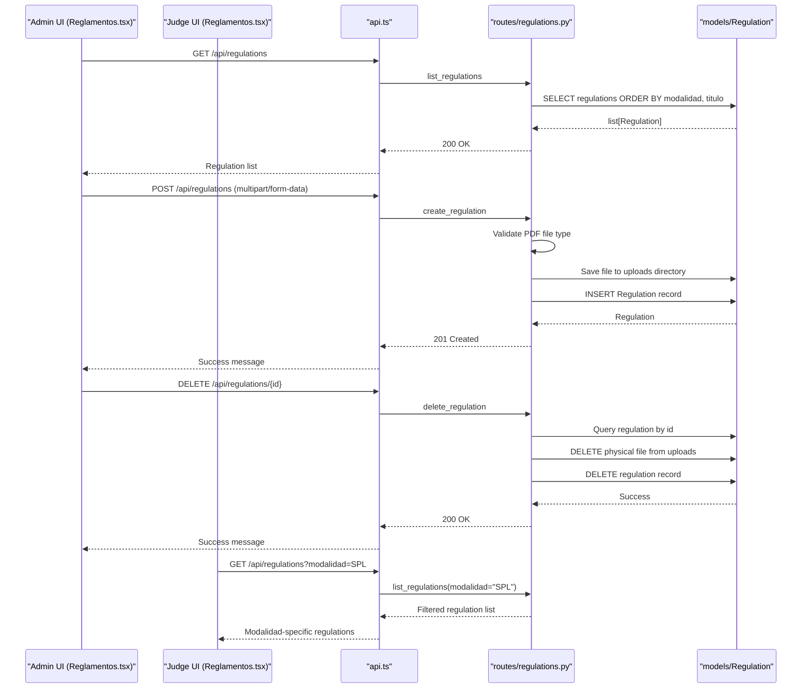

**Diagram sources**
- [frontend/src/pages/admin/Reglamentos.tsx:44-60](file://frontend/src/pages/admin/Reglamentos.tsx#L44-L60)
- [frontend/src/pages/admin/Reglamentos.tsx:69-102](file://frontend/src/pages/admin/Reglamentos.tsx#L69-L102)
- [frontend/src/pages/admin/Reglamentos.tsx:104-121](file://frontend/src/pages/admin/Reglamentos.tsx#L104-L121)
- [frontend/src/pages/juez/Reglamentos.tsx:25-47](file://frontend/src/pages/juez/Reglamentos.tsx#L25-L47)
- [routes/regulations.py:20-64](file://routes/regulations.py#L20-L64)
- [routes/regulations.py:67-79](file://routes/regulations.py#L67-L79)
- [routes/regulations.py:82-109](file://routes/regulations.py#L82-L109)

**Section sources**
- [frontend/src/pages/admin/Reglamentos.tsx:1-302](file://frontend/src/pages/admin/Reglamentos.tsx#L1-L302)
- [frontend/src/pages/juez/Reglamentos.tsx:1-171](file://frontend/src/pages/juez/Reglamentos.tsx#L1-L171)
- [frontend/src/components/FileViewer.tsx:1-157](file://frontend/src/components/FileViewer.tsx#L1-L157)
- [routes/regulations.py:1-110](file://routes/regulations.py#L1-L110)
- [schemas.py:158-165](file://schemas.py#L158-L165)
- [models.py:165-172](file://models.py#L165-L172)

## Dependency Analysis
- Role enforcement: admin-only endpoints rely on get_current_admin
- Token-based auth: OAuth2PasswordBearer and JWT decoding
- Data models: SQLAlchemy ORM with constraints and relationships
- Pydantic schemas: request/response validation and serialization
- **Enhanced template management: centralized list interface with individual CRUD operations**
- **Advanced category management: hierarchical structure with cascading deletes and relationship validation**
- **Sophisticated evaluation template management: master template editing with JSON validation and real-time preview**
- **Enhanced regulation management: file system operations, UUID generation, PDF validation, and modalidad filtering**
- **Judge interface: URL parameter filtering and modalidad-based access control**
- **Enhanced navigation: integrated "Categorías" and "Resultados" sections alongside existing "Reglamentos" navigation**
- **Advanced judge assignment system: template validation, section normalization, and principal judge coordination**
- **Enhanced user management: comprehensive profile editing with enhanced credential update capabilities**

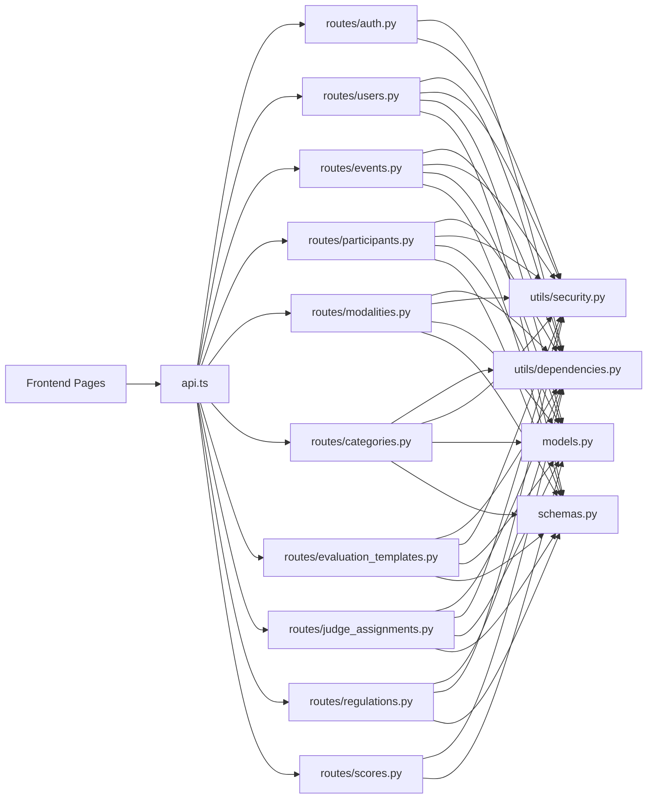

**Diagram sources**
- [frontend/src/lib/api.ts:11-13](file://frontend/src/lib/api.ts#L11-L13)
- [routes/auth.py:12-35](file://routes/auth.py#L12-L35)
- [routes/users.py:18-65](file://routes/users.py#L18-L65)
- [routes/events.py:10-35](file://routes/events.py#L10-L35)
- [routes/participants.py:21-399](file://routes/participants.py#L21-L399)
- [routes/modalities.py:12-180](file://routes/modalities.py#L12-L180)
- [routes/categories.py:12-174](file://routes/categories.py#L12-L174)
- [routes/evaluation_templates.py:12-172](file://routes/evaluation_templates.py#L12-L172)
- [routes/judge_assignments.py:12-308](file://routes/judge_assignments.py#L12-L308)
- [routes/regulations.py:12-12](file://routes/regulations.py#L12-L12)
- [routes/scores.py](file://routes/scores.py)
- [utils/dependencies.py:12-70](file://utils/dependencies.py#L12-L70)
- [utils/security.py:17-39](file://utils/security.py#L17-L39)
- [models.py:11-225](file://models.py#L11-L225)
- [schemas.py:10-303](file://schemas.py#L10-L303)

**Section sources**
- [utils/dependencies.py:1-71](file://utils/dependencies.py#L1-L71)
- [utils/security.py:1-51](file://utils/security.py#L1-L51)
- [models.py:1-225](file://models.py#L1-L225)
- [schemas.py:1-303](file://schemas.py#L1-L303)

## Performance Considerations
- Bulk participant import uses efficient bulk inserts and avoids duplicate checks per row unnecessarily
- Frontend state updates are localized to minimize re-renders
- API calls are guarded by token presence to avoid unnecessary network requests
- **Enhanced template list component implements efficient grid rendering with virtualization for large datasets**
- **TemplatesList uses memoized calculations for template statistics to avoid performance bottlenecks**
- **TemplateBuilder maintains real-time JSON preview with debounced updates for better responsiveness**
- **Advanced EvaluationTemplateEditor implements JSON parsing with memoization for better performance**
- Consider adding pagination for large lists (users, participants, regulations) if scale grows
- **Enhanced regulation uploads use streaming file copying to handle large PDF files efficiently**
- **Template CRUD operations use efficient upsert logic to minimize database round trips**
- **Judge interface uses URL parameters for efficient filtering without full reloads**
- **FileViewer component handles large PDF files with embedded viewer for optimal performance**
- **Advanced category management uses eager loading with joinedload to minimize database queries**
- **Hierarchical structure operations use cascading deletes to maintain data consistency**
- **Advanced category tree rendering uses efficient component updates to handle large hierarchies**
- **Enhanced Event management uses improved UI with better loading states and error handling**
- **Sophisticated judge assignment system uses template caching and efficient section validation**
- **Enhanced user management uses minimal API calls with focused credential updates**
- **Enhanced judge assignment system provides efficient section validation and principal judge coordination**

## Troubleshooting Guide
Common issues and resolutions:
- Authentication failures
  - Cause: invalid credentials or expired/invalid token
  - Resolution: re-login; check token storage; verify JWT secret and expiration settings
  - References: [routes/auth.py:13-35](file://routes/auth.py#L13-L35), [utils/security.py:29-39](file://utils/security.py#L29-L39), [frontend/src/contexts/AuthContext.tsx:95-111](file://frontend/src/contexts/AuthContext.tsx#L95-L111)

- Permission denied (403)
  - Cause: non-admin user attempting admin-only action
  - Resolution: ensure user role is admin; verify get_current_admin guard
  - References: [utils/dependencies.py:32-38](file://utils/dependencies.py#L32-L38), [routes/users.py:29-47](file://routes/users.py#L29-L47), [routes/events.py:21-26](file://routes/events.py#L21-L26), [routes/participants.py:182-189](file://routes/participants.py#L182-L189), [routes/modalities.py:28-28](file://routes/modalities.py#L28-L28), [routes/categories.py:28-28](file://routes/categories.py#L28-L28), [routes/evaluation_templates.py:28-28](file://routes/evaluation_templates.py#L28-L28), [routes/judge_assignments.py:28-28](file://routes/judge_assignments.py#L28-L28)

- Duplicate username or plate
  - Cause: existing record conflict
  - Resolution: change username or plate; ensure uniqueness within event
  - References: [routes/users.py:49-54](file://routes/users.py#L49-L54), [routes/participants.py:160-179](file://routes/participants.py#L160-L179)

- Excel upload errors
  - Cause: wrong format, empty file, missing required columns, or duplicate plates
  - Resolution: ensure .xlsx, include required columns, fix duplicates
  - References: [routes/participants.py:295-299](file://routes/participants.py#L295-L299), [routes/participants.py:322-322](file://routes/participants.py#L322-L322), [routes/participants.py:346-358](file://routes/participants.py#L346-L358), [routes/participants.py:365-373](file://routes/participants.py#L365-L373)

- Template save validation
  - Cause: missing modalidad/categoria or empty sections/criteria
  - Resolution: fill required fields and ensure max points > 0
  - References: [frontend/src/pages/admin/EvaluationTemplateEditor.tsx:185-203](file://frontend/src/pages/admin/EvaluationTemplateEditor.tsx#L185-L203), [routes/evaluation_templates.py:26-53](file://routes/evaluation_templates.py#L26-L53)

- **Advanced judge assignment validation errors**
  - **Cause: invalid sections, missing template, or principal judge conflicts**
  - **Resolution: ensure sections exist in template, assign valid sections, check principal judge uniqueness**
  - **References**: [routes/judge_assignments.py:212-230](file://routes/judge_assignments.py#L212-L230), [routes/judge_assignments.py:232-240](file://routes/judge_assignments.py#L232-L240), [routes/judge_assignments.py:194-198](file://routes/judge_assignments.py#L194-L198)

- **Enhanced template list loading issues**
  - **Cause: network errors, authentication problems, or database connectivity issues**
  - **Resolution: check network connection, verify token validity, ensure database is accessible**
  - **References**: [frontend/src/pages/admin/TemplatesList.tsx:45-58](file://frontend/src/pages/admin/TemplatesList.tsx#L45-L58), [routes/evaluation_templates.py:42-53](file://routes/evaluation_templates.py#L42-L53)

- **Enhanced template deletion errors**
  - **Cause: foreign key constraints, database locks, or permission issues**
  - **Resolution: check for dependent records, ensure admin privileges, retry operation**
  - **References**: [frontend/src/pages/admin/TemplatesList.tsx:60-75](file://frontend/src/pages/admin/TemplatesList.tsx#L60-L75), [routes/evaluation_templates.py:143-171](file://routes/evaluation_templates.py#L143-L171)

- **Advanced category management errors**
  - **Cause: duplicate names within same level, invalid parent relationships, or constraint violations**
  - **Resolution: ensure unique names within same modality/category, verify parent exists, check constraint violations**
  - **References**: [routes/modalities.py:68-88](file://routes/modalities.py#L68-L88), [routes/modalities.py:108-123](file://routes/modalities.py#L108-L123), [routes/modalities.py:156-172](file://routes/modalities.py#L156-L172), [routes/modalities.py:175-191](file://routes/modalities.py#L175-L191), [routes/categories.py:67-84](file://routes/categories.py#L67-L84), [routes/categories.py:88-104](file://routes/categories.py#L88-L104)

- **Advanced evaluation template JSON validation errors**
  - **Cause: invalid JSON format, missing required fields, or content type issues**
  - **Resolution: ensure valid JSON object format, check template structure, verify content type**
  - **References**: [frontend/src/pages/admin/EvaluationTemplateEditor.tsx:57-96](file://frontend/src/pages/admin/EvaluationTemplateEditor.tsx#L57-L96), [routes/evaluation_templates.py:143-171](file://routes/evaluation_templates.py#L143-L171)

- **Enhanced regulation upload errors**
  - **Cause**: non-PDF files, upload failures, or file system permissions
  - **Resolution**: ensure .pdf extension, check server disk space, verify uploads directory permissions
  - References: [routes/regulations.py:29-34](file://routes/regulations.py#L29-L34), [routes/regulations.py:42-49](file://routes/regulations.py#L42-L49)

- **Enhanced regulation deletion errors**
  - **Cause**: missing files, permission issues, or database conflicts
  - **Resolution**: check file existence, verify file permissions, ensure database consistency
  - References: [routes/regulations.py:96-103](file://routes/regulations.py#L96-L103), [routes/regulations.py:105-107](file://routes/regulations.py#L105-L107)

- **Judge interface filtering issues**
  - **Cause**: URL parameter not properly formatted or modalidad not found**
  - **Resolution**: ensure modalidad parameter is correctly passed in URL; verify modalidad exists in database
  - References: [frontend/src/pages/juez/Reglamentos.tsx:17-18](file://frontend/src/pages/juez/Reglamentos.tsx#L17-L18), [routes/regulations.py:68-79](file://routes/regulations.py#L68-L79)

- **Enhanced FileViewer loading issues**
  - **Cause**: PDF not supported by browser, network errors, or file corruption
  - **Resolution**: ensure PDF compatibility, check network connection, verify file integrity
  - References: [frontend/src/components/FileViewer.tsx:98-118](file://frontend/src/components/FileViewer.tsx#L98-L118), [routes/regulations.py:42-49](file://routes/regulations.py#L42-L49)

- **Enhanced Event management UI issues**
  - **Cause**: loading states, confirmation dialogs, or form validation errors
  - **Resolution**: check network connectivity, verify form inputs, ensure proper user interaction with UI elements
  - **References**: [frontend/src/pages/admin/Eventos.tsx:56-76](file://frontend/src/pages/admin/Eventos.tsx#L56-L76), [frontend/src/pages/admin/Eventos.tsx:87-107](file://frontend/src/pages/admin/Eventos.tsx#L87-L107), [frontend/src/pages/admin/Eventos.tsx:142-179](file://frontend/src/pages/admin/Eventos.tsx#L142-L179)

- **Enhanced user profile editing errors**
  - **Cause**: validation failures, duplicate usernames, or authentication issues
  - **Resolution**: ensure username uniqueness, provide valid credentials, verify authentication
  - **References**: [frontend/src/pages/admin/Usuarios.tsx:250-320](file://frontend/src/pages/admin/Usuarios.tsx#L250-L320), [routes/users.py:88-143](file://routes/users.py#L88-L143)

**Section sources**
- [routes/auth.py:13-35](file://routes/auth.py#L13-L35)
- [utils/security.py:29-39](file://utils/security.py#L29-L39)
- [frontend/src/contexts/AuthContext.tsx:95-111](file://frontend/src/contexts/AuthContext.tsx#L95-L111)
- [utils/dependencies.py:32-38](file://utils/dependencies.py#L32-L38)
- [routes/users.py:49-54](file://routes/users.py#L49-L54)
- [routes/participants.py:160-179](file://routes/participants.py#L160-L179)
- [routes/participants.py:295-299](file://routes/participants.py#L295-L299)
- [routes/participants.py:322-358](file://routes/participants.py#L322-L358)
- [frontend/src/pages/admin/EvaluationTemplateEditor.tsx:185-203](file://frontend/src/pages/admin/EvaluationTemplateEditor.tsx#L185-L203)
- [routes/evaluation_templates.py:26-53](file://routes/evaluation_templates.py#L26-L53)
- [frontend/src/pages/admin/TemplatesList.tsx:45-58](file://frontend/src/pages/admin/TemplatesList.tsx#L45-L58)
- [routes/evaluation_templates.py:42-53](file://routes/evaluation_templates.py#L42-L53)
- [frontend/src/pages/admin/TemplatesList.tsx:60-75](file://frontend/src/pages/admin/TemplatesList.tsx#L60-L75)
- [routes/evaluation_templates.py:143-171](file://routes/evaluation_templates.py#L143-L171)
- [routes/modalities.py:68-88](file://routes/modalities.py#L68-L88)
- [routes/modalities.py:108-123](file://routes/modalities.py#L108-L123)
- [routes/modalities.py:156-172](file://routes/modalities.py#L156-L172)
- [routes/modalities.py:175-191](file://routes/modalities.py#L175-L191)
- [routes/categories.py:67-84](file://routes/categories.py#L67-L84)
- [routes/categories.py:88-104](file://routes/categories.py#L88-L104)
- [frontend/src/pages/admin/EvaluationTemplateEditor.tsx:57-96](file://frontend/src/pages/admin/EvaluationTemplateEditor.tsx#L57-L96)
- [routes/evaluation_templates.py:143-171](file://routes/evaluation_templates.py#L143-L171)
- [routes/regulations.py:29-34](file://routes/regulations.py#L29-L34)
- [routes/regulations.py:42-49](file://routes/regulations.py#L42-L49)
- [routes/regulations.py:96-103](file://routes/regulations.py#L96-L103)
- [routes/regulations.py:105-107](file://routes/regulations.py#L105-L107)
- [frontend/src/pages/juez/Reglamentos.tsx:17-18](file://frontend/src/pages/juez/Reglamentos.tsx#L17-L18)
- [frontend/src/components/FileViewer.tsx:98-118](file://frontend/src/components/FileViewer.tsx#L98-L118)
- [frontend/src/pages/admin/Eventos.tsx:56-76](file://frontend/src/pages/admin/Eventos.tsx#L56-L76)
- [frontend/src/pages/admin/Eventos.tsx:87-107](file://frontend/src/pages/admin/Eventos.tsx#L87-L107)
- [frontend/src/pages/admin/Eventos.tsx:142-179](file://frontend/src/pages/admin/Eventos.tsx#L142-L179)
- [routes/judge_assignments.py:212-230](file://routes/judge_assignments.py#L212-L230)
- [routes/judge_assignments.py:232-240](file://routes/judge_assignments.py#L232-L240)
- [routes/judge_assignments.py:194-198](file://routes/judge_assignments.py#L194-L198)
- [frontend/src/pages/admin/Usuarios.tsx:250-320](file://frontend/src/pages/admin/Usuarios.tsx#L250-L320)
- [routes/users.py:88-143](file://routes/users.py#L88-L143)

## Conclusion
The Juzgamiento admin module provides a secure, validated, and user-friendly interface for managing users, events, participants, scoring templates, hierarchical categories, evaluation templates, regulation files, and judge assignments. The frontend integrates tightly with backend endpoints through a centralized API client and robust role-based access control. The backend enforces strict validation and normalization, ensuring data integrity and scalability. The enhanced TemplatesList component significantly enhances template management capabilities with a centralized interface, real-time statistics, and comprehensive CRUD operations. The advanced template workflow provides administrators with efficient tools for creating, managing, and organizing scoring templates across different modalities and categories. The advanced hierarchical category management system provides comprehensive competition structure management with modalities, categories, and subcategories, enabling complex tournament organization. The advanced evaluation template editor provides powerful JSON editing capabilities with validation and real-time preview, allowing administrators to manage master templates effectively. The enhanced regulation management system adds comprehensive PDF handling capabilities with admin-only access, automatic file cleanup, modalidad filtering, and judge access control. The judge interface provides filtered access to regulations based on modalidad, improving accessibility for different user roles. The enhanced navigation system includes dedicated sections for both category management and regulation management, providing administrators with streamlined access to all administrative functions. The improved Eventos component offers a better user experience with enhanced UI, confirmation dialogs, and better error handling. The advanced judge assignment system provides comprehensive judge management with section-level assignments, principal judge coordination, and template validation, enabling precise control over judge responsibilities and access.

## Appendices

### Step-by-Step Usage Instructions
- **Enhanced User Management**
  - Navigate to the Users page
  - Enter username, temporary password, and select modalidades, then submit to create a judge
  - Toggle "Permitir re-editar puntajes" to allow or block score re-editing
  - Click "Editar credenciales" to update username or password for a judge
  - **Use "Editar modalidades" to assign modalidades to judges**
  - **Use "Asignar secciones" to manage judge assignments with section-level control**
  - **Use "Editar mis datos" to update your own profile information**
  - Reference: [frontend/src/pages/admin/Usuarios.tsx:193-96](file://frontend/src/pages/admin/Usuarios.tsx#L193-L96), [frontend/src/pages/admin/Usuarios.tsx:250-320](file://frontend/src/pages/admin/Usuarios.tsx#L250-L320)

- Event Management
  - Navigate to the Events page
  - Enter event name and date, then submit to create
  - Use "Activo/Inactivo" to toggle event state with improved UI feedback
  - Use "Editar" to modify name/date/active flag with enhanced form validation
  - Use "Eliminar" to remove events with confirmation dialog and cascade warnings
  - Reference: [frontend/src/pages/admin/Eventos.tsx:181-215](file://frontend/src/pages/admin/Eventos.tsx#L181-L215), [frontend/src/pages/admin/Eventos.tsx:142-179](file://frontend/src/pages/admin/Eventos.tsx#L142-L179), [frontend/src/pages/admin/Eventos.tsx:435-478](file://frontend/src/pages/admin/Eventos.tsx#L435-L478)

- Participant Management
  - Select an active event from the top selector
  - Upload Excel via drag-and-drop; review summary after upload
  - Use "Añadir Participante Manual" to register individuals with modalities/categories
  - Edit participant records using the "Editar participante" card
  - Reference: [frontend/src/pages/admin/Participantes.tsx:149-187](file://frontend/src/pages/admin/Participantes.tsx#L149-L187), [frontend/src/pages/admin/Participantes.tsx:227-271](file://frontend/src/pages/admin/Participantes.tsx#L227-L271), [frontend/src/pages/admin/Participantes.tsx:299-379](file://frontend/src/pages/admin/Participantes.tsx#L299-L379)

- **Advanced Template Management**
  - **Navigate to the Templates page (/admin/plantillas)**
  - **View all templates in the grid with statistics (sections, criteria, max points)**
  - **Click "Ver JSON" to preview template structure in modal**
  - **Click "Editar" to modify template using EvaluationTemplateEditor**
  - **Click "Eliminar" to remove template (confirmation dialog)**
  - **Click "+ Nueva plantilla por modalidad" to create new template**
  - **EvaluationTemplateEditor: Enter modalidad and content, add sections and criteria, set max points, save template**
  - **EvaluationTemplateEditor: Use edit mode to load existing templates by ID**
  - **EvaluationTemplateEditor: Use modalidad selection to retrieve templates**
  - **Reference**: [frontend/src/pages/admin/TemplatesList.tsx:149-217](file://frontend/src/pages/admin/TemplatesList.tsx#L149-L217), [frontend/src/pages/admin/EvaluationTemplateEditor.tsx:142-190](file://frontend/src/pages/admin/EvaluationTemplateEditor.tsx#L142-L190)

- **Advanced Category Management**
  - **Navigate to the Categories page (/admin/categorias)**
  - **View the hierarchical tree of modalities, categories, and subcategories**
  - **Click "+ Añadir Modalidad" to create new competition modalities**
  - **Click "+ Añadir Categoría" to add categories within a modality**
  - **Use delete buttons with confirmation dialogs for removal**
  - **Parent deletions automatically cascade to child entities**
  - **Reference**: [frontend/src/pages/admin/Categorias.tsx:208-336](file://frontend/src/pages/admin/Categorias.tsx#L208-L336)

- **Advanced Judge Assignment Management**
  - **Navigate to the Judge Assignments page (/admin/plantillas)**
  - **Select "Gestionar Asignaciones" from the templates list**
  - **Use the assignment form to select judge, modality, and sections**
  - **Set "Es Principal" for primary judge assignment**
  - **Sections are automatically validated against template definitions**
  - **Principal judge assignment automatically manages other assignments**
  - **Reference**: [routes/judge_assignments.py:164-280](file://routes/judge_assignments.py#L164-L280), [routes/judge_assignments.py:45-66](file://routes/judge_assignments.py#L45-L66)

- **Enhanced Regulation Management**
  - **Navigate to the Regulations page (/admin/reglamentos)**
  - **Enter regulation title and select modalidad from dropdown**
  - **Click "Toca aquí para seleccionar PDF" to browse for PDF file**
  - **Submit form to upload regulation**
  - **Use "Ver PDF" to download/open regulations**
  - **Use "Eliminar" to remove regulations (confirmation dialog)**
  - **Judge interface: Access regulations filtered by modalidad via URL parameter**
  - **Reference**: [frontend/src/pages/admin/Reglamentos.tsx:69-102](file://frontend/src/pages/admin/Reglamentos.tsx#L69-L102), [frontend/src/pages/admin/Reglamentos.tsx:253-271](file://frontend/src/pages/admin/Reglamentos.tsx#L253-L271), [frontend/src/pages/juez/Reglamentos.tsx:17-18](file://frontend/src/pages/juez/Reglamentos.tsx#L17-L18)

### Security Considerations
- Admin-only endpoints are protected by get_current_admin
- JWT secret and expiration are configurable; ensure production-grade values
- Passwords are hashed with bcrypt; tokens are signed and decoded securely
- Frontend stores tokens in localStorage; ensure HTTPS and secure cookies in production
- **Enhanced template management includes comprehensive validation and admin-only access controls**
- **Template CRUD operations use atomic upsert to maintain data consistency**
- **Advanced category management includes hierarchical validation and cascading delete operations**
- **Advanced category CRUD operations enforce unique constraints at each level**
- **Advanced evaluation template management includes JSON validation and admin-only access controls**
- **Evaluation template updates sanitize content to prevent injection attacks**
- **Enhanced regulation uploads validate file types and generate unique filenames to prevent malicious uploads**
- **File cleanup on deletion ensures no orphaned files remain in the uploads directory**
- **Judge interface uses URL parameters for controlled access without admin privileges**
- **PDF validation prevents unauthorized file types from being uploaded**
- **Enhanced Event management includes improved security with confirmation dialogs and cascade warnings**
- **Advanced judge assignment system includes template validation and principal judge coordination**
- **Enhanced user management includes comprehensive profile editing with enhanced credential update capabilities**

### Backend API Definitions
- Authentication
  - POST /api/login → TokenResponse
  - References: [routes/auth.py:13-35](file://routes/auth.py#L13-L35), [schemas.py:15-19](file://schemas.py#L15-L19)

- Users
  - GET /api/users → list[UserResponse]
  - POST /api/users → UserResponse
  - PUT /api/users/{user_id}/permissions → UserResponse
  - PATCH /api/users/{user_id}/credentials → UserResponse
  - PATCH /api/users/{user_id}/modalidades → UserResponse
  - PATCH /api/users/me/credentials → UserResponse
  - References: [routes/users.py:21-65](file://routes/users.py#L21-L65), [routes/users.py:68-85](file://routes/users.py#L68-L85), [routes/users.py:88-143](file://routes/users.py#L88-L143), [routes/users.py:105-129](file://routes/users.py#L105-L129), [schemas.py:22-45](file://schemas.py#L22-L45)

- Events
  - GET /api/events → list[EventResponse]
  - POST /api/events → EventResponse
  - PATCH /api/events/{event_id} → EventResponse
  - References: [routes/events.py:13-35](file://routes/events.py#L13-L35), [routes/events.py:38-73](file://routes/events.py#L38-L73), [schemas.py:49-68](file://schemas.py#L49-L68)

- Participants
  - GET /api/participants → list[ParticipantResponse]
  - POST /api/participants → ParticipantResponse
  - PUT /api/participants/{participant_id} → ParticipantResponse
  - PATCH /api/participants/{participant_id}/nombres_apellidos → ParticipantResponse
  - POST /api/participants/upload → ParticipantUploadResponse
  - References: [routes/participants.py:259-283](file://routes/participants.py#L259-L283), [routes/participants.py:181-199](file://routes/participants.py#L181-L199), [routes/participants.py:202-230](file://routes/participants.py#L202-L230), [routes/participants.py:233-256](file://routes/participants.py#L233-L256), [routes/participants.py:286-399](file://routes/participants.py#L286-L399), [schemas.py:86-116](file://schemas.py#L86-L116)

- **Advanced Templates**
  - **GET /api/evaluation-templates → list[EvaluationTemplateAdminResponse]**
  - **POST /api/evaluation-templates → EvaluationTemplateAdminResponse**
  - **GET /api/evaluation-templates/{template_id} → EvaluationTemplateAdminResponse**
  - **PUT /api/evaluation-templates/{template_id} → EvaluationTemplateAdminResponse**
  - **DELETE /api/evaluation-templates/{template_id} → SuccessResponse**
  - **References**: [routes/evaluation_templates.py:42-171](file://routes/evaluation_templates.py#L42-L171), [schemas.py:178-192](file://schemas.py#L178-L192)

- **Advanced Categories**
  - **GET /api/modalities → list[ModalityResponse]**
  - **POST /api/modalities → ModalityResponse**
  - **POST /api/modalities/{modality_id}/categories → CategoryResponse**
  - **PUT /api/modalities/categories/{category_id} → CategoryResponse**
  - **DELETE /api/modalities/{modality_id} → SuccessResponse**
  - **DELETE /api/modalities/categories/{category_id} → SuccessResponse**
  - **References**: [routes/modalities.py:18-180](file://routes/modalities.py#L18-L180), [routes/categories.py:12-174](file://routes/categories.py#L12-L174), [schemas.py:167-206](file://schemas.py#L167-L206)

- **Advanced Judge Assignments**
  - **GET /api/judge-assignments → list[JudgeAssignmentResponse]**
  - **GET /api/judge-assignments/me → JudgeAssignmentResponse**
  - **POST /api/judge-assignments → JudgeAssignmentResponse**
  - **DELETE /api/judge-assignments/{assignment_id} → SuccessResponse**
  - **References**: [routes/judge_assignments.py:106-308](file://routes/judge_assignments.py#L106-L308), [schemas.py:208-216](file://schemas.py#L208-L216)

- **Enhanced Regulations**
  - **POST /api/regulations → RegulationResponse**
  - **GET /api/regulations → list[RegulationResponse]**
  - **DELETE /api/regulations/{regulation_id} → SuccessResponse**
  - **References**: [routes/regulations.py:20-109](file://routes/regulations.py#L20-L109), [schemas.py:158-165](file://schemas.py#L158-L165)

- Scores
  - GET /api/scores → list[ScoreResponse]
  - POST /api/scores → ScoreResponse
  - PUT /api/scores/{score_id} → ScoreResponse
  - References: [routes/scores.py](file://routes/scores.py), [schemas.py:137-156](file://schemas.py#L137-L156)

- **Enhanced Navigation**
  - **AdminLayout includes "Categorías", "Resultados" navigation items**
  - **References**: [frontend/src/pages/admin/AdminLayout.tsx:8-16](file://frontend/src/pages/admin/AdminLayout.tsx#L8-L16), [frontend/src/App.tsx:102-114](file://frontend/src/App.tsx#L102-L114)

### Enhanced Navigation Structure
The admin interface now includes comprehensive navigation with the new category management and results sections:

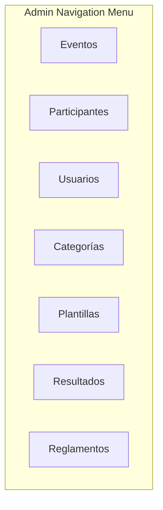

**Section sources**
- [frontend/src/pages/admin/AdminLayout.tsx:8-16](file://frontend/src/pages/admin/AdminLayout.tsx#L8-L16)
- [frontend/src/App.tsx:102-114](file://frontend/src/App.tsx#L102-L114)