# Category Management System

<cite>
**Referenced Files in This Document**
- [main.py](file://main.py)
- [routes/categories.py](file://routes/categories.py)
- [routes/modalities.py](file://routes/modalities.py)
- [models.py](file://models.py)
- [schemas.py](file://schemas.py)
- [database.py](file://database.py)
- [utils/dependencies.py](file://utils/dependencies.py)
- [utils/security.py](file://utils/security.py)
- [frontend/src/pages/admin/Categorias.tsx](file://frontend/src/pages/admin/Categorias.tsx)
- [frontend/src/lib/api.ts](file://frontend/src/lib/api.ts)
- [init_db.py](file://init_db.py)
- [seed_init.py](file://seed_init.py)
- [requirements.txt](file://requirements.txt)
</cite>

## Table of Contents
1. [Introduction](#introduction)
2. [System Architecture](#system-architecture)
3. [Core Components](#core-components)
4. [Database Schema](#database-schema)
5. [API Endpoints](#api-endpoints)
6. [Frontend Implementation](#frontend-implementation)
7. [Security Model](#security-model)
8. [Initialization Process](#initialization-process)
9. [Data Flow Analysis](#data-flow-analysis)
10. [Performance Considerations](#performance-considerations)
11. [Troubleshooting Guide](#troubleshooting-guide)
12. [Conclusion](#conclusion)

## Introduction

The Category Management System is a comprehensive web application designed for managing racing competition categories and modalities. Built with a modern tech stack featuring FastAPI backend and React frontend, the system provides administrators with full control over competition structure management, including modalities (competition types) and categories (division levels) with hierarchical organization.

The system supports real-time category management with CRUD operations, automatic participant assignment based on category levels, and dynamic scoring card generation tailored to specific modalities and categories. It serves as the foundation for car audio and tuning competitions, providing a scalable solution for organizing complex multi-modal competitions.

## System Architecture

The application follows a clean, layered architecture pattern with clear separation of concerns:

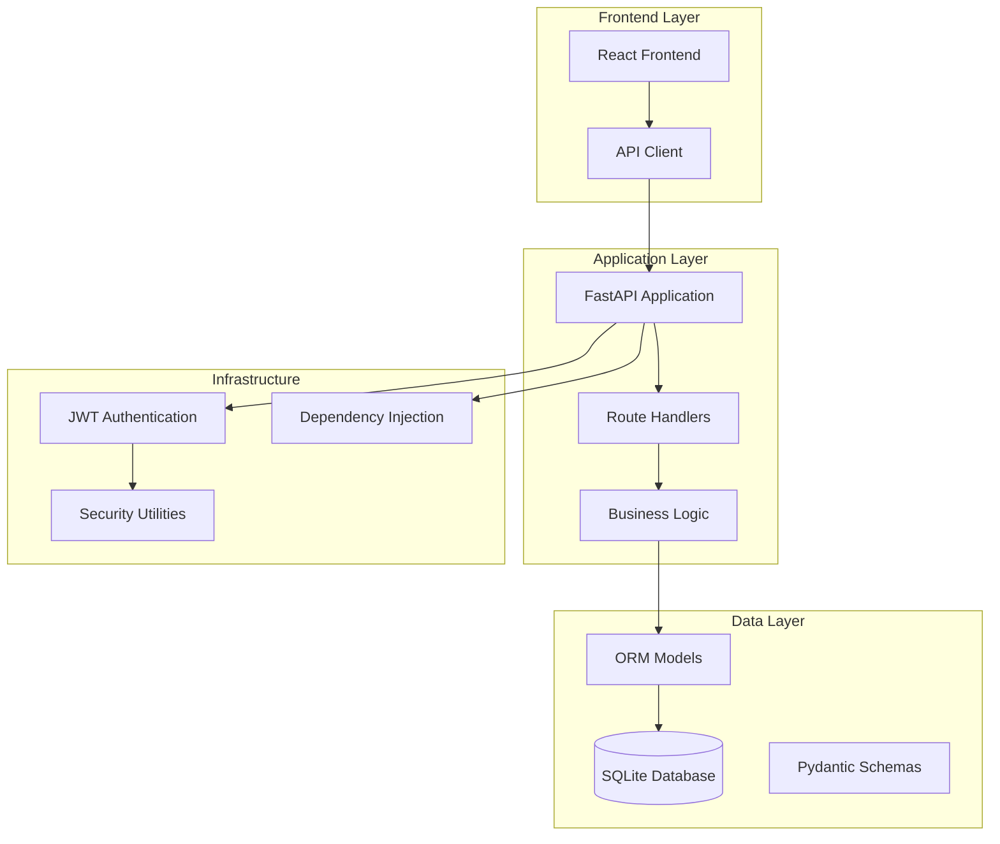

**Diagram sources**
- [main.py:26-48](file://main.py#L26-L48)
- [routes/modalities.py:15](file://routes/modalities.py#L15)
- [database.py:15-34](file://database.py#L15-L34)

The architecture consists of four main layers:

1. **Presentation Layer**: React-based frontend with TypeScript and TailwindCSS styling
2. **Application Layer**: FastAPI backend with route handlers and business logic
3. **Data Layer**: SQLAlchemy ORM with SQLite database storage
4. **Infrastructure Layer**: Authentication, dependency injection, and security utilities

**Section sources**
- [main.py:1-53](file://main.py#L1-L53)
- [routes/modalities.py:1-180](file://routes/modalities.py#L1-L180)

## Core Components

### Backend Application Structure

The FastAPI application serves as the central orchestrator, managing routing, dependency injection, and middleware configuration:

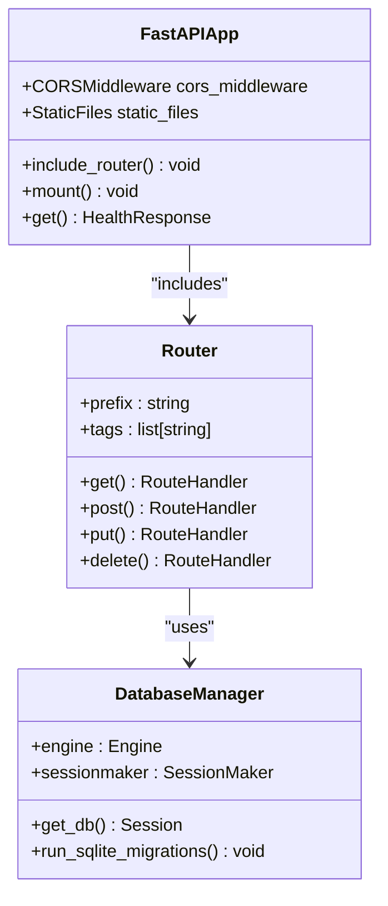

**Diagram sources**
- [main.py:26-48](file://main.py#L26-L48)
- [database.py:20-34](file://database.py#L20-L34)

### Database Model Relationships

The system employs a hierarchical relationship structure between modalities and categories:

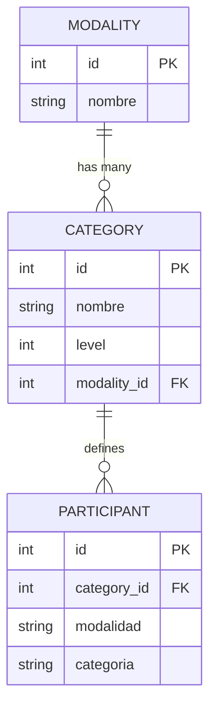

**Diagram sources**
- [models.py:174-225](file://models.py#L174-L225)

**Section sources**
- [main.py:1-53](file://main.py#L1-L53)
- [database.py:1-193](file://database.py#L1-L193)

## Database Schema

The database schema is designed with relational integrity and future extensibility in mind:

### Core Tables

| Table | Purpose | Key Features |
|-------|---------|--------------|
| **users** | Authentication and authorization | Role-based access control, password hashing |
| **modalities** | Competition types (SPL, SQ, SQL, etc.) | Unique naming, hierarchical categories |
| **categories** | Division levels within modalities | Level-based sorting, unique constraints |
| **participants** | Competitor registration | Category foreign keys, legacy compatibility |
| **score_cards** | Evaluation forms and results | JSON structure, status tracking |

### Relationship Constraints

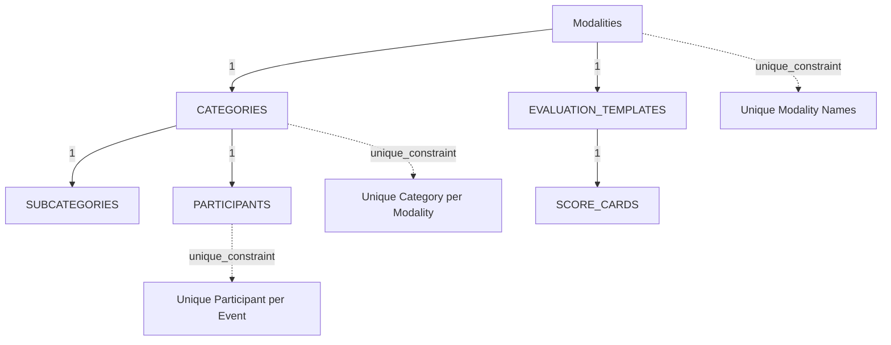

**Diagram sources**
- [models.py:174-225](file://models.py#L174-L225)

**Section sources**
- [models.py:1-225](file://models.py#L1-L225)

## API Endpoints

The system provides a comprehensive REST API for category and modality management:

### Modality Management Endpoints

| Endpoint | Method | Description | Authentication |
|----------|--------|-------------|----------------|
| `/api/modalities` | GET | List all modalities with categories | User |
| `/api/modalities` | POST | Create new modality | Admin |
| `/api/modalities/{modality_id}` | DELETE | Delete modality and categories | Admin |

### Category Management Endpoints

| Endpoint | Method | Description | Authentication |
|----------|--------|-------------|----------------|
| `/api/modalities/{modality_id}/categories` | POST | Create category in modality | Admin |
| `/api/modalities/categories/{category_id}` | PUT | Update category (name/level) | Admin |
| `/api/modalities/categories/{category_id}` | DELETE | Delete category | Admin |

### Request/Response Patterns

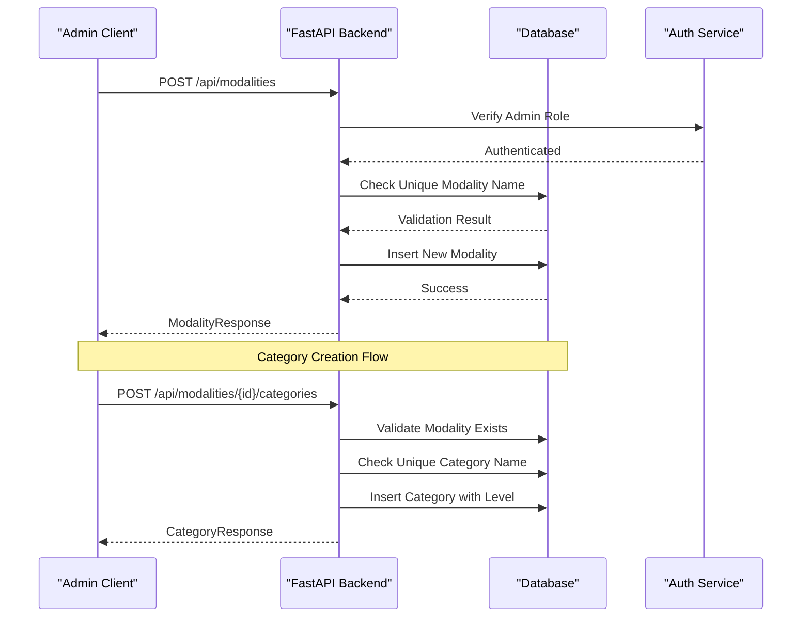

**Diagram sources**
- [routes/modalities.py:33-95](file://routes/modalities.py#L33-L95)
- [routes/categories.py:48-89](file://routes/categories.py#L48-L89)

**Section sources**
- [routes/modalities.py:1-180](file://routes/modalities.py#L1-L180)
- [routes/categories.py:1-174](file://routes/categories.py#L1-L174)

## Frontend Implementation

The React frontend provides an intuitive administrative interface for category management:

### Component Architecture

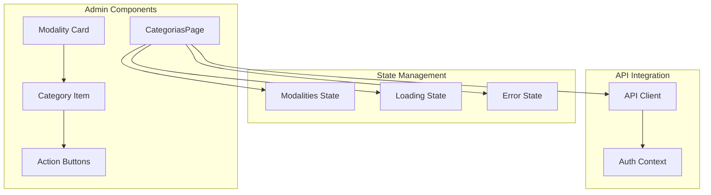

**Diagram sources**
- [frontend/src/pages/admin/Categorias.tsx:19-344](file://frontend/src/pages/admin/Categorias.tsx#L19-L344)

### User Interaction Flow

The frontend implements a seamless CRUD experience with real-time state updates:

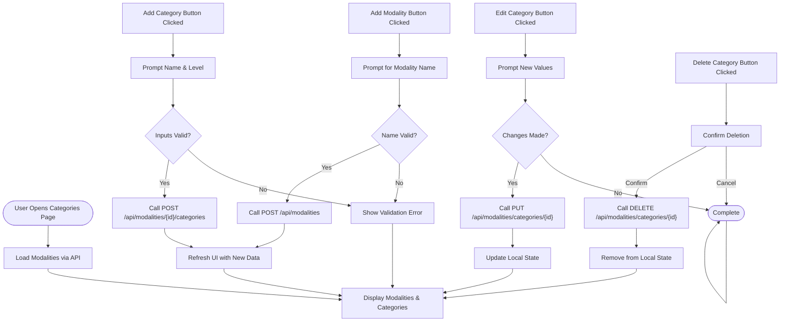

**Diagram sources**
- [frontend/src/pages/admin/Categorias.tsx:61-203](file://frontend/src/pages/admin/Categorias.tsx#L61-L203)

**Section sources**
- [frontend/src/pages/admin/Categorias.tsx:1-344](file://frontend/src/pages/admin/Categorias.tsx#L1-L344)
- [frontend/src/lib/api.ts:1-41](file://frontend/src/lib/api.ts#L1-L41)

## Security Model

The system implements robust security measures including authentication, authorization, and data validation:

### Authentication Flow

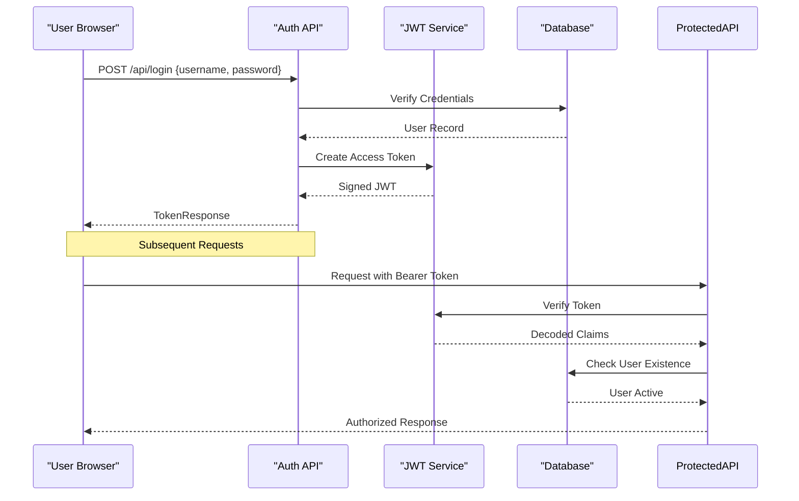

**Diagram sources**
- [routes/auth.py:13-37](file://routes/auth.py#L13-L37)
- [utils/security.py:32-42](file://utils/security.py#L32-L42)

### Authorization Roles

| Role | Permissions | Protected Routes |
|------|-------------|------------------|
| **admin** | Full CRUD operations | All category/modality endpoints |
| **juez** | Read-only access | Public data endpoints |

**Section sources**
- [utils/dependencies.py:16-47](file://utils/dependencies.py#L16-L47)
- [utils/security.py:1-54](file://utils/security.py#L1-L54)

## Initialization Process

The system includes automated initialization scripts for database setup and seeding:

### Database Initialization

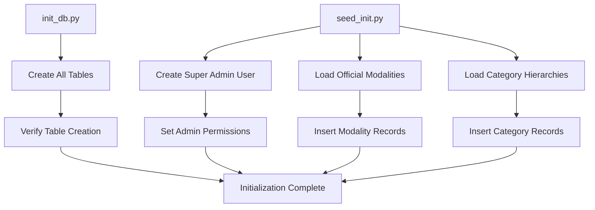

**Diagram sources**
- [init_db.py:23-27](file://init_db.py#L23-L27)
- [seed_init.py:13-104](file://seed_init.py#L13-L104)

### Seed Data Structure

The initialization process loads predefined modalities with their associated categories:

| Modality | Categories |
|----------|------------|
| **SPL** | Intro 1, Intro 2, Aficionado 1, Aficionado 2, Pro 1, Pro 2, Master |
| **SQ** | Intro, Aficionado, Pro, Master |
| **SQL** | Intro, Aficionado, Pro, Master |
| **Street Show** | Intro 1, Intro 2, Aficionado 1, Aficionado 2, Pro 1, Pro 2, Master, Constructor |
| **Tuning** | Intro 1, Intro 2, Aficionado 1, Aficionado 2, Pro 1, Pro 2, Máster, Clasico Tuning, Clasico |
| **Tuning VW** | Clasico hasta el '73, Contemporaneo > '73, Intro VW, Pro VW |

**Section sources**
- [init_db.py:1-32](file://init_db.py#L1-L32)
- [seed_init.py:1-109](file://seed_init.py#L1-L109)

## Data Flow Analysis

The system processes data through well-defined pipelines with validation and transformation at each stage:

### Category Creation Pipeline

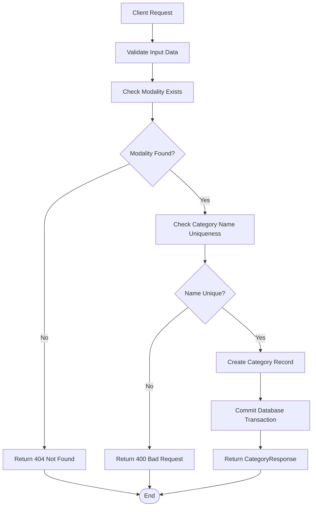

**Diagram sources**
- [routes/modalities.py:54-95](file://routes/modalities.py#L54-L95)

### Data Transformation Pipeline

The system handles complex data transformations between different representations:

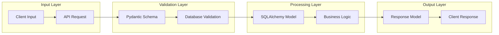

**Diagram sources**
- [schemas.py:139-167](file://schemas.py#L139-L167)
- [models.py:195-225](file://models.py#L195-L225)

**Section sources**
- [routes/modalities.py:1-180](file://routes/modalities.py#L1-L180)
- [schemas.py:1-265](file://schemas.py#L1-L265)

## Performance Considerations

### Database Optimization

The system implements several performance optimization strategies:

1. **Lazy Loading**: Categories are loaded only when requested
2. **Unique Constraints**: Prevents duplicate entries and speeds up queries
3. **Indexing**: Strategic indexing on frequently queried columns
4. **Connection Pooling**: Efficient database connection management

### Frontend Performance

1. **State Management**: Optimistic updates for immediate user feedback
2. **Memoization**: Computed values cached to prevent unnecessary re-renders
3. **Error Boundaries**: Graceful error handling without full page reloads
4. **Loading States**: Progress indicators for long-running operations

### Scalability Factors

| Aspect | Current Limitations | Potential Solutions |
|--------|-------------------|-------------------|
| **Database Size** | SQLite single-file limit | Migration to PostgreSQL/MySQL |
| **Concurrent Users** | Single-threaded nature | Horizontal scaling with load balancer |
| **Data Volume** | File-based storage | Cloud storage integration |
| **API Latency** | Network overhead | CDN for static assets |

## Troubleshooting Guide

### Common Issues and Solutions

#### Authentication Problems
- **Issue**: 401 Unauthorized errors
- **Cause**: Invalid or expired JWT tokens
- **Solution**: Re-authenticate user and check token expiration

#### Database Connection Issues
- **Issue**: OperationalError on startup
- **Cause**: Database file permissions or corruption
- **Solution**: Verify file permissions and run database migration script

#### Duplicate Entry Errors
- **Issue**: 400 Bad Request for duplicate names
- **Cause**: Existing modality/category with same name
- **Solution**: Use unique names or modify existing entries

#### Frontend API Communication
- **Issue**: CORS errors in development
- **Cause**: Different origins between frontend and backend
- **Solution**: Configure CORS middleware properly

### Debugging Tools

1. **Backend Logging**: Enable debug mode for detailed request/response logs
2. **Database Inspection**: Use SQLite browser for schema verification
3. **Network Monitoring**: Browser developer tools for API request inspection
4. **Error Tracking**: Centralized error reporting for production monitoring

**Section sources**
- [utils/dependencies.py:50-71](file://utils/dependencies.py#L50-L71)
- [database.py:36-193](file://database.py#L36-L193)

## Conclusion

The Category Management System represents a robust, scalable solution for organizing competitive racing events with comprehensive administrative capabilities. The system's architecture balances simplicity with functionality, providing administrators with powerful tools to manage complex multi-modal competitions.

Key strengths include:

- **Clean Architecture**: Well-separated concerns with clear boundaries
- **Strong Security**: Role-based access control with JWT authentication
- **Data Integrity**: Comprehensive validation and unique constraints
- **User Experience**: Intuitive frontend with real-time updates
- **Extensibility**: Modular design supporting future enhancements

The system successfully addresses the core requirements of category and modality management while providing a foundation for future expansion into broader competition management capabilities. Its modular design ensures maintainability and adaptability to evolving organizational needs.