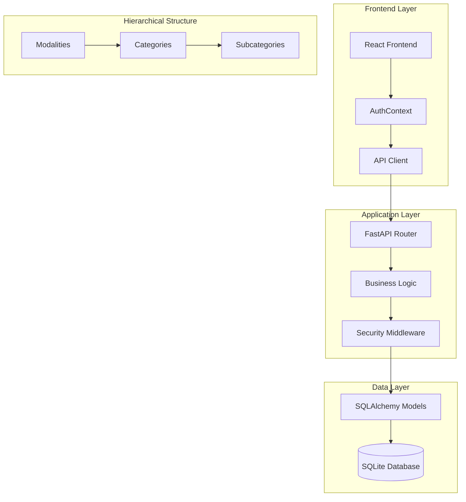
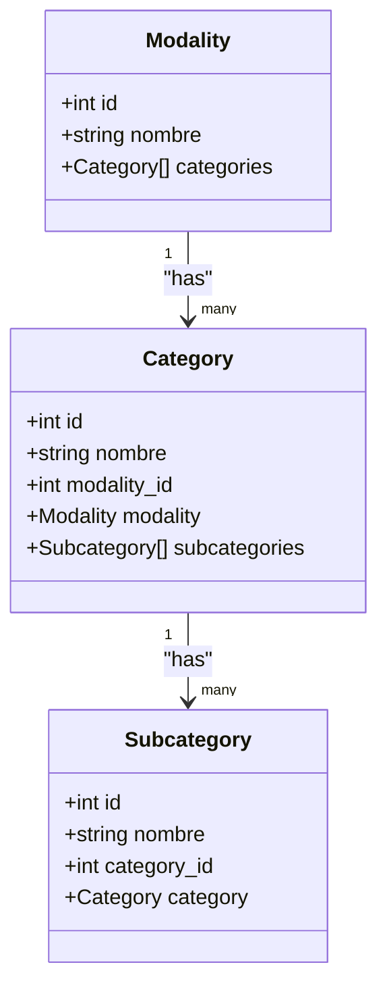
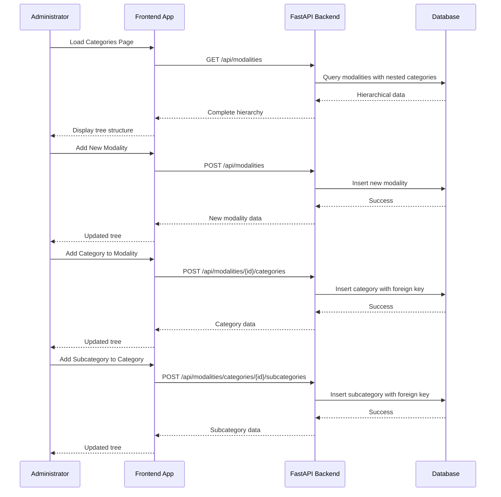
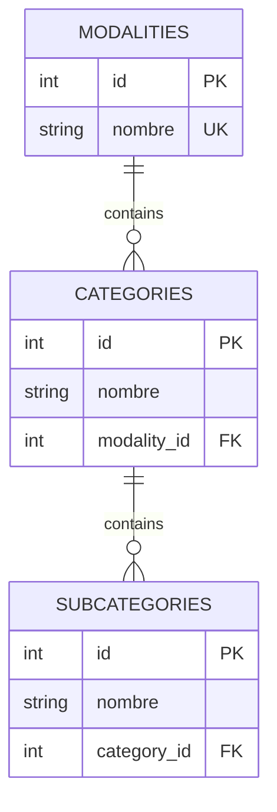
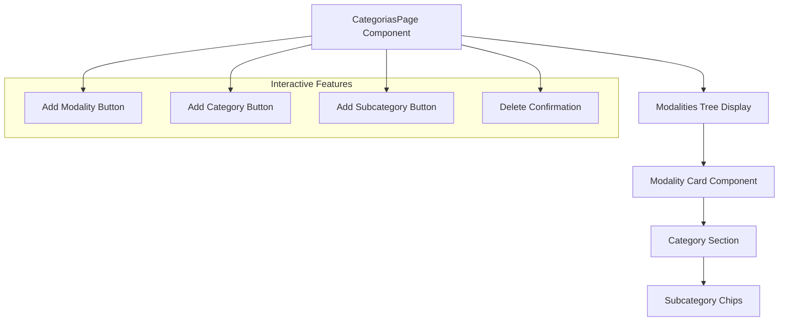
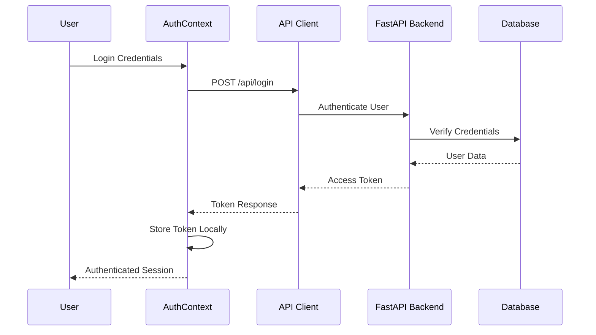

# Category Management

<cite>
**Referenced Files in This Document**
- [categories.py](file://routes/categories.py)
- [modalities.py](file://routes/modalities.py)
- [models.py](file://models.py)
- [schemas.py](file://schemas.py)
- [Categorias.tsx](file://frontend/src/pages/admin/Categorias.tsx)
- [api.ts](file://frontend/src/lib/api.ts)
- [AuthContext.tsx](file://frontend/src/contexts/AuthContext.tsx)
- [database.py](file://database.py)
- [dependencies.py](file://utils/dependencies.py)
- [security.py](file://utils/security.py)
- [main.py](file://main.py)
</cite>

## Table of Contents
1. [Introduction](#introduction)
2. [System Architecture](#system-architecture)
3. [Core Components](#core-components)
4. [Category Management Workflow](#category-management-workflow)
5. [Database Schema](#database-schema)
6. [Frontend Implementation](#frontend-implementation)
7. [Security Model](#security-model)
8. [API Endpoints](#api-endpoints)
9. [Error Handling](#error-handling)
10. [Performance Considerations](#performance-considerations)
11. [Troubleshooting Guide](#troubleshooting-guide)
12. [Conclusion](#conclusion)

## Introduction

The Category Management system is a comprehensive solution for organizing competitive events with hierarchical structure. It manages three-tier competition organization: Modalities (overall competition types), Categories (specific competition divisions), and Subcategories (fine-grained groupings within categories). This system provides administrative capabilities to create, modify, and delete the complete competition hierarchy while maintaining data integrity and security.

The system follows a modern architecture with a FastAPI backend serving structured data through RESTful APIs, and a React frontend providing an intuitive administrative interface. The database uses SQLite with SQLAlchemy ORM for robust data persistence and relationship management.

## System Architecture

The Category Management system follows a layered architecture pattern with clear separation of concerns:

**Diagram sources**
- [main.py:26-44](file://main.py#L26-L44)
- [database.py:15-34](file://database.py#L15-L34)
- [models.py:113-153](file://models.py#L113-L153)

The architecture ensures scalability, maintainability, and clear separation between presentation, business logic, and data persistence layers.

**Section sources**
- [main.py:26-44](file://main.py#L26-L44)
- [database.py:15-34](file://database.py#L15-L34)

## Core Components

### Backend Components

The backend consists of several key components working together to manage the category hierarchy:

#### Database Models
The system uses SQLAlchemy ORM models to represent the hierarchical structure:

**Diagram sources**
- [models.py:113-153](file://models.py#L113-L153)

#### API Routes
The system exposes RESTful endpoints for managing the complete hierarchy:

- **Modalities**: CRUD operations for competition types
- **Categories**: CRUD operations for competition divisions
- **Subcategories**: CRUD operations for fine-grained groupings

#### Request/Response Schemas
Pydantic models define the data structures for validation and serialization:

- **ModalityCreate/Response**: For modalities management
- **CategoryCreate/Response**: For categories management  
- **SubcategoryCreate/Response**: For subcategories management

**Section sources**
- [models.py:113-153](file://models.py#L113-L153)
- [schemas.py:165-202](file://schemas.py#L165-L202)

### Frontend Components

The frontend provides a comprehensive administrative interface:

#### CategoriasPage Component
The main administrative page offering:
- Real-time loading of the complete hierarchy
- Interactive creation of modalities, categories, and subcategories
- Confirmation dialogs for destructive operations
- Responsive design with Tailwind CSS styling

#### Authentication Integration
Seamless integration with the authentication system:
- Automatic token injection in API requests
- Role-based access control (admin-only operations)
- Persistent session management

**Section sources**
- [Categorias.tsx:25-337](file://frontend/src/pages/admin/Categorias.tsx#L25-L337)
- [AuthContext.tsx:66-132](file://frontend/src/contexts/AuthContext.tsx#L66-L132)

## Category Management Workflow

The system implements a comprehensive workflow for managing the competition hierarchy:

**Diagram sources**
- [modalities.py:19-33](file://routes/modalities.py#L19-L33)
- [modalities.py:57-94](file://routes/modalities.py#L57-L94)
- [modalities.py:97-134](file://routes/modalities.py#L97-L134)

The workflow ensures data consistency through cascading relationships and proper validation at each level.

**Section sources**
- [modalities.py:19-33](file://routes/modalities.py#L19-L33)
- [modalities.py:57-94](file://routes/modalities.py#L57-L94)
- [modalities.py:97-134](file://routes/modalities.py#L97-L134)

## Database Schema

The database schema implements a three-tier hierarchical structure with referential integrity:

**Diagram sources**
- [models.py:113-153](file://models.py#L113-L153)

### Key Constraints and Relationships

- **Unique Constraints**: Prevent duplicate names within the same parent entity
- **Foreign Key Relationships**: Maintain referential integrity across hierarchy levels
- **Cascade Operations**: Automatic deletion of child entities when parents are removed
- **Indexing**: Optimized queries on frequently accessed fields

**Section sources**
- [models.py:113-153](file://models.py#L113-L153)

## Frontend Implementation

The frontend implementation provides a comprehensive administrative interface:

### Component Architecture

**Diagram sources**
- [Categorias.tsx:206-333](file://frontend/src/pages/admin/Categorias.tsx#L206-L333)

### User Experience Features

- **Real-time Updates**: Immediate reflection of database changes
- **Confirmation Dialogs**: Prevent accidental deletions
- **Loading States**: Visual feedback during API operations
- **Error Handling**: User-friendly error messages
- **Responsive Design**: Works across different screen sizes

**Section sources**
- [Categorias.tsx:25-337](file://frontend/src/pages/admin/Categorias.tsx#L25-L337)

## Security Model

The system implements a robust security model with role-based access control:

### Authentication Flow

**Diagram sources**
- [AuthContext.tsx:95-111](file://frontend/src/contexts/AuthContext.tsx#L95-L111)
- [security.py:29-39](file://utils/security.py#L29-L39)

### Authorization Controls

- **Role-Based Access**: Only administrators can modify the hierarchy
- **Token Validation**: JWT tokens with expiration handling
- **Automatic Token Injection**: Seamless API authentication
- **Session Persistence**: Secure local storage with token parsing

**Section sources**
- [AuthContext.tsx:95-111](file://frontend/src/contexts/AuthContext.tsx#L95-L111)
- [dependencies.py:32-38](file://utils/dependencies.py#L32-L38)

## API Endpoints

The system provides comprehensive RESTful endpoints for category management:

### Endpoint Catalog

| Method | Endpoint | Description | Authentication |
|--------|----------|-------------|----------------|
| GET | `/api/modalities` | Retrieve complete hierarchy | User |
| POST | `/api/modalities` | Create new modality | Admin |
| POST | `/api/modalities/{modality_id}/categories` | Create category | Admin |
| POST | `/api/modalities/categories/{category_id}/subcategories` | Create subcategory | Admin |
| DELETE | `/api/modalities/{modality_id}` | Delete modality | Admin |
| DELETE | `/api/modalities/categories/{category_id}` | Delete category | Admin |
| DELETE | `/api/modalities/subcategories/{subcategory_id}` | Delete subcategory | Admin |

### Response Patterns

Each endpoint follows consistent response patterns:
- **Success Responses**: Return the created/updated entity data
- **Error Responses**: Standardized error messages with appropriate HTTP status codes
- **Validation**: Input validation using Pydantic models

**Section sources**
- [modalities.py:19-33](file://routes/modalities.py#L19-L33)
- [modalities.py:57-94](file://routes/modalities.py#L57-L94)
- [modalities.py:97-134](file://routes/modalities.py#L97-L134)

## Error Handling

The system implements comprehensive error handling across all layers:

### Backend Error Handling

- **HTTP Status Codes**: Proper mapping of business errors to HTTP status codes
- **Custom Error Messages**: Descriptive error messages for user feedback
- **Validation Errors**: Input validation with detailed error information
- **Database Integrity**: Constraint violations handled gracefully

### Frontend Error Handling

- **Axios Interceptors**: Centralized error processing
- **User-Friendly Messages**: Translated error messages for end users
- **Fallback Handling**: Graceful degradation on network failures
- **Loading States**: Clear indication of operation progress

**Section sources**
- [modalities.py:43-48](file://routes/modalities.py#L43-L48)
- [api.ts:24-40](file://frontend/src/lib/api.ts#L24-L40)

## Performance Considerations

The system is designed with performance optimization in mind:

### Database Optimization

- **Joined Loading**: Efficient queries using joinedload for hierarchical data
- **Indexing**: Strategic indexing on frequently queried fields
- **Connection Pooling**: Optimized database connections
- **Cascade Operations**: Efficient deletion of hierarchical data

### Frontend Optimization

- **State Management**: Efficient React state updates
- **Conditional Rendering**: Only render visible components
- **Error Boundaries**: Prevent cascading failures
- **Memory Management**: Proper cleanup of resources

### Scalability Features

- **Modular Architecture**: Easy to extend with additional hierarchy levels
- **Database Abstraction**: Easy migration to other databases
- **API Design**: Consistent patterns for future enhancements
- **Caching Opportunities**: Potential for adding caching layers

## Troubleshooting Guide

### Common Issues and Solutions

#### Authentication Problems
- **Symptom**: Cannot access administrative functions
- **Cause**: Expired or invalid authentication token
- **Solution**: Re-login to refresh token, check browser console for errors

#### Database Connection Issues
- **Symptom**: API calls fail with database errors
- **Cause**: Database file corruption or permission issues
- **Solution**: Restart application, check database file permissions

#### Hierarchy Conflicts
- **Symptom**: Cannot create entities with duplicate names
- **Cause**: Existing entity with same name in parent scope
- **Solution**: Choose unique names or modify existing entities

#### Network Connectivity
- **Symptom**: Frontend shows loading indefinitely
- **Cause**: Backend service unavailable or CORS issues
- **Solution**: Check backend service status, verify CORS configuration

### Debugging Tools

- **Browser Developer Tools**: Monitor API requests and responses
- **Backend Logs**: Check FastAPI logs for detailed error information
- **Database Queries**: Enable SQL logging for debugging
- **Network Monitoring**: Use browser network tab for request analysis

**Section sources**
- [api.ts:24-40](file://frontend/src/lib/api.ts#L24-L40)
- [database.py:36-93](file://database.py#L36-L93)

## Conclusion

The Category Management system provides a robust, scalable solution for organizing competitive events with hierarchical structure. The system successfully balances functionality, security, and user experience through its layered architecture, comprehensive API design, and intuitive frontend interface.

Key strengths of the system include:

- **Complete Hierarchy Management**: Full support for modalities, categories, and subcategories
- **Strong Security Model**: Role-based access control with JWT authentication
- **User-Friendly Interface**: Intuitive administrative interface with real-time updates
- **Data Integrity**: Robust validation and referential integrity enforcement
- **Scalable Architecture**: Modular design supporting future enhancements

The system serves as an excellent foundation for competitive event management, with clear patterns for extending functionality and integrating with additional systems as requirements evolve.