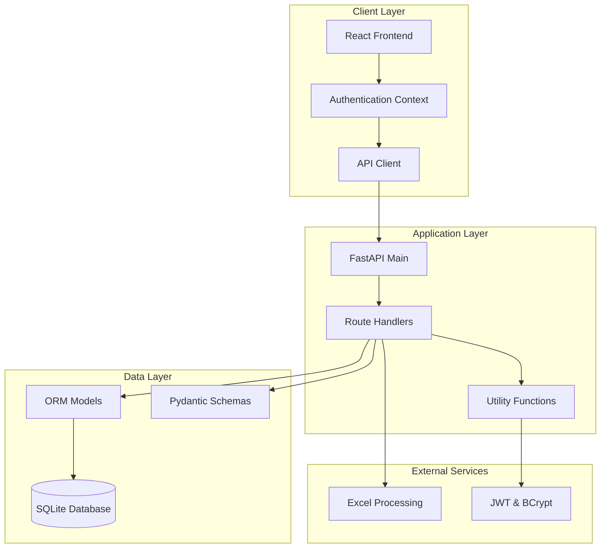
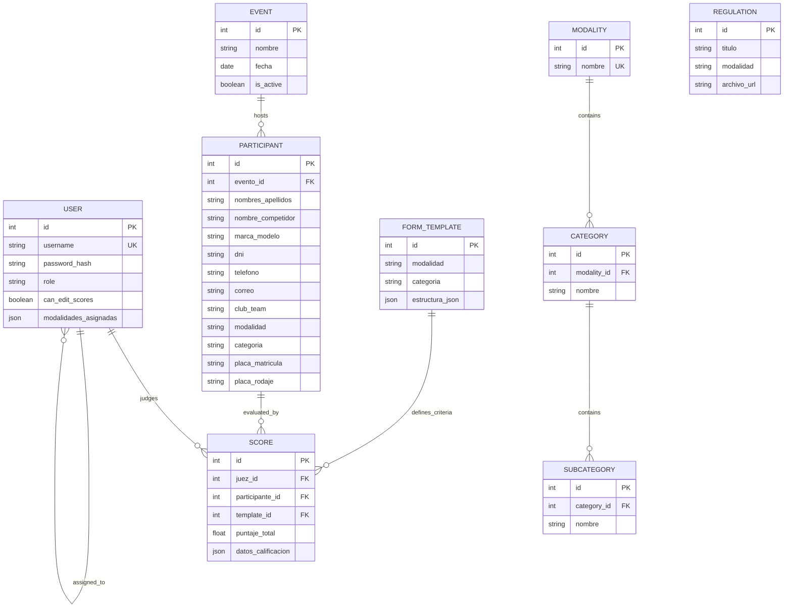
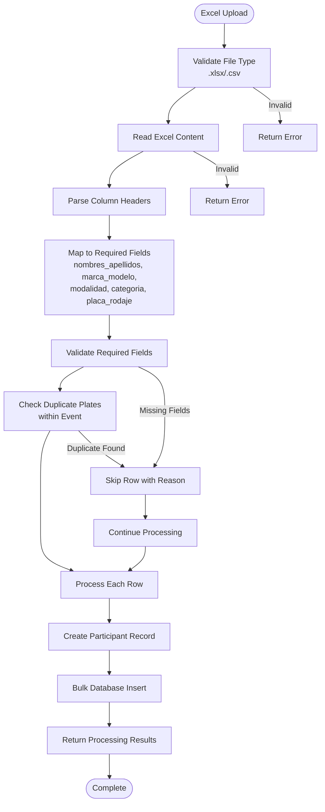
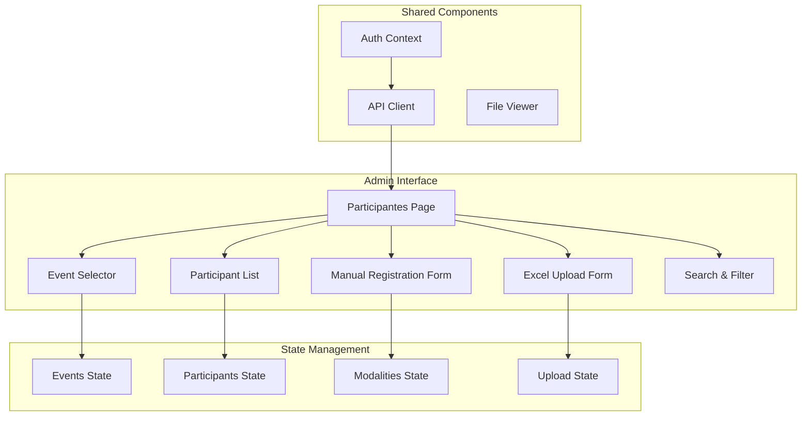
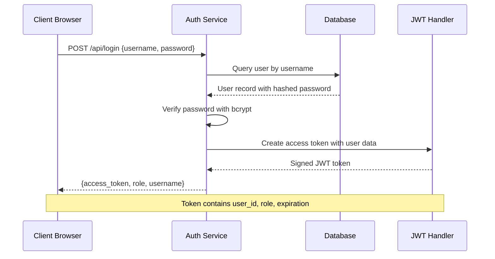

# Enhanced Participant Management

<cite>
**Referenced Files in This Document**
- [main.py](file://main.py)
- [models.py](file://models.py)
- [schemas.py](file://schemas.py)
- [database.py](file://database.py)
- [routes/participants.py](file://routes/participants.py)
- [frontend/src/pages/admin/Participantes.tsx](file://frontend/src/pages/admin/Participantes.tsx)
- [frontend/src/lib/api.ts](file://frontend/src/lib/api.ts)
- [utils/dependencies.py](file://utils/dependencies.py)
- [utils/security.py](file://utils/security.py)
- [routes/auth.py](file://routes/auth.py)
- [routes/events.py](file://routes/events.py)
- [routes/modalities.py](file://routes/modalities.py)
- [frontend/src/contexts/AuthContext.tsx](file://frontend/src/contexts/AuthContext.tsx)
</cite>

## Table of Contents
1. [Introduction](#introduction)
2. [System Architecture](#system-architecture)
3. [Core Components](#core-components)
4. [Data Model](#data-model)
5. [API Endpoints](#api-endpoints)
6. [Frontend Implementation](#frontend-implementation)
7. [Security and Authentication](#security-and-authentication)
8. [Excel Import System](#excel-import-system)
9. [Performance Considerations](#performance-considerations)
10. [Troubleshooting Guide](#troubleshooting-guide)
11. [Conclusion](#conclusion)

## Introduction

The Enhanced Participant Management system is a comprehensive web application designed for managing automotive competition participants with advanced features for bulk data import, flexible categorization, and role-based access control. This system provides administrators with powerful tools to manage participant registration, while judges can efficiently evaluate competitors within their assigned categories.

The platform supports multiple competition modalities (SPL, SQ, SQL, Street Show, Tuning) with hierarchical category structures, enabling complex tournament setups. It features sophisticated Excel import capabilities with intelligent column mapping, duplicate detection, and comprehensive error reporting.

## System Architecture

The system follows a modern full-stack architecture with clear separation of concerns between the backend API, database layer, and React-based frontend.

**Diagram sources**
- [main.py:1-53](file://main.py#L1-L53)
- [routes/participants.py:1-430](file://routes/participants.py#L1-L430)
- [models.py:1-153](file://models.py#L1-L153)

## Core Components

### Backend Application Structure

The backend is built on FastAPI, providing type-safe APIs with automatic OpenAPI documentation generation. The application initializes database connections, configures CORS middleware, and mounts static file serving for uploaded content.

Key application initialization includes:
- Database engine creation with SQLite
- Automatic migration handling for backward compatibility
- CORS configuration for cross-origin requests
- Static file serving for uploaded documents

**Section sources**
- [main.py:1-53](file://main.py#L1-L53)
- [database.py:1-93](file://database.py#L1-L93)

### Database Schema Design

The system uses SQLAlchemy ORM with a comprehensive relational schema supporting complex participant management scenarios. The design emphasizes data integrity through foreign key constraints and unique constraints.

**Section sources**
- [models.py:1-153](file://models.py#L1-L153)
- [database.py:36-93](file://database.py#L36-L93)

## Data Model

The data model consists of interconnected entities representing the competition ecosystem:

**Diagram sources**
- [models.py:11-153](file://models.py#L11-L153)

### Data Validation and Serialization

Pydantic schemas provide comprehensive input validation and response serialization across all API endpoints. The schema system ensures data integrity and provides clear error messages for invalid operations.

**Section sources**
- [schemas.py:1-202](file://schemas.py#L1-L202)

## API Endpoints

The system exposes a RESTful API with comprehensive participant management capabilities:

### Participant Management Endpoints

| Endpoint | Method | Description | Authentication |
|----------|--------|-------------|----------------|
| `/api/participants` | GET | List all participants with filtering | User |
| `/api/participants` | POST | Create new participant | Admin |
| `/api/participants/{id}` | PUT | Update participant details | User/Judge |
| `/api/participants/{id}` | PATCH | Update participant name | Admin |
| `/api/participants/{id}` | DELETE | Remove participant | Admin |
| `/api/participants/upload` | POST | Bulk upload via Excel | Admin |

### Advanced Filtering and Search

The participant listing endpoint supports sophisticated filtering:
- Event-based filtering with `evento_id` parameter
- Text search with `modalidad` and `categoria` parameters
- Case-insensitive partial matching
- Multi-field search across names, plates, and identification numbers

**Section sources**
- [routes/participants.py:289-314](file://routes/participants.py#L289-L314)

### Excel Import Processing

The bulk upload system provides robust data processing with intelligent column mapping and validation:

**Diagram sources**
- [routes/participants.py:316-430](file://routes/participants.py#L316-L430)

**Section sources**
- [routes/participants.py:316-430](file://routes/participants.py#L316-L430)

## Frontend Implementation

The React-based frontend provides an intuitive administrative interface with real-time data synchronization and comprehensive error handling.

### Component Architecture

**Diagram sources**
- [frontend/src/pages/admin/Participantes.tsx:1-798](file://frontend/src/pages/admin/Participantes.tsx#L1-L798)
- [frontend/src/contexts/AuthContext.tsx:1-144](file://frontend/src/contexts/AuthContext.tsx#L1-L144)

### Real-time Event Management

The interface integrates with the event management system, allowing administrators to select active events and filter participants accordingly. The event selector displays only active competitions, ensuring data relevance.

**Section sources**
- [frontend/src/pages/admin/Participantes.tsx:107-121](file://frontend/src/pages/admin/Participantes.tsx#L107-L121)

### Interactive Participant Management

The participant list provides comprehensive CRUD operations with inline editing capabilities. Users can filter participants by various criteria including name, plate number, and identification details.

**Section sources**
- [frontend/src/pages/admin/Participantes.tsx:404-440](file://frontend/src/pages/admin/Participantes.tsx#L404-L440)

## Security and Authentication

The system implements robust security measures including JWT-based authentication, password hashing, and role-based access control.

### Authentication Flow

**Diagram sources**
- [routes/auth.py:13-36](file://routes/auth.py#L13-L36)
- [utils/security.py:17-53](file://utils/security.py#L17-L53)

### Role-Based Access Control

The system distinguishes between two user roles with different permission levels:

| Feature | Administrator | Judge |
|---------|---------------|-------|
| Create Participants | ✅ Full Access | ❌ Restricted |
| Update Participants | ✅ Full Access | ✅ Limited (modalidad, categoria) |
| Delete Participants | ✅ Full Access | ❌ Restricted |
| View All Participants | ✅ Full Access | ✅ Full Access |
| Upload Excel Files | ✅ Full Access | ❌ Restricted |
| Edit Scores | ✅ Full Access | ✅ Limited Access |

**Section sources**
- [utils/dependencies.py:32-47](file://utils/dependencies.py#L32-L47)
- [routes/participants.py:216-238](file://routes/participants.py#L216-L238)

### Password Security

The authentication system uses bcrypt for password hashing and JWT for secure token-based authentication with configurable expiration periods.

**Section sources**
- [utils/security.py:17-53](file://utils/security.py#L17-L53)
- [routes/auth.py:13-36](file://routes/auth.py#L13-L36)

## Excel Import System

The Excel import system provides sophisticated data processing capabilities with comprehensive error handling and validation.

### Column Mapping Engine

The system automatically detects and maps Excel columns to required fields using intelligent normalization:

**Diagram sources**
- [routes/participants.py:70-106](file://routes/participants.py#L70-L106)

### Error Handling and Reporting

The import system provides detailed error reporting with row-specific information:

| Error Type | Description | Impact |
|------------|-------------|--------|
| Missing Columns | Required column not found in Excel | Row skipped |
| Empty Required Fields | Critical fields empty in row | Row skipped with reason |
| Duplicate Plates | Same license plate in same event | Row skipped with reason |
| Invalid File Format | Non-.xlsx/.csv file | Request rejected |
| Empty File | No data rows detected | Request rejected |

**Section sources**
- [routes/participants.py:340-350](file://routes/participants.py#L340-L350)

## Performance Considerations

### Database Optimization

The system implements several performance optimizations:

- **Bulk Operations**: Uses SQLAlchemy's bulk_save_objects for efficient batch inserts during Excel uploads
- **Index Optimization**: Strategic indexing on frequently queried fields (evento_id, modalidad, categoria, placa_rodaje)
- **Connection Pooling**: Efficient database connection management through SQLAlchemy
- **Lazy Loading**: Optimized relationship loading using joinedload for modalities endpoint

### Frontend Performance

- **State Management**: Efficient React state updates with selective re-renders
- **API Caching**: Local storage integration for persistent authentication state
- **Virtual Scrolling**: Large participant lists handled with optimized rendering
- **Debounced Search**: Input debouncing for search operations to reduce API calls

**Section sources**
- [routes/participants.py:410-412](file://routes/participants.py#L410-L412)
- [routes/modalities.py:25-33](file://routes/modalities.py#L25-L33)

## Troubleshooting Guide

### Common Issues and Solutions

#### Authentication Problems
- **Issue**: Login fails with invalid credentials
- **Solution**: Verify username exists and password matches hash
- **Debug**: Check JWT secret key and token expiration settings

#### Excel Upload Failures
- **Issue**: Excel upload returns "Missing required column" error
- **Solution**: Ensure Excel contains required columns (nombres_apellidos, marca_modelo, modalidad, categoria, placa_rodaje)
- **Debug**: Verify column names are spelled correctly and not duplicated

#### Duplicate Participant Errors
- **Issue**: "Ya existe un participante con esa placa en el evento seleccionado"
- **Solution**: Change the license plate number or select a different event
- **Debug**: Check existing participant records in the database

#### Permission Denied Errors
- **Issue**: "Solo un administrador puede realizar esta acción"
- **Solution**: Log in with administrator credentials or contact system administrator
- **Debug**: Verify user role in JWT token payload

**Section sources**
- [routes/participants.py:175-178](file://routes/participants.py#L175-L178)
- [utils/dependencies.py:32-38](file://utils/dependencies.py#L32-L38)

### Database Migration Issues

The system includes automatic migration support for backward compatibility:

- **Legacy Column Support**: Automatically adds missing columns to existing participant tables
- **Data Backfill**: Transfers data from legacy column names to new standardized names
- **Unique Constraint Enforcement**: Ensures data integrity across migration boundaries

**Section sources**
- [database.py:36-93](file://database.py#L36-L93)

## Conclusion

The Enhanced Participant Management system provides a robust, scalable solution for automotive competition management. Its comprehensive feature set, including advanced Excel import capabilities, sophisticated categorization system, and role-based access control, makes it suitable for complex tournament environments.

Key strengths of the system include:

- **Flexible Data Import**: Intelligent Excel processing with comprehensive error reporting
- **Hierarchical Organization**: Multi-level categorization supporting complex competition structures  
- **Strong Security**: JWT-based authentication with bcrypt password hashing
- **Performance Optimization**: Bulk operations and efficient database queries
- **User Experience**: Intuitive React interface with real-time data synchronization

The system's modular architecture and comprehensive documentation make it maintainable and extensible for future enhancements while providing immediate value for competition management needs.