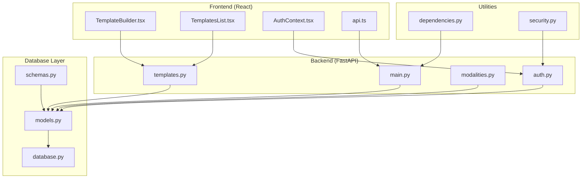
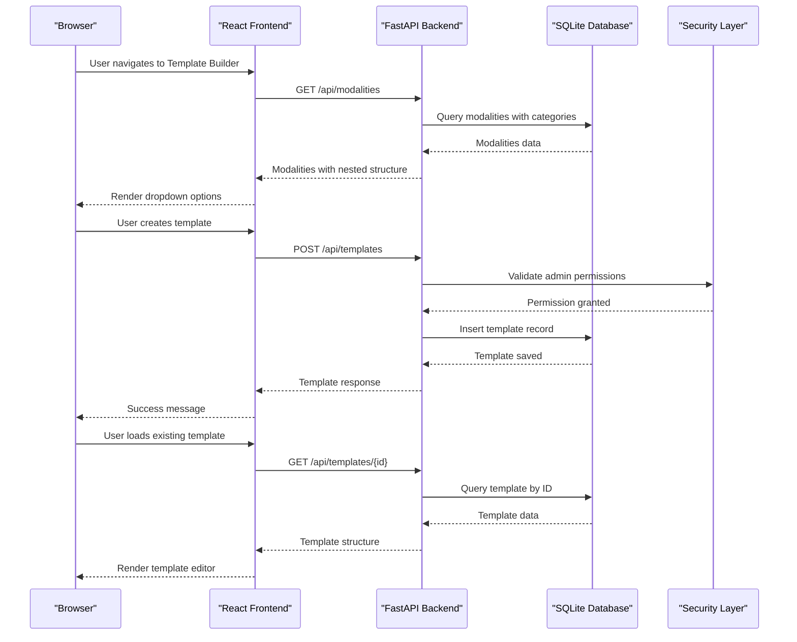
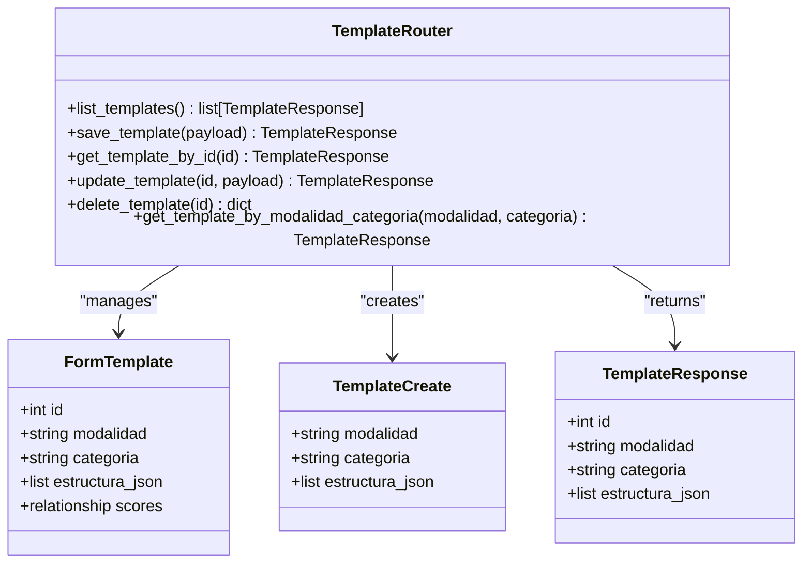
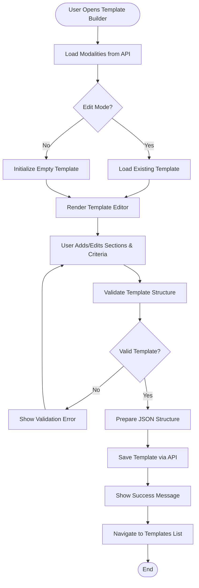
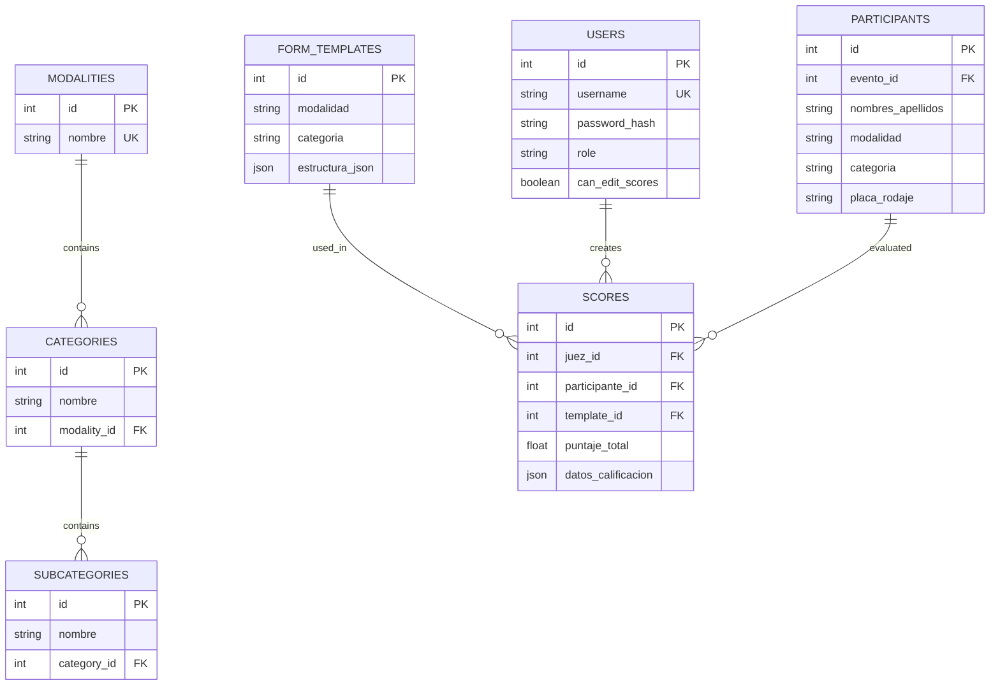
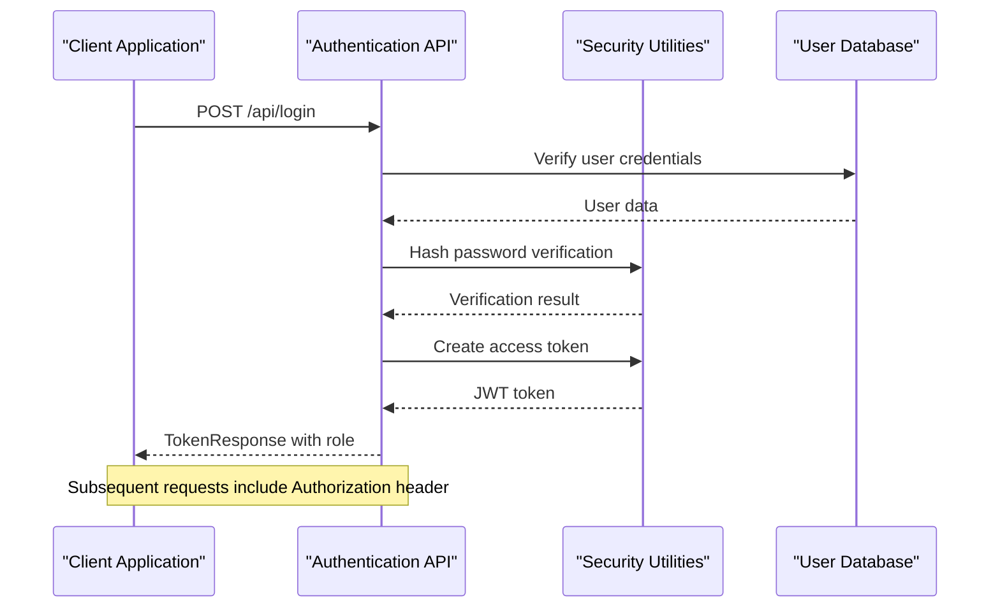

# Enhanced Template Builder

<cite>
**Referenced Files in This Document**
- [main.py](file://main.py)
- [routes/templates.py](file://routes/templates.py)
- [frontend/src/pages/admin/TemplateBuilder.tsx](file://frontend/src/pages/admin/TemplateBuilder.tsx)
- [models.py](file://models.py)
- [schemas.py](file://schemas.py)
- [database.py](file://database.py)
- [utils/dependencies.py](file://utils/dependencies.py)
- [frontend/src/lib/api.ts](file://frontend/src/lib/api.ts)
- [routes/modalities.py](file://routes/modalities.py)
- [frontend/src/pages/admin/TemplatesList.tsx](file://frontend/src/pages/admin/TemplatesList.tsx)
- [frontend/src/contexts/AuthContext.tsx](file://frontend/src/contexts/AuthContext.tsx)
- [routes/auth.py](file://routes/auth.py)
- [utils/security.py](file://utils/security.py)
</cite>

## Table of Contents
1. [Introduction](#introduction)
2. [Project Structure](#project-structure)
3. [Core Components](#core-components)
4. [Architecture Overview](#architecture-overview)
5. [Detailed Component Analysis](#detailed-component-analysis)
6. [Template Management System](#template-management-system)
7. [Database Schema](#database-schema)
8. [Security and Authentication](#security-and-authentication)
9. [Frontend Implementation](#frontend-implementation)
10. [Performance Considerations](#performance-considerations)
11. [Troubleshooting Guide](#troubleshooting-guide)
12. [Conclusion](#conclusion)

## Introduction

The Enhanced Template Builder is a comprehensive web application designed for managing evaluation templates in competitive car audio and tuning events. This system allows administrators to create, edit, and manage structured evaluation forms with customizable sections and criteria, while providing judges with streamlined scoring capabilities.

The application features a modern React-based frontend with TypeScript integration, backed by a FastAPI Python backend using SQLAlchemy ORM for data persistence. It implements role-based access control, real-time template validation, and provides a robust template management system that supports complex evaluation structures.

## Project Structure

The project follows a clean separation of concerns with distinct frontend and backend components:

**Diagram sources**
- [main.py:1-53](file://main.py#L1-L53)
- [routes/templates.py:1-134](file://routes/templates.py#L1-L134)
- [frontend/src/pages/admin/TemplateBuilder.tsx:1-539](file://frontend/src/pages/admin/TemplateBuilder.tsx#L1-L539)

**Section sources**
- [main.py:1-53](file://main.py#L1-L53)
- [routes/templates.py:1-134](file://routes/templates.py#L1-L134)

## Core Components

### Backend Application Core

The FastAPI application serves as the central hub for all template management operations, providing RESTful APIs for CRUD operations on evaluation templates.

### Frontend Template Builder Interface

A sophisticated React-based interface that enables administrators to create complex evaluation templates with real-time validation and JSON preview capabilities.

### Database Management System

SQLite-based storage with SQLAlchemy ORM providing type-safe data operations and automatic schema migrations.

**Section sources**
- [main.py:26-47](file://main.py#L26-L47)
- [frontend/src/pages/admin/TemplateBuilder.tsx:30-81](file://frontend/src/pages/admin/TemplateBuilder.tsx#L30-L81)
- [database.py:15-34](file://database.py#L15-L34)

## Architecture Overview

The system implements a client-server architecture with clear separation between presentation, business logic, and data layers:

**Diagram sources**
- [frontend/src/pages/admin/TemplateBuilder.tsx:54-105](file://frontend/src/pages/admin/TemplateBuilder.tsx#L54-L105)
- [routes/templates.py:26-53](file://routes/templates.py#L26-L53)
- [routes/modalities.py:19-33](file://routes/modalities.py#L19-L33)

## Detailed Component Analysis

### Template Management API

The template management system provides comprehensive CRUD operations with intelligent upsert functionality based on modality and category combinations.

**Diagram sources**
- [routes/templates.py:13-134](file://routes/templates.py#L13-L134)
- [schemas.py:120-133](file://schemas.py#L120-L133)
- [models.py:72-84](file://models.py#L72-L84)

**Section sources**
- [routes/templates.py:13-134](file://routes/templates.py#L13-L134)
- [schemas.py:120-133](file://schemas.py#L120-L133)

### Template Builder Frontend Component

The Template Builder provides an intuitive drag-and-drop interface for creating complex evaluation templates with real-time validation and preview capabilities.

**Diagram sources**
- [frontend/src/pages/admin/TemplateBuilder.tsx:73-105](file://frontend/src/pages/admin/TemplateBuilder.tsx#L73-L105)
- [frontend/src/pages/admin/TemplateBuilder.tsx:207-277](file://frontend/src/pages/admin/TemplateBuilder.tsx#L207-L277)

**Section sources**
- [frontend/src/pages/admin/TemplateBuilder.tsx:30-81](file://frontend/src/pages/admin/TemplateBuilder.tsx#L30-L81)
- [frontend/src/pages/admin/TemplateBuilder.tsx:207-277](file://frontend/src/pages/admin/TemplateBuilder.tsx#L207-L277)

## Template Management System

### Template Structure Definition

Each template consists of hierarchical sections containing evaluation criteria with maximum point allocations:

| Property | Type | Description |
|----------|------|-------------|
| `modalidad` | string | Competition discipline (e.g., "Car Audio", "Tuning") |
| `categoria` | string | Specific category within modality (e.g., "Street", "Track") |
| `estructura_json` | array | Hierarchical template definition |

### Template Creation Workflow

The system supports two primary creation scenarios:

1. **New Template Creation**: Direct POST operation with modality and category
2. **Template Upsert**: Automatic replacement when modality+category combination exists

### Validation Rules

Templates undergo comprehensive validation before saving:

- Both modality and category must be provided
- Each section requires a non-empty title
- Each criterion requires a name and positive maximum points
- Duplicate modality+category combinations are prevented

**Section sources**
- [routes/templates.py:26-53](file://routes/templates.py#L26-L53)
- [frontend/src/pages/admin/TemplateBuilder.tsx:214-232](file://frontend/src/pages/admin/TemplateBuilder.tsx#L214-L232)

## Database Schema

The system uses a normalized SQLite schema with foreign key relationships and unique constraints:

**Diagram sources**
- [models.py:72-101](file://models.py#L72-L101)
- [models.py:113-153](file://models.py#L113-L153)

**Section sources**
- [models.py:72-101](file://models.py#L72-L101)
- [models.py:113-153](file://models.py#L113-L153)

## Security and Authentication

### Role-Based Access Control

The system implements a two-tier permission model:

- **Admin Users**: Full template management capabilities
- **Judge Users**: Read-only access to templates and scoring functionality

### Authentication Flow

**Diagram sources**
- [routes/auth.py:13-35](file://routes/auth.py#L13-L35)
- [utils/security.py:32-42](file://utils/security.py#L32-L42)

**Section sources**
- [routes/auth.py:13-35](file://routes/auth.py#L13-L35)
- [utils/dependencies.py:32-38](file://utils/dependencies.py#L32-L38)

## Frontend Implementation

### Template Builder Interface

The frontend provides a comprehensive template creation interface with the following key features:

#### Real-Time Validation
- Immediate feedback on template structure validity
- Dynamic validation of section and criterion requirements
- Prevents invalid template submissions

#### Interactive Template Editor
- Drag-and-drop section management
- Inline criterion editing with validation
- Real-time JSON preview generation

#### User Experience Features
- Responsive design supporting various screen sizes
- Intuitive form controls with clear labeling
- Comprehensive error messaging and success notifications

### Templates List Management

The templates list provides administrative oversight with:

- Grid-based template display with summary statistics
- Quick action buttons for preview, edit, and delete operations
- Confirmation dialogs for destructive operations
- Real-time template filtering and sorting

**Section sources**
- [frontend/src/pages/admin/TemplateBuilder.tsx:287-538](file://frontend/src/pages/admin/TemplateBuilder.tsx#L287-L538)
- [frontend/src/pages/admin/TemplatesList.tsx:91-283](file://frontend/src/pages/admin/TemplatesList.tsx#L91-L283)

## Performance Considerations

### Database Optimization

The system implements several performance optimizations:

- **Connection Pooling**: SQLAlchemy session management for efficient database connections
- **Lazy Loading**: Eager loading of related entities to minimize N+1 query problems
- **Indexing Strategy**: Strategic indexing on frequently queried fields (modalidad, categoria, timestamps)
- **Unique Constraints**: Prevents duplicate template entries and ensures data integrity

### Frontend Performance

- **State Management**: Efficient React state updates with minimal re-renders
- **Memoization**: useMemo hooks for expensive calculations (template previews)
- **Conditional Rendering**: Optimized rendering based on user actions and loading states
- **Image Optimization**: Proper handling of static assets and file uploads

### API Response Optimization

- **Pagination Support**: Scalable template listing with potential pagination
- **Selective Field Loading**: Response models limit data transfer to essential fields
- **Caching Strategies**: Potential for implementing caching layers for frequently accessed templates

## Troubleshooting Guide

### Common Issues and Solutions

#### Template Creation Failures
- **Issue**: Templates not saving despite valid input
- **Solution**: Verify modality and category uniqueness constraints
- **Prevention**: Implement real-time validation for modality+category combinations

#### Authentication Problems
- **Issue**: Users unable to log in or access protected routes
- **Solution**: Check JWT secret key configuration and token expiration settings
- **Prevention**: Implement proper error handling for expired tokens

#### Database Migration Issues
- **Issue**: Schema inconsistencies after updates
- **Solution**: Review migration scripts and ensure proper rollback procedures
- **Prevention**: Test migrations on staging environments before production deployment

#### Frontend State Synchronization
- **Issue**: Template editor not reflecting server-side changes
- **Solution**: Implement proper state synchronization and error boundaries
- **Prevention**: Add comprehensive error handling and user feedback mechanisms

**Section sources**
- [routes/templates.py:63-68](file://routes/templates.py#L63-L68)
- [utils/dependencies.py:50-70](file://utils/dependencies.py#L50-L70)
- [database.py:36-93](file://database.py#L36-L93)

## Conclusion

The Enhanced Template Builder represents a comprehensive solution for managing evaluation templates in competitive car audio and tuning events. The system successfully combines modern frontend development practices with robust backend architecture to provide administrators with powerful template management capabilities while ensuring judges have access to well-structured evaluation forms.

Key strengths of the implementation include:

- **Intuitive User Interface**: The React-based template builder provides an excellent user experience for creating complex evaluation structures
- **Robust Data Management**: SQLAlchemy ORM ensures type safety and maintains data integrity across the system
- **Security Implementation**: Role-based access control and JWT authentication provide secure access to system resources
- **Scalable Architecture**: Clean separation of concerns enables easy maintenance and future enhancements

The system's modular design and comprehensive validation mechanisms make it suitable for deployment in production environments while maintaining flexibility for future feature additions and customization requirements.