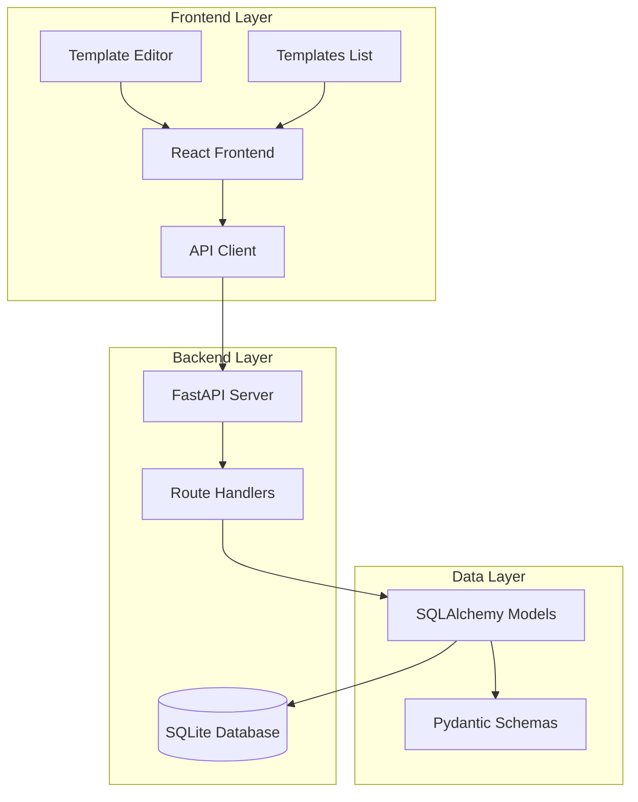
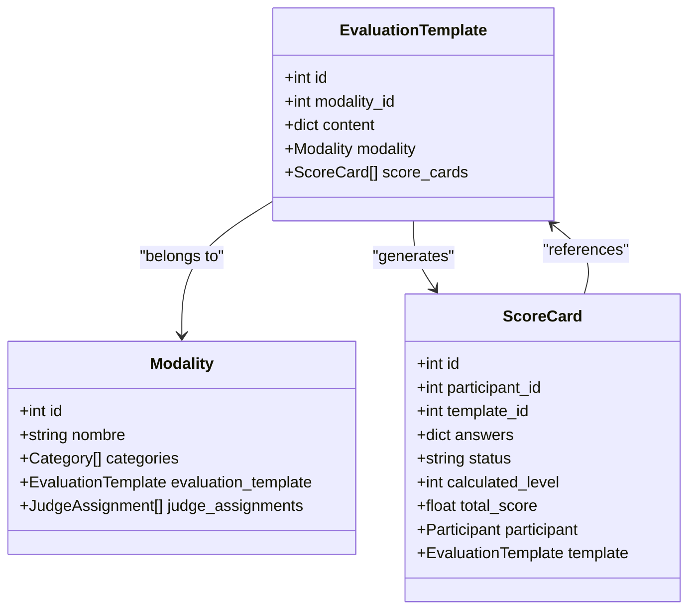
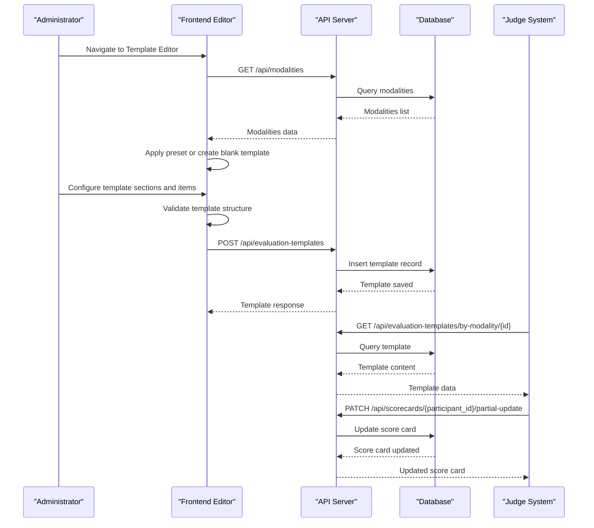
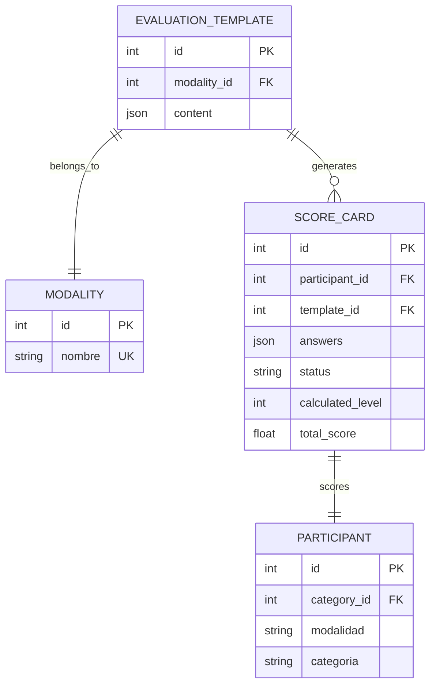
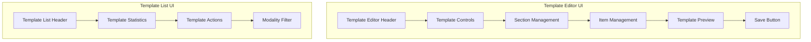
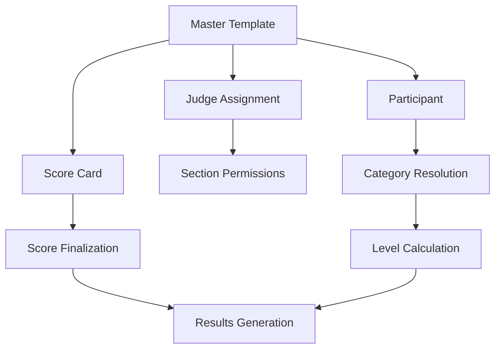

# Evaluation Template Management

<cite>
**Referenced Files in This Document**
- [evaluation_templates.py](file://routes/evaluation_templates.py)
- [models.py](file://models.py)
- [schemas.py](file://schemas.py)
- [EvaluationTemplateEditor.tsx](file://frontend/src/pages/admin/EvaluationTemplateEditor.tsx)
- [TemplatesList.tsx](file://frontend/src/pages/admin/TemplatesList.tsx)
- [judging.ts](file://frontend/src/lib/judging.ts)
- [api.ts](file://frontend/src/lib/api.ts)
- [main.py](file://main.py)
- [database.py](file://database.py)
- [modalities.py](file://routes/modalities.py)
- [scorecards.py](file://routes/scorecards.py)
- [AdminLayout.tsx](file://frontend/src/pages/admin/AdminLayout.tsx)
</cite>

## Table of Contents
1. [Introduction](#introduction)
2. [System Architecture](#system-architecture)
3. [Core Components](#core-components)
4. [Template Management Workflow](#template-management-workflow)
5. [Data Model Architecture](#data-model-architecture)
6. [Frontend Implementation](#frontend-implementation)
7. [Template Validation and Processing](#template-validation-and-processing)
8. [Integration with Scoring System](#integration-with-scoring-system)
9. [Security and Access Control](#security-and-access-control)
10. [Performance Considerations](#performance-considerations)
11. [Troubleshooting Guide](#troubleshooting-guide)
12. [Conclusion](#conclusion)

## Introduction

The Evaluation Template Management system is a comprehensive solution for managing standardized evaluation forms across different modalities in automotive competition scoring systems. This system enables administrators to create, edit, and maintain master evaluation templates that serve as the foundation for scoring participants across various competition categories.

The system consists of a FastAPI backend with SQLAlchemy ORM for data persistence, and a React-based frontend with TypeScript for template editing and management. Each competition modality (such as Tuning, SPL, SQ, etc.) maintains a single master template that defines the evaluation criteria, scoring scales, and categorization options.

## System Architecture

The evaluation template management system follows a client-server architecture with clear separation of concerns:

**Diagram sources**
- [main.py:26-44](file://main.py#L26-L44)
- [database.py:19-34](file://database.py#L19-L34)

The architecture ensures scalability and maintainability through:

- **Separation of Concerns**: Clear division between frontend presentation logic and backend business logic
- **Type Safety**: Comprehensive TypeScript interfaces and Pydantic models for data validation
- **Database Abstraction**: SQLAlchemy ORM provides database independence and migration support
- **RESTful API Design**: Consistent endpoint patterns for CRUD operations

## Core Components

### Backend Components

The backend is built around several key components that work together to manage evaluation templates:

#### Route Handlers
The evaluation template routes provide comprehensive CRUD operations:
- **GET /api/evaluation-templates**: List all master templates
- **POST /api/evaluation-templates**: Create new master template
- **GET /api/evaluation-templates/{id}**: Retrieve specific template
- **GET /api/evaluation-templates/by-modality/{modality_id}**: Get template by modality
- **PUT /api/evaluation-templates/{id}**: Update existing template

#### Data Models
The system uses SQLAlchemy models to represent the evaluation template data structure:

**Diagram sources**
- [models.py:115-129](file://models.py#L115-L129)
- [models.py:174-193](file://models.py#L174-L193)
- [models.py:147-163](file://models.py#L147-L163)

#### Data Validation
Pydantic schemas ensure data integrity and provide type safety:
- **EvaluationTemplateCreate**: Input validation for template creation
- **EvaluationTemplateUpdate**: Input validation for template updates
- **EvaluationTemplateAdminResponse**: Output serialization for admin views

**Section sources**
- [evaluation_templates.py:56-172](file://routes/evaluation_templates.py#L56-L172)
- [models.py:115-129](file://models.py#L115-L129)
- [schemas.py:178-192](file://schemas.py#L178-L192)

### Frontend Components

The frontend provides two primary interfaces for template management:

#### Templates List Interface
Displays all available evaluation templates with key metrics:
- Total sections count
- Total items count  
- Reference point calculation
- Template version information

#### Template Editor Interface
Advanced editor with:
- Real-time template preview
- Preset template generation
- Drag-and-drop section management
- Dynamic scoring scale configuration
- Categorization option management

**Section sources**
- [TemplatesList.tsx:73-252](file://frontend/src/pages/admin/TemplatesList.tsx#L73-L252)
- [EvaluationTemplateEditor.tsx:501-800](file://frontend/src/pages/admin/EvaluationTemplateEditor.tsx#L501-L800)

## Template Management Workflow

The evaluation template management follows a structured workflow that ensures consistency and quality across all competition modalities:

**Diagram sources**
- [evaluation_templates.py:42-141](file://routes/evaluation_templates.py#L42-L141)
- [scorecards.py:445-504](file://routes/scorecards.py#L445-L504)

The workflow ensures:

1. **Template Creation**: Administrators create templates linked to specific modalities
2. **Template Validation**: System validates template structure and scoring scales
3. **Template Distribution**: Templates are distributed to judges via the scoring system
4. **Template Usage**: Judges apply templates during participant evaluations
5. **Template Updates**: Administrators can update templates as competition rules evolve

## Data Model Architecture

The evaluation template system uses a sophisticated data model architecture designed for flexibility and extensibility:

### Template Structure Definition

Each evaluation template follows a hierarchical structure:

**Diagram sources**
- [models.py:115-129](file://models.py#L115-L129)
- [models.py:147-163](file://models.py#L147-L163)

### Template Content Schema

The template content structure supports complex evaluation scenarios:

| Component | Description | Required |
|-----------|-------------|----------|
| `template_name` | Display name of the evaluation form | Yes |
| `modality` | Target competition modality | Yes |
| `version` | Template version identifier | Yes |
| `evaluation_scale` | Scoring scale definitions | Yes |
| `sections` | Evaluation sections with items | Yes |
| `bonifications` | Bonus scoring section | No |

### Section and Item Structure

Each section contains multiple evaluation items with configurable properties:

| Property | Type | Description |
|----------|------|-------------|
| `section_id` | string | Unique section identifier |
| `section_title` | string | Human-readable section name |
| `assigned_role` | string | Judge role responsible for section |
| `items` | array | Evaluation items in the section |

**Section sources**
- [models.py:115-129](file://models.py#L115-L129)
- [judging.ts:71-83](file://frontend/src/lib/judging.ts#L71-L83)

## Frontend Implementation

The frontend implementation provides a comprehensive template management interface built with React and TypeScript:

### Template Editor Features

The template editor offers advanced functionality for template creation and modification:

#### Real-time Preview System
- Live template rendering as administrators make changes
- JSON export functionality for template backup
- Validation feedback for template structure errors

#### Preset Template System
- Automatic template generation for official modalities
- Pre-configured scoring scales and categorization options
- Quick setup for common competition formats

#### Interactive Template Builder
- Drag-and-drop section and item management
- Dynamic scoring scale configuration
- Categorization option management with automatic level assignment

### User Interface Components

**Diagram sources**
- [EvaluationTemplateEditor.tsx:501-800](file://frontend/src/pages/admin/EvaluationTemplateEditor.tsx#L501-L800)
- [TemplatesList.tsx:73-252](file://frontend/src/pages/admin/TemplatesList.tsx#L73-L252)

**Section sources**
- [EvaluationTemplateEditor.tsx:501-800](file://frontend/src/pages/admin/EvaluationTemplateEditor.tsx#L501-L800)
- [TemplatesList.tsx:73-252](file://frontend/src/pages/admin/TemplatesList.tsx#L73-L252)

## Template Validation and Processing

The system implements comprehensive validation mechanisms to ensure template integrity and consistency:

### Backend Validation Logic

The backend performs multiple validation layers:

#### Template Sanitization
- Normalizes template content structure
- Ensures required fields are present
- Validates scoring scale definitions
- Processes bonus section configuration

#### Business Logic Validation
- Prevents duplicate master templates per modality
- Validates modality existence before template creation
- Ensures template content conforms to expected structure

### Frontend Validation Features

The frontend provides immediate feedback for template validation:

#### Real-time Validation
- Template structure validation during editing
- Scoring scale completeness verification
- Categorization option consistency checks
- Duplicate section/item ID detection

#### Error Handling
- Comprehensive error messages for validation failures
- User-friendly error reporting
- Graceful degradation for invalid templates

**Section sources**
- [evaluation_templates.py:17-29](file://routes/evaluation_templates.py#L17-L29)
- [evaluation_templates.py:62-79](file://routes/evaluation_templates.py#L62-L79)
- [EvaluationTemplateEditor.tsx:345-441](file://frontend/src/pages/admin/EvaluationTemplateEditor.tsx#L345-L441)

## Integration with Scoring System

The evaluation template system integrates seamlessly with the broader scoring infrastructure:

### Template-to-Scorecard Relationship

**Diagram sources**
- [scorecards.py:48-59](file://routes/scorecards.py#L48-L59)
- [scorecards.py:62-77](file://routes/scorecards.py#L62-L77)

### Judge Assignment Integration

The system ensures proper judge permissions based on template assignments:

- **Principal Judge**: Can access all sections including bonus items
- **Assigned Sections**: Regular judges can only access designated sections
- **Template Validation**: Ensures judge assignments match template structure

### Results Processing

The scoring system processes templates to generate meaningful competition results:

- **Section Totals**: Calculates individual section scores
- **Overall Scores**: Computes total scores across all sections
- **Category Assignment**: Determines participant categories based on scores
- **Rankings**: Generates competition rankings by category and modality

**Section sources**
- [scorecards.py:144-174](file://routes/scorecards.py#L144-L174)
- [scorecards.py:318-353](file://routes/scorecards.py#L318-L353)

## Security and Access Control

The system implements robust security measures to protect template integrity:

### Authentication and Authorization

- **Role-based Access**: Admin privileges for template management, judge access for scoring
- **Token-based Authentication**: JWT tokens for secure API communication
- **Session Management**: Secure session handling for administrative functions

### Data Protection Measures

- **Input Validation**: Comprehensive validation for all template data
- **SQL Injection Prevention**: SQLAlchemy ORM prevents injection attacks
- **Cross-site Scripting Protection**: Frontend sanitization and secure rendering
- **CORS Configuration**: Controlled cross-origin resource sharing

### Audit and Compliance

- **Template Versioning**: Track template modifications and changes
- **Access Logging**: Monitor who accesses and modifies templates
- **Data Integrity**: Ensure template consistency across the system

**Section sources**
- [main.py:28-34](file://main.py#L28-L34)
- [database.py:36-193](file://database.py#L36-L193)

## Performance Considerations

The evaluation template system is designed for optimal performance and scalability:

### Database Optimization

- **Indexing Strategy**: Proper indexing on frequently queried fields
- **Query Optimization**: Efficient queries using SQLAlchemy ORM
- **Connection Pooling**: Optimized database connection management
- **Migration Support**: Automated schema migrations for database evolution

### Frontend Performance

- **Lazy Loading**: Template editor loads only when needed
- **State Management**: Efficient React state management
- **Component Optimization**: Memoized components for better rendering
- **Bundle Optimization**: Optimized bundle sizes for production deployment

### API Performance

- **Response Caching**: Strategic caching for template data
- **Pagination Support**: Efficient handling of large template lists
- **Batch Operations**: Optimized batch processing for template updates
- **Error Handling**: Graceful error handling to prevent cascading failures

## Troubleshooting Guide

Common issues and their solutions:

### Template Creation Issues

**Problem**: Cannot create new template
**Solution**: Verify modality exists and no duplicate template exists for the modality

**Problem**: Template validation fails
**Solution**: Check template structure, ensure all required fields are present, validate scoring scales

### Template Editing Issues

**Problem**: Template editor crashes
**Solution**: Check browser console for JavaScript errors, verify template JSON structure

**Problem**: Changes not saving
**Solution**: Verify network connectivity, check API response status, ensure proper authentication

### Integration Issues

**Problem**: Templates not appearing in judge interface
**Solution**: Verify template assignment to modalities, check judge permissions, ensure template status is active

**Problem**: Score cards not finalizing
**Solution**: Verify all required items are scored, check judge permissions, ensure template completeness

**Section sources**
- [evaluation_templates.py:62-79](file://routes/evaluation_templates.py#L62-L79)
- [EvaluationTemplateEditor.tsx:653-703](file://frontend/src/pages/admin/EvaluationTemplateEditor.tsx#L653-L703)

## Conclusion

The Evaluation Template Management system provides a comprehensive solution for organizing and maintaining standardized evaluation processes across multiple competition modalities. The system's architecture ensures scalability, maintainability, and user-friendliness while providing robust security and performance characteristics.

Key strengths of the system include:

- **Comprehensive Template Management**: Full lifecycle management from creation to retirement
- **Flexible Data Model**: Adaptable structure supporting various competition formats
- **User-Friendly Interface**: Intuitive editor with real-time preview and validation
- **Robust Integration**: Seamless integration with the broader scoring and administration system
- **Security Focus**: Multi-layered security ensuring template integrity and data protection

The system successfully addresses the complex requirements of modern automotive competition scoring while maintaining simplicity and reliability for administrators and judges alike.