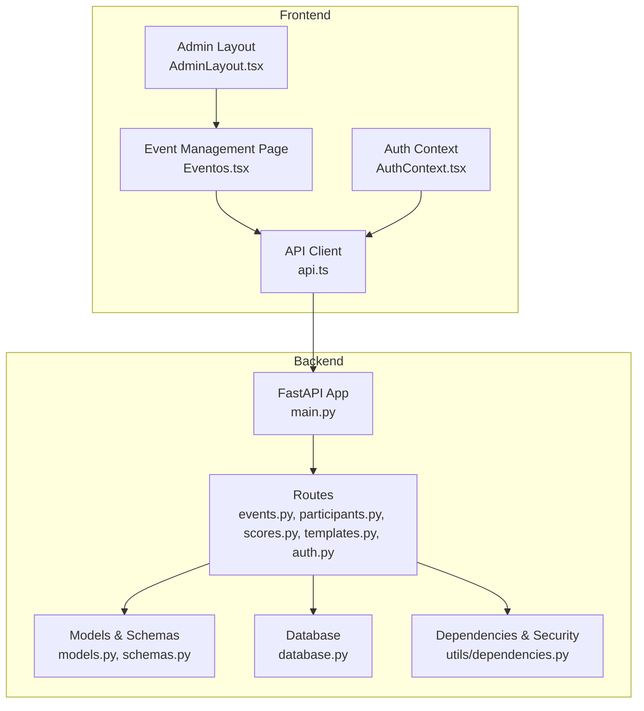
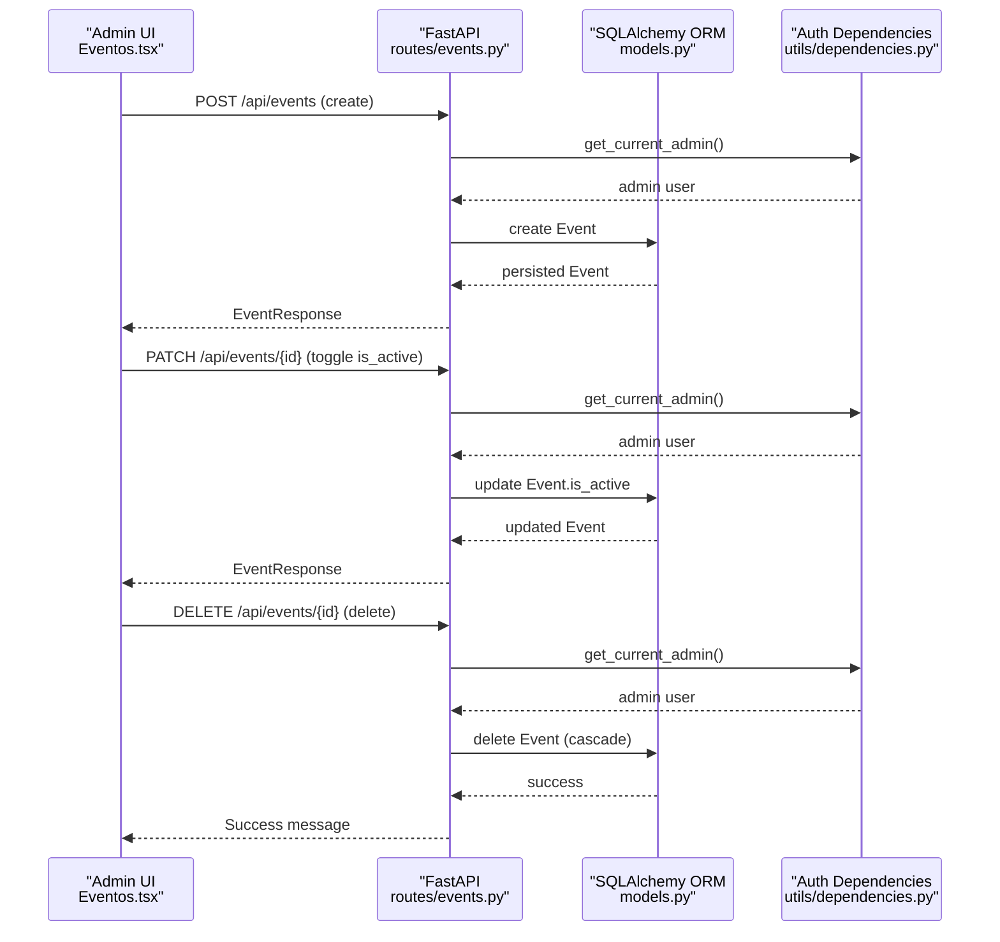
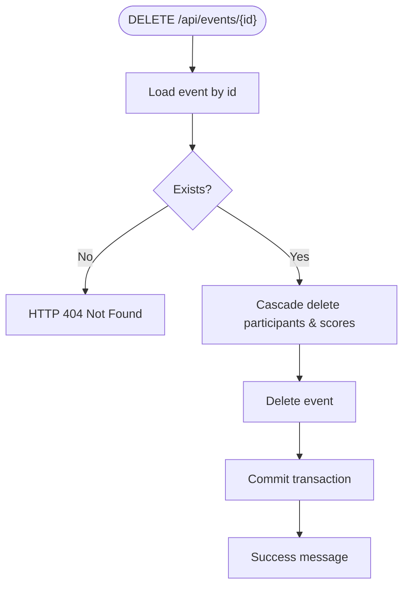
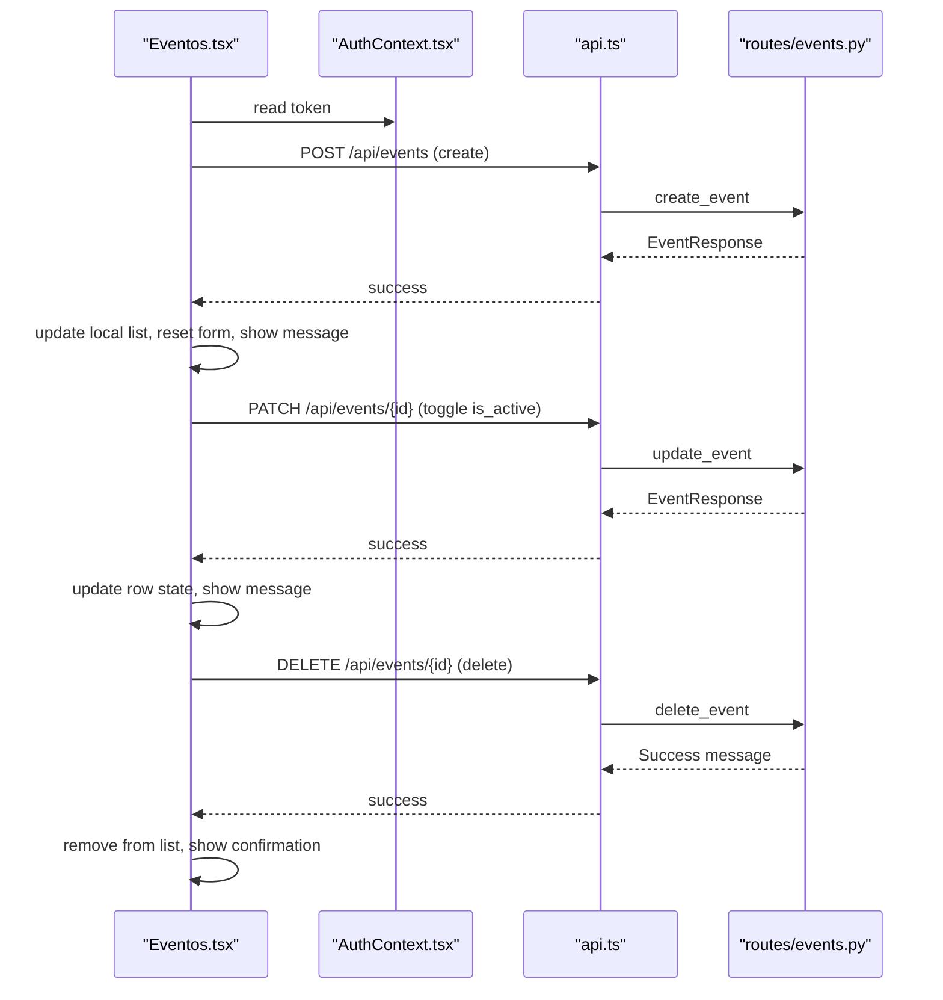
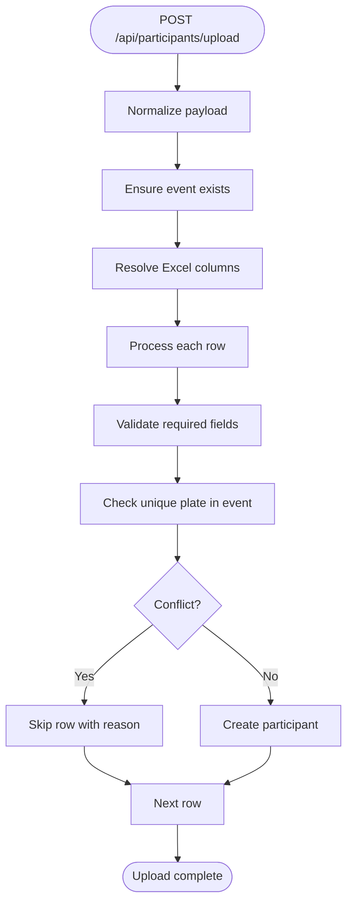
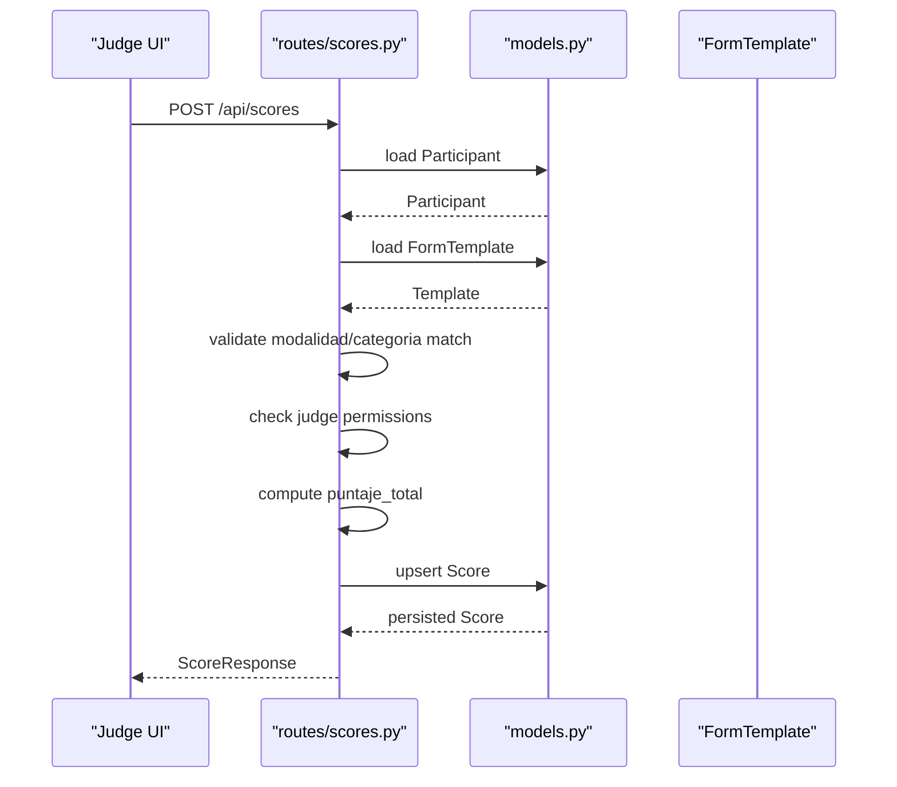
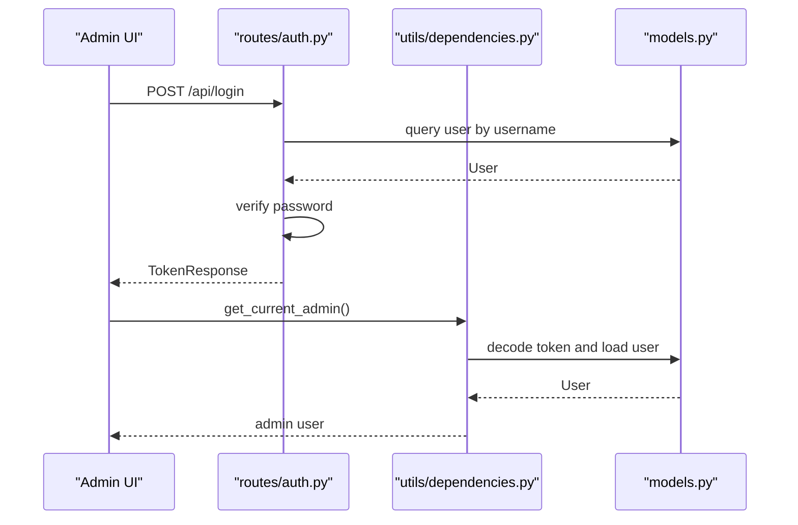
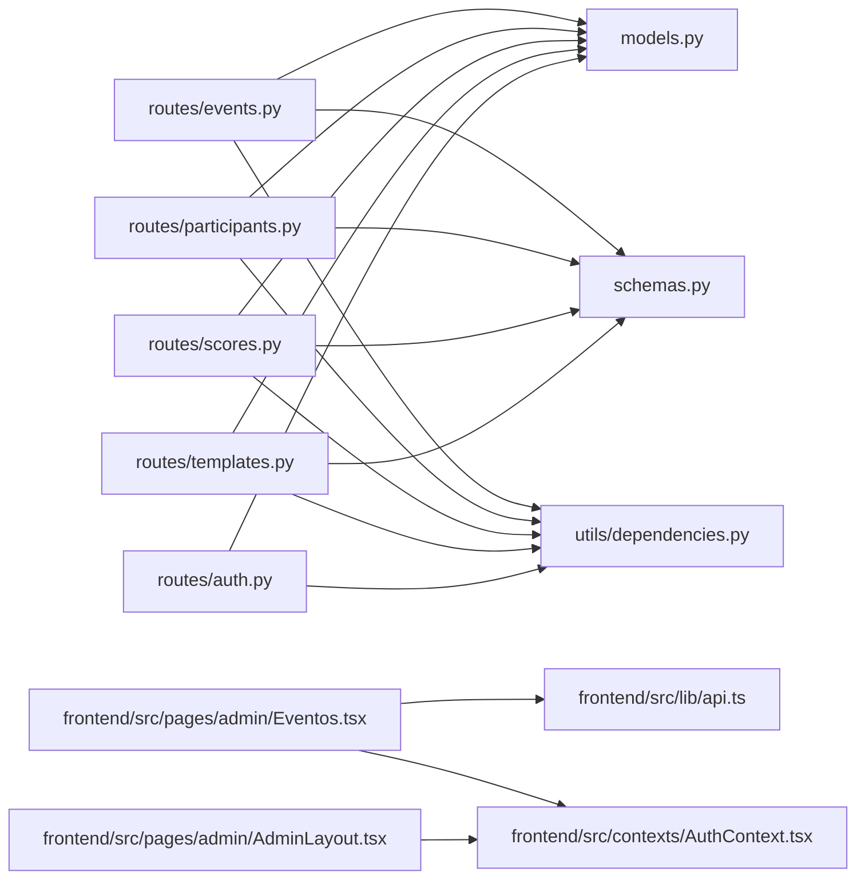

# Event Management

<cite>
**Referenced Files in This Document**
- [main.py](file://main.py)
- [routes/events.py](file://routes/events.py)
- [routes/participants.py](file://routes/participants.py)
- [routes/scores.py](file://routes/scores.py)
- [routes/templates.py](file://routes/templates.py)
- [routes/auth.py](file://routes/auth.py)
- [utils/dependencies.py](file://utils/dependencies.py)
- [models.py](file://models.py)
- [schemas.py](file://schemas.py)
- [database.py](file://database.py)
- [frontend/src/pages/admin/Eventos.tsx](file://frontend/src/pages/admin/Eventos.tsx)
- [frontend/src/lib/api.ts](file://frontend/src/lib/api.ts)
- [frontend/src/contexts/AuthContext.tsx](file://frontend/src/contexts/AuthContext.tsx)
- [frontend/src/pages/admin/AdminLayout.tsx](file://frontend/src/pages/admin/AdminLayout.tsx)
</cite>

## Update Summary
**Changes Made**
- Enhanced event management system with full CRUD operations including DELETE functionality
- Improved frontend with inline editing, delete confirmation dialogs, and better user experience
- Added comprehensive participant management with Excel upload capabilities
- Enhanced scoring system with better judge permissions and validation
- Improved data models with proper relationships and constraints
- Updated API endpoints with better error handling and response formats

## Table of Contents
1. [Introduction](#introduction)
2. [Project Structure](#project-structure)
3. [Core Components](#core-components)
4. [Architecture Overview](#architecture-overview)
5. [Detailed Component Analysis](#detailed-component-analysis)
6. [Dependency Analysis](#dependency-analysis)
7. [Performance Considerations](#performance-considerations)
8. [Troubleshooting Guide](#troubleshooting-guide)
9. [Conclusion](#conclusion)
10. [Appendices](#appendices)

## Introduction
This document explains the enhanced event management functionality in the administrator panel for organizing car audio and tuning competitions. The system now provides comprehensive event lifecycle management with full CRUD operations, improved participant registration workflows, and seamless integration with the scoring system. It covers the complete workflow for creating, managing, and deleting events, configuring event details, activating/deactivating events, and integrating with participant registration and scoring systems.

## Project Structure
The system is organized into:
- Backend: FastAPI application with SQLAlchemy ORM, routing for events, participants, scores, templates, and authentication.
- Frontend: React application with TypeScript, using Axios for API communication and React Router for navigation.
- Shared data models and schemas define the event, participant, score, and template entities and their validation rules.

**Diagram sources**
- [main.py:1-53](file://main.py#L1-L53)
- [routes/events.py:1-116](file://routes/events.py#L1-L116)
- [routes/participants.py:1-430](file://routes/participants.py#L1-L430)
- [routes/scores.py:1-132](file://routes/scores.py#L1-L132)
- [routes/templates.py:1-134](file://routes/templates.py#L1-L134)
- [routes/auth.py:1-36](file://routes/auth.py#L1-L36)
- [utils/dependencies.py:1-71](file://utils/dependencies.py#L1-L71)
- [models.py:1-153](file://models.py#L1-L153)
- [schemas.py:1-202](file://schemas.py#L1-L202)
- [database.py:1-93](file://database.py#L1-L93)
- [frontend/src/pages/admin/AdminLayout.tsx:1-249](file://frontend/src/pages/admin/AdminLayout.tsx#L1-L249)
- [frontend/src/pages/admin/Eventos.tsx:1-482](file://frontend/src/pages/admin/Eventos.tsx#L1-L482)
- [frontend/src/lib/api.ts:1-41](file://frontend/src/lib/api.ts#L1-L41)
- [frontend/src/contexts/AuthContext.tsx:1-144](file://frontend/src/contexts/AuthContext.tsx#L1-L144)

**Section sources**
- [main.py:1-53](file://main.py#L1-L53)
- [frontend/src/pages/admin/AdminLayout.tsx:1-249](file://frontend/src/pages/admin/AdminLayout.tsx#L1-L249)

## Core Components
- **Enhanced Event Entity**: Complete CRUD operations with full update and delete capabilities, plus activation toggling.
- **Improved Participant Management**: Advanced participant registration with unique plate enforcement per event and Excel upload support.
- **Advanced Scoring System**: Integrated scoring system tied to participants and templates with judge permissions and validation.
- **Template Management**: Comprehensive template system for scoring forms grouped by modalidad and categoria.
- **Authentication & Authorization**: Enhanced role-based access control for admin and judge roles with improved security.
- **Modern Frontend Interface**: Enhanced React components with inline editing, delete confirmation, and real-time updates.

**Section sources**
- [routes/events.py:13-116](file://routes/events.py#L13-L116)
- [routes/participants.py:181-430](file://routes/participants.py#L181-L430)
- [routes/scores.py:43-132](file://routes/scores.py#L43-L132)
- [routes/templates.py:13-134](file://routes/templates.py#L13-L134)
- [models.py:24-101](file://models.py#L24-L101)
- [schemas.py:49-154](file://schemas.py#L49-L154)
- [frontend/src/pages/admin/Eventos.tsx:1-482](file://frontend/src/pages/admin/Eventos.tsx#L1-L482)

## Architecture Overview
The backend exposes REST endpoints under /api prefixed routes with comprehensive error handling and validation. The frontend communicates via Axios to these endpoints, passing Bearer tokens for authenticated requests. The database uses SQLite with proper migrations and relationships to support the enhanced event management system.

**Diagram sources**
- [routes/events.py:21-116](file://routes/events.py#L21-L116)
- [utils/dependencies.py:32-38](file://utils/dependencies.py#L32-L38)
- [models.py:24-36](file://models.py#L24-L36)

## Detailed Component Analysis

### Enhanced Event Management Backend
The event management system now provides comprehensive CRUD operations with improved error handling and validation:

- **Endpoints**:
  - GET /api/events: Lists all events ordered by ID descending
  - POST /api/events: Creates a new event with name, date, and initial active state
  - PATCH /api/events/{event_id}: Updates name, date, or is_active with validation
  - PUT /api/events/{event_id}: Full update of event details
  - DELETE /api/events/{event_id}: Deletes event with cascade to participants and scores

- **Enhanced Validation**:
  - Pydantic schemas enforce length limits and presence of required fields
  - is_active defaults to True on creation
  - Comprehensive error handling with specific error messages

- **Access Control**:
  - Admin-only endpoints enforced by dependency checks
  - Proper HTTP status codes for different scenarios

**Diagram sources**
- [routes/events.py:99-116](file://routes/events.py#L99-L116)
- [models.py:32-35](file://models.py#L32-L35)

**Section sources**
- [routes/events.py:13-116](file://routes/events.py#L13-L116)
- [schemas.py:49-68](file://schemas.py#L49-L68)

### Enhanced Event Management Frontend
The frontend has been significantly improved with comprehensive event management capabilities:

- **Features**:
  - Create new event with name and date; sets is_active to true by default
  - Toggle active/inactive state with immediate UI feedback
  - Inline editing with validation and cancel functionality
  - Delete confirmation dialog with cascade warning
  - Comprehensive error handling and success messages
  - Real-time table updates and loading states

- **Data Flow**:
  - Uses AuthContext for token and user role management
  - Uses api client with proper error handling
  - Implements optimistic UI updates for better user experience

**Diagram sources**
- [frontend/src/pages/admin/Eventos.tsx:181-215](file://frontend/src/pages/admin/Eventos.tsx#L181-L215)
- [frontend/src/contexts/AuthContext.tsx:95-116](file://frontend/src/contexts/AuthContext.tsx#L95-L116)
- [frontend/src/lib/api.ts:16-41](file://frontend/src/lib/api.ts#L16-L41)
- [routes/events.py:21-116](file://routes/events.py#L21-L116)

**Section sources**
- [frontend/src/pages/admin/Eventos.tsx:1-482](file://frontend/src/pages/admin/Eventos.tsx#L1-L482)
- [frontend/src/contexts/AuthContext.tsx:1-144](file://frontend/src/contexts/AuthContext.tsx#L1-L144)
- [frontend/src/lib/api.ts:1-41](file://frontend/src/lib/api.ts#L1-L41)

### Enhanced Participant Registration and Event Assignment
The participant management system has been significantly improved with advanced features:

- **Advanced Participant Management**:
  - Participants are associated with events via evento_id
  - Unique plate enforcement per event prevents duplicates
  - Excel upload supports flexible column names and bulk insertion
  - Comprehensive field normalization and validation

- **Excel Upload Capabilities**:
  - Flexible column name mapping with aliases support
  - Automatic field detection and normalization
  - Bulk processing with progress tracking
  - Detailed skip reasons for failed records

**Diagram sources**
- [routes/participants.py:316-430](file://routes/participants.py#L316-L430)
- [routes/participants.py:160-179](file://routes/participants.py#L160-L179)

**Section sources**
- [routes/participants.py:181-430](file://routes/participants.py#L181-L430)
- [models.py:38-69](file://models.py#L38-L69)

### Enhanced Scoring System Integration
The scoring system has been improved with better validation and judge permissions:

- **Advanced Scoring Integration**:
  - Scores are recorded against participants using templates aligned by modalidad and categoria
  - Judge permissions control whether edits to existing scores are allowed
  - Total score computed by summing numeric values in submitted data
  - Comprehensive validation and error handling

- **Judge Permission System**:
  - Admins can edit any score regardless of permissions
  - Judges can only edit scores if they have edit permissions
  - Separate permission system for score modifications

**Diagram sources**
- [routes/scores.py:43-114](file://routes/scores.py#L43-L114)
- [models.py:86-101](file://models.py#L86-L101)

**Section sources**
- [routes/scores.py:16-132](file://routes/scores.py#L16-L132)
- [routes/templates.py:13-134](file://routes/templates.py#L13-L134)

### Enhanced Authentication and Authorization
The authentication system has been improved with better security and user management:

- **Enhanced Login System**:
  - Login endpoint validates credentials and issues bearer tokens
  - Role-based dependencies restrict access to admin and judge endpoints
  - Frontend stores token and hydrates user session with automatic parsing

- **Improved Security**:
  - Better token validation and error handling
  - Enhanced user session management
  - Secure storage of authentication tokens

**Diagram sources**
- [routes/auth.py:13-35](file://routes/auth.py#L13-L35)
- [utils/dependencies.py:32-38](file://utils/dependencies.py#L32-L38)
- [models.py:11-21](file://models.py#L11-L21)

**Section sources**
- [routes/auth.py:1-36](file://routes/auth.py#L1-L36)
- [utils/dependencies.py:16-47](file://utils/dependencies.py#L16-L47)
- [frontend/src/contexts/AuthContext.tsx:95-116](file://frontend/src/contexts/AuthContext.tsx#L95-L116)

## Dependency Analysis
The system maintains clean separation of concerns with enhanced dependencies:

- **Backend Dependencies**:
  - Routes depend on models and schemas for validation and persistence
  - Dependencies module enforces role-based access with improved error handling
  - Database module initializes SQLite with proper migrations

- **Frontend Dependencies**:
  - Eventos.tsx depends on AuthContext and api client with comprehensive error handling
  - AdminLayout.tsx provides navigation and profile management with enhanced UX

**Diagram sources**
- [routes/events.py:1-116](file://routes/events.py#L1-L116)
- [routes/participants.py:1-430](file://routes/participants.py#L1-L430)
- [routes/scores.py:1-132](file://routes/scores.py#L1-L132)
- [routes/templates.py:1-134](file://routes/templates.py#L1-L134)
- [routes/auth.py:1-36](file://routes/auth.py#L1-L36)
- [utils/dependencies.py:1-71](file://utils/dependencies.py#L1-L71)
- [models.py:1-153](file://models.py#L1-L153)
- [schemas.py:1-202](file://schemas.py#L1-L202)
- [frontend/src/pages/admin/Eventos.tsx:1-482](file://frontend/src/pages/admin/Eventos.tsx#L1-L482)
- [frontend/src/lib/api.ts:1-41](file://frontend/src/lib/api.ts#L1-L41)
- [frontend/src/contexts/AuthContext.tsx:1-144](file://frontend/src/contexts/AuthContext.tsx#L1-L144)
- [frontend/src/pages/admin/AdminLayout.tsx:1-249](file://frontend/src/pages/admin/AdminLayout.tsx#L1-L249)

**Section sources**
- [main.py:14-32](file://main.py#L14-L32)
- [database.py:36-93](file://database.py#L36-L93)

## Performance Considerations
The enhanced system includes several performance optimizations:

- **Event Listing**: Orders by ID descending; consider adding pagination for large datasets
- **Participant Uploads**: Excel processing with efficient bulk operations; consider streaming for very large files
- **Score Computation**: Optimized recursive sum calculation; keep submitted data structures flat
- **Database Relationships**: Proper foreign key constraints and cascading deletes for efficient cleanup
- **Frontend State Management**: Optimistic UI updates reduce perceived latency

## Troubleshooting Guide
Enhanced troubleshooting for the improved system:

- **Creating an event fails with validation errors**:
  - Ensure name length (1-150 characters) and valid date format meet schema requirements
  - Verify admin role and valid token are present
  - Check network connectivity and CORS configuration

- **Toggle active state does nothing**:
  - Confirm admin role and valid token
  - Check network tab for error responses
  - Verify event exists and is accessible

- **Participant creation conflicts**:
  - Duplicate plate in the selected event; change plate or select another event
  - Check Excel upload for duplicate entries
  - Verify unique constraint is working properly

- **Score submission rejected**:
  - Ensure template modalidad and categoria match participant's exactly
  - Verify judge permissions if editing existing score
  - Check that judge has edit permissions for existing scores

- **Excel upload issues**:
  - Verify file is .xlsx format and not empty
  - Check required columns are present (nombres_apellidos, marca_modelo, modalidad, categoria, placa_rodaje)
  - Review skip reasons in upload response for failed rows

- **Frontend not loading events**:
  - Check API base URL and CORS configuration
  - Verify token storage and expiration
  - Ensure proper error handling for network failures

**Section sources**
- [routes/events.py:21-116](file://routes/events.py#L21-L116)
- [routes/participants.py:181-430](file://routes/participants.py#L181-L430)
- [routes/scores.py:43-132](file://routes/scores.py#L43-L132)
- [frontend/src/lib/api.ts:16-41](file://frontend/src/lib/api.ts#L16-L41)

## Conclusion
The enhanced event management system provides a comprehensive solution for administrators to create, manage, and delete competitions with full lifecycle support. The system now offers streamlined workflows for event creation and management, improved participant registration with Excel upload capabilities, and seamless integration with the scoring system. The frontend provides responsive controls with real-time feedback, while the backend enforces validation, uniqueness, and role-based access. The enhanced error handling, comprehensive CRUD operations, and improved user experience ensure smooth competition organization and reliable operation.

## Appendices

### Step-by-Step: Setting Up a New Event
1. Navigate to the administrator panel and open the Events page.
2. Fill in the event name (1-150 characters) and date; leave activation enabled by default.
3. Submit the form; the system creates the event and refreshes the list.
4. Use the "Recargar" button to refresh the list if needed.
5. Verify the event appears in the catalog with correct details.

**Section sources**
- [frontend/src/pages/admin/Eventos.tsx:181-215](file://frontend/src/pages/admin/Eventos.tsx#L181-L215)
- [routes/events.py:21-35](file://routes/events.py#L21-L35)

### Step-by-Step: Activating/Deactivating an Event
1. On the Events page, click the "Activo" or "Inactivo" button for the target event.
2. The system sends a PATCH request to update is_active.
3. The UI reflects the new state immediately and shows a success message.
4. Deactivated events will not appear in participant registration.

**Section sources**
- [frontend/src/pages/admin/Eventos.tsx:78-107](file://frontend/src/pages/admin/Eventos.tsx#L78-L107)
- [routes/events.py:38-73](file://routes/events.py#L38-L73)

### Step-by-Step: Editing an Event
1. Click the "Editar" button for the target event.
2. The row converts to edit mode with input fields for name, date, and activation status.
3. Make desired changes and click "Guardar".
4. The system validates inputs and updates the event.
5. Use "Cancelar" to discard changes and return to view mode.

**Section sources**
- [frontend/src/pages/admin/Eventos.tsx:109-179](file://frontend/src/pages/admin/Eventos.tsx#L109-L179)
- [routes/events.py:76-96](file://routes/events.py#L76-L96)

### Step-by-Step: Deleting an Event
1. Click the "Eliminar" button for the target event.
2. A confirmation dialog appears with cascade warning.
3. Click "Sí, Eliminar Todo" to confirm deletion.
4. The system deletes the event and all associated participants and scores.
5. The event is removed from the list with success confirmation.

**Section sources**
- [frontend/src/pages/admin/Eventos.tsx:125-140](file://frontend/src/pages/admin/Eventos.tsx#L125-L140)
- [routes/events.py:99-116](file://routes/events.py#L99-L116)

### Step-by-Step: Configuring Competition Parameters
1. **Assign participants to events**: Ensure unique plates per event during registration.
2. **Create templates**: Develop scoring templates aligned to modalidad and categoria.
3. **Configure judge permissions**: Set can_edit_scores for trusted judges.
4. **Manage event visibility**: Use activation toggle to control participant access.

**Section sources**
- [routes/participants.py:181-430](file://routes/participants.py#L181-L430)
- [routes/templates.py:13-134](file://routes/templates.py#L13-L134)
- [routes/scores.py:43-132](file://routes/scores.py#L43-L132)

### Best Practices for Competition Organization
- **Event Setup**: Always create an event before registering participants.
- **Participant Management**: Use unique plates per event to prevent conflicts.
- **Template Alignment**: Align templates with participant modalidad and categoria before scoring.
- **Judge Permissions**: Restrict score editing permissions to trusted judges only.
- **Event Visibility**: Monitor event activation to control participant access.
- **Data Validation**: Use Excel upload for bulk participant registration with proper validation.
- **System Maintenance**: Regularly backup database and monitor system health.