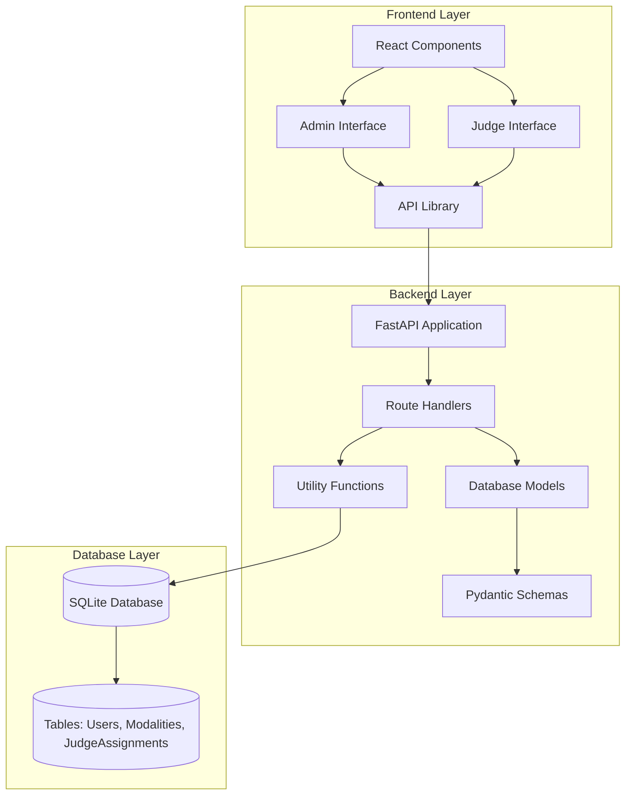
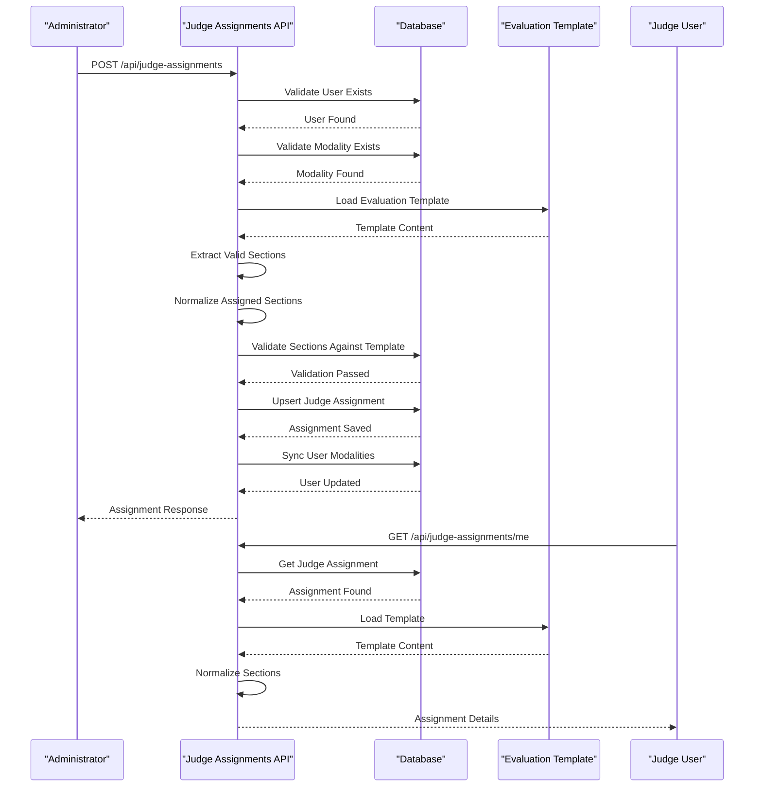
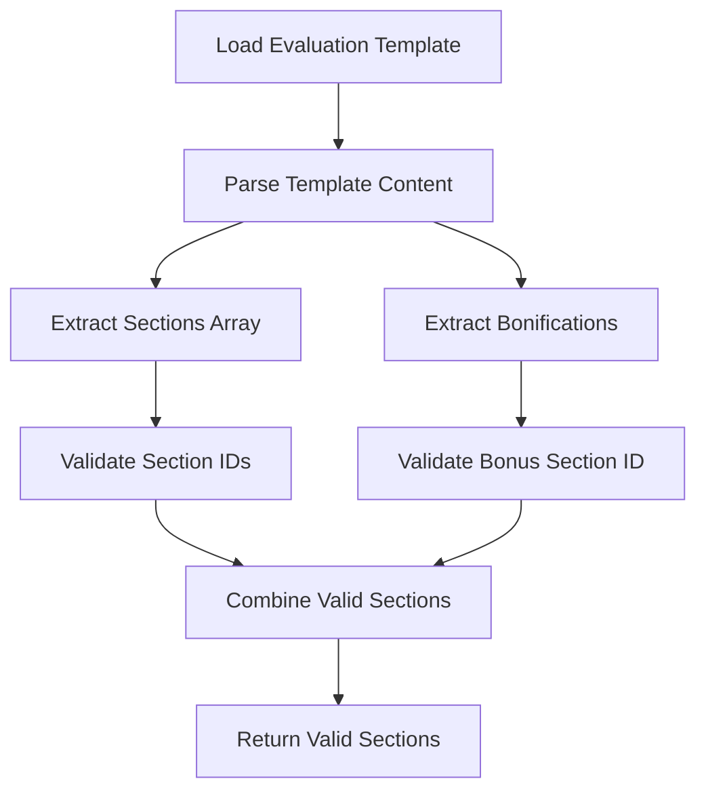
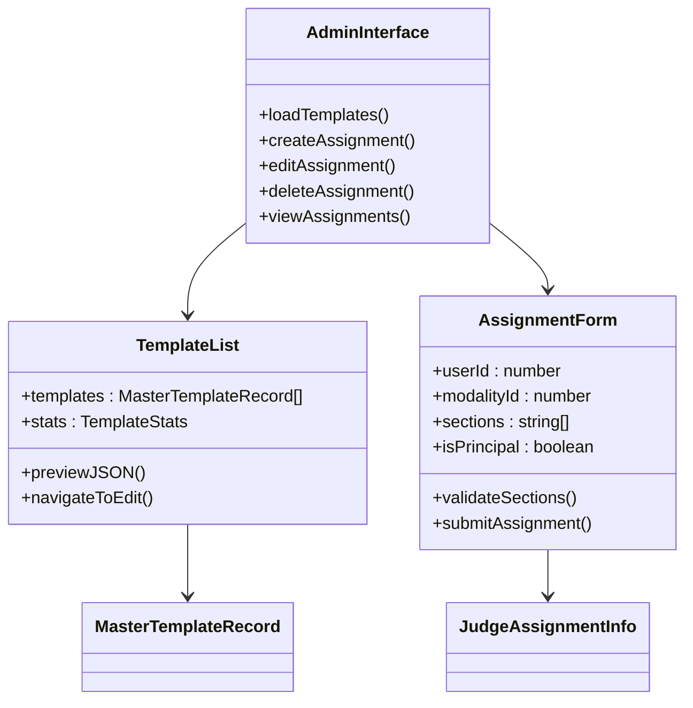
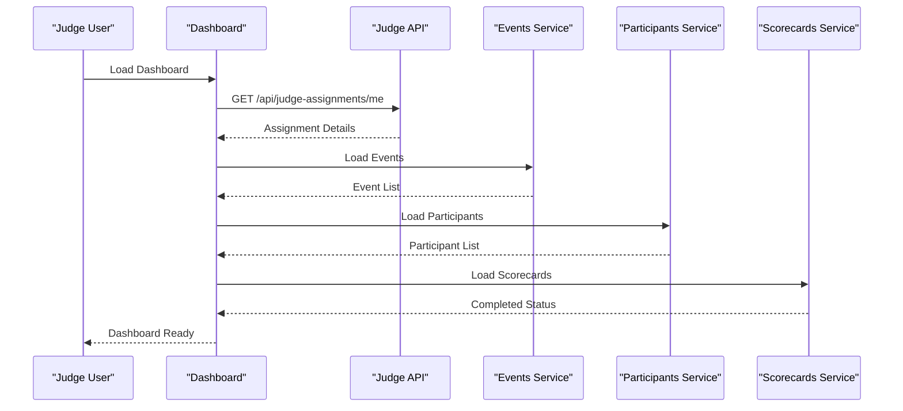
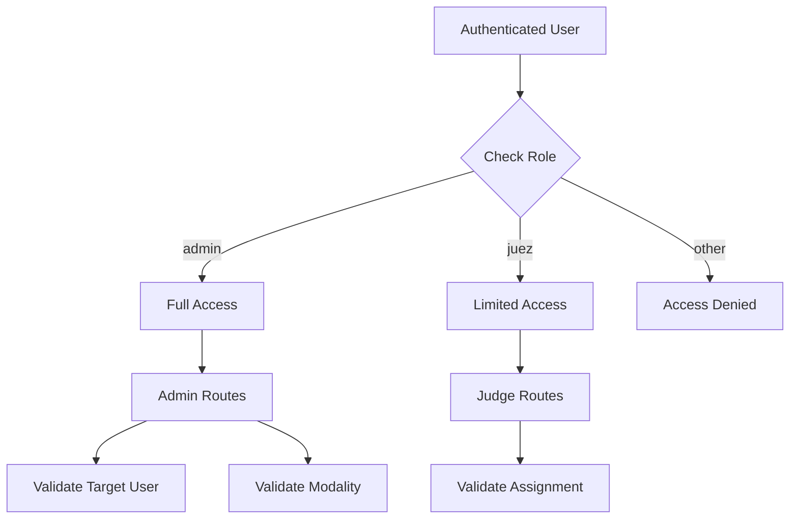
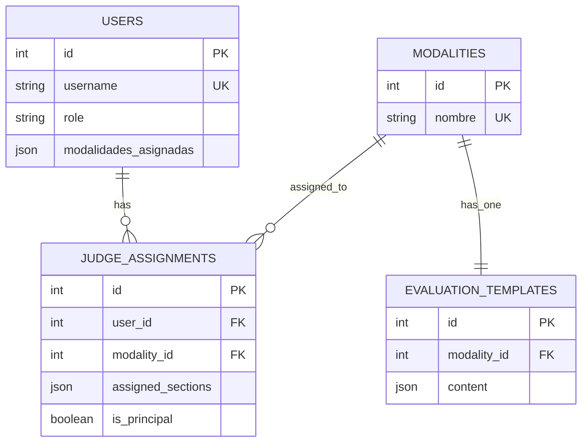

# Judge Assignments Management

<cite>
**Referenced Files in This Document**
- [judge_assignments.py](file://routes/judge_assignments.py)
- [models.py](file://models.py)
- [schemas.py](file://schemas.py)
- [main.py](file://main.py)
- [database.py](file://database.py)
- [dependencies.py](file://utils/dependencies.py)
- [evaluation_templates.py](file://routes/evaluation_templates.py)
- [TemplatesList.tsx](file://frontend/src/pages/admin/TemplatesList.tsx)
- [Dashboard.tsx](file://frontend/src/pages/juez/Dashboard.tsx)
- [api.ts](file://frontend/src/lib/api.ts)
- [judging.ts](file://frontend/src/lib/judging.ts)
</cite>

## Table of Contents
1. [Introduction](#introduction)
2. [System Architecture](#system-architecture)
3. [Core Components](#core-components)
4. [Judge Assignment Workflow](#judge-assignment-workflow)
5. [Template Integration](#template-integration)
6. [Frontend Implementation](#frontend-implementation)
7. [Security Model](#security-model)
8. [Data Flow Analysis](#data-flow-analysis)
9. [Performance Considerations](#performance-considerations)
10. [Troubleshooting Guide](#troubleshooting-guide)
11. [Conclusion](#conclusion)

## Introduction

The Judge Assignments Management system is a critical component of the car audio and tuning competition scoring platform. This system manages the allocation of judges to specific modalities and sections within evaluation templates, ensuring proper distribution of evaluation responsibilities and maintaining the integrity of the scoring process.

The system provides administrative capabilities for assigning judges to competitions while enabling judges to view their assigned responsibilities and access evaluation tools. It integrates seamlessly with the broader evaluation framework, connecting judge assignments to specific evaluation templates and sections.

## System Architecture

The Judge Assignments Management system follows a modular FastAPI architecture with clear separation of concerns between backend services, data models, and frontend interfaces.

**Diagram sources**
- [main.py:1-53](file://main.py#L1-53)
- [models.py:131-144](file://models.py#L131-144)
- [schemas.py:208-218](file://schemas.py#L208-218)

## Core Components

### Backend Components

The system consists of several interconnected components that work together to manage judge assignments effectively.

#### Judge Assignment Route Handler
The primary route handler manages CRUD operations for judge assignments with comprehensive validation and business logic.

#### Database Models
The SQLAlchemy models define the data structure for judge assignments, including relationships to users, modalities, and evaluation templates.

#### Pydantic Schemas
Validation schemas ensure data integrity and provide structured responses for API interactions.

#### Utility Functions
Helper functions handle template parsing, section normalization, and user synchronization.

**Section sources**
- [judge_assignments.py:106-308](file://routes/judge_assignments.py#L106-308)
- [models.py:131-144](file://models.py#L131-144)
- [schemas.py:208-218](file://schemas.py#L208-218)

### Frontend Components

The frontend provides two distinct interfaces: an administrative dashboard for managing assignments and a judge interface for accessing assigned responsibilities.

#### Admin Interface
Administrative components allow authorized users to create, modify, and delete judge assignments across different modalities.

#### Judge Interface
Judge-specific components enable users to view their assigned modalities and sections, facilitating efficient evaluation workflows.

**Section sources**
- [TemplatesList.tsx:73-252](file://frontend/src/pages/admin/TemplatesList.tsx#L73-252)
- [Dashboard.tsx:9-268](file://frontend/src/pages/juez/Dashboard.tsx#L9-268)

## Judge Assignment Workflow

The judge assignment process involves several coordinated steps that ensure proper validation and template integration.

**Diagram sources**
- [judge_assignments.py:164-281](file://routes/judge_assignments.py#L164-281)
- [dependencies.py:32-47](file://utils/dependencies.py#L32-47)

### Assignment Creation Process

The assignment creation process includes comprehensive validation and template integration:

1. **User Validation**: Ensures the target user exists and has the appropriate role
2. **Modality Validation**: Confirms the modality exists and has an associated evaluation template
3. **Template Processing**: Extracts valid sections from the evaluation template
4. **Section Normalization**: Processes assigned sections while handling bonus sections
5. **Principal Judge Management**: Handles exclusive principal judge assignments
6. **Persistence**: Saves the assignment and updates user modalities

**Section sources**
- [judge_assignments.py:164-281](file://routes/judge_assignments.py#L164-281)

## Template Integration

The judge assignment system maintains strong integration with evaluation templates to ensure assignments align with available evaluation sections.

### Template Section Extraction

The system extracts valid sections from evaluation templates using structured parsing:

**Diagram sources**
- [judge_assignments.py:15-31](file://routes/judge_assignments.py#L15-31)

### Section Normalization Logic

Assigned sections undergo normalization to ensure consistency and proper handling of bonus sections:

| Step | Description | Example |
|------|-------------|---------|
| Strip Whitespace | Remove leading/trailing spaces | " section1 " → "section1" |
| Duplicate Removal | Eliminate repeated sections | ["sec1","sec1"] → ["sec1"] |
| Bonus Section Exclusion | Remove bonus section from manual list | Bonus: "bonificaciones" |
| Principal Requirement | Ensure bonus section included for principals | is_principal = true |

**Section sources**
- [judge_assignments.py:45-67](file://routes/judge_assignments.py#L45-67)

## Frontend Implementation

The frontend provides specialized interfaces for administrators and judges, each optimized for their specific responsibilities.

### Administrative Interface

The admin interface offers comprehensive management capabilities:

**Diagram sources**
- [TemplatesList.tsx:73-252](file://frontend/src/pages/admin/TemplatesList.tsx#L73-252)
- [judging.ts:113-125](file://frontend/src/lib/judging.ts#L113-125)

### Judge Interface

The judge interface focuses on accessibility and usability:

**Diagram sources**
- [Dashboard.tsx:34-84](file://frontend/src/pages/juez/Dashboard.tsx#L34-84)

**Section sources**
- [TemplatesList.tsx:73-252](file://frontend/src/pages/admin/TemplatesList.tsx#L73-252)
- [Dashboard.tsx:9-268](file://frontend/src/pages/juez/Dashboard.tsx#L9-268)

## Security Model

The system implements a multi-layered security approach with role-based access control and comprehensive validation.

### Authentication and Authorization

**Diagram sources**
- [dependencies.py:32-47](file://utils/dependencies.py#L32-47)

### Access Control Implementation

The security model ensures proper access control through:

1. **Role-Based Validation**: Separate validators for admin and judge roles
2. **Assignment-Specific Permissions**: Judges can only access their own assignments
3. **Template Validation**: Prevents assignments to non-existent or invalid sections
4. **Principal Judge Management**: Ensures only one principal judge per modality

**Section sources**
- [dependencies.py:32-47](file://utils/dependencies.py#L32-47)
- [judge_assignments.py:133-162](file://routes/judge_assignments.py#L133-162)

## Data Flow Analysis

The system maintains comprehensive data flow between components to ensure consistency and reliability.

### Database Relationships

**Diagram sources**
- [models.py:11-144](file://models.py#L11-144)

### API Request Flow

The API handles requests through a structured pipeline:

1. **Authentication**: Validates JWT token and extracts user information
2. **Authorization**: Checks user role against endpoint requirements
3. **Validation**: Validates request parameters and data integrity
4. **Processing**: Executes business logic with template integration
5. **Response**: Returns structured response with normalized data

**Section sources**
- [models.py:11-144](file://models.py#L11-144)
- [schemas.py:208-218](file://schemas.py#L208-218)

## Performance Considerations

The system is designed with performance optimization in mind through several key strategies:

### Database Optimization

- **Joined Loading**: Uses joinedload for efficient relationship queries
- **Indexing**: Strategic indexing on frequently queried columns
- **Batch Operations**: Minimizes database round trips through batch processing
- **Connection Pooling**: Efficient database connection management

### Caching Strategies

- **Template Caching**: Evaluation templates cached per modality for reuse
- **User Modalities**: Cached modalities assigned to users for quick access
- **Response Caching**: Appropriate caching for read-heavy operations

### Frontend Optimization

- **Lazy Loading**: Components loaded on-demand to reduce initial bundle size
- **State Management**: Efficient state updates to minimize re-renders
- **API Caching**: Client-side caching for repeated API calls

## Troubleshooting Guide

Common issues and their solutions:

### Assignment Creation Failures

**Issue**: "No tienes asignación configurada para esta modalidad"
**Cause**: Judge has no assignment for the specified modality
**Solution**: Verify judge assignment exists and user has proper role

**Issue**: "La modalidad no tiene una plantilla maestra configurada"
**Cause**: Modality lacks evaluation template
**Solution**: Create evaluation template for the modality first

**Issue**: "Secciones no válidas para esta modalidad"
**Cause**: Assigned sections don't exist in template
**Solution**: Use only valid section IDs from the evaluation template

### Authentication Issues

**Issue**: "No se pudo validar el token"
**Cause**: Invalid or expired JWT token
**Solution**: Re-authenticate user and obtain new token

**Issue**: "Solo un administrador puede realizar esta acción"
**Cause**: Non-admin user attempting admin operation
**Solution**: Authenticate with admin credentials

### Database Migration Issues

**Issue**: Schema inconsistencies after updates
**Solution**: Run database migration script to update table structures

**Section sources**
- [judge_assignments.py:156-161](file://routes/judge_assignments.py#L156-161)
- [dependencies.py:50-71](file://utils/dependencies.py#L50-71)

## Conclusion

The Judge Assignments Management system provides a robust, secure, and scalable solution for managing judge responsibilities in car audio and tuning competitions. Through its modular architecture, comprehensive validation, and seamless template integration, the system ensures proper distribution of evaluation duties while maintaining data integrity and user experience.

Key strengths include:
- **Security**: Multi-layered role-based access control
- **Integration**: Seamless connection between assignments and evaluation templates
- **Scalability**: Optimized database queries and caching strategies
- **Usability**: Intuitive interfaces for both administrators and judges
- **Maintainability**: Clean separation of concerns and comprehensive error handling

The system successfully addresses the complex requirements of competition judging while providing room for future enhancements and extensions.