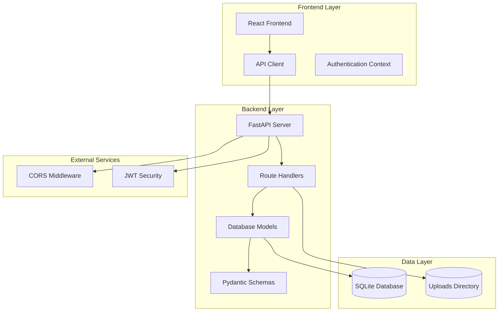
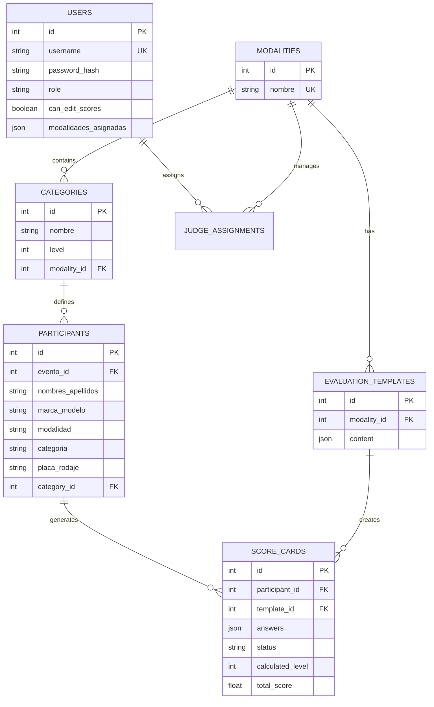
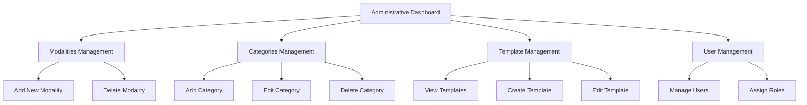
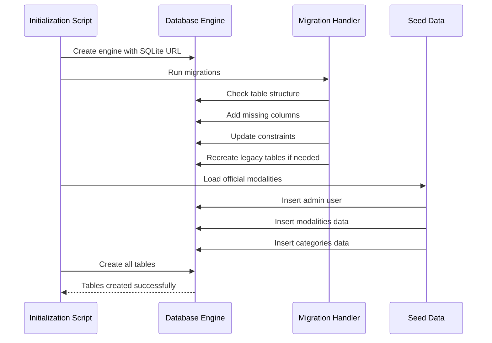
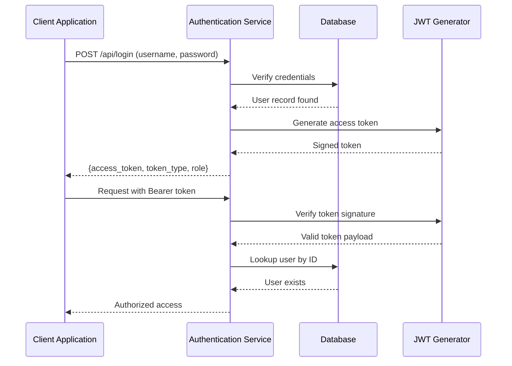
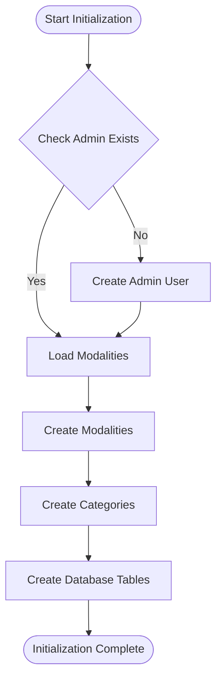
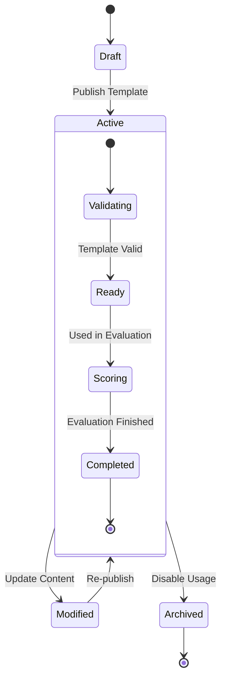

# Modality Management System

<cite>
**Referenced Files in This Document**
- [main.py](file://main.py)
- [models.py](file://models.py)
- [schemas.py](file://schemas.py)
- [routes/modalities.py](file://routes/modalities.py)
- [routes/evaluation_templates.py](file://routes/evaluation_templates.py)
- [database.py](file://database.py)
- [init_db.py](file://init_db.py)
- [seed_init.py](file://seed_init.py)
- [utils/dependencies.py](file://utils/dependencies.py)
- [frontend/src/pages/admin/Categorias.tsx](file://frontend/src/pages/admin/Categorias.tsx)
- [frontend/src/pages/admin/TemplatesList.tsx](file://frontend/src/pages/admin/TemplatesList.tsx)
- [frontend/src/lib/api.ts](file://frontend/src/lib/api.ts)
- [frontend/src/lib/judging.ts](file://frontend/src/lib/judging.ts)
- [frontend/src/components/template-editor/types.ts](file://frontend/src/components/template-editor/types.ts)
- [requirements.txt](file://requirements.txt)
</cite>

## Table of Contents
1. [Introduction](#introduction)
2. [System Architecture](#system-architecture)
3. [Core Data Model](#core-data-model)
4. [API Endpoints](#api-endpoints)
5. [Frontend Components](#frontend-components)
6. [Database Management](#database-management)
7. [Security Implementation](#security-implementation)
8. [Initialization Process](#initialization-process)
9. [Template Management](#template-management)
10. [Performance Considerations](#performance-considerations)
11. [Troubleshooting Guide](#troubleshooting-guide)
12. [Conclusion](#conclusion)

## Introduction

The Modality Management System is a comprehensive web application designed for car audio and tuning competitions. It provides a complete solution for managing competition modalities, categories, participants, scoring systems, and administrative workflows. The system is built using FastAPI for the backend and React with TypeScript for the frontend, offering a modern, responsive interface for judges, administrators, and participants.

The platform supports multiple competition formats including SPL (Street Performance League), SQ (Show Quality), SQL (Street Queen League), Street Show, Tuning, and Tuning VW categories. Each modality can have multiple hierarchical categories with different skill levels, enabling complex tournament structures and fair competition across various expertise levels.

## System Architecture

The Modality Management System follows a clean, layered architecture pattern with clear separation of concerns between frontend, backend, and database layers.

**Diagram sources**
- [main.py:26-47](file://main.py#L26-L47)
- [routes/modalities.py:15](file://routes/modalities.py#L15)
- [database.py:12](file://database.py#L12)

The architecture consists of three main layers:

- **Presentation Layer**: React-based frontend with TypeScript, providing responsive interfaces for administration, judging, and participant management
- **Application Layer**: FastAPI backend with RESTful APIs, implementing business logic and data validation
- **Data Layer**: SQLite database with SQLAlchemy ORM for data persistence and relationships

**Section sources**
- [main.py:1-53](file://main.py#L1-L53)
- [routes/modalities.py:1-180](file://routes/modalities.py#L1-L180)

## Core Data Model

The system uses a comprehensive Entity-Relationship model to represent competition data structures. The core entities include Users, Events, Participants, Modalities, Categories, and Evaluation Templates.

**Diagram sources**
- [models.py:11-225](file://models.py#L11-L225)

The data model supports complex relationships with cascading operations and referential integrity constraints. Each modality maintains its own evaluation template, ensuring consistent scoring criteria across all judges assigned to that discipline.

**Section sources**
- [models.py:174-225](file://models.py#L174-L225)
- [schemas.py:136-188](file://schemas.py#L136-L188)

## API Endpoints

The system exposes a comprehensive REST API organized into logical resource groups. The primary endpoints support modalities, categories, evaluation templates, and administrative functions.

### Modality Management Endpoints

| Endpoint | Method | Description | Authentication |
|----------|--------|-------------|----------------|
| `/api/modalities` | GET | List all modalities with categories | User |
| `/api/modalities` | POST | Create new modality | Admin |
| `/api/modalities/{modality_id}` | DELETE | Delete modality and categories | Admin |
| `/api/modalities/{modality_id}/categories` | POST | Create category in modality | Admin |
| `/api/modalities/categories/{category_id}` | PUT | Update category | Admin |
| `/api/modalities/categories/{category_id}` | DELETE | Delete category | Admin |

### Evaluation Template Endpoints

| Endpoint | Method | Description | Authentication |
|----------|--------|-------------|----------------|
| `/api/evaluation-templates` | GET | List all evaluation templates | User |
| `/api/evaluation-templates` | POST | Create new evaluation template | Admin |
| `/api/evaluation-templates/{template_id}` | GET | Get specific template | User |
| `/api/evaluation-templates/by-modality/{modality_id}` | GET | Get template by modality | User |
| `/api/evaluation-templates/{template_id}` | PUT | Update template | Admin |

### Authentication and Authorization

The system implements role-based access control with two primary user roles:
- **Admin**: Full system access, can manage modalities, categories, and templates
- **Judge**: Limited access for scoring and evaluation tasks

**Section sources**
- [routes/modalities.py:18-180](file://routes/modalities.py#L18-L180)
- [routes/evaluation_templates.py:42-172](file://routes/evaluation_templates.py#L42-L172)
- [utils/dependencies.py:32-47](file://utils/dependencies.py#L32-L47)

## Frontend Components

The frontend provides a comprehensive React-based interface with TypeScript type safety and modern UI patterns.

### Administrative Interface

The administrative dashboard offers intuitive management of competition structures:

**Diagram sources**
- [frontend/src/pages/admin/Categorias.tsx:19-344](file://frontend/src/pages/admin/Categorias.tsx#L19-L344)

### Template Management Interface

The template editor provides sophisticated JSON-based template creation with real-time validation and preview capabilities. The interface supports complex evaluation structures with sections, items, and bonus categories.

**Section sources**
- [frontend/src/pages/admin/Categorias.tsx:40-146](file://frontend/src/pages/admin/Categorias.tsx#L40-L146)
- [frontend/src/pages/admin/TemplatesList.tsx:73-252](file://frontend/src/pages/admin/TemplatesList.tsx#L73-L252)

## Database Management

The system uses SQLite as the primary database with SQLAlchemy ORM for type-safe database operations. The database initialization process includes automatic migration handling and data seeding.

### Database Initialization Process

**Diagram sources**
- [database.py:36-193](file://database.py#L36-L193)
- [seed_init.py:13-109](file://seed_init.py#L13-L109)

### Migration Strategy

The system implements a robust migration strategy to handle database schema evolution:

1. **Column Addition**: Automatically adds new columns to existing tables with appropriate defaults
2. **Data Backfill**: Migrates legacy data from old column names to new standardized fields
3. **Constraint Updates**: Adds foreign key constraints and unique indexes as needed
4. **Legacy Schema Management**: Handles score card table migrations with backup and recreation

**Section sources**
- [database.py:36-193](file://database.py#L36-L193)
- [init_db.py:23-28](file://init_db.py#L23-L28)

## Security Implementation

The system implements comprehensive security measures including authentication, authorization, and data protection.

### Authentication Flow

**Diagram sources**
- [utils/dependencies.py:50-71](file://utils/dependencies.py#L50-L71)

### Role-Based Access Control

The system implements strict role-based access control:

- **Admin Users**: Full access to all administrative functions
- **Judge Users**: Limited access for scoring and evaluation tasks
- **Token Validation**: All requests require valid JWT tokens
- **Route Protection**: Specific routes require admin or judge roles

**Section sources**
- [utils/dependencies.py:16-47](file://utils/dependencies.py#L16-L47)
- [schemas.py:7](file://schemas.py#L7)

## Initialization Process

The system provides automated initialization scripts to set up the database and initial data structure.

### Seed Initialization

The seed initialization process creates essential system data:

1. **Super Admin Account**: Creates an admin user with predefined credentials
2. **Official Modalities**: Loads standard competition modalities
3. **Category Hierarchy**: Establishes category structures for each modality
4. **Data Validation**: Prevents duplicate entries during initialization

### Database Creation

The initialization process handles both table creation and data population:

**Diagram sources**
- [seed_init.py:13-109](file://seed_init.py#L13-L109)
- [init_db.py:23-28](file://init_db.py#L23-L28)

**Section sources**
- [seed_init.py:13-109](file://seed_init.py#L13-L109)
- [init_db.py:23-28](file://init_db.py#L23-L28)

## Template Management

The system provides sophisticated template management for evaluation criteria across different modalities.

### Template Structure

Each evaluation template follows a standardized JSON schema supporting:

- **Template Metadata**: Name, version, and modality association
- **Evaluation Scale**: Score ranges and rating scales
- **Section Organization**: Logical grouping of evaluation criteria
- **Bonus Systems**: Special scoring categories for exceptional performances
- **Categorization Options**: Automatic category assignment based on performance

### Template Lifecycle

**Diagram sources**
- [routes/evaluation_templates.py:56-101](file://routes/evaluation_templates.py#L56-L101)

**Section sources**
- [routes/evaluation_templates.py:17-40](file://routes/evaluation_templates.py#L17-L40)
- [frontend/src/components/template-editor/types.ts:46-58](file://frontend/src/components/template-editor/types.ts#L46-L58)

## Performance Considerations

The system is designed with several performance optimization strategies:

### Database Optimization

- **Connection Pooling**: Efficient database connection management
- **Indexing Strategy**: Strategic indexing on frequently queried fields
- **Query Optimization**: Joined loading to minimize N+1 query problems
- **Transaction Management**: Proper transaction boundaries for data consistency

### Frontend Performance

- **Lazy Loading**: Dynamic imports for route components
- **State Management**: Efficient React state updates
- **API Caching**: Client-side caching for repeated requests
- **Optimized Rendering**: Memoized components and efficient list rendering

### Scalability Factors

- **SQLite Limitations**: Suitable for moderate load scenarios
- **Horizontal Scaling**: Can be adapted for cloud deployment
- **Caching Layers**: Potential for Redis or similar caching solutions
- **Database Migration**: Path to PostgreSQL for high-scale deployments

## Troubleshooting Guide

Common issues and their resolutions:

### Database Issues

**Problem**: Migration errors during startup
**Solution**: Check database permissions and ensure SQLite file is writable

**Problem**: Missing tables after initialization
**Solution**: Run `python init_db.py` to create all tables

### Authentication Problems

**Problem**: 401 Unauthorized errors
**Solution**: Verify JWT token format and expiration

**Problem**: Role-based access denied
**Solution**: Check user role assignment in database

### Frontend Issues

**Problem**: API connection failures
**Solution**: Verify API_BASE_URL environment variable matches backend port

**Problem**: Template editing not working
**Solution**: Check JSON schema validation and required fields

**Section sources**
- [frontend/src/lib/api.ts:24-40](file://frontend/src/lib/api.ts#L24-L40)
- [database.py:36-193](file://database.py#L36-L193)

## Conclusion

The Modality Management System provides a robust, scalable solution for car audio and tuning competition management. Its modular architecture, comprehensive data model, and intuitive interfaces make it suitable for both small local competitions and larger regional events.

Key strengths include:

- **Comprehensive Data Model**: Supports complex competition structures with multiple modalities and hierarchical categories
- **Flexible Template System**: Allows customization of evaluation criteria per modality
- **Strong Security**: Role-based access control with JWT authentication
- **Automated Management**: Database migrations and initialization scripts
- **Modern Technology Stack**: React frontend with TypeScript and FastAPI backend

The system is well-positioned for future enhancements including cloud deployment, advanced analytics, and expanded competition formats.