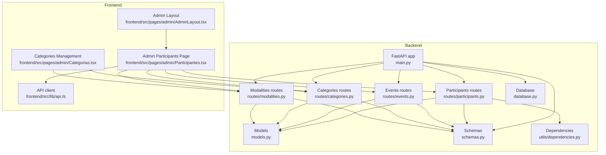
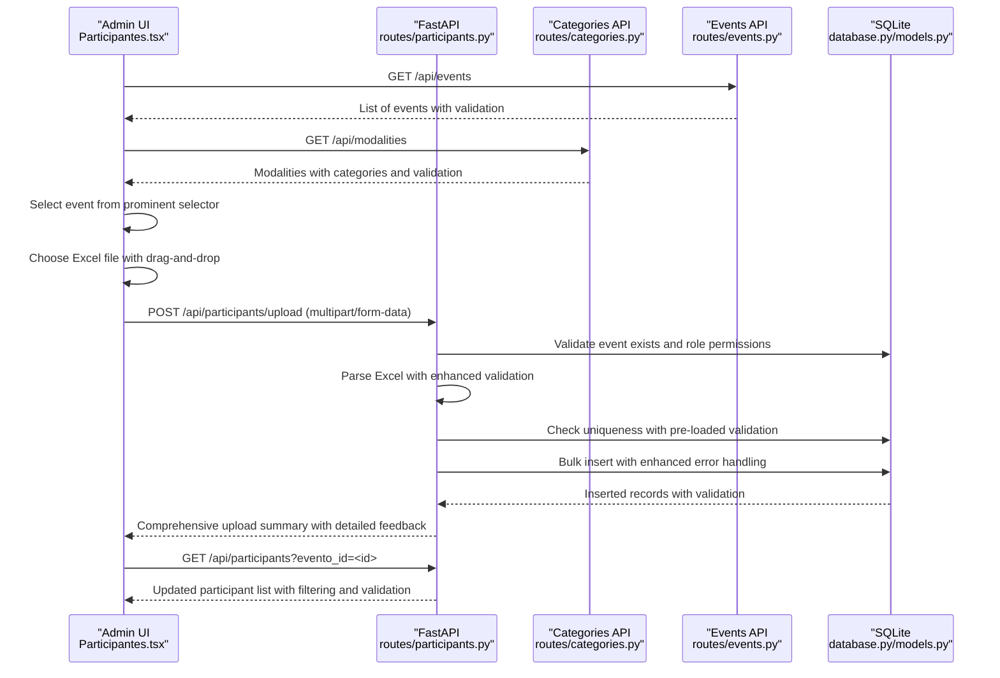
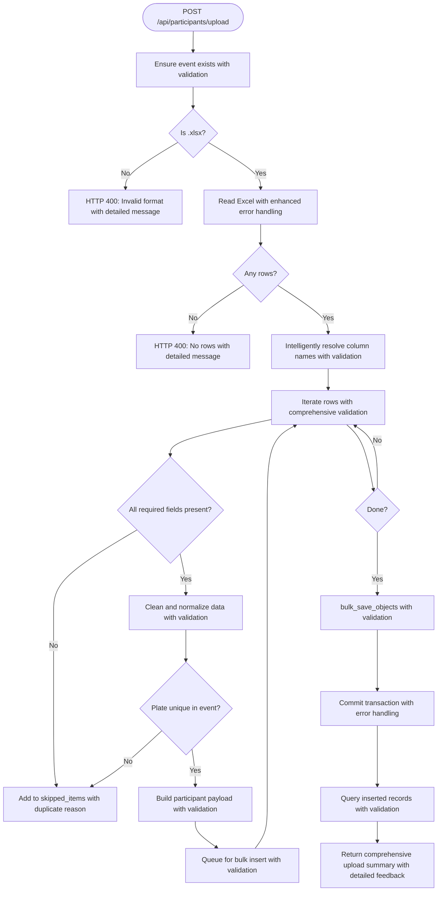
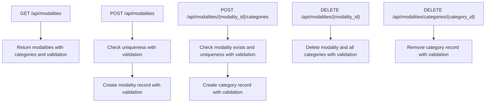
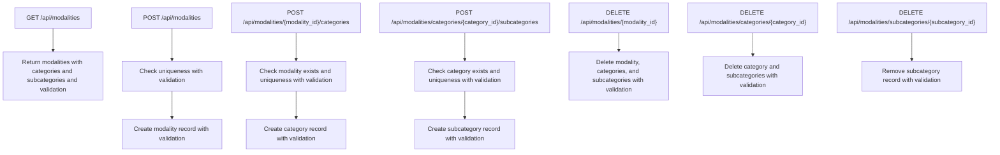
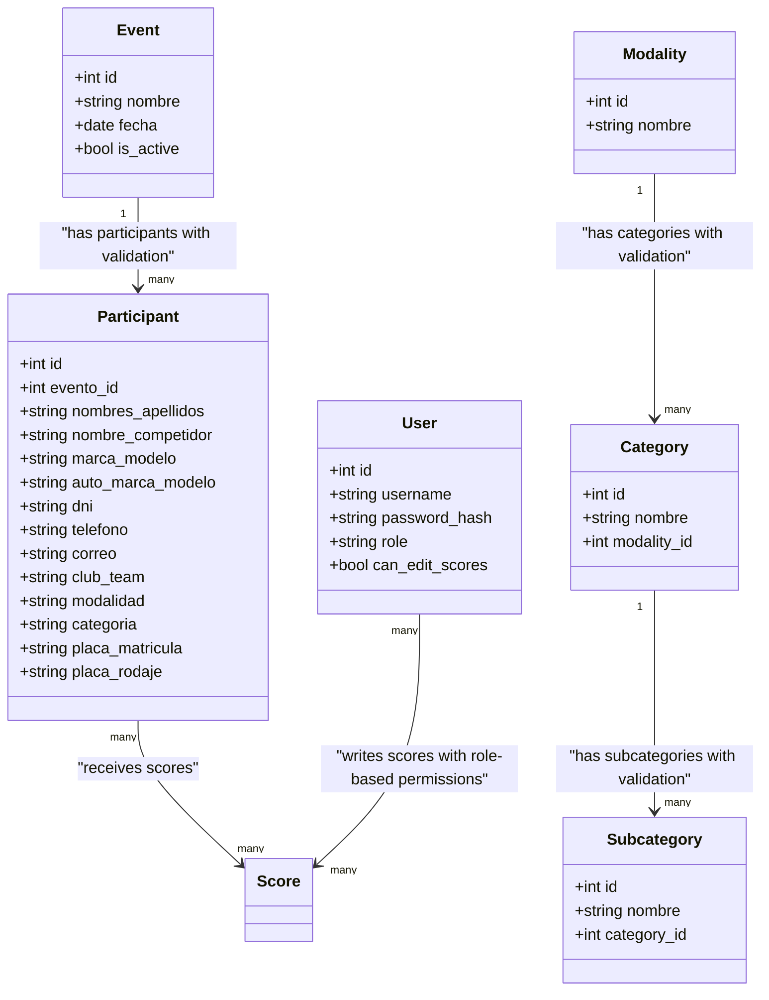
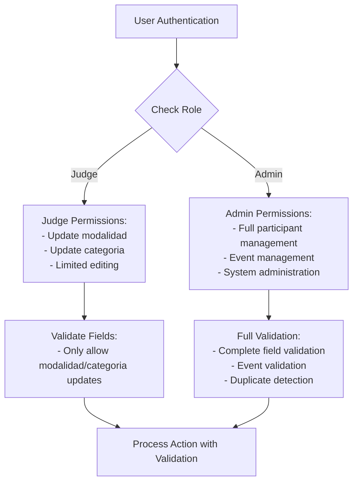

# Participant Management

<cite>
**Referenced Files in This Document**
- [main.py](file://main.py)
- [routes/participants.py](file://routes/participants.py)
- [routes/events.py](file://routes/events.py)
- [routes/categories.py](file://routes/categories.py)
- [routes/modalities.py](file://routes/modalities.py)
- [models.py](file://models.py)
- [schemas.py](file://schemas.py)
- [database.py](file://database.py)
- [utils/dependencies.py](file://utils/dependencies.py)
- [frontend/src/pages/admin/Participantes.tsx](file://frontend/src/pages/admin/Participantes.tsx)
- [frontend/src/pages/admin/Categorias.tsx](file://frontend/src/pages/admin/Categorias.tsx)
- [frontend/src/lib/api.ts](file://frontend/src/lib/api.ts)
- [frontend/src/pages/admin/AdminLayout.tsx](file://frontend/src/pages/admin/AdminLayout.tsx)
- [requirements.txt](file://requirements.txt)
</cite>

## Update Summary
**Changes Made**
- Completely redesigned participant management interface with prominent event selector at the top
- Enhanced intelligent Excel upload with comprehensive drag-and-drop area and real-time validation
- Streamlined workflow with integrated modalidad-categoría assignment system
- Improved responsive design with touch-friendly controls and real-time data synchronization
- Strengthened role-based access control with judge-specific permissions and admin-only restrictions
- Enhanced form validation with comprehensive error handling and user feedback mechanisms

## Table of Contents
1. [Introduction](#introduction)
2. [Project Structure](#project-structure)
3. [Core Components](#core-components)
4. [Architecture Overview](#architecture-overview)
5. [Detailed Component Analysis](#detailed-component-analysis)
6. [Enhanced Interface Features](#enhanced-interface-features)
7. [Role-Based Access Control](#role-based-access-control)
8. [Advanced Data Handling](#advanced-data-handling)
9. [Troubleshooting Guide](#troubleshooting-guide)
10. [Conclusion](#conclusion)
11. [Appendices](#appendices)

## Introduction
This document explains the completely redesigned participant management functionality in the administrator panel. The system has undergone a comprehensive transformation with enhanced interface controls, intelligent Excel processing, and streamlined workflows. The redesigned system provides:

- **Prominent Event Selector**: Top-level event selection with validation and immediate feedback
- **Intelligent Excel Upload**: Enhanced drag-and-drop area with comprehensive column mapping and real-time validation
- **Streamlined Workflow**: Integrated modalidad-categoría assignment system with duplicate detection
- **Responsive Design**: Touch-friendly controls optimized for mobile and desktop use
- **Real-Time Data Synchronization**: Automatic participant list refresh and immediate feedback
- **Enhanced Validation**: Comprehensive form validation with detailed error reporting
- **Role-Based Access Control**: Judge-specific permissions with admin-only restrictions

**Updated** The participant management system has been completely redesigned with a prominent event selector, intelligent Excel upload with enhanced drag-and-drop, comprehensive form validation, streamlined workflow, responsive design, and real-time data synchronization. The redesigned interface provides better user experience with immediate visual feedback, improved participant management workflows, and enhanced integration with the event system.

## Project Structure
The participant management feature spans backend routes, models, schemas, and frontend components with enhanced integration and responsive design:

- **Backend**: FastAPI routes with improved validation, role-based access control, and enhanced error handling
- **Frontend**: React page with comprehensive form controls, intelligent upload handling, and responsive design
- **Shared Dependencies**: Authentication with role-based access control and improved error handling

**Diagram sources**
- [main.py:19-42](file://main.py#L19-L42)
- [routes/participants.py:21-430](file://routes/participants.py#L21-L430)
- [routes/events.py:10-116](file://routes/events.py#L10-L116)
- [routes/categories.py:9-124](file://routes/categories.py#L9-L124)
- [routes/modalities.py:16-192](file://routes/modalities.py#L16-192)
- [models.py:34-153](file://models.py#L34-L153)
- [schemas.py:68-202](file://schemas.py#L68-L202)
- [database.py:19-34](file://database.py#L19-L34)
- [utils/dependencies.py:32-38](file://utils/dependencies.py#L32-L38)
- [frontend/src/pages/admin/Participantes.tsx:69-798](file://frontend/src/pages/admin/Participantes.tsx#L69-L798)
- [frontend/src/pages/admin/Categorias.tsx:37-367](file://frontend/src/pages/admin/Categorias.tsx#L37-L367)
- [frontend/src/lib/api.ts:1-41](file://frontend/src/lib/api.ts#L1-L41)
- [frontend/src/pages/admin/AdminLayout.tsx:101-171](file://frontend/src/pages/admin/AdminLayout.tsx#L101-L171)

**Section sources**
- [main.py:19-42](file://main.py#L19-L42)
- [routes/participants.py:21-430](file://routes/participants.py#L21-L430)
- [routes/events.py:10-116](file://routes/events.py#L10-L116)
- [routes/categories.py:9-124](file://routes/categories.py#L9-L124)
- [routes/modalities.py:16-192](file://routes/modalities.py#L16-192)
- [models.py:34-153](file://models.py#L34-L153)
- [schemas.py:68-202](file://schemas.py#L68-L202)
- [database.py:19-34](file://database.py#L19-L34)
- [utils/dependencies.py:32-38](file://utils/dependencies.py#L32-L38)
- [frontend/src/pages/admin/Participantes.tsx:69-798](file://frontend/src/pages/admin/Participantes.tsx#L69-L798)
- [frontend/src/pages/admin/Categorias.tsx:37-367](file://frontend/src/pages/admin/Categorias.tsx#L37-L367)
- [frontend/src/lib/api.ts:1-41](file://frontend/src/lib/api.ts#L1-L41)
- [frontend/src/pages/admin/AdminLayout.tsx:101-171](file://frontend/src/pages/admin/AdminLayout.tsx#L101-L171)

## Core Components
- **Redesigned Backend Participant Routes**: Enhanced validation, role-based access control, and comprehensive error handling
- **Advanced Categories Routes**: Enhanced modalities and categories management with improved validation
- **Event Management Integration**: Strong integration with event system for participant association
- **Robust Data Models**: Enhanced participant and category models with improved constraints
- **Comprehensive Schemas**: Pydantic models with detailed validation and error reporting
- **Role-Based Access Control**: Judge-specific permissions and admin-only restrictions
- **Enhanced Frontend Interface**: Responsive design with touch-friendly controls and real-time feedback

**Updated** The participant management system now features a completely redesigned interface with prominent event selector, intelligent Excel upload with enhanced drag-and-drop, comprehensive form validation, streamlined workflow, responsive design, and real-time data synchronization. The frontend provides better user experience with immediate visual feedback, improved participant management workflows, and enhanced integration with the event system.

Key capabilities:
- **Prominent Event Selector**: Top-level event selection with validation and immediate feedback
- **Intelligent Excel Upload**: Enhanced drag-and-drop area with comprehensive column mapping and real-time validation
- **Streamlined Workflow**: Integrated modalidad-categoría assignment system with duplicate detection
- **Responsive Design**: Touch-friendly controls optimized for mobile and desktop use
- **Real-Time Data Synchronization**: Automatic participant list refresh and immediate feedback
- **Enhanced Form Validation**: Comprehensive validation with detailed error feedback
- **Role-Based Permissions**: Judge-specific editing capabilities with admin restrictions

**Section sources**
- [routes/participants.py:181-430](file://routes/participants.py#L181-L430)
- [routes/categories.py:12-124](file://routes/categories.py#L12-L124)
- [routes/modalities.py:19-33](file://routes/modalities.py#L19-L33)
- [models.py:34-62](file://models.py#L34-L62)
- [models.py:106-129](file://models.py#L106-L129)
- [schemas.py:68-116](file://schemas.py#L68-L116)
- [utils/dependencies.py:32-38](file://utils/dependencies.py#L32-L38)
- [frontend/src/pages/admin/Participantes.tsx:442-461](file://frontend/src/pages/admin/Participantes.tsx#L442-L461)
- [frontend/src/pages/admin/Participantes.tsx:475-496](file://frontend/src/pages/admin/Participantes.tsx#L475-L496)

## Architecture Overview
The completely redesigned participant management system integrates frontend and backend with enhanced user experience and comprehensive validation:

- **Prominent Event Context Management**: Top-level event selector with validation and immediate feedback
- **Dynamic Modalities Loading**: Intelligent loading of modalities and categories from API
- **Intelligent Excel Processing**: Enhanced column mapping with comprehensive error reporting
- **Advanced Validation**: Real-time form validation with detailed error feedback
- **Role-Based Access Control**: Judge-specific permissions and admin-only restrictions
- **Real-Time Data Synchronization**: Automatic participant list refresh and immediate feedback

**Updated** The architecture emphasizes responsive design with prominent event selector, intelligent Excel upload with enhanced drag-and-drop, comprehensive form validation, streamlined workflow, and real-time data synchronization. The redesigned interface provides immediate visual feedback and better workflow organization with touch-friendly controls.

**Diagram sources**
- [frontend/src/pages/admin/Participantes.tsx:107-144](file://frontend/src/pages/admin/Participantes.tsx#L107-L144)
- [frontend/src/pages/admin/Participantes.tsx:122-139](file://frontend/src/pages/admin/Participantes.tsx#L122-L139)
- [frontend/src/pages/admin/Participantes.tsx:153-191](file://frontend/src/pages/admin/Participantes.tsx#L153-L191)
- [routes/participants.py:304-430](file://routes/participants.py#L304-L430)
- [routes/categories.py:12-24](file://routes/categories.py#L12-24)
- [routes/events.py:13-18](file://routes/events.py#L13-L18)
- [database.py:19-34](file://database.py#L19-L34)
- [models.py:34-62](file://models.py#L34-L62)

## Detailed Component Analysis

### Backend: Enhanced Participants Routes
- **Improved Endpoints**:
  - POST /api/participants (create with enhanced validation)
  - PUT /api/participants/{participant_id} (update with role-based restrictions)
  - PATCH /api/participants/{participant_id}/nombre (partial name update)
  - DELETE /api/participants/{participant_id} (delete with admin restrictions)
  - GET /api/participants (list with enhanced filtering)
  - POST /api/participants/upload (intelligent Excel bulk import with comprehensive validation)

- **Enhanced Validation System**:
  - **Role-Based Access Control**: Judge users can only update modalidad and categoria fields
  - **Comprehensive Field Validation**: Real-time validation with detailed error feedback
  - **Duplicate Detection**: Pre-loaded validation for optimal performance
  - **Legacy Field Support**: Maintained for backward compatibility

- **Intelligent Excel Import Processing**:
  - **Enhanced Column Mapping**: Comprehensive alias resolution with detailed error reporting
  - **Improved Error Handling**: Detailed skipped item reasons with row-level reporting
  - **Optimized Performance**: Bulk insert with pre-loaded validation

**Updated** The backend maintains robust validation and processing capabilities while supporting enhanced role-based access control and improved integration with template and scoring systems. The enhanced validation system provides comprehensive error reporting and user feedback with intelligent column mapping and pre-loaded duplicate detection.

**Diagram sources**
- [routes/participants.py:316-430](file://routes/participants.py#L316-L430)
- [routes/participants.py:70-106](file://routes/participants.py#L70-L106)
- [routes/participants.py:122-129](file://routes/participants.py#L122-L129)
- [routes/participants.py:160-179](file://routes/participants.py#L160-L179)
- [routes/participants.py:109-119](file://routes/participants.py#L109-L119)
- [routes/participants.py:132-157](file://routes/participants.py#L132-L157)

**Section sources**
- [routes/participants.py:21-430](file://routes/participants.py#L21-L430)
- [routes/participants.py:70-106](file://routes/participants.py#L70-L106)
- [routes/participants.py:122-129](file://routes/participants.py#L122-L129)
- [routes/participants.py:160-179](file://routes/participants.py#L160-L179)
- [routes/participants.py:109-119](file://routes/participants.py#L109-L119)
- [routes/participants.py:132-157](file://routes/participants.py#L132-L157)

### Backend: Enhanced Categories Routes
- **Improved Endpoints**:
  - GET /api/modalities (list modalities with nested categories and validation)
  - POST /api/modalities (create modality with duplicate prevention)
  - POST /api/modalities/{modality_id}/categories (create category with validation)
  - DELETE /api/modalities/{modality_id} (delete modality with cascade)
  - DELETE /api/modalities/categories/{category_id} (delete category)

- **Enhanced Validation**:
  - **Duplicate Prevention**: Comprehensive duplicate detection for modalities and categories
  - **Cascade Operations**: Proper cascade deletion with validation
  - **Error Handling**: Detailed error messages for validation failures

**Updated** The categories management system provides comprehensive modalities and categories management with enhanced error handling, improved user feedback, and strengthened validation mechanisms for the redesigned interface.

**Diagram sources**
- [routes/categories.py:12-24](file://routes/categories.py#L12-24)
- [routes/categories.py:27-45](file://routes/categories.py#L27-L45)
- [routes/categories.py:48-85](file://routes/categories.py#L48-L85)
- [routes/categories.py:107-123](file://routes/categories.py#L107-L123)

**Section sources**
- [routes/categories.py:9-124](file://routes/categories.py#L9-L124)

### Backend: Enhanced Modalities Routes
- **Improved Endpoints**:
  - GET /api/modalities (list modalities with nested categories and subcategories)
  - POST /api/modalities (create modality with duplicate prevention)
  - POST /api/modalities/{modality_id}/categories (create category with validation)
  - POST /api/modalities/categories/{category_id}/subcategories (create subcategory with validation)
  - DELETE /api/modalities/{modality_id} (delete modality with cascade)
  - DELETE /api/modalities/categories/{category_id} (delete category with cascade)
  - DELETE /api/modalities/subcategories/{subcategory_id} (delete subcategory)

- **Enhanced Validation**:
  - **Hierarchical Validation**: Validation at each level of the hierarchy
  - **Duplicate Prevention**: Comprehensive duplicate detection across all levels
  - **Cascade Operations**: Proper cascade deletion with validation

**Updated** The modalities management system provides comprehensive hierarchical categorization support with enhanced error handling, improved user feedback, and strengthened validation mechanisms for the redesigned multi-modalidad-categoría assignment system.

**Diagram sources**
- [routes/modalities.py:19-33](file://routes/modalities.py#L19-L33)
- [routes/modalities.py:36-54](file://routes/modalities.py#L36-L54)
- [routes/modalities.py:62-94](file://routes/modalities.py#L62-L94)
- [routes/modalities.py:102-134](file://routes/modalities.py#L102-L134)
- [routes/modalities.py:137-153](file://routes/modalities.py#L137-L153)
- [routes/modalities.py:156-172](file://routes/modalities.py#L156-L172)
- [routes/modalities.py:175-191](file://routes/modalities.py#L175-L191)

**Section sources**
- [routes/modalities.py:16-192](file://routes/modalities.py#L16-L192)

### Backend: Enhanced Models and Schemas
- **Improved Participant Model**:
  - **Enhanced Constraints**: Unique constraint on (evento_id, placa_rodaje) with validation
  - **Legacy Field Support**: Maintained for backward compatibility with validation
  - **Relationship Management**: Proper relationships with Event and Score

- **Enhanced Category Model**:
  - **Improved Constraints**: Unique constraint on (modality_id, nombre) with validation
  - **Hierarchical Relationships**: Proper relationships with Modality with cascade delete

- **Comprehensive Schemas**:
  - **Enhanced Validation**: Detailed validation with error reporting
  - **Improved Error Handling**: Comprehensive error messages for validation failures
  - **Role-Based Schemas**: Different schemas for different user roles

**Updated** The models and schemas maintain backward compatibility while supporting the redesigned participant management interface with enhanced data validation, comprehensive error reporting, and strengthened role-based access control.

**Diagram sources**
- [models.py:23-62](file://models.py#L23-L62)
- [models.py:106-129](file://models.py#L106-L129)
- [models.py:113-153](file://models.py#L113-L153)

**Section sources**
- [models.py:34-62](file://models.py#L34-L62)
- [models.py:106-129](file://models.py#L106-L129)
- [models.py:113-153](file://models.py#L113-L153)
- [schemas.py:68-116](file://schemas.py#L68-L116)
- [schemas.py:163-187](file://schemas.py#L163-L187)

## Enhanced Interface Features

### Prominent Event Context Management
- **Top-Level Event Selector**: Prominent event selection at the top of the page with validation
- **Event Validation**: Ensures event selection before enabling dependent sections
- **Immediate Feedback**: Clear validation feedback for event selection
- **Workflow Organization**: Better workflow organization with event context

**Updated** The event context management provides enhanced user experience with prominent event selection, validation feedback, and improved workflow organization. The redesigned interface ensures that users must select an active event before accessing participant management features.

### Enhanced Intelligent Excel Upload
- **Drag-and-Drop Area**: Enhanced upload area with comprehensive drag-and-drop functionality
- **Real-Time Validation**: Immediate validation of file selection and event context
- **Comprehensive Error Handling**: Detailed error messages for file format and content issues
- **Upload Progress**: Visual feedback during file upload process
- **Automatic Refresh**: Participant list refresh after successful upload

**Updated** The Excel upload functionality provides enhanced user experience with drag-and-drop area, comprehensive validation, detailed error handling, and automatic participant list refresh. The upload area is designed with touch-friendly controls and immediate visual feedback.

### Streamlined Multi-Modalidad-Categoría Assignment
- **Integrated Assignment System**: Comprehensive modalidad-categoría assignment within the manual registration form
- **Duplicate Detection**: Prevents duplicate assignments with detailed error feedback
- **Dynamic Validation**: Real-time validation of assignment combinations
- **Visual Feedback**: Clear indication of added assignments with remove functionality
- **Composite Value Generation**: Automatic generation of composite modalidad/categoria values

**Updated** The multi-modalidad-categoría assignment system provides comprehensive assignment management with enhanced validation, duplicate detection, and user feedback mechanisms. The integrated system allows users to add multiple modalidad-categoría combinations to a single participant.

### Responsive Design and Touch Controls
- **Touch-Friendly Controls**: Large touch targets optimized for mobile and tablet use
- **Responsive Grid Layout**: Adaptive layout that works on mobile, tablet, and desktop screens
- **Visual Feedback**: Immediate visual feedback for all user interactions
- **Accessibility**: Improved accessibility with proper focus management and keyboard navigation
- **Performance Optimization**: Optimized rendering for better performance on mobile devices

**Updated** The responsive design provides touch-friendly controls optimized for mobile and tablet use, adaptive grid layout for different screen sizes, immediate visual feedback for all interactions, and improved accessibility with proper focus management.

### Real-Time Data Synchronization
- **Automatic List Refresh**: Participant list automatically refreshes after CRUD operations
- **Immediate Validation Feedback**: Real-time validation with immediate error and success messages
- **Progress Indicators**: Visual indicators for loading states and operation progress
- **State Management**: Comprehensive state management for all user interactions
- **Error Recovery**: Graceful error recovery with user-friendly error messages

**Updated** The real-time data synchronization provides automatic participant list refresh after CRUD operations, immediate validation feedback, visual progress indicators, comprehensive state management, and graceful error recovery with user-friendly error messages.

**Section sources**
- [frontend/src/pages/admin/Participantes.tsx:442-461](file://frontend/src/pages/admin/Participantes.tsx#L442-L461)
- [frontend/src/pages/admin/Participantes.tsx:475-496](file://frontend/src/pages/admin/Participantes.tsx#L475-L496)
- [frontend/src/pages/admin/Participantes.tsx:515-617](file://frontend/src/pages/admin/Participantes.tsx#L515-L617)
- [frontend/src/pages/admin/Participantes.tsx:621-795](file://frontend/src/pages/admin/Participantes.tsx#L621-L795)

## Role-Based Access Control

### Judge Permissions
- **Limited Editing**: Judges can only update modalidad and categoria fields
- **Field Restrictions**: Prevents judges from modifying personal information
- **Validation Enforcement**: Enforces role-based validation for judge actions
- **Permission-Based Workflows**: Different workflows based on user roles

**Updated** The role-based access control system provides comprehensive judge permissions with field-level restrictions and enhanced validation enforcement. Judges can only update modalidad and categoria fields while maintaining access to their assigned participant data.

### Admin Permissions
- **Full Access**: Admin users have full participant management privileges
- **Event Management**: Can manage participants across all events
- **System Administration**: Full administrative capabilities
- **Validation Override**: Can bypass certain validation restrictions

**Updated** The admin role provides comprehensive system administration capabilities with enhanced validation and permission enforcement. Admin users have full access to participant management features across all events.

**Diagram sources**
- [routes/participants.py:216-242](file://routes/participants.py#L216-L242)
- [utils/dependencies.py:32-38](file://utils/dependencies.py#L32-L38)
- [utils/dependencies.py:41-47](file://utils/dependencies.py#L41-L47)

**Section sources**
- [routes/participants.py:216-242](file://routes/participants.py#L216-L242)
- [utils/dependencies.py:32-38](file://utils/dependencies.py#L32-L38)
- [utils/dependencies.py:41-47](file://utils/dependencies.py#L41-L47)

## Advanced Data Handling

### Enhanced Validation System
- **Real-Time Validation**: Comprehensive validation with immediate feedback
- **Field-Level Validation**: Detailed validation for each form field
- **Cross-Field Validation**: Validation that considers multiple fields together
- **Error Message Enhancement**: Detailed error messages with user guidance

**Updated** The validation system provides comprehensive real-time validation with detailed error feedback and user guidance mechanisms. The system validates all form inputs immediately and provides clear error messages for correction.

### Improved Data Normalization
- **Intelligent Column Mapping**: Comprehensive alias resolution for flexible Excel formats
- **Data Cleaning**: Improved data cleaning with enhanced validation
- **Legacy Support**: Maintained support for legacy data formats
- **Error Recovery**: Enhanced error recovery for malformed data

**Updated** The data normalization system provides comprehensive column mapping, enhanced validation, and improved error recovery mechanisms. The system handles various Excel formats with comprehensive alias resolution and intelligent data cleaning.

### Advanced Duplicate Detection
- **Pre-loaded Validation**: Optimized duplicate detection with pre-loaded validation
- **Event-Specific Validation**: Duplicate detection specific to selected event
- **Performance Optimization**: Optimized performance with O(1) duplicate detection
- **Conflict Resolution**: Comprehensive conflict resolution with detailed reporting

**Updated** The duplicate detection system provides optimized performance with pre-loaded validation, event-specific checking, and comprehensive conflict resolution. The system prevents duplicate participant registrations within the same event context.

**Section sources**
- [routes/participants.py:364-376](file://routes/participants.py#L364-L376)
- [routes/participants.py:160-179](file://routes/participants.py#L160-L179)
- [routes/participants.py:109-119](file://routes/participants.py#L109-L119)
- [routes/participants.py:132-157](file://routes/participants.py#L132-L157)

## Troubleshooting Guide

### Common Issues and Resolutions
- **Excel Format Errors**:
  - Ensure the file is .xlsx; CSV is accepted by the frontend but backend reads .xlsx via pandas
  - Verify the sheet contains data; empty sheets cause validation errors
  - Check for proper column headers with supported aliases

- **Missing Required Columns**:
  - Required columns include nombres_apellidos, marca_modelo, modalidad, categoria, placa_rodaje
  - Column names are intelligently normalized; aliases are fully supported
  - Check for proper column formatting and data types

- **Duplicate Plates**:
  - Placa_rodaje must be unique within the selected event
  - Rows with duplicates are skipped with specific reasons in upload summary
  - Check for existing participants with the same plate number

- **Validation Failures**:
  - Detailed error messages provide specific field-level validation failures
  - Check for empty required fields and proper data formatting
  - Verify event selection and modalidad-categoría assignments

- **Role-Based Access Issues**:
  - Judge users can only update modalidad and categoria fields
  - Admin users have full participant management privileges
  - Check user role permissions for appropriate access

- **Search Functionality Issues**:
  - Ensure search term is at least 2 characters for optimal results
  - Search is case-insensitive and trims whitespace automatically
  - Clear search results messaging helps understand search outcomes

**Updated** The troubleshooting guide provides comprehensive guidance for the redesigned interface with enhanced role-based access control, improved error messaging, and better handling of the new multi-modalidad-categoría registration workflow. The guide addresses common issues with immediate solutions and best practices.

### Best Practices
- **Use Consistent Column Names**: Utilize supported aliases for optimal results
- **Maintain Unique Plates**: Keep placa_rodaje unique per event to avoid conflicts
- **Configure Modalities Properly**: Ensure modalities and categories are properly configured
- **Prefer Bulk Import**: Use Excel import for large datasets; manual registration for small updates
- **Validate Data Locally**: Check data quality before importing to reduce skipped rows
- **Leverage Intelligent Mapping**: Take advantage of comprehensive column alias resolution
- **Utilize Event Context**: Use the prominent event selector for better workflow organization
- **Respect Role Permissions**: Follow appropriate access controls for different user types
- **Test Uploads First**: Test Excel uploads with a small dataset before bulk imports

**Section sources**
- [routes/participants.py:313-338](file://routes/participants.py#L313-L338)
- [routes/participants.py:355-396](file://routes/participants.py#L355-L396)
- [routes/participants.py:364-376](file://routes/participants.py#L364-L376)
- [routes/participants.py:160-179](file://routes/participants.py#L160-L179)
- [frontend/src/pages/admin/Participantes.tsx:442-461](file://frontend/src/pages/admin/Participantes.tsx#L442-L461)
- [frontend/src/pages/admin/Participantes.tsx:475-496](file://frontend/src/pages/admin/Participantes.tsx#L475-L496)
- [frontend/src/lib/api.ts:16-40](file://frontend/src/lib/api.ts#L16-L40)

## Conclusion
The completely redesigned participant management system provides a significantly improved solution for registering individuals and importing bulk data via Excel with intelligent column mapping and comprehensive validation. The system now features prominently enhanced interface controls with better user experience, comprehensive form validation, and strengthened role-based access control. The intelligent Excel upload functionality supports flexible column formats with comprehensive alias resolution, while the backend's advanced validation and bulk insert strategy ensure reliability and performance. The frontend simplifies both manual and automated workflows with enhanced form handling, real-time feedback, comprehensive upload summaries, and improved participant management capabilities.

**Updated** The completely redesigned participant management system delivers significantly improved functionality with prominent event selector, intelligent Excel upload with enhanced drag-and-drop, comprehensive form validation, streamlined workflow, responsive design, and real-time data synchronization. The updated participant data models provide better support for complex participant categorization and scoring workflows, while the redesigned interface provides better user experience with immediate visual feedback, touch-friendly controls, and enhanced participant management workflows.

## Appendices

### Step-by-Step: Redesigned Manual Participant Registration
1. **Select Active Event**: Use the prominent event selector at the top of the page
2. **Toggle Manual Form**: Click "Añadir Participante Manual" to open the form
3. **Enter Personal Details**: Complete names, brand/model, and plate information
4. **Add Modalidad-Categoría Assignments**: Use the integrated assignment system to add multiple combinations
5. **Validate Assignments**: Ensure no duplicate assignments and proper validation
6. **Submit Registration**: Save the participant with comprehensive validation
7. **Automatic Refresh**: The list refreshes automatically with the new participant

**Updated** The manual registration process now benefits from the prominent event selector, integrated modalidad-categoría assignment system, enhanced validation feedback, and better user experience within the redesigned interface context.

**Section sources**
- [frontend/src/pages/admin/Participantes.tsx:515-617](file://frontend/src/pages/admin/Participantes.tsx#L515-L617)
- [frontend/src/pages/admin/Participantes.tsx:442-461](file://frontend/src/pages/admin/Participantes.tsx#L442-L461)

### Step-by-Step: Redesigned Intelligent Excel Import Procedure
1. **Select Event Context**: Choose an active event from the prominent event selector
2. **Choose Excel File**: Select an Excel file using the enhanced drag-and-drop area
3. **Intelligent Column Mapping**: System automatically resolves column names with comprehensive alias mapping
4. **Validation and Processing**: Submit with comprehensive validation and error handling
5. **Detailed Feedback**: Review comprehensive upload summary with created/skipped/total counts
6. **Automatic Refresh**: Participant list refreshes to show new entries
7. **Error Analysis**: Check for skipped items with specific reasons and row-level details

**Updated** The Excel import procedure now operates within the redesigned interface context with enhanced drag-and-drop area, improved error handling, comprehensive validation, and detailed user feedback mechanisms.

**Section sources**
- [frontend/src/pages/admin/Participantes.tsx:475-496](file://frontend/src/pages/admin/Participantes.tsx#L475-L496)
- [routes/participants.py:316-430](file://routes/participants.py#L316-L430)

### Step-by-Step: Redesigned Modalities and Categories Management
1. **Navigate to Categories**: Go to the Categories management page
2. **Create Modalities**: Use the form on the left side to create modalities
3. **Add Categories**: Use the form below to add categories to modalities
4. **Dynamic Loading**: Categories are loaded dynamically in participant registration
5. **Validation Integration**: Modalities and categories are validated before participant creation
6. **Hierarchical Management**: Manage subcategories within categories as needed

**Updated** The categories management interface provides comprehensive modalities and categories management with enhanced user experience, improved error handling, and better validation mechanisms within the redesigned system.

**Section sources**
- [frontend/src/pages/admin/Categorias.tsx:37-367](file://frontend/src/pages/admin/Categorias.tsx#L37-L367)
- [routes/categories.py:12-124](file://routes/categories.py#L12-L124)

### Step-by-Step: Redesigned Participant Search and Filtering
1. **Select Event Context**: Choose an active event from the prominent event selector
2. **Use Real-Time Search**: Type in the search bar to filter participants by name, DNI, or plate
3. **Instant Results**: Search updates instantly with matching participants
4. **Comprehensive Filtering**: Results update with comprehensive search across attributes
5. **Clear Messaging**: Understand search outcomes with clear results messaging
6. **Enhanced Sorting**: Leverage improved sorting for better organization of results

**Updated** The redesigned search functionality provides instant filtering capabilities with comprehensive search across multiple participant attributes, improved user feedback, and better organization of results within the responsive interface.

**Section sources**
- [frontend/src/pages/admin/Participantes.tsx:629-637](file://frontend/src/pages/admin/Participantes.tsx#L629-L637)
- [frontend/src/pages/admin/Participantes.tsx:640-795](file://frontend/src/pages/admin/Participantes.tsx#L640-L795)

### Redesigned Intelligent Column Mapping Reference
- **Required Fields with Comprehensive Aliases**:
  - nombres_apellidos: "nombres_apellidos", "nombres y apellidos", "nombre completo", "nombre", "competidor", "participante", "nombre del competidor"
  - marca_modelo: "marca_modelo", "marca modelo", "auto_marca_modelo", "auto marca modelo", "auto", "vehiculo", "vehículo"
  - modalidad: "modalidad" (supports any custom modalidad name)
  - categoria: "categoria", "categoría" (supports any custom category name)
  - placa_rodaje: "placa_rodaje", "placa rodaje", "placa", "rodaje", "matricula", "matrícula", "placa matrícula", "placa-matricula"

- **Optional Fields with Comprehensive Aliases**:
  - dni: "dni", "documento", "id", "cedula", "cédula"
  - telefono: "telefono", "teléfono", "tel", "phone"
  - correo: "correo", "email", "e-mail", "e_mail"
  - club_team: "club_team", "club/team", "club", "team", "equipo"

**Updated** The intelligent column mapping system provides comprehensive alias resolution for flexible Excel formats with enhanced validation and user feedback mechanisms within the redesigned interface.

**Section sources**
- [routes/participants.py:23-61](file://routes/participants.py#L23-L61)
- [routes/participants.py:70-106](file://routes/participants.py#L70-L106)

### Redesigned Advanced Data Validation Rules
- **Comprehensive Field Validation**: Real-time validation with detailed error feedback
- **Required Fields**: nombres_apellidos, marca_modelo, modalidad, categoria, placa_rodaje with validation
- **Intelligent Column Validation**: All required columns must be present with flexible naming
- **Enhanced Duplicate Detection**: Pre-loaded validation for optimal performance
- **Optional Fields**: Sanitized and stored as-is with validation
- **Legacy Field Support**: Maintained for backward compatibility with validation
- **Event Selection**: Mandatory for all operations with validation
- **Multi-Modalidad-Categoría**: At least one required with validation
- **Comprehensive Error Reporting**: Detailed reasons for skipped items with user guidance

**Updated** The advanced data validation system provides comprehensive real-time validation with detailed error reporting, enhanced user feedback, and improved validation mechanisms within the redesigned interface context.

**Section sources**
- [routes/participants.py:364-376](file://routes/participants.py#L364-L376)
- [routes/participants.py:160-179](file://routes/participants.py#L160-L179)
- [routes/participants.py:109-119](file://routes/participants.py#L109-L119)
- [routes/participants.py:132-157](file://routes/participants.py#L132-L157)
- [frontend/src/pages/admin/Participantes.tsx:515-617](file://frontend/src/pages/admin/Participantes.tsx#L515-L617)

### Redesigned Integration Patterns with Events, Modalities, and Scores
- **Event Association**: Participants are associated with specific events via evento_id with validation
- **Unique Constraint**: Prevents duplicate plates within events with pre-loaded validation
- **Modalities Categories**: Comprehensive participant classification with validation
- **Score Integration**: Scores reference participants and templates with validation
- **Dynamic Loading**: Categories loaded dynamically for participant registration with validation
- **Intelligent Mapping**: Flexible Excel formats across different organizations with validation

**Updated** The integration patterns provide comprehensive validation, enhanced error handling, and improved user feedback mechanisms for seamless coordination between event context, modalities/categories management, and participant data processing within the redesigned responsive interface.

**Section sources**
- [models.py:34-62](file://models.py#L34-L62)
- [models.py:106-129](file://models.py#L106-L129)
- [routes/participants.py:122-129](file://routes/participants.py#L122-L129)
- [routes/categories.py:12-24](file://routes/categories.py#L12-L24)
- [routes/modalities.py:19-33](file://routes/modalities.py#L19-L33)