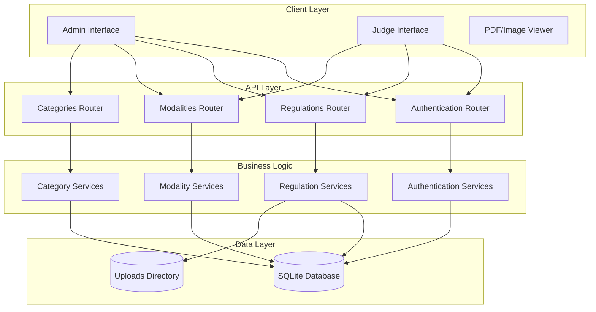
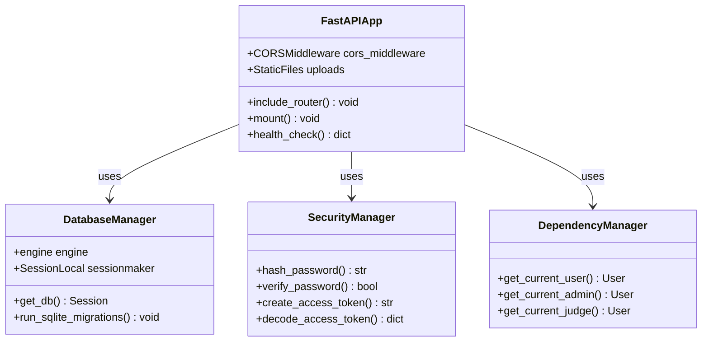
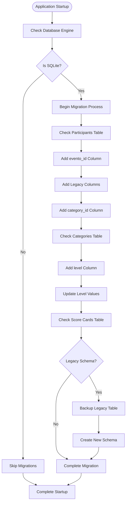
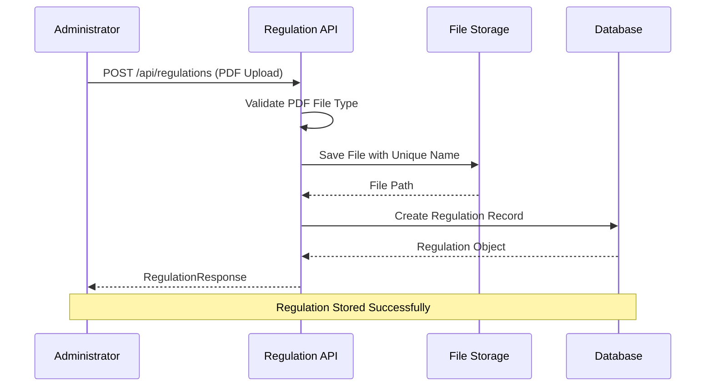
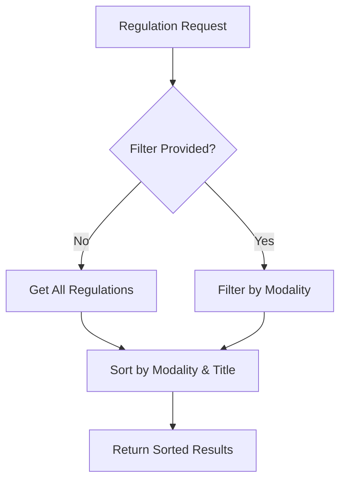
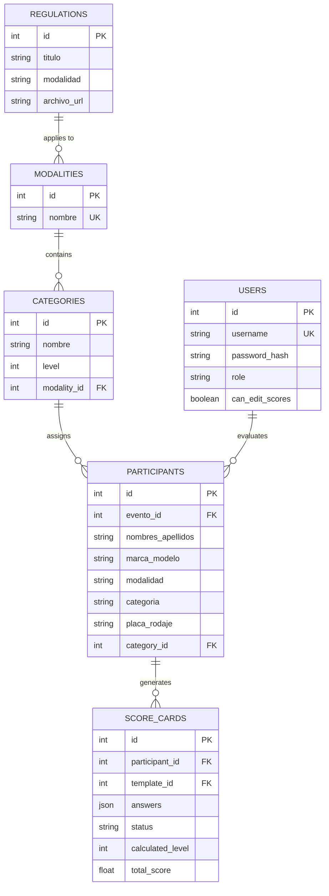
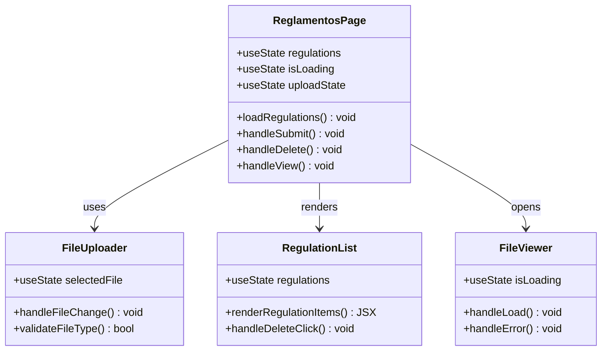
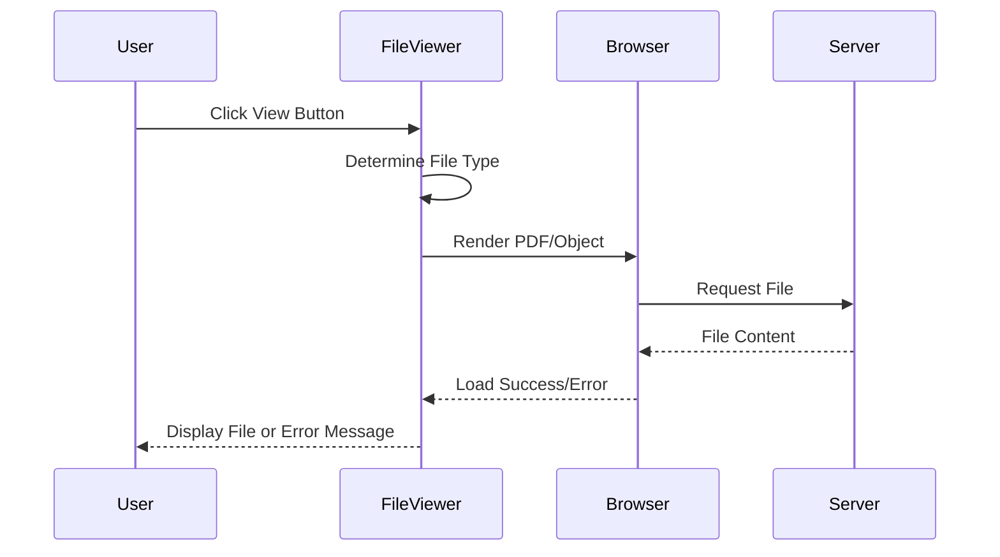
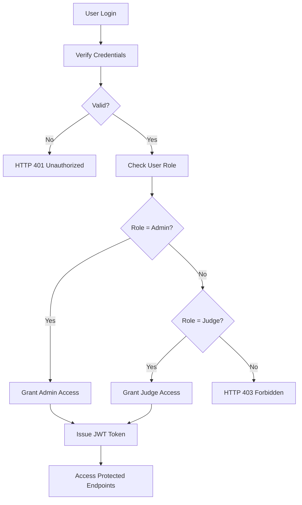
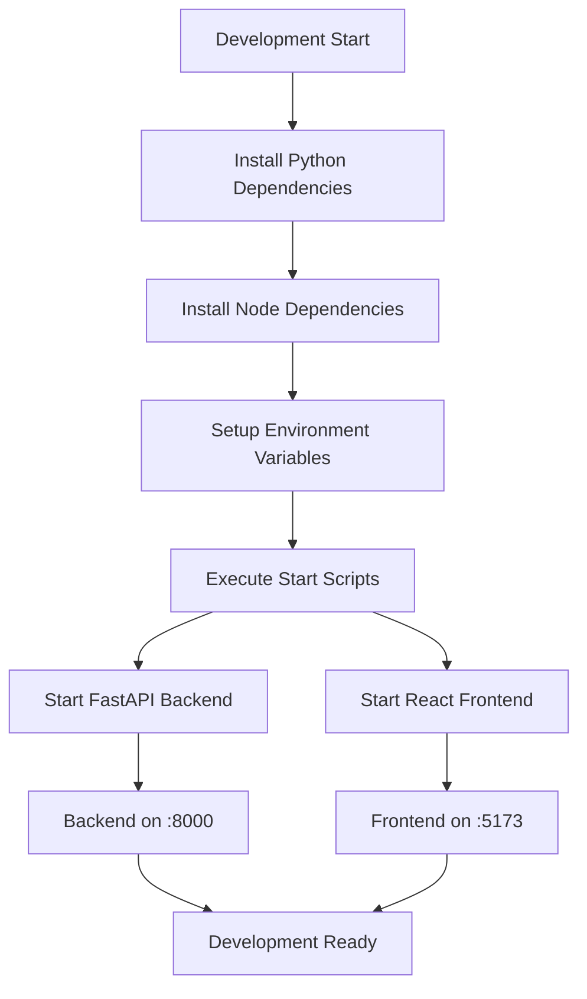

# Regulation Management System

<cite>
**Referenced Files in This Document**
- [main.py](file://main.py)
- [models.py](file://models.py)
- [schemas.py](file://schemas.py)
- [database.py](file://database.py)
- [routes/regulations.py](file://routes/regulations.py)
- [routes/modalities.py](file://routes/modalities.py)
- [routes/categories.py](file://routes/categories.py)
- [routes/auth.py](file://routes/auth.py)
- [utils/dependencies.py](file://utils/dependencies.py)
- [utils/security.py](file://utils/security.py)
- [frontend/src/pages/admin/Reglamentos.tsx](file://frontend/src/pages/admin/Reglamentos.tsx)
- [frontend/src/pages/juez/Reglamentos.tsx](file://frontend/src/pages/juez/Reglamentos.tsx)
- [frontend/src/components/FileViewer.tsx](file://frontend/src/components/FileViewer.tsx)
- [frontend/src/lib/api.ts](file://frontend/src/lib/api.ts)
- [start.sh](file://start.sh)
- [requirements.txt](file://requirements.txt)
</cite>

## Table of Contents
1. [Introduction](#introduction)
2. [System Architecture](#system-architecture)
3. [Core Components](#core-components)
4. [Regulation Management Module](#regulation-management-module)
5. [Database Schema](#database-schema)
6. [Frontend Implementation](#frontend-implementation)
7. [Security and Authentication](#security-and-authentication)
8. [Development Setup](#development-setup)
9. [API Endpoints](#api-endpoints)
10. [Troubleshooting Guide](#troubleshooting-guide)
11. [Conclusion](#conclusion)

## Introduction

The Regulation Management System is a comprehensive web application designed for the automotive competition industry, specifically tailored for "Car Audio y Tuning" events. This system provides a centralized platform for managing competition regulations, modalities, categories, and participant scoring systems.

The application features a dual-role architecture supporting both administrators who can upload and manage official regulations, and judges who can access and review regulations specific to their assigned modalities. Built with modern technologies including FastAPI for the backend and React with TypeScript for the frontend, the system ensures secure, scalable, and maintainable regulation management.

## System Architecture

The Regulation Management System follows a client-server architecture with clear separation of concerns between the frontend and backend components.

**Diagram sources**
- [main.py:26-47](file://main.py#L26-L47)
- [routes/regulations.py:15](file://routes/regulations.py#L15)
- [routes/auth.py:10](file://routes/auth.py#L10)

The architecture consists of four main layers:

1. **Presentation Layer**: React-based frontend with separate interfaces for administrators and judges
2. **API Layer**: FastAPI routers handling HTTP requests and responses
3. **Business Logic Layer**: Service functions implementing application-specific logic
4. **Data Layer**: SQLite database with file storage for uploaded regulations

## Core Components

### Backend Application Structure

The backend application is built using FastAPI, providing automatic OpenAPI documentation and type safety. The main application initializes database connections, configures CORS middleware, and mounts static file serving for uploaded content.

**Diagram sources**
- [main.py:26-53](file://main.py#L26-L53)
- [database.py:28-34](file://database.py#L28-L34)
- [utils/security.py:17-53](file://utils/security.py#L17-L53)
- [utils/dependencies.py:16-71](file://utils/dependencies.py#L16-L71)

**Section sources**
- [main.py:1-53](file://main.py#L1-L53)
- [database.py:1-193](file://database.py#L1-L193)
- [utils/security.py:1-54](file://utils/security.py#L1-L54)
- [utils/dependencies.py:1-71](file://utils/dependencies.py#L1-L71)

### Database Initialization and Migration

The system includes sophisticated database migration capabilities to handle schema evolution and backward compatibility. The migration system automatically updates existing tables while preserving historical data.

**Diagram sources**
- [database.py:36-193](file://database.py#L36-L193)

**Section sources**
- [database.py:36-193](file://database.py#L36-L193)

## Regulation Management Module

### Core Functionality

The regulation management module serves as the central hub for storing and distributing official competition regulations. Administrators can upload PDF documents, assign them to specific modalities, and manage the complete lifecycle of regulation documents.

**Diagram sources**
- [routes/regulations.py:20-64](file://routes/regulations.py#L20-L64)

### File Upload and Validation

The system implements robust file handling with comprehensive validation and security measures. Uploaded files are validated for type compliance and stored with unique identifiers to prevent conflicts.

**Section sources**
- [routes/regulations.py:1-110](file://routes/regulations.py#L1-L110)

### Regulation Retrieval and Filtering

Users can retrieve regulations with flexible filtering capabilities, allowing judges to access modal-specific regulations efficiently.

**Diagram sources**
- [routes/regulations.py:67-79](file://routes/regulations.py#L67-L79)

**Section sources**
- [routes/regulations.py:67-79](file://routes/regulations.py#L67-L79)

## Database Schema

The system utilizes SQLAlchemy ORM for database modeling, providing type-safe data access and automatic schema generation. The database schema supports complex relationships between regulations, modalities, categories, and participants.

**Diagram sources**
- [models.py:165-225](file://models.py#L165-L225)

### Key Database Features

1. **Unique Constraints**: Enforced at the database level to prevent duplicates
2. **Foreign Key Relationships**: Maintained referential integrity across tables
3. **JSON Fields**: Flexible storage for dynamic content like regulation structures
4. **Automatic Indexing**: Optimized queries on frequently accessed fields

**Section sources**
- [models.py:1-225](file://models.py#L1-L225)

## Frontend Implementation

### Administrative Interface

The administrative interface provides comprehensive tools for managing regulations, including upload forms, validation, and bulk operations.

**Diagram sources**
- [frontend/src/pages/admin/Reglamentos.tsx:22-304](file://frontend/src/pages/admin/Reglamentos.tsx#L22-L304)

### Judge Interface

The judge interface focuses on accessibility and usability, allowing judges to quickly find regulations relevant to their assigned modalities.

**Section sources**
- [frontend/src/pages/admin/Reglamentos.tsx:1-304](file://frontend/src/pages/admin/Reglamentos.tsx#L1-L304)
- [frontend/src/pages/juez/Reglamentos.tsx:1-173](file://frontend/src/pages/juez/Reglamentos.tsx#L1-L173)

### File Viewing System

The integrated file viewing system supports multiple document types with responsive design and offline capability.

**Diagram sources**
- [frontend/src/components/FileViewer.tsx:98-146](file://frontend/src/components/FileViewer.tsx#L98-L146)

**Section sources**
- [frontend/src/components/FileViewer.tsx:1-157](file://frontend/src/components/FileViewer.tsx#L1-L157)

## Security and Authentication

### Role-Based Access Control

The system implements a robust role-based access control system with distinct permissions for administrators and judges.

**Diagram sources**
- [utils/dependencies.py:32-47](file://utils/dependencies.py#L32-L47)
- [routes/auth.py:13-36](file://routes/auth.py#L13-L36)

### Token-Based Authentication

The authentication system uses JSON Web Tokens (JWT) with configurable expiration times and secure signing algorithms.

**Section sources**
- [utils/dependencies.py:1-71](file://utils/dependencies.py#L1-L71)
- [routes/auth.py:1-37](file://routes/auth.py#L1-L37)
- [utils/security.py:1-54](file://utils/security.py#L1-L54)

## Development Setup

### Environment Configuration

The development environment requires Python 3.8+ and Node.js for frontend development. The system uses virtual environments and npm for dependency management.

**Diagram sources**
- [start.sh:1-16](file://start.sh#L1-L16)

### Required Dependencies

The system requires specific Python packages for full functionality, including FastAPI for the web framework, SQLAlchemy for database operations, and bcrypt for password hashing.

**Section sources**
- [requirements.txt:1-10](file://requirements.txt#L1-L10)
- [start.sh:1-16](file://start.sh#L1-L16)

## API Endpoints

### Regulation Management Endpoints

The system provides comprehensive RESTful APIs for regulation management with proper HTTP status codes and error handling.

| Endpoint | Method | Description | Authentication |
|----------|--------|-------------|----------------|
| `/api/regulations` | POST | Upload new regulation PDF | Admin Only |
| `/api/regulations` | GET | List all regulations | All Users |
| `/api/regulations/{id}` | DELETE | Delete regulation by ID | Admin Only |

### Authentication Endpoints

| Endpoint | Method | Description | Authentication |
|----------|--------|-------------|----------------|
| `/api/login` | POST | User authentication | No Authentication |
| `/api/logout` | POST | User logout | Required |

### Modalities and Categories Endpoints

| Endpoint | Method | Description | Authentication |
|----------|--------|-------------|----------------|
| `/api/modalities` | GET | List all modalities | All Users |
| `/api/modalities` | POST | Create new modality | Admin Only |
| `/api/modalities/{id}/categories` | POST | Create category in modality | Admin Only |
| `/api/modalities/categories/{id}` | PUT | Update category | Admin Only |
| `/api/modalities/categories/{id}` | DELETE | Delete category | Admin Only |

**Section sources**
- [routes/regulations.py:15-110](file://routes/regulations.py#L15-L110)
- [routes/auth.py:10-37](file://routes/auth.py#L10-L37)
- [routes/modalities.py:15-180](file://routes/modalities.py#L15-L180)
- [routes/categories.py:9-174](file://routes/categories.py#L9-L174)

## Troubleshooting Guide

### Common Issues and Solutions

**File Upload Failures**
- Verify PDF file type validation
- Check upload directory permissions
- Ensure sufficient disk space
- Validate file size limits

**Database Migration Errors**
- Review migration logs for specific errors
- Check SQLite version compatibility
- Verify database file permissions
- Restart application after manual fixes

**Authentication Problems**
- Verify JWT secret key configuration
- Check token expiration settings
- Validate user credentials
- Review role assignments

**Frontend Loading Issues**
- Clear browser cache and cookies
- Check network connectivity
- Verify API endpoint accessibility
- Review console error messages

### Performance Optimization

1. **Database Indexing**: Ensure proper indexing on frequently queried fields
2. **File Compression**: Consider PDF optimization for large files
3. **Caching Strategy**: Implement appropriate caching for static assets
4. **Connection Pooling**: Optimize database connection management

### Security Considerations

1. **Input Validation**: All user inputs should be properly validated
2. **File Sanitization**: Uploaded files should be scanned for malicious content
3. **Rate Limiting**: Implement rate limiting for API endpoints
4. **HTTPS Enforcement**: Deploy with HTTPS in production environments

## Conclusion

The Regulation Management System provides a comprehensive solution for managing competition regulations in automotive events. The system's modular architecture, robust security features, and user-friendly interfaces make it suitable for both administrative oversight and judge accessibility.

Key strengths of the system include:

- **Scalable Architecture**: Modular design allows for easy extension and maintenance
- **Security-First Approach**: Comprehensive authentication and authorization mechanisms
- **User Experience**: Intuitive interfaces tailored for different user roles
- **Data Integrity**: Robust database schema with migration support
- **Cross-Platform Compatibility**: Responsive design supporting various devices

The system is well-positioned for deployment in production environments with proper security hardening, monitoring, and backup procedures. Future enhancements could include advanced search capabilities, audit logging, and integration with external systems for automated regulation updates.