# Regulation Management

<cite>
**Referenced Files in This Document**
- [routes/regulations.py](file://routes/regulations.py)
- [models.py](file://models.py)
- [schemas.py](file://schemas.py)
- [frontend/src/pages/admin/Reglamentos.tsx](file://frontend/src/pages/admin/Reglamentos.tsx)
- [frontend/src/pages/juez/Reglamentos.tsx](file://frontend/src/pages/juez/Reglamentos.tsx)
- [frontend/src/components/FileViewer.tsx](file://frontend/src/components/FileViewer.tsx)
- [frontend/src/lib/api.ts](file://frontend/src/lib/api.ts)
- [main.py](file://main.py)
- [database.py](file://database.py)
- [utils/dependencies.py](file://utils/dependencies.py)
</cite>

## Table of Contents
1. [Introduction](#introduction)
2. [System Architecture](#system-architecture)
3. [Regulation Management Core Components](#regulation-management-core-components)
4. [Data Model](#data-model)
5. [API Endpoints](#api-endpoints)
6. [Frontend Implementation](#frontend-implementation)
7. [Security and Access Control](#security-and-access-control)
8. [File Management](#file-management)
9. [User Interface Components](#user-interface-components)
10. [Integration Patterns](#integration-patterns)
11. [Performance Considerations](#performance-considerations)
12. [Troubleshooting Guide](#troubleshooting-guide)
13. [Conclusion](#conclusion)

## Introduction

The Regulation Management system is a comprehensive solution for managing official regulations and guidelines within a car audio and tuning competition platform. This system enables administrators to upload, organize, and distribute PDF regulations while providing judges with easy access to relevant documents filtered by competition modalities.

The platform supports two primary user roles: administrators who can upload and manage regulations, and judges who can browse and view regulations specific to their assigned modalities. The system ensures secure access control, efficient file storage, and intuitive user interfaces for both administrative and viewing purposes.

## System Architecture

The Regulation Management system follows a modern full-stack architecture with clear separation of concerns between the backend API, database layer, and frontend interfaces.

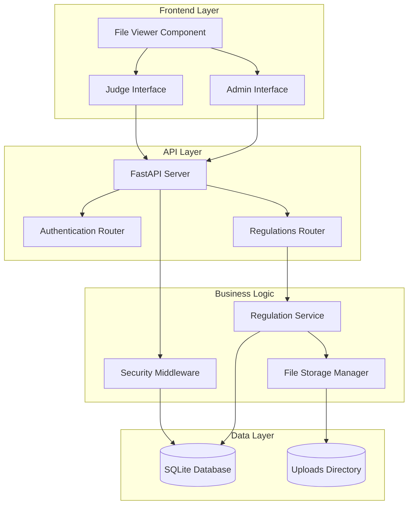

**Diagram sources**
- [main.py:26-48](file://main.py#L26-L48)
- [routes/regulations.py:15](file://routes/regulations.py#L15)
- [utils/dependencies.py:32-47](file://utils/dependencies.py#L32-L47)

## Regulation Management Core Components

### Backend API Implementation

The backend provides a RESTful API for regulation management with comprehensive CRUD operations and file handling capabilities.

```mermaid
classDiagram
class RegulationRouter {
+POST /api/regulations
+GET /api/regulations
+DELETE /api/regulations/{id}
-validateFileType(file)
-generateUniqueFilename(filename)
-saveFileToDisk(file, filename)
}
class RegulationService {
+createRegulation(titulo, modalidad, file)
+listRegulations(modalidad)
+deleteRegulation(id)
+getFileMetadata(id)
}
class Regulation {
+id : int
+titulo : string
+modalidad : string
+archivo_url : string
+created_at : datetime
}
class RegulationResponse {
+id : int
+titulo : string
+modalidad : string
+archivo_url : string
}
RegulationRouter --> RegulationService : uses
RegulationService --> Regulation : manages
RegulationService --> RegulationResponse : returns
```

**Diagram sources**
- [routes/regulations.py:20-110](file://routes/regulations.py#L20-L110)
- [models.py:104-111](file://models.py#L104-L111)
- [schemas.py:156-162](file://schemas.py#L156-L162)

### Frontend Application Architecture

The frontend consists of two distinct interfaces designed for different user roles with shared components for file viewing and API communication.

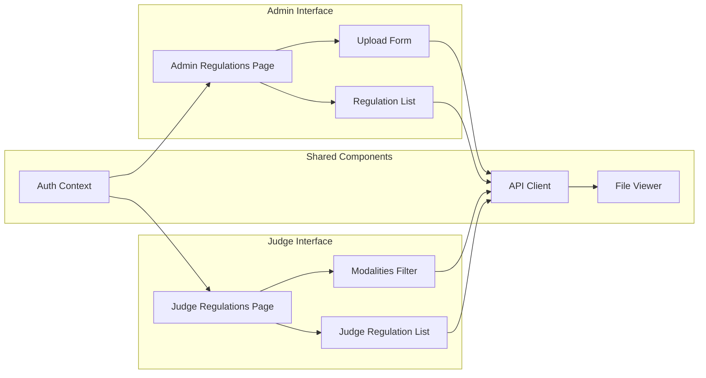

**Diagram sources**
- [frontend/src/pages/admin/Reglamentos.tsx:22-302](file://frontend/src/pages/admin/Reglamentos.tsx#L22-L302)
- [frontend/src/pages/juez/Reglamentos.tsx:15-171](file://frontend/src/pages/juez/Reglamentos.tsx#L15-L171)
- [frontend/src/components/FileViewer.tsx:17-157](file://frontend/src/components/FileViewer.tsx#L17-L157)

**Section sources**
- [routes/regulations.py:15-110](file://routes/regulations.py#L15-L110)
- [frontend/src/pages/admin/Reglamentos.tsx:22-302](file://frontend/src/pages/admin/Reglamentos.tsx#L22-L302)
- [frontend/src/pages/juez/Reglamentos.tsx:15-171](file://frontend/src/pages/juez/Reglamentos.tsx#L15-L171)

## Data Model

The system uses a relational database design with SQLAlchemy ORM for data persistence and management.

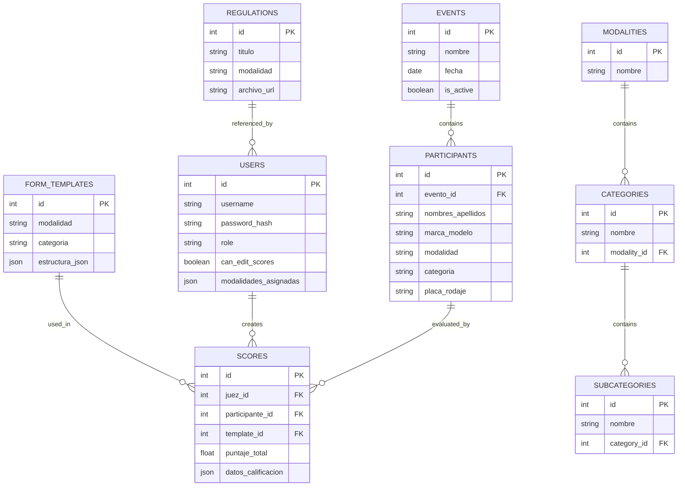

**Diagram sources**
- [models.py:104-153](file://models.py#L104-L153)

**Section sources**
- [models.py:104-153](file://models.py#L104-L153)

## API Endpoints

The system provides three primary endpoints for regulation management operations:

### Create Regulation Endpoint

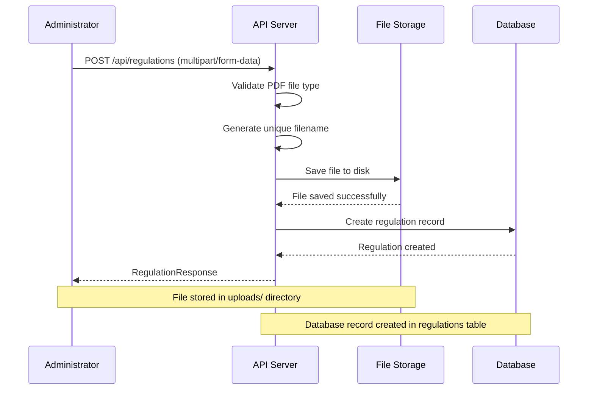

**Diagram sources**
- [routes/regulations.py:20-64](file://routes/regulations.py#L20-L64)

### List Regulations Endpoint

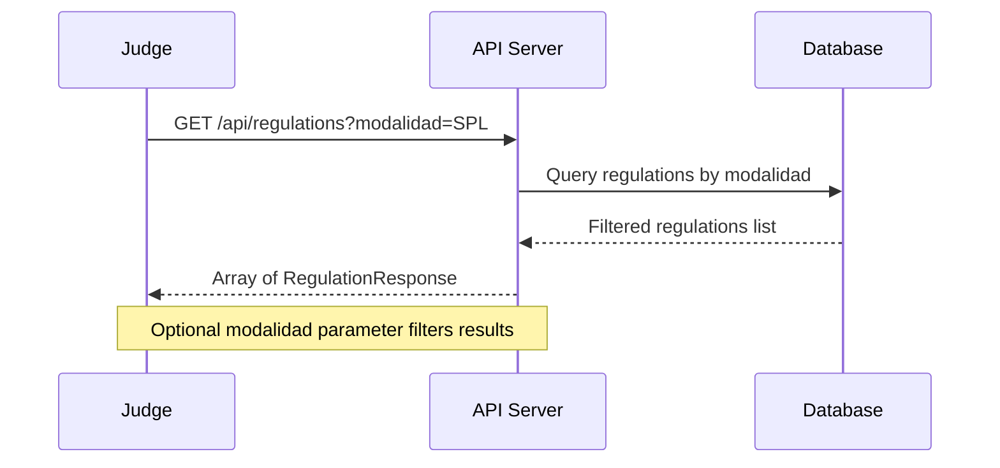

**Diagram sources**
- [routes/regulations.py:67-79](file://routes/regulations.py#L67-L79)

### Delete Regulation Endpoint

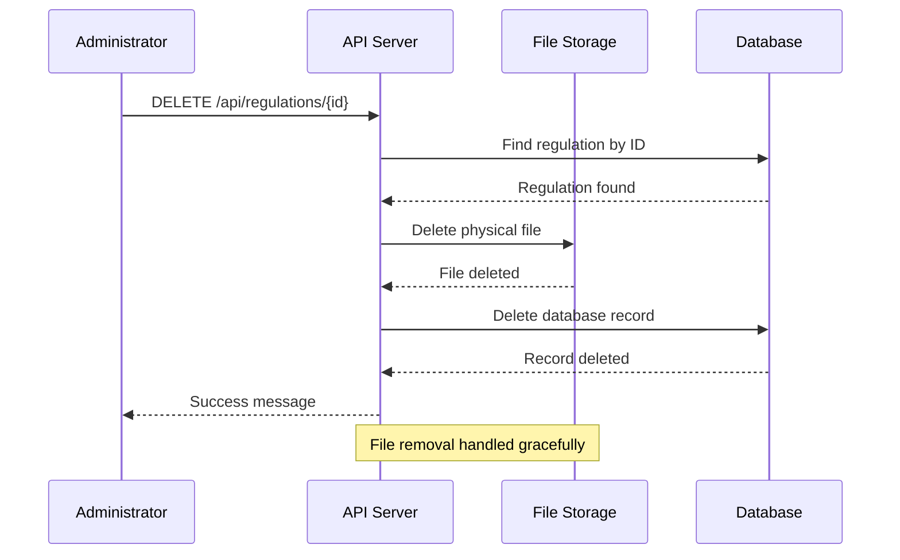

**Diagram sources**
- [routes/regulations.py:82-110](file://routes/regulations.py#L82-L110)

**Section sources**
- [routes/regulations.py:20-110](file://routes/regulations.py#L20-L110)

## Frontend Implementation

### Admin Interface

The administrator interface provides comprehensive tools for uploading, managing, and organizing regulations.

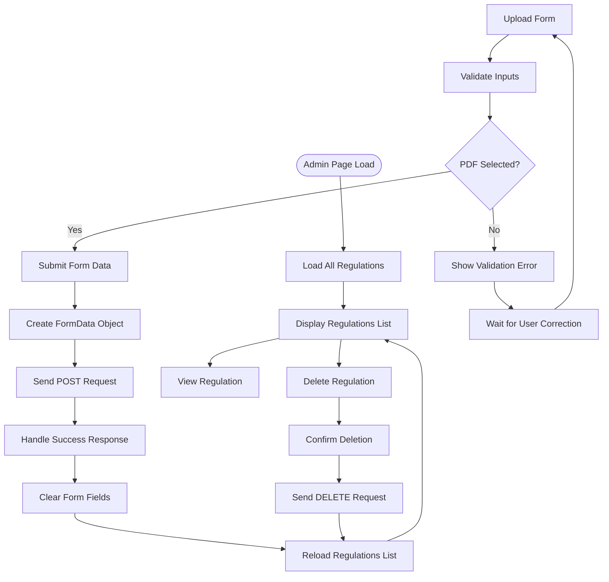

**Diagram sources**
- [frontend/src/pages/admin/Reglamentos.tsx:44-125](file://frontend/src/pages/admin/Reglamentos.tsx#L44-L125)

### Judge Interface

The judge interface focuses on efficient access to relevant regulations based on assigned modalities.

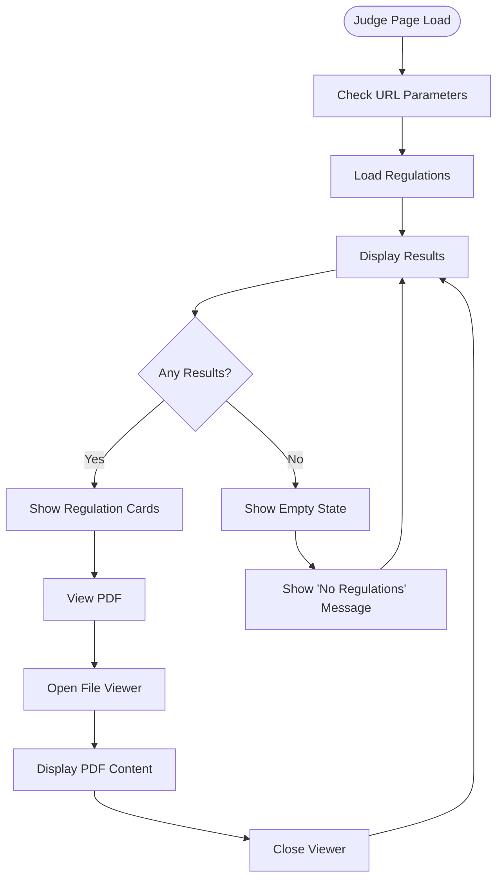

**Diagram sources**
- [frontend/src/pages/juez/Reglamentos.tsx:26-52](file://frontend/src/pages/juez/Reglamentos.tsx#L26-L52)

**Section sources**
- [frontend/src/pages/admin/Reglamentos.tsx:22-302](file://frontend/src/pages/admin/Reglamentos.tsx#L22-L302)
- [frontend/src/pages/juez/Reglamentos.tsx:15-171](file://frontend/src/pages/juez/Reglamentos.tsx#L15-L171)

## Security and Access Control

The system implements role-based access control to ensure appropriate permissions for different user types.

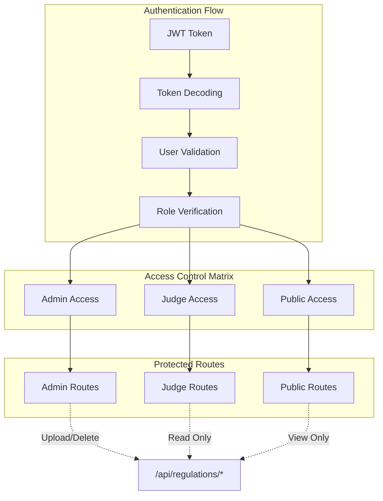

**Diagram sources**
- [utils/dependencies.py:32-47](file://utils/dependencies.py#L32-L47)
- [routes/regulations.py:25](file://routes/regulations.py#L25)

The system uses JWT tokens for authentication and implements middleware to verify user roles before granting access to protected endpoints. Administrators have full CRUD permissions while judges have read-only access to regulations.

**Section sources**
- [utils/dependencies.py:16-71](file://utils/dependencies.py#L16-L71)
- [routes/regulations.py:25-38](file://routes/regulations.py#L25-L38)

## File Management

The system handles PDF file uploads with comprehensive validation and storage management.

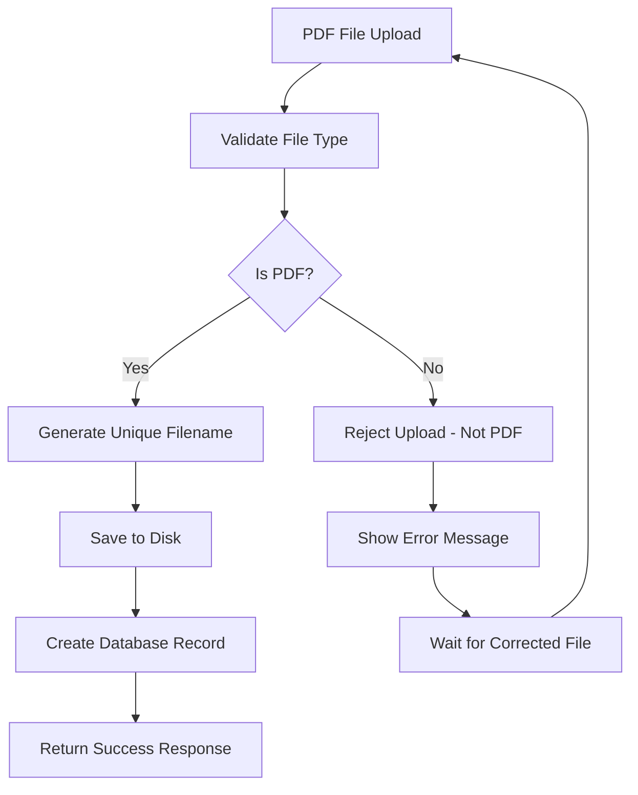

**Diagram sources**
- [routes/regulations.py:29-64](file://routes/regulations.py#L29-L64)

### File Storage Architecture

The system implements a structured file storage approach with automatic cleanup and error handling.

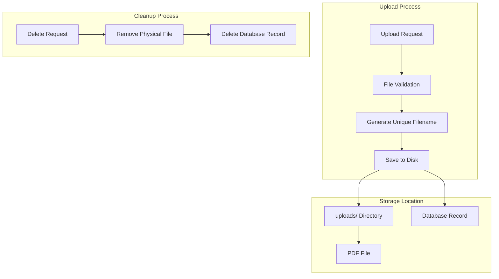

**Diagram sources**
- [routes/regulations.py:42-107](file://routes/regulations.py#L42-L107)
- [main.py:20-47](file://main.py#L20-L47)

**Section sources**
- [routes/regulations.py:17-110](file://routes/regulations.py#L17-L110)
- [main.py:20-47](file://main.py#L20-L47)

## User Interface Components

### File Viewer Component

The File Viewer component provides a unified interface for displaying various file types with responsive design and error handling.

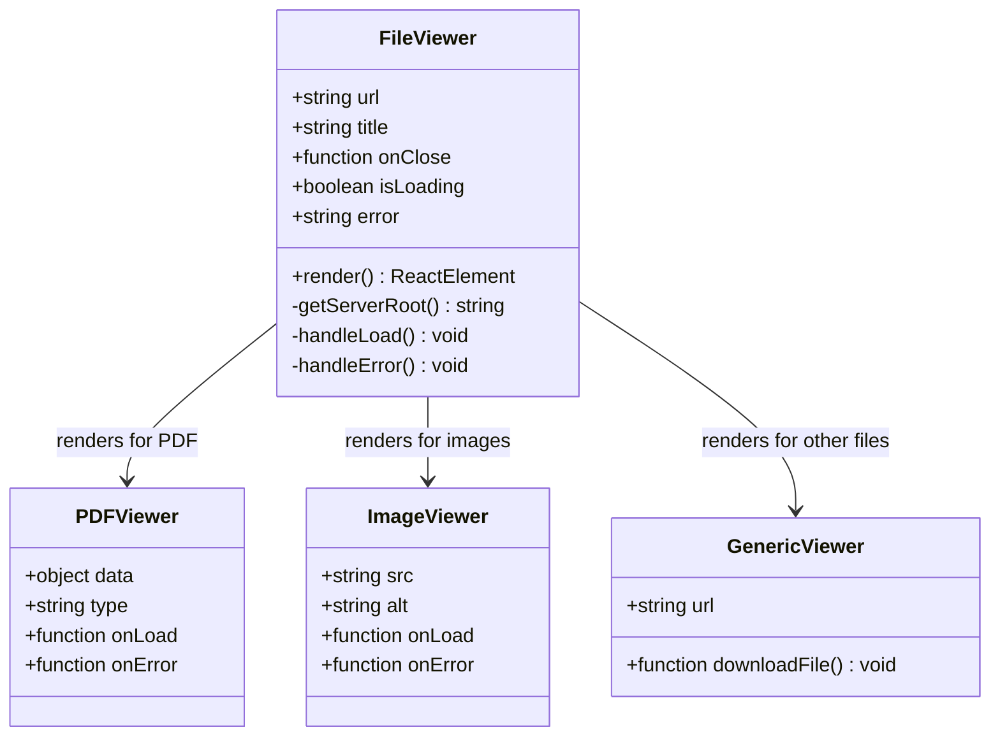

**Diagram sources**
- [frontend/src/components/FileViewer.tsx:17-157](file://frontend/src/components/FileViewer.tsx#L17-L157)

### API Communication Layer

The system uses a centralized API client with error handling and authentication support.

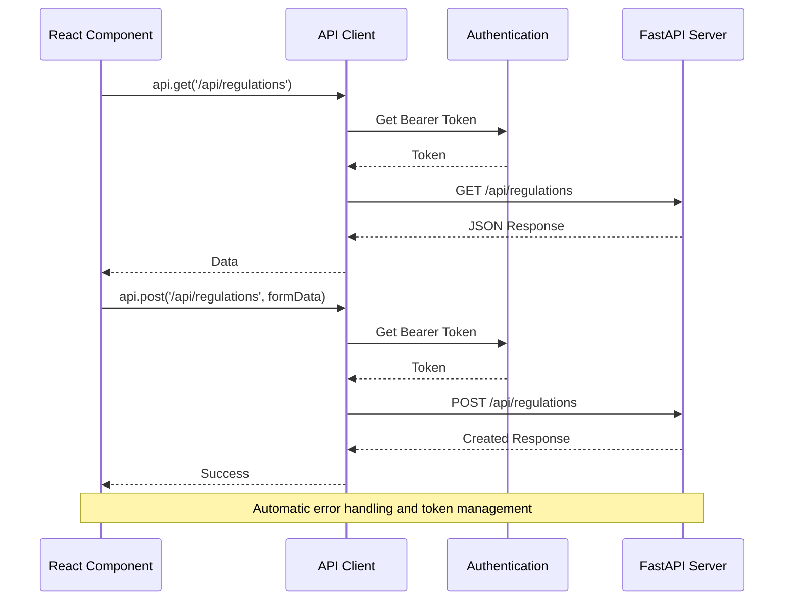

**Diagram sources**
- [frontend/src/lib/api.ts:11-41](file://frontend/src/lib/api.ts#L11-L41)

**Section sources**
- [frontend/src/components/FileViewer.tsx:17-157](file://frontend/src/components/FileViewer.tsx#L17-L157)
- [frontend/src/lib/api.ts:11-41](file://frontend/src/lib/api.ts#L11-L41)

## Integration Patterns

### CORS Configuration

The system implements comprehensive CORS policies to support development and production environments.

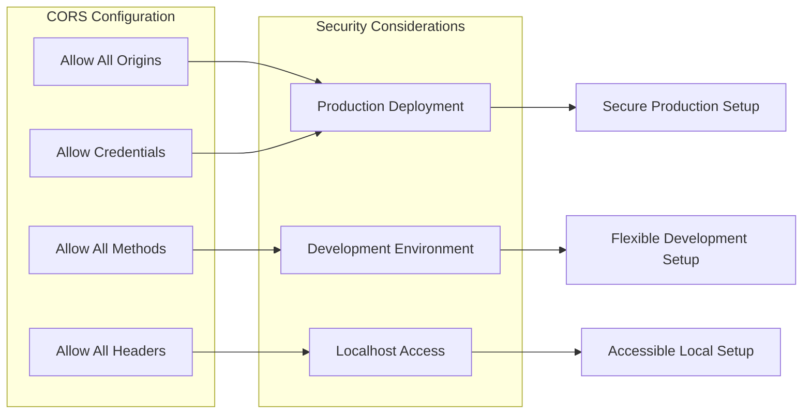

**Diagram sources**
- [main.py:28-34](file://main.py#L28-L34)

### Static File Serving

The system serves uploaded files through FastAPI's static file mounting capability.

```mermaid
graph TB
subgraph "Static File Configuration"
MountPoint[/uploads]
Directory[uploads/]
StaticFiles[StaticFiles]
end
subgraph "File Access"
Browser[Browser Request]
Server[FastAPI Server]
FileSystem[File System]
end
Browser --> Server
Server --> StaticFiles
StaticFiles --> Directory
Directory --> FileSystem
FileSystem --> PDFContent[PDF Content]
PDFContent --> Browser
```

**Diagram sources**
- [main.py:46-47](file://main.py#L46-L47)

**Section sources**
- [main.py:28-47](file://main.py#L28-L47)

## Performance Considerations

### Database Optimization

The system implements several optimization strategies for efficient data retrieval and storage:

- **Indexing**: Strategic indexing on frequently queried fields like `modalidad` and `titulo`
- **Query Optimization**: Efficient filtering and ordering mechanisms
- **Connection Pooling**: Proper session management for concurrent requests
- **Memory Management**: Optimized file handling to prevent memory leaks

### Frontend Performance

The React-based frontend implements performance best practices:

- **Component Memoization**: Efficient rendering of regulation lists
- **Lazy Loading**: Conditional loading of file viewer components
- **State Management**: Optimized state updates and re-renders
- **Error Boundaries**: Graceful error handling without full page reloads

### File Handling Performance

- **Asynchronous Operations**: Non-blocking file upload and download operations
- **Stream Processing**: Efficient file streaming for large PDFs
- **Caching Strategies**: Appropriate caching for static assets
- **Resource Cleanup**: Automatic cleanup of temporary resources

## Troubleshooting Guide

### Common Issues and Solutions

#### File Upload Failures

**Problem**: PDF files fail to upload with validation errors
**Solution**: 
- Verify file is a valid PDF format
- Check file size limitations
- Ensure proper MIME type detection
- Verify write permissions for uploads directory

#### Access Control Issues

**Problem**: Users receive 403 Forbidden errors
**Solution**:
- Verify user role in database
- Check JWT token validity
- Ensure proper authentication headers
- Validate user permissions for requested actions

#### File Viewing Problems

**Problem**: PDF files don't display properly in viewer
**Solution**:
- Check browser PDF support
- Verify file integrity and accessibility
- Ensure proper MIME type configuration
- Test with different browsers and devices

#### Database Connection Issues

**Problem**: Application fails to connect to database
**Solution**:
- Verify SQLite database file exists
- Check file permissions for database and uploads
- Ensure proper database initialization
- Validate connection string format

**Section sources**
- [routes/regulations.py:29-49](file://routes/regulations.py#L29-L49)
- [utils/dependencies.py:32-69](file://utils/dependencies.py#L32-L69)
- [frontend/src/lib/api.ts:24-40](file://frontend/src/lib/api.ts#L24-L40)

## Conclusion

The Regulation Management system provides a robust, scalable solution for managing competition regulations within the car audio and tuning industry. The system successfully balances functionality, security, and user experience through its comprehensive architecture.

Key strengths of the system include:

- **Role-Based Access Control**: Clear separation between administrator and judge functionalities
- **Efficient File Management**: Secure PDF handling with proper validation and storage
- **Responsive User Interfaces**: Intuitive designs optimized for different user roles
- **Scalable Architecture**: Modular design supporting future enhancements
- **Comprehensive Error Handling**: Robust error management across all system components

The system's implementation demonstrates best practices in modern web development, combining Python's FastAPI for backend services with React for frontend interfaces, while maintaining security, performance, and maintainability standards.

Future enhancements could include advanced search capabilities, regulation versioning, collaborative editing features, and integration with external document management systems. The current architecture provides a solid foundation for such extensions while maintaining backward compatibility and system stability.