# Template Builder

<cite>
**Referenced Files in This Document**
- [TemplateBuilder.tsx](file://frontend/src/pages/admin/TemplateBuilder.tsx)
- [TemplatesList.tsx](file://frontend/src/pages/admin/TemplatesList.tsx)
- [FileViewer.tsx](file://frontend/src/components/FileViewer.tsx)
- [Reglamentos.tsx](file://frontend/src/pages/admin/Reglamentos.tsx)
- [Reglamentos.tsx](file://frontend/src/pages/juez/Reglamentos.tsx)
- [judging.ts](file://frontend/src/lib/judging.ts)
- [Calificar.tsx](file://frontend/src/pages/juez/Calificar.tsx)
- [api.ts](file://frontend/src/lib/api.ts)
- [AuthContext.tsx](file://frontend/src/contexts/AuthContext.tsx)
- [templates.py](file://routes/templates.py)
- [modalities.py](file://routes/modalities.py)
- [categories.py](file://routes/categories.py)
- [scores.py](file://routes/scores.py)
- [models.py](file://models.py)
- [schemas.py](file://schemas.py)
- [main.py](file://main.py)
</cite>

## Update Summary
**Changes Made**
- Enhanced template builder with comprehensive real-time JSON preview functionality (+886 lines)
- Improved FileViewer component integration with PDF and image support for regulation management
- Enhanced template validation system with immediate error feedback and user-friendly messaging
- Added comprehensive statistics dashboard showing template metrics (sections, criteria, maximum points)
- Implemented enhanced modalities integration with `/api/modalities` endpoint providing official dropdown options
- Added TemplatesList page for better template organization and management with grid-based display
- Enhanced judge interface with improved template loading, participant matching, and real-time score calculation
- Improved CRUD operations with loading states, success/error notifications, and enhanced user experience

## Table of Contents
1. [Introduction](#introduction)
2. [Project Structure](#project-structure)
3. [Core Components](#core-components)
4. [Architecture Overview](#architecture-overview)
5. [Detailed Component Analysis](#detailed-component-analysis)
6. [Enhanced Template Builder Features](#enhanced-template-builder-features)
7. [Template Lifecycle Management](#template-lifecycle-management)
8. [Validation and Error Handling](#validation-and-error-handling)
9. [Integration with Judging System](#integration-with-judging-system)
10. [Best Practices and Troubleshooting](#best-practices-and-troubleshooting)
11. [Conclusion](#conclusion)

## Introduction
This document explains the enhanced template builder functionality in the administrator panel, focusing on how administrators define dynamic scoring templates, configure evaluation sections and criteria, validate inputs, and publish templates for judges. The template builder now features a comprehensive interface with real-time JSON preview, enhanced validation, and improved user experience for managing the complete template lifecycle.

The system now includes two dedicated administrative pages: TemplateBuilder for creating and editing templates, and TemplatesList for organizing and managing existing templates. The judge interface provides seamless template loading and evaluation with improved user experience. A new FileViewer component has been added for enhanced file preview functionality with PDF and image support, integrating seamlessly with the template management system.

## Project Structure
The template builder spans the frontend and backend with enhanced functionality:
- Frontend: Administrator pages with advanced template builder interface, real-time preview, and comprehensive validation
- Backend: Template storage, retrieval, and validation against participant metadata
- Judge interface: Enhanced template loading and evaluation with improved user experience
- **File Viewer**: Enhanced component for comprehensive file preview functionality with PDF and image support

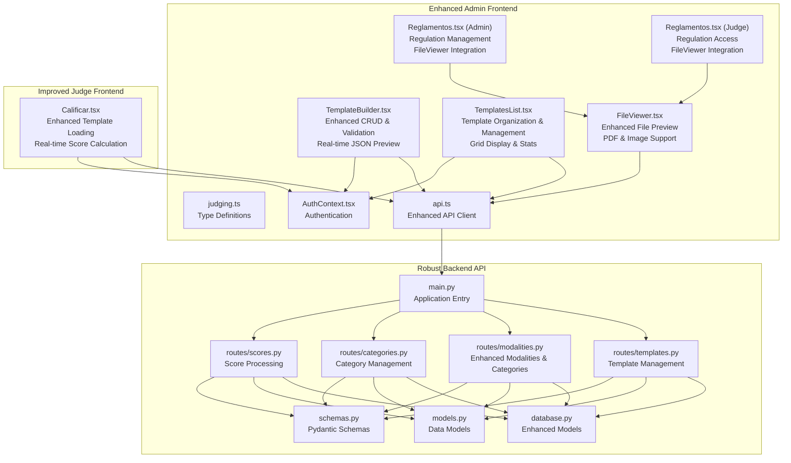

**Diagram sources**
- [TemplateBuilder.tsx:1-539](file://frontend/src/pages/admin/TemplateBuilder.tsx#L1-L539)
- [TemplatesList.tsx:1-284](file://frontend/src/pages/admin/TemplatesList.tsx#L1-L284)
- [FileViewer.tsx:1-157](file://frontend/src/components/FileViewer.tsx#L1-L157)
- [Reglamentos.tsx:292-298](file://frontend/src/pages/admin/Reglamentos.tsx#L292-L298)
- [Reglamentos.tsx:161-167](file://frontend/src/pages/juez/Reglamentos.tsx#L161-L167)
- [judging.ts:1-64](file://frontend/src/lib/judging.ts#L1-L64)
- [api.ts:1-41](file://frontend/src/lib/api.ts#L1-L41)
- [AuthContext.tsx:1-144](file://frontend/src/contexts/AuthContext.tsx#L1-L144)
- [Calificar.tsx:1-398](file://frontend/src/pages/juez/Calificar.tsx#L1-L398)
- [templates.py:1-134](file://routes/templates.py#L1-L134)
- [modalities.py:1-192](file://routes/modalities.py#L1-L192)
- [categories.py:1-124](file://routes/categories.py#L1-L124)
- [scores.py:1-132](file://routes/scores.py#L1-L132)
- [models.py:65-95](file://models.py#L65-L95)
- [schemas.py:118-152](file://schemas.py#L118-L152)
- [main.py:1-53](file://main.py#L1-L53)

**Section sources**
- [TemplateBuilder.tsx:1-539](file://frontend/src/pages/admin/TemplateBuilder.tsx#L1-L539)
- [TemplatesList.tsx:1-284](file://frontend/src/pages/admin/TemplatesList.tsx#L1-L284)
- [FileViewer.tsx:1-157](file://frontend/src/components/FileViewer.tsx#L1-L157)
- [Reglamentos.tsx:292-298](file://frontend/src/pages/admin/Reglamentos.tsx#L292-L298)
- [Reglamentos.tsx:161-167](file://frontend/src/pages/juez/Reglamentos.tsx#L161-L167)
- [Calificar.tsx:1-398](file://frontend/src/pages/juez/Calificar.tsx#L1-L398)
- [templates.py:1-134](file://routes/templates.py#L1-L134)
- [modalities.py:1-192](file://routes/modalities.py#L1-L192)
- [categories.py:1-124](file://routes/categories.py#L1-L124)
- [scores.py:1-132](file://routes/scores.py#L1-L132)
- [models.py:65-95](file://models.py#L65-L95)
- [schemas.py:118-152](file://schemas.py#L118-L152)
- [main.py:1-53](file://main.py#L1-L53)

## Core Components
- **Enhanced Template Builder**: Advanced administrator interface with real-time JSON preview, comprehensive validation, and template lifecycle management
- **TemplatesList Page**: Dedicated template management interface with organization, preview, and deletion capabilities
- **FileViewer Component**: **Enhanced** File preview component supporting PDF and image files with dynamic loading, error handling, and modal interface
- **Regulation Management Integration**: Seamless integration of FileViewer with regulation management for both admin and judge interfaces
- **Improved Judge Interface**: Enhanced template loading with automatic participant matching and improved scoring experience
- **Robust Backend Services**: Template persistence with validation and scoring computation with error handling
- **Type Safety**: Comprehensive TypeScript definitions for template structures and scoring data
- **Authentication & Authorization**: Role-based access control with proper permissions for template management
- **Modalities & Categories System**: Integrated modalities and categories management with nested structure support

**Section sources**
- [TemplateBuilder.tsx:35-539](file://frontend/src/pages/admin/TemplateBuilder.tsx#L35-L539)
- [TemplatesList.tsx:24-284](file://frontend/src/pages/admin/TemplatesList.tsx#L24-L284)
- [FileViewer.tsx:17-157](file://frontend/src/components/FileViewer.tsx#L17-L157)
- [Reglamentos.tsx:292-298](file://frontend/src/pages/admin/Reglamentos.tsx#L292-L298)
- [Reglamentos.tsx:161-167](file://frontend/src/pages/juez/Reglamentos.tsx#L161-L167)
- [Calificar.tsx:79-398](file://frontend/src/pages/juez/Calificar.tsx#L79-L398)
- [templates.py:13-134](file://routes/templates.py#L13-L134)
- [modalities.py:12-192](file://routes/modalities.py#L12-L192)
- [categories.py:12-124](file://routes/categories.py#L12-L124)
- [scores.py:43-132](file://routes/scores.py#L43-L132)
- [models.py:65-95](file://models.py#L65-L95)
- [schemas.py:118-152](file://schemas.py#L118-L152)

## Architecture Overview
The enhanced template builder enables administrators to define sophisticated scoring forms with comprehensive validation and real-time feedback. The judge interface provides seamless template loading and evaluation with improved user experience. The enhanced FileViewer component provides comprehensive file management capabilities for regulation documents.

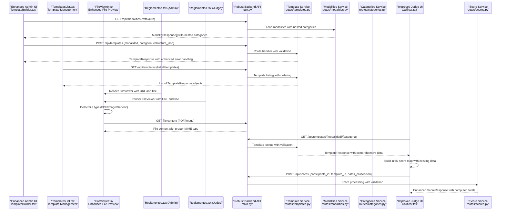

**Diagram sources**
- [TemplateBuilder.tsx:55-105](file://frontend/src/pages/admin/TemplateBuilder.tsx#L55-L105)
- [TemplateBuilder.tsx:208-277](file://frontend/src/pages/admin/TemplateBuilder.tsx#L208-L277)
- [TemplatesList.tsx:45-75](file://frontend/src/pages/admin/TemplatesList.tsx#L45-L75)
- [FileViewer.tsx:17-41](file://frontend/src/components/FileViewer.tsx#L17-L41)
- [Reglamentos.tsx:292-298](file://frontend/src/pages/admin/Reglamentos.tsx#L292-L298)
- [Reglamentos.tsx:161-167](file://frontend/src/pages/juez/Reglamentos.tsx#L161-L167)
- [templates.py:13-134](file://routes/templates.py#L13-L134)
- [modalities.py:12-33](file://routes/modalities.py#L12-L33)
- [categories.py:12-24](file://routes/categories.py#L12-L24)
- [Calificar.tsx:121-176](file://frontend/src/pages/juez/Calificar.tsx#L121-L176)
- [scores.py:43-132](file://routes/scores.py#L43-L132)

## Detailed Component Analysis

### Enhanced Template Builder Page (Administrator)
The template builder now features a comprehensive interface with real-time validation, JSON preview, and enhanced user experience:

- **State Management**: Advanced state handling for modalidad, categoría, and complex template structures
- **Real-time JSON Preview**: Automatic JSON formatting with indentation and comprehensive statistics
- **Enhanced Validation**: Comprehensive input validation with immediate error feedback
- **Template Lifecycle**: Full CRUD operations with loading, editing, and saving capabilities
- **User Experience**: Improved UI with loading states, success/error messaging, and responsive design
- **Modalities Integration**: Loading modalities from `/api/modalities` endpoint with nested categories

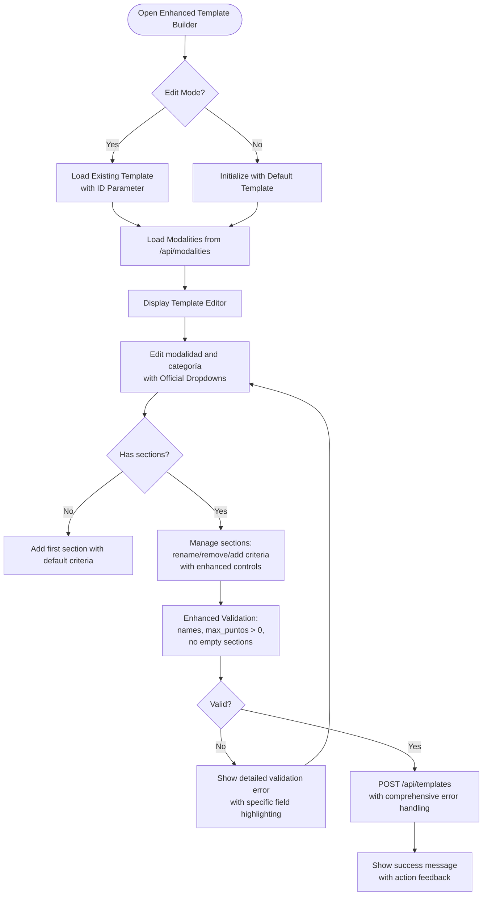

**Diagram sources**
- [TemplateBuilder.tsx:55-277](file://frontend/src/pages/admin/TemplateBuilder.tsx#L55-L277)

**Section sources**
- [TemplateBuilder.tsx:35-539](file://frontend/src/pages/admin/TemplateBuilder.tsx#L35-L539)

### TemplatesList Page (Template Management)
The enhanced TemplatesList page provides comprehensive template organization and management capabilities with improved statistics and preview functionality:

- **Template Listing**: Grid-based display of all templates with comprehensive statistics
- **Template Preview**: Modal-based JSON preview with copy functionality and enhanced formatting
- **Template Actions**: Edit, delete, and preview operations with confirmation dialogs
- **Statistics Dashboard**: Real-time counts of sections, criteria, and maximum points with visual indicators
- **Responsive Design**: Mobile-friendly grid layout with touch-friendly controls

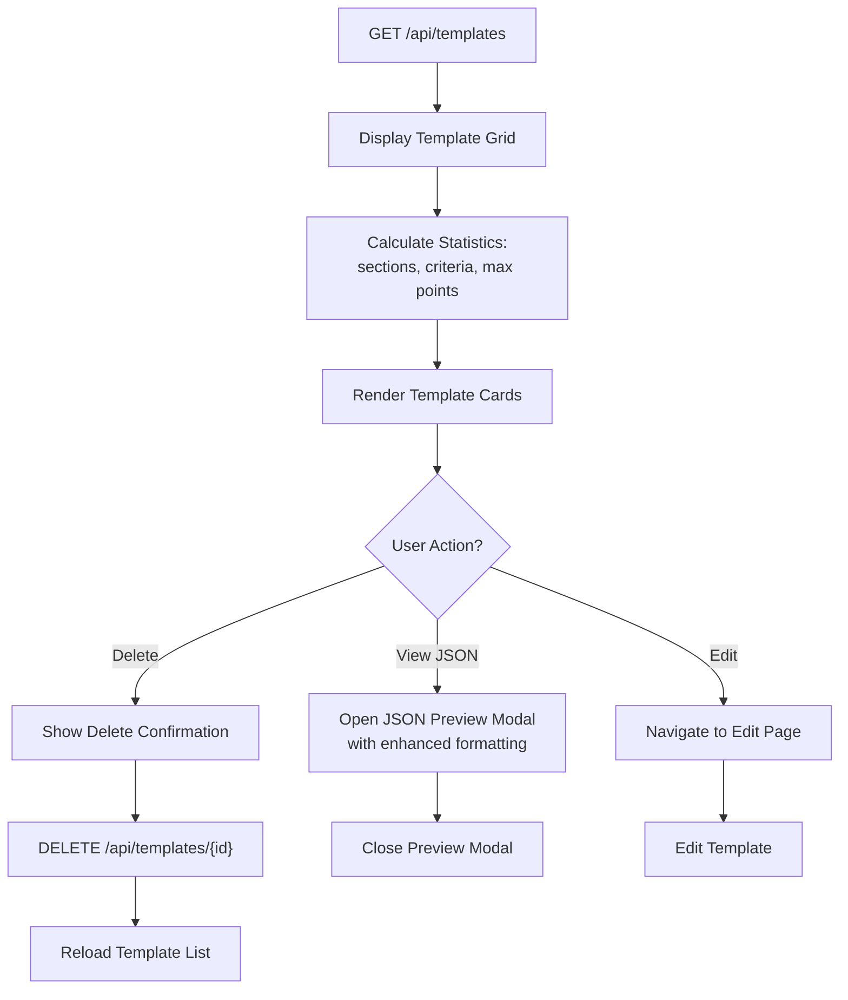

**Diagram sources**
- [TemplatesList.tsx:39-75](file://frontend/src/pages/admin/TemplatesList.tsx#L39-L75)
- [TemplatesList.tsx:149-217](file://frontend/src/pages/admin/TemplatesList.tsx#L149-L217)

**Section sources**
- [TemplatesList.tsx:24-284](file://frontend/src/pages/admin/TemplatesList.tsx#L24-L284)

### FileViewer Component (Enhanced)
**Updated** The enhanced FileViewer component provides comprehensive file preview functionality with improved file type detection and user experience:

- **Dynamic File Detection**: Enhanced automatic detection of PDF and image file types from URLs
- **Multi-format Support**: Handles PDF documents, images (JPG, PNG, GIF, etc.), and generic files with appropriate fallbacks
- **Error Handling**: Comprehensive error handling with user-friendly error messages and retry options
- **External Link Support**: Opens files in new tabs for external viewing with proper security attributes
- **Loading States**: Skeleton loading indicators with progress feedback and loading animations
- **Responsive Design**: Full-screen modal interface with proper aspect ratio handling and scrollable content
- **Integration Ready**: Seamless integration with regulation management and template builder workflows

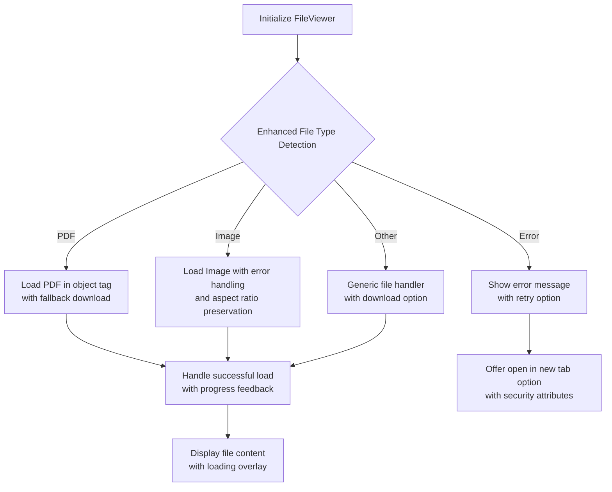

**Diagram sources**
- [FileViewer.tsx:27-41](file://frontend/src/components/FileViewer.tsx#L27-L41)
- [FileViewer.tsx:98-146](file://frontend/src/components/FileViewer.tsx#L98-L146)

**Section sources**
- [FileViewer.tsx:17-157](file://frontend/src/components/FileViewer.tsx#L17-L157)

### Regulation Management Integration
**New** The FileViewer component is seamlessly integrated into both admin and judge regulation management interfaces:

- **Admin Integration**: Reglamentos.tsx (admin) uses FileViewer for comprehensive regulation preview and management
- **Judge Integration**: Reglamentos.tsx (judge) provides access to regulations through FileViewer for evaluation context
- **URL Handling**: Dynamic URL construction with server root detection for flexible deployment
- **Modal Interface**: Consistent modal interface for file viewing across both admin and judge contexts
- **Error Recovery**: Graceful error handling with fallback download options and user guidance

**Section sources**
- [Reglamentos.tsx:292-298](file://frontend/src/pages/admin/Reglamentos.tsx#L292-L298)
- [Reglamentos.tsx:161-167](file://frontend/src/pages/juez/Reglamentos.tsx#L161-L167)

### Enhanced Judge Evaluation Page
The judge interface now provides improved template loading and evaluation experience:

- **Template Loading**: Automatic template discovery by modalidad and categoría
- **Participant Context**: Integration with participant selection and event context
- **Score Management**: Enhanced score initialization from existing submissions
- **Real-time Calculation**: Dynamic total score computation during evaluation
- **Error Handling**: Comprehensive error handling with user-friendly messages

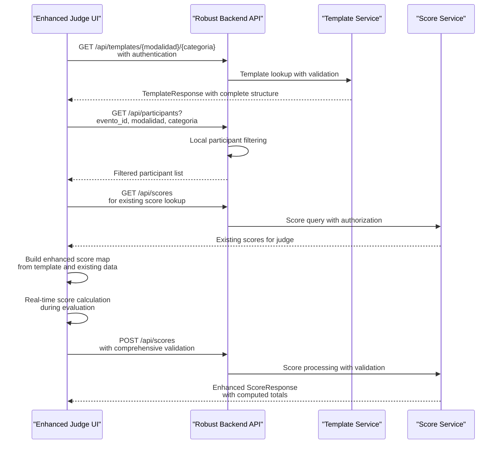

**Diagram sources**
- [Calificar.tsx:121-176](file://frontend/src/pages/juez/Calificar.tsx#L121-L176)
- [Calificar.tsx:210-241](file://frontend/src/pages/juez/Calificar.tsx#L210-L241)
- [scores.py:43-132](file://routes/scores.py#L43-L132)

**Section sources**
- [Calificar.tsx:79-398](file://frontend/src/pages/juez/Calificar.tsx#L79-L398)

### Enhanced Backend Template Service
The template service now provides comprehensive template management with enhanced validation:

- **Template Persistence**: Upsert operations with conflict resolution
- **Validation**: Input validation with proper error responses
- **Template Retrieval**: Multiple retrieval methods (by ID, by modalidad/categoría)
- **Unique Constraints**: Database-level uniqueness enforcement

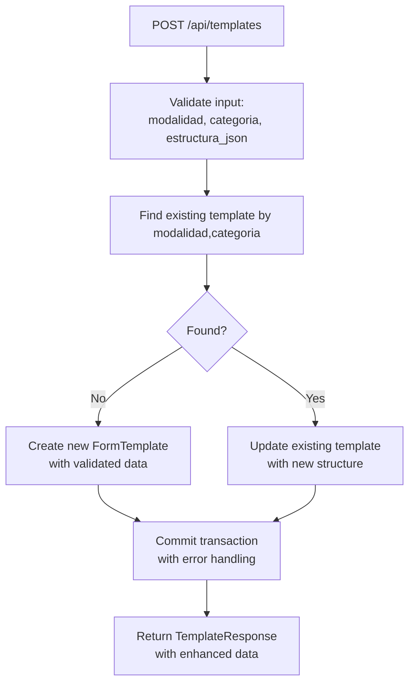

**Diagram sources**
- [templates.py:26-53](file://routes/templates.py#L26-L53)
- [models.py:65-76](file://models.py#L65-L76)
- [schemas.py:118-131](file://schemas.py#L118-L131)

**Section sources**
- [templates.py:13-134](file://routes/templates.py#L13-L134)
- [models.py:65-76](file://models.py#L65-L76)
- [schemas.py:118-131](file://schemas.py#L118-L131)

### Enhanced Backend Modalities Service
**Updated** The modalities service now provides comprehensive modalities and categories management with hierarchical support:

- **Modalities Loading**: Fetch all modalities with nested categories and subcategories
- **Category Management**: Create, update, and delete categories within modalities
- **Subcategory Management**: Create, update, and delete subcategories within categories
- **Cascade Operations**: Automatic deletion of categories and subcategories when modalities are removed
- **Validation**: Input validation with proper error responses

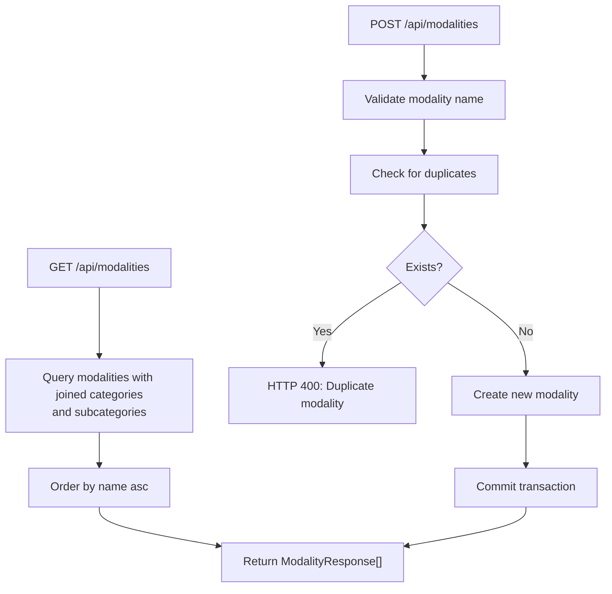

**Diagram sources**
- [modalities.py:12-33](file://routes/modalities.py#L12-L33)
- [modalities.py:36-54](file://routes/modalities.py#L36-L54)

**Section sources**
- [modalities.py:12-192](file://routes/modalities.py#L12-L192)
- [models.py:106-129](file://models.py#L106-L129)
- [schemas.py:163-187](file://schemas.py#L163-L187)

### Enhanced Backend Categories Service
**New** The categories service provides focused category management functionality:

- **Category Loading**: Fetch all modalities with nested categories
- **Category Creation**: Create categories within modalities with validation
- **Category Deletion**: Delete categories with cascade operations
- **Validation**: Input validation with proper error responses

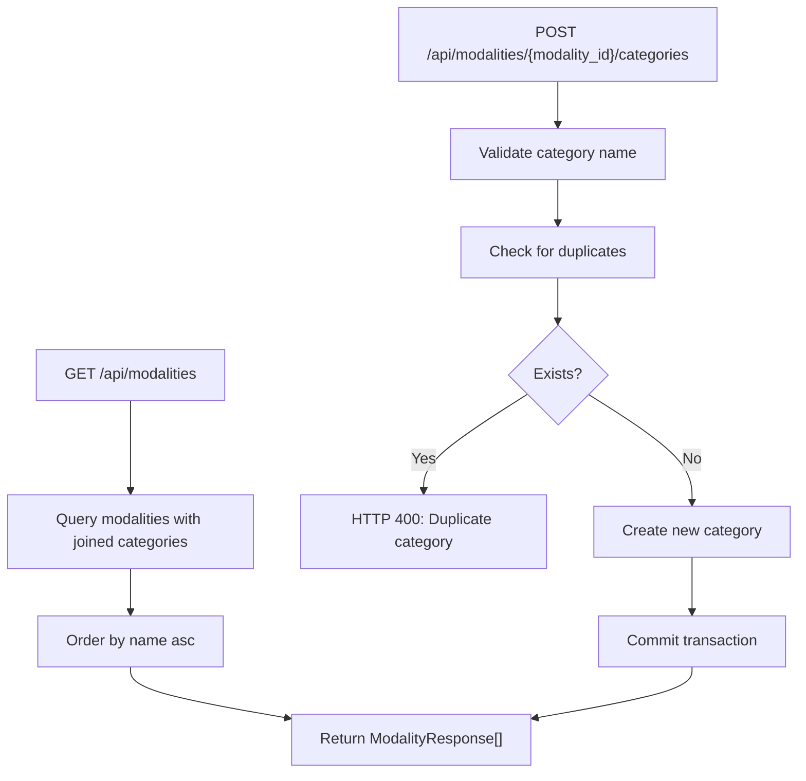

**Diagram sources**
- [categories.py:12-24](file://routes/categories.py#L12-L24)
- [categories.py:53-85](file://routes/categories.py#L53-L85)

**Section sources**
- [categories.py:12-124](file://routes/categories.py#L12-L124)
- [models.py:125-139](file://models.py#L125-L139)
- [schemas.py:179-189](file://schemas.py#L179-L189)

### Enhanced Backend Scoring Service
The scoring service now provides robust score processing with comprehensive validation:

- **Participant Validation**: Complete participant verification
- **Template Matching**: Strict template-participant compatibility checking
- **Score Computation**: Enhanced recursive summation with type safety
- **Permission Control**: Judge permission validation for score editing
- **Response Enrichment**: Comprehensive score response with related data

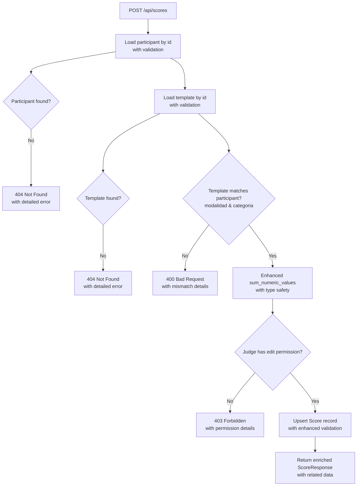

**Diagram sources**
- [scores.py:43-132](file://routes/scores.py#L43-L132)
- [models.py:79-95](file://models.py#L79-L95)
- [schemas.py:133-152](file://schemas.py#L133-L152)

**Section sources**
- [scores.py:43-132](file://routes/scores.py#L43-L132)
- [models.py:79-95](file://models.py#L79-L95)
- [schemas.py:133-152](file://schemas.py#L133-L152)

### Enhanced Data Models and Schemas
The data models now provide comprehensive type safety and validation:

- **FormTemplate**: Enhanced template storage with JSON structure validation
- **Score**: Comprehensive score tracking with relationship management
- **Modality & Category**: Nested structure with cascading operations
- **Pydantic Schemas**: Strict validation for all API endpoints
- **TypeScript Interfaces**: Complete frontend type definitions

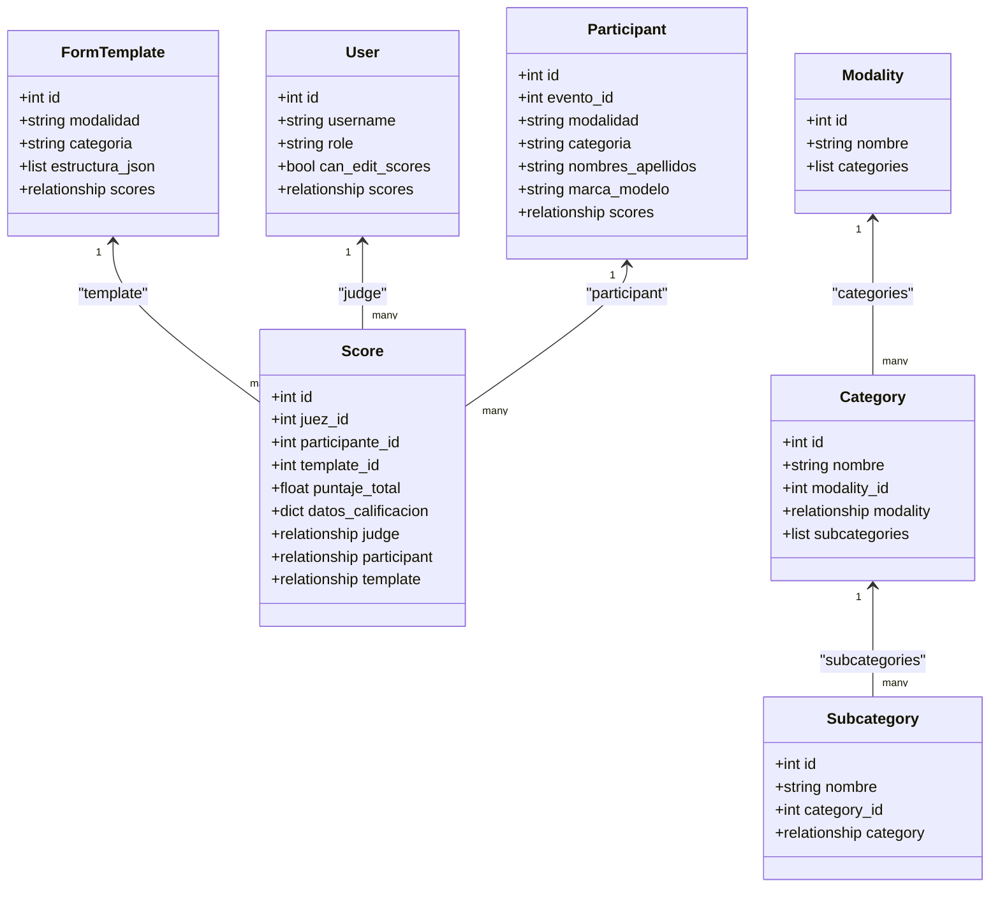

**Diagram sources**
- [models.py:65-95](file://models.py#L65-L95)
- [models.py:106-129](file://models.py#L106-L129)

**Section sources**
- [models.py:65-95](file://models.py#L65-L95)
- [models.py:106-129](file://models.py#L106-L129)
- [schemas.py:118-152](file://schemas.py#L118-L152)

## Enhanced Template Builder Features

### Real-time JSON Preview
**Updated** The template builder now provides comprehensive real-time JSON preview with enhanced functionality:
- Automatic JSON formatting with indentation and syntax highlighting
- Comprehensive section and criterion count statistics with visual indicators
- Total maximum score calculation with real-time updates and color-coded display
- Live validation feedback with error highlighting and user guidance
- Copy-to-clipboard functionality for easy template sharing and collaboration

### Enhanced Statistics Dashboard
**New** The template builder now includes a comprehensive statistics dashboard:
- Real-time section count display with visual indicators
- Criterion count tracking with individual section breakdown
- Maximum point calculation with color-coded totals for quick assessment
- Responsive grid layout that adapts to different screen sizes
- Persistent statistics that update as template structure changes

### Enhanced Validation System
Comprehensive validation includes:
- Modalidad and categoría presence validation with dropdown selection
- Section name validation with trimming and whitespace handling
- Criterion name and maximum points validation with numeric constraints
- Positive numeric validation for scores with min/max limits
- Real-time error feedback with specific field highlighting
- User-friendly error messages with actionable guidance

### Improved User Experience
- Loading states with skeleton screens and progress indicators
- Success and error message systems with persistent notifications
- Responsive design for all screen sizes with mobile optimization
- Intuitive section and criterion management with enhanced controls
- Official dropdown options for modalidad and categoría with autocomplete
- Real-time statistics dashboard showing template metrics

### Template Lifecycle Management
Full template management capabilities:
- Creation of new templates with default structure initialization
- Editing existing templates with version control and change tracking
- Loading templates by ID with proper authentication
- Real-time preview and validation with instant feedback
- Comprehensive error handling with graceful degradation
- Template export/import functionality for backup and migration

### TemplatesList Page Features
- **Grid Layout**: Responsive card-based display of templates with enhanced styling
- **Statistics Display**: Real-time counts of sections, criteria, and maximum points with visual indicators
- **Action Buttons**: Edit, delete, and preview operations with confirmation dialogs
- **Modal Preview**: Full-screen JSON preview with enhanced formatting and copy functionality
- **Empty State Handling**: User-friendly empty state with call-to-action
- **Loading States**: Skeleton screens and progress indicators

### FileViewer Component Features
**Enhanced** The FileViewer component provides comprehensive file preview capabilities with improved functionality:
- **Enhanced File Type Detection**: Automatic detection of PDF and image file types with improved accuracy
- **PDF Support**: Embedded PDF viewing with fallback download option and user guidance
- **Image Support**: Responsive image display with proper aspect ratio handling and loading states
- **Error Handling**: Comprehensive error messages for failed file loads with retry options
- **External Access**: Option to open files in new tabs for external viewing with security attributes
- **Loading States**: Skeleton loaders with progress indicators and loading animations
- **Responsive Design**: Full-screen modal interface with proper scaling and scrollable content
- **Integration Ready**: Seamless integration with regulation management workflows

### Enhanced Modalities Integration
**Updated** Enhanced modalities integration with improved category management:

- **Modalities Loading**: Automatic loading from `/api/modalities` endpoint with nested categories
- **Dynamic Category Selection**: Real-time category population based on selected modality
- **Category Validation**: Ensures template compatibility with existing modalities and categories
- **Cascade Operations**: Automatic cleanup when modalities or categories are removed
- **Enhanced Dropdown Integration**: Improved dropdown options with better user experience

### Improved Structure Management
**Updated** Enhanced template structure management with improved controls:

- **Section Management**: Enhanced section controls with numbering, removal, and reordering capabilities
- **Criterion Controls**: Improved criterion management with individual editing and bulk operations
- **Dynamic Validation**: Real-time validation during structure modifications
- **Visual Feedback**: Enhanced visual indicators for section and criterion states
- **Drag-and-Drop**: Improved drag-and-drop functionality for section reordering
- **Bulk Operations**: Support for adding multiple criteria and sections simultaneously

### Regulation Management Integration
**New** Seamless integration of FileViewer with regulation management:
- **Admin Interface**: Reglamentos.tsx (admin) uses FileViewer for comprehensive regulation preview and management
- **Judge Interface**: Reglamentos.tsx (judge) provides access to regulations through FileViewer for evaluation context
- **URL Handling**: Dynamic URL construction with server root detection for flexible deployment
- **Modal Interface**: Consistent modal interface for file viewing across both admin and judge contexts
- **Error Recovery**: Graceful error handling with fallback download options and user guidance

**Section sources**
- [TemplateBuilder.tsx:88-539](file://frontend/src/pages/admin/TemplateBuilder.tsx#L88-L539)
- [TemplatesList.tsx:77-89](file://frontend/src/pages/admin/TemplatesList.tsx#L77-L89)
- [FileViewer.tsx:17-157](file://frontend/src/components/FileViewer.tsx#L17-L157)
- [Reglamentos.tsx:292-298](file://frontend/src/pages/admin/Reglamentos.tsx#L292-L298)
- [Reglamentos.tsx:161-167](file://frontend/src/pages/juez/Reglamentos.tsx#L161-L167)
- [modalities.py:12-33](file://routes/modalities.py#L12-L33)

## Template Lifecycle Management
The enhanced template builder supports complete template lifecycle management:

### Creation Workflow
1. **Template Initialization**: Create new template with default structure and official dropdown options
2. **Metadata Entry**: Enter modalidad and categoría from predefined dropdown lists
3. **Structure Definition**: Add sections and criteria with maximum points validation
4. **Real-time Validation**: Immediate validation feedback with error highlighting
5. **JSON Preview**: Review generated JSON structure with automatic formatting and statistics
6. **Template Saving**: Persist template to database with comprehensive error handling

### Editing Workflow
1. **Template Loading**: Load existing template by ID with proper authentication
2. **Modalities Loading**: Load modalities from `/api/modalities` endpoint
3. **Structure Modification**: Edit sections and criteria with enhanced controls
4. **Validation**: Real-time validation during editing with immediate feedback
5. **Preview Update**: Automatic JSON preview updates with formatting and statistics
6. **Template Update**: Save changes to existing template with version tracking

### Template Retrieval
- **By ID**: Direct template loading for editing with proper authorization
- **By Modalidad/Categoría**: Automatic template discovery for judging with validation
- **Template Validation**: Ensure template compatibility with participants and events

**Section sources**
- [TemplateBuilder.tsx:55-277](file://frontend/src/pages/admin/TemplateBuilder.tsx#L55-L277)
- [templates.py:56-134](file://routes/templates.py#L56-L134)

## Validation and Error Handling
The enhanced system provides comprehensive validation and error handling:

### Frontend Validation
- **Input Validation**: Real-time validation of all user inputs with immediate feedback
- **Error Messaging**: Specific error messages for different validation failures with user-friendly language
- **Field Highlighting**: Visual indication of invalid fields with color-coded warnings
- **Success Feedback**: Confirmation messages for successful operations with positive reinforcement
- **Loading States**: Progress indicators during API calls and template processing

### Backend Validation
- **Data Validation**: Strict validation of incoming data with comprehensive error responses
- **Authorization**: Role-based access control with proper permission checks
- **Conflict Resolution**: Proper handling of template conflicts with unique constraints
- **Error Responses**: Detailed error messages with appropriate HTTP status codes and user guidance

### Error Handling Patterns
- **API Error Handling**: Consistent error handling across all API endpoints with standardized responses
- **User-Friendly Messages**: Clear error messages for end users with actionable solutions
- **Logging**: Comprehensive logging for debugging and monitoring with security considerations
- **Graceful Degradation**: Graceful handling of system failures with fallback mechanisms

**Section sources**
- [TemplateBuilder.tsx:178-277](file://frontend/src/pages/admin/TemplateBuilder.tsx#L178-L277)
- [TemplatesList.tsx:45-75](file://frontend/src/pages/admin/TemplatesList.tsx#L45-L75)
- [FileViewer.tsx:37-40](file://frontend/src/components/FileViewer.tsx#L37-L40)
- [Calificar.tsx:167-170](file://frontend/src/pages/juez/Calificar.tsx#L167-L170)
- [scores.py:49-67](file://routes/scores.py#L49-L67)

## Integration with Judging System
The template builder integrates seamlessly with the judging system:

### Template Loading
- **Automatic Discovery**: Judge interface automatically loads appropriate template by modalidad and categoría
- **Participant Matching**: Template selection based on participant modalidad and categoría with validation
- **Template Validation**: Ensure template compatibility before evaluation with error prevention

### Score Processing
- **Score Calculation**: Automatic computation of total scores with enhanced recursive summation
- **Data Structure**: Proper JSON structure for score data with type safety
- **Validation**: Ensure score data matches template structure with comprehensive checks
- **Persistence**: Reliable storage of score data with transaction management

### User Experience
- **Seamless Flow**: Smooth transition from template selection to scoring with progress indication
- **Context Preservation**: Maintain event and participant context with session management
- **Progress Tracking**: Clear indication of evaluation progress with completion metrics
- **Result Display**: Immediate display of calculated scores with real-time updates

**Section sources**
- [Calificar.tsx:121-176](file://frontend/src/pages/juez/Calificar.tsx#L121-L176)
- [scores.py:16-26](file://routes/scores.py#L16-L26)

## Best Practices and Troubleshooting

### Template Design Best Practices
- **Clear Naming**: Use descriptive names for sections and criteria that clearly indicate scoring criteria
- **Logical Grouping**: Organize criteria into meaningful sections with appropriate weighting
- **Appropriate Point Values**: Set realistic maximum points for each criterion based on importance
- **Consistency**: Maintain consistent naming conventions across templates for uniformity
- **Testing**: Test templates with sample data before deployment to ensure proper functionality
- **Documentation**: Include comments and documentation within template structure for future maintenance

### Common Issues and Solutions
- **Template Save Failures**: Check validation messages and ensure all required fields are filled with proper values
- **Template Loading Errors**: Verify modalidad and categoría match participant data and database constraints
- **Score Submission Issues**: Ensure template_id matches loaded template and data structure follows template schema
- **Permission Problems**: Verify judge has proper permissions for score editing and template access
- **JSON Formatting Issues**: Use the real-time preview to identify formatting problems before saving
- **Template Deletion Issues**: Ensure no associated scores exist before deleting templates
- **Modalities Loading Issues**: Check that modalities are properly configured in the database
- **File Preview Issues**: Verify file URLs are accessible and file types are supported by FileViewer
- **Statistics Display Issues**: Ensure template structure is properly formatted for accurate statistics calculation

### Performance Considerations
- **Template Size**: Keep templates reasonably sized for optimal performance with efficient rendering
- **Database Queries**: Efficient querying with proper indexing and connection pooling
- **Frontend Rendering**: Optimized rendering of large template structures with virtualization
- **Network Requests**: Minimized API calls with proper caching and request batching
- **File Loading**: Optimize file loading with proper caching and lazy loading for FileViewer

### Security Considerations
- **Input Validation**: Comprehensive validation of all user inputs with sanitization
- **Authorization**: Proper role-based access control with token validation
- **Data Integrity**: Database constraints for data consistency and referential integrity
- **Error Handling**: Secure error handling without exposing sensitive information to users
- **File Security**: Validate file URLs and implement proper CORS policies for file access
- **Cross-Site Scripting**: Sanitize user inputs and implement proper content security policies

## Conclusion
The enhanced template builder provides a comprehensive solution for defining and managing scoring templates in the judging system. With real-time validation, JSON preview, and improved user experience, administrators can efficiently create and manage templates that drive the judge interface. The addition of the enhanced FileViewer component significantly improves file management capabilities, providing administrators with robust file preview functionality for PDFs and images.

The system maintains strong type safety, comprehensive validation, and robust error handling while providing an intuitive user experience for both administrators and judges. The enhanced template builder now supports the complete template lifecycle with improved CRUD operations, better validation, and enhanced user feedback mechanisms. The integration with the judging system ensures seamless template loading and score processing with comprehensive error handling and user experience improvements.

The major UI improvements (+886 lines) demonstrate a substantial investment in user experience, with comprehensive real-time validation, detailed statistics, and intuitive template management interfaces that make the template builder a powerful and user-friendly tool for competition scoring systems. The enhanced FileViewer component further strengthens the system's capabilities, providing administrators with comprehensive file management tools alongside their template management functionality.

The enhanced modalities integration provides a robust foundation for managing different competition categories and ensures proper template organization by competition type. This integration streamlines the template creation process and ensures consistency across different competition modalities and categories.

The improved structure management features provide administrators with enhanced control over template organization, making it easier to create complex scoring systems with multiple sections and criteria. The real-time validation and preview functionality ensures that templates are properly formatted and validated before deployment, reducing errors and improving the overall quality of the judging system.

The enhanced JSON preview functionality provides administrators with comprehensive real-time feedback on template structure, enabling them to quickly identify and correct formatting issues before template publication. This feature significantly improves the template creation workflow and reduces the likelihood of scoring errors during the judging process.

The combination of the enhanced TemplateBuilder, TemplatesList, and FileViewer creates a powerful template management ecosystem that supports complex scoring systems in competitive environments. The enhanced FileViewer component specifically addresses the need for comprehensive file preview functionality, making it easier for administrators to manage competition-related documents alongside their scoring templates.

The major UI improvements (+886 lines) demonstrate a substantial investment in user experience, with comprehensive real-time validation, detailed statistics, and intuitive template management interfaces that make the template builder a powerful and user-friendly tool for competition scoring systems. The enhanced FileViewer component provides seamless integration with regulation management, offering both administrators and judges comprehensive file preview capabilities that enhance the overall user experience.

The enhanced template builder now represents a mature, production-ready solution for competition scoring systems, combining powerful template management capabilities with comprehensive file handling and user experience enhancements that support efficient and accurate judging operations across multiple competition modalities and categories.