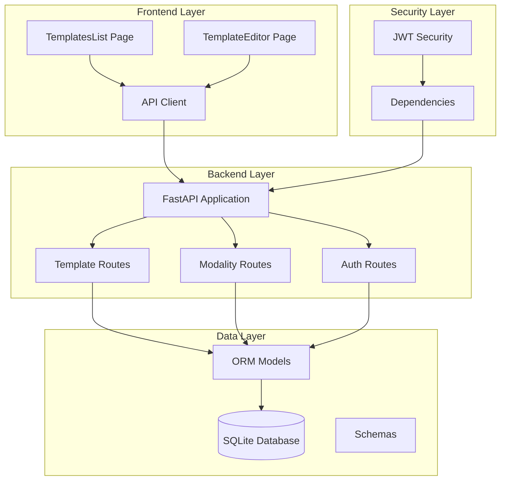
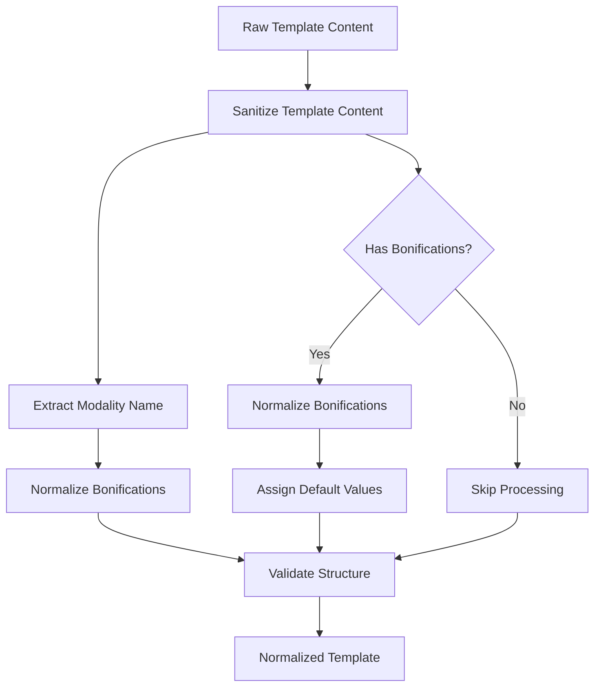
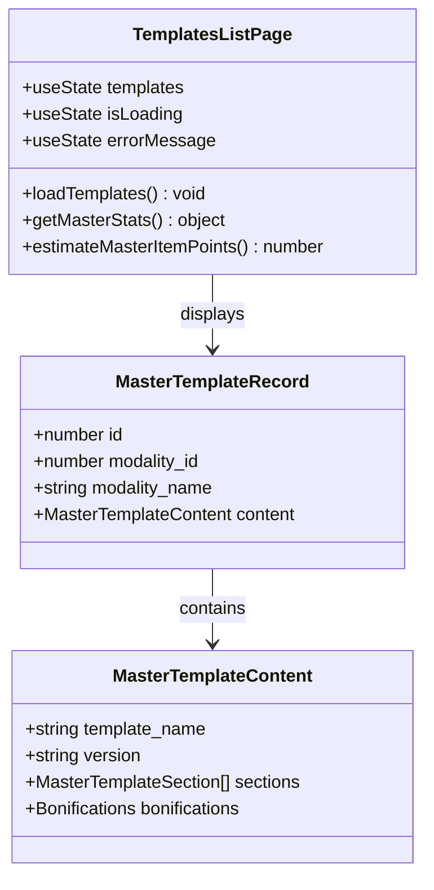
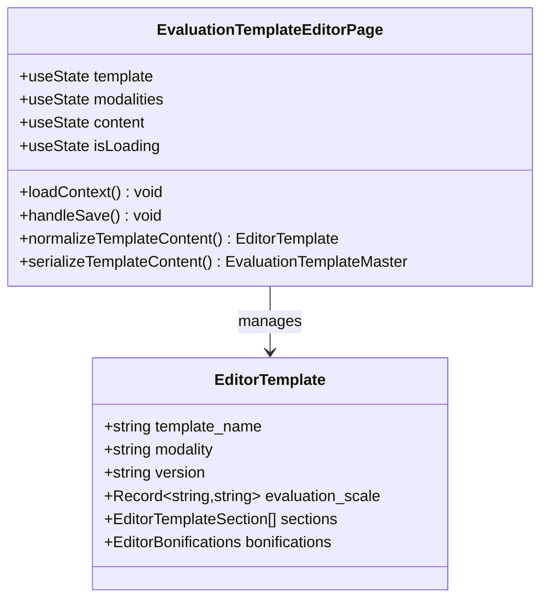
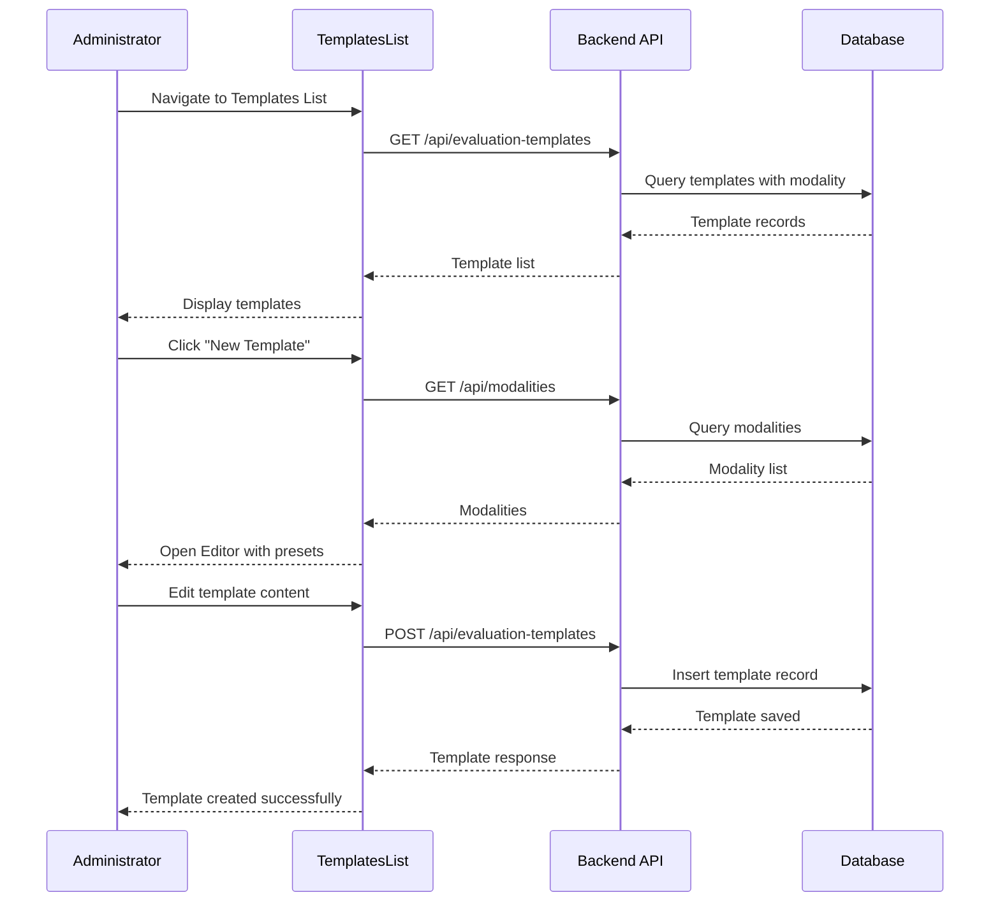
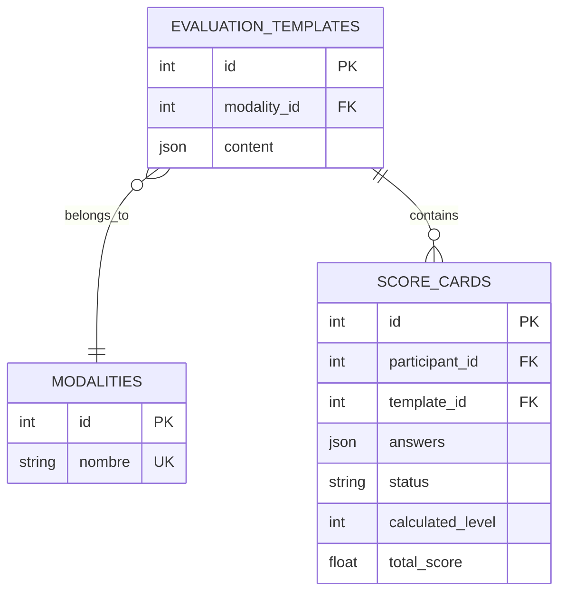
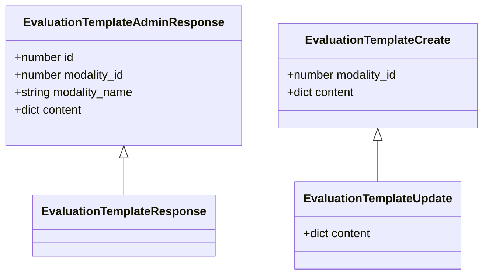
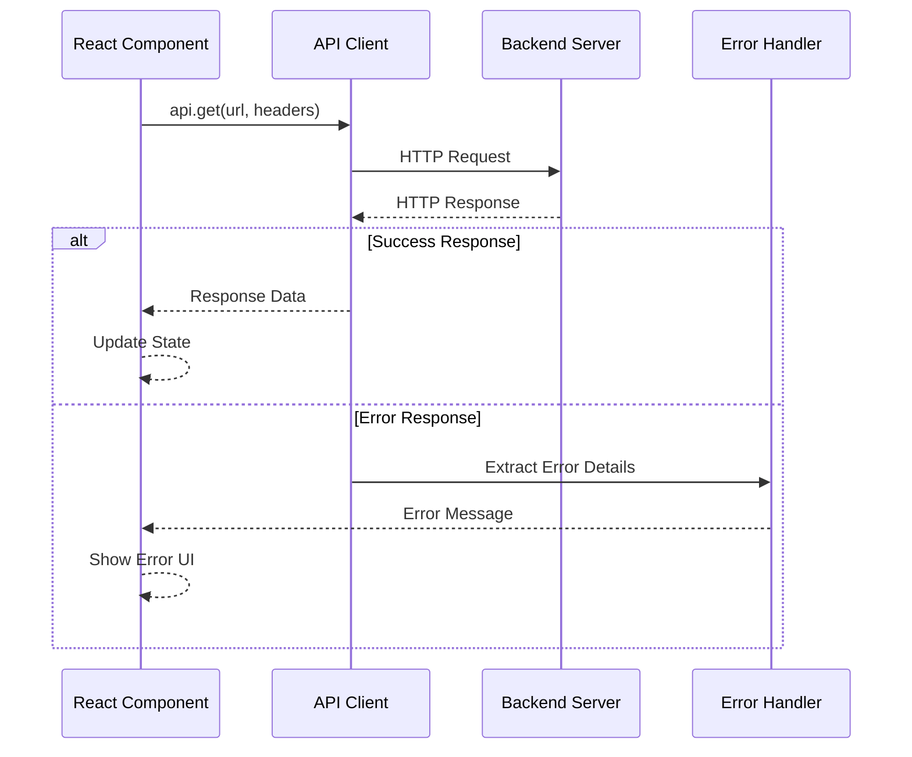
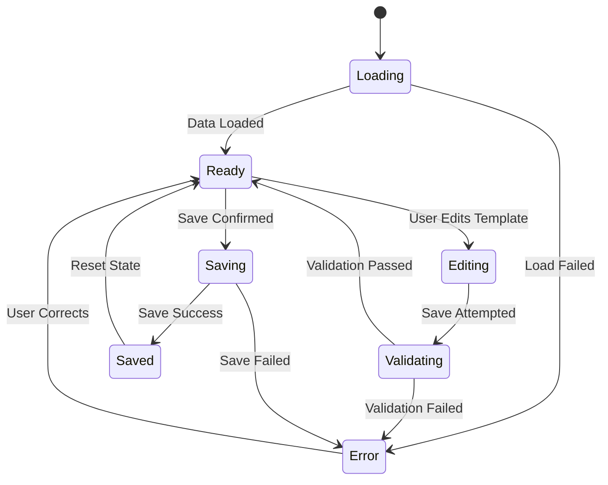
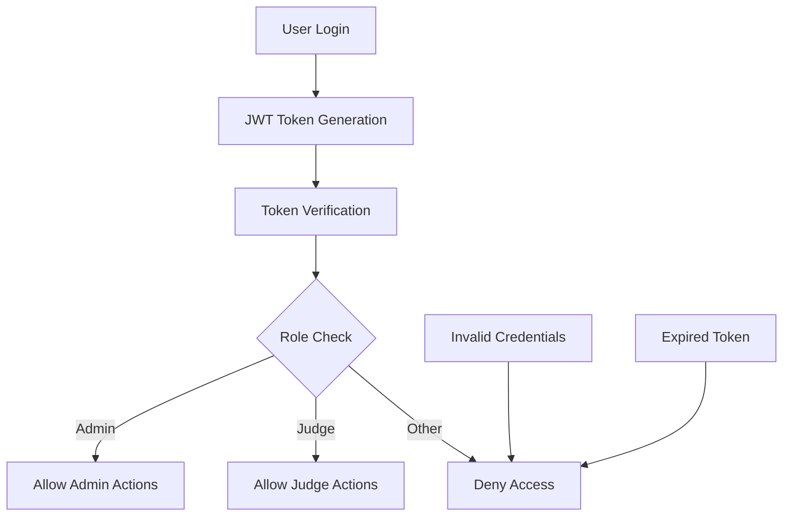

# Templates List Management

<cite>
**Referenced Files in This Document**
- [routes/evaluation_templates.py](file://routes/evaluation_templates.py)
- [frontend/src/pages/admin/TemplatesList.tsx](file://frontend/src/pages/admin/TemplatesList.tsx)
- [frontend/src/pages/admin/EvaluationTemplateEditor.tsx](file://frontend/src/pages/admin/EvaluationTemplateEditor.tsx)
- [models.py](file://models.py)
- [schemas.py](file://schemas.py)
- [frontend/src/lib/api.ts](file://frontend/src/lib/api.ts)
- [frontend/src/lib/judging.ts](file://frontend/src/lib/judging.ts)
- [routes/modalities.py](file://routes/modalities.py)
- [utils/dependencies.py](file://utils/dependencies.py)
- [main.py](file://main.py)
- [database.py](file://database.py)
</cite>

## Table of Contents
1. [Introduction](#introduction)
2. [System Architecture](#system-architecture)
3. [Core Components](#core-components)
4. [Template Management Workflow](#template-management-workflow)
5. [Data Models and Schemas](#data-models-and-schemas)
6. [Frontend Implementation](#frontend-implementation)
7. [API Endpoints](#api-endpoints)
8. [Security and Authentication](#security-and-authentication)
9. [Performance Considerations](#performance-considerations)
10. [Troubleshooting Guide](#troubleshooting-guide)
11. [Conclusion](#conclusion)

## Introduction

The Templates List Management system is a comprehensive solution for managing evaluation templates across different car audio and tuning modalities. This system enables administrators to create, edit, and manage master evaluation templates that serve as standardized scoring frameworks for judges during competitions.

The system consists of two primary components:
- **Backend API**: Built with FastAPI and SQLAlchemy, providing RESTful endpoints for template management
- **Frontend Interface**: React-based administration panel offering visual template editing capabilities

Each competition modality (such as Tuning, SPL, Street Show) maintains a single master template that is shared among all judges, ensuring consistency and fairness in the evaluation process.

## System Architecture

The system follows a client-server architecture with clear separation of concerns:

**Diagram sources**
- [main.py:26-47](file://main.py#L26-L47)
- [routes/evaluation_templates.py:14-172](file://routes/evaluation_templates.py#L14-L172)
- [routes/modalities.py:15-180](file://routes/modalities.py#L15-L180)

## Core Components

### Backend Template Management

The backend provides comprehensive CRUD operations for evaluation templates through dedicated API routes:

#### Template Operations
- **List Templates**: Retrieve all master templates with associated modality information
- **Create Template**: Add new master templates linked to specific modalities
- **Get Template**: Fetch individual template details
- **Update Template**: Modify existing template content
- **Delete Template**: Remove templates (not implemented in current code)

#### Data Sanitization and Normalization
The system includes robust content sanitization to ensure template consistency:

**Diagram sources**
- [routes/evaluation_templates.py:17-29](file://routes/evaluation_templates.py#L17-L29)

**Section sources**
- [routes/evaluation_templates.py:42-172](file://routes/evaluation_templates.py#L42-L172)

### Frontend Template Interface

The frontend provides two main interfaces for template management:

#### Templates List View
Displays all available master templates with key metrics and quick actions:

**Diagram sources**
- [frontend/src/pages/admin/TemplatesList.tsx:73-252](file://frontend/src/pages/admin/TemplatesList.tsx#L73-L252)

#### Template Editor
Advanced visual editor for creating and modifying templates:

**Diagram sources**
- [frontend/src/pages/admin/EvaluationTemplateEditor.tsx:532-1227](file://frontend/src/pages/admin/EvaluationTemplateEditor.tsx#L532-L1227)

**Section sources**
- [frontend/src/pages/admin/TemplatesList.tsx:73-252](file://frontend/src/pages/admin/TemplatesList.tsx#L73-L252)
- [frontend/src/pages/admin/EvaluationTemplateEditor.tsx:532-1227](file://frontend/src/pages/admin/EvaluationTemplateEditor.tsx#L532-L1227)

## Template Management Workflow

The system implements a structured workflow for template lifecycle management:

**Diagram sources**
- [routes/evaluation_templates.py:42-100](file://routes/evaluation_templates.py#L42-L100)
- [frontend/src/pages/admin/TemplatesList.tsx:88-106](file://frontend/src/pages/admin/TemplatesList.tsx#L88-L106)

### Template Creation Process

1. **Modality Selection**: Administrators select the target modality
2. **Template Preset Loading**: System loads appropriate template structure
3. **Content Editing**: Visual editor allows template customization
4. **Validation**: Content normalization and validation
5. **Persistence**: Template stored in database with metadata

### Template Update Process

1. **Template Retrieval**: Load existing template content
2. **Editor Population**: Pre-fill editor with current template
3. **Modification**: Administrator makes changes
4. **Sanitization**: Normalize and validate new content
5. **Update**: Persist changes to database

**Section sources**
- [routes/evaluation_templates.py:56-172](file://routes/evaluation_templates.py#L56-L172)
- [frontend/src/pages/admin/EvaluationTemplateEditor.tsx:684-734](file://frontend/src/pages/admin/EvaluationTemplateEditor.tsx#L684-L734)

## Data Models and Schemas

### Database Schema

The system uses SQLAlchemy ORM models to define the data structure:

**Diagram sources**
- [models.py:115-162](file://models.py#L115-L162)

### Template Data Structure

The evaluation template content follows a structured JSON schema:

| Field | Type | Description | Required |
|-------|------|-------------|----------|
| template_name | string | Display name of the template | Yes |
| modality | string | Target modality name | Yes |
| version | string | Template version identifier | Yes |
| evaluation_scale | object | Scale definitions for scoring | No |
| sections | array | Template sections | Yes |
| bonifications | object | Bonus points section | No |

### API Response Schemas

The system defines comprehensive Pydantic models for API communication:

**Diagram sources**
- [schemas.py:178-192](file://schemas.py#L178-L192)

**Section sources**
- [models.py:115-162](file://models.py#L115-L162)
- [schemas.py:170-192](file://schemas.py#L170-L192)

## Frontend Implementation

### API Communication Layer

The frontend uses a centralized API client with error handling:

**Diagram sources**
- [frontend/src/lib/api.ts:24-41](file://frontend/src/lib/api.ts#L24-L41)

### State Management

The template editor implements sophisticated state management:

**Diagram sources**
- [frontend/src/pages/admin/EvaluationTemplateEditor.tsx:532-734](file://frontend/src/pages/admin/EvaluationTemplateEditor.tsx#L532-L734)

### Visual Template Editor

The editor provides a comprehensive interface for template customization:

#### Section Management
- **Add Sections**: Create new evaluation sections
- **Edit Titles**: Modify section headings
- **Assign Roles**: Specify judge roles for sections
- **Delete Sections**: Remove unwanted sections

#### Item Management  
- **Add Items**: Create evaluation criteria
- **Configure Scoring**: Set maximum scores
- **Categorization Options**: Define recategorization triggers
- **Remove Items**: Delete unnecessary criteria

#### Bonification System
- **Bonus Items**: Add special recognition items
- **Point Allocation**: Configure bonus point values
- **Automatic Assignment**: Principal judge assignment

**Section sources**
- [frontend/src/pages/admin/EvaluationTemplateEditor.tsx:867-1183](file://frontend/src/pages/admin/EvaluationTemplateEditor.tsx#L867-L1183)

## API Endpoints

### Template Management Endpoints

| Endpoint | Method | Description | Authentication |
|----------|--------|-------------|----------------|
| `/api/evaluation-templates` | GET | List all master templates | User |
| `/api/evaluation-templates` | POST | Create new template | Admin |
| `/api/evaluation-templates/{template_id}` | GET | Get specific template | User |
| `/api/evaluation-templates/{template_id}` | PUT | Update template | Admin |
| `/api/evaluation-templates/by-modality/{modality_id}` | GET | Get template by modality | User |

### Modality Endpoints

| Endpoint | Method | Description | Authentication |
|----------|--------|-------------|----------------|
| `/api/modalities` | GET | List all modalities | User |
| `/api/modalities` | POST | Create new modality | Admin |
| `/api/modalities/{modality_id}/categories` | POST | Create category | Admin |
| `/api/modalities/categories/{category_id}` | PUT | Update category | Admin |
| `/api/modalities/{modality_id}` | DELETE | Delete modality | Admin |
| `/api/modalities/categories/{category_id}` | DELETE | Delete category | Admin |

**Section sources**
- [routes/evaluation_templates.py:42-172](file://routes/evaluation_templates.py#L42-L172)
- [routes/modalities.py:18-180](file://routes/modalities.py#L18-L180)

## Security and Authentication

### JWT-Based Authentication

The system implements token-based authentication with role-based access control:

**Diagram sources**
- [utils/dependencies.py:32-47](file://utils/dependencies.py#L32-L47)

### Access Control

The system implements granular access control:

- **Public Endpoints**: Login, health checks
- **Authenticated Endpoints**: Template viewing, basic operations
- **Admin-Only Endpoints**: Template creation, updates, deletions
- **Judge-Only Endpoints**: Not implemented in current code

### Security Features

- **Token Validation**: JWT token verification with expiration
- **Role-Based Routing**: Automatic role checking for protected routes
- **Input Sanitization**: Template content normalization and validation
- **Database Constraints**: Unique constraints for modality-template relationships

**Section sources**
- [utils/dependencies.py:16-71](file://utils/dependencies.py#L16-L71)
- [routes/auth.py:13-37](file://routes/auth.py#L13-L37)

## Performance Considerations

### Database Optimization

The system implements several performance optimizations:

- **Lazy Loading**: Eager loading of related modality data to minimize queries
- **Indexing**: Strategic indexing on frequently queried fields
- **Connection Pooling**: Efficient database connection management
- **Unique Constraints**: Prevent duplicate template entries

### Frontend Performance

- **State Management**: Efficient React state updates
- **Memoization**: Computed values caching with useMemo
- **Conditional Rendering**: Dynamic UI based on loading states
- **Error Boundaries**: Graceful error handling and recovery

### API Efficiency

- **Pagination**: Not implemented but available for future scaling
- **Filtering**: Server-side filtering for large datasets
- **Caching**: Potential for template content caching
- **Batch Operations**: Future support for bulk template operations

## Troubleshooting Guide

### Common Issues and Solutions

#### Template Loading Failures
**Symptoms**: Templates list shows empty or loading indefinitely
**Causes**: 
- Network connectivity issues
- Database connection problems
- Invalid authentication tokens

**Solutions**:
1. Verify network connectivity to backend server
2. Check database accessibility and migration status
3. Refresh authentication token
4. Clear browser cache and retry

#### Template Creation Errors
**Symptoms**: Error messages when creating new templates
**Causes**:
- Duplicate modality-template relationship
- Invalid modality selection
- Malformed template content

**Solutions**:
1. Ensure modality exists before template creation
2. Verify template content structure compliance
3. Check for existing templates for the selected modality
4. Review error messages for specific validation failures

#### Editor Functionality Issues
**Symptoms**: Template editor not responding or saving incorrectly
**Causes**:
- Browser compatibility issues
- JavaScript errors in component
- State synchronization problems

**Solutions**:
1. Update to supported browser versions
2. Check browser console for JavaScript errors
3. Clear browser storage and reload page
4. Verify template content follows schema requirements

### Debugging Tools

#### Backend Debugging
- **Health Check**: `/health` endpoint for system status
- **Database Inspection**: Direct SQL queries for data verification
- **Log Analysis**: Application logs for error tracking

#### Frontend Debugging
- **React Developer Tools**: Component state inspection
- **Network Tab**: API request/response analysis
- **Console Logging**: Error message examination

**Section sources**
- [frontend/src/lib/api.ts:24-41](file://frontend/src/lib/api.ts#L24-L41)
- [frontend/src/pages/admin/TemplatesList.tsx:88-106](file://frontend/src/pages/admin/TemplatesList.tsx#L88-L106)

## Conclusion

The Templates List Management system provides a robust foundation for standardized evaluation template management across multiple car audio and tuning modalities. The system successfully balances flexibility with consistency, allowing administrators to create comprehensive evaluation frameworks while maintaining uniform standards across all participating judges.

Key strengths of the system include:

- **Comprehensive Template Management**: Full CRUD operations with advanced editing capabilities
- **Structured Data Model**: Well-defined schemas ensuring data integrity
- **User-Friendly Interface**: Intuitive visual editor for template customization
- **Security Framework**: Robust authentication and authorization mechanisms
- **Performance Optimization**: Efficient database queries and frontend state management

Future enhancements could include template versioning, collaborative editing features, template sharing between organizations, and advanced analytics for template effectiveness tracking. The modular architecture supports these extensions while maintaining backward compatibility.

The system demonstrates best practices in modern web development, combining efficient backend APIs with responsive frontend interfaces to deliver a seamless administrative experience for competition template management.