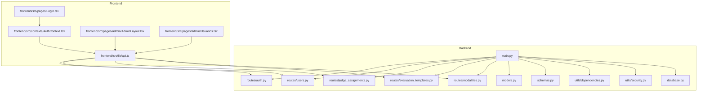
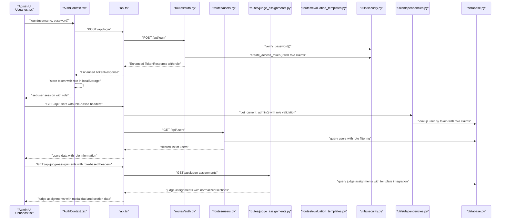
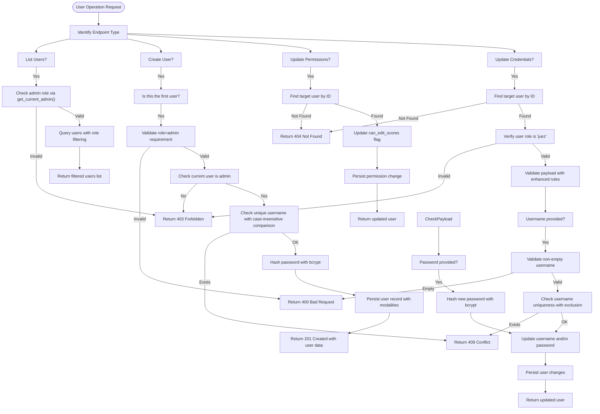
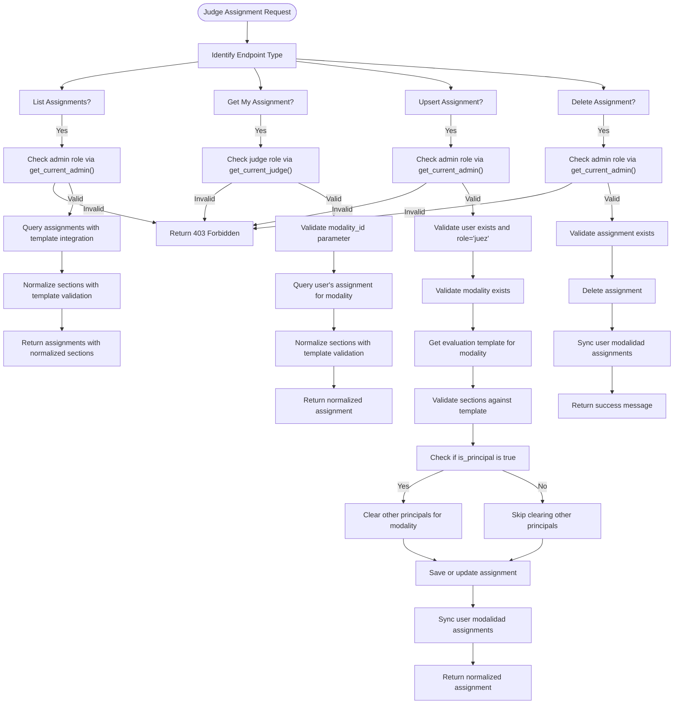
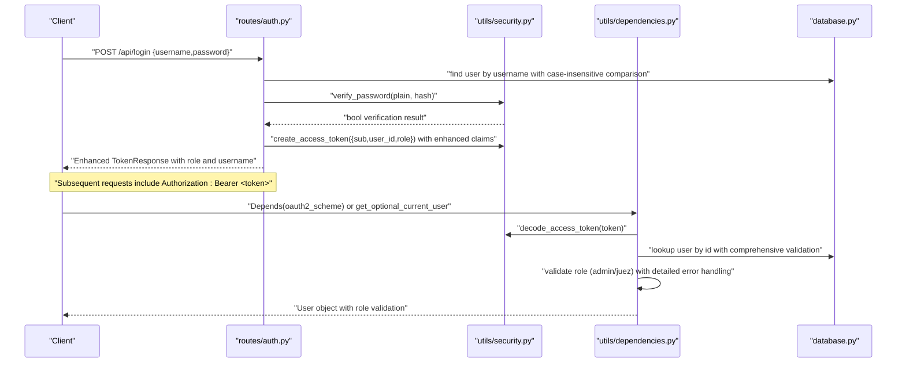
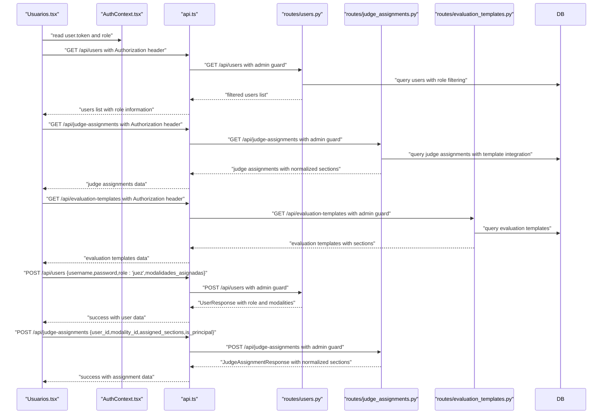
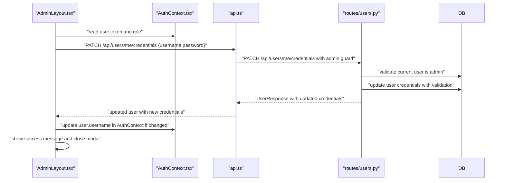
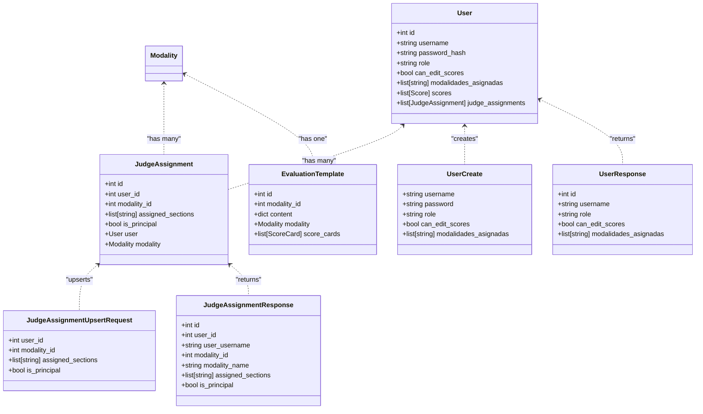

# User Management

<cite>
**Referenced Files in This Document**
- [main.py](file://main.py)
- [database.py](file://database.py)
- [routes/auth.py](file://routes/auth.py)
- [routes/users.py](file://routes/users.py)
- [routes/judge_assignments.py](file://routes/judge_assignments.py)
- [routes/evaluation_templates.py](file://routes/evaluation_templates.py)
- [routes/modalities.py](file://routes/modalities.py)
- [utils/dependencies.py](file://utils/dependencies.py)
- [utils/security.py](file://utils/security.py)
- [models.py](file://models.py)
- [schemas.py](file://schemas.py)
- [frontend/src/pages/admin/Usuarios.tsx](file://frontend/src/pages/admin/Usuarios.tsx)
- [frontend/src/pages/admin/AdminLayout.tsx](file://frontend/src/pages/admin/AdminLayout.tsx)
- [frontend/src/pages/Login.tsx](file://frontend/src/pages/Login.tsx)
- [frontend/src/contexts/AuthContext.tsx](file://frontend/src/contexts/AuthContext.tsx)
- [frontend/src/lib/api.ts](file://frontend/src/lib/api.ts)
</cite>

## Update Summary
**Changes Made**
- Enhanced user management with comprehensive judge assignment system
- Added modalidad-based assignments with principal and secondary judge roles
- Implemented evaluation template integration for section-based permissions
- Added comprehensive judge permissions management with role-based access control
- Updated Usuarios.tsx with new judge assignment features and modal interface
- Enhanced backend with dedicated judge assignment endpoints and validation
- Integrated evaluation templates for dynamic section management

## Table of Contents
1. [Introduction](#introduction)
2. [Project Structure](#project-structure)
3. [Core Components](#core-components)
4. [Architecture Overview](#architecture-overview)
5. [Detailed Component Analysis](#detailed-component-analysis)
6. [Enhanced Judge Assignment System](#enhanced-judge-assignment-system)
7. [Modalidad-Based Assignments](#modalidad-based-assignments)
8. [Principal Judge Designation](#principal-judge-designation)
9. [Comprehensive Judge Permissions Management](#comprehensive-judge-permissions-management)
10. [Enhanced Security Features](#enhanced-security-features)
11. [Role-Based Access Control](#role-based-access-control)
12. [User Data Models](#user-data-models)
13. [Frontend Implementation](#frontend-implementation)
14. [API Endpoints](#api-endpoints)
15. [Security Considerations](#security-considerations)
16. [Troubleshooting Guide](#troubleshooting-guide)
17. [Conclusion](#conclusion)
18. [Appendices](#appendices)

## Introduction
This document explains the enhanced user management functionality in the administrator panel, focusing on creating admin and judge accounts, assigning roles, managing user profiles, handling password changes, and implementing comprehensive judge assignment systems. The system now features enhanced authentication, authorization, role-based access control with judge assignment capabilities, modalidad-based permissions, principal judge designation, and comprehensive judge permissions management. It covers the complete workflow from frontend UI to backend APIs, including comprehensive role-based access control, authentication integration, and advanced security considerations such as password hashing, token management, and audit trails.

## Project Structure
The user management system spans both the backend (FastAPI) and the frontend (React). The backend exposes REST endpoints for user CRUD operations, credential updates, password changes, and comprehensive judge assignment management, while the frontend provides dedicated admin pages for managing users and judges with enhanced assignment interfaces, integrated with enhanced authentication context for secure requests.

**Diagram sources**
- [main.py:1-53](file://main.py#L1-L53)
- [database.py:1-93](file://database.py#L1-L93)
- [routes/auth.py:1-37](file://routes/auth.py#L1-L37)
- [routes/users.py:1-228](file://routes/users.py#L1-L228)
- [routes/judge_assignments.py:1-308](file://routes/judge_assignments.py#L1-L308)
- [routes/evaluation_templates.py:1-172](file://routes/evaluation_templates.py#L1-L172)
- [routes/modalities.py:1-180](file://routes/modalities.py#L1-L180)
- [utils/dependencies.py:1-71](file://utils/dependencies.py#L1-L71)
- [utils/security.py:1-54](file://utils/security.py#L1-L54)
- [models.py:1-225](file://models.py#L1-L225)
- [schemas.py:1-261](file://schemas.py#L1-L261)
- [frontend/src/pages/Login.tsx:1-124](file://frontend/src/pages/Login.tsx#L1-L124)
- [frontend/src/contexts/AuthContext.tsx:1-144](file://frontend/src/contexts/AuthContext.tsx#L1-L144)
- [frontend/src/lib/api.ts:1-41](file://frontend/src/lib/api.ts#L1-L41)
- [frontend/src/pages/admin/AdminLayout.tsx:1-252](file://frontend/src/pages/admin/AdminLayout.tsx#L1-L252)
- [frontend/src/pages/admin/Usuarios.tsx:1-862](file://frontend/src/pages/admin/Usuarios.tsx#L1-L862)

**Section sources**
- [main.py:1-53](file://main.py#L1-L53)
- [routes/users.py:1-228](file://routes/users.py#L1-L228)
- [routes/judge_assignments.py:1-308](file://routes/judge_assignments.py#L1-L308)
- [frontend/src/pages/admin/Usuarios.tsx:1-862](file://frontend/src/pages/admin/Usuarios.tsx#L1-L862)

## Core Components
- **Enhanced Backend user endpoints:**
  - List users with comprehensive filtering
  - Create user with role assignment and initial permissions
  - Update judge permissions with validation
  - Update judge credentials with security checks
  - Update admin credentials (own profile) with enhanced validation
  - Change own password for authenticated users
- **Comprehensive Judge Assignment System:**
  - Dedicated judge assignment endpoints with validation
  - Modalidad-based assignments with section permissions
  - Principal and secondary judge role designation
  - Evaluation template integration for dynamic section management
  - Automatic modalidad synchronization for users
- **Advanced Frontend admin page for user management:**
  - Create judge account form with modalities assignment
  - View and toggle judge permission to edit scores
  - Edit judge credentials with real-time validation
  - Enhanced admin profile management
  - Judge assignment modal with comprehensive interface
- **Improved Authentication and Authorization:**
  - Enhanced login endpoint with comprehensive error handling
  - Dedicated role guards for admin and judge access
  - Advanced password hashing and verification
  - Secure token management with expiration handling
- **Enhanced Data Models and Schemas:**
  - User entity with role, permissions, and modalities assignment
  - JudgeAssignment entity with modalidad and section permissions
  - EvaluationTemplate integration for section-based access control
  - Pydantic models for comprehensive request/response validation

**Section sources**
- [routes/users.py:29-228](file://routes/users.py#L29-L228)
- [routes/judge_assignments.py:164-308](file://routes/judge_assignments.py#L164-L308)
- [routes/auth.py:13-37](file://routes/auth.py#L13-L37)
- [utils/dependencies.py:16-71](file://utils/dependencies.py#L16-L71)
- [utils/security.py:17-50](file://utils/security.py#L17-L50)
- [models.py:11-225](file://models.py#L11-L225)
- [schemas.py:22-261](file://schemas.py#L22-L261)

## Architecture Overview
The enhanced user management flow integrates the frontend admin UI with backend endpoints secured by improved tokens. The frontend authenticates via the enhanced login endpoint, stores the token securely, and sends Authorization headers for protected routes. The backend validates tokens and enforces comprehensive RBAC with dedicated role guards. The judge assignment system integrates with evaluation templates to provide dynamic section-based permissions.

**Diagram sources**
- [frontend/src/pages/admin/Usuarios.tsx:149-176](file://frontend/src/pages/admin/Usuarios.tsx#L149-L176)
- [frontend/src/contexts/AuthContext.tsx:95-111](file://frontend/src/contexts/AuthContext.tsx#L95-L111)
- [frontend/src/lib/api.ts:11-13](file://frontend/src/lib/api.ts#L11-L13)
- [routes/auth.py:13-37](file://routes/auth.py#L13-L37)
- [routes/users.py:29-34](file://routes/users.py#L29-L34)
- [routes/judge_assignments.py:106-130](file://routes/judge_assignments.py#L106-L130)
- [utils/security.py:29-39](file://utils/security.py#L29-L39)
- [utils/dependencies.py:32-38](file://utils/dependencies.py#L32-L38)
- [database.py:28-34](file://database.py#L28-L34)

## Detailed Component Analysis

### Enhanced Backend: User Management Endpoints
- **List users:**
  - Requires admin via enhanced dependency with comprehensive role validation
  - Returns all users ordered by ID with role filtering
- **Create user:**
  - First user must be admin with strict validation
  - Subsequent creations require admin with enhanced security checks
  - Validates unique username with case-insensitive comparison
  - Hashes password with bcrypt before persisting
  - Supports modalities assignment for judge users
- **Update judge permissions:**
  - Admin-only endpoint with comprehensive validation
  - Toggles can_edit_scores for judge users with role verification
- **Update judge credentials:**
  - Admin-only endpoint with enhanced security checks
  - Validates username uniqueness with exclusion of current user
  - Non-empty username validation when provided
  - Hashes new password when provided with bcrypt
- **Update admin credentials (own profile):**
  - Admin-only endpoint with enhanced validation rules
  - Same comprehensive validation and hashing rules as judge credentials
- **Change own password:**
  - Authenticated user endpoint for password modification
  - Verifies current password before allowing changes
  - Hashes new password with bcrypt for security

**Diagram sources**
- [routes/users.py:37-228](file://routes/users.py#L37-L228)
- [utils/security.py:17-26](file://utils/security.py#L17-L26)

**Section sources**
- [routes/users.py:29-228](file://routes/users.py#L29-L228)
- [utils/security.py:17-26](file://utils/security.py#L17-L26)

### Enhanced Backend: Judge Assignment System
- **List judge assignments:**
  - Requires admin role with comprehensive validation
  - Returns all judge assignments with user and modality details
  - Integrates with evaluation templates for section normalization
- **Get my judge assignment:**
  - Judge-only endpoint for accessing personal assignments
  - Validates modality_id parameter and returns normalized sections
- **Upsert judge assignment:**
  - Admin-only endpoint for creating or updating assignments
  - Validates user role is 'juez' and modality exists
  - Integrates with evaluation templates for section validation
  - Automatically manages principal judge designation
  - Synchronizes user modalidad assignments
- **Delete judge assignment:**
  - Admin-only endpoint for removing assignments
  - Updates user modalidad assignments after deletion
  - Returns success message upon completion

**Diagram sources**
- [routes/judge_assignments.py:106-308](file://routes/judge_assignments.py#L106-L308)

**Section sources**
- [routes/judge_assignments.py:106-308](file://routes/judge_assignments.py#L106-L308)

### Enhanced Backend: Authentication and Authorization
- **Enhanced Login:**
  - Verifies username/password against stored hash with comprehensive error handling
  - Issues JWT with enhanced claims including user identity, role, and user_id
  - Returns comprehensive token response with role information
- **Enhanced Dependencies:**
  - Extracts current user from token with comprehensive validation
  - Guards for admin and judge roles with detailed error messages
  - Supports optional current user for public endpoints
- **Advanced Security:**
  - Password hashing with bcrypt and configurable cost factors
  - JWT signing with HS256 algorithm and configurable secret keys
  - Token decoding with comprehensive error handling
  - Environment variable support for configuration

**Diagram sources**
- [routes/auth.py:13-37](file://routes/auth.py#L13-L37)
- [utils/security.py:29-39](file://utils/security.py#L29-L39)
- [utils/dependencies.py:16-71](file://utils/dependencies.py#L16-L71)
- [database.py:28-34](file://database.py#L28-L34)

**Section sources**
- [routes/auth.py:13-37](file://routes/auth.py#L13-L37)
- [utils/dependencies.py:16-71](file://utils/dependencies.py#L16-L71)
- [utils/security.py:17-50](file://utils/security.py#L17-L50)

### Enhanced Frontend: Admin User Management Page
- **Enhanced User Loading:**
  - Loads users list with comprehensive bearer token authentication
  - Handles loading states with improved user feedback
  - Displays comprehensive error states with detailed messaging
  - Loads judge assignments and evaluation templates for assignment interface
- **Advanced Judge Account Creation:**
  - Creates judge accounts with username, password, and modalities assignment
  - Provides interactive modalities selection with visual feedback
  - Implements comprehensive form validation and error handling
- **Enhanced Permission Management:**
  - Toggles judge permission to edit scores with real-time updates
  - Provides visual feedback during permission changes
  - Handles pending states and loading indicators
- **Advanced Credential Management:**
  - Edits judge credentials with username and password updates
  - Implements real-time validation for username uniqueness
  - Provides comprehensive success and error messaging
- **Enhanced Judge Assignment Interface:**
  - Opens comprehensive modal for judge assignment management
  - Displays available modalidades with evaluation template integration
  - Manages principal and secondary judge role designation
  - Handles section-based permissions with template validation
  - Provides assignment editing and deletion capabilities
- **Enhanced User Experience:**
  - Displays loading states, success messages, and error states
  - Implements responsive design with modern UI components
  - Provides comprehensive form validation and user feedback

**Diagram sources**
- [frontend/src/pages/admin/Usuarios.tsx:149-176](file://frontend/src/pages/admin/Usuarios.tsx#L149-L176)
- [frontend/src/contexts/AuthContext.tsx:95-111](file://frontend/src/contexts/AuthContext.tsx#L95-L111)
- [frontend/src/lib/api.ts:11-13](file://frontend/src/lib/api.ts#L11-L13)
- [routes/users.py:29-151](file://routes/users.py#L29-L151)
- [routes/judge_assignments.py:164-280](file://routes/judge_assignments.py#L164-L280)

**Section sources**
- [frontend/src/pages/admin/Usuarios.tsx:15-862](file://frontend/src/pages/admin/Usuarios.tsx#L15-L862)

### Enhanced Frontend: Admin Layout and Profile Management
- **Enhanced Admin Layout:**
  - Provides navigation with comprehensive menu items
  - Displays user information with role badges and styling
  - Integrates with enhanced authentication context
- **Advanced Profile Management:**
  - Admin layout provides navigation and enhanced modal to edit admin's own credentials
  - Uses the "update own credentials" endpoint with comprehensive validation
  - Updates local session if username changes with enhanced error handling
- **Enhanced User Interface:**
  - Modern modal design for profile editing
  - Real-time validation and feedback
  - Comprehensive error handling and success messaging

**Diagram sources**
- [frontend/src/pages/admin/AdminLayout.tsx:56-99](file://frontend/src/pages/admin/AdminLayout.tsx#L56-L99)
- [frontend/src/contexts/AuthContext.tsx:95-111](file://frontend/src/contexts/AuthContext.tsx#L95-L111)
- [frontend/src/lib/api.ts:11-13](file://frontend/src/lib/api.ts#L11-L13)
- [routes/users.py:154-199](file://routes/users.py#L154-L199)

**Section sources**
- [frontend/src/pages/admin/AdminLayout.tsx:1-252](file://frontend/src/pages/admin/AdminLayout.tsx#L1-L252)

### Enhanced Data Model and Schemas
- **Enhanced User Model:**
  - User includes role, permission flag for editing scores, and modalidades assignment
  - Supports JSON field for storing assigned modalities
  - Comprehensive relationship definitions with scoring system and judge assignments
- **JudgeAssignment Model:**
  - New entity for managing judge-modalidad relationships
  - Includes assigned_sections with JSON storage for section permissions
  - Tracks is_principal flag for role designation
  - Establishes relationships with User and Modality entities
- **EvaluationTemplate Integration:**
  - Template-based section validation and normalization
  - Dynamic section management based on template content
  - Automatic bonus section handling for principal judges
- **Advanced Pydantic Schemas:**
  - Defines comprehensive request/response shapes for user operations
  - Includes role type validation with literal types
  - Supports optional fields for partial updates
  - Implements comprehensive field validation with length constraints
  - Includes JudgeAssignment-specific schemas for assignment management

**Diagram sources**
- [models.py:11-225](file://models.py#L11-L225)
- [schemas.py:22-261](file://schemas.py#L22-L261)
- [routes/judge_assignments.py:196-220](file://routes/judge_assignments.py#L196-L220)

**Section sources**
- [models.py:11-225](file://models.py#L11-L225)
- [schemas.py:22-261](file://schemas.py#L22-L261)
- [routes/judge_assignments.py:196-220](file://routes/judge_assignments.py#L196-L220)

## Enhanced Judge Assignment System
The enhanced judge assignment system provides comprehensive management of judge-modalidad relationships with section-based permissions and role designation.

### Judge Assignment Architecture
- **Assignment Entity:**
  - Links users to modalities with section permissions
  - Supports both principal and secondary judge roles
  - Stores assigned sections as JSON array for flexibility
  - Provides automatic modalidad synchronization
- **Template Integration:**
  - Integrates with evaluation templates for section validation
  - Normalizes section assignments based on template content
  - Handles bonus sections automatically for principal judges
  - Validates section IDs against template definitions
- **Role Management:**
  - Principal judges receive automatic bonus section assignment
  - Secondary judges can only access manually assigned sections
  - Automatic clearing of other principals when new principal is designated

### Assignment Validation and Normalization
- **Section Validation:**
  - Extracts valid sections from evaluation templates
  - Validates requested sections against template definitions
  - Removes duplicates and normalizes section IDs
  - Excludes bonus sections from manual assignment
- **Principal Judge Logic:**
  - Automatically assigns bonus section to principal judges
  - Clears other principal designations for the same modality
  - Ensures only one principal per modality per judge
- **Data Integrity:**
  - Maintains unique constraints on user-modality combinations
  - Synchronizes user modalidad assignments after changes
  - Cascades deletions to maintain referential integrity

**Section sources**
- [routes/judge_assignments.py:15-308](file://routes/judge_assignments.py#L15-L308)
- [models.py:131-144](file://models.py#L131-L144)
- [schemas.py:196-220](file://schemas.py#L196-L220)

## Modalidad-Based Assignments
The system implements comprehensive modalidad-based assignments that integrate with evaluation templates to provide dynamic section permissions.

### Modalidad Assignment Workflow
- **Template-Based Section Management:**
  - Extracts valid sections from evaluation templates
  - Provides dynamic section options based on template content
  - Handles both regular sections and bonus sections
  - Validates section IDs against template definitions
- **Assignment Interface:**
  - Displays available modalidades with evaluation template integration
  - Provides interactive section selection with visual feedback
  - Supports bulk section assignment for principal judges
  - Handles section exclusion for bonus sections
- **Dynamic Validation:**
  - Validates section assignments against template content
  - Prevents assignment of non-existent sections
  - Ensures section uniqueness within assignments
  - Handles empty section arrays for validation

### Section Normalization Process
- **Template Extraction:**
  - Parses evaluation template content for section definitions
  - Extracts both regular sections and bonus sections
  - Normalizes section IDs for consistent validation
  - Handles missing or malformed template content
- **Assignment Normalization:**
  - Removes duplicate section assignments
  - Strips whitespace from section IDs
  - Excludes bonus sections from manual assignment
  - Maintains order of assigned sections
- **Principal Judge Benefits:**
  - Automatically includes bonus section for principal judges
  - Ensures bonus section is always included regardless of manual selection
  - Prevents manual assignment of bonus sections

**Section sources**
- [routes/judge_assignments.py:15-66](file://routes/judge_assignments.py#L15-L66)
- [frontend/src/pages/admin/Usuarios.tsx:114-147](file://frontend/src/pages/admin/Usuarios.tsx#L114-L147)

## Principal Judge Designation
The system implements comprehensive principal judge designation with automatic role management and section assignment benefits.

### Principal Judge Logic
- **Automatic Principal Management:**
  - When a judge is designated as principal, clears other principals
  - Ensures only one principal per modality per judge
  - Maintains data integrity through atomic operations
  - Prevents multiple principal designations
- **Section Assignment Benefits:**
  - Principal judges automatically receive bonus section
  - Bonus section is always included regardless of manual selection
  - Secondary judges cannot access bonus sections
  - Automatic inclusion of bonus sections for principals
- **Role-Based Permissions:**
  - Principal judges can finalize score cards
  - Secondary judges can only complete assigned sections
  - Automatic section assignment for principal judges
  - Manual section selection for secondary judges

### Assignment Interface Design
- **Role Selection Interface:**
  - Provides clear visual distinction between principal and secondary
  - Shows role-specific benefits and limitations
  - Handles role switching with validation
  - Prevents invalid role assignments
- **Visual Feedback:**
  - Different styling for principal and secondary roles
  - Clear indication of role benefits
  - Immediate feedback on role changes
  - Validation warnings for role conflicts

**Section sources**
- [routes/judge_assignments.py:232-240](file://routes/judge_assignments.py#L232-L240)
- [frontend/src/pages/admin/Usuarios.tsx:670-706](file://frontend/src/pages/admin/Usuarios.tsx#L670-L706)

## Comprehensive Judge Permissions Management
The system provides comprehensive judge permissions management with role-based access control and section-specific permissions.

### Permission Management Features
- **Score Editing Permissions:**
  - Toggle permission to edit scores for individual judges
  - Role-based restrictions prevent admin access
  - Real-time permission updates with validation
  - Automatic permission validation on access attempts
- **Section-Based Access Control:**
  - Principal judges can access all sections including bonus
  - Secondary judges limited to assigned sections
  - Automatic section assignment for principal judges
  - Manual section selection for secondary judges
- **Assignment-Based Permissions:**
  - Judge can only access modalidades they are assigned to
  - Section permissions determined by assignment type
  - Automatic permission inheritance from assignments
  - Real-time permission validation

### Permission Validation and Enforcement
- **Assignment Validation:**
  - Validates judge assignments before granting access
  - Checks modalidad and section permissions
  - Ensures judge has appropriate role designation
  - Prevents unauthorized access attempts
- **Real-Time Permission Checking:**
  - Validates permissions on each access attempt
  - Handles dynamic permission changes
  - Provides immediate feedback on permission status
  - Enforces role-based access control
- **Audit and Monitoring:**
  - Tracks permission changes and access attempts
  - Logs unauthorized access attempts
  - Monitors permission violations
  - Provides audit trail for security compliance

**Section sources**
- [routes/judge_assignments.py:133-161](file://routes/judge_assignments.py#L133-L161)
- [frontend/src/pages/admin/Usuarios.tsx:503-524](file://frontend/src/pages/admin/Usuarios.tsx#L503-L524)

## Enhanced Security Features
The user management system now includes comprehensive security enhancements:

### Password Security
- **Advanced Password Hashing:**
  - Uses bcrypt with configurable cost factors for password hashing
  - Implements secure password verification with timing attack resistance
  - Supports password strength validation with minimum length requirements
- **Secure Token Management:**
  - JWT tokens with HS256 algorithm and configurable secret keys
  - Token expiration handling with configurable timeout periods
  - Secure token storage in browser localStorage with enhanced validation

### Enhanced Authentication Flow
- **Comprehensive Token Validation:**
  - Validates JWT tokens with comprehensive error handling
  - Extracts user claims with detailed validation
  - Supports optional token validation for public endpoints
- **Role-Based Access Control:**
  - Dedicated role guards for admin and judge users
  - Comprehensive role validation with detailed error messages
  - Supports role-specific endpoint protection
- **Judge Assignment Security:**
  - Validates judge assignments against evaluation templates
  - Prevents unauthorized section access attempts
  - Ensures proper role-based permissions
  - Handles assignment validation and normalization

### Data Protection
- **Input Validation:**
  - Comprehensive Pydantic validation for all user inputs
  - Username uniqueness validation with case-insensitive comparison
  - Password strength validation with minimum length requirements
  - Modalities validation for judge assignments
  - Section validation against template definitions
- **Database Security:**
  - SQL injection prevention through SQLAlchemy ORM usage
  - Comprehensive error handling for database operations
  - Secure database connection management
  - Atomic operations for assignment changes

**Section sources**
- [utils/security.py:17-50](file://utils/security.py#L17-L50)
- [utils/dependencies.py:16-71](file://utils/dependencies.py#L16-L71)
- [routes/auth.py:13-37](file://routes/auth.py#L13-L37)
- [routes/judge_assignments.py:15-308](file://routes/judge_assignments.py#L15-L308)

## Role-Based Access Control
The system implements comprehensive role-based access control with dedicated guards:

### Role Definitions
- **Admin Role:**
  - Full administrative privileges
  - Can create, update, and delete users
  - Can manage judge permissions and credentials
  - Can access all administrative endpoints
  - Can manage judge assignments and modalidad permissions
- **Judge Role:**
  - Limited privileges for score management
  - Can update own credentials and password
  - Can edit scores based on assigned permissions
  - Cannot access administrative user management
  - Can access personal judge assignments
- **System Roles:**
  - Automatic role validation for all endpoints
  - Comprehensive error handling for unauthorized access
  - Detailed error messages for security violations

### Guard Implementation
- **Admin Guard:**
  - `get_current_admin()` function for comprehensive role validation
  - Returns 403 Forbidden for non-admin users
  - Provides detailed error messages for role violations
- **Judge Guard:**
  - `get_current_judge()` function for role validation
  - Restricts endpoints to judge users only
  - Provides comprehensive error handling
- **Assignment-Specific Guards:**
  - Judge assignment endpoints require admin role
  - Personal assignment access requires judge role
  - Validates role-based permissions for access attempts

### Endpoint Protection
- **Protected Endpoints:**
  - User creation requires admin role
  - User permission updates require admin role
  - Credential updates require admin role
  - Profile updates require admin role
  - Judge assignments require admin role
  - Personal assignments require judge role
- **Role-Specific Endpoints:**
  - Judge credential updates restricted to judge users
  - Profile management accessible to authenticated users
  - Password changes available to all authenticated users
  - Assignment management accessible to admins only

**Section sources**
- [utils/dependencies.py:32-47](file://utils/dependencies.py#L32-L47)
- [routes/users.py:37-151](file://routes/users.py#L37-L151)
- [routes/judge_assignments.py:106-161](file://routes/judge_assignments.py#L106-L161)

## User Data Models
The enhanced user management system includes comprehensive data models:

### Database Schema
- **User Table Structure:**
  - Primary key with auto-increment
  - Unique username with indexing for performance
  - Password hash with bcrypt storage
  - Role field with enum-like validation
  - Boolean flag for score editing permissions
  - JSON field for modalidades assignment
- **JudgeAssignment Table Structure:**
  - Primary key with auto-increment
  - Foreign key relationships with users and modalities
  - JSON field for assigned sections storage
  - Boolean flag for principal judge designation
  - Unique constraint on user_id-modality_id combination
- **Relationships:**
  - Bidirectional relationship with Score model
  - Bidirectional relationship with JudgeAssignment model
  - Bidirectional relationship with Modality model
  - Supports cascading operations for data integrity
  - Indexing for efficient querying

### Enhanced User Operations
- **Modalities Assignment:**
  - Supports assignment of multiple modalities to judges
  - JSON storage for flexible modalities data
  - Validation for modalities uniqueness and format
- **Judge Assignment Management:**
  - Comprehensive assignment tracking with sections
  - Principal judge designation with automatic management
  - section-based permissions with template validation
  - Automatic modalidad synchronization
- **Score Management:**
  - Direct relationship with scoring system
  - Supports cascading deletion of associated scores
  - Maintains data integrity across operations

**Section sources**
- [models.py:11-225](file://models.py#L11-L225)
- [schemas.py:22-261](file://schemas.py#L22-L261)

## Frontend Implementation
The frontend implementation includes comprehensive user management interfaces:

### Enhanced User Management Interface
- **Modern UI Components:**
  - Responsive grid layout for desktop and mobile
  - Interactive modalities selection with visual feedback
  - Real-time validation and error handling
  - Loading states and progress indicators
- **Advanced Form Handling:**
  - Comprehensive form validation with real-time feedback
  - Error boundary handling for network failures
  - Success messaging and automatic form reset
- **Enhanced User Experience:**
  - Smooth transitions and animations
  - Accessible form controls with proper labeling
  - Comprehensive keyboard navigation support

### Judge Assignment Interface
- **Comprehensive Assignment Modal:**
  - Modern modal design for judge assignment management
  - Interactive modalidad selection with template integration
  - Role designation interface with visual feedback
  - Section assignment interface with template validation
  - Assignment editing and deletion capabilities
- **Dynamic Section Management:**
  - Real-time section option extraction from templates
  - Interactive section selection with visual feedback
  - Automatic bonus section handling for principals
  - Validation of section assignments against templates
- **Assignment Summary Interface:**
  - Displays current judge assignments with role indicators
  - Shows assigned sections with visual feedback
  - Provides edit and delete actions for assignments
  - Handles assignment updates and deletions

### Profile Management Interface
- **Modern Modal Design:**
  - Clean modal interface for profile editing
  - Real-time validation and feedback
  - Success confirmation and automatic closure
- **Enhanced Error Handling:**
  - Comprehensive error boundary implementation
  - User-friendly error messages
  - Automatic error clearing on successful operations

**Section sources**
- [frontend/src/pages/admin/Usuarios.tsx:18-862](file://frontend/src/pages/admin/Usuarios.tsx#L18-L862)
- [frontend/src/pages/admin/AdminLayout.tsx:173-252](file://frontend/src/pages/admin/AdminLayout.tsx#L173-L252)

## API Endpoints
The enhanced user management system exposes comprehensive API endpoints:

### User Management Endpoints
- **GET /api/users**
  - Lists all users with role filtering
  - Requires admin authentication
  - Returns comprehensive user data
- **POST /api/users**
  - Creates new users with role assignment
  - Requires admin authentication for subsequent users
  - Supports modalities assignment for judges
- **PUT /api/users/{user_id}/permissions**
  - Updates judge permissions
  - Requires admin authentication
  - Validates target user is judge
- **PATCH /api/users/{user_id}/credentials**
  - Updates judge credentials
  - Requires admin authentication
  - Validates username uniqueness and password strength
- **PATCH /api/users/me/credentials**
  - Updates admin credentials
  - Requires admin authentication
  - Validates current user role
- **PUT /api/users/me/password**
  - Changes user password
  - Requires authenticated user
  - Validates current password before changes

### Judge Assignment Endpoints
- **GET /api/judge-assignments**
  - Lists all judge assignments with template integration
  - Requires admin authentication
  - Returns normalized assignment data
- **GET /api/judge-assignments/me**
  - Gets current judge's assignment for specific modality
  - Requires judge authentication
  - Validates modality_id parameter
- **POST /api/judge-assignments**
  - Creates or updates judge assignments
  - Requires admin authentication
  - Validates user role, modality, and sections
- **DELETE /api/judge-assignments/{assignment_id}**
  - Deletes judge assignments
  - Requires admin authentication
  - Updates user modalidad assignments

### Authentication Endpoints
- **POST /api/login**
  - Authenticates users and issues JWT tokens
  - Returns comprehensive token response with role
  - Supports both admin and judge authentication

**Section sources**
- [routes/users.py:29-228](file://routes/users.py#L29-L228)
- [routes/judge_assignments.py:106-308](file://routes/judge_assignments.py#L106-L308)
- [routes/auth.py:13-37](file://routes/auth.py#L13-L37)

## Security Considerations
The enhanced user management system implements comprehensive security measures:

### Password Security
- **Advanced Hashing:**
  - bcrypt password hashing with configurable cost factors
  - Secure password verification with timing attack resistance
  - Minimum password length enforcement (4 characters)
- **Token Security:**
  - JWT tokens with HS256 algorithm
  - Configurable token expiration (default 720 minutes)
  - Secret key management through environment variables
  - Token validation with comprehensive error handling

### Authentication Security
- **Role-Based Protection:**
  - Dedicated role guards for admin and judge
  - Comprehensive error handling for unauthorized access
  - Detailed error messages for security violations
- **Assignment Security:**
  - Judge assignment validation against evaluation templates
  - Section-based access control with template validation
  - Principal judge management with automatic conflict resolution
  - Real-time permission checking and enforcement

### Data Protection
- **Database Security:**
  - SQLAlchemy ORM prevents SQL injection
  - Comprehensive error handling for database operations
  - Secure database connection management
- **Frontend Security:**
  - Token storage in browser localStorage with validation
  - CORS middleware for cross-origin resource sharing
  - Environment variable configuration for deployment
- **Assignment Security:**
  - Atomic operations for assignment changes
  - Unique constraint enforcement for assignments
  - Template-based validation for section assignments
  - Role-based access control for assignments

### Audit and Monitoring
- **Enhanced Logging:**
  - Comprehensive error logging with detailed messages
  - User action tracking through API responses
  - Security event monitoring for unauthorized access attempts
  - Assignment change logging for audit trails
- **Performance Monitoring:**
  - Token expiration handling for session management
  - Database query optimization through indexing
  - Frontend performance monitoring for user experience
  - Assignment validation performance optimization

**Section sources**
- [utils/security.py:17-50](file://utils/security.py#L17-L50)
- [utils/dependencies.py:16-71](file://utils/dependencies.py#L16-L71)
- [routes/users.py:37-228](file://routes/users.py#L37-L228)
- [routes/judge_assignments.py:15-308](file://routes/judge_assignments.py#L15-L308)

## Troubleshooting Guide
Enhanced troubleshooting for the improved user management system:

### Authentication Issues
- **Login Failures:**
  - Verify username and password combination against stored hash
  - Check for case-sensitive username matching
  - Ensure JWT secret key is properly configured
  - Validate token expiration and renewal
- **Token Validation Errors:**
  - Check JWT signature verification
  - Validate token claims and expiration
  - Ensure proper token format (Bearer token)
  - Verify token storage in browser localStorage

### Authorization Problems
- **Role-Based Access Denied:**
  - Verify user role in token claims
  - Check admin guard implementation
  - Ensure proper role validation in endpoints
  - Validate user permissions for specific operations
- **Assignment Access Issues:**
  - Verify judge assignments for requested modalidad
  - Check section permissions for judge role
  - Validate principal/secondary role designation
  - Ensure proper endpoint protection

### Judge Assignment Errors
- **Assignment Creation Failures:**
  - Verify user exists and has role 'juez'
  - Check modality exists and has evaluation template
  - Validate section IDs against template definitions
  - Ensure at least one section is assigned
- **Principal Judge Conflicts:**
  - Check for existing principal designation
  - Verify automatic clearing of other principals
  - Ensure unique principal per modality per judge
  - Validate role-based assignment logic
- **Section Validation Errors:**
  - Verify section IDs exist in evaluation template
  - Check for duplicate section assignments
  - Validate bonus section handling for principals
  - Ensure proper section normalization

### Frontend Integration Issues
- **API Communication:**
  - Verify API base URL configuration
  - Check Authorization header formatting
  - Validate token transmission and storage
  - Handle API error responses gracefully
- **Form Validation:**
  - Check real-time validation implementation
  - Verify error message display and handling
  - Validate form submission and response processing
  - Ensure proper loading states and user feedback
- **Assignment Interface Issues:**
  - Verify template loading and integration
  - Check section option extraction from templates
  - Validate assignment modal functionality
  - Ensure proper error handling for assignment operations

**Section sources**
- [routes/users.py:37-228](file://routes/users.py#L37-L228)
- [routes/judge_assignments.py:15-308](file://routes/judge_assignments.py#L15-L308)
- [routes/auth.py:13-37](file://routes/auth.py#L13-L37)
- [frontend/src/pages/admin/Usuarios.tsx:149-862](file://frontend/src/pages/admin/Usuarios.tsx#L149-L862)

## Conclusion
The enhanced user management system provides a comprehensive, secure, and role-based interface for administrators to create judge accounts, manage permissions, update credentials, and implement comprehensive judge assignment systems. The system now features improved authentication with JWT tokens, comprehensive role-based access control with dedicated guards, advanced security implementations with bcrypt hashing, enhanced user data models with modalidad assignments, and sophisticated judge assignment management with modalidad-based permissions and principal judge designation. The backend enforces strict RBAC and cryptographic safeguards, while the frontend offers modern, intuitive forms with robust error handling, comprehensive user experience, and dynamic assignment interfaces. Following the documented workflows ensures reliable administration of users, maintains system integrity, provides comprehensive judge assignment capabilities, and offers a foundation for future security enhancements and feature additions.

## Appendices

### Step-by-Step: Enhanced Judge Account Creation
1. **Navigate to User Management:**
   - Access the admin user management page from the navigation menu
   - Ensure you have admin authentication and role validation
2. **Fill Account Details:**
   - Enter judge's username with minimum 3 character requirement
   - Set temporary password with minimum 4 character requirement
   - Note that modalidad assignment occurs after account creation
3. **Submit and Validate:**
   - Click "Crear juez" button to submit the form
   - System validates username uniqueness and password strength
   - Backend creates judge account with role "juez" and default permissions
4. **Confirm Success:**
   - View success message "Juez creado correctamente."
   - Refresh user list to confirm new judge appears
   - Verify judge has assigned modalidades

**Section sources**
- [frontend/src/pages/admin/Usuarios.tsx:178-210](file://frontend/src/pages/admin/Usuarios.tsx#L178-L210)
- [routes/users.py:37-73](file://routes/users.py#L37-L73)

### Step-by-Step: Enhanced Judge Assignment Management
1. **Access Assignment Interface:**
   - Navigate to user management page with admin authentication
   - Select "Asignar modalidad / rol" for target judge
   - Ensure judge role validation before assignment operations
2. **Configure Assignment Settings:**
   - Select modalidad from available evaluation templates
   - Choose role designation (Principal or Secundario)
   - Select sections to assign (at least one section required)
   - Note automatic bonus section assignment for principals
3. **Save Assignment:**
   - Click "Guardar asignación" to submit changes
   - System validates sections against template definitions
   - Backend creates or updates judge assignment
   - Automatically manages principal judge designation
4. **Confirm Assignment:**
   - View success message "Asignación actualizada correctamente."
   - Observe updated assignment in user list
   - Verify assignment appears in assignment summary modal
   - Check modalidad synchronization for user

**Section sources**
- [frontend/src/pages/admin/Usuarios.tsx:278-334](file://frontend/src/pages/admin/Usuarios.tsx#L278-L334)
- [routes/judge_assignments.py:164-280](file://routes/judge_assignments.py#L164-L280)

### Step-by-Step: Enhanced Judge Permission Management
1. **Access User List:**
   - Navigate to the user management page with admin authentication
   - Load users list with comprehensive role filtering
2. **Select Target Judge:**
   - Locate the judge whose permission needs to be changed
   - Ensure target user has role "juez" for permission updates
3. **Toggle Permission:**
   - Click the permission switch labeled "Permitir re-editar puntajes"
   - System validates judge role and permission state
   - Backend updates can_edit_scores flag in database
4. **Verify Changes:**
   - Observe immediate UI update with loading indicator
   - Check updated permission state in user list
   - Confirm database persistence with refresh

**Section sources**
- [frontend/src/pages/admin/Usuarios.tsx:212-237](file://frontend/src/pages/admin/Usuarios.tsx#L212-L237)
- [routes/users.py:76-93](file://routes/users.py#L76-L93)

### Step-by-Step: Enhanced Judge Credential Management
1. **Open Credential Editor:**
   - Navigate to user management page with admin authentication
   - Select "Editar credenciales" for target judge
   - Ensure judge role validation before credential updates
2. **Enter New Credentials:**
   - Optionally enter new username (minimum 3 characters)
   - Optionally enter new password (minimum 4 characters)
   - System validates empty fields and applies changes selectively
3. **Submit Changes:**
   - Click "Guardar cambios" to submit updates
   - System validates username uniqueness with exclusion
   - Backend hashes new password if provided and updates user
4. **Confirm Updates:**
   - View success message "Credenciales actualizadas correctamente."
   - Observe updated credentials in user list
   - Verify database persistence and username uniqueness

**Section sources**
- [frontend/src/pages/admin/Usuarios.tsx:239-276](file://frontend/src/pages/admin/Usuarios.tsx#L239-L276)
- [routes/users.py:96-151](file://routes/users.py#L96-L151)

### Step-by-Step: Enhanced Admin Profile Management
1. **Access Profile Editor:**
   - Open admin layout and click "Editar mis datos"
   - Ensure admin authentication and role validation
   - Pre-populate current username for easy editing
2. **Update Profile Information:**
   - Enter new username (optional, minimum 3 characters)
   - Enter new password (optional, minimum 4 characters)
   - System validates changes and applies selectively
3. **Save Changes:**
   - Click "Guardar cambios" to submit updates
   - System validates username uniqueness and updates admin
   - Backend updates current admin's credentials
4. **Confirm Updates:**
   - View success message "Datos actualizados correctamente."
   - Observe automatic modal closure
   - Verify username change in AuthContext if applicable

**Section sources**
- [frontend/src/pages/admin/AdminLayout.tsx:56-99](file://frontend/src/pages/admin/AdminLayout.tsx#L56-L99)
- [routes/users.py:154-199](file://routes/users.py#L154-L199)

### Enhanced Security Configuration
- **Environment Variables:**
  - `JWT_SECRET_KEY`: Secret key for JWT token signing (required)
  - `ACCESS_TOKEN_EXPIRE_MINUTES`: Token expiration time in minutes (default: 720)
  - Configure production deployments with strong, random secret keys
- **Password Security:**
  - Minimum password length: 4 characters
  - bcrypt cost factor: configurable for performance vs security balance
  - Password hashing performed automatically on user creation and updates
- **Token Management:**
  - Token expiration: 720 minutes (12 hours) by default
  - Token storage: browser localStorage with validation
  - Token validation: comprehensive error handling and user claim extraction
- **Assignment Security:**
  - Template-based section validation for all assignments
  - Atomic operations for assignment changes
  - Unique constraint enforcement for user-modality combinations
  - Role-based access control for assignment operations

**Section sources**
- [utils/security.py:9-14](file://utils/security.py#L9-L14)
- [utils/security.py:17-26](file://utils/security.py#L17-L26)
- [utils/security.py:29-39](file://utils/security.py#L29-L39)
- [routes/judge_assignments.py:15-308](file://routes/judge_assignments.py#L15-L308)