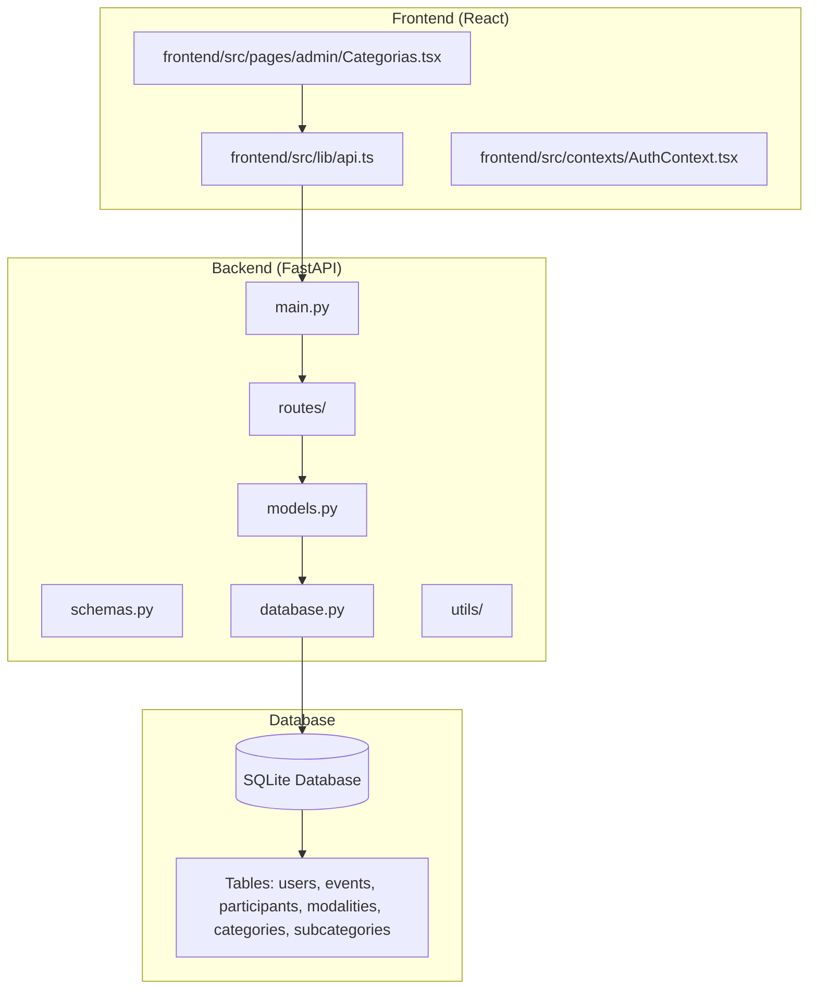
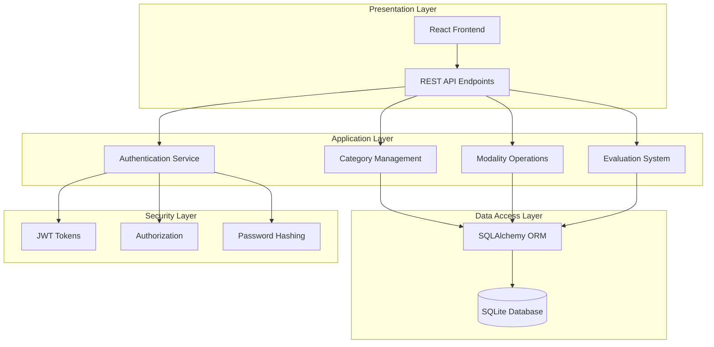
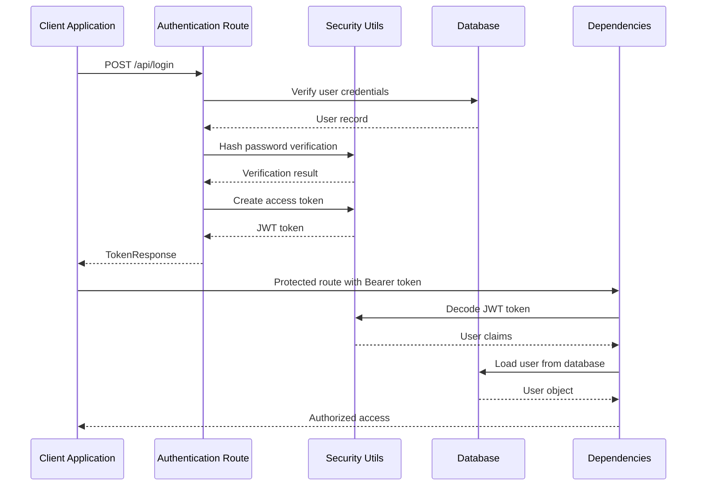
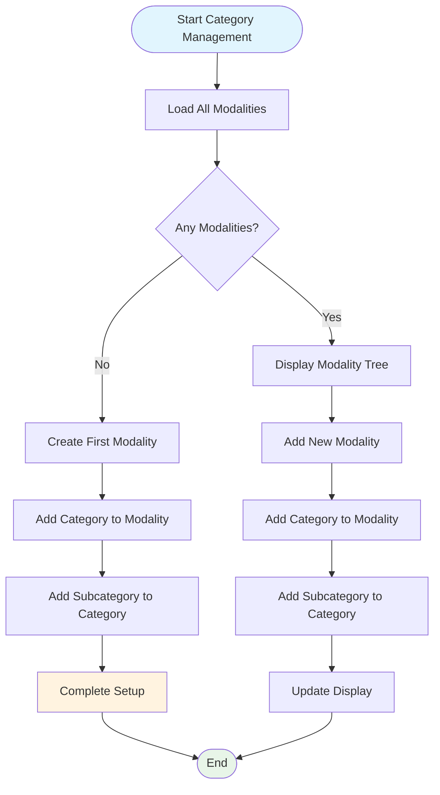
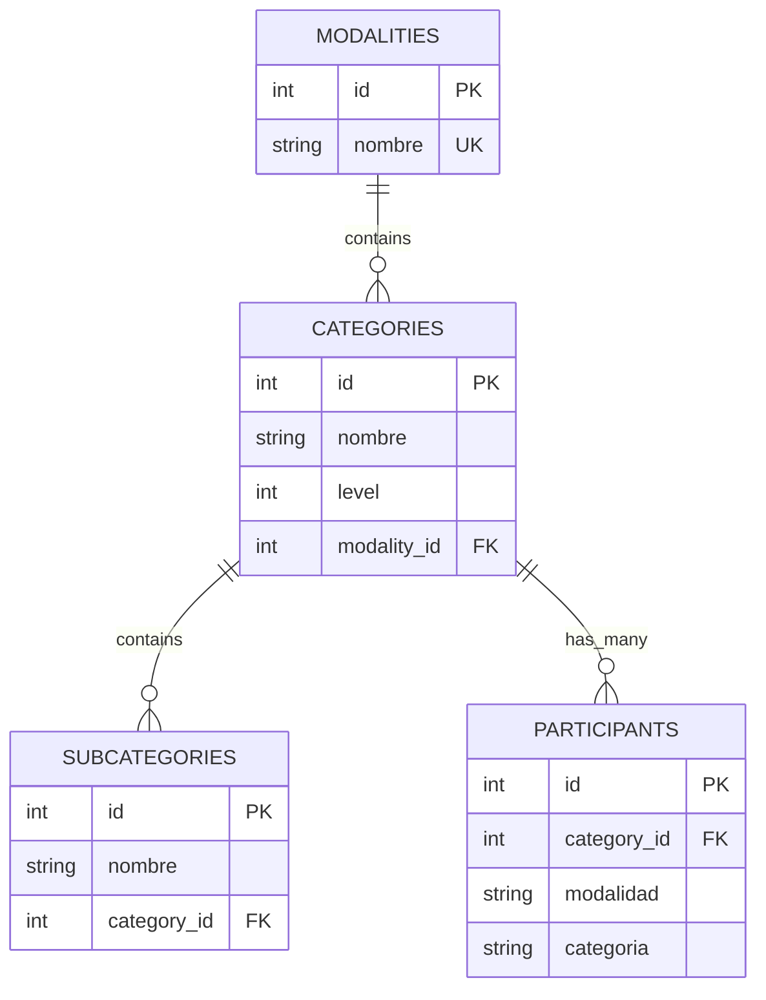
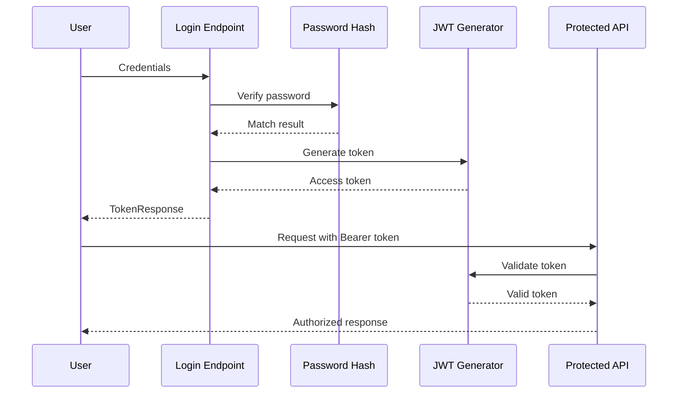
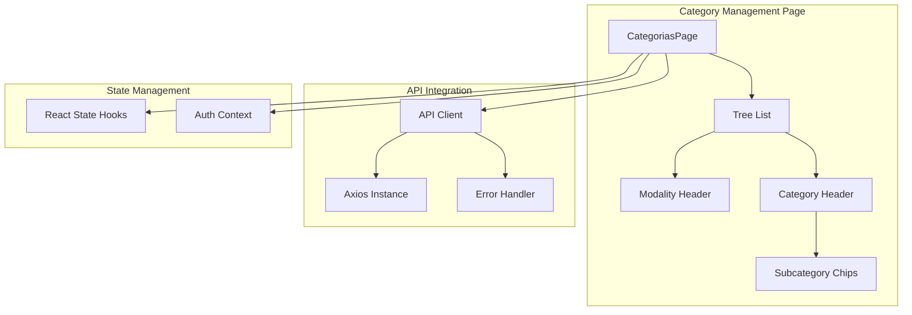

# Category Management System

<cite>
**Referenced Files in This Document**
- [main.py](file://main.py)
- [database.py](file://database.py)
- [models.py](file://models.py)
- [schemas.py](file://schemas.py)
- [routes/categories.py](file://routes/categories.py)
- [routes/modalities.py](file://routes/modalities.py)
- [routes/auth.py](file://routes/auth.py)
- [utils/dependencies.py](file://utils/dependencies.py)
- [utils/security.py](file://utils/security.py)
- [frontend/src/pages/admin/Categorias.tsx](file://frontend/src/pages/admin/Categorias.tsx)
- [frontend/src/lib/api.ts](file://frontend/src/lib/api.ts)
- [init_db.py](file://init_db.py)
</cite>

## Table of Contents
1. [Introduction](#introduction)
2. [Project Structure](#project-structure)
3. [Core Components](#core-components)
4. [Architecture Overview](#architecture-overview)
5. [Detailed Component Analysis](#detailed-component-analysis)
6. [Category Management Workflow](#category-management-workflow)
7. [Database Schema Design](#database-schema-design)
8. [Security and Authentication](#security-and-authentication)
9. [Frontend Implementation](#frontend-implementation)
10. [Performance Considerations](#performance-considerations)
11. [Troubleshooting Guide](#troubleshooting-guide)
12. [Conclusion](#conclusion)

## Introduction

The Category Management System is a comprehensive web application designed for organizing car audio and tuning competitions. It provides administrators with the ability to manage competition structures through modalities, categories, and subcategories, while judges can evaluate participants based on standardized scoring systems. The system features a modern React frontend with TypeScript and a FastAPI backend using SQLAlchemy ORM for database operations.

The application supports complex hierarchical competition structures where modalities contain categories, which in turn contain subcategories. This allows for flexible competition organization ranging from introductory levels to professional categories, with specialized subcategories for different vehicle types or competition formats.

## Project Structure

The project follows a clean architecture pattern with clear separation between frontend and backend components:



**Diagram sources**
- [main.py:1-59](file://main.py#L1-L59)
- [database.py:1-193](file://database.py#L1-L193)
- [models.py:1-225](file://models.py#L1-L225)

**Section sources**
- [main.py:1-59](file://main.py#L1-L59)
- [database.py:1-193](file://database.py#L1-L193)

## Core Components

### Backend Architecture

The backend is built on FastAPI with the following core components:

- **Application Entry Point**: Central FastAPI application with CORS middleware and route registration
- **Database Layer**: SQLAlchemy ORM with SQLite backend and automatic migration support
- **Routing System**: Modular route handlers organized by domain (categories, modalities, users, etc.)
- **Authentication System**: JWT-based authentication with role-based access control
- **Data Validation**: Pydantic models for request/response validation

### Database Schema

The system uses a hierarchical three-tier structure:

1. **Modalities**: Top-level competition categories (e.g., SPL, SQ, Street Show)
2. **Categories**: Second-level divisions within modalities (Intro, Aficionado, Pro, Master)
3. **Subcategories**: Third-level subdivisions (e.g., different vehicle types)

**Section sources**
- [models.py:174-225](file://models.py#L174-L225)
- [schemas.py:167-206](file://schemas.py#L167-L206)

## Architecture Overview

The system implements a layered architecture with clear separation of concerns:



**Diagram sources**
- [main.py:9-50](file://main.py#L9-L50)
- [routes/auth.py:13-36](file://routes/auth.py#L13-L36)
- [utils/dependencies.py:16-71](file://utils/dependencies.py#L16-L71)

## Detailed Component Analysis

### Category Management Routes

The category management system provides comprehensive CRUD operations through dedicated API endpoints:

```mermaid
classDiagram
class CategoryRoutes {
+GET /api/modalities
+POST /api/modalities
+POST /api/modalities/{modality_id}/categories
+DELETE /api/modalities/{modality_id}
+DELETE /api/modalities/categories/{category_id}
}
class ModalityRoutes {
+GET /api/modalities
+POST /api/modalities
+POST /api/modalities/{modality_id}/categories
+POST /api/modalities/categories/{category_id}/subcategories
+DELETE /api/modalities/{modality_id}
+DELETE /api/modalities/categories/{category_id}
+DELETE /api/modalities/subcategories/{subcategory_id}
}
class Category {
+id : int
+nombre : string
+level : int
+modality_id : int
}
class Modality {
+id : int
+nombre : string
}
CategoryRoutes --> Category : manages
ModalityRoutes --> Modality : manages
Category --> Modality : belongs_to
```

**Diagram sources**
- [routes/categories.py:12-128](file://routes/categories.py#L12-L128)
- [routes/modalities.py:19-196](file://routes/modalities.py#L19-L196)

### Authentication and Authorization System

The system implements role-based access control with JWT tokens:



**Diagram sources**
- [routes/auth.py:13-36](file://routes/auth.py#L13-L36)
- [utils/security.py:32-42](file://utils/security.py#L32-L42)
- [utils/dependencies.py:16-71](file://utils/dependencies.py#L16-L71)

**Section sources**
- [routes/auth.py:13-36](file://routes/auth.py#L13-L36)
- [utils/security.py:17-53](file://utils/security.py#L17-L53)
- [utils/dependencies.py:16-71](file://utils/dependencies.py#L16-L71)

## Category Management Workflow

The category management process follows a structured workflow for creating and maintaining competition hierarchies:



**Diagram sources**
- [frontend/src/pages/admin/Categorias.tsx:32-51](file://frontend/src/pages/admin/Categorias.tsx#L32-L51)
- [routes/modalities.py:36-54](file://routes/modalities.py#L36-L54)

### API Endpoint Specifications

The system provides the following REST API endpoints for category management:

| Method | Endpoint | Description | Required Role |
|--------|----------|-------------|---------------|
| GET | `/api/modalities` | List all modalities with nested categories and subcategories | User |
| POST | `/api/modalities` | Create a new modality | Admin |
| POST | `/api/modalities/{modality_id}/categories` | Create a category within a modality | Admin |
| POST | `/api/modalities/categories/{category_id}/subcategories` | Create a subcategory within a category | Admin |
| DELETE | `/api/modalities/{modality_id}` | Delete a modality and all children | Admin |
| DELETE | `/api/modalities/categories/{category_id}` | Delete a category and all children | Admin |
| DELETE | `/api/modalities/subcategories/{subcategory_id}` | Delete a subcategory | Admin |

**Section sources**
- [routes/modalities.py:19-196](file://routes/modalities.py#L19-L196)
- [routes/categories.py:12-128](file://routes/categories.py#L12-L128)

## Database Schema Design

The database design implements a hierarchical structure optimized for competition organization:



**Diagram sources**
- [models.py:174-225](file://models.py#L174-L225)

### Data Integrity Constraints

The schema enforces referential integrity through foreign key constraints and unique constraints:

- **Unique Modalities**: Prevent duplicate modality names
- **Unique Categories**: Prevent duplicate category names within the same modality
- **Unique Subcategories**: Prevent duplicate subcategory names within the same category
- **Cascade Deletion**: Automatic removal of child records when parent records are deleted

**Section sources**
- [models.py:174-225](file://models.py#L174-L225)

## Security and Authentication

The system implements comprehensive security measures:

### Authentication Flow



**Diagram sources**
- [routes/auth.py:13-36](file://routes/auth.py#L13-L36)
- [utils/security.py:17-53](file://utils/security.py#L17-L53)

### Authorization Roles

The system supports two primary roles:

- **Admin**: Full access to all management operations including category creation and deletion
- **Judge**: Limited access for evaluation activities

**Section sources**
- [utils/dependencies.py:32-47](file://utils/dependencies.py#L32-L47)
- [schemas.py:7](file://schemas.py#L7)

## Frontend Implementation

The frontend provides an intuitive interface for managing the competition hierarchy:

### Component Architecture



**Diagram sources**
- [frontend/src/pages/admin/Categorias.tsx:25-337](file://frontend/src/pages/admin/Categorias.tsx#L25-L337)
- [frontend/src/lib/api.ts:11-41](file://frontend/src/lib/api.ts#L11-L41)

### User Interface Features

The frontend implementation includes:

- **Real-time Updates**: Automatic refresh after CRUD operations
- **Confirmation Dialogs**: Safety measures for destructive operations
- **Loading States**: Visual feedback during API requests
- **Error Handling**: Comprehensive error messaging
- **Responsive Design**: Mobile-friendly interface

**Section sources**
- [frontend/src/pages/admin/Categorias.tsx:32-147](file://frontend/src/pages/admin/Categorias.tsx#L32-L147)

## Performance Considerations

### Database Optimization

The system implements several performance optimizations:

- **Lazy Loading**: Efficient loading of nested relationships using joinedload
- **Indexing**: Strategic indexing on frequently queried columns
- **Connection Pooling**: Optimized database connection management
- **Batch Operations**: Minimized database round trips through bulk operations

### Caching Strategies

- **Frontend Caching**: Local state management for reduced API calls
- **Response Caching**: Efficient caching of frequently accessed modality lists
- **Pagination Support**: Ready for future pagination implementation

## Troubleshooting Guide

### Common Issues and Solutions

**Database Migration Issues**
- **Problem**: Schema inconsistencies after updates
- **Solution**: Run database initialization script or check migration logs

**Authentication Problems**
- **Problem**: 401 Unauthorized errors
- **Solution**: Verify token validity and expiration, check user credentials

**API Connectivity Issues**
- **Problem**: Frontend cannot reach backend
- **Solution**: Check CORS configuration and network connectivity

**Data Validation Errors**
- **Problem**: 422 Validation errors
- **Solution**: Verify request payload structure matches schema requirements

**Section sources**
- [database.py:36-193](file://database.py#L36-L193)
- [frontend/src/lib/api.ts:24-40](file://frontend/src/lib/api.ts#L24-L40)

## Conclusion

The Category Management System provides a robust foundation for organizing complex car audio and tuning competitions. Its modular architecture, comprehensive security model, and intuitive user interface make it suitable for both small local events and large-scale national competitions.

Key strengths of the system include:

- **Hierarchical Organization**: Flexible competition structure supporting multiple levels
- **Role-Based Access Control**: Secure management with appropriate permission levels
- **Modern Technology Stack**: React frontend with FastAPI backend ensures maintainability
- **Data Integrity**: Comprehensive constraints prevent data inconsistencies
- **Extensible Design**: Modular architecture supports future feature additions

The system successfully balances functionality with simplicity, providing administrators with powerful tools for competition management while maintaining ease of use for end users.