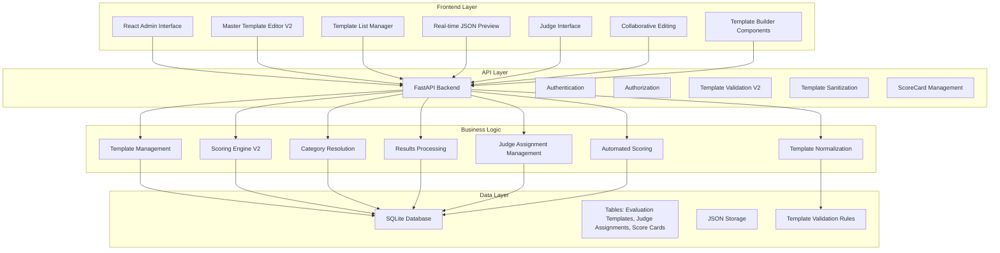
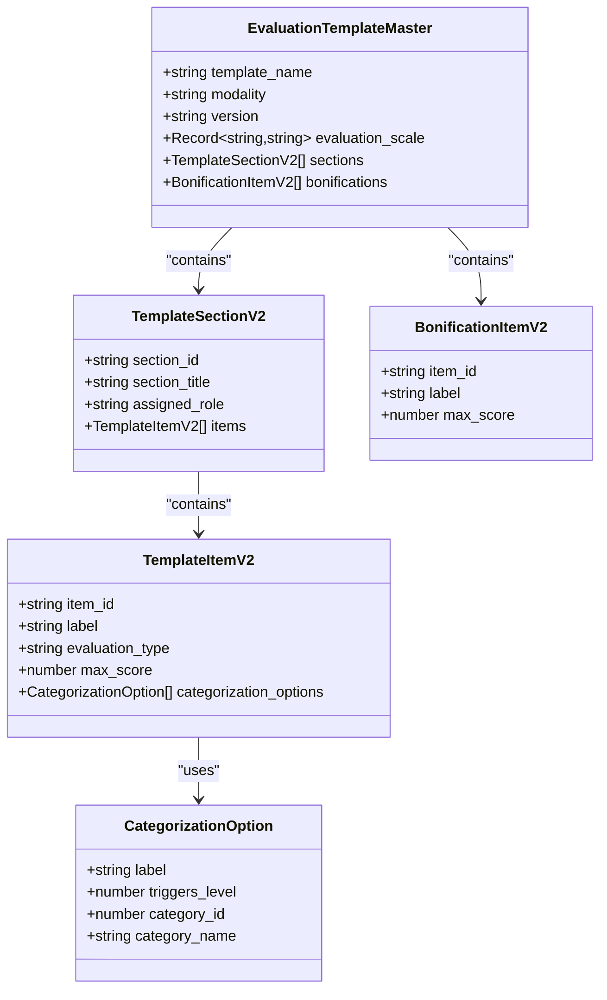
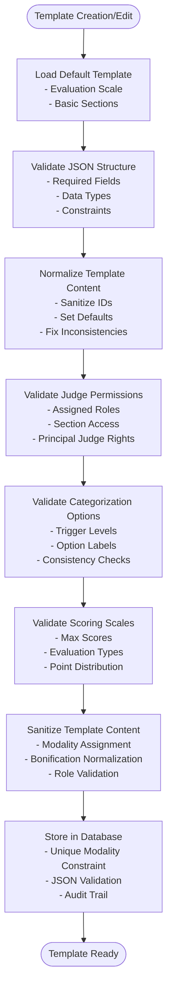
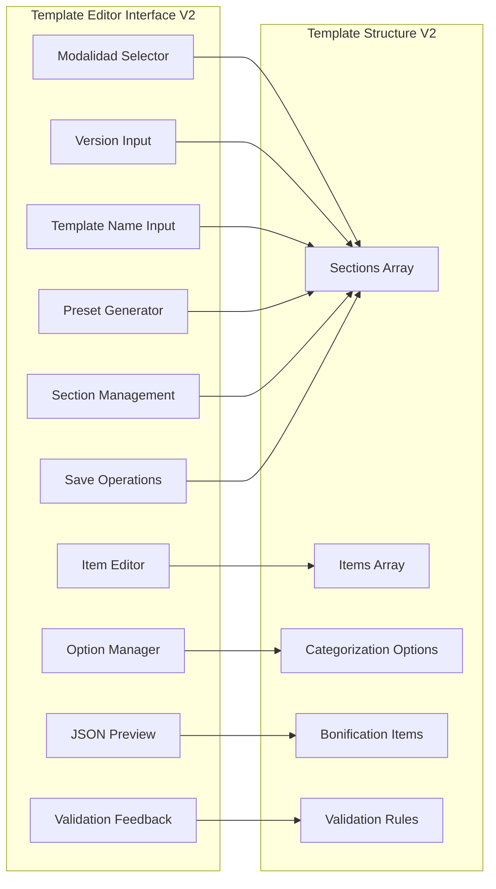
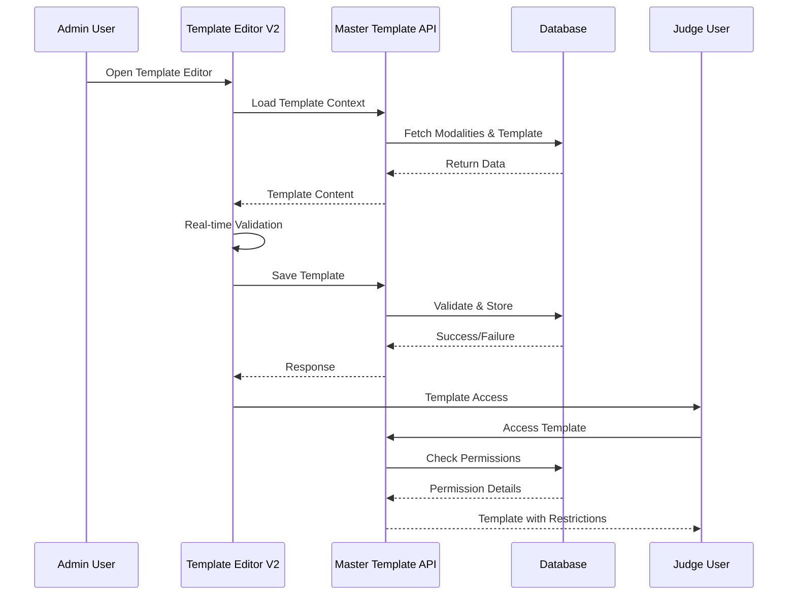
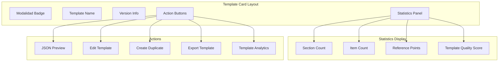
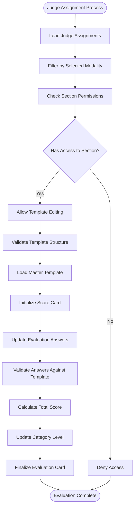
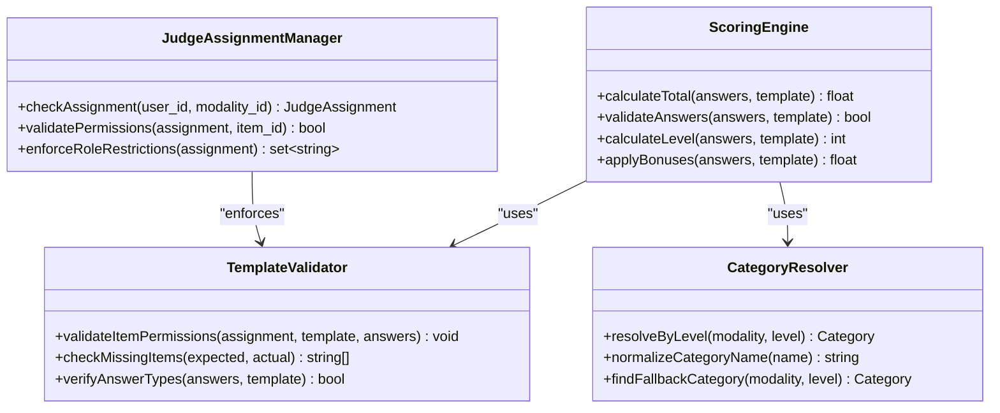
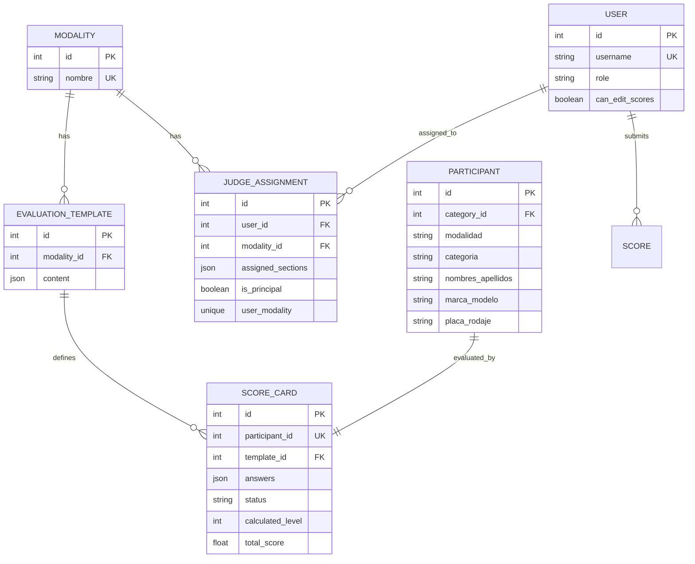

# Evaluation Template Management

<cite>
**Referenced Files in This Document**
- [routes/evaluation_templates.py](file://routes/evaluation_templates.py)
- [routes/modalities.py](file://routes/modalities.py)
- [routes/scorecards.py](file://routes/scorecards.py)
- [routes/judge_assignments.py](file://routes/judge_assignments.py)
- [models.py](file://models.py)
- [schemas.py](file://schemas.py)
- [frontend/src/pages/admin/EvaluationTemplateEditor.tsx](file://frontend/src/pages/admin/EvaluationTemplateEditor.tsx)
- [frontend/src/pages/admin/TemplatesList.tsx](file://frontend/src/pages/admin/TemplatesList.tsx)
- [frontend/src/lib/judging.ts](file://frontend/src/lib/judging.ts)
- [frontend/src/lib/api.ts](file://frontend/src/lib/api.ts)
- [frontend/src/pages/admin/AdminLayout.tsx](file://frontend/src/pages/admin/AdminLayout.tsx)
- [frontend/src/components/template-editor/index.ts](file://frontend/src/components/template-editor/index.ts)
- [frontend/src/components/template-editor/types.ts](file://frontend/src/components/template-editor/types.ts)
- [frontend/src/components/template-editor/utils.ts](file://frontend/src/components/template-editor/utils.ts)
- [frontend/src/components/template-editor/TemplateSectionCard.tsx](file://frontend/src/components/template-editor/TemplateSectionCard.tsx)
- [frontend/src/components/template-editor/TemplateItemCard.tsx](file://frontend/src/components/template-editor/TemplateItemCard.tsx)
- [frontend/src/components/template-editor/CategorizationOptionRow.tsx](file://frontend/src/components/template-editor/CategorizationOptionRow.tsx)
- [frontend/src/components/template-editor/BonificationSection.tsx](file://frontend/src/components/template-editor/BonificationSection.tsx)
- [frontend/src/components/template-editor/JsonPreview.tsx](file://frontend/src/components/template-editor/JsonPreview.tsx)
- [main.py](file://main.py)
</cite>

## Update Summary
**Changes Made**
- Enhanced documentation to reflect the new comprehensive Template Builder system with V2 data structures
- Updated template management system to include sophisticated preset generation, template normalization, and collaborative editing features
- Added detailed coverage of the new template editor interface with real-time validation, JSON preview, and enhanced preset system
- Enhanced template sanitization and validation with automatic content normalization and improved error handling
- Updated API endpoints to include comprehensive master template CRUD operations with enhanced validation
- Enhanced data models documentation with new evaluation template relationships and improved validation
- Added comprehensive coverage of the new sanitize_template_content function and template normalization logic
- Integrated collaborative scoring features with judge assignment permissions and real-time validation
- Added support for master templates per modality with unique constraint enforcement
- Enhanced validation system with comprehensive template structure, permission, and content sanitization

## Table of Contents
1. [Introduction](#introduction)
2. [System Architecture](#system-architecture)
3. [Core Components](#core-components)
4. [Template Management System](#template-management-system)
5. [Master Template System](#master-template-system)
6. [Template Editor Interface](#template-editor-interface)
7. [Template List Interface](#template-list-interface)
8. [Evaluation Workflow](#evaluation-workflow)
9. [Data Models and Relationships](#data-models-and-relationships)
10. [API Endpoints](#api-endpoints)
11. [Implementation Details](#implementation-details)
12. [Performance Considerations](#performance-considerations)
13. [Troubleshooting Guide](#troubleshooting-guide)
14. [Conclusion](#conclusion)

## Introduction

The Evaluation Template Management system is a comprehensive solution for managing scoring templates and evaluation workflows in automotive audio and tuning competitions. The system provides a sophisticated master template architecture with modalidad-based template management, advanced V2 scoring interface, real-time preview capabilities, and collaborative evaluation workflows.

The platform supports five official modalities (SPL, SQ, SQL, Street Show, Tuning) with specialized evaluation criteria, automated scoring calculations, and hierarchical category management. Each modalidad maintains a single shared master template that all judges can access, enabling consistent evaluation standards across different competition formats. The enhanced master template system introduces comprehensive template validation, normalization, and collaborative editing capabilities with sophisticated preset generation and real-time preview functionality.

The system now includes enhanced template sanitization with automatic content normalization, improved error handling throughout the validation pipeline, and comprehensive support for V2 scoring interface with new categorization options and enhanced template validation. The addition of the ScoreCard model enables automated scoring calculations and collaborative evaluation workflows with real-time score tracking and category assignment.

## System Architecture

The system follows a modern full-stack architecture with clear separation between frontend, backend, and database layers:

**Diagram sources**
- [main.py:26-44](file://main.py#L26-L44)
- [routes/evaluation_templates.py:14-172](file://routes/evaluation_templates.py#L14-L172)
- [routes/modalities.py:15-180](file://routes/modalities.py#L15-L180)
- [routes/scorecards.py:20-725](file://routes/scorecards.py#L20-L725)

## Core Components

### Backend Services

The backend consists of several specialized routers handling different aspects of the evaluation system:

**Master Template Router**: Handles CRUD operations for master templates with comprehensive validation, modalidad assignment, and uniqueness constraints. Now includes advanced sanitization and normalization functions for template content with enhanced error handling and V2 scoring interface support.

**Modality Router**: Manages modalidad definitions, category hierarchies, and judge assignment permissions with enhanced validation and cascading operations.

**Scoring Router**: Implements the collaborative evaluation workflow with partial updates, finalization, and category assignment with improved permission checking, V2 scoring interface, and validation. Now includes comprehensive ScoreCard management with automated calculations and real-time score tracking.

**Authentication & Authorization**: Ensures only authorized users (admins and judges) can access specific endpoints with role-based permissions and enhanced security checks.

### Frontend Interfaces

**Admin Dashboard**: Central management interface for template creation, editing, and monitoring with real-time validation feedback and comprehensive template statistics.

**Master Template Editor V2**: Advanced JSON editor with real-time validation, template presets, comprehensive CRUD operations, and sophisticated template normalization capabilities with enhanced bonification section support and V2 data structures.

**Template List Manager**: Grid-based interface for browsing, previewing, and managing all master templates with statistical summaries, template analytics, and bulk operations.

**Real-time Preview**: Modal-based JSON preview with syntax highlighting, copy functionality, and template validation feedback.

**Judge Interface**: Specialized interface for judges to evaluate participants using master templates with role-based access control, V2 scoring interface, and collaborative editing permissions.

**Template Builder Components**: Modular component system including TemplateSectionCard, TemplateItemCard, CategorizationOptionRow, BonificationSection, and JsonPreview for building comprehensive evaluation templates.

**Section sources**
- [routes/evaluation_templates.py:14-172](file://routes/evaluation_templates.py#L14-L172)
- [routes/modalities.py:15-180](file://routes/modalities.py#L15-L180)
- [frontend/src/pages/admin/EvaluationTemplateEditor.tsx:546-800](file://frontend/src/pages/admin/EvaluationTemplateEditor.tsx#L546-L800)
- [frontend/src/pages/admin/TemplatesList.tsx:73-252](file://frontend/src/pages/admin/TemplatesList.tsx#L73-L252)
- [frontend/src/components/template-editor/index.ts:1-8](file://frontend/src/components/template-editor/index.ts#L1-L8)

## Template Management System

The system supports a sophisticated master template architecture with comprehensive validation and management capabilities:

### Master Template Structure

Master templates use a hierarchical JSON structure that defines evaluation criteria, scoring scales, and categorization logic with enhanced validation and normalization:

**Diagram sources**
- [frontend/src/lib/judging.ts:40-84](file://frontend/src/lib/judging.ts#L40-L84)
- [frontend/src/lib/judging.ts:66-84](file://frontend/src/lib/judging.ts#L66-L84)

### Template Validation System

The system implements comprehensive validation for template integrity and consistency with advanced sanitization and normalization:

**Diagram sources**
- [routes/evaluation_templates.py:17-29](file://routes/evaluation_templates.py#L17-L29)
- [frontend/src/pages/admin/EvaluationTemplateEditor.tsx:387-483](file://frontend/src/pages/admin/EvaluationTemplateEditor.tsx#L387-L483)

**Section sources**
- [routes/evaluation_templates.py:17-29](file://routes/evaluation_templates.py#L17-L29)
- [frontend/src/pages/admin/EvaluationTemplateEditor.tsx:387-483](file://frontend/src/pages/admin/EvaluationTemplateEditor.tsx#L387-L483)

## Master Template System

The master template system represents the most sophisticated approach to evaluation management with comprehensive validation and collaborative features:

### Template Editor Interface

The master template editor provides a comprehensive interface for creating and managing evaluation templates with advanced preset generation and real-time validation:

**Diagram sources**
- [frontend/src/pages/admin/EvaluationTemplateEditor.tsx:695-800](file://frontend/src/pages/admin/EvaluationTemplateEditor.tsx#L695-L800)

### Collaborative Template Management

The system supports collaborative template management with role-based access control and enhanced permission enforcement:

**Diagram sources**
- [routes/evaluation_templates.py:56-100](file://routes/evaluation_templates.py#L56-L100)
- [frontend/src/pages/admin/EvaluationTemplateEditor.tsx:508-532](file://frontend/src/pages/admin/EvaluationTemplateEditor.tsx#L508-L532)

**Section sources**
- [routes/evaluation_templates.py:56-100](file://routes/evaluation_templates.py#L56-L100)
- [frontend/src/pages/admin/EvaluationTemplateEditor.tsx:508-532](file://frontend/src/pages/admin/EvaluationTemplateEditor.tsx#L508-L532)

## Template Editor Interface

The Master Template Editor V2 provides a comprehensive interface for creating and managing evaluation templates with real-time validation and advanced preset generation:

### User Interface Components

The editor interface includes sophisticated validation and management features with enhanced template building capabilities:

**Template Structure Management**: Dynamic section and item management with drag-and-drop capabilities, real-time validation feedback, and intelligent preset generation.

**JSON Validation System**: Real-time JSON validation with syntax highlighting, error detection, automatic correction suggestions, and comprehensive template normalization.

**Preset System**: Modalidad-specific presets with automatic template generation, customization options, and intelligent content population.

**Permission Management**: Role-based access control with judge assignment validation, permission enforcement, and collaborative editing restrictions.

**Template Builder Components**: Modular component system including TemplateSectionCard, TemplateItemCard, CategorizationOptionRow, BonificationSection, and JsonPreview for building comprehensive evaluation templates.

**Section sources**
- [frontend/src/pages/admin/EvaluationTemplateEditor.tsx:695-800](file://frontend/src/pages/admin/EvaluationTemplateEditor.tsx#L695-L800)
- [frontend/src/pages/admin/EvaluationTemplateEditor.tsx:508-532](file://frontend/src/pages/admin/EvaluationTemplateEditor.tsx#L508-L532)
- [frontend/src/components/template-editor/index.ts:1-8](file://frontend/src/components/template-editor/index.ts#L1-L8)

### Validation Logic

The editor implements comprehensive validation to ensure template integrity with advanced sanitization:

| Validation Type | Rules | Purpose |
|----------------|-------|---------|
| Template Structure | JSON schema validation, required fields, data types | Prevent malformed templates |
| Modalidad Assignment | Unique constraint per modalidad, role validation | Prevent template conflicts |
| Section Management | Unique section IDs, valid role assignments | Maintain template organization |
| Item Validation | Score ranges, evaluation types, option consistency | Ensure scoring accuracy |
| Permission Control | Judge assignment verification, access restrictions | Maintain evaluation integrity |
| Content Sanitization | ID normalization, default values, consistency checks | Ensure template quality |

**Section sources**
- [frontend/src/pages/admin/EvaluationTemplateEditor.tsx:387-483](file://frontend/src/pages/admin/EvaluationTemplateEditor.tsx#L387-L483)
- [routes/evaluation_templates.py:17-29](file://routes/evaluation_templates.py#L17-L29)

## Template List Interface

The Template List Manager provides a comprehensive overview of all master templates with statistical analysis and quick access:

### Template Overview System

The list interface displays comprehensive template information with advanced analytics:

**Diagram sources**
- [frontend/src/pages/admin/TemplatesList.tsx:154-224](file://frontend/src/pages/admin/TemplatesList.tsx#L154-L224)

### Statistical Analysis

The system provides comprehensive template analytics with quality metrics:

**Template Statistics**: Automatic calculation of sections, items, and reference point totals for each template with quality scoring.

**Usage Analytics**: Template popularity metrics, judge assignment counts, and evaluation frequency tracking.

**Version Management**: Template version tracking, comparison capabilities, and historical analysis.

**Quality Assessment**: Template completeness scores, validation status indicators, and recommendation system.

**Section sources**
- [frontend/src/pages/admin/TemplatesList.tsx:73-252](file://frontend/src/pages/admin/TemplatesList.tsx#L73-L252)

## Evaluation Workflow

The evaluation process integrates seamlessly with the master template management system and collaborative judge assignments:

### Judge Assignment Workflow

**Diagram sources**
- [routes/scorecards.py:445-503](file://routes/scorecards.py#L445-L503)
- [routes/scorecards.py:535-607](file://routes/scorecards.py#L535-L607)

### Automated Scoring System

The system automatically calculates scores based on master template definitions with enhanced validation:

**Diagram sources**
- [routes/scorecards.py:318-353](file://routes/scorecards.py#L318-L353)
- [routes/scorecards.py:144-174](file://routes/scorecards.py#L144-L174)

**Section sources**
- [routes/scorecards.py:535-607](file://routes/scorecards.py#L535-L607)
- [routes/scorecards.py:318-353](file://routes/scorecards.py#L318-L353)

## Data Models and Relationships

The system's data architecture supports complex evaluation scenarios through carefully designed relationships with enhanced validation:

### Core Entity Relationships

**Diagram sources**
- [models.py:115-163](file://models.py#L115-L163)
- [models.py:174-225](file://models.py#L174-L225)

### Template Data Structures

The system supports sophisticated template formats optimized for different use cases with enhanced validation:

| Template Type | Storage Format | Use Case | Complexity | Validation |
|---------------|----------------|----------|------------|------------|
| Master Template | Hierarchical JSON | Complex multi-section evaluations | High | Comprehensive |
| Judge Assignment | JSON Array | Role-based permissions | Medium | Role-based |
| Score Card | JSON Object | Individual judge evaluations | Medium-High | Real-time |
| Category Definition | JSON Object | Evaluation categories | Low | Simple |

**Section sources**
- [models.py:115-163](file://models.py#L115-L163)
- [schemas.py:180-236](file://schemas.py#L180-L236)

## API Endpoints

The system exposes a comprehensive REST API for master template management with enhanced validation:

### Master Template Management Endpoints

| Endpoint | Method | Description | Authentication | Validation |
|----------|--------|-------------|----------------|------------|
| `/api/evaluation-templates` | GET | List all master templates | User | None |
| `/api/evaluation-templates` | POST | Create master template | Admin | Full validation, sanitization |
| `/api/evaluation-templates/{id}` | GET | Get master template | User | None |
| `/api/evaluation-templates/by-modality/{modality_id}` | GET | Get template by modality | User | None |
| `/api/evaluation-templates/{id}` | PUT | Update master template | Admin | Full validation, sanitization |
| `/api/evaluation-templates/{id}` | DELETE | Delete master template | Admin | Cascade delete |

### Template Management Endpoints

| Endpoint | Method | Description | Authentication |
|----------|--------|-------------|----------------|
| `/api/modalities` | GET | List all modalities | User |
| `/api/modalities` | POST | Create modality | Admin |
| `/api/modalities/{modality_id}` | DELETE | Delete modality | Admin |

### Evaluation Workflow Endpoints

| Endpoint | Method | Description | Authentication |
|----------|--------|-------------|----------------|
| `/api/scorecards` | GET | List scorecards | User |
| `/api/scorecards/{participant_id}/partial-update` | PATCH | Partial scorecard update | Judge |
| `/api/scorecards/{participant_id}` | GET | Get scorecard | Judge |
| `/api/scorecards/{participant_id}/finalize` | POST | Finalize scorecard | Principal Judge |

**Section sources**
- [routes/evaluation_templates.py:42-172](file://routes/evaluation_templates.py#L42-L172)
- [routes/modalities.py:18-52](file://routes/modalities.py#L18-L52)
- [routes/scorecards.py:422-400](file://routes/scorecards.py#L422-L400)

## Implementation Details

### Database Schema Design

The database schema supports the sophisticated master template architecture with enhanced validation:

**Master Template Storage**: Single template per modalidad with comprehensive JSON storage, validation, and normalization.

**Judge Assignment Management**: Role-based access control with section-level permissions, principal judge designation, and enhanced permission enforcement.

**Score Card Integration**: Direct linking between participants, templates, and evaluation results with automatic calculation and validation.

**Template Validation**: Built-in validation rules, normalization functions, and quality assurance for template integrity.

### Security Implementation

The system implements comprehensive security measures with enhanced validation:

**Authentication**: JWT-based authentication with role-based access control and enhanced security checks.

**Authorization**: Per-endpoint permission checking with user role validation and template access restrictions.

**Template Access Control**: Judge assignments determine which evaluation sections they can access with enhanced permission enforcement.

**Data Validation**: Comprehensive input validation prevents malicious data injection and ensures template quality.

**Template Integrity**: Unique constraints prevent duplicate templates per modalidad with enhanced validation.

### Error Handling

Robust error handling ensures system stability with comprehensive validation:

**HTTP Status Codes**: Proper HTTP status codes for different error scenarios with enhanced error messages.

**Validation Errors**: Specific error messages for template validation failures with actionable guidance.

**Database Errors**: Graceful handling of database connectivity issues with retry mechanisms.

**Permission Errors**: Clear error messages for unauthorized access attempts with role-based explanations.

**Template Sanitization**: Automatic cleanup and normalization of template content prevents corruption.

The system now includes comprehensive template sanitization with the `sanitize_template_content` function that automatically normalizes template content, assigns proper roles to bonification sections, and ensures consistent data structure across all templates.

**Section sources**
- [routes/evaluation_templates.py:56-100](file://routes/evaluation_templates.py#L56-L100)
- [routes/scorecards.py:144-174](file://routes/scorecards.py#L144-L174)

## Performance Considerations

### Database Optimization

**Indexing Strategy**: Strategic indexing on frequently queried fields (modalidad, user roles, template IDs) with enhanced performance.

**Query Optimization**: Efficient queries using joined loads to minimize database round trips with optimized joins.

**Connection Pooling**: Proper session management to handle concurrent requests with connection pooling.

### Frontend Performance

**Component Optimization**: React.memo for template components to reduce re-renders with enhanced memoization.

**State Management**: Efficient state updates to minimize re-renders with optimized state management.

**API Caching**: Client-side caching for frequently accessed templates and modalities with intelligent caching.

**Real-time Validation**: Debounced validation to prevent excessive API calls with enhanced throttling.

### Scalability Features

**Horizontal Scaling**: Stateless API design supports load balancing with enhanced scalability.

**Template Versioning**: Support for template versioning to maintain backward compatibility with enhanced version control.

**Judge Assignment Caching**: Cached assignment data reduces database queries with intelligent caching strategies.

**Template Preloading**: Master templates preloaded for active modalities with enhanced preloading strategies.

## Troubleshooting Guide

### Common Issues and Solutions

**Template Not Found Errors**: Verify template exists for the requested modality and user has access rights with enhanced error messages.

**Permission Denied**: Check judge assignments and section permissions for the requesting user with detailed permission information.

**Template Validation Failures**: Review template JSON against validation rules and fix structural issues with comprehensive error reporting.

**Scoring Calculation Issues**: Verify template definitions and ensure all required items are included with detailed calculation logs.

**Database Migration Errors**: Run database migration script to update schema for new features with enhanced migration support.

**Template Sanitization Issues**: Check template content for malformed structures and ensure proper JSON formatting with enhanced validation feedback.

### Debugging Tools

**API Testing**: Use curl commands or Postman to test API endpoints independently with enhanced testing tools.

**Template Validation**: Use the built-in JSON validation to identify structural issues with comprehensive validation reports.

**Frontend Debugging**: Browser developer tools for client-side debugging with enhanced debugging capabilities.

**Template Preview**: Use the JSON preview modal to inspect template structure with syntax highlighting.

**Logging**: Enable detailed logging for error tracking and performance monitoring with enhanced logging.

### Performance Monitoring

**Response Time Tracking**: Monitor API response times for optimization opportunities with enhanced monitoring.

**Database Query Analysis**: Identify slow queries and optimize indexing with comprehensive query analysis.

**Memory Usage**: Monitor memory consumption for long-running processes with enhanced memory profiling.

**Template Load Times**: Track template loading performance for optimization with detailed performance metrics.

**Section sources**
- [frontend/src/lib/api.ts](file://frontend/src/lib/api.ts)
- [frontend/src/pages/admin/EvaluationTemplateEditor.tsx:608-658](file://frontend/src/pages/admin/EvaluationTemplateEditor.tsx#L608-L658)

## Conclusion

The Evaluation Template Management system provides a robust, scalable solution for organizing and conducting automotive audio and tuning competitions. Its sophisticated master template architecture with modalidad-based management, comprehensive validation system, and collaborative evaluation workflows ensures consistency and reliability across all competition formats.

Key strengths include:

**Advanced Validation**: Comprehensive template validation with real-time feedback, normalization, and sanitization capabilities.

**Collaborative Management**: Role-based access control with judge assignment permissions, collaborative editing, and enhanced permission enforcement.

**Flexible Architecture**: Support for multiple modalidades with specialized evaluation criteria, automated scoring, and template preset generation.

**Comprehensive Tooling**: Real-time preview, statistical analysis, template management, and quality assessment capabilities.

**Security**: Robust authorization, validation, and sanitization systems protecting template integrity and user data.

**Scalability**: Well-designed architecture supporting growth, maintenance, and adaptation across multiple competition formats.

Sophisticated editor interface, template builder, preset generation, and collaborative editing features.

Advanced sanitization with automatic content normalization, improved error handling, and comprehensive bonification section support.

Enhanced V2 Scoring Interface with sophisticated scoring interface with new categorization support, improved template validation, and enhanced collaborative editing capabilities.

Enhanced ScoreCard System with comprehensive evaluation tracking with automated scoring calculations, real-time score updates, and collaborative judge assignments.

The system's modular design, comprehensive documentation, and advanced template management capabilities make it suitable for adaptation to various competition formats and requirements, ensuring long-term maintainability and extensibility with continuous improvement and enhanced functionality.