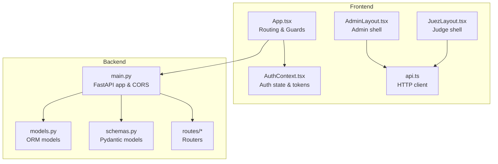
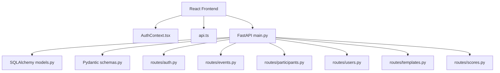
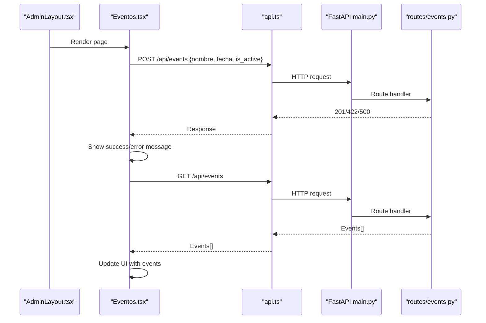
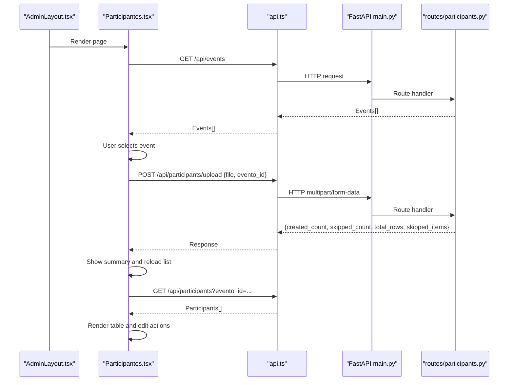
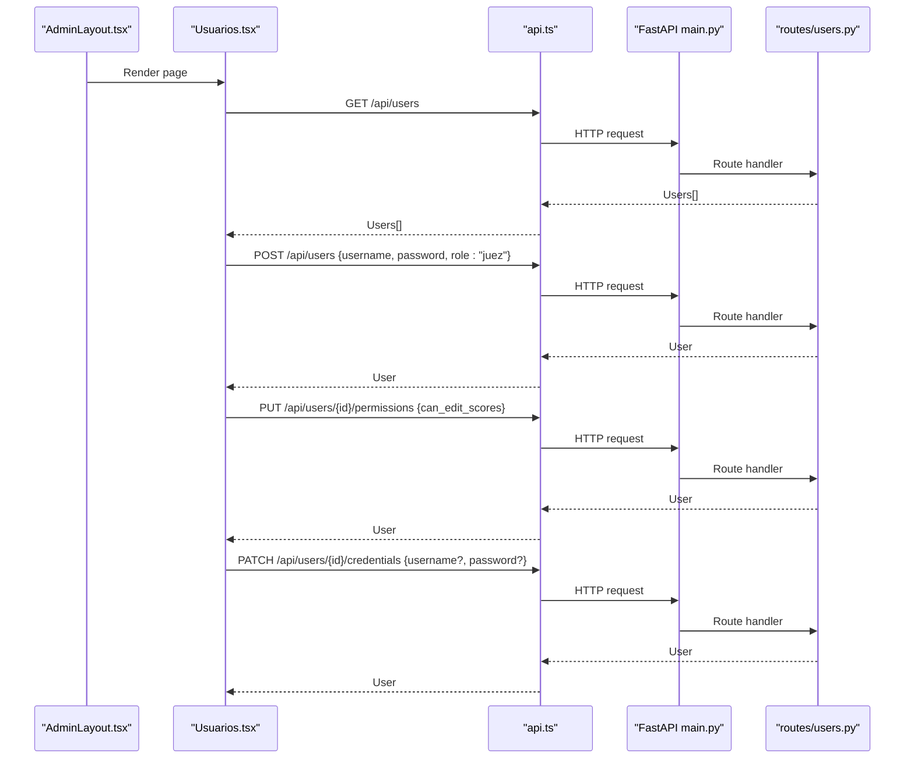
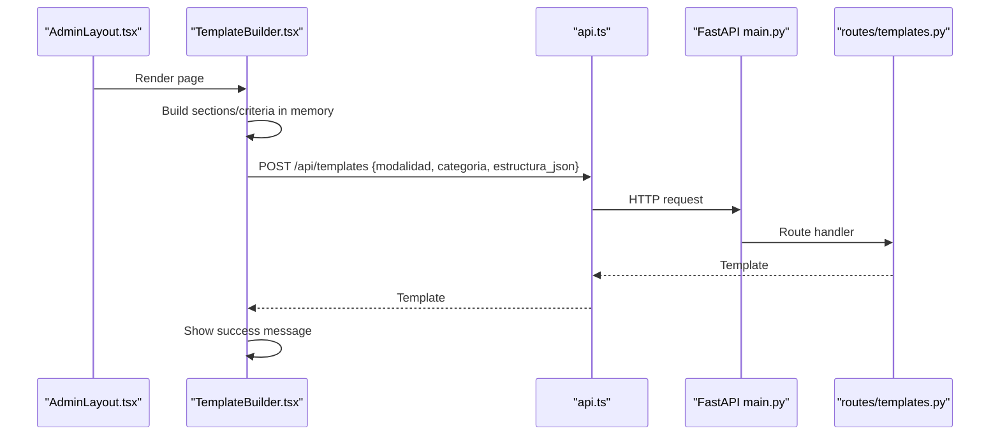
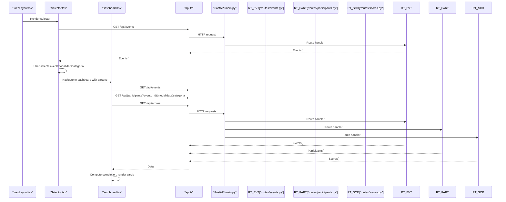
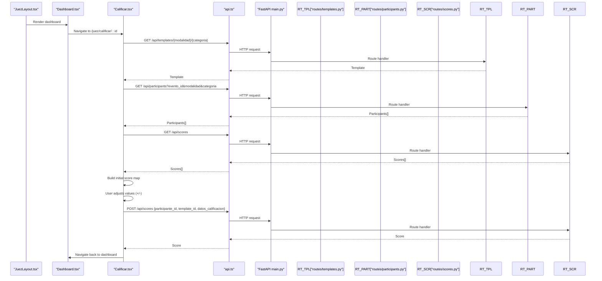
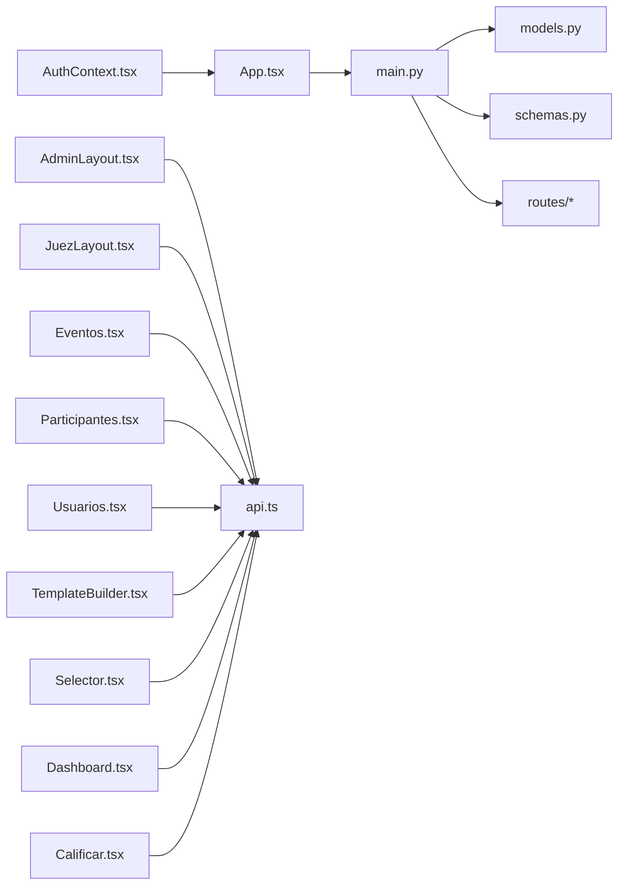

# Feature Implementation Guides

<cite>
**Referenced Files in This Document**
- [App.tsx](file://frontend/src/App.tsx)
- [AuthContext.tsx](file://frontend/src/contexts/AuthContext.tsx)
- [AdminLayout.tsx](file://frontend/src/pages/admin/AdminLayout.tsx)
- [Eventos.tsx](file://frontend/src/pages/admin/Eventos.tsx)
- [Participantes.tsx](file://frontend/src/pages/admin/Participantes.tsx)
- [TemplateBuilder.tsx](file://frontend/src/pages/admin/TemplateBuilder.tsx)
- [Usuarios.tsx](file://frontend/src/pages/admin/Usuarios.tsx)
- [JuezLayout.tsx](file://frontend/src/pages/juez/JuezLayout.tsx)
- [Selector.tsx](file://frontend/src/pages/juez/Selector.tsx)
- [Dashboard.tsx](file://frontend/src/pages/juez/Dashboard.tsx)
- [Calificar.tsx](file://frontend/src/pages/juez/Calificar.tsx)
- [judging.ts](file://frontend/src/lib/judging.ts)
- [api.ts](file://frontend/src/lib/api.ts)
- [main.py](file://main.py)
- [models.py](file://models.py)
- [schemas.py](file://schemas.py)
- [routes/auth.py](file://routes/auth.py)
- [routes/events.py](file://routes/events.py)
- [routes/participants.py](file://routes/participants.py)
- [routes/scores.py](file://routes/scores.py)
- [routes/templates.py](file://routes/templates.py)
- [routes/users.py](file://routes/users.py)
</cite>

## Table of Contents
1. [Introduction](#introduction)
2. [Project Structure](#project-structure)
3. [Core Components](#core-components)
4. [Architecture Overview](#architecture-overview)
5. [Detailed Component Analysis](#detailed-component-analysis)
6. [Dependency Analysis](#dependency-analysis)
7. [Performance Considerations](#performance-considerations)
8. [Troubleshooting Guide](#troubleshooting-guide)
9. [Conclusion](#conclusion)

## Introduction
This document provides feature implementation guides for the Juzgamiento application’s core functionalities. It covers administrator features (user management, event creation, participant import via Excel, and template building) and judge features (participant selection, real-time scoring interface, score submission, and dashboard navigation). For each feature, we explain implementation details, component interactions, data flow, configuration options, validation rules, error handling, backend API integrations, state management, and user experience considerations. Step-by-step usage instructions and common workflows are included, along with troubleshooting guidance.

## Project Structure
The application follows a clear separation between frontend and backend:
- Frontend: React SPA with TypeScript, routing, protected layouts, and context-based authentication.
- Backend: FastAPI server with SQLAlchemy ORM, Pydantic models, and modular route handlers.

**Diagram sources**
- [App.tsx:91-118](file://frontend/src/App.tsx#L91-L118)
- [AuthContext.tsx:66-131](file://frontend/src/contexts/AuthContext.tsx#L66-L131)
- [AdminLayout.tsx:22-168](file://frontend/src/pages/admin/AdminLayout.tsx#L22-L168)
- [JuezLayout.tsx:6-47](file://frontend/src/pages/juez/JuezLayout.tsx#L6-L47)
- [api.ts](file://frontend/src/lib/api.ts)
- [main.py:1-38](file://main.py#L1-L38)
- [models.py:11-95](file://models.py#L11-L95)
- [schemas.py:1-152](file://schemas.py#L1-L152)
- [routes/auth.py](file://routes/auth.py)
- [routes/events.py](file://routes/events.py)
- [routes/participants.py](file://routes/participants.py)
- [routes/scores.py](file://routes/scores.py)
- [routes/templates.py](file://routes/templates.py)
- [routes/users.py](file://routes/users.py)

**Section sources**
- [App.tsx:91-118](file://frontend/src/App.tsx#L91-L118)
- [main.py:1-38](file://main.py#L1-L38)

## Core Components
- Authentication and routing:
  - Protected routes enforce role-based access.
  - AuthContext stores JWT tokens, hydrates user info from token payload, persists session in localStorage, and exposes login/logout.
- Administrator features:
  - Event creation and activation toggling.
  - Participant import via Excel upload and manual registration with category combinations.
  - User management for judges (create, toggle permissions, update credentials).
  - Template builder for dynamic scoring forms.
- Judge features:
  - Selection of event, modalidad, and categoria.
  - Dashboard showing filtered participants and completion status.
  - Real-time scoring interface with increment/decrement controls and total computation.
  - Submission of scores bound to template structure.

**Section sources**
- [AuthContext.tsx:66-131](file://frontend/src/contexts/AuthContext.tsx#L66-L131)
- [App.tsx:52-69](file://frontend/src/App.tsx#L52-L69)
- [Eventos.tsx:28-195](file://frontend/src/pages/admin/Eventos.tsx#L28-L195)
- [Participantes.tsx:74-693](file://frontend/src/pages/admin/Participantes.tsx#L74-L693)
- [Usuarios.tsx:15-402](file://frontend/src/pages/admin/Usuarios.tsx#L15-L402)
- [TemplateBuilder.tsx:47-345](file://frontend/src/pages/admin/TemplateBuilder.tsx#L47-L345)
- [Selector.tsx:24-203](file://frontend/src/pages/juez/Selector.tsx#L24-L203)
- [Dashboard.tsx:13-271](file://frontend/src/pages/juez/Dashboard.tsx#L13-L271)
- [Calificar.tsx:79-398](file://frontend/src/pages/juez/Calificar.tsx#L79-L398)
- [judging.ts:1-64](file://frontend/src/lib/judging.ts#L1-L64)

## Architecture Overview
High-level architecture and data flow:
- Frontend components call backend APIs via a shared HTTP client configured with Authorization headers.
- Backend FastAPI app initializes CORS, includes routers, and serves endpoints for auth, events, participants, users, templates, and scores.
- SQLAlchemy models define the schema; Pydantic schemas validate requests/responses.

**Diagram sources**
- [main.py:1-38](file://main.py#L1-L38)
- [models.py:11-95](file://models.py#L11-L95)
- [schemas.py:1-152](file://schemas.py#L1-L152)
- [routes/auth.py](file://routes/auth.py)
- [routes/events.py](file://routes/events.py)
- [routes/participants.py](file://routes/participants.py)
- [routes/users.py](file://routes/users.py)
- [routes/templates.py](file://routes/templates.py)
- [routes/scores.py](file://routes/scores.py)

## Detailed Component Analysis

### Administrator Features

#### Event Creation and Management
- Create events with name, date, and default active state.
- Toggle active state per event.
- Edit event metadata (name, date, active flag).
- Load and refresh event lists.

Implementation highlights:
- Uses GET/POST/PATCH endpoints under /api/events.
- Validation enforced by backend schemas.
- Frontend displays success/error messages and updates local state.

**Diagram sources**
- [Eventos.tsx:53-195](file://frontend/src/pages/admin/Eventos.tsx#L53-L195)
- [api.ts](file://frontend/src/lib/api.ts)
- [main.py:27-32](file://main.py#L27-L32)
- [routes/events.py](file://routes/events.py)

**Section sources**
- [Eventos.tsx:28-195](file://frontend/src/pages/admin/Eventos.tsx#L28-L195)
- [schemas.py:47-66](file://schemas.py#L47-L66)

#### Participant Import (Excel) and Manual Registration
- Select active event context.
- Upload .xlsx/.csv for bulk import; backend processes rows and returns counts and skipped reasons.
- Manual registration supports multiple modalidad/categoria assignments per participant.
- Edit participant records inline with validation.

**Diagram sources**
- [Participantes.tsx:104-187](file://frontend/src/pages/admin/Participantes.tsx#L104-L187)
- [api.ts](file://frontend/src/lib/api.ts)
- [main.py:27-32](file://main.py#L27-L32)
- [routes/participants.py](file://routes/participants.py)

Validation and error handling:
- Frontend validates presence of event and file before upload.
- Skipped items reported with row and reason.
- Inline edits validate required fields and trim values.

**Section sources**
- [Participantes.tsx:74-693](file://frontend/src/pages/admin/Participantes.tsx#L74-L693)
- [schemas.py:84-116](file://schemas.py#L84-L116)

#### User Management (Judges)
- Create judge accounts with username/password and role=juez.
- Toggle permission to edit scores (can_edit_scores).
- Update judge credentials (username/password).

**Diagram sources**
- [Usuarios.tsx:39-180](file://frontend/src/pages/admin/Usuarios.tsx#L39-L180)
- [api.ts](file://frontend/src/lib/api.ts)
- [main.py:27-32](file://main.py#L27-L32)
- [routes/users.py](file://routes/users.py)

**Section sources**
- [Usuarios.tsx:15-402](file://frontend/src/pages/admin/Usuarios.tsx#L15-L402)
- [schemas.py:22-45](file://schemas.py#L22-L45)

#### Template Building (Dynamic Scoring Forms)
- Define modalidad and categoria.
- Build sections and criteria with max points.
- Save template; preview JSON structure.

**Diagram sources**
- [TemplateBuilder.tsx:142-190](file://frontend/src/pages/admin/TemplateBuilder.tsx#L142-L190)
- [api.ts](file://frontend/src/lib/api.ts)
- [main.py:27-32](file://main.py#L27-L32)
- [routes/templates.py](file://routes/templates.py)

**Section sources**
- [TemplateBuilder.tsx:47-345](file://frontend/src/pages/admin/TemplateBuilder.tsx#L47-L345)
- [schemas.py:118-131](file://schemas.py#L118-L131)

### Judge Features

#### Participant Selection and Dashboard Navigation
- Judges select active event, modalidad, and categoria.
- Navigate to dashboard filtered by selections.
- View progress of completed vs total participants.

**Diagram sources**
- [Selector.tsx:24-93](file://frontend/src/pages/juez/Selector.tsx#L24-L93)
- [Dashboard.tsx:33-95](file://frontend/src/pages/juez/Dashboard.tsx#L33-L95)
- [api.ts](file://frontend/src/lib/api.ts)
- [main.py:27-32](file://main.py#L27-L32)
- [routes/events.py](file://routes/events.py)
- [routes/participants.py](file://routes/participants.py)
- [routes/scores.py](file://routes/scores.py)

**Section sources**
- [Selector.tsx:24-203](file://frontend/src/pages/juez/Selector.tsx#L24-L203)
- [Dashboard.tsx:13-271](file://frontend/src/pages/juez/Dashboard.tsx#L13-L271)
- [judging.ts:18-63](file://frontend/src/lib/judging.ts#L18-L63)

#### Real-Time Scoring Interface and Score Submission
- Load template by modalidad/categoria.
- Initialize score map from existing data if present.
- Increment/decrement per criterion with bounds.
- Submit score payload structured per template.

**Diagram sources**
- [Calificar.tsx:106-241](file://frontend/src/pages/juez/Calificar.tsx#L106-L241)
- [api.ts](file://frontend/src/lib/api.ts)
- [main.py:27-32](file://main.py#L27-L32)
- [routes/templates.py](file://routes/templates.py)
- [routes/participants.py](file://routes/participants.py)
- [routes/scores.py](file://routes/scores.py)

**Section sources**
- [Calificar.tsx:79-398](file://frontend/src/pages/juez/Calificar.tsx#L79-L398)
- [judging.ts:48-63](file://frontend/src/lib/judging.ts#L48-L63)

## Dependency Analysis
- Frontend dependencies:
  - Routing and guards depend on AuthContext for user state.
  - Pages depend on api.ts for HTTP calls and on backend routes for data.
- Backend dependencies:
  - FastAPI app includes routers and sets up CORS.
  - Routers depend on models and schemas for ORM and validation.

**Diagram sources**
- [App.tsx:91-118](file://frontend/src/App.tsx#L91-L118)
- [AuthContext.tsx:66-131](file://frontend/src/contexts/AuthContext.tsx#L66-L131)
- [AdminLayout.tsx:22-168](file://frontend/src/pages/admin/AdminLayout.tsx#L22-L168)
- [JuezLayout.tsx:6-47](file://frontend/src/pages/juez/JuezLayout.tsx#L6-L47)
- [Eventos.tsx:28-195](file://frontend/src/pages/admin/Eventos.tsx#L28-L195)
- [Participantes.tsx:74-693](file://frontend/src/pages/admin/Participantes.tsx#L74-L693)
- [Usuarios.tsx:15-402](file://frontend/src/pages/admin/Usuarios.tsx#L15-L402)
- [TemplateBuilder.tsx:47-345](file://frontend/src/pages/admin/TemplateBuilder.tsx#L47-L345)
- [Selector.tsx:24-203](file://frontend/src/pages/juez/Selector.tsx#L24-L203)
- [Dashboard.tsx:13-271](file://frontend/src/pages/juez/Dashboard.tsx#L13-L271)
- [Calificar.tsx:79-398](file://frontend/src/pages/juez/Calificar.tsx#L79-L398)
- [api.ts](file://frontend/src/lib/api.ts)
- [main.py:1-38](file://main.py#L1-L38)
- [models.py:11-95](file://models.py#L11-L95)
- [schemas.py:1-152](file://schemas.py#L1-L152)
- [routes/auth.py](file://routes/auth.py)
- [routes/events.py](file://routes/events.py)
- [routes/participants.py](file://routes/participants.py)
- [routes/scores.py](file://routes/scores.py)
- [routes/templates.py](file://routes/templates.py)
- [routes/users.py](file://routes/users.py)

**Section sources**
- [App.tsx:91-118](file://frontend/src/App.tsx#L91-L118)
- [main.py:1-38](file://main.py#L1-L38)

## Performance Considerations
- Parallelize initial loads on judge dashboard and evaluation page to reduce perceived latency.
- Debounce or batch UI updates for score adjustments to avoid excessive re-renders.
- Use optimistic updates for score submission and reconcile on failure.
- Persist minimal state in localStorage for auth tokens and avoid heavy payloads.

## Troubleshooting Guide
Common issues and resolutions:
- Authentication failures:
  - Verify token presence and validity; check token parsing and localStorage hydration.
  - Ensure Authorization header is attached to all protected requests.
- Network errors:
  - Confirm backend health endpoint responds and CORS allows frontend origin.
  - Inspect network tab for 4xx/5xx responses and error messages returned by API.
- Event/context not selected:
  - Administrators must select an active event before importing participants.
  - Judges must select event, modalidad, and categoria before accessing dashboard.
- Validation errors:
  - Event creation requires non-empty name and valid date.
  - Participant manual form requires name, brand/model, plate, modalidad, and categoria.
  - Template save requires modalidad/categoria and non-empty sections/criteria with positive max points.
- Score submission:
  - Ensure template matches selected modalidad/categoria.
  - Confirm participant belongs to the chosen event and filters.

**Section sources**
- [AuthContext.tsx:66-131](file://frontend/src/contexts/AuthContext.tsx#L66-L131)
- [Eventos.tsx:161-195](file://frontend/src/pages/admin/Eventos.tsx#L161-L195)
- [Participantes.tsx:227-271](file://frontend/src/pages/admin/Participantes.tsx#L227-L271)
- [TemplateBuilder.tsx:142-190](file://frontend/src/pages/admin/TemplateBuilder.tsx#L142-L190)
- [Dashboard.tsx:33-95](file://frontend/src/pages/juez/Dashboard.tsx#L33-L95)
- [Calificar.tsx:106-241](file://frontend/src/pages/juez/Calificar.tsx#L106-L241)
- [main.py:19-25](file://main.py#L19-L25)

## Conclusion
The Juzgamiento application provides a robust, role-separated interface for administrators and judges. Administrators manage events, participants, users, and scoring templates; judges navigate filtered participant lists, apply dynamic scoring templates, and submit scores efficiently. The frontend leverages protected routing, centralized auth state, and a shared HTTP client, while the backend enforces validation via Pydantic and persists data with SQLAlchemy. Following the implementation guides and troubleshooting tips ensures reliable operation across all core features.