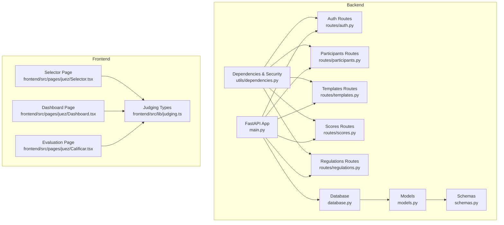
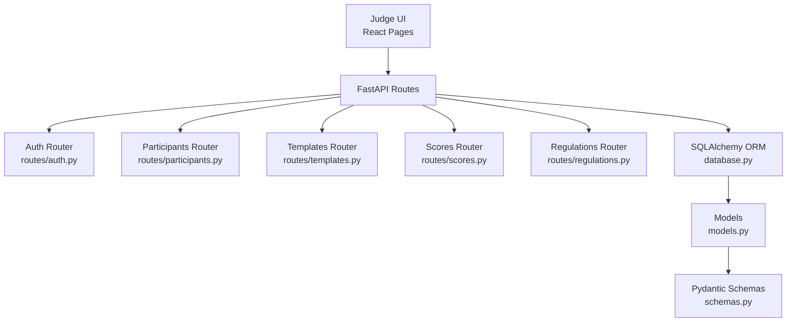
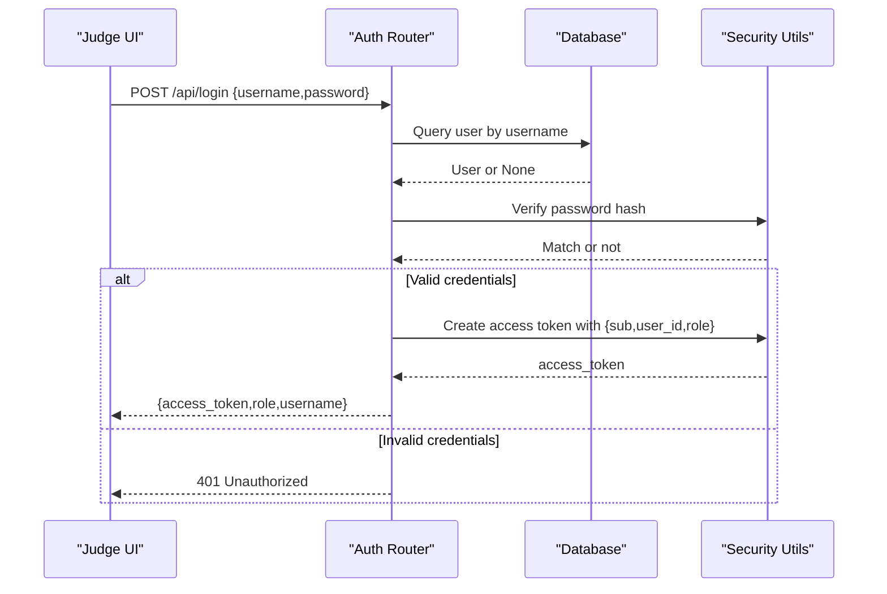
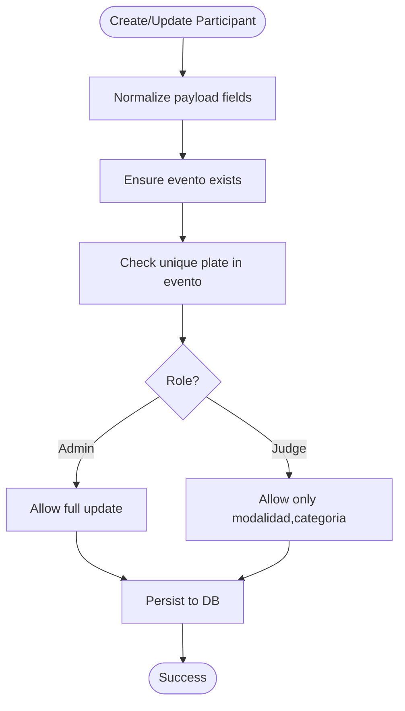
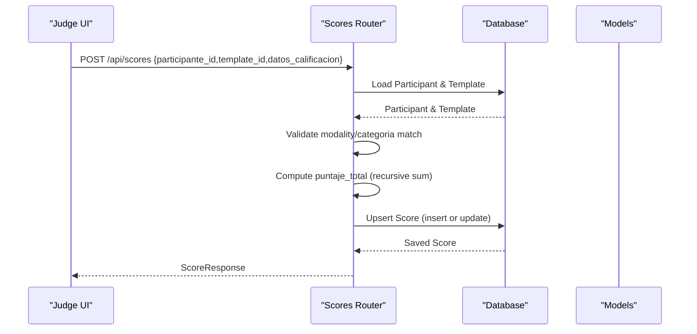
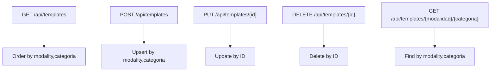
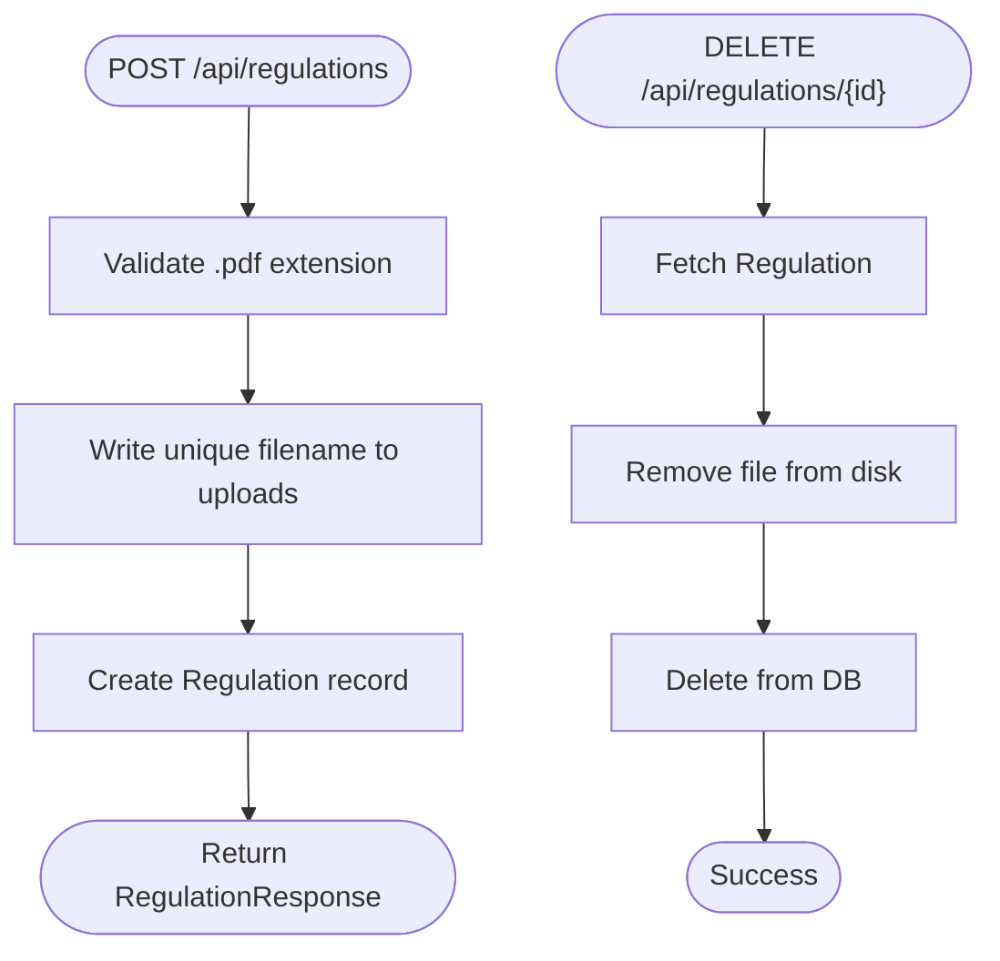
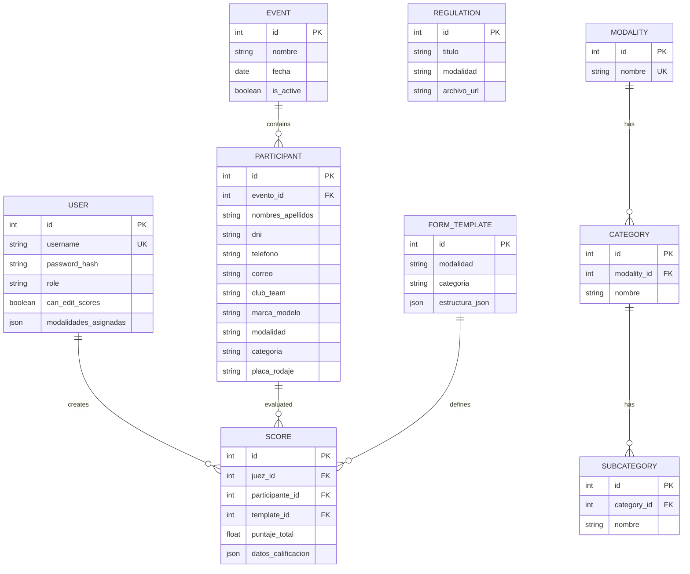
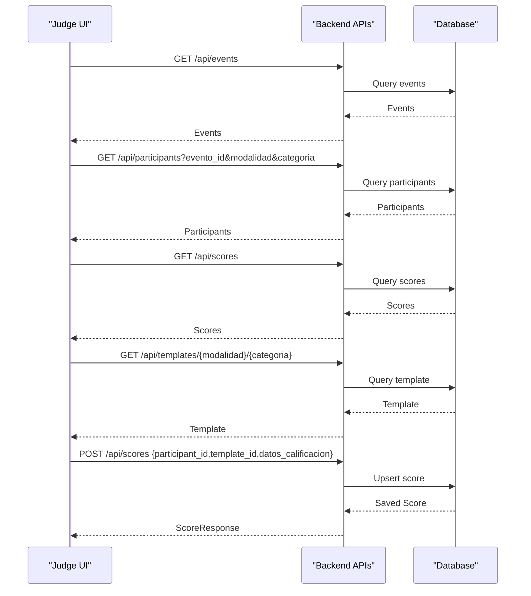
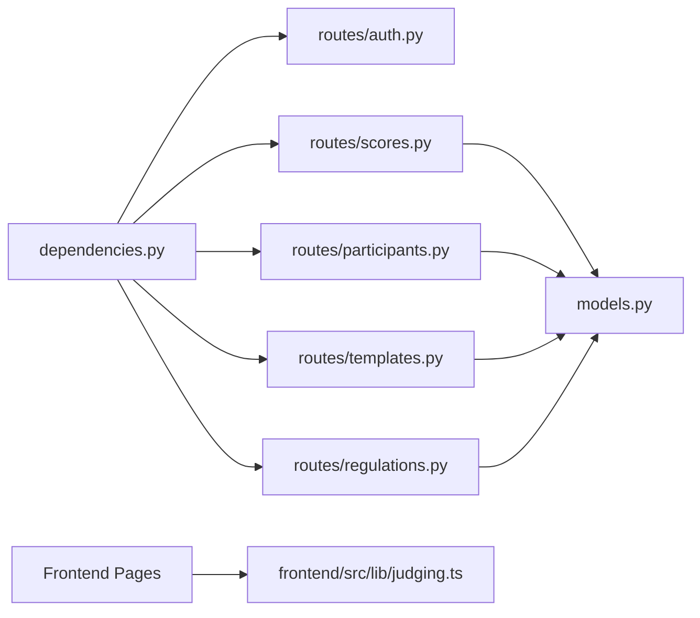

# Judge Features

<cite>
**Referenced Files in This Document**
- [main.py](file://main.py)
- [models.py](file://models.py)
- [schemas.py](file://schemas.py)
- [database.py](file://database.py)
- [routes/auth.py](file://routes/auth.py)
- [routes/scores.py](file://routes/scores.py)
- [routes/participants.py](file://routes/participants.py)
- [routes/templates.py](file://routes/templates.py)
- [routes/regulations.py](file://routes/regulations.py)
- [utils/dependencies.py](file://utils/dependencies.py)
- [frontend/src/pages/juez/Selector.tsx](file://frontend/src/pages/juez/Selector.tsx)
- [frontend/src/pages/juez/Dashboard.tsx](file://frontend/src/pages/juez/Dashboard.tsx)
- [frontend/src/pages/juez/Calificar.tsx](file://frontend/src/pages/juez/Calificar.tsx)
- [frontend/src/lib/judging.ts](file://frontend/src/lib/judging.ts)
</cite>

## Table of Contents
1. [Introduction](#introduction)
2. [Project Structure](#project-structure)
3. [Core Components](#core-components)
4. [Architecture Overview](#architecture-overview)
5. [Detailed Component Analysis](#detailed-component-analysis)
6. [Dependency Analysis](#dependency-analysis)
7. [Performance Considerations](#performance-considerations)
8. [Troubleshooting Guide](#troubleshooting-guide)
9. [Conclusion](#conclusion)

## Introduction
This document describes the Judge Features implementation for the "Juzgamiento Car Audio y Tuning" competition scoring system. It covers the backend API built with FastAPI and SQLAlchemy, the database schema for events, participants, judges, scoring templates, and scores, and the frontend judge interface that enables authorized judges to evaluate participants according to standardized templates.

The judge workflow consists of three main steps:
- Selection: Choose an active event, modality, and category.
- Dashboard: View filtered participants and track completion status.
- Evaluation: Open a participant's evaluation form, enter scores per criterion, and submit.

Administrative features include managing scoring templates and regulations, while the judge role is restricted to evaluation tasks and limited participant updates.

## Project Structure
The project follows a clear separation of concerns:
- Backend: FastAPI application with modular route handlers for auth, participants, templates, scores, and regulations.
- Database: SQLAlchemy declarative models with automatic migrations for participant table evolution.
- Frontend: React-based judge interface with TypeScript types for judging data.

**Diagram sources**
- [main.py:1-53](file://main.py#L1-L53)
- [database.py:1-93](file://database.py#L1-L93)
- [models.py:1-153](file://models.py#L1-L153)
- [schemas.py:1-202](file://schemas.py#L1-L202)
- [routes/auth.py:1-36](file://routes/auth.py#L1-L36)
- [routes/participants.py:1-430](file://routes/participants.py#L1-L430)
- [routes/templates.py:1-134](file://routes/templates.py#L1-L134)
- [routes/scores.py:1-132](file://routes/scores.py#L1-L132)
- [routes/regulations.py:1-110](file://routes/regulations.py#L1-L110)
- [utils/dependencies.py:1-71](file://utils/dependencies.py#L1-L71)
- [frontend/src/pages/juez/Selector.tsx:1-236](file://frontend/src/pages/juez/Selector.tsx#L1-L236)
- [frontend/src/pages/juez/Dashboard.tsx:1-416](file://frontend/src/pages/juez/Dashboard.tsx#L1-L416)
- [frontend/src/pages/juez/Calificar.tsx:1-398](file://frontend/src/pages/juez/Calificar.tsx#L1-L398)
- [frontend/src/lib/judging.ts:1-64](file://frontend/src/lib/judging.ts#L1-L64)

**Section sources**
- [main.py:1-53](file://main.py#L1-L53)
- [database.py:1-93](file://database.py#L1-L93)
- [models.py:1-153](file://models.py#L1-L153)
- [schemas.py:1-202](file://schemas.py#L1-L202)
- [routes/auth.py:1-36](file://routes/auth.py#L1-L36)
- [routes/participants.py:1-430](file://routes/participants.py#L1-L430)
- [routes/templates.py:1-134](file://routes/templates.py#L1-L134)
- [routes/scores.py:1-132](file://routes/scores.py#L1-L132)
- [routes/regulations.py:1-110](file://routes/regulations.py#L1-L110)
- [utils/dependencies.py:1-71](file://utils/dependencies.py#L1-L71)
- [frontend/src/pages/juez/Selector.tsx:1-236](file://frontend/src/pages/juez/Selector.tsx#L1-L236)
- [frontend/src/pages/juez/Dashboard.tsx:1-416](file://frontend/src/pages/juez/Dashboard.tsx#L1-L416)
- [frontend/src/pages/juez/Calificar.tsx:1-398](file://frontend/src/pages/juez/Calificar.tsx#L1-L398)
- [frontend/src/lib/judging.ts:1-64](file://frontend/src/lib/judging.ts#L1-L64)

## Core Components
- Authentication and Authorization: Login endpoint validates credentials and issues bearer tokens. Route guards enforce roles (admin/juez).
- Participants Management: CRUD operations with Excel upload support, uniqueness checks by plate per event, and selective updates for judges.
- Scoring System: Dynamic templates define sections and criteria with maximum points. Scores are computed as numeric sums of submitted values and stored with metadata.
- Templates: Create/update/delete templates keyed by modality and category; retrieval by ID or by modality/category combination.
- Regulations: PDF upload and listing by modality with file cleanup on deletion.
- Database Layer: SQLite with automatic migrations for participant table evolution and unique constraints.

**Section sources**
- [routes/auth.py:13-35](file://routes/auth.py#L13-L35)
- [utils/dependencies.py:32-47](file://utils/dependencies.py#L32-L47)
- [routes/participants.py:181-242](file://routes/participants.py#L181-L242)
- [routes/participants.py:316-429](file://routes/participants.py#L316-L429)
- [routes/scores.py:43-114](file://routes/scores.py#L43-L114)
- [routes/templates.py:26-53](file://routes/templates.py#L26-L53)
- [routes/templates.py:113-133](file://routes/templates.py#L113-L133)
- [routes/regulations.py:20-64](file://routes/regulations.py#L20-L64)
- [database.py:36-93](file://database.py#L36-L93)

## Architecture Overview
The system uses a layered architecture:
- Presentation: React judge pages communicate via REST endpoints.
- Application: FastAPI routes orchestrate business logic and enforce permissions.
- Persistence: SQLAlchemy ORM maps models to SQLite tables with migrations.

**Diagram sources**
- [main.py:36-44](file://main.py#L36-L44)
- [routes/auth.py:10-35](file://routes/auth.py#L10-L35)
- [routes/participants.py:21-429](file://routes/participants.py#L21-L429)
- [routes/templates.py:10-133](file://routes/templates.py#L10-L133)
- [routes/scores.py:13-114](file://routes/scores.py#L13-L114)
- [routes/regulations.py:15-109](file://routes/regulations.py#L15-L109)
- [database.py:15-34](file://database.py#L15-L34)
- [models.py:11-153](file://models.py#L11-L153)
- [schemas.py:10-202](file://schemas.py#L10-L202)

## Detailed Component Analysis

### Authentication and Authorization
- Login endpoint accepts username/password and returns a bearer token containing user identity and role.
- Route dependencies enforce role-based access:
  - Admin-only endpoints require "admin" role.
  - Judge-only endpoints require "juez" role.
- Token validation decodes JWT claims and loads the user from the database.

**Diagram sources**
- [routes/auth.py:13-35](file://routes/auth.py#L13-L35)
- [utils/dependencies.py:50-70](file://utils/dependencies.py#L50-L70)

**Section sources**
- [routes/auth.py:13-35](file://routes/auth.py#L13-L35)
- [utils/dependencies.py:32-47](file://utils/dependencies.py#L32-L47)
- [utils/dependencies.py:50-70](file://utils/dependencies.py#L50-L70)

### Participants Management
- Create/update/delete participants with validation and uniqueness enforcement by plate within an event.
- Judge role can update only modalidad and categoria; admin can update all fields and change evento_id.
- Excel upload supports flexible column naming with normalization and deduplication by plate.
- Name update endpoint allows administrative renaming.

**Diagram sources**
- [routes/participants.py:181-242](file://routes/participants.py#L181-L242)
- [routes/participants.py:202-242](file://routes/participants.py#L202-L242)
- [routes/participants.py:160-179](file://routes/participants.py#L160-L179)

**Section sources**
- [routes/participants.py:181-242](file://routes/participants.py#L181-L242)
- [routes/participants.py:202-242](file://routes/participants.py#L202-L242)
- [routes/participants.py:316-429](file://routes/participants.py#L316-L429)

### Scoring System
- Templates define structured evaluation forms with sections and criteria, each having a maximum point value.
- Judge submits scores for a participant using the matching template; the backend computes a total by summing numeric values recursively.
- If a score already exists and the judge lacks permission to edit, submission is rejected.
- Listing scores respects role: admins see all, judges see only their own.

**Diagram sources**
- [routes/scores.py:43-114](file://routes/scores.py#L43-L114)
- [models.py:86-101](file://models.py#L86-L101)

**Section sources**
- [routes/scores.py:43-114](file://routes/scores.py#L43-L114)
- [routes/scores.py:117-131](file://routes/scores.py#L117-L131)
- [models.py:86-101](file://models.py#L86-L101)

### Templates Management
- Retrieve all templates ordered by modality and category.
- Create or update templates keyed by modality and category.
- Delete templates and fetch by ID or by modality/categoria pair.

**Diagram sources**
- [routes/templates.py:13-23](file://routes/templates.py#L13-L23)
- [routes/templates.py:26-53](file://routes/templates.py#L26-L53)
- [routes/templates.py:71-91](file://routes/templates.py#L71-L91)
- [routes/templates.py:94-110](file://routes/templates.py#L94-L110)
- [routes/templates.py:113-133](file://routes/templates.py#L113-L133)

**Section sources**
- [routes/templates.py:13-23](file://routes/templates.py#L13-L23)
- [routes/templates.py:26-53](file://routes/templates.py#L26-L53)
- [routes/templates.py:71-91](file://routes/templates.py#L71-L91)
- [routes/templates.py:113-133](file://routes/templates.py#L113-L133)

### Regulations Management
- Upload PDFs with unique filenames and store references in the database.
- List regulations optionally filtered by modality.
- Delete regulations and remove associated files.

**Diagram sources**
- [routes/regulations.py:20-64](file://routes/regulations.py#L20-L64)
- [routes/regulations.py:82-109](file://routes/regulations.py#L82-L109)

**Section sources**
- [routes/regulations.py:20-64](file://routes/regulations.py#L20-L64)
- [routes/regulations.py:67-79](file://routes/regulations.py#L67-L79)
- [routes/regulations.py:82-109](file://routes/regulations.py#L82-L109)

### Database Schema and Migrations
- Core entities: User, Event, Participant, FormTemplate, Score, Regulation, Modality, Category, Subcategory.
- Unique constraints ensure template uniqueness by modality/categoria and participant uniqueness by evento_id/placa_rodaje.
- Automatic migrations add new participant columns and backfill legacy fields.

**Diagram sources**
- [models.py:11-153](file://models.py#L11-L153)

**Section sources**
- [models.py:11-153](file://models.py#L11-L153)
- [database.py:36-93](file://database.py#L36-L93)

### Frontend Judge Interface
- Selector page: Chooses active event, modality, and category; navigates to dashboard.
- Dashboard page: Lists filtered participants, shows completion status, and supports recategorization.
- Evaluation page: Loads template by modality/categoria, renders criteria with +/- controls, computes totals, and saves scores.

**Diagram sources**
- [frontend/src/pages/juez/Selector.tsx:67-88](file://frontend/src/pages/juez/Selector.tsx#L67-L88)
- [frontend/src/pages/juez/Dashboard.tsx:66-119](file://frontend/src/pages/juez/Dashboard.tsx#L66-L119)
- [frontend/src/pages/juez/Calificar.tsx:121-176](file://frontend/src/pages/juez/Calificar.tsx#L121-L176)
- [routes/participants.py:289-313](file://routes/participants.py#L289-L313)
- [routes/scores.py:43-114](file://routes/scores.py#L43-L114)
- [routes/templates.py:113-133](file://routes/templates.py#L113-L133)

**Section sources**
- [frontend/src/pages/juez/Selector.tsx:36-105](file://frontend/src/pages/juez/Selector.tsx#L36-L105)
- [frontend/src/pages/juez/Dashboard.tsx:23-119](file://frontend/src/pages/juez/Dashboard.tsx#L23-L119)
- [frontend/src/pages/juez/Calificar.tsx:79-185](file://frontend/src/pages/juez/Calificar.tsx#L79-L185)
- [frontend/src/lib/judging.ts:18-63](file://frontend/src/lib/judging.ts#L18-L63)

## Dependency Analysis
- Route dependencies rely on database sessions and token decoding to enforce role-based access.
- Scores route depends on template matching and numeric aggregation logic.
- Participants route depends on Excel parsing utilities and unique constraint validation.
- Frontend pages depend on shared judging types and API client utilities.

**Diagram sources**
- [utils/dependencies.py:16-70](file://utils/dependencies.py#L16-L70)
- [routes/auth.py:13-35](file://routes/auth.py#L13-L35)
- [routes/participants.py:181-242](file://routes/participants.py#L181-L242)
- [routes/templates.py:26-53](file://routes/templates.py#L26-L53)
- [routes/scores.py:43-114](file://routes/scores.py#L43-L114)
- [routes/regulations.py:20-64](file://routes/regulations.py#L20-L64)
- [models.py:11-153](file://models.py#L11-L153)
- [frontend/src/lib/judging.ts:18-63](file://frontend/src/lib/judging.ts#L18-L63)

**Section sources**
- [utils/dependencies.py:16-70](file://utils/dependencies.py#L16-L70)
- [routes/scores.py:43-114](file://routes/scores.py#L43-L114)
- [routes/participants.py:181-242](file://routes/participants.py#L181-L242)
- [routes/templates.py:26-53](file://routes/templates.py#L26-L53)
- [routes/regulations.py:20-64](file://routes/regulations.py#L20-L64)
- [models.py:11-153](file://models.py#L11-L153)
- [frontend/src/lib/judging.ts:18-63](file://frontend/src/lib/judging.ts#L18-L63)

## Performance Considerations
- Database queries use joined loading for score listings to reduce N+1 selects.
- Bulk insert is used during Excel upload to minimize round-trips.
- Unique constraints and indexes prevent duplicate plates and speed up lookups.
- Numeric aggregation is recursive to handle nested structures; keep template depth reasonable to avoid deep recursion overhead.

[No sources needed since this section provides general guidance]

## Troubleshooting Guide
Common issues and resolutions:
- Authentication failures: Verify username/password and token validity; check role requirements for protected endpoints.
- Participant creation conflicts: Ensure unique plate per evento_id; review uploaded Excel column mapping and required fields.
- Score submission errors: Confirm template matches participant's modality and category; ensure numeric values are provided.
- Template not found: Validate modality/categoria pair; confirm template exists for the selected combination.
- File upload errors: Confirm PDF extension and non-empty content; check uploads directory permissions.

**Section sources**
- [routes/auth.py:13-35](file://routes/auth.py#L13-L35)
- [routes/participants.py:160-179](file://routes/participants.py#L160-L179)
- [routes/participants.py:316-350](file://routes/participants.py#L316-L350)
- [routes/scores.py:49-67](file://routes/scores.py#L49-L67)
- [routes/templates.py:113-133](file://routes/templates.py#L113-L133)
- [routes/regulations.py:29-34](file://routes/regulations.py#L29-L34)

## Conclusion
The Judge Features provide a robust, role-aware evaluation system with standardized templates, secure authentication, and a streamlined judge interface. The backend ensures data integrity through unique constraints and migrations, while the frontend delivers an intuitive workflow for selecting events, reviewing participants, and capturing scores efficiently.

[No sources needed since this section summarizes without analyzing specific files]