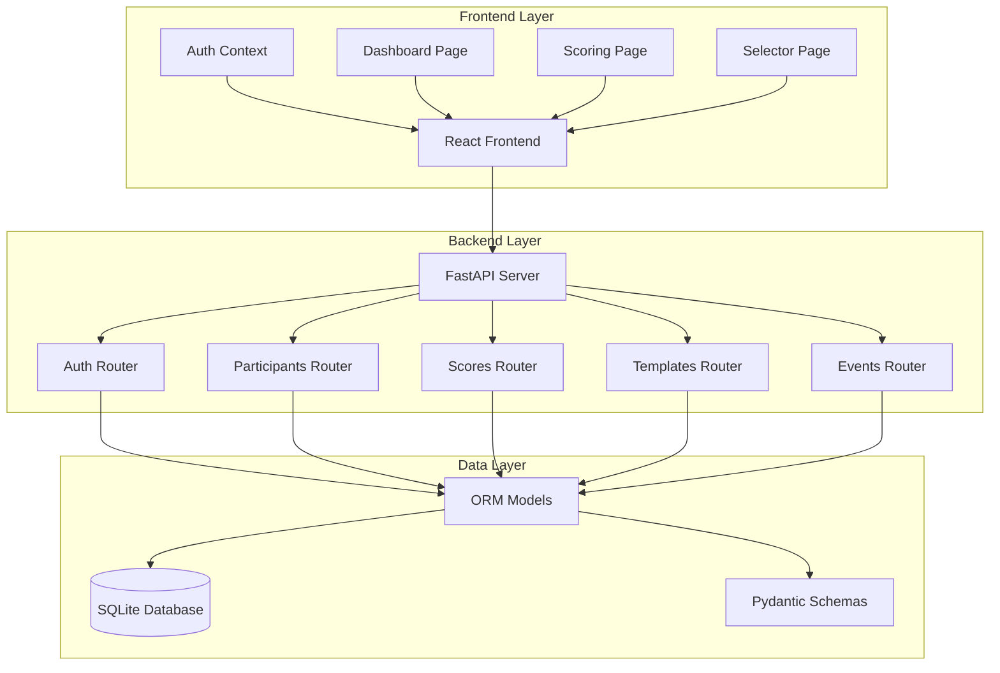
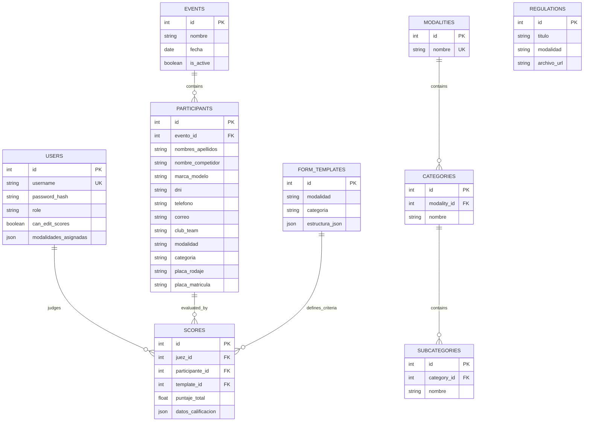
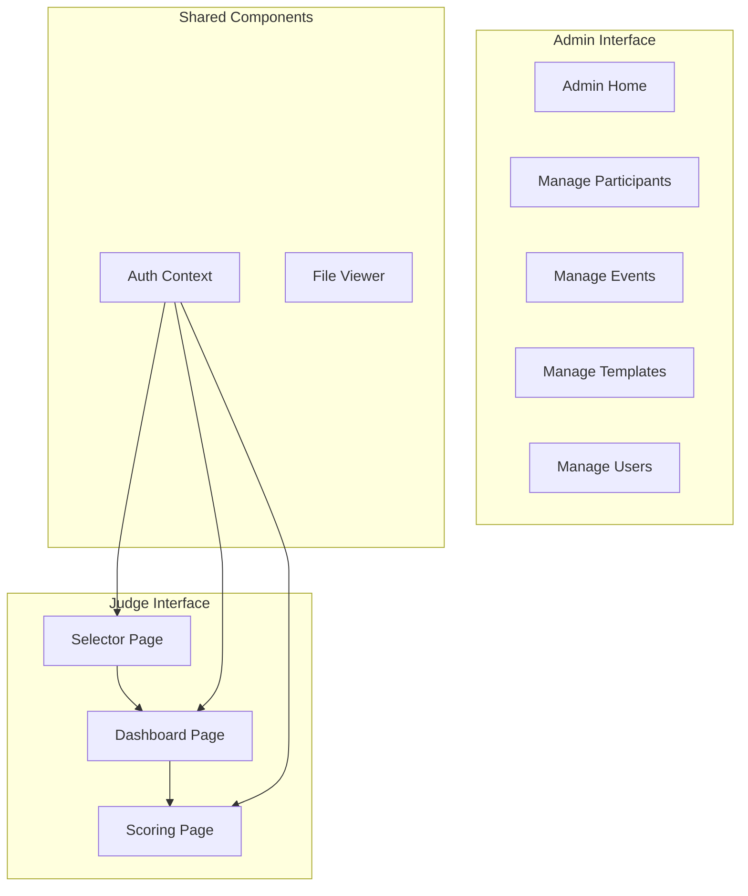
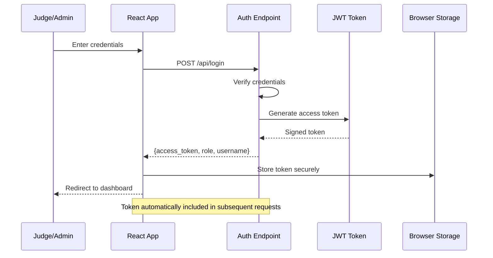
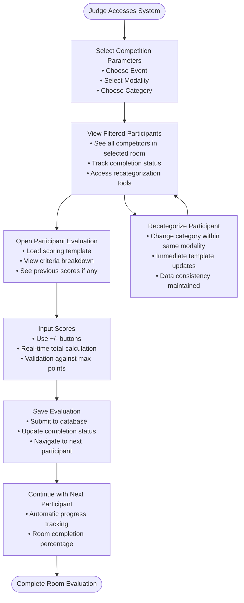
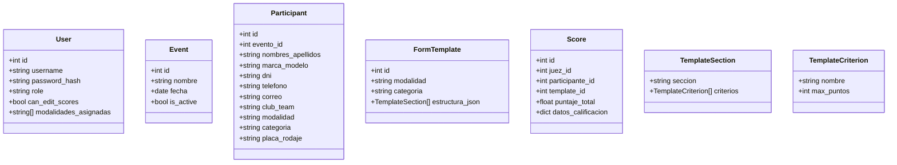

# Judge Dashboard

<cite>
**Referenced Files in This Document**
- [main.py](file://main.py)
- [models.py](file://models.py)
- [schemas.py](file://schemas.py)
- [database.py](file://database.py)
- [routes/auth.py](file://routes/auth.py)
- [routes/participants.py](file://routes/participants.py)
- [routes/scores.py](file://routes/scores.py)
- [routes/templates.py](file://routes/templates.py)
- [routes/events.py](file://routes/events.py)
- [frontend/src/pages/juez/Dashboard.tsx](file://frontend/src/pages/juez/Dashboard.tsx)
- [frontend/src/pages/juez/Calificar.tsx](file://frontend/src/pages/juez/Calificar.tsx)
- [frontend/src/pages/juez/Selector.tsx](file://frontend/src/pages/juez/Selector.tsx)
- [frontend/src/lib/judging.ts](file://frontend/src/lib/judging.ts)
- [frontend/src/contexts/AuthContext.tsx](file://frontend/src/contexts/AuthContext.tsx)
</cite>

## Table of Contents
1. [Introduction](#introduction)
2. [System Architecture](#system-architecture)
3. [Core Components](#core-components)
4. [Database Schema](#database-schema)
5. [API Endpoints](#api-endpoints)
6. [Frontend Application](#frontend-application)
7. [Authentication Flow](#authentication-flow)
8. [Scoring Workflow](#scoring-workflow)
9. [Data Models](#data-models)
10. [Security Implementation](#security-implementation)
11. [Deployment and Setup](#deployment-and-setup)
12. [Troubleshooting Guide](#troubleshooting-guide)
13. [Conclusion](#conclusion)

## Introduction

The Judge Dashboard is a comprehensive web application designed for automotive competition scoring and management. Built with FastAPI backend and React frontend, it provides a streamlined solution for judges to evaluate participants in car audio and tuning competitions. The system supports multiple competition modalities (SPL, SQ, SQL, Street Show, Tuning) across various categories (Intro, Aficionado, Pro, Master, Street, Custom).

The application features a three-phase workflow: event selection, participant filtering, and individual scoring. It includes administrative capabilities for managing events, participants, and scoring templates, while providing judges with an intuitive interface for evaluating competitors.

## System Architecture

The Judge Dashboard follows a modern full-stack architecture with clear separation of concerns between the backend API and frontend application.



**Diagram sources**
- [main.py:26-44](file://main.py#L26-L44)
- [routes/auth.py:10](file://routes/auth.py#L10)
- [routes/participants.py:21](file://routes/participants.py#L21)
- [routes/scores.py:13](file://routes/scores.py#L13)
- [routes/templates.py:10](file://routes/templates.py#L10)
- [routes/events.py:10](file://routes/events.py#L10)

## Core Components

### Backend Services

The backend is built with FastAPI, providing automatic API documentation and type safety. The main application initializes database connections, sets up CORS middleware, and mounts static file serving for uploaded documents.

**Section sources**
- [main.py:1-53](file://main.py#L1-L53)

### Database Management

The system uses SQLAlchemy ORM with SQLite as the primary database. The database initialization includes automatic migration support for backward compatibility with existing participant data structures.

**Section sources**
- [database.py:1-93](file://database.py#L1-L93)

### Authentication System

A JWT-based authentication system manages user roles (admin and judge) with proper token validation and session persistence.

**Section sources**
- [routes/auth.py:13-36](file://routes/auth.py#L13-L36)
- [frontend/src/contexts/AuthContext.tsx:66-132](file://frontend/src/contexts/AuthContext.tsx#L66-L132)

## Database Schema

The application uses a relational database design with clear entity relationships supporting the competition scoring workflow.



**Diagram sources**
- [models.py:11-153](file://models.py#L11-L153)

**Section sources**
- [models.py:1-153](file://models.py#L1-L153)

## API Endpoints

The backend exposes RESTful APIs organized by functional domains:

### Authentication Endpoints
- `POST /api/login` - User authentication and token generation

### Event Management
- `GET /api/events` - List all events
- `POST /api/events` - Create new event
- `PATCH /api/events/{event_id}` - Partial event update
- `PUT /api/events/{event_id}` - Full event update
- `DELETE /api/events/{event_id}` - Delete event with cascade

### Participant Management
- `GET /api/participants` - List participants with filters
- `POST /api/participants` - Create participant
- `PUT /api/participants/{participant_id}` - Update participant
- `PATCH /api/participants/{participant_id}/nombre` - Update participant name
- `DELETE /api/participants/{participant_id}` - Delete participant
- `POST /api/participants/upload` - Bulk participant upload from Excel

### Scoring System
- `POST /api/scores` - Create or update score
- `GET /api/scores` - List all scores with filtering

### Template Management
- `GET /api/templates` - List all scoring templates
- `POST /api/templates` - Save/update template
- `GET /api/templates/{template_id}` - Get template by ID
- `PUT /api/templates/{template_id}` - Update template
- `DELETE /api/templates/{template_id}` - Delete template
- `GET /api/templates/{modalidad}/{categoria}` - Get template by modality and category

**Section sources**
- [routes/auth.py:13-36](file://routes/auth.py#L13-L36)
- [routes/events.py:13-116](file://routes/events.py#L13-L116)
- [routes/participants.py:181-430](file://routes/participants.py#L181-L430)
- [routes/scores.py:43-132](file://routes/scores.py#L43-L132)
- [routes/templates.py:13-134](file://routes/templates.py#L13-L134)

## Frontend Application

The React frontend provides a responsive, touch-optimized interface for the judging workflow.

### Application Structure



**Diagram sources**
- [frontend/src/pages/juez/Selector.tsx:36-236](file://frontend/src/pages/juez/Selector.tsx#L36-L236)
- [frontend/src/pages/juez/Dashboard.tsx:23-416](file://frontend/src/pages/juez/Dashboard.tsx#L23-L416)
- [frontend/src/pages/juez/Calificar.tsx:79-398](file://frontend/src/pages/juez/Calificar.tsx#L79-L398)

### Judge Workflow Pages

#### Selector Page
The initial page where judges select competition parameters:
- Event selection from active events
- Modality dropdown with predefined options
- Category selection with official categorization
- Real-time parameter validation and preview

#### Dashboard Page
Displays filtered participants with real-time completion tracking:
- Grid layout of participants with completion status
- Progress indicators showing evaluation completion
- Individual participant cards with vehicle details
- Batch recategorization capability for judges

#### Scoring Page
Interactive scoring interface with:
- Template-driven scoring criteria
- Increment/decrement controls for each criterion
- Real-time total score calculation
- Persistent storage of evaluation data

**Section sources**
- [frontend/src/pages/juez/Selector.tsx:36-236](file://frontend/src/pages/juez/Selector.tsx#L36-L236)
- [frontend/src/pages/juez/Dashboard.tsx:23-416](file://frontend/src/pages/juez/Dashboard.tsx#L23-L416)
- [frontend/src/pages/juez/Calificar.tsx:79-398](file://frontend/src/pages/juez/Calificar.tsx#L79-L398)

## Authentication Flow

The authentication system implements JWT-based single sign-on with role-based access control.



**Diagram sources**
- [routes/auth.py:13-36](file://routes/auth.py#L13-L36)
- [frontend/src/contexts/AuthContext.tsx:95-111](file://frontend/src/contexts/AuthContext.tsx#L95-L111)

**Section sources**
- [routes/auth.py:13-36](file://routes/auth.py#L13-L36)
- [frontend/src/contexts/AuthContext.tsx:66-132](file://frontend/src/contexts/AuthContext.tsx#L66-L132)

## Scoring Workflow

The scoring process follows a structured three-phase approach ensuring consistency and accuracy.



**Diagram sources**
- [frontend/src/pages/juez/Selector.tsx:90-105](file://frontend/src/pages/juez/Selector.tsx#L90-L105)
- [frontend/src/pages/juez/Dashboard.tsx:125-131](file://frontend/src/pages/juez/Dashboard.tsx#L125-L131)
- [frontend/src/pages/juez/Calificar.tsx:210-241](file://frontend/src/pages/juez/Calificar.tsx#L210-L241)

### Template-Based Scoring

Each competition modality uses predefined scoring templates that define evaluation criteria and point limits. The system ensures template compliance during scoring.

**Section sources**
- [routes/scores.py:43-132](file://routes/scores.py#L43-L132)
- [frontend/src/lib/judging.ts:48-63](file://frontend/src/lib/judging.ts#L48-L63)

## Data Models

The application uses Pydantic models for data validation and serialization across the API boundary.

### Core Data Types



**Diagram sources**
- [schemas.py:10-202](file://schemas.py#L10-L202)
- [frontend/src/lib/judging.ts:18-63](file://frontend/src/lib/judging.ts#L18-L63)

**Section sources**
- [schemas.py:1-202](file://schemas.py#L1-L202)

## Security Implementation

The system implements comprehensive security measures including authentication, authorization, and data protection.

### Authentication Features
- JWT token-based authentication with secure storage
- Role-based access control (admin vs judge)
- Password hashing with salt
- Session persistence with automatic token refresh

### Authorization Controls
- Admin-only access to participant creation and deletion
- Judge-specific permissions for participant updates
- Template modification restricted to administrators
- Score editing permissions controlled by user settings

### Data Protection
- Input validation and sanitization
- SQL injection prevention through ORM usage
- CORS configuration for cross-origin resource sharing
- Secure file upload handling for participant data

**Section sources**
- [routes/auth.py:13-36](file://routes/auth.py#L13-L36)
- [routes/participants.py:202-242](file://routes/participants.py#L202-L242)
- [routes/scores.py:90-94](file://routes/scores.py#L90-L94)

## Deployment and Setup

### System Requirements
- Python 3.8+ for backend
- Node.js 16+ for frontend development
- SQLite database (automatically managed)
- 512MB RAM minimum for operation

### Installation Steps

1. **Backend Setup**
   ```bash
   pip install -r requirements.txt
   python init_db.py
   ```

2. **Frontend Setup**
   ```bash
   npm install
   npm run dev
   ```

3. **Environment Configuration**
   - CORS allows all origins for development
   - Static file serving for uploaded documents
   - Automatic database migrations

### Production Considerations
- Replace CORS configuration for production environments
- Implement proper logging and monitoring
- Configure SSL termination for HTTPS
- Set up proper backup procedures for the SQLite database

**Section sources**
- [main.py:20-24](file://main.py#L20-L24)
- [init_db.py:23-27](file://init_db.py#L23-L27)

## Troubleshooting Guide

### Common Issues and Solutions

#### Authentication Problems
- **Issue**: Login fails with invalid credentials
- **Solution**: Verify username/password combination and check database connectivity

#### Database Migration Errors
- **Issue**: Application fails to start due to database schema issues
- **Solution**: Run database initialization script and check SQLite file permissions

#### Frontend Loading Issues
- **Issue**: Participants list shows empty or loading indefinitely
- **Solution**: Check network connectivity to backend API and verify token validity

#### Scoring Template Errors
- **Issue**: Unable to save scores due to template mismatch
- **Solution**: Ensure participant modality/category matches template definition

#### File Upload Problems
- **Issue**: Excel upload fails with validation errors
- **Solution**: Verify file format (.xlsx) and required column names

### Debugging Tools
- Browser developer console for frontend debugging
- FastAPI debug mode for backend API testing
- Database inspection tools for schema verification
- Network tab for API request/response analysis

**Section sources**
- [routes/participants.py:316-430](file://routes/participants.py#L316-L430)
- [routes/scores.py:43-132](file://routes/scores.py#L43-L132)

## Conclusion

The Judge Dashboard provides a robust, scalable solution for automotive competition scoring with a focus on usability and reliability. The system successfully balances administrative oversight with judge autonomy, ensuring accurate and consistent evaluation processes.

Key strengths include:
- **Intuitive Workflow**: Three-phase evaluation process optimized for judge efficiency
- **Template Flexibility**: Configurable scoring criteria per modality and category
- **Data Integrity**: Comprehensive validation and error handling throughout the system
- **Modern Architecture**: Clean separation of concerns with clear API boundaries
- **Responsive Design**: Touch-optimized interface for tablet-based evaluation

The implementation demonstrates best practices in full-stack development, combining modern technologies with practical domain expertise to create a specialized solution for competitive automotive judging.

Future enhancements could include real-time collaboration features, advanced reporting capabilities, and integration with external scoring systems for larger competitions.