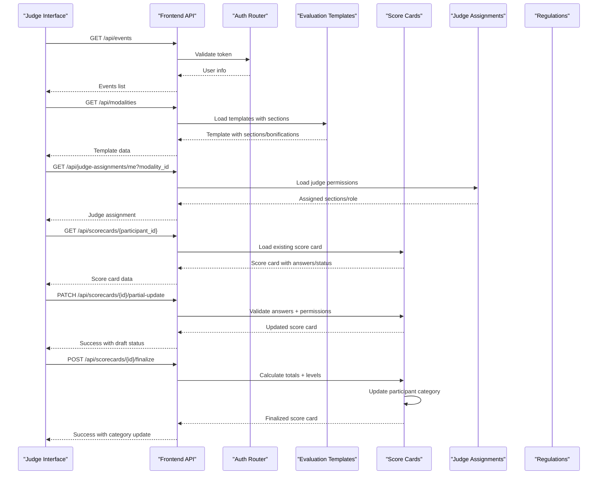
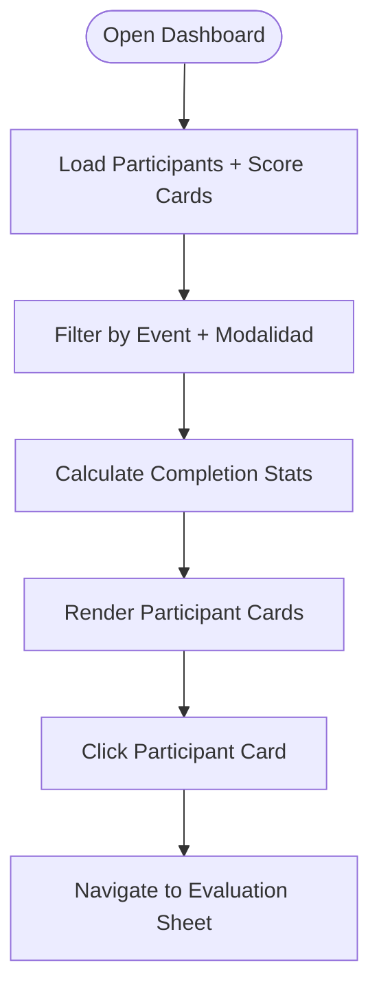
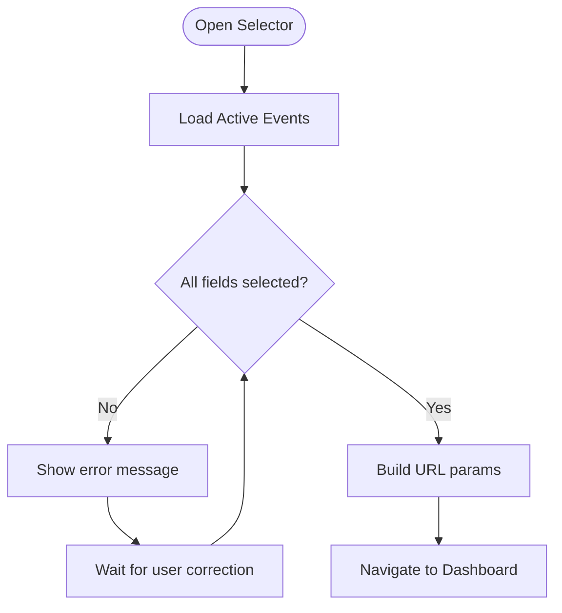
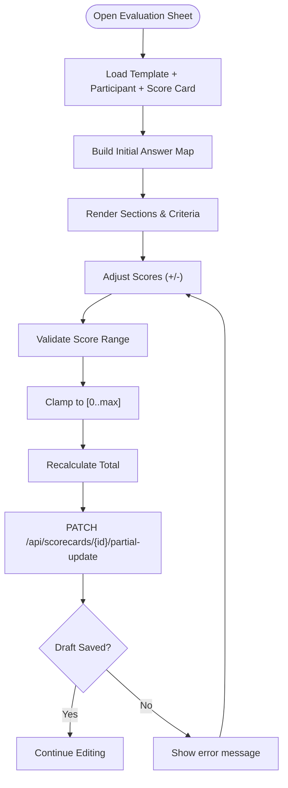
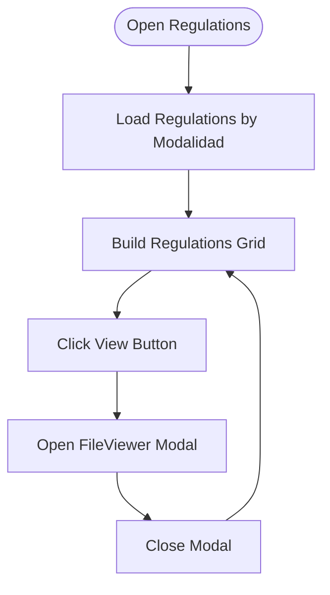
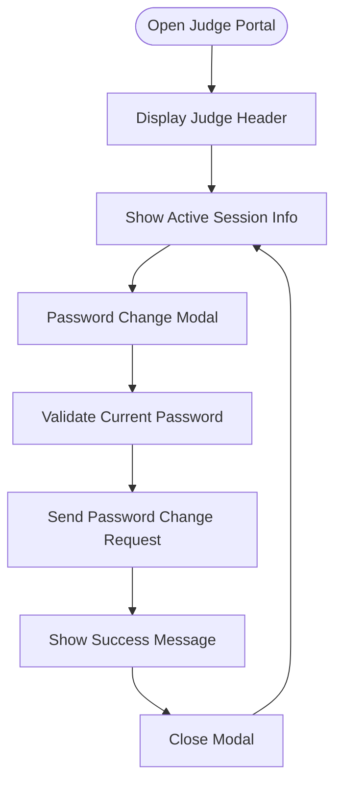
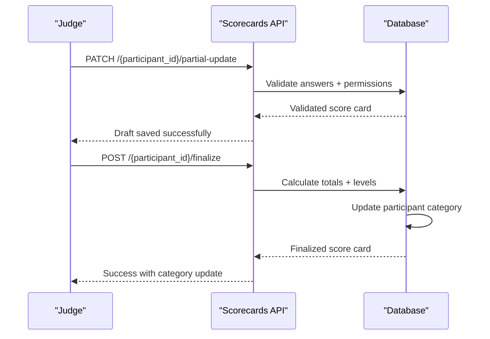
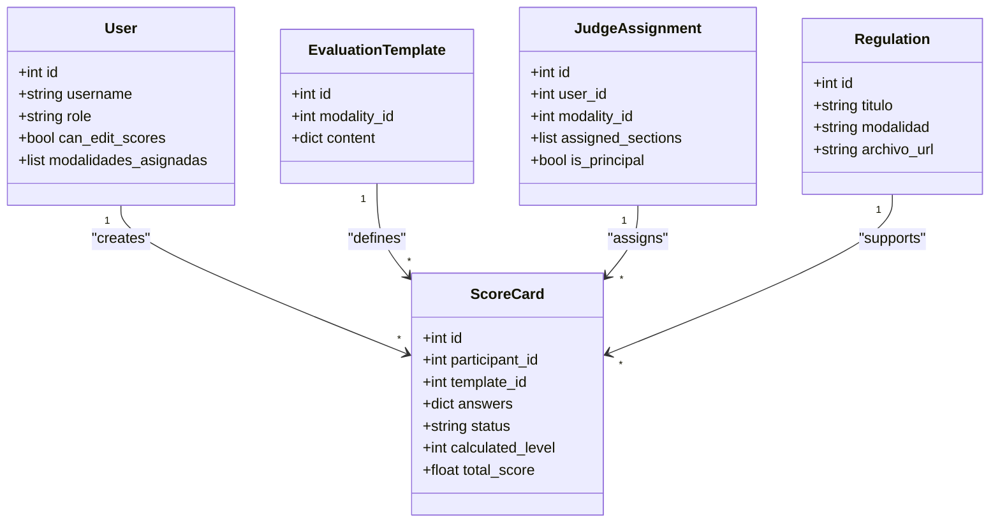
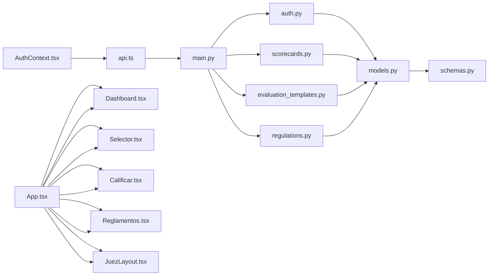

# Judge Features

<cite>
**Referenced Files in This Document**
- [Dashboard.tsx](file://frontend/src/pages/juez/Dashboard.tsx)
- [Selector.tsx](file://frontend/src/pages/juez/Selector.tsx)
- [Calificar.tsx](file://frontend/src/pages/juez/Calificar.tsx)
- [Reglamentos.tsx](file://frontend/src/pages/juez/Reglamentos.tsx)
- [JuezLayout.tsx](file://frontend/src/pages/juez/JuezLayout.tsx)
- [judging.ts](file://frontend/src/lib/judging.ts)
- [AuthContext.tsx](file://frontend/src/contexts/AuthContext.tsx)
- [api.ts](file://frontend/src/lib/api.ts)
- [App.tsx](file://frontend/src/App.tsx)
- [main.py](file://main.py)
- [auth.py](file://routes/auth.py)
- [scorecards.py](file://routes/scorecards.py)
- [evaluation_templates.py](file://routes/evaluation_templates.py)
- [regulations.py](file://routes/regulations.py)
- [models.py](file://models.py)
- [schemas.py](file://schemas.py)
</cite>

## Update Summary
**Changes Made**
- Enhanced judge dashboard with improved participant filtering and progress tracking
- Improved participant selector with better modalidad-based room selection and regulations integration
- Enhanced regulations access system with comprehensive PDF management and modalidad filtering
- Advanced judge assignment system with role-based permissions and status tracking
- Real-time scoring validation with collaborative features and principal judge finalization
- **New**: Enhanced collaborative scoring interface with partial updates and finalization capabilities
- **New**: Advanced template interaction patterns with categorization options and bonification support
- **New**: Comprehensive scoring validation rules with automatic category progression

## Table of Contents
1. [Introduction](#introduction)
2. [Project Structure](#project-structure)
3. [Core Components](#core-components)
4. [Architecture Overview](#architecture-overview)
5. [Detailed Component Analysis](#detailed-component-analysis)
6. [Dependency Analysis](#dependency-analysis)
7. [Performance Considerations](#performance-considerations)
8. [Troubleshooting Guide](#troubleshooting-guide)
9. [Conclusion](#conclusion)
10. [Appendices](#appendices)

## Introduction
This document provides a comprehensive feature implementation guide for the enhanced judge functionalities in the Juzgamiento application. The system now features a sophisticated judge portal with collaborative scoring capabilities, comprehensive participant management, and integrated regulations access.

The enhanced judge portal provides a complete judging solution with template-driven evaluation sheets, real-time scoring with automatic calculation, modalidad-based regulations access, and comprehensive participant management. The system now supports collaborative scoring workflows where multiple judges can contribute to evaluation sheets with role-based permissions and principal judge finalization.

**Updated** Enhanced judge portal with improved regulations access, better dashboard interface, and enhanced participant selector functionality. The collaborative scoring interface now supports partial updates, real-time validation, and automatic category progression.

## Project Structure
The enhanced judge feature spans the frontend React application and the backend FastAPI service with comprehensive components for collaborative scoring, regulations management, and judge assignment workflows.

```mermaid
graph TB
subgraph "Enhanced Judge Portal"
DASH["Dashboard.tsx"]
SEL["Selector.tsx"]
CAL["Calificar.tsx"]
REG["Reglamentos.tsx"]
LAYOUT["JuezLayout.tsx"]
CTX["AuthContext.tsx"]
API["api.ts"]
TYPES["judging.ts"]
APP["App.tsx"]
END
subgraph "Backend Services"
MAIN["main.py"]
AUTH["auth.py"]
SCORE["scorecards.py"]
TEMPLATE["evaluation_templates.py"]
REGS["regulations.py"]
MODEL["models.py"]
SCHEMA["schemas.py"]
end
DASH --> API
SEL --> API
CAL --> API
REG --> API
LAYOUT --> API
APP --> DASH
APP --> SEL
APP --> CAL
APP --> REG
APP --> LAYOUT
API --> MAIN
MAIN --> AUTH
MAIN --> SCORE
MAIN --> TEMPLATE
MAIN --> REGS
AUTH --> MODEL
SCORE --> MODEL
TEMPLATE --> MODEL
REGS --> MODEL
MODEL --> SCHEMA
```

**Diagram sources**
- [Dashboard.tsx:1-268](file://frontend/src/pages/juez/Dashboard.tsx#L1-L268)
- [Selector.tsx:1-208](file://frontend/src/pages/juez/Selector.tsx#L1-L208)
- [Calificar.tsx:1-927](file://frontend/src/pages/juez/Calificar.tsx#L1-L927)
- [Reglamentos.tsx:1-171](file://frontend/src/pages/juez/Reglamentos.tsx#L1-L171)
- [JuezLayout.tsx:1-199](file://frontend/src/pages/juez/JuezLayout.tsx#L1-L199)
- [judging.ts:1-146](file://frontend/src/lib/judging.ts#L1-L146)
- [AuthContext.tsx:1-183](file://frontend/src/contexts/AuthContext.tsx#L1-L183)
- [api.ts:1-41](file://frontend/src/lib/api.ts#L1-L41)
- [App.tsx:1-131](file://frontend/src/App.tsx#L1-L131)
- [main.py:1-53](file://main.py#L1-L53)
- [auth.py:1-36](file://routes/auth.py#L1-L36)
- [scorecards.py:1-725](file://routes/scorecards.py#L1-L725)
- [evaluation_templates.py:1-172](file://routes/evaluation_templates.py#L1-L172)
- [regulations.py:1-110](file://routes/regulations.py#L1-L110)
- [models.py:140-225](file://models.py#L140-L225)
- [schemas.py:250-265](file://schemas.py#L250-L265)

**Section sources**
- [main.py:1-53](file://main.py#L1-L53)
- [models.py:140-225](file://models.py#L140-L225)
- [schemas.py:250-265](file://schemas.py#L250-L265)

## Core Components
The enhanced judge portal consists of sophisticated components providing a comprehensive collaborative scoring workflow with advanced template management and regulations access:

- **Judge Dashboard**: Advanced participant filtering with progress tracking and completion status visualization
- **Participant Selector**: Modalidad-based room selection with integrated regulations access and event filtering
- **Collaborative Scoring Interface**: Template-driven evaluation with real-time validation, section assignment, and automatic calculation
- **Judge Regulations Manager**: Comprehensive PDF upload, modalidad filtering, and FileViewer integration
- **Score Card System**: Draft/completed status tracking with automatic level calculation and participant categorization
- **Judge Assignment System**: Role-based permissions with principal judge finalization capabilities
- **Advanced Template Engine**: Multi-section templates with categorization options and evaluation scales
- **Real-time Validation**: Comprehensive backend validation for scoring workflows and template compliance

Key responsibilities:
- **Collaborative Scoring**: Multiple judges contribute to evaluation sheets with role-based permissions
- **Template Management**: Advanced template-driven evaluation with section assignment and validation
- **Regulations Access**: Comprehensive document management with modalidad filtering and PDF preview
- **Category Management**: Automatic participant categorization with level-based calculations
- **Permission Control**: Strict role-based access with principal judge finalization
- **Real-time Updates**: Live scoring validation and immediate feedback during evaluation
- **Audit Trail**: Complete scoring history with status tracking and level progression

**Updated** Enhanced judge portal with improved regulations access, better dashboard interface, and enhanced participant selector functionality. The collaborative scoring interface now supports partial updates, real-time validation, and automatic category progression.

**Section sources**
- [Dashboard.tsx:1-268](file://frontend/src/pages/juez/Dashboard.tsx#L1-L268)
- [Selector.tsx:1-208](file://frontend/src/pages/juez/Selector.tsx#L1-L208)
- [Calificar.tsx:1-927](file://frontend/src/pages/juez/Calificar.tsx#L1-L927)
- [Reglamentos.tsx:1-171](file://frontend/src/pages/juez/Reglamentos.tsx#L1-L171)
- [JuezLayout.tsx:1-199](file://frontend/src/pages/juez/JuezLayout.tsx#L1-L199)
- [judging.ts:40-146](file://frontend/src/lib/judging.ts#L40-L146)
- [AuthContext.tsx:1-183](file://frontend/src/contexts/AuthContext.tsx#L1-L183)
- [api.ts:1-41](file://frontend/src/lib/api.ts#L1-L41)
- [App.tsx:1-131](file://frontend/src/App.tsx#L1-L131)

## Architecture Overview
The enhanced judge workflow integrates collaborative scoring with comprehensive backend validation and template-driven evaluation. The system now supports multiple judge contributions to evaluation sheets with role-based permissions and automatic category progression.



**Diagram sources**
- [Calificar.tsx:333-402](file://frontend/src/pages/juez/Calificar.tsx#L333-L402)
- [Calificar.tsx:472-556](file://frontend/src/pages/juez/Calificar.tsx#L472-L556)
- [scorecards.py:445-503](file://routes/scorecards.py#L445-L503)
- [scorecards.py:535-607](file://routes/scorecards.py#L535-L607)
- [evaluation_templates.py:123-140](file://routes/evaluation_templates.py#L123-L140)
- [judging.ts:132-143](file://frontend/src/lib/judging.ts#L132-L143)

## Detailed Component Analysis

### Enhanced Judge Dashboard: Comprehensive Participant Management
The judge dashboard now provides sophisticated participant filtering with progress tracking and completion status visualization.

- **Purpose**: Advanced participant management with modalidad-based filtering and progress tracking
- **Enhanced Features**: Real-time completion status, participant categorization, event filtering, and progress visualization
- **Data Flow**: Loads participants, score cards, and calculates completion statistics with modalidad filtering
- **UI Components**: Progress indicators, participant cards with completion status, and navigation controls



**Diagram sources**
- [Dashboard.tsx:28-84](file://frontend/src/pages/juez/Dashboard.tsx#L28-L84)
- [Dashboard.tsx:90-94](file://frontend/src/pages/juez/Dashboard.tsx#L90-L94)

**Section sources**
- [Dashboard.tsx:1-268](file://frontend/src/pages/juez/Dashboard.tsx#L1-L268)

### Advanced Selector: Modalidad-Based Room Selection
The selector component now provides comprehensive room selection with integrated regulations access and modalidad-based filtering.

- **Purpose**: Modalidad-based room selection with event filtering and regulations integration
- **Enhanced Features**: Modalidad filtering, regulations access button, event validation, and parameter building
- **Data Flow**: Loads active events, validates selections, builds URL parameters, and provides regulations access
- **UI Feedback**: Loading states, error messages, current selection summary, and regulations access button



**Diagram sources**
- [Selector.tsx:84-98](file://frontend/src/pages/juez/Selector.tsx#L84-L98)
- [Selector.tsx:93-96](file://frontend/src/pages/juez/Selector.tsx#L93-L96)

**Section sources**
- [Selector.tsx:1-208](file://frontend/src/pages/juez/Selector.tsx#L1-L208)

### Enhanced Collaborative Scoring Interface: Real-time Validation System
The evaluation sheet now provides sophisticated template-driven scoring with automatic calculation, section assignment, and comprehensive validation.

- **Purpose**: Template-driven collaborative scoring with section assignment and real-time validation
- **Enhanced Features**: Automatic score calculation, section assignment validation, bonification support, real-time validation
- **Template Loading**: Template loading with modalidad filtering, section assignment resolution, initial score population
- **Real-Time Scoring**: Increment/decrement buttons with value clamping, automatic total calculation, level-based categorization
- **Submission**: Structured score payload with computed totals, draft/completed status tracking, principal judge finalization
- **Validation**: Comprehensive backend validation for template compliance, permission checks, and scoring rules



**Diagram sources**
- [Calificar.tsx:106-142](file://frontend/src/pages/juez/Calificar.tsx#L106-L142)
- [Calificar.tsx:191-241](file://frontend/src/pages/juez/Calificar.tsx#L191-L241)
- [Calificar.tsx:472-556](file://frontend/src/pages/juez/Calificar.tsx#L472-L556)

**Section sources**
- [Calificar.tsx:1-927](file://frontend/src/pages/juez/Calificar.tsx#L1-L927)

### Comprehensive Regulations Manager: PDF Upload and Modalidad-Based Access
The regulations manager now provides comprehensive document management with PDF upload, modalidad filtering, and integrated FileViewer functionality.

- **Purpose**: Comprehensive regulations management with PDF upload and modalidad-based filtering
- **Enhanced Features**: PDF upload with validation, modalidad filtering, FileViewer integration, comprehensive document management
- **Data Loading**: Fetches regulations with modalidad filtering, supports PDF and image preview
- **Interaction**: Regulations grid with view buttons, FileViewer modal for document preview, upload/delete operations
- **UI**: Grid layout with regulation cards, loading states, error handling, and comprehensive document access



**Diagram sources**
- [Reglamentos.tsx:30-52](file://frontend/src/pages/juez/Reglamentos.tsx#L30-L52)
- [Reglamentos.tsx:160-167](file://frontend/src/pages/juez/Reglamentos.tsx#L160-L167)

**Section sources**
- [Reglamentos.tsx:1-171](file://frontend/src/pages/juez/Reglamentos.tsx#L1-L171)

### Enhanced Judge Layout and Security Management
The judge layout now provides comprehensive session management with enhanced security features including password change functionality and integrated judge-specific navigation.

- **Purpose**: Hosts judge-specific pages, displays active judge session, and manages authentication
- **Enhanced Features**: Password change modal with validation, session management, and judge-specific navigation
- **Security**: JWT token management, secure password change endpoint, and role-based access control
- **Behavior**: Navigates to login after logout; renders nested routes for selector, dashboard, evaluation sheet, and regulations viewer



**Diagram sources**
- [JuezLayout.tsx:24-55](file://frontend/src/pages/juez/JuezLayout.tsx#L24-L55)
- [JuezLayout.tsx:130-195](file://frontend/src/pages/juez/JuezLayout.tsx#L130-L195)

**Section sources**
- [JuezLayout.tsx:1-199](file://frontend/src/pages/juez/JuezLayout.tsx#L1-L199)

### Enhanced Score Card System: Collaborative Scoring with Status Tracking
The score card system now provides comprehensive collaborative scoring with draft/completed status tracking, automatic level calculation, and participant categorization.

- **Purpose**: Collaborative scoring with status tracking and automatic categorization
- **Enhanced Features**: Draft/completed status tracking, automatic level calculation, participant categorization, audit trail
- **Workflow**: Partial updates with validation, principal judge finalization, automatic category progression
- **Validation**: Template compliance checking, permission validation, scoring range validation
- **Integration**: Automatic participant category updates, level-based calculations, comprehensive scoring history



**Diagram sources**
- [scorecards.py:445-503](file://routes/scorecards.py#L445-L503)
- [scorecards.py:535-607](file://routes/scorecards.py#L535-L607)

**Section sources**
- [scorecards.py:1-725](file://routes/scorecards.py#L1-L725)

### Enhanced Backend Integration: Comprehensive Judge Services
The backend now provides comprehensive services for collaborative judge operations including template management, score validation, and judge assignment workflows.

- **Authentication**: Enhanced judge session management with password change capabilities
- **Template Management**: Advanced template-driven evaluation with section assignment and validation
- **Score Validation**: Comprehensive validation for scoring workflows, template compliance, and permission checks
- **Judge Assignments**: Role-based permissions with section assignment and principal judge finalization
- **Regulations Management**: Complete PDF upload, filtering, and modalidad-based document access
- **Category Management**: Automatic participant categorization with level-based calculations



**Diagram sources**
- [models.py:140-225](file://models.py#L140-L225)

**Section sources**
- [auth.py:13-35](file://routes/auth.py#L13-L35)
- [evaluation_templates.py:1-172](file://routes/evaluation_templates.py#L1-L172)
- [scorecards.py:1-725](file://routes/scorecards.py#L1-L725)
- [regulations.py:1-110](file://routes/regulations.py#L1-L110)
- [models.py:140-225](file://models.py#L140-L225)

## Dependency Analysis
The enhanced judge portal maintains comprehensive frontend-backend dependencies with additional collaborative scoring and regulations management capabilities.

- **Frontend Dependencies**: AuthContext for session management, API client for backend communication, Enhanced judging types for data modeling, FileViewer for document preview, Application router for judge portal structure
- **Backend Dependencies**: SQLAlchemy models and schemas for persistence, Comprehensive validation logic for scoring workflows, Judge assignment system for role-based permissions
- **Enhanced Routing**: Comprehensive route registration for judge portal components, collaborative scoring endpoints, and regulations management
- **Collaborative Features**: Score card system with draft/completed status, judge assignment permissions, and automatic category progression



**Diagram sources**
- [AuthContext.tsx:1-183](file://frontend/src/contexts/AuthContext.tsx#L1-L183)
- [api.ts:1-41](file://frontend/src/lib/api.ts#L1-L41)
- [main.py:1-53](file://main.py#L1-L53)
- [App.tsx:1-131](file://frontend/src/App.tsx#L1-L131)
- [auth.py:1-36](file://routes/auth.py#L1-L36)
- [scorecards.py:1-725](file://routes/scorecards.py#L1-L725)
- [evaluation_templates.py:1-172](file://routes/evaluation_templates.py#L1-L172)
- [regulations.py:1-110](file://routes/regulations.py#L1-L110)
- [models.py:140-225](file://models.py#L140-L225)
- [schemas.py:250-265](file://schemas.py#L250-L265)

**Section sources**
- [main.py:1-53](file://main.py#L1-L53)
- [models.py:140-225](file://models.py#L140-L225)
- [schemas.py:250-265](file://schemas.py#L250-L265)

## Performance Considerations
The enhanced judge portal implements several performance optimizations for collaborative scoring and regulations management.

- **Template Caching**: Evaluation templates cached per modalidad to minimize API calls
- **Score Card Optimization**: Draft/completed status prevents unnecessary validations
- **Real-time Validation**: Frontend validation reduces server load with immediate feedback
- **File Caching**: PDF and image previews leverage browser caching for improved performance
- **Collaborative Efficiency**: Partial updates minimize data transfer and processing overhead
- **Permission Preloading**: Judge assignments loaded once and reused across evaluation workflows
- **Category Resolution**: Automatic category calculation reduces manual intervention

**Updated** Enhanced performance considerations with template caching, score card optimization, real-time validation, collaborative efficiency, and automatic category resolution.

## Troubleshooting Guide
Common issues and resolutions for the enhanced judge portal with collaborative scoring and regulations management:

### Judge Interface Issues
- **Missing or Invalid Selections**:
  - Symptom: Error message when navigating to evaluation sheet without selecting all fields
  - Resolution: Ensure event, modalidad, and categoria are selected before proceeding
  - Section sources: [Selector.tsx:84-98](file://frontend/src/pages/juez/Selector.tsx#L84-L98)

- **Template Loading Failures**:
  - Symptom: Error loading evaluation template for selected modalidad
  - Resolution: Verify template exists for selected modalidad, check judge assignment permissions
  - Section sources: [Calificar.tsx:333-344](file://frontend/src/pages/juez/Calificar.tsx#L333-L344)

- **Score Card Not Found**:
  - Symptom: Error accessing evaluation sheet for participant
  - Resolution: Verify participant exists, check modalidad/category match, ensure judge assignment
  - Section sources: [Calificar.tsx:317-324](file://frontend/src/pages/juez/Calificar.tsx#L317-L324)

### Collaborative Scoring Issues
- **Permission Denied**:
  - Symptom: Error when trying to edit score card
  - Resolution: Verify judge assignment, check section permissions, ensure participant belongs to judge's modalidad
  - Section sources: [scorecards.py:144-173](file://routes/scorecards.py#L144-L173)

- **Finalization Errors**:
  - Symptom: Error when finalizing evaluation sheet
  - Resolution: Verify principal judge role, check all required items completed, ensure score card not already finalized
  - Section sources: [scorecards.py:535-556](file://routes/scorecards.py#L535-L556)

- **Score Validation Failures**:
  - Symptom: Error saving partial progress
  - Resolution: Check score ranges, verify categorization options, ensure proper JSON structure
  - Section sources: [scorecards.py:200-316](file://routes/scorecards.py#L200-L316)

### Regulations Access Issues
- **PDF Upload Failures**:
  - Symptom: Error uploading regulations PDF
  - Resolution: Verify PDF format, check file size limits, ensure admin privileges
  - Section sources: [regulations.py:29-34](file://routes/regulations.py#L29-L34)

- **Regulation Access Issues**:
  - Symptom: Error accessing regulations for modalidad
  - Resolution: Verify regulations exist for selected modalidad, check file upload status
  - Section sources: [Reglamentos.tsx:47-51](file://frontend/src/pages/juez/Reglamentos.tsx#L47-L51)

### Judge Assignment Issues
- **Assignment Not Found**:
  - Symptom: Error accessing judge assignment
  - Resolution: Verify judge assignment exists, check modalidad_id parameter, ensure proper authentication
  - Section sources: [scorecards.py:62-76](file://routes/scorecards.py#L62-L76)

- **Section Permission Errors**:
  - Symptom: Error editing specific scoring items
  - Resolution: Verify judge assignment includes section, check principal judge permissions for bonifications
  - Section sources: [scorecards.py:144-173](file://routes/scorecards.py#L144-L173)

### Network/API Errors
- **Generic API Errors**:
  - Symptom: Various API errors from backend
  - Resolution: Check backend connectivity, verify token validity, review Axios error handling
  - Section sources: [api.ts:16-40](file://frontend/src/lib/api.ts#L16-L40)

**Updated** Added troubleshooting for collaborative scoring system, judge assignment permissions, score validation, and regulations management.

## Conclusion
The enhanced judge portal in Juzgamiento provides a comprehensive collaborative scoring solution with advanced template-driven evaluation, comprehensive regulations management, and integrated judge assignment workflows. The system now supports sophisticated judge workflows including room selection, collaborative scoring with role-based permissions, real-time validation, and automatic participant categorization.

The judge portal successfully streamlines the collaborative judging process through intuitive navigation, comprehensive template-driven evaluation, integrated regulations access, and sophisticated scoring validation. The backend provides robust support for collaborative scoring workflows with strict validation rules, automatic category progression, and comprehensive audit trails.

By following the documented workflows and troubleshooting steps, judges can efficiently collaborate on evaluation sheets, manage participant categories with automatic level calculations, access competition regulations, and maintain accurate records while ensuring compliance with competition standards.

**Updated** The enhanced judge portal provides a complete collaborative scoring solution with comprehensive template-driven evaluation, advanced judge assignment permissions, automatic categorization, and sophisticated real-time validation.

## Appendices

### Enhanced Step-by-Step Judge Workflow with Collaborative Scoring
1. **Room Selection**: Open Selector page and choose event, modalidad, and categoria
2. **Regulations Access**: Access regulations for selected modalidad during preparation
3. **Participant Management**: Navigate to Dashboard and filter participants by modalidad
4. **Evaluation Process**: Select a participant to open the collaborative evaluation sheet
5. **Scoring**: Adjust scores per criterion using +/- buttons; total recalculates automatically
6. **Partial Saving**: Save progress as draft for later continuation
7. **Finalization**: Principal judge finalizes evaluation sheet with automatic category update
8. **Progress Tracking**: Monitor completion status and participant categorization

Screenshots (descriptive):
- **Dashboard**: "Competidores filtrados" with participant cards, completion status, and progress tracking
- **Selector**: "Selecciona la sala de juzgamiento" with event selection, modalidad dropdown, and regulations access button
- **Collaborative Evaluation**: "Hoja colaborativa" with sections, criteria, real-time scoring, and fixed footer for total calculation
- **Score Card Status**: Draft/completed status tracking with automatic level calculation

**Updated** Enhanced workflow with collaborative scoring system, judge assignment permissions, automatic categorization, and comprehensive status tracking.

### Enhanced Template Interaction Patterns
- **Section Assignment**: Judges only see sections assigned to their role within the modalidad
- **Template Validation**: Comprehensive validation for template-participant alignment and scoring rules
- **Categorization Options**: Level-based categorization with automatic participant updates
- **Bonification Support**: Special section for principal judge bonuses with point values
- **Real-time Calculation**: Automatic score calculation and level determination

### Enhanced Backend Integration Notes
- **Score Validation**: Template compliance checking, permission validation, and scoring range validation
- **Category Management**: Automatic participant categorization with level-based calculations
- **Judge Permissions**: Role-based access control with section assignment validation
- **Audit Trail**: Complete scoring history with status tracking and level progression
- **Regulations Management**: PDF upload, modalidad filtering, and comprehensive document access

### Enhanced Scoring Validation Rules
- **Template Compliance**: Template must match participant's modalidad and categoria
- **Judge Permissions**: Section assignment validation with role-based access control
- **Score Ranges**: Values clamped to valid ranges with automatic validation
- **Categorization Rules**: Level-based categorization with proper validation
- **Finalization Requirements**: Principal judge finalization with completeness checks

### Enhanced Error Handling During Collaborative Evaluation
- **Frontend**: Comprehensive error handling with user-friendly alerts and immediate feedback
- **Backend**: Explicit HTTP exceptions for missing resources, permission denials, and validation failures
- **Score Validation**: Real-time validation of scoring inputs with immediate error reporting
- **Template Validation**: Comprehensive template compliance checking with detailed error messages
- **Category Validation**: Automatic validation of participant categorization with fallback mechanisms

### Enhanced Regulations Management Features
- **PDF Upload**: Secure PDF upload with validation and storage management
- **Modalidad Filtering**: Regulations filtered by selected modalidad for relevant rule access
- **Document Preview**: Seamless PDF preview directly in browser with FileViewer integration
- **Administrative Access**: Admin-only upload/delete operations with file cleanup
- **Direct Access**: Quick access to regulations from selector and evaluation interfaces

### Enhanced System State Changes
- **Score Card Creation**: Automatic creation of draft score cards with initial validation
- **Partial Updates**: Draft status updates with immediate validation feedback
- **Finalization**: Principal judge finalization with automatic participant categorization
- **Category Updates**: Automatic participant category progression with level calculations
- **Audit Trail**: Complete scoring history with status tracking and permission logs

**Updated** Enhanced state change documentation with collaborative scoring system, judge assignment permissions, automatic categorization, and comprehensive audit trail.

**Section sources**
- [Selector.tsx:84-98](file://frontend/src/pages/juez/Selector.tsx#L84-L98)
- [Reglamentos.tsx:160-167](file://frontend/src/pages/juez/Reglamentos.tsx#L160-L167)
- [Calificar.tsx:210-241](file://frontend/src/pages/juez/Calificar.tsx#L210-L241)
- [scorecards.py:62-76](file://routes/scorecards.py#L62-L76)
- [scorecards.py:445-503](file://routes/scorecards.py#L445-L503)
- [scorecards.py:535-607](file://routes/scorecards.py#L535-L607)
- [regulations.py:67-79](file://routes/regulations.py#L67-L79)
- [models.py:140-162](file://models.py#L140-L162)
- [schemas.py:250-265](file://schemas.py#L250-L265)