# Judge Regulations Access

<cite>
**Referenced Files in This Document**
- [main.py](file://main.py)
- [models.py](file://models.py)
- [database.py](file://database.py)
- [schemas.py](file://schemas.py)
- [routes/regulations.py](file://routes/regulations.py)
- [frontend/src/pages/admin/Reglamentos.tsx](file://frontend/src/pages/admin/Reglamentos.tsx)
- [frontend/src/pages/juez/Reglamentos.tsx](file://frontend/src/pages/juez/Reglamentos.tsx)
- [frontend/src/lib/api.ts](file://frontend/src/lib/api.ts)
- [frontend/src/components/FileViewer.tsx](file://frontend/src/components/FileViewer.tsx)
- [utils/dependencies.py](file://utils/dependencies.py)
- [utils/security.py](file://utils/security.py)
- [routes/auth.py](file://routes/auth.py)
- [frontend/src/contexts/AuthContext.tsx](file://frontend/src/contexts/AuthContext.tsx)
- [init_db.py](file://init_db.py)
- [seed_init.py](file://seed_init.py)
- [requirements.txt](file://requirements.txt)
</cite>

## Table of Contents
1. [Introduction](#introduction)
2. [System Architecture](#system-architecture)
3. [Core Components](#core-components)
4. [Regulation Management System](#regulation-management-system)
5. [Authentication and Authorization](#authentication-and-authorization)
6. [Frontend Implementation](#frontend-implementation)
7. [Database Schema](#database-schema)
8. [Security Model](#security-model)
9. [Deployment and Setup](#deployment-and-setup)
10. [Troubleshooting Guide](#troubleshooting-guide)
11. [Conclusion](#conclusion)

## Introduction

Judge Regulations Access is a comprehensive web application designed for the automotive tuning and audio competition industry. The system provides a centralized platform for managing competition regulations, allowing administrators to upload and maintain official rule documents while enabling judges to access these regulations during scoring sessions.

The application serves two primary user roles: administrators who manage the regulation library and judges who access regulations for competition evaluation. Built with modern technologies including FastAPI for the backend and React with TypeScript for the frontend, the system ensures secure access control, efficient document management, and seamless user experiences across different device types.

## System Architecture

The Judge Regulations Access system follows a client-server architecture with clear separation of concerns between the frontend and backend components.

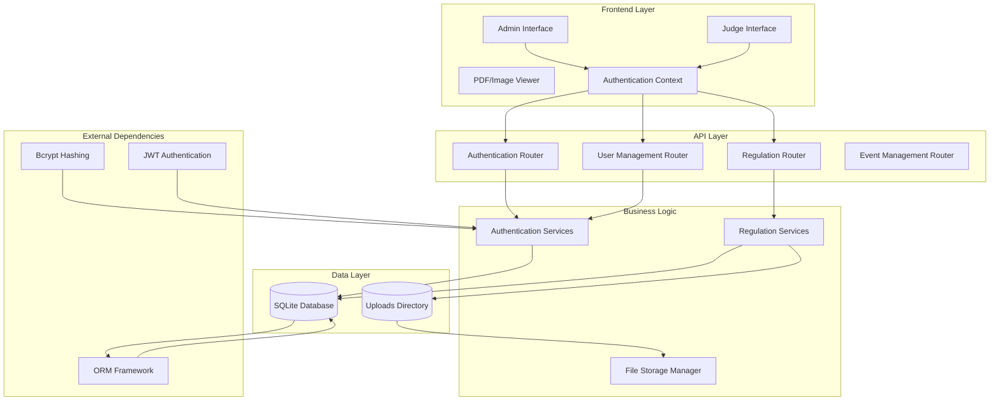

**Diagram sources**
- [main.py:26-47](file://main.py#L26-L47)
- [routes/regulations.py:15](file://routes/regulations.py#L15)
- [routes/auth.py:10](file://routes/auth.py#L10)

The architecture demonstrates a clean separation between presentation, business logic, and data persistence layers, ensuring maintainability and scalability.

**Section sources**
- [main.py:1-53](file://main.py#L1-L53)
- [requirements.txt:1-10](file://requirements.txt#L1-L10)

## Core Components

### Backend Application Structure

The backend application is built using FastAPI, providing automatic API documentation and type safety. The main application file orchestrates the entire system by initializing the database, setting up middleware, and registering all route handlers.

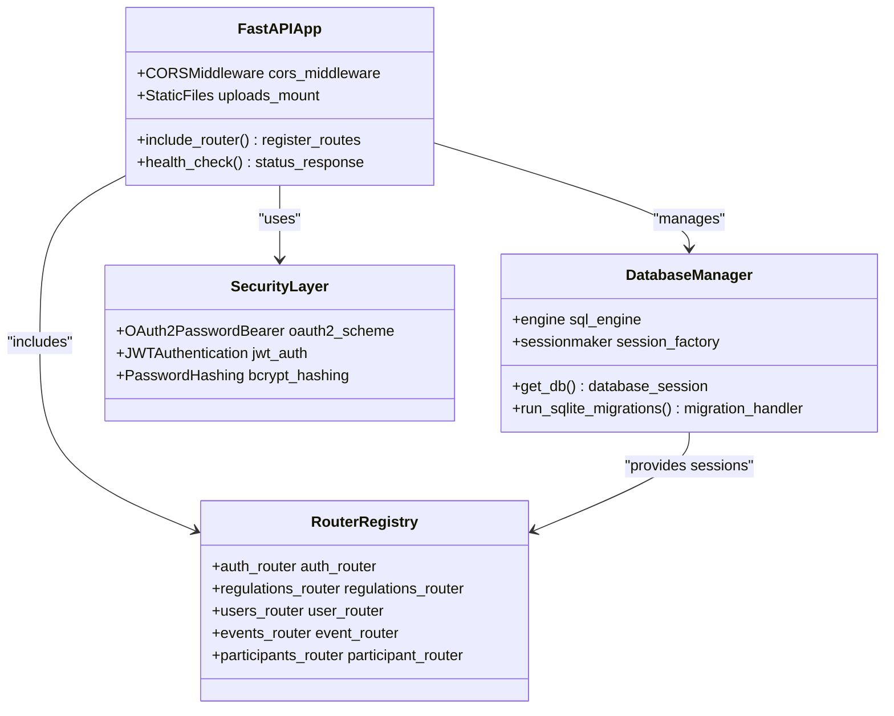

**Diagram sources**
- [main.py:26-47](file://main.py#L26-L47)
- [database.py:28-34](file://database.py#L28-L34)
- [utils/dependencies.py:12-13](file://utils/dependencies.py#L12-L13)

### Frontend Component Architecture

The frontend implements a React-based interface with TypeScript for type safety and enhanced development experience. The application uses a context-based authentication system and provides specialized interfaces for different user roles.

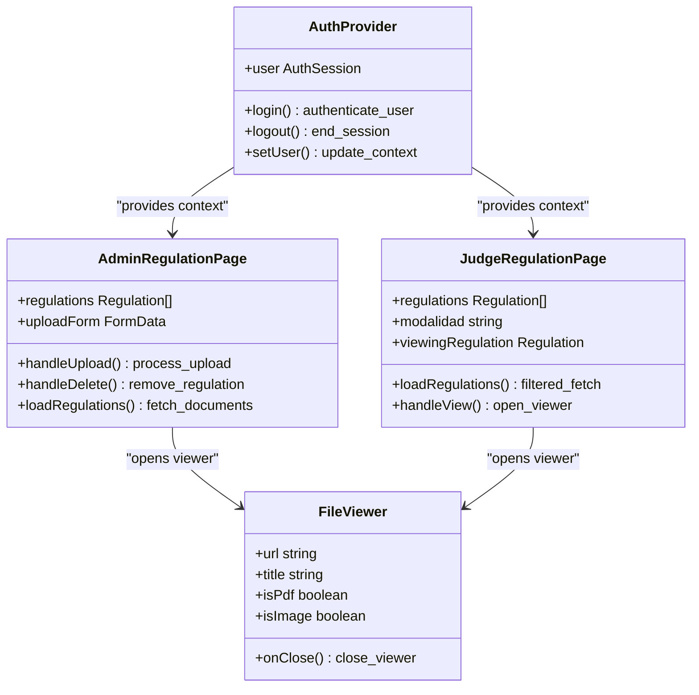

**Diagram sources**
- [frontend/src/contexts/AuthContext.tsx:66-132](file://frontend/src/contexts/AuthContext.tsx#L66-L132)
- [frontend/src/pages/admin/Reglamentos.tsx:22-302](file://frontend/src/pages/admin/Reglamentos.tsx#L22-L302)
- [frontend/src/pages/juez/Reglamentos.tsx:15-171](file://frontend/src/pages/juez/Reglamentos.tsx#L15-L171)

**Section sources**
- [main.py:1-53](file://main.py#L1-L53)
- [frontend/src/contexts/AuthContext.tsx:1-144](file://frontend/src/contexts/AuthContext.tsx#L1-L144)

## Regulation Management System

### Document Upload and Storage

The regulation management system provides comprehensive functionality for uploading, organizing, and accessing competition regulations. The system supports PDF documents with strict validation and secure storage mechanisms.

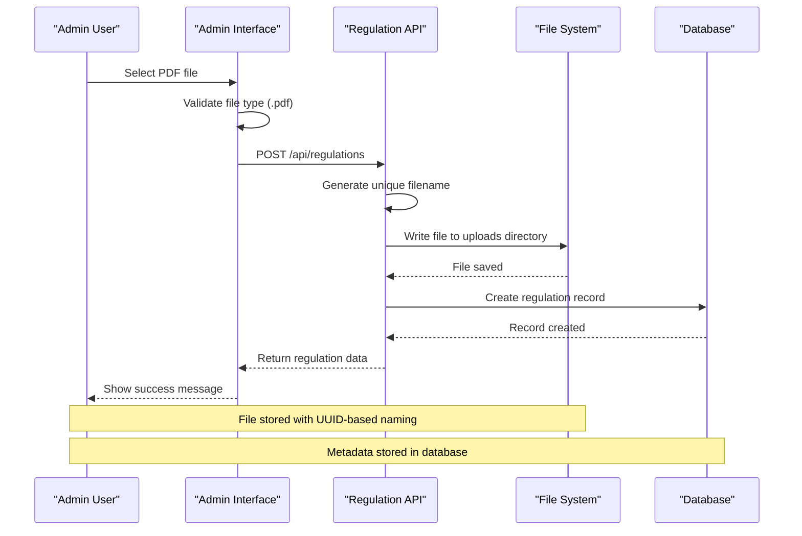

**Diagram sources**
- [routes/regulations.py:20-64](file://routes/regulations.py#L20-L64)

### Document Retrieval and Filtering

The system provides flexible retrieval mechanisms with optional filtering capabilities. Administrators can view all regulations, while judges can filter by competition modalities.

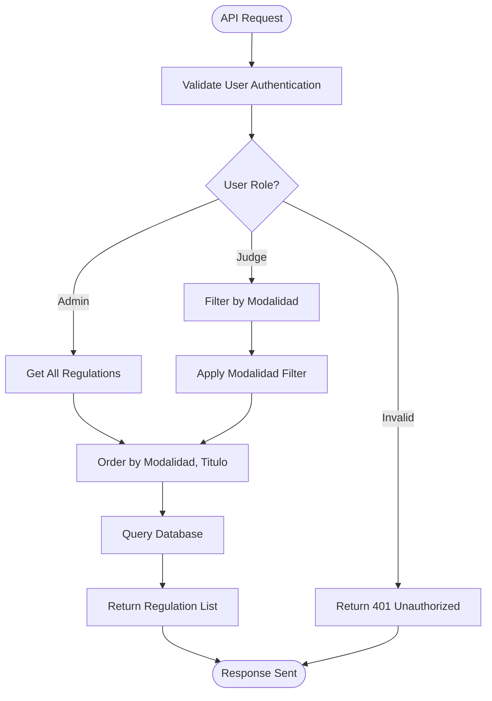

**Diagram sources**
- [routes/regulations.py:67-79](file://routes/regulations.py#L67-L79)
- [utils/dependencies.py:32-38](file://utils/dependencies.py#L32-L38)

### Document Deletion Process

The deletion process ensures complete removal of both file references and physical files from the system.

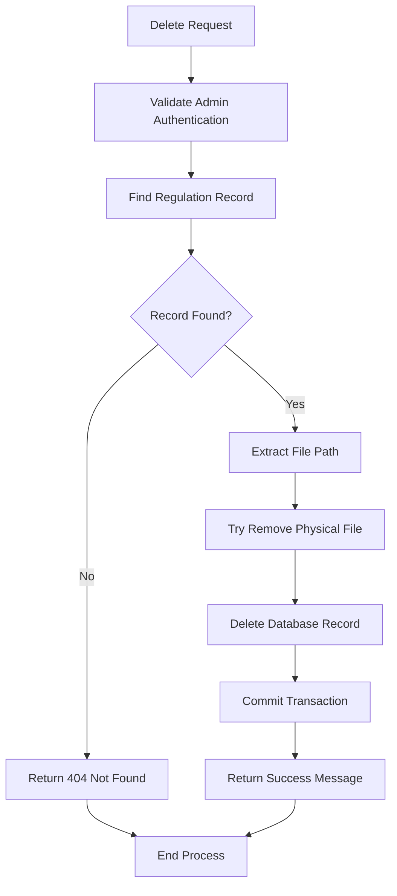

**Diagram sources**
- [routes/regulations.py:82-109](file://routes/regulations.py#L82-L109)

**Section sources**
- [routes/regulations.py:1-110](file://routes/regulations.py#L1-L110)
- [frontend/src/pages/admin/Reglamentos.tsx:1-302](file://frontend/src/pages/admin/Reglamentos.tsx#L1-L302)
- [frontend/src/pages/juez/Reglamentos.tsx:1-171](file://frontend/src/pages/juez/Reglamentos.tsx#L1-L171)

## Authentication and Authorization

### User Authentication Flow

The authentication system implements JWT-based token authentication with role-based access control. The system supports both administrator and judge user roles with appropriate permissions.

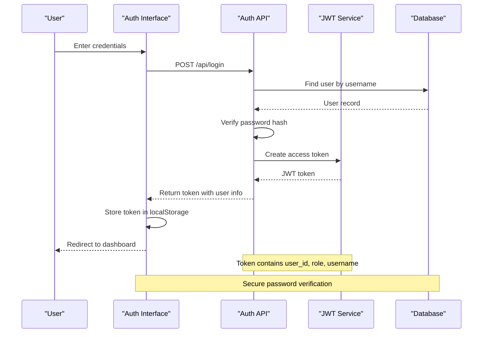

**Diagram sources**
- [routes/auth.py:13-35](file://routes/auth.py#L13-L35)
- [utils/security.py:32-42](file://utils/security.py#L32-L42)

### Role-Based Access Control

The system implements strict role-based access control with middleware decorators for route protection.

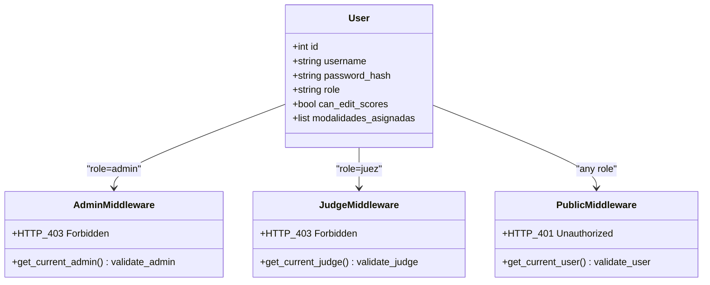

**Diagram sources**
- [utils/dependencies.py:32-47](file://utils/dependencies.py#L32-L47)
- [models.py:11-22](file://models.py#L11-L22)

### Token Management and Validation

The authentication system manages JWT tokens with expiration handling and automatic validation.

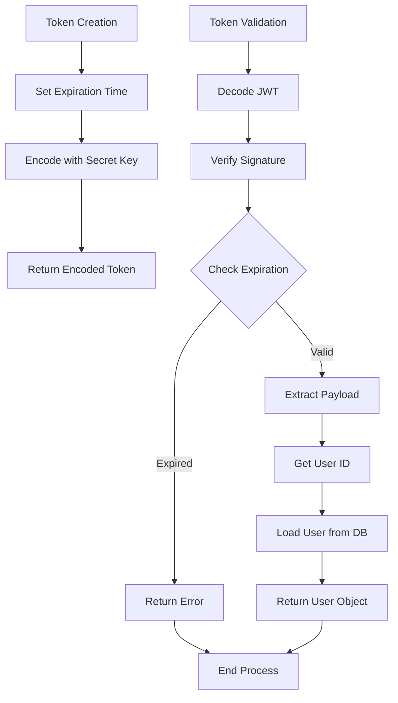

**Diagram sources**
- [utils/security.py:32-42](file://utils/security.py#L32-L42)
- [utils/dependencies.py:50-70](file://utils/dependencies.py#L50-L70)

**Section sources**
- [routes/auth.py:1-36](file://routes/auth.py#L1-L36)
- [utils/dependencies.py:1-71](file://utils/dependencies.py#L1-L71)
- [utils/security.py:1-54](file://utils/security.py#L1-L54)
- [frontend/src/contexts/AuthContext.tsx:1-144](file://frontend/src/contexts/AuthContext.tsx#L1-L144)

## Frontend Implementation

### Admin Interface Design

The administrator interface provides comprehensive tools for managing the regulation library with intuitive form controls and real-time feedback.

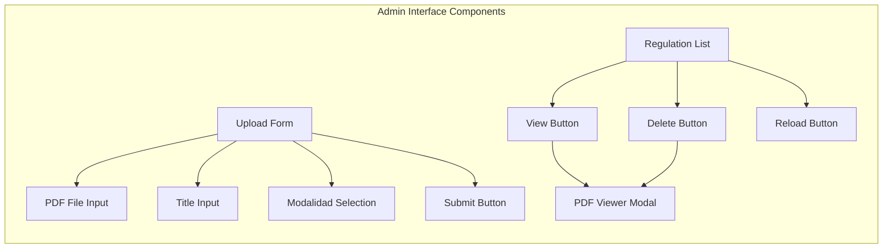

**Diagram sources**
- [frontend/src/pages/admin/Reglamentos.tsx:146-289](file://frontend/src/pages/admin/Reglamentos.tsx#L146-L289)

### Judge Interface Functionality

The judge interface focuses on streamlined access to relevant regulations with modalidad-based filtering and easy navigation.

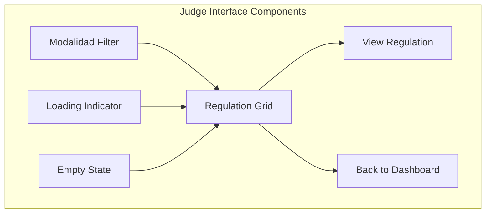

**Diagram sources**
- [frontend/src/pages/juez/Reglamentos.tsx:70-158](file://frontend/src/pages/juez/Reglamentos.tsx#L70-L158)

### File Viewing System

The file viewing system supports multiple document formats with responsive design and accessibility features.

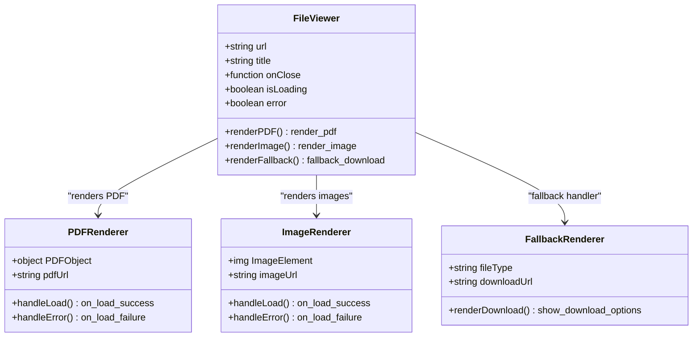

**Diagram sources**
- [frontend/src/components/FileViewer.tsx:17-156](file://frontend/src/components/FileViewer.tsx#L17-L156)

**Section sources**
- [frontend/src/pages/admin/Reglamentos.tsx:1-302](file://frontend/src/pages/admin/Reglamentos.tsx#L1-L302)
- [frontend/src/pages/juez/Reglamentos.tsx:1-171](file://frontend/src/pages/juez/Reglamentos.tsx#L1-L171)
- [frontend/src/components/FileViewer.tsx:1-157](file://frontend/src/components/FileViewer.tsx#L1-L157)

## Database Schema

The database schema is designed to support the regulation management system with proper relationships and constraints.

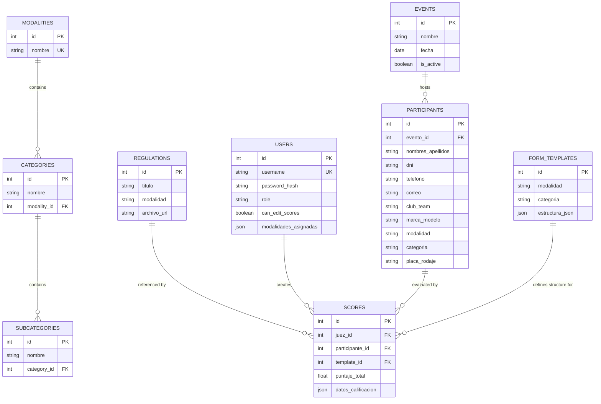

**Diagram sources**
- [models.py:104-153](file://models.py#L104-L153)

### Migration and Compatibility

The system includes robust database migration capabilities to ensure backward compatibility and smooth updates.

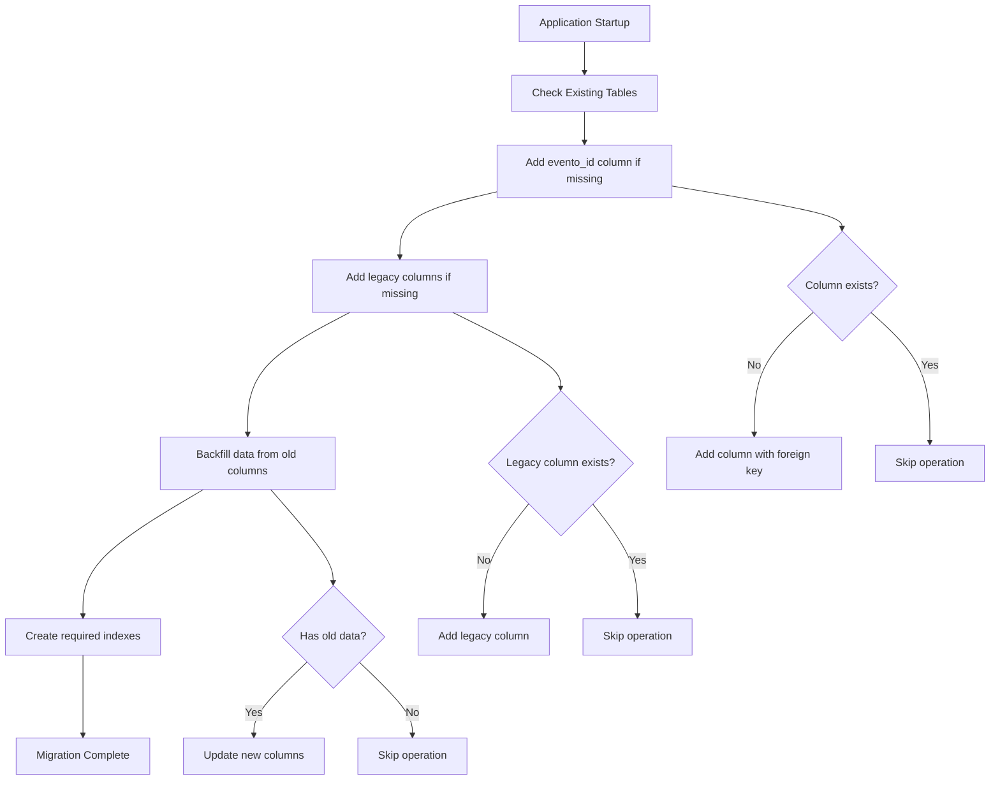

**Diagram sources**
- [database.py:36-93](file://database.py#L36-L93)

**Section sources**
- [models.py:1-153](file://models.py#L1-L153)
- [database.py:1-93](file://database.py#L1-L93)
- [schemas.py:1-202](file://schemas.py#L1-L202)

## Security Model

### Authentication Security

The system implements comprehensive security measures including password hashing, JWT token management, and role-based access control.

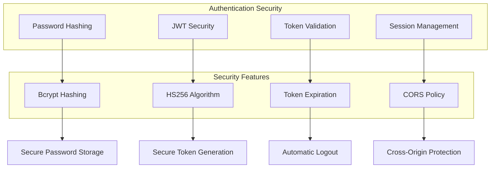

**Diagram sources**
- [utils/security.py:17-42](file://utils/security.py#L17-L42)
- [main.py:28-34](file://main.py#L28-L34)

### Authorization Controls

The authorization system provides granular access control with role-specific permissions and resource-level security.

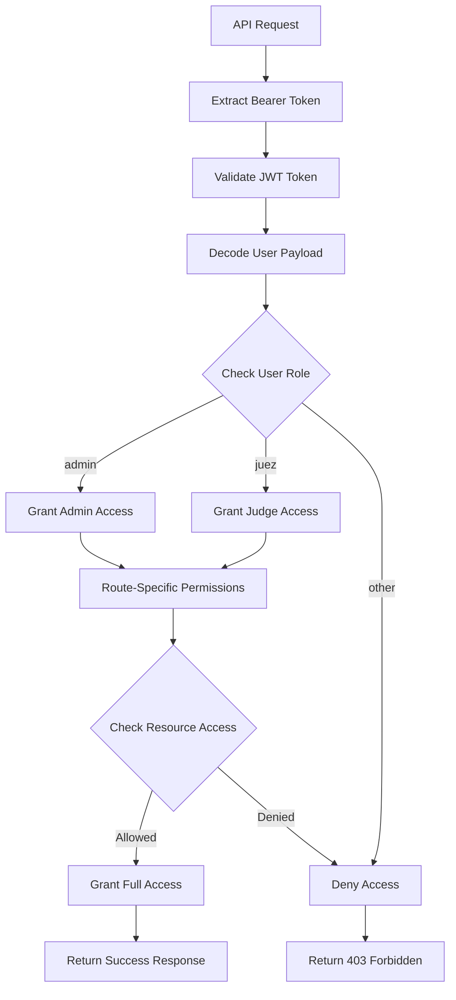

**Diagram sources**
- [utils/dependencies.py:32-47](file://utils/dependencies.py#L32-L47)
- [routes/regulations.py:25](file://routes/regulations.py#L25)

**Section sources**
- [utils/security.py:1-54](file://utils/security.py#L1-L54)
- [utils/dependencies.py:1-71](file://utils/dependencies.py#L1-L71)
- [routes/regulations.py:1-110](file://routes/regulations.py#L1-L110)

## Deployment and Setup

### Initial Database Setup

The system includes comprehensive initialization scripts for setting up the database with essential data structures and default configurations.

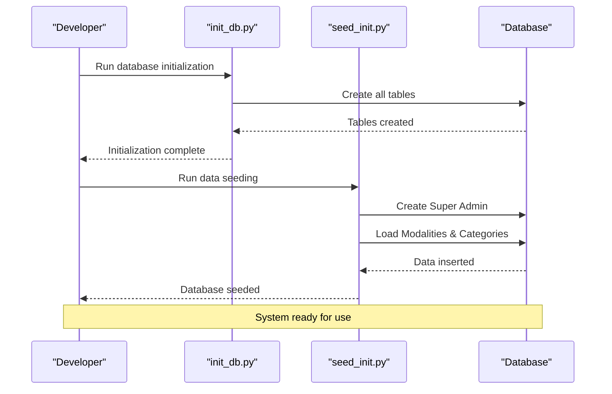

**Diagram sources**
- [init_db.py:23-27](file://init_db.py#L23-L27)
- [seed_init.py:13-103](file://seed_init.py#L13-L103)

### Environment Configuration

The system requires minimal configuration with sensible defaults for local development and production deployment.

| Environment Variable | Default Value | Purpose |
|---------------------|---------------|---------|
| `JWT_SECRET_KEY` | `change-this-secret-key-before-production` | JWT token encryption key |
| `ACCESS_TOKEN_EXPIRE_MINUTES` | `720` | Token expiration time in minutes |
| `DATABASE_URL` | `sqlite:///app.db` | Database connection string |

### Production Deployment

For production deployment, ensure the following considerations:

1. **Secret Key Management**: Replace the default JWT secret key with a strong, random value
2. **Static File Serving**: Configure proper static file serving for uploaded PDFs
3. **CORS Configuration**: Restrict origins to production domains only
4. **Database Migration**: Ensure proper migration handling for production data

**Section sources**
- [init_db.py:1-32](file://init_db.py#L1-L32)
- [seed_init.py:1-109](file://seed_init.py#L1-L109)
- [main.py:1-53](file://main.py#L1-L53)

## Troubleshooting Guide

### Common Issues and Solutions

#### Authentication Problems
- **Issue**: Users cannot log in despite correct credentials
- **Solution**: Verify password hashing and JWT secret key configuration
- **Debug Steps**: Check user record existence and password hash verification

#### File Upload Failures
- **Issue**: PDF uploads fail with validation errors
- **Solution**: Ensure file type validation and proper MIME type handling
- **Debug Steps**: Verify file extension validation and upload directory permissions

#### CORS Errors
- **Issue**: Frontend cannot communicate with backend APIs
- **Solution**: Configure proper CORS settings for development and production
- **Debug Steps**: Check allowed origins and credential handling

#### Database Migration Issues
- **Issue**: Application fails to start due to schema inconsistencies
- **Solution**: Run database migration scripts and verify table structures
- **Debug Steps**: Check migration logs and table information queries

### Performance Optimization

#### Database Query Optimization
- Implement proper indexing on frequently queried columns
- Use pagination for large result sets
- Optimize JOIN operations in complex queries

#### File Serving Optimization
- Configure CDN for static file delivery
- Implement proper caching headers
- Use compression for PDF files

#### Memory Management
- Monitor memory usage in long-running processes
- Implement proper resource cleanup
- Use connection pooling for database operations

**Section sources**
- [routes/regulations.py:29-34](file://routes/regulations.py#L29-L34)
- [database.py:36-93](file://database.py#L36-L93)
- [frontend/src/lib/api.ts:24-40](file://frontend/src/lib/api.ts#L24-L40)

## Conclusion

The Judge Regulations Access system provides a robust, scalable solution for managing competition regulations in the automotive tuning and audio industry. The system successfully balances functionality, security, and user experience through its comprehensive architecture and thoughtful implementation.

Key strengths of the system include:

- **Security**: JWT-based authentication with role-based access control
- **Scalability**: Modular architecture supporting future feature expansion
- **Usability**: Intuitive interfaces tailored for different user roles
- **Maintainability**: Clean separation of concerns and comprehensive documentation
- **Reliability**: Robust error handling and graceful degradation

The system's design allows for easy maintenance and extension while providing administrators with powerful tools for regulation management and judges with convenient access to official competition rules. The comprehensive testing and validation processes ensure reliable operation across different environments and use cases.

Future enhancements could include advanced search capabilities, document versioning, and integration with external systems for automated rule updates and compliance checking.