# Participant Selector

<cite>
**Referenced Files in This Document**
- [main.py](file://main.py)
- [routes/participants.py](file://routes/participants.py)
- [routes/events.py](file://routes/events.py)
- [models.py](file://models.py)
- [schemas.py](file://schemas.py)
- [frontend/src/pages/juez/Selector.tsx](file://frontend/src/pages/juez/Selector.tsx)
- [frontend/src/pages/juez/Dashboard.tsx](file://frontend/src/pages/juez/Dashboard.tsx)
- [frontend/src/lib/judging.ts](file://frontend/src/lib/judging.ts)
- [frontend/src/lib/api.ts](file://frontend/src/lib/api.ts)
- [frontend/src/contexts/AuthContext.tsx](file://frontend/src/contexts/AuthContext.tsx)
- [frontend/src/App.tsx](file://frontend/src/App.tsx)
</cite>

## Table of Contents
1. [Introduction](#introduction)
2. [System Architecture](#system-architecture)
3. [Participant Selector Workflow](#participant-selector-workflow)
4. [Core Components](#core-components)
5. [Data Model](#data-model)
6. [API Endpoints](#api-endpoints)
7. [Frontend Implementation](#frontend-implementation)
8. [Security and Access Control](#security-and-access-control)
9. [Excel Import Functionality](#excel-import-functionality)
10. [Troubleshooting Guide](#troubleshooting-guide)
11. [Conclusion](#conclusion)

## Introduction

The Participant Selector is a critical component of the Juzgamiento Car Audio y Tuning scoring system. It enables judges to efficiently select and manage participants for evaluation during car audio and tuning competitions. The system provides a two-step selection process: first selecting the competition event, modalities, and categories, then displaying the filtered list of participants ready for scoring.

This functionality serves as the gateway to the judging workflow, ensuring that judges can quickly access the correct participants based on their assigned roles and the current competition setup.

## System Architecture

The participant selector system follows a modern full-stack architecture with clear separation of concerns:

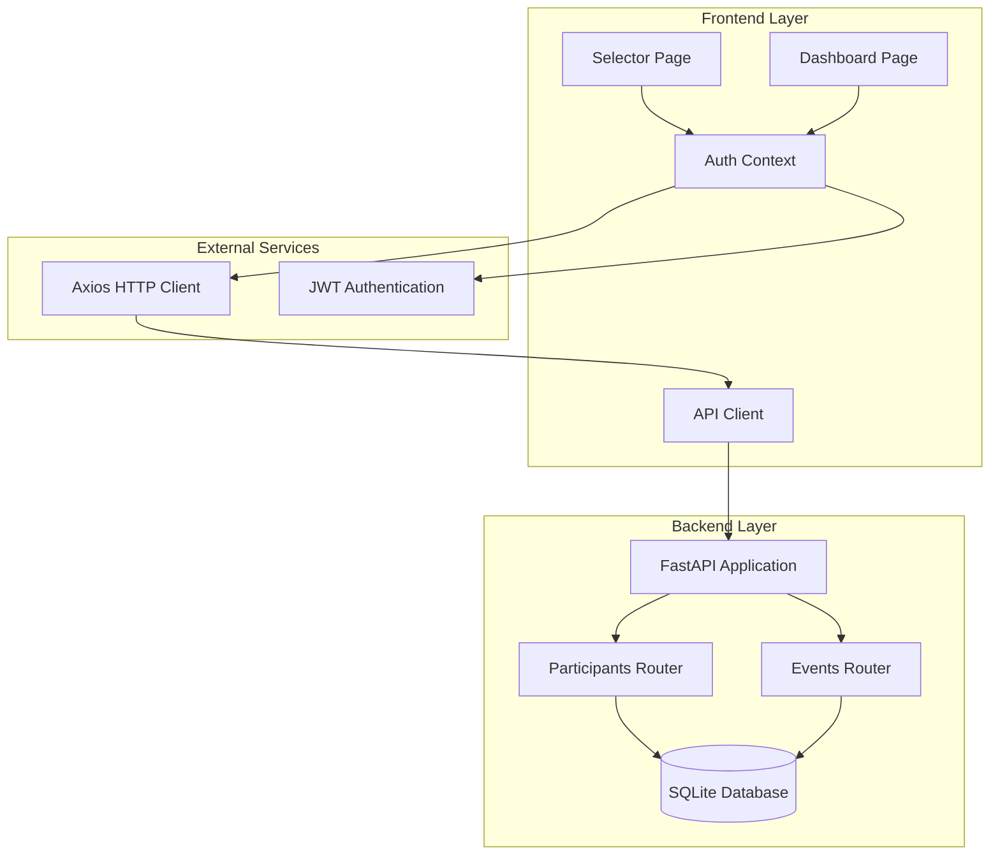

**Diagram sources**
- [frontend/src/pages/juez/Selector.tsx:36-236](file://frontend/src/pages/juez/Selector.tsx#L36-L236)
- [frontend/src/pages/juez/Dashboard.tsx:23-416](file://frontend/src/pages/juez/Dashboard.tsx#L23-L416)
- [main.py:26-44](file://main.py#L26-L44)

The architecture consists of:
- **Frontend**: React-based interface with TypeScript and Tailwind CSS styling
- **Backend**: FastAPI server with SQLAlchemy ORM for database operations
- **Authentication**: JWT-based authentication with role-based access control
- **Data Storage**: SQLite database with comprehensive participant and event management

## Participant Selector Workflow

The participant selector operates through a structured two-step process designed for efficiency and clarity:

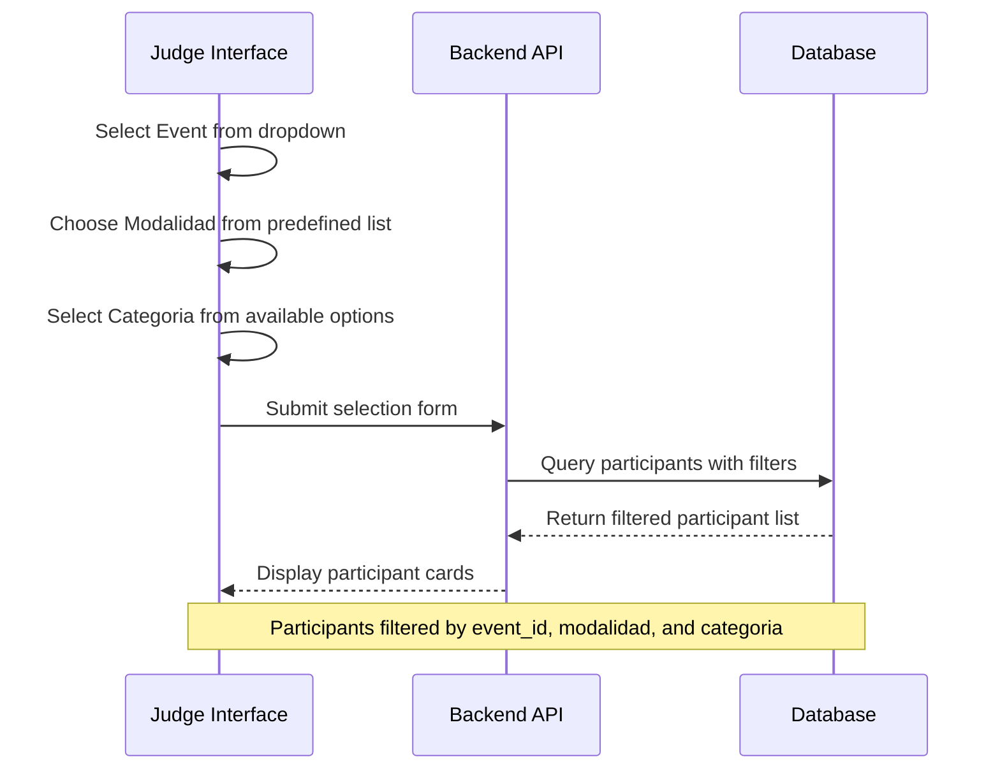

**Diagram sources**
- [frontend/src/pages/juez/Selector.tsx:90-105](file://frontend/src/pages/juez/Selector.tsx#L90-L105)
- [routes/participants.py:289-313](file://routes/participants.py#L289-L313)

### Step 1: Event Selection
The selector begins by loading all active events from the database. Users can choose from a dropdown containing all currently active competitions.

### Step 2: Modalidad and Categoria Selection
Using predefined lists of official modalities and categories, users select the specific competition format and category combination they need to evaluate.

### Step 3: Participant Filtering
The system applies real-time filtering based on the selected criteria, displaying only participants who match all three conditions.

## Core Components

### Backend Components

#### Participants Router
The participants router handles all participant-related operations with comprehensive filtering capabilities:

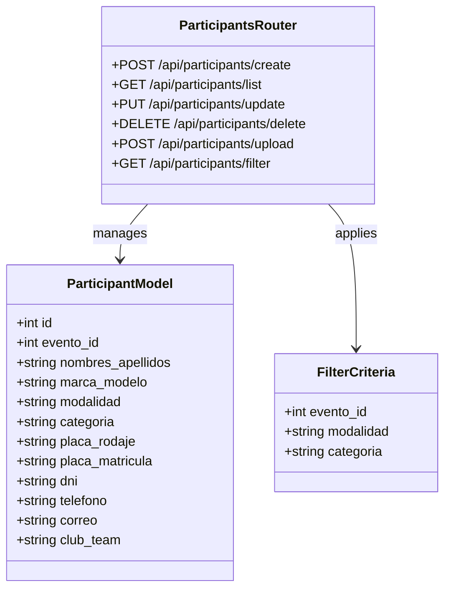

**Diagram sources**
- [routes/participants.py:21-430](file://routes/participants.py#L21-L430)
- [models.py:38-69](file://models.py#L38-L69)

#### Events Management
The events system provides comprehensive event lifecycle management:

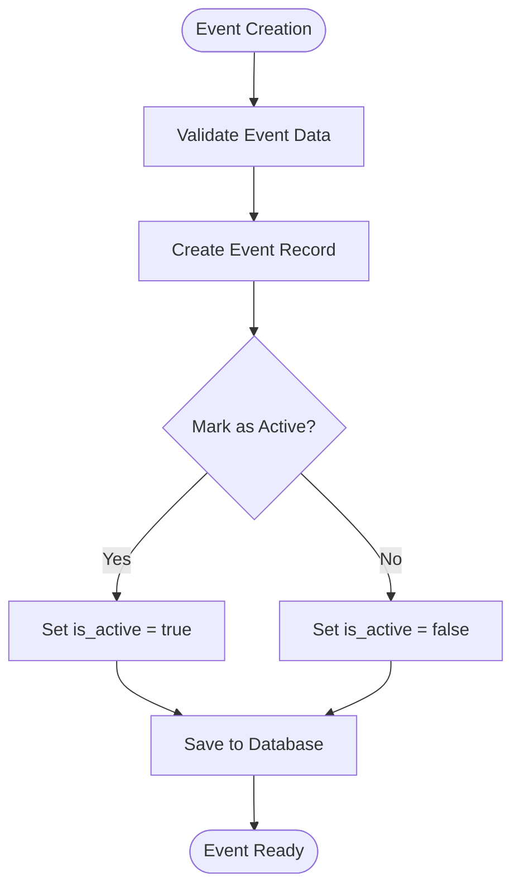

**Diagram sources**
- [routes/events.py:21-35](file://routes/events.py#L21-L35)

### Frontend Components

#### Selector Page Component
The selector page provides an intuitive interface for judge navigation:

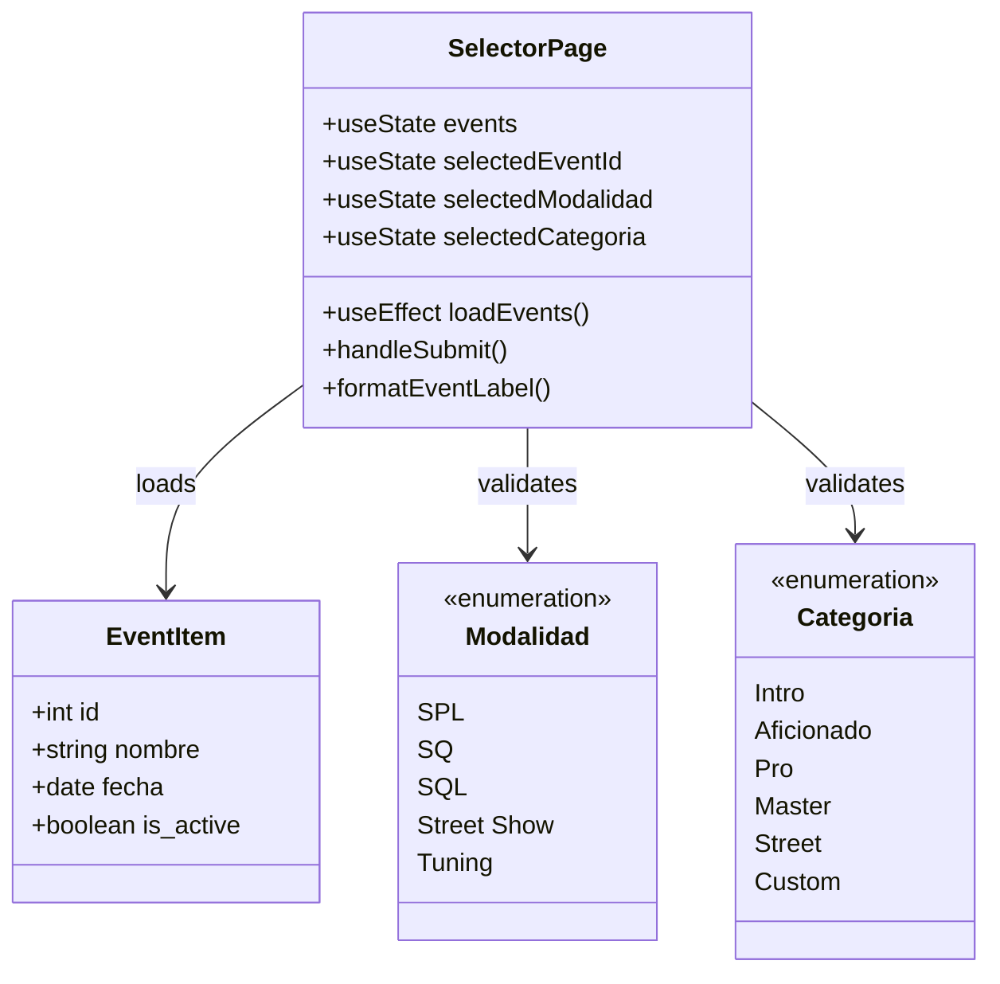

**Diagram sources**
- [frontend/src/pages/juez/Selector.tsx:36-236](file://frontend/src/pages/juez/Selector.tsx#L36-L236)
- [frontend/src/lib/judging.ts:1-64](file://frontend/src/lib/judging.ts#L1-L64)

#### Dashboard Component
The dashboard displays filtered participants with real-time status updates:

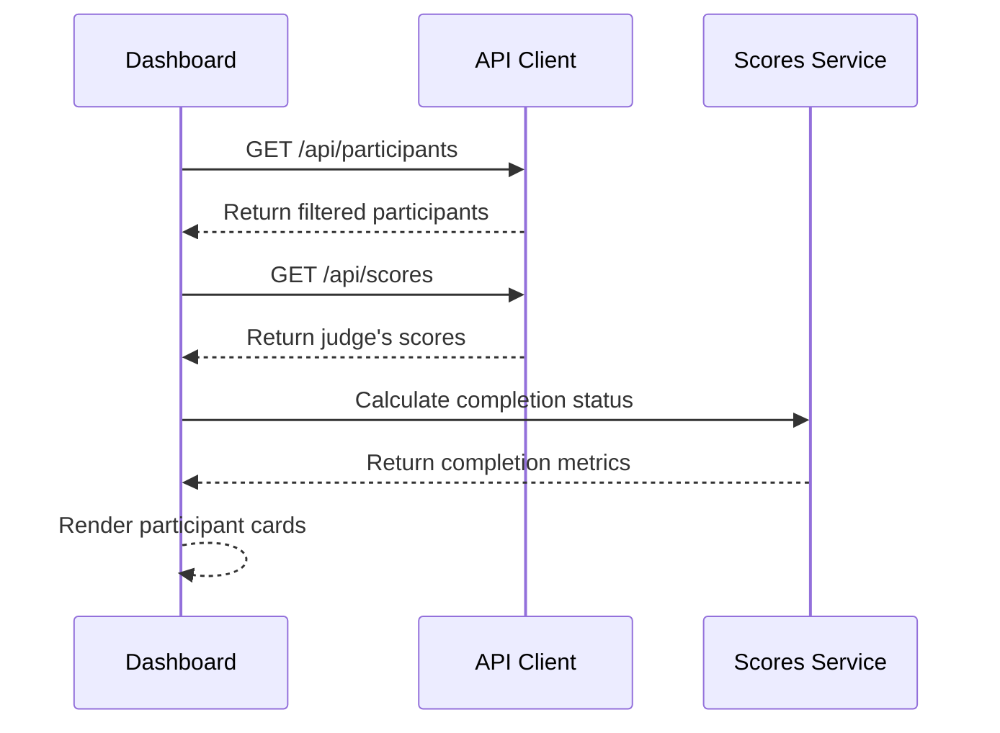

**Diagram sources**
- [frontend/src/pages/juez/Dashboard.tsx:66-118](file://frontend/src/pages/juez/Dashboard.tsx#L66-L118)

## Data Model

The participant data model is designed for comprehensive competition management with strong relationships and constraints:

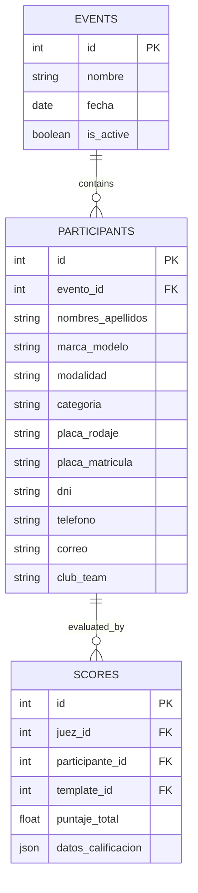

**Diagram sources**
- [models.py:24-101](file://models.py#L24-L101)

### Key Constraints and Relationships
- **Unique Constraint**: Participants are uniquely identified by `(evento_id, placa_rodaje)` combination
- **Event Relationship**: Each participant belongs to exactly one event
- **Cascade Operations**: Deleting an event automatically removes all associated participants and scores
- **Indexing**: Strategic indexing on frequently queried fields (modalidad, categoria, nombres_apellidos)

## API Endpoints

The participant selector exposes several RESTful endpoints for comprehensive participant management:

### GET /api/participants
**Purpose**: Retrieve filtered list of participants based on selection criteria

**Query Parameters**:
- `evento_id`: Filter by specific event
- `modalidad`: Filter by competition modalidad
- `categoria`: Filter by competition category

**Response**: Array of participant objects with scoring status indicators

### POST /api/participants
**Purpose**: Create new participant record

**Request Body**: Participant creation payload with validation

**Response**: Created participant object with full details

### PUT /api/participants/{participant_id}
**Purpose**: Update participant information

**Access Control**: 
- Admin: Full update capability
- Judge: Limited to modalidad and categoria updates

**Response**: Updated participant object

### DELETE /api/participants/{participant_id}
**Purpose**: Remove participant from competition

**Response**: Confirmation message

### POST /api/participants/upload
**Purpose**: Bulk upload participants from Excel spreadsheet

**Features**:
- Automatic column mapping with alias support
- Duplicate detection and validation
- Batch processing with transaction safety

**Response**: Upload summary with created/skipped counts

**Section sources**
- [routes/participants.py:181-430](file://routes/participants.py#L181-L430)

## Frontend Implementation

### Selector Page Features
The selector page provides a streamlined interface for judge navigation:

#### Event Loading and Validation
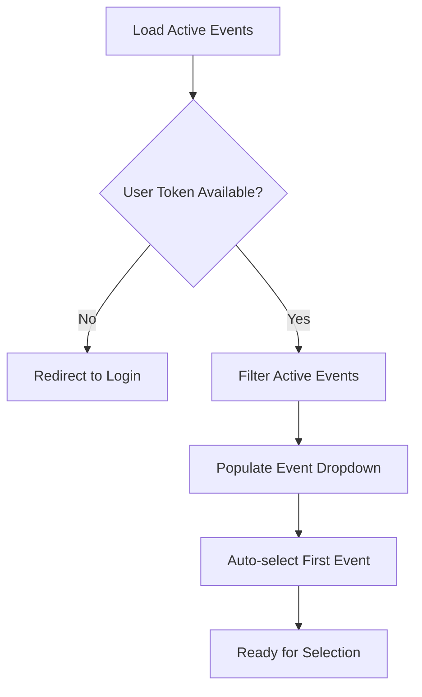

**Diagram sources**
- [frontend/src/pages/juez/Selector.tsx:57-88](file://frontend/src/pages/juez/Selector.tsx#L57-L88)

#### Form Validation and Navigation
The selector implements comprehensive form validation to prevent invalid submissions:

| Field | Validation Rule | Error Message |
|-------|----------------|---------------|
| Event | Required | "Selecciona evento, modalidad y categoría antes de continuar." |
| Modalidad | Required | Same as above |
| Categoria | Required | Same as above |
| Token | Present | Automatic redirect to login |

#### Real-time Selection Preview
The interface provides immediate feedback on current selection with:
- Event name display
- Modalidad and Categoria badges
- Navigation button state changes based on selection completeness

### Dashboard Implementation
The dashboard extends the selector functionality with advanced features:

#### Parallel API Loading
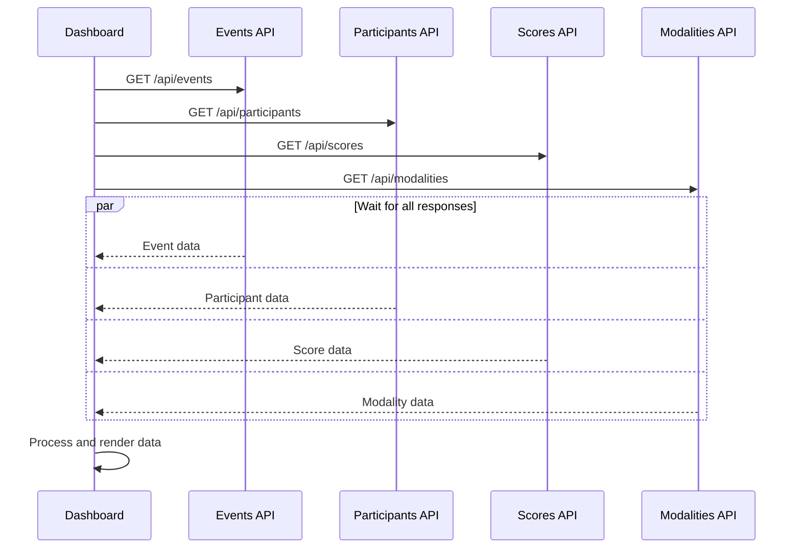

**Diagram sources**
- [frontend/src/pages/juez/Dashboard.tsx:66-92](file://frontend/src/pages/juez/Dashboard.tsx#L66-L92)

#### Completion Tracking
The dashboard implements sophisticated completion tracking:
- Local state management for completed participants
- Real-time progress calculation
- Visual indicators for completion status
- Immediate UI updates after scoring actions

## Security and Access Control

The participant selector implements robust security measures through role-based access control:

### Role-Based Permissions
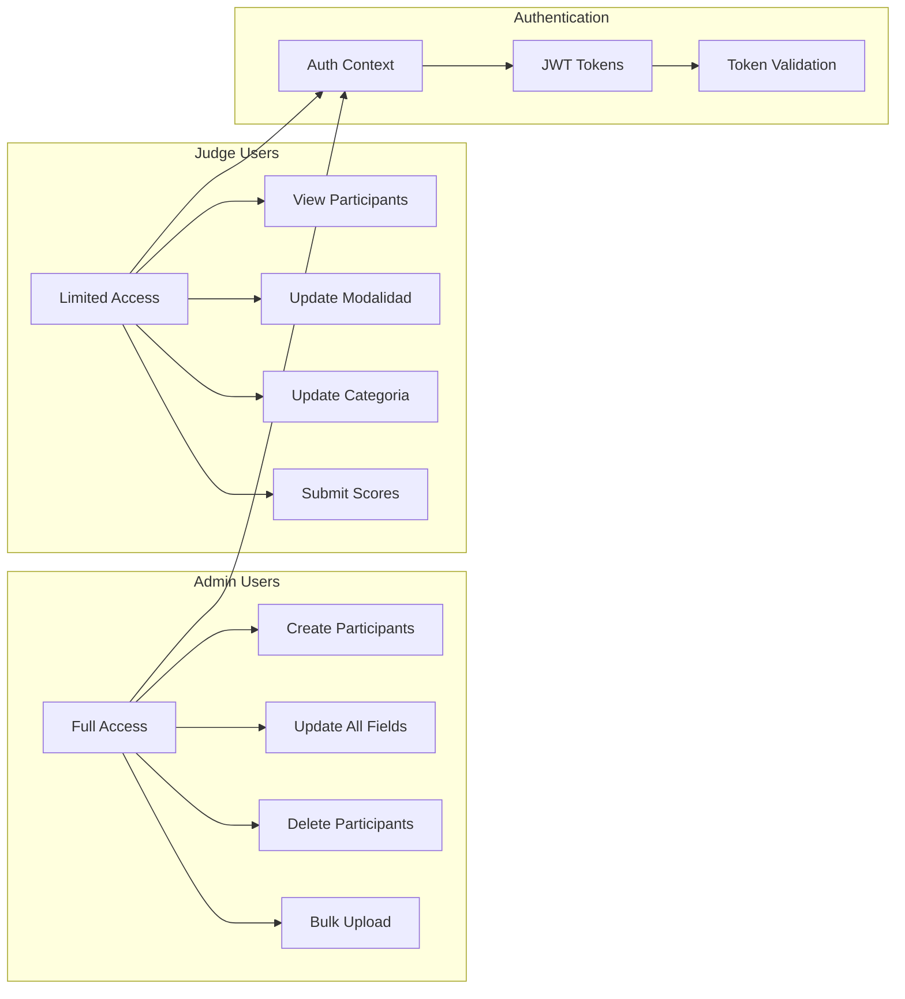

**Diagram sources**
- [frontend/src/contexts/AuthContext.tsx:95-116](file://frontend/src/contexts/AuthContext.tsx#L95-L116)
- [routes/participants.py:202-242](file://routes/participants.py#L202-L242)

### Token-Based Authentication
- **Token Storage**: Secure local storage with automatic parsing
- **Automatic Refresh**: Token-based session management
- **Route Protection**: Middleware protection for all authenticated routes
- **Role Validation**: Dynamic route access based on user roles

### Access Control Implementation
The backend enforces strict access controls:
- **Admin Only**: Participant creation, deletion, and bulk operations
- **Judge Only**: Participant updates restricted to modalidad and categoria
- **Public**: Event listing and basic participant viewing

## Excel Import Functionality

The system provides comprehensive Excel import capabilities for efficient participant management:

### Column Mapping and Normalization
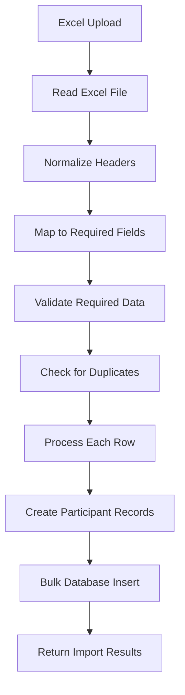

**Diagram sources**
- [routes/participants.py:316-430](file://routes/participants.py#L316-L430)

### Advanced Features
- **Alias Support**: Multiple column name variations for flexibility
- **Duplicate Detection**: Prevention of duplicate participant entries
- **Validation Pipeline**: Comprehensive data validation before insertion
- **Batch Processing**: Efficient bulk operations with transaction safety

### Import Validation Rules
| Field | Required | Validation | Error Handling |
|-------|----------|------------|----------------|
| nombres_apellidos | Yes | Non-empty, length limits | Skip row with reason |
| marca_modelo | Yes | Non-empty, length limits | Skip row with reason |
| modalidad | Yes | Must match official list | Skip row with reason |
| categoria | Yes | Must match official list | Skip row with reason |
| placa_rodaje | Yes | Unique per event | Skip duplicate |
| dni | No | Optional validation | Converted to null if empty |
| telefono | No | Optional validation | Converted to null if empty |
| correo | No | Optional validation | Converted to null if empty |
| club_team | No | Optional validation | Converted to null if empty |

**Section sources**
- [routes/participants.py:23-106](file://routes/participants.py#L23-L106)

## Troubleshooting Guide

### Common Issues and Solutions

#### Authentication Problems
**Issue**: Unable to access participant selector
**Solution**: Verify JWT token validity and refresh session
**Prevention**: Implement automatic token refresh and error handling

#### Network Connectivity Issues
**Issue**: Events fail to load or participants not displaying
**Solution**: Check API endpoint accessibility and CORS configuration
**Prevention**: Implement retry mechanisms and connection health checks

#### Data Validation Errors
**Issue**: Excel import fails with validation errors
**Solution**: Review column headers and data format compliance
**Prevention**: Provide clear error messages and validation feedback

#### Performance Issues
**Issue**: Slow participant list loading
**Solution**: Optimize database queries and implement pagination
**Prevention**: Monitor query performance and add indexing strategies

### Debugging Tools
- **Network Inspector**: Monitor API requests and responses
- **Console Logging**: Track application state and error messages
- **Database Queries**: Monitor SQL execution and performance
- **Authentication Logs**: Verify token validation and role permissions

## Conclusion

The Participant Selector represents a sophisticated yet intuitive solution for managing car audio and tuning competition participants. Its dual-layer architecture ensures both ease of use for judges and robust data management capabilities for administrators.

Key strengths include:
- **Intuitive Two-Step Selection Process**: Streamlined navigation reduces cognitive load
- **Real-Time Filtering**: Immediate participant list updates based on selections
- **Comprehensive Security**: Role-based access control with JWT authentication
- **Flexible Data Management**: Support for both manual entry and bulk Excel imports
- **Responsive Design**: Mobile-first approach with touch-friendly interfaces

The system's modular design facilitates future enhancements while maintaining stability and performance. The comprehensive error handling and validation mechanisms ensure reliable operation under various conditions.

Future development opportunities include advanced filtering capabilities, participant search functionality, and integration with external scheduling systems. The solid foundation established by the current implementation provides an excellent base for these enhancements.