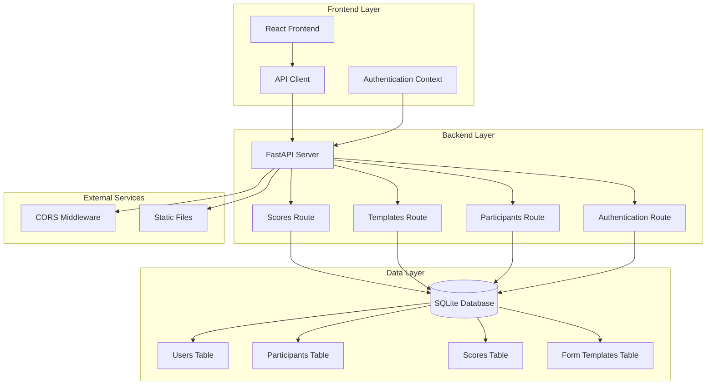
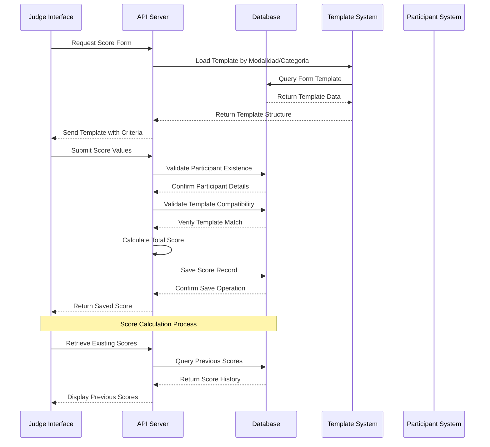
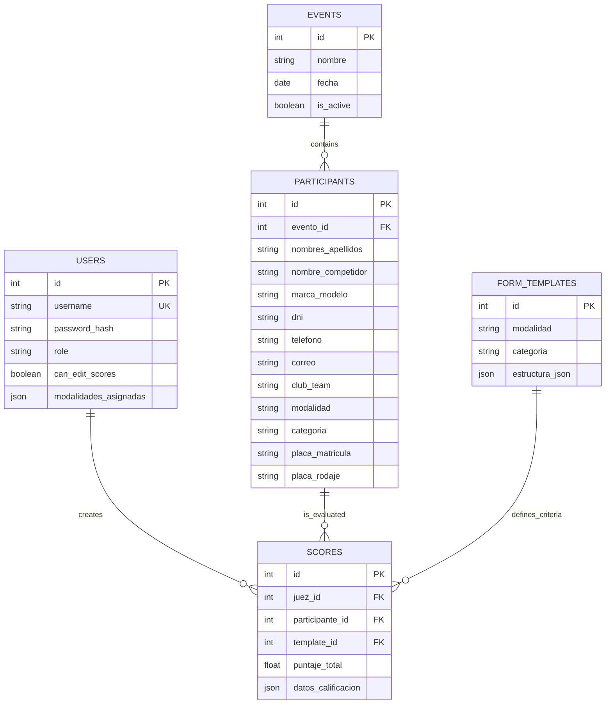
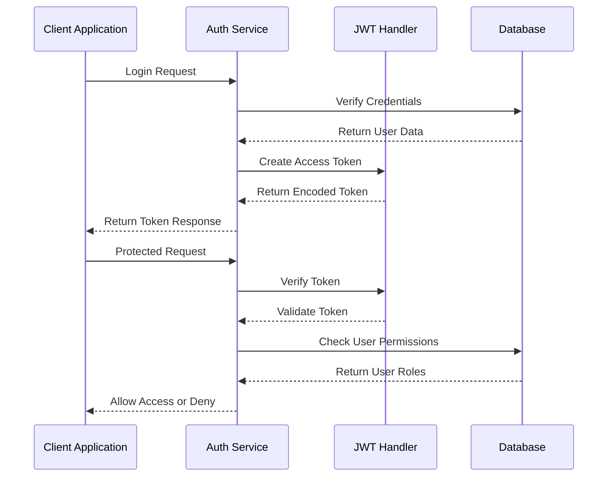

# Scoring Interface

<cite>
**Referenced Files in This Document**
- [main.py](file://main.py)
- [database.py](file://database.py)
- [models.py](file://models.py)
- [schemas.py](file://schemas.py)
- [routes/scores.py](file://routes/scores.py)
- [routes/templates.py](file://routes/templates.py)
- [routes/participants.py](file://routes/participants.py)
- [utils/dependencies.py](file://utils/dependencies.py)
- [utils/security.py](file://utils/security.py)
- [frontend/src/lib/judging.ts](file://frontend/src/lib/judging.ts)
- [frontend/src/lib/api.ts](file://frontend/src/lib/api.ts)
- [frontend/src/pages/juez/Calificar.tsx](file://frontend/src/pages/juez/Calificar.tsx)
- [frontend/src/pages/juez/Dashboard.tsx](file://frontend/src/pages/juez/Dashboard.tsx)
</cite>

## Table of Contents
1. [Introduction](#introduction)
2. [System Architecture](#system-architecture)
3. [Core Components](#core-components)
4. [Scoring Workflow](#scoring-workflow)
5. [Data Model](#data-model)
6. [Frontend Implementation](#frontend-implementation)
7. [Security and Authentication](#security-and-authentication)
8. [API Endpoints](#api-endpoints)
9. [Performance Considerations](#performance-considerations)
10. [Troubleshooting Guide](#troubleshooting-guide)
11. [Conclusion](#conclusion)

## Introduction

The Scoring Interface is a comprehensive system designed for car audio and tuning competitions that enables judges to evaluate participants based on customizable criteria. The system provides a complete workflow from participant selection to score submission and management, with support for multiple competition modalities and categories.

The interface consists of two main components: a backend built with FastAPI and SQLAlchemy for data persistence, and a frontend React application that provides an intuitive scoring interface for judges. The system supports real-time score calculation, template-based evaluation forms, and comprehensive participant management.

## System Architecture

The Scoring Interface follows a modern client-server architecture with clear separation of concerns between the frontend and backend components.

**Diagram sources**
- [main.py:26-44](file://main.py#L26-L44)
- [routes/scores.py:13](file://routes/scores.py#L13)
- [routes/templates.py:10](file://routes/templates.py#L10)
- [routes/participants.py:21](file://routes/participants.py#L21)

The architecture ensures scalability and maintainability through modular design, with each component having specific responsibilities and clear boundaries.

**Section sources**
- [main.py:26-44](file://main.py#L26-L44)
- [database.py:15-34](file://database.py#L15-L34)

## Core Components

### Backend Components

The backend is built using FastAPI, providing automatic OpenAPI documentation and type safety. The core components include:

#### Database Management
The system uses SQLAlchemy ORM with SQLite as the primary database. The database initialization includes automatic migration support for backward compatibility.

#### Routing System
The application uses a modular routing system with separate routers for different functional areas:
- `/api/scores` - Score management and calculation
- `/api/templates` - Evaluation form templates
- `/api/participants` - Participant management
- `/api/auth` - Authentication endpoints

#### Authentication System
Built on JWT tokens with role-based access control supporting both administrators and judges with different permission levels.

### Frontend Components

The frontend is a React application with TypeScript that provides:
- Real-time score calculation interface
- Template-based evaluation forms
- Participant dashboard with completion tracking
- Responsive design for various screen sizes

**Section sources**
- [routes/scores.py:13-132](file://routes/scores.py#L13-L132)
- [routes/templates.py:10-134](file://routes/templates.py#L10-L134)
- [routes/participants.py:21-430](file://routes/participants.py#L21-L430)

## Scoring Workflow

The scoring process follows a structured workflow that ensures accuracy and consistency in evaluation:

**Diagram sources**
- [routes/scores.py:43-114](file://routes/scores.py#L43-L114)
- [frontend/src/pages/juez/Calificar.tsx:121-177](file://frontend/src/pages/juez/Calificar.tsx#L121-L177)

The workflow ensures that each score submission is validated against the participant's modalidad and categoria, preventing mismatches and maintaining data integrity.

**Section sources**
- [routes/scores.py:43-114](file://routes/scores.py#L43-L114)
- [frontend/src/pages/juez/Calificar.tsx:121-177](file://frontend/src/pages/juez/Calificar.tsx#L121-L177)

## Data Model

The system uses a relational database model with clear relationships between entities:

**Diagram sources**
- [models.py:11-101](file://models.py#L11-L101)

The data model supports complex scoring scenarios with flexible template-based evaluation criteria while maintaining referential integrity and efficient querying capabilities.

**Section sources**
- [models.py:11-101](file://models.py#L11-L101)

## Frontend Implementation

The frontend provides a comprehensive interface for judges to manage the scoring process:

### Score Calculation Interface

The scoring interface allows judges to:
- View participant details and vehicle information
- Navigate through evaluation sections
- Adjust scores using increment/decrement controls
- See real-time total score calculation
- Save scores with validation

### Dashboard Features

The judge dashboard provides:
- Participant filtering by event, modalidad, and categoria
- Completion status tracking
- Quick navigation to individual scoring pages
- Batch operations for participant management

### Template-Based Forms

The system supports dynamic form templates that define:
- Section organization
- Criterion definitions with maximum points
- Flexible scoring structures
- Automatic validation

**Section sources**
- [frontend/src/pages/juez/Calificar.tsx:79-398](file://frontend/src/pages/juez/Calificar.tsx#L79-L398)
- [frontend/src/pages/juez/Dashboard.tsx:23-416](file://frontend/src/pages/juez/Dashboard.tsx#L23-L416)
- [frontend/src/lib/judging.ts:39-64](file://frontend/src/lib/judging.ts#L39-L64)

## Security and Authentication

The system implements robust security measures:

### Authentication Flow

**Diagram sources**
- [utils/dependencies.py:16-71](file://utils/dependencies.py#L16-L71)
- [utils/security.py:32-42](file://utils/security.py#L32-L42)

### Role-Based Access Control

The system supports two primary roles:
- **Administrator**: Full system access, template management, user administration
- **Judge**: Limited access focused on scoring activities, participant updates

### Token Management

JWT tokens include expiration handling and automatic validation for secure API communication.

**Section sources**
- [utils/dependencies.py:16-71](file://utils/dependencies.py#L16-L71)
- [utils/security.py:32-42](file://utils/security.py#L32-L42)

## API Endpoints

The system exposes RESTful APIs organized by functional areas:

### Scoring Endpoints

| Endpoint | Method | Description | Authentication |
|----------|--------|-------------|----------------|
| `/api/scores` | POST | Create or update score | Judge |
| `/api/scores` | GET | List all scores | User |
| `/api/scores/{id}` | GET | Get specific score | User |
| `/api/scores/participant/{participant_id}` | GET | Get scores for participant | User |

### Template Endpoints

| Endpoint | Method | Description | Authentication |
|----------|--------|-------------|----------------|
| `/api/templates` | GET | List all templates | User |
| `/api/templates` | POST | Create/update template | Admin |
| `/api/templates/{template_id}` | GET | Get template by ID | User |
| `/api/templates/{modalidad}/{categoria}` | GET | Get template by modalidad/categoria | User |

### Participant Endpoints

| Endpoint | Method | Description | Authentication |
|----------|--------|-------------|----------------|
| `/api/participants` | GET | List participants | User |
| `/api/participants` | POST | Create participant | Admin |
| `/api/participants/{id}` | PUT | Update participant | Admin/Judge |
| `/api/participants/upload` | POST | Bulk upload participants | Admin |

**Section sources**
- [routes/scores.py:43-132](file://routes/scores.py#L43-L132)
- [routes/templates.py:13-134](file://routes/templates.py#L13-L134)
- [routes/participants.py:289-430](file://routes/participants.py#L289-L430)

## Performance Considerations

The system is designed with several performance optimizations:

### Database Optimization
- Indexes on frequently queried fields (modalidad, categoria, evento_id)
- Efficient JOIN operations for score retrieval
- Connection pooling for database operations
- Lazy loading for related entities

### Frontend Performance
- Memoization of calculated totals
- Efficient state management
- Debounced API calls
- Optimized rendering for large participant lists

### Caching Strategies
- Template caching for repeated access
- Score history caching
- User session management

## Troubleshooting Guide

### Common Issues and Solutions

**Score Validation Errors**
- **Issue**: Template mismatch with participant modalidad/categoria
- **Solution**: Verify template assignment matches participant classification
- **Prevention**: Implement template validation before score submission

**Authentication Problems**
- **Issue**: 401 Unauthorized errors
- **Solution**: Refresh authentication token or re-login
- **Prevention**: Implement automatic token refresh

**Database Migration Issues**
- **Issue**: Column missing errors during startup
- **Solution**: Run database migrations automatically
- **Prevention**: Ensure proper database initialization sequence

**Frontend Loading Issues**
- **Issue**: Slow participant list loading
- **Solution**: Implement pagination or virtual scrolling
- **Prevention**: Optimize API queries and caching

**Section sources**
- [routes/scores.py:50-67](file://routes/scores.py#L50-L67)
- [database.py:36-93](file://database.py#L36-L93)

## Conclusion

The Scoring Interface provides a robust, scalable solution for managing car audio and tuning competition evaluations. The system combines modern web technologies with careful architectural design to deliver a reliable platform for judges while maintaining data integrity and security.

Key strengths of the system include:
- Modular architecture supporting easy maintenance and extension
- Comprehensive validation and error handling
- Flexible template-based scoring system
- Real-time collaboration features
- Strong security foundation with role-based access control

The system is well-positioned for future enhancements, including expanded modalities, additional scoring criteria, and integration with external systems for comprehensive competition management.