# Modality Management System

<cite>
**Referenced Files in This Document**
- [main.py](file://main.py)
- [models.py](file://models.py)
- [schemas.py](file://schemas.py)
- [database.py](file://database.py)
- [routes/modalities.py](file://routes/modalities.py)
- [routes/categories.py](file://routes/categories.py)
- [routes/events.py](file://routes/events.py)
- [routes/participants.py](file://routes/participants.py)
- [utils/dependencies.py](file://utils/dependencies.py)
- [frontend/src/App.tsx](file://frontend/src/App.tsx)
- [frontend/src/pages/juez/Dashboard.tsx](file://frontend/src/pages/juez/Dashboard.tsx)
- [frontend/src/contexts/AuthContext.tsx](file://frontend/src/contexts/AuthContext.tsx)
- [frontend/src/lib/api.ts](file://frontend/src/lib/api.ts)
</cite>

## Table of Contents
1. [Introduction](#introduction)
2. [System Architecture](#system-architecture)
3. [Core Components](#core-components)
4. [Database Schema](#database-schema)
5. [API Endpoints](#api-endpoints)
6. [Frontend Implementation](#frontend-implementation)
7. [Authentication & Authorization](#authentication--authorization)
8. [Data Management](#data-management)
9. [Error Handling](#error-handling)
10. [Deployment & Configuration](#deployment--configuration)
11. [Troubleshooting Guide](#troubleshooting-guide)
12. [Conclusion](#conclusion)

## Introduction

The Modality Management System is a comprehensive judging platform designed for car audio and tuning competitions. This system provides a complete solution for managing competition modalities, categories, participants, scoring, and administrative functions. Built with FastAPI for the backend and React for the frontend, it offers a modern web interface for judges and administrators to manage complex multi-modal competitions efficiently.

The system supports multiple competition formats including intro, amateur, professional, and master categories, with flexible scoring mechanisms and real-time participant management capabilities. It features role-based access control, automated data validation, and comprehensive reporting functionality.

## System Architecture

The Modality Management System follows a clean architecture pattern with clear separation between frontend and backend components:

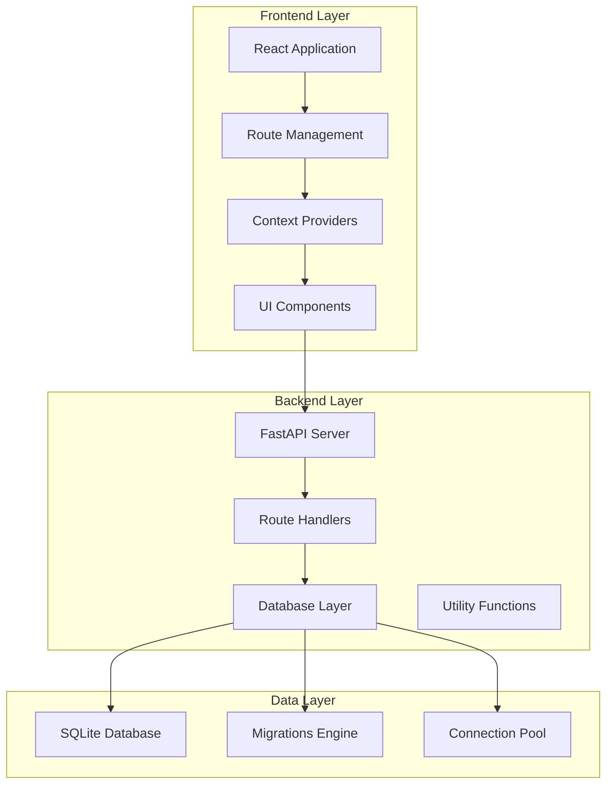

**Diagram sources**
- [main.py:1-59](file://main.py#L1-L59)
- [database.py:1-193](file://database.py#L1-L193)

The architecture consists of three main layers:

- **Presentation Layer**: React-based frontend with route protection and context management
- **Application Layer**: FastAPI backend with modular route handlers and dependency injection
- **Data Layer**: SQLite database with automatic migrations and robust data integrity

**Section sources**
- [main.py:1-59](file://main.py#L1-L59)
- [database.py:1-193](file://database.py#L1-L193)

## Core Components

### Backend Application Structure

The backend application is built around several core components that work together to provide comprehensive competition management:

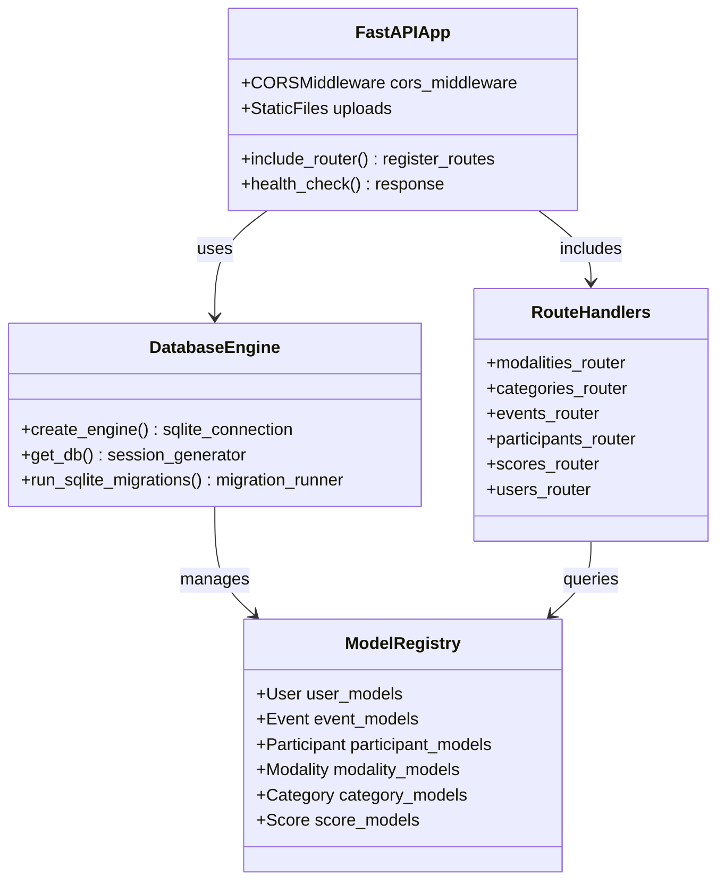

**Diagram sources**
- [main.py:1-59](file://main.py#L1-L59)
- [database.py:1-193](file://database.py#L1-L193)
- [models.py:1-225](file://models.py#L1-L225)

### Frontend Application Structure

The frontend application provides a responsive interface with role-based navigation and comprehensive form handling:

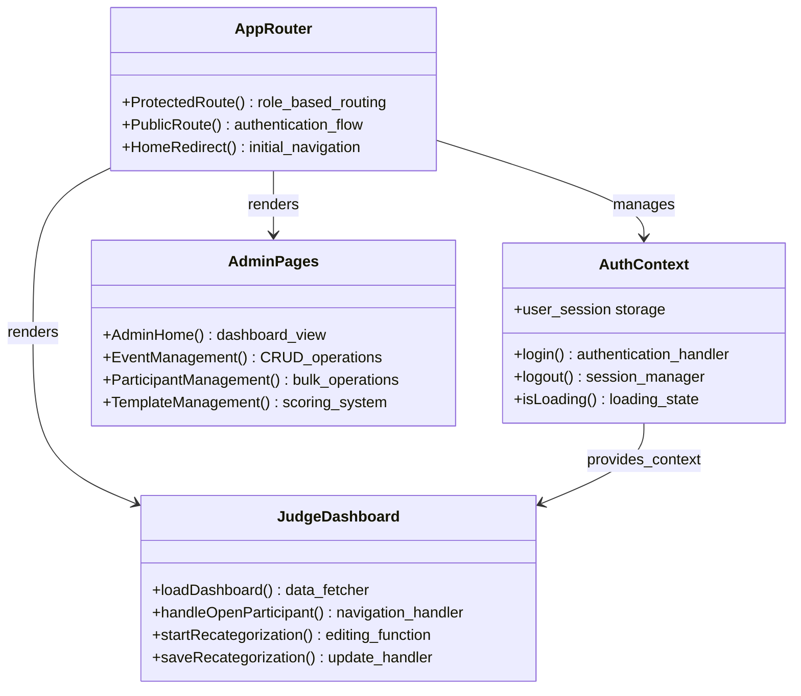

**Diagram sources**
- [frontend/src/App.tsx:1-130](file://frontend/src/App.tsx#L1-L130)
- [frontend/src/contexts/AuthContext.tsx:1-144](file://frontend/src/contexts/AuthContext.tsx#L1-L144)
- [frontend/src/pages/juez/Dashboard.tsx:1-416](file://frontend/src/pages/juez/Dashboard.tsx#L1-L416)

**Section sources**
- [main.py:1-59](file://main.py#L1-L59)
- [frontend/src/App.tsx:1-130](file://frontend/src/App.tsx#L1-L130)

## Database Schema

The system uses a relational database design optimized for competition management with clear relationships between entities:

```mermaid
erDiagram
USERS {
int id PK
string username UK
string password_hash
string role
boolean can_edit_scores
json modalidades_asignadas
}
EVENTS {
int id PK
string nombre
date fecha
boolean is_active
}
PARTICIPANTS {
int id PK
int evento_id FK
string nombres_apellidos
string nombre_competidor
string marca_modelo
string dni
string telefono
string correo
string club_team
int category_id FK
string modalidad
string categoria
string placa_matricula
string placa_rodaje
}
MODALITIES {
int id PK
string nombre UK
}
CATEGORIES {
int id PK
string nombre
int level
int modality_id FK
}
SCORES {
int id PK
int juez_id FK
int participante_id FK
int template_id FK
float puntaje_total
json datos_calificacion
}
EVALUATION_TEMPLATES {
int id PK
int modality_id FK UK
json content
}
JUDGE_ASSIGNMENTS {
int id PK
int user_id FK
int modality_id FK
json assigned_sections
boolean is_principal
}
SCORE_CARDS {
int id PK
int participant_id FK UK
int template_id FK
json answers
string status
int calculated_level
float total_score
}
REGULATIONS {
int id PK
string titulo
string modalidad
string archivo_url
}
USERS ||--o{ SCORES : judges
USERS ||--o{ JUDGE_ASSIGNMENTS : assigns
EVENTS ||--o{ PARTICIPANTS : hosts
MODALITIES ||--o{ CATEGORIES : contains
CATEGORIES ||--o{ PARTICIPANTS : organizes
MODALITIES ||--o{ EVALUATION_TEMPLATES : defines
EVALUATION_TEMPLATES ||--o{ SCORE_CARDS : creates
PARTICIPANTS ||--o{ SCORES : scored_by
PARTICIPANTS ||--o{ SCORE_CARDS : evaluated_in
```

**Diagram sources**
- [models.py:11-225](file://models.py#L11-L225)

The schema supports complex competition structures with hierarchical categories, flexible scoring systems, and comprehensive participant tracking. Key features include:

- **Hierarchical Categories**: Modalities contain categories, which can contain subcategories
- **Flexible Scoring**: Separate scoring system with evaluation templates
- **Multi-modal Support**: Participants can compete in multiple modalities
- **Role-based Access**: Different permissions for admins and judges

**Section sources**
- [models.py:11-225](file://models.py#L11-L225)
- [database.py:36-193](file://database.py#L36-L193)

## API Endpoints

The system provides a comprehensive REST API organized into logical modules:

### Authentication & User Management

| Endpoint | Method | Description | Required Role |
|----------|--------|-------------|---------------|
| `/api/login` | POST | User authentication | Public |
| `/api/users` | GET | List all users | Admin |
| `/api/users` | POST | Create new user | Admin |
| `/api/users/{id}` | PUT | Update user | Admin |
| `/api/users/{id}` | DELETE | Delete user | Admin |

### Event Management

| Endpoint | Method | Description | Required Role |
|----------|--------|-------------|---------------|
| `/api/events` | GET | List all events | User |
| `/api/events` | POST | Create new event | Admin |
| `/api/events/{id}` | PATCH | Partial update | Admin |
| `/api/events/{id}` | PUT | Full update | Admin |
| `/api/events/{id}` | DELETE | Delete event | Admin |

### Modality & Category Management

| Endpoint | Method | Description | Required Role |
|----------|--------|-------------|---------------|
| `/api/modalities` | GET | List modalities | User |
| `/api/modalities` | POST | Create modality | Admin |
| `/api/modalities/{id}` | DELETE | Delete modality | Admin |
| `/api/modalities/{modality_id}/categories` | POST | Create category | Admin |
| `/api/modalities/categories/{id}` | DELETE | Delete category | Admin |

### Participant Management

| Endpoint | Method | Description | Required Role |
|----------|--------|-------------|---------------|
| `/api/participants` | GET | List participants | User |
| `/api/participants` | POST | Add participant | Admin |
| `/api/participants/{id}` | PUT | Update participant | User |
| `/api/participants/{id}` | DELETE | Remove participant | Admin |
| `/api/participants/upload` | POST | Bulk upload Excel | Admin |

### Scoring & Evaluation

| Endpoint | Method | Description | Required Role |
|----------|--------|-------------|---------------|
| `/api/scores` | GET | List scores | User |
| `/api/scores` | POST | Record score | Judge |
| `/api/scores/{id}` | PUT | Update score | Judge/Admin |
| `/api/scorecards` | GET | List scorecards | User |
| `/api/scorecards` | POST | Create scorecard | Judge |
| `/api/scorecards/{id}` | PUT | Update scorecard | Judge/Admin |

**Section sources**
- [routes/modalities.py:1-196](file://routes/modalities.py#L1-L196)
- [routes/events.py:1-116](file://routes/events.py#L1-L116)
- [routes/participants.py:1-430](file://routes/participants.py#L1-L430)

## Frontend Implementation

The frontend application provides a comprehensive interface for both administrators and judges:

### Route Protection & Navigation

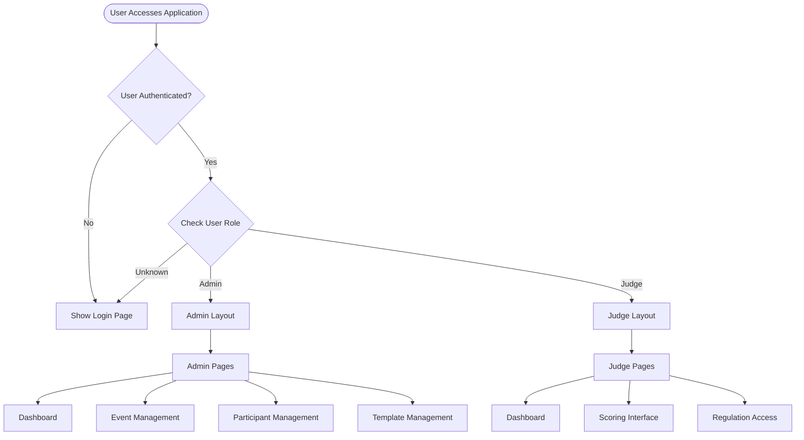

**Diagram sources**
- [frontend/src/App.tsx:1-130](file://frontend/src/App.tsx#L1-L130)

### Authentication Flow

The authentication system implements a secure token-based approach:

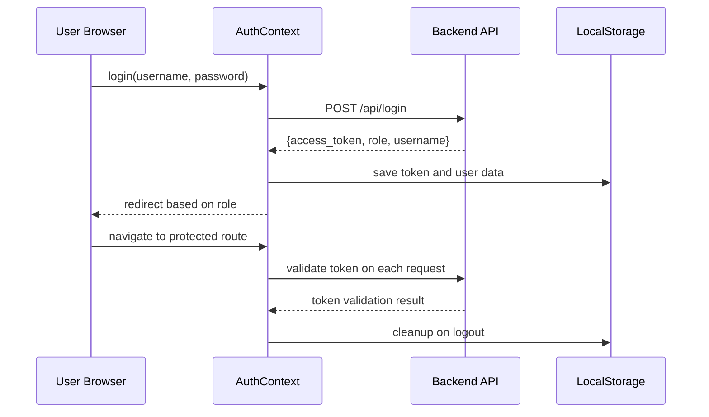

**Diagram sources**
- [frontend/src/contexts/AuthContext.tsx:95-111](file://frontend/src/contexts/AuthContext.tsx#L95-L111)
- [frontend/src/lib/api.ts:16-22](file://frontend/src/lib/api.ts#L16-L22)

### Judge Dashboard Features

The judge dashboard provides comprehensive participant management:

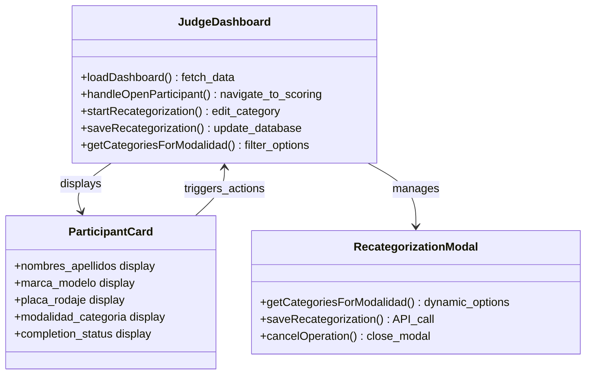

**Diagram sources**
- [frontend/src/pages/juez/Dashboard.tsx:23-416](file://frontend/src/pages/juez/Dashboard.tsx#L23-L416)

**Section sources**
- [frontend/src/App.tsx:1-130](file://frontend/src/App.tsx#L1-L130)
- [frontend/src/contexts/AuthContext.tsx:1-144](file://frontend/src/contexts/AuthContext.tsx#L1-L144)
- [frontend/src/pages/juez/Dashboard.tsx:1-416](file://frontend/src/pages/juez/Dashboard.tsx#L1-L416)

## Authentication & Authorization

The system implements a robust role-based access control system:

### Role Definitions

| Role | Permissions | Access Level |
|------|-------------|--------------|
| **Admin** | Full system access, user management, event creation | Highest |
| **Judge** | Participant scoring, category updates, regulation access | Standard |

### Token-Based Authentication

The authentication system uses JWT tokens with automatic validation:

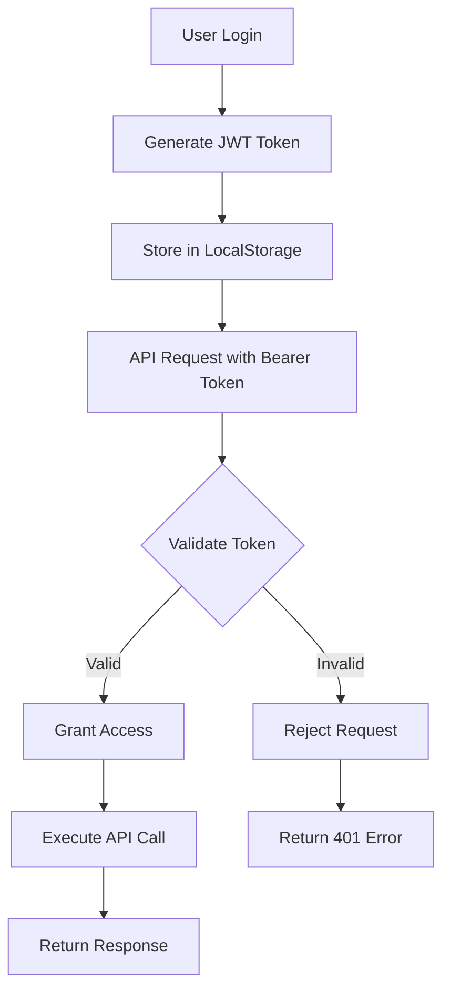

**Diagram sources**
- [utils/dependencies.py:16-71](file://utils/dependencies.py#L16-L71)

### Route Protection

Routes are protected using dependency injection:

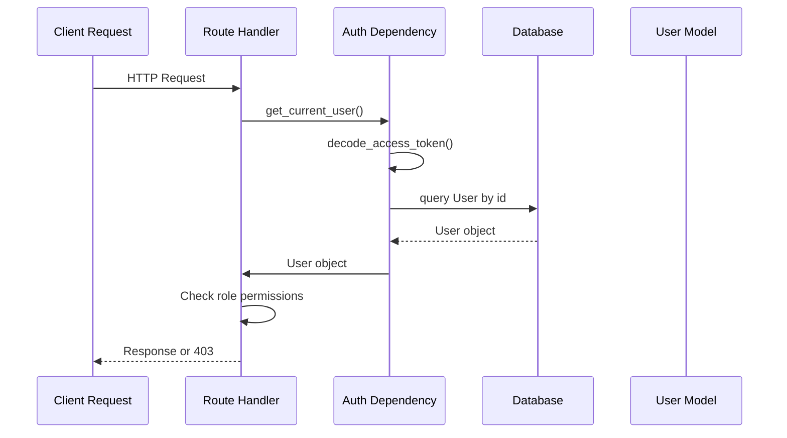

**Diagram sources**
- [utils/dependencies.py:50-71](file://utils/dependencies.py#L50-L71)

**Section sources**
- [utils/dependencies.py:1-71](file://utils/dependencies.py#L1-L71)

## Data Management

### Excel Import System

The system provides advanced Excel import capabilities for bulk participant management:

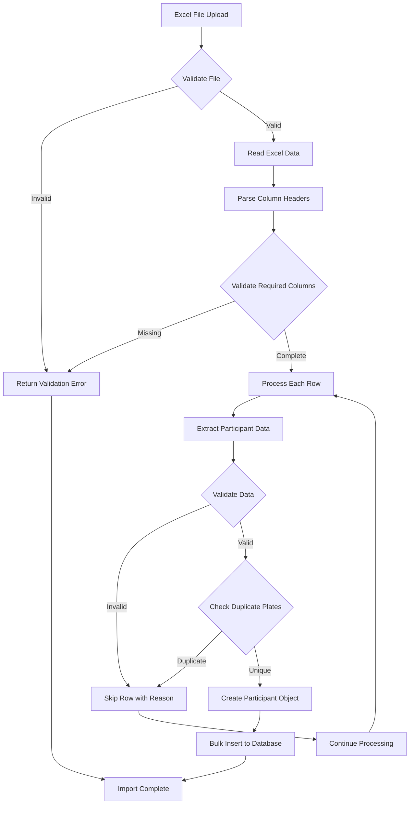

**Diagram sources**
- [routes/participants.py:316-430](file://routes/participants.py#L316-L430)

### Data Validation & Normalization

The system implements comprehensive data validation:

| Field | Validation Rules | Purpose |
|-------|------------------|---------|
| Username | 3-100 characters, unique | User identification |
| Password | 4-128 characters | Security credential |
| Participant Name | 1-150 characters | Competitor identity |
| Vehicle Brand | 1-150 characters | Vehicle specification |
| License Plate | 1-50 characters | Unique identifier |
| Modality | 1-100 characters | Competition type |
| Category | 1-100 characters | Skill level grouping |

**Section sources**
- [routes/participants.py:1-430](file://routes/participants.py#L1-L430)
- [schemas.py:1-303](file://schemas.py#L1-L303)

## Error Handling

The system implements comprehensive error handling across all layers:

### HTTP Status Codes

| Status Code | Error Type | Description |
|-------------|------------|-------------|
| 200 | Success | Operation completed successfully |
| 201 | Created | Resource created successfully |
| 400 | Bad Request | Invalid request data |
| 401 | Unauthorized | Invalid or missing authentication |
| 403 | Forbidden | Insufficient permissions |
| 404 | Not Found | Resource does not exist |
| 409 | Conflict | Data conflict detected |
| 500 | Internal Error | Server-side error occurred |

### Error Response Format

All errors follow a consistent format:

```json
{
  "detail": "Descriptive error message",
  "code": "ERROR_CODE",
  "timestamp": "2024-01-01T00:00:00Z"
}
```

### Frontend Error Handling

The frontend provides user-friendly error messages:

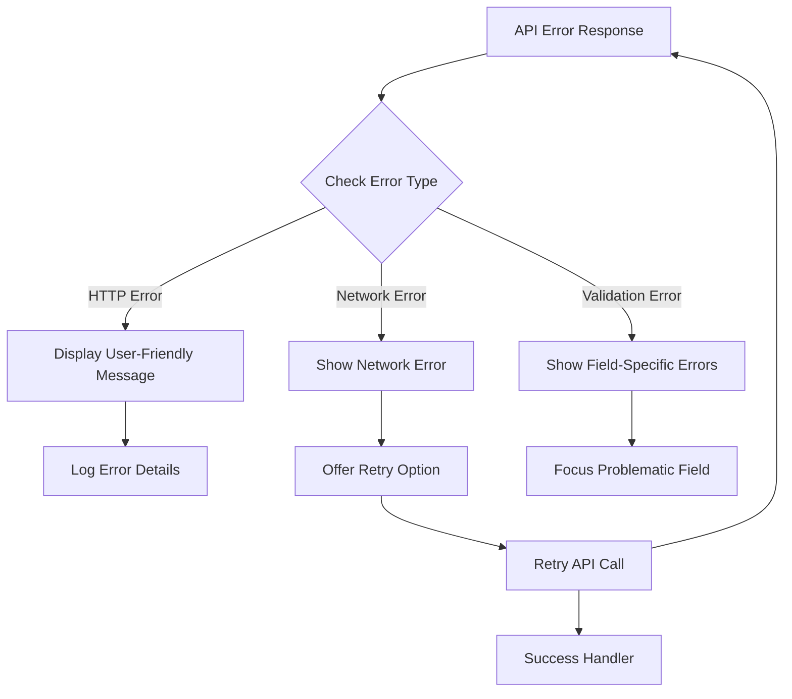

**Diagram sources**
- [frontend/src/lib/api.ts:24-41](file://frontend/src/lib/api.ts#L24-L41)

**Section sources**
- [frontend/src/lib/api.ts:1-41](file://frontend/src/lib/api.ts#L1-L41)

## Deployment & Configuration

### Database Migration System

The system includes an automated migration system for database schema updates:

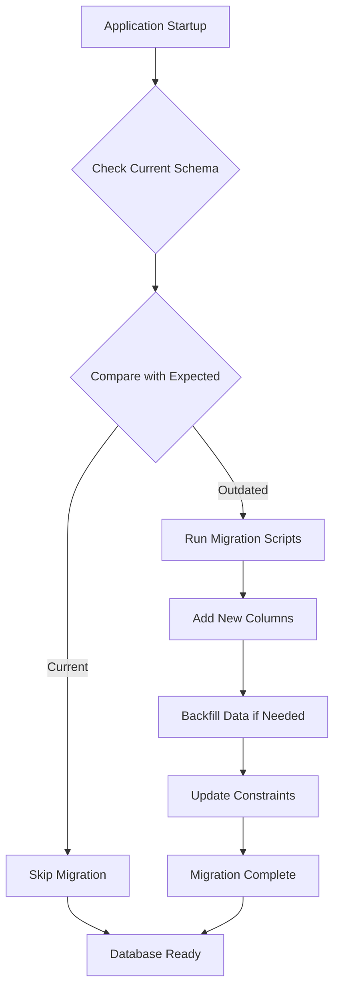

**Diagram sources**
- [database.py:36-193](file://database.py#L36-L193)

### Environment Configuration

The system supports flexible deployment configurations:

| Environment Variable | Purpose | Default Value |
|---------------------|---------|---------------|
| `DATABASE_URL` | Database connection string | `sqlite:///app.db` |
| `API_BASE_URL` | Backend API base URL | Auto-detected |
| `ALLOWED_ORIGINS` | CORS allowed origins | `*` |

### Static File Serving

The system serves uploaded files through a dedicated static file handler:

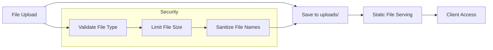

**Diagram sources**
- [main.py:52-53](file://main.py#L52-L53)

**Section sources**
- [database.py:36-193](file://database.py#L36-L193)
- [main.py:1-59](file://main.py#L1-L59)

## Troubleshooting Guide

### Common Issues & Solutions

#### Authentication Problems
- **Issue**: Users cannot log in
- **Solution**: Verify credentials and check token validity
- **Debug**: Check `/api/login` endpoint response

#### Database Connection Issues
- **Issue**: Application fails to start
- **Solution**: Verify database file permissions and path
- **Debug**: Check SQLite database connectivity

#### Excel Import Failures
- **Issue**: Excel uploads fail validation
- **Solution**: Ensure required columns are present and properly formatted
- **Debug**: Review import error messages for specific field issues

#### Permission Denied Errors
- **Issue**: 403 Forbidden responses
- **Solution**: Verify user role and required permissions
- **Debug**: Check role-based route protection

### Performance Optimization

#### Database Indexing
- Ensure proper indexing on frequently queried fields
- Monitor query performance with SQL profiling tools

#### Frontend Performance
- Implement lazy loading for large datasets
- Optimize image and file handling
- Use efficient React component rendering

#### API Response Optimization
- Implement pagination for large result sets
- Use selective field retrieval
- Cache frequently accessed data

**Section sources**
- [routes/participants.py:316-430](file://routes/participants.py#L316-L430)
- [utils/dependencies.py:32-47](file://utils/dependencies.py#L32-L47)

## Conclusion

The Modality Management System provides a comprehensive solution for organizing and managing car audio and tuning competitions. Its modular architecture, robust data management, and user-friendly interface make it suitable for various competition formats and scales.

Key strengths of the system include:

- **Flexible Competition Structure**: Support for multiple modalities, categories, and subcategories
- **Role-based Access Control**: Secure multi-user environment with appropriate permissions
- **Automated Data Management**: Excel import capabilities and database migration system
- **Modern Web Interface**: Responsive React application with intuitive user experience
- **Robust Error Handling**: Comprehensive error management across all system layers

The system is designed for scalability and maintainability, with clear separation of concerns and comprehensive documentation. Future enhancements could include advanced reporting features, real-time collaboration tools, and expanded integration capabilities.