# Regulation Management System

<cite>
**Referenced Files in This Document**
- [main.py](file://main.py)
- [models.py](file://models.py)
- [schemas.py](file://schemas.py)
- [database.py](file://database.py)
- [init_db.py](file://init_db.py)
- [routes/regulations.py](file://routes/regulations.py)
- [routes/participants.py](file://routes/participants.py)
- [routes/users.py](file://routes/users.py)
- [routes/templates.py](file://routes/templates.py)
- [routes/events.py](file://routes/events.py)
- [utils/dependencies.py](file://utils/dependencies.py)
- [utils/security.py](file://utils/security.py)
- [frontend/src/pages/admin/Reglamentos.tsx](file://frontend/src/pages/admin/Reglamentos.tsx)
- [frontend/src/pages/juez/Reglamentos.tsx](file://frontend/src/pages/juez/Reglamentos.tsx)
- [frontend/src/lib/api.ts](file://frontend/src/lib/api.ts)
</cite>

## Table of Contents
1. [Introduction](#introduction)
2. [System Architecture](#system-architecture)
3. [Core Components](#core-components)
4. [Database Schema](#database-schema)
5. [API Endpoints](#api-endpoints)
6. [Frontend Implementation](#frontend-implementation)
7. [Security Model](#security-model)
8. [Data Flow Analysis](#data-flow-analysis)
9. [Performance Considerations](#performance-considerations)
10. [Troubleshooting Guide](#troubleshooting-guide)
11. [Conclusion](#conclusion)

## Introduction

The Regulation Management System is a comprehensive web application designed for managing car audio and tuning competition regulations. The system provides a centralized platform for administrators to upload, manage, and distribute official competition regulations to judges and participants. Built with a modern tech stack featuring FastAPI for the backend and React for the frontend, the application supports PDF regulation management, participant registration, scoring systems, and administrative controls.

The system serves two primary user roles: administrators who can upload and manage regulations, and judges who can access regulations filtered by their assigned modalities. The application ensures data integrity through comprehensive validation, secure authentication, and robust database migrations.

## System Architecture

The Regulation Management System follows a client-server architecture with clear separation of concerns between the frontend and backend components.

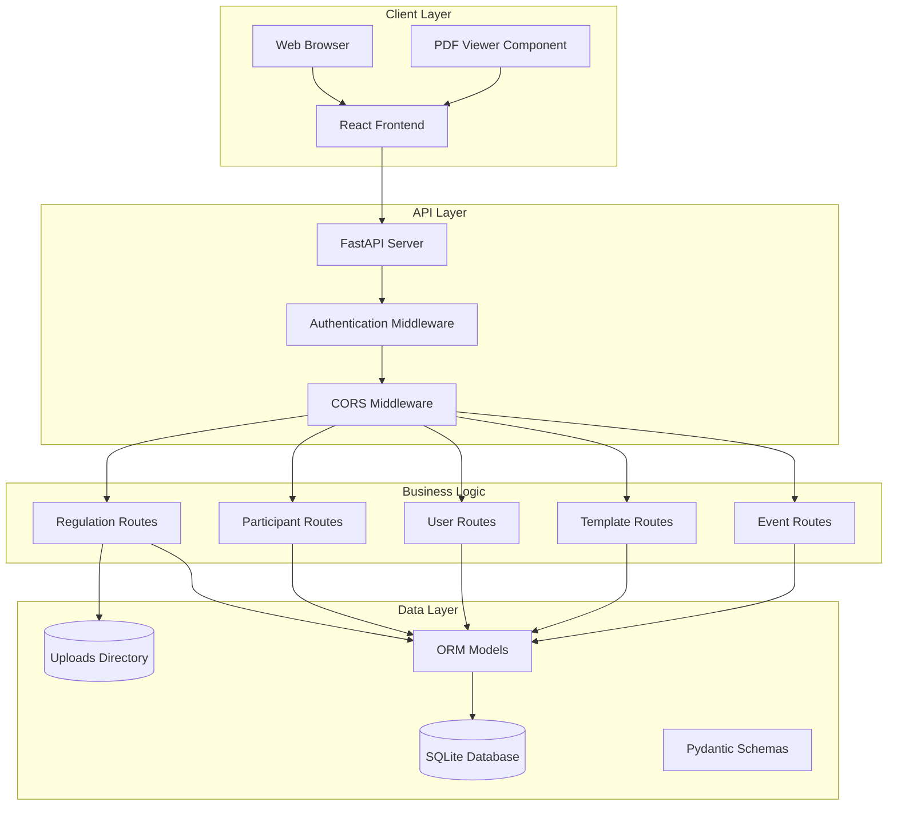

**Diagram sources**
- [main.py:29-59](file://main.py#L29-L59)
- [routes/regulations.py:15-110](file://routes/regulations.py#L15-L110)
- [database.py:15-34](file://database.py#L15-L34)

**Section sources**
- [main.py:1-59](file://main.py#L1-L59)
- [database.py:1-193](file://database.py#L1-L193)

## Core Components

### Backend Application Structure

The backend is built using FastAPI, providing automatic API documentation and type safety. The application initializes database connections, configures middleware, and registers all route handlers.

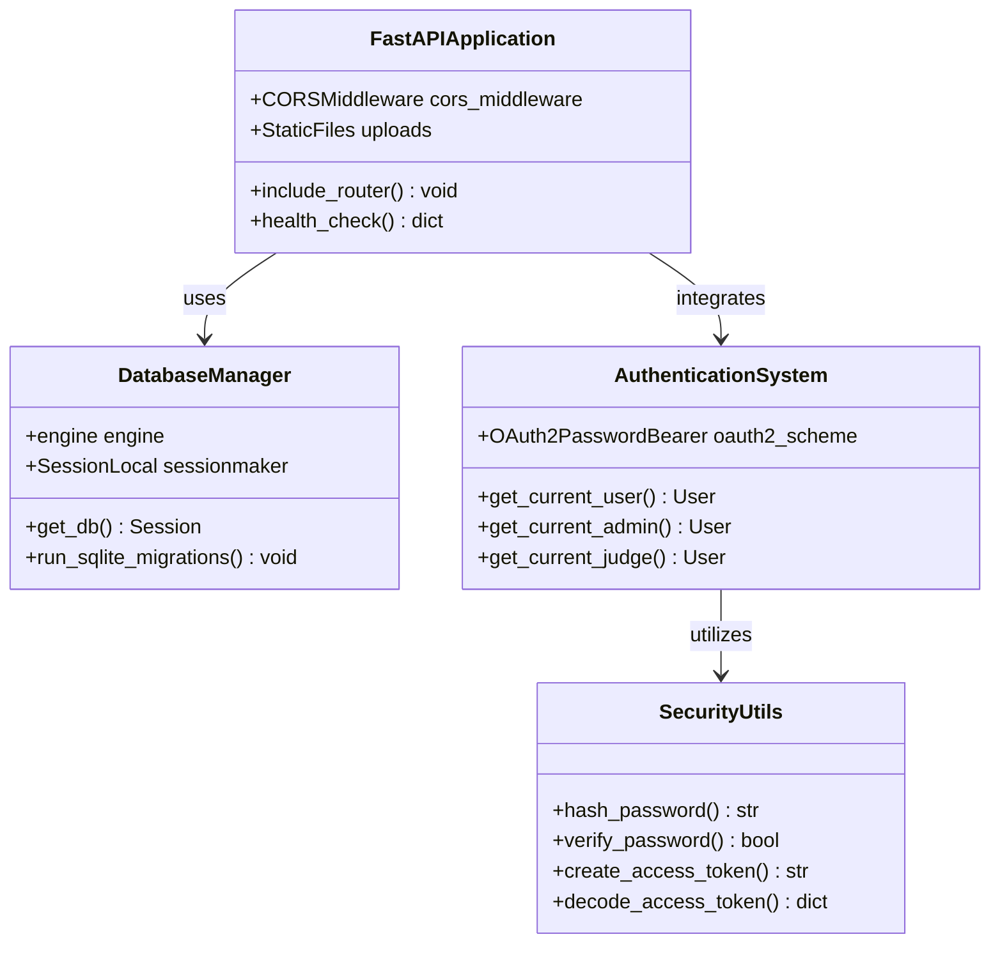

**Diagram sources**
- [main.py:29-59](file://main.py#L29-L59)
- [utils/dependencies.py:12-71](file://utils/dependencies.py#L12-L71)
- [utils/security.py:17-53](file://utils/security.py#L17-L53)

### Frontend Architecture

The frontend is implemented with React and TypeScript, providing a responsive interface for both administrators and judges. The application uses a component-based architecture with context providers for authentication state management.

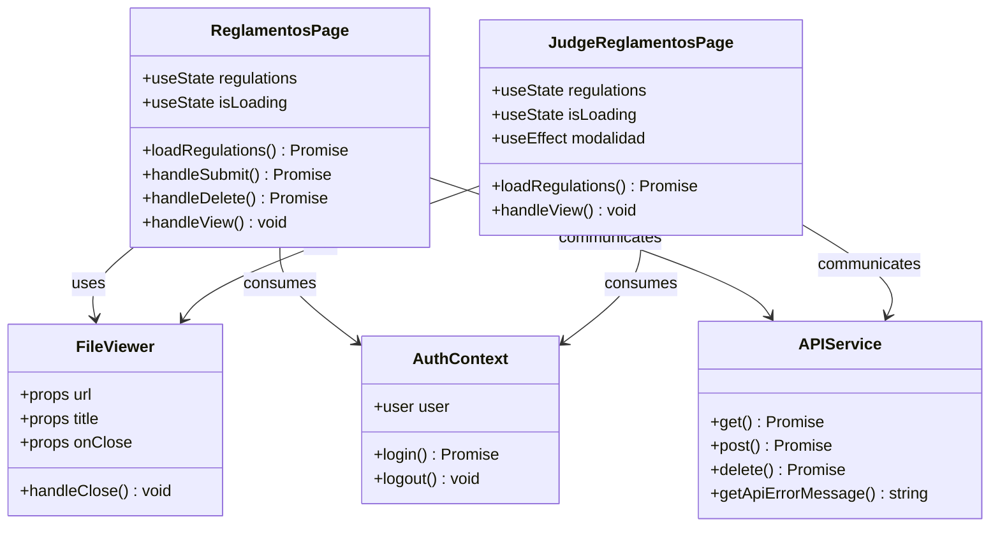

**Diagram sources**
- [frontend/src/pages/admin/Reglamentos.tsx:22-302](file://frontend/src/pages/admin/Reglamentos.tsx#L22-L302)
- [frontend/src/pages/juez/Reglamentos.tsx:15-171](file://frontend/src/pages/juez/Reglamentos.tsx#L15-L171)
- [frontend/src/lib/api.ts:4-41](file://frontend/src/lib/api.ts#L4-L41)

**Section sources**
- [frontend/src/pages/admin/Reglamentos.tsx:1-302](file://frontend/src/pages/admin/Reglamentos.tsx#L1-L302)
- [frontend/src/pages/juez/Reglamentos.tsx:1-171](file://frontend/src/pages/juez/Reglamentos.tsx#L1-L171)
- [frontend/src/lib/api.ts:1-41](file://frontend/src/lib/api.ts#L1-L41)

## Database Schema

The system uses SQLAlchemy ORM with SQLite as the primary database. The schema is designed to support the competition management workflow with proper relationships and constraints.

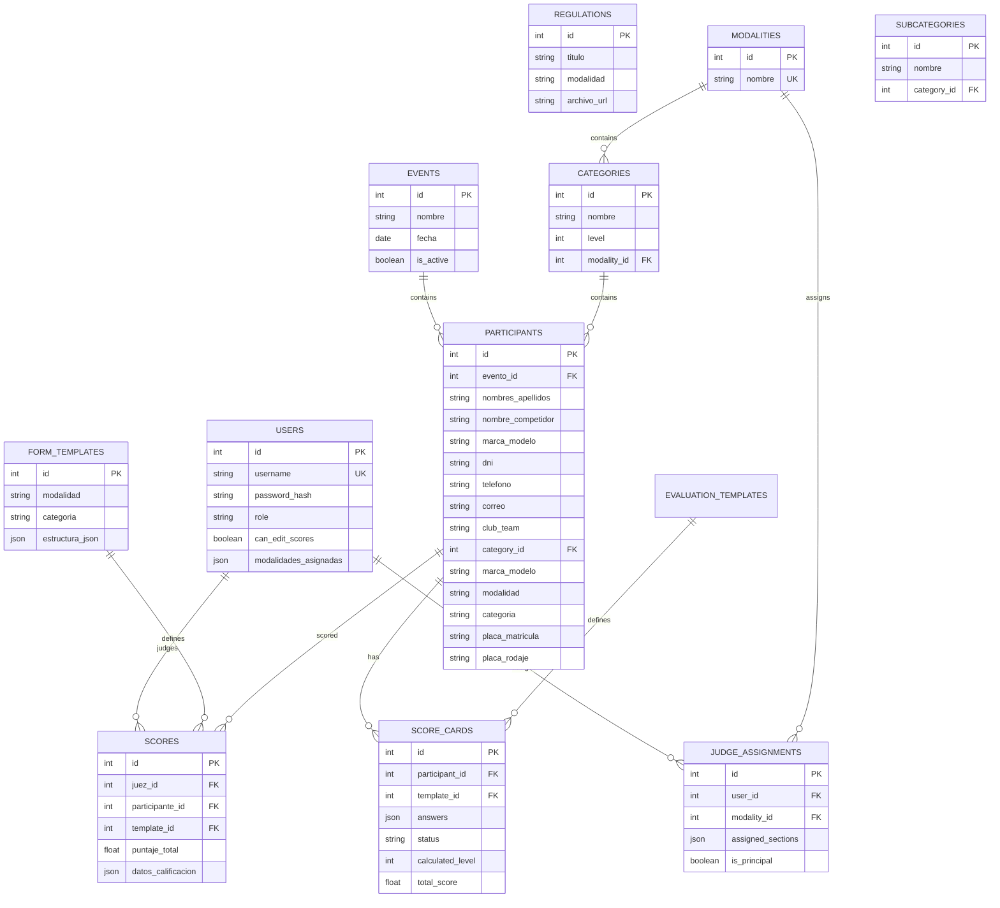

**Diagram sources**
- [models.py:11-225](file://models.py#L11-L225)

**Section sources**
- [models.py:1-225](file://models.py#L1-L225)
- [database.py:36-193](file://database.py#L36-L193)

## API Endpoints

The system provides RESTful APIs organized by functional domains. Each endpoint follows REST conventions and includes proper authentication and authorization.

### Regulation Management API

The regulation management system provides comprehensive PDF handling capabilities for competition documents.

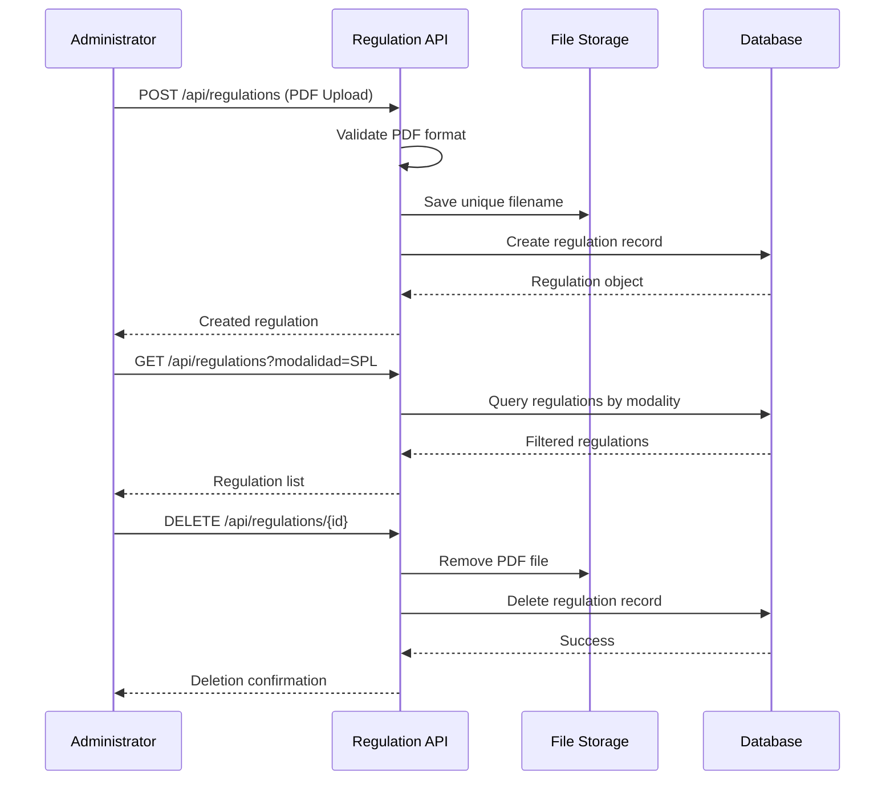

**Diagram sources**
- [routes/regulations.py:20-110](file://routes/regulations.py#L20-L110)

### Participant Management API

The participant management system handles bulk Excel uploads and individual participant operations with comprehensive validation.

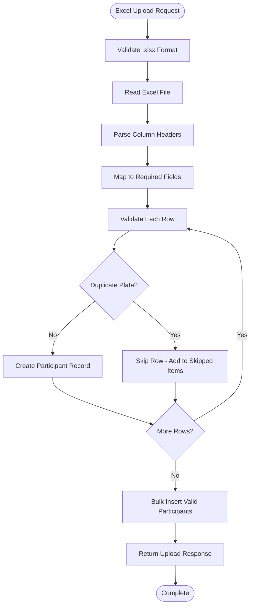

**Diagram sources**
- [routes/participants.py:316-430](file://routes/participants.py#L316-L430)

**Section sources**
- [routes/regulations.py:1-110](file://routes/regulations.py#L1-L110)
- [routes/participants.py:1-430](file://routes/participants.py#L1-L430)
- [routes/users.py:1-221](file://routes/users.py#L1-L221)
- [routes/templates.py:1-134](file://routes/templates.py#L1-L134)
- [routes/events.py:1-116](file://routes/events.py#L1-L116)

## Frontend Implementation

The frontend provides role-specific interfaces optimized for different user types within the competition management ecosystem.

### Administrator Interface

The administrator interface offers comprehensive regulation management capabilities with upload forms, validation feedback, and bulk operation support.

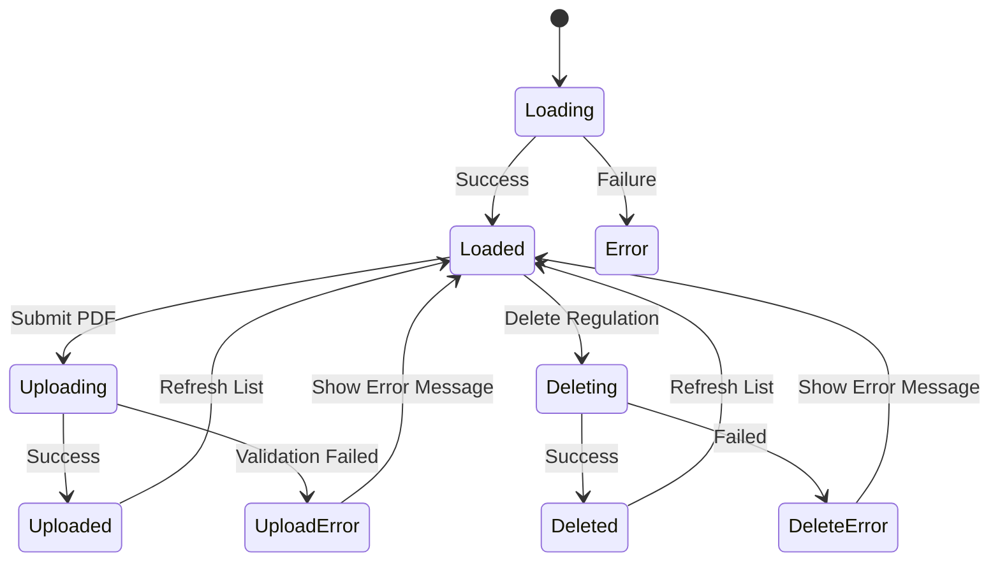

**Diagram sources**
- [frontend/src/pages/admin/Reglamentos.tsx:48-125](file://frontend/src/pages/admin/Reglamentos.tsx#L48-L125)

### Judge Interface

The judge interface focuses on regulation access with modality filtering and seamless PDF viewing capabilities.

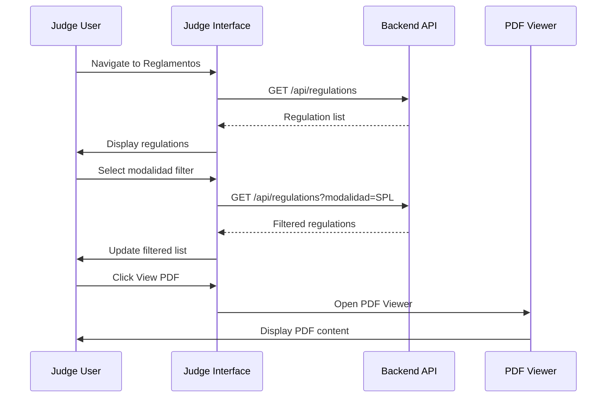

**Diagram sources**
- [frontend/src/pages/juez/Reglamentos.tsx:30-68](file://frontend/src/pages/juez/Reglamentos.tsx#L30-L68)

**Section sources**
- [frontend/src/pages/admin/Reglamentos.tsx:1-302](file://frontend/src/pages/admin/Reglamentos.tsx#L1-L302)
- [frontend/src/pages/juez/Reglamentos.tsx:1-171](file://frontend/src/pages/juez/Reglamentos.tsx#L1-L171)

## Security Model

The system implements a comprehensive security model ensuring proper access control and data protection.

### Authentication and Authorization

The authentication system uses JWT tokens with role-based access control to differentiate between administrator and judge privileges.

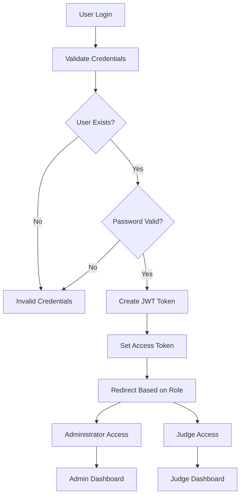

**Diagram sources**
- [utils/dependencies.py:16-71](file://utils/dependencies.py#L16-L71)
- [utils/security.py:32-42](file://utils/security.py#L32-L42)

### Role-Based Access Control

The system enforces strict role-based access control ensuring that only authorized users can perform sensitive operations.

| Operation | Required Role | Description |
|-----------|---------------|-------------|
| Upload Regulations | Admin | Upload PDF regulation documents |
| Delete Regulations | Admin | Remove regulation documents |
| Manage Users | Admin | Create, update, delete users |
| Update Participant Info | Judge/Admin | Update participant details |
| View Regulations | All Users | Access regulation documents |
| Manage Events | Admin | Create and update events |

**Section sources**
- [utils/dependencies.py:32-47](file://utils/dependencies.py#L32-L47)
- [utils/security.py:17-53](file://utils/security.py#L17-L53)

## Data Flow Analysis

The system processes data through well-defined pipelines ensuring data integrity and consistency across all operations.

### PDF Upload and Processing Pipeline

The PDF upload process involves multiple validation steps and secure storage mechanisms.

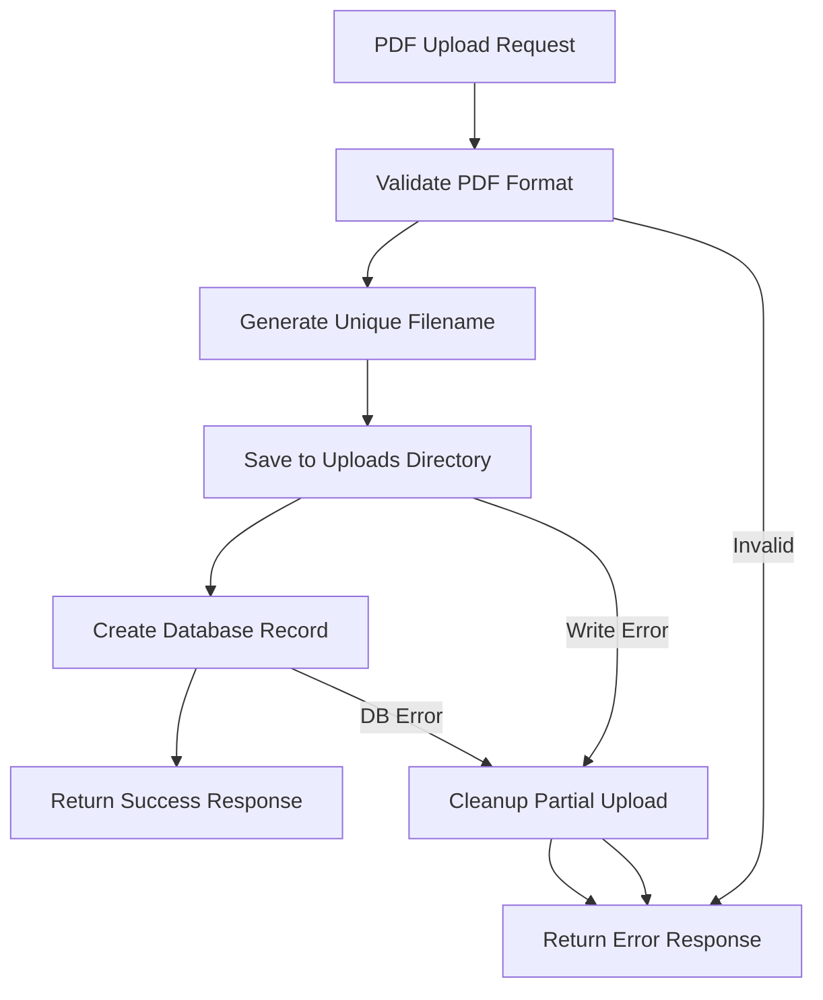

**Diagram sources**
- [routes/regulations.py:28-64](file://routes/regulations.py#L28-L64)

### Excel Import Processing Pipeline

The Excel import system handles complex data transformation and validation processes.

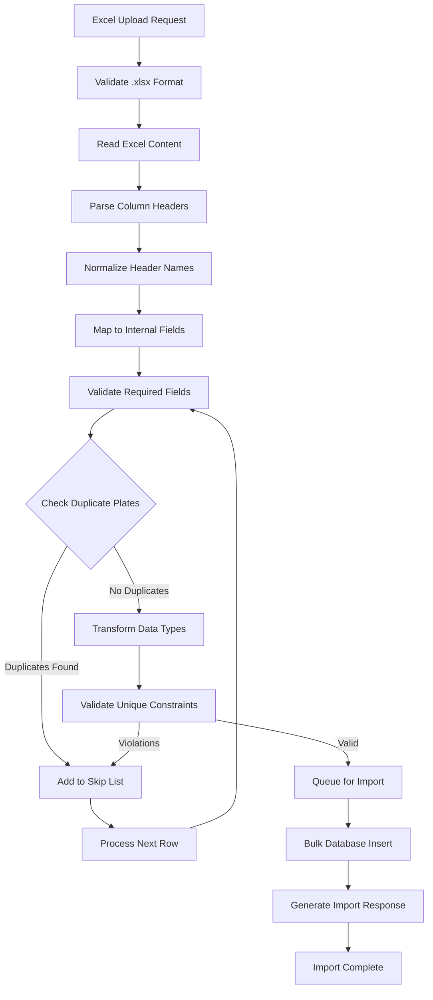

**Diagram sources**
- [routes/participants.py:352-429](file://routes/participants.py#L352-L429)

**Section sources**
- [routes/regulations.py:1-110](file://routes/regulations.py#L1-L110)
- [routes/participants.py:1-430](file://routes/participants.py#L1-L430)

## Performance Considerations

The system is designed with several performance optimizations to handle various operational loads efficiently.

### Database Optimization Strategies

- **Indexing**: Strategic indexing on frequently queried fields (event_id, modalidad, categoria, username)
- **Connection Pooling**: SQLAlchemy session management for efficient database connections
- **Bulk Operations**: Bulk insert operations for Excel imports to minimize database round trips
- **Query Optimization**: Efficient queries with proper filtering and ordering

### Caching and Static Assets

- **Static File Serving**: Direct static file serving for uploaded PDFs
- **Frontend Optimization**: React component memoization and efficient state management
- **API Response Optimization**: Proper pagination and filtering for large datasets

### Scalability Considerations

- **Horizontal Scaling**: Stateless API design supporting load balancing
- **Database Migration**: SQLite migration system for schema evolution
- **File Storage**: Separate file storage from database for scalability

## Troubleshooting Guide

Common issues and their solutions for the Regulation Management System.

### Authentication Issues

**Problem**: Users unable to log in or receive authentication errors
**Solution**: 
- Verify JWT secret key environment variable is set
- Check token expiration settings
- Ensure user credentials are properly hashed

**Problem**: Role-based access denied errors
**Solution**:
- Verify user role assignments in database
- Check authentication middleware configuration
- Review route-level permission decorators

### File Upload Issues

**Problem**: PDF upload failures or corrupted files
**Solution**:
- Verify uploads directory permissions
- Check file size limits and MIME type validation
- Ensure unique filename generation is working correctly

**Problem**: Excel import errors or data inconsistencies
**Solution**:
- Validate Excel file format and structure
- Check column header normalization logic
- Review duplicate detection and conflict resolution

### Database Migration Issues

**Problem**: Schema inconsistencies or migration failures
**Solution**:
- Run database initialization script
- Check SQLite version compatibility
- Verify migration script execution order

**Section sources**
- [utils/dependencies.py:50-71](file://utils/dependencies.py#L50-L71)
- [routes/regulations.py:29-50](file://routes/regulations.py#L29-L50)
- [routes/participants.py:325-351](file://routes/participants.py#L325-L351)

## Conclusion

The Regulation Management System provides a comprehensive solution for managing competition regulations in car audio and tuning events. The system successfully combines modern web technologies with robust database design and security practices.

Key strengths of the system include:

- **Role-based Architecture**: Clear separation between administrator and judge functionalities
- **Comprehensive Validation**: Multi-layered validation for data integrity
- **Scalable Design**: Modular architecture supporting future enhancements
- **User Experience**: Intuitive interfaces optimized for different user roles
- **Security**: Robust authentication and authorization mechanisms

The system's modular design allows for easy maintenance and extension, while the comprehensive API documentation and testing infrastructure support ongoing development. The combination of automated migrations, bulk operation support, and efficient data processing ensures reliable operation under various load conditions.

Future enhancements could include advanced reporting capabilities, integration with external systems, and expanded support for additional document formats beyond PDF.