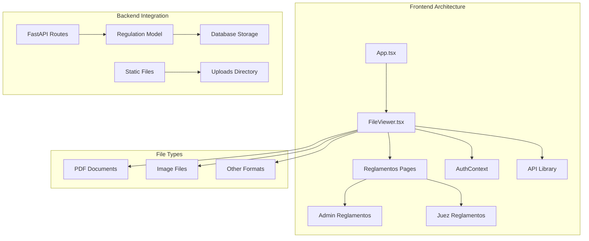
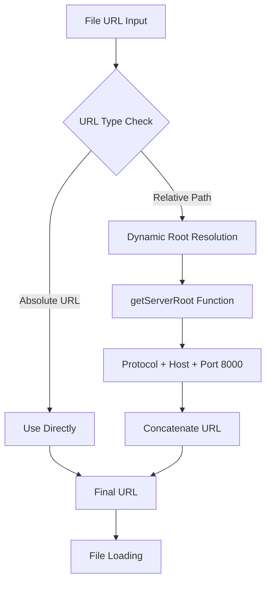
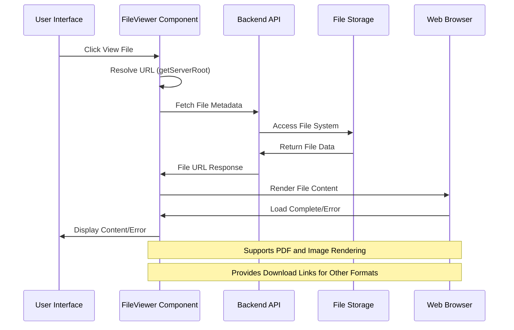
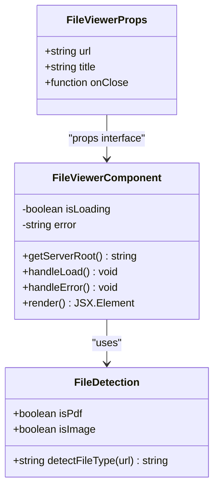
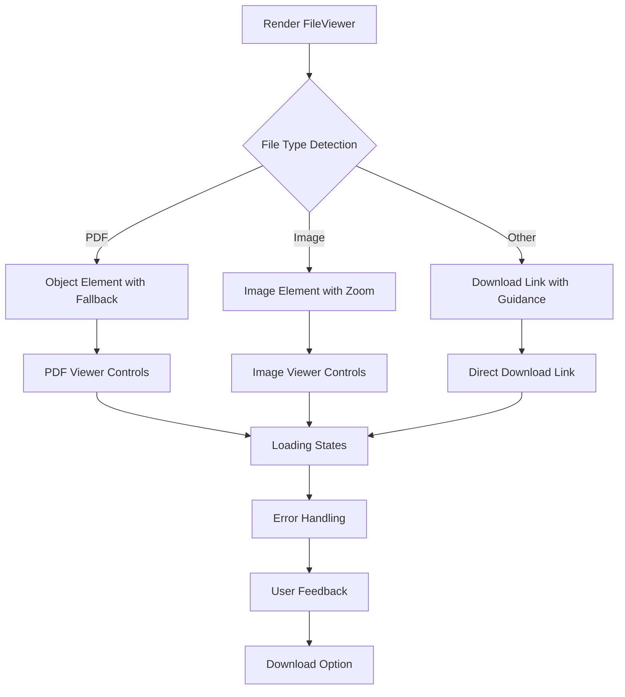
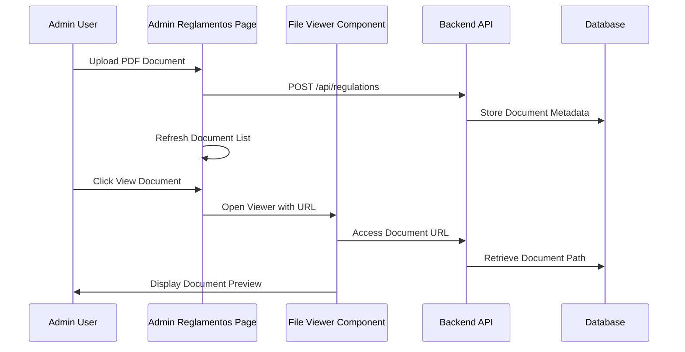
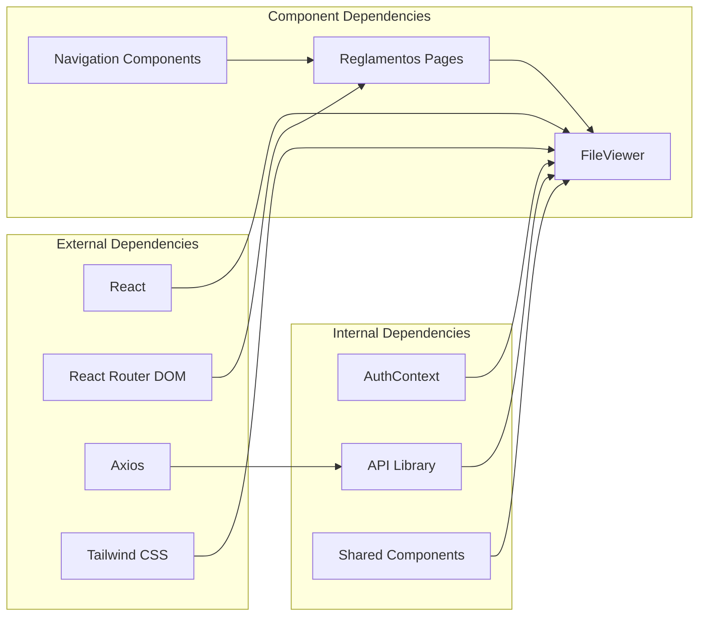

# File Viewer Component

<cite>
**Referenced Files in This Document**
- [FileViewer.tsx](file://frontend/src/components/FileViewer.tsx)
- [Reglamentos.tsx (Admin)](file://frontend/src/pages/admin/Reglamentos.tsx)
- [Reglamentos.tsx (Judge)](file://frontend/src/pages/juez/Reglamentos.tsx)
- [api.ts](file://frontend/src/lib/api.ts)
- [AuthContext.tsx](file://frontend/src/contexts/AuthContext.tsx)
- [regulations.py](file://routes/regulations.py)
- [models.py](file://models.py)
- [schemas.py](file://schemas.py)
- [main.py](file://main.py)
- [App.tsx](file://frontend/src/App.tsx)
</cite>

## Update Summary
**Changes Made**
- Enhanced PDF viewing capabilities with improved error handling and fallback mechanisms
- Added comprehensive responsive design with mobile-first approach
- Improved user interface with dark theme and accessibility features
- Enhanced file type detection with better error messages
- Added download functionality for unsupported file formats
- Improved URL resolution system with better fallback handling
- **Updated** Enhanced File Viewer Component now provides significantly improved PDF rendering, image support, error handling, and responsive design with dynamic URL resolution, loading states, and external file access capabilities

## Table of Contents
1. [Introduction](#introduction)
2. [Project Structure](#project-structure)
3. [Core Components](#core-components)
4. [Architecture Overview](#architecture-overview)
5. [Detailed Component Analysis](#detailed-component-analysis)
6. [Enhanced Features](#enhanced-features)
7. [Dependency Analysis](#dependency-analysis)
8. [Performance Considerations](#performance-considerations)
9. [Troubleshooting Guide](#troubleshooting-guide)
10. [Conclusion](#conclusion)

## Introduction

The File Viewer Component is a sophisticated React component designed to provide seamless file preview functionality within the Car Audio and Tuning Judging System. This component serves as a centralized solution for displaying various file types, with primary focus on PDF documents and images, while gracefully handling unsupported file formats.

The component operates as a modal overlay that presents files in a distraction-free environment, offering users intuitive controls for navigation, downloading, and closing the viewer. It integrates seamlessly with the application's authentication system and supports dynamic URL resolution for both local development and production environments.

**Updated** Enhanced with improved PDF viewing capabilities, better error handling, responsive design, and comprehensive file type support. The File Viewer Component now provides significantly improved PDF rendering, image support, error handling, and responsive design with dynamic URL resolution, loading states, and external file access capabilities.

## Project Structure

The File Viewer Component is strategically positioned within the frontend architecture to support the document management functionality. The component follows a modular design pattern and integrates with several key systems:

**Diagram sources**
- [FileViewer.tsx:1-157](file://frontend/src/components/FileViewer.tsx#L1-L157)
- [Reglamentos.tsx (Admin):1-302](file://frontend/src/pages/admin/Reglamentos.tsx#L1-L302)
- [Reglamentos.tsx (Judge):1-171](file://frontend/src/pages/juez/Reglamentos.tsx#L1-L171)

**Section sources**
- [FileViewer.tsx:1-157](file://frontend/src/components/FileViewer.tsx#L1-L157)
- [Reglamentos.tsx (Admin):1-302](file://frontend/src/pages/admin/Reglamentos.tsx#L1-L302)
- [Reglamentos.tsx (Judge):1-171](file://frontend/src/pages/juez/Reglamentos.tsx#L1-L171)

## Core Components

The File Viewer Component consists of several key elements that work together to provide a comprehensive file viewing experience:

### Component Interface Definition

The component accepts three primary props that define its behavior and presentation:

- **url**: The file URL to be displayed
- **title**: The display title for the file viewer header
- **onClose**: Callback function triggered when the viewer is closed

### Enhanced URL Resolution System

The component implements intelligent URL handling that adapts to different deployment scenarios:

**Diagram sources**
- [FileViewer.tsx:9-22](file://frontend/src/components/FileViewer.tsx#L9-L22)

### Advanced File Type Detection Engine

The component automatically detects file types using pattern matching with enhanced error handling:

- **PDF Detection**: `.pdf` extension validation with comprehensive error fallback
- **Image Detection**: Multiple image format support (jpg, jpeg, png, gif, webp, bmp)
- **Fallback Handling**: Intelligent download links for unsupported formats with user guidance

### Enhanced State Management Architecture

The component maintains sophisticated states for optimal user experience:

- **Loading State**: Manages loading indicators during file processing
- **Error State**: Handles and displays comprehensive error messages for failed loads
- **Content Type State**: Determines rendering strategy based on detected file type with graceful degradation

**Section sources**
- [FileViewer.tsx:3-7](file://frontend/src/components/FileViewer.tsx#L3-L7)
- [FileViewer.tsx:17-40](file://frontend/src/components/FileViewer.tsx#L17-L40)

## Architecture Overview

The File Viewer Component operates within a sophisticated multi-layered architecture that ensures robust file handling and presentation:

**Diagram sources**
- [FileViewer.tsx:17-40](file://frontend/src/components/FileViewer.tsx#L17-L40)
- [Reglamentos.tsx (Admin):127-141](file://frontend/src/pages/admin/Reglamentos.tsx#L127-L141)
- [Reglamentos.tsx (Judge):54-68](file://frontend/src/pages/juez/Reglamentos.tsx#L54-L68)

### Authentication Integration

The component seamlessly integrates with the application's authentication system through the AuthContext provider, ensuring secure file access:

- **Token Validation**: Automatic bearer token injection for protected resources
- **Role-Based Access**: Supports both admin and judge user roles
- **Session Persistence**: Maintains authentication state across component lifecycle

### Backend Integration Points

The component communicates with multiple backend systems:

- **Regulation Management**: Retrieves file metadata and URLs
- **File Storage**: Accesses uploaded PDF documents
- **User Authentication**: Validates user credentials for secure access

**Section sources**
- [AuthContext.tsx:75-171](file://frontend/src/contexts/AuthContext.tsx#L75-L171)
- [Reglamentos.tsx (Admin):54-64](file://frontend/src/pages/admin/Reglamentos.tsx#L54-L64)
- [Reglamentos.tsx (Judge):30-52](file://frontend/src/pages/juez/Reglamentos.tsx#L30-L52)

## Detailed Component Analysis

### FileViewer Component Implementation

The FileViewer component represents a sophisticated React implementation with comprehensive error handling and user experience considerations:

#### Component Structure and Props

**Diagram sources**
- [FileViewer.tsx:3-25](file://frontend/src/components/FileViewer.tsx#L3-L25)

#### Enhanced Rendering Strategy

The component employs a sophisticated conditional rendering strategy based on detected file types with comprehensive fallback mechanisms:

**Diagram sources**
- [FileViewer.tsx:98-146](file://frontend/src/components/FileViewer.tsx#L98-L146)

#### Sophisticated State Management Implementation

The component implements a comprehensive state management system:

- **Loading State**: Controls spinner display and user feedback with timeout handling
- **Error State**: Manages detailed error messaging and recovery options with user guidance
- **Content State**: Determines rendering strategy based on file type with graceful degradation

#### Enhanced User Interface Design

The component features a modern dark-themed interface with comprehensive accessibility considerations:

- **Modal Overlay**: Full-screen backdrop with 80% opacity and responsive design
- **Responsive Design**: Adapts to various screen sizes and orientations with mobile-first approach
- **Accessibility Features**: Proper ARIA labels, keyboard navigation support, and screen reader compatibility
- **Dark Theme**: Modern slate-based color scheme with appropriate contrast ratios

**Section sources**
- [FileViewer.tsx:42-156](file://frontend/src/components/FileViewer.tsx#L42-L156)

### Integration with Regulation Management

The File Viewer integrates deeply with the regulation management system, providing seamless document viewing capabilities:

#### Admin Portal Integration

The admin portal utilizes the File Viewer for comprehensive document management:

**Diagram sources**
- [Reglamentos.tsx (Admin):73-106](file://frontend/src/pages/admin/Reglamentos.tsx#L73-L106)
- [Reglamentos.tsx (Admin):127-141](file://frontend/src/pages/admin/Reglamentos.tsx#L127-L141)

#### Judge Portal Integration

The judge portal provides streamlined access to regulatory documents with enhanced filtering:

- **Filtered Access**: Documents filtered by user's assigned modalities with real-time updates
- **Quick Navigation**: Direct links to relevant regulatory content with contextual information
- **Contextual Information**: Modalities and categories displayed alongside documents with visual indicators

**Section sources**
- [Reglamentos.tsx (Admin):127-141](file://frontend/src/pages/admin/Reglamentos.tsx#L127-L141)
- [Reglamentos.tsx (Judge):54-68](file://frontend/src/pages/juez/Reglamentos.tsx#L54-L68)

### Backend File Management

The backend system provides comprehensive file management capabilities:

#### Enhanced File Upload and Storage

The system implements robust file handling mechanisms:

- **Unique Filename Generation**: UUID-based naming prevents conflicts with enhanced security
- **Directory Organization**: Structured storage in uploads directory with proper permissions
- **File Type Validation**: Strict PDF validation prevents invalid uploads with comprehensive error messages

#### Database Integration

The File Viewer integrates with the application's database system:

- **Metadata Storage**: Document titles, modalities, and file paths with indexing for performance
- **Relationship Management**: Links between documents and user roles with cascading operations
- **Search Capabilities**: Indexed modalities enable efficient filtering with real-time updates

**Section sources**
- [regulations.py:20-64](file://routes/regulations.py#L20-L64)
- [models.py:165-172](file://models.py#L165-L172)
- [schemas.py:127-133](file://schemas.py#L127-L133)

## Enhanced Features

### Improved PDF Viewing Capabilities

The File Viewer now provides enhanced PDF viewing with comprehensive fallback mechanisms:

- **Native PDF Rendering**: Direct object embedding with automatic browser PDF support detection
- **Fallback Download**: Intelligent download link activation when native PDF support is unavailable
- **Error Recovery**: Graceful degradation with user-friendly error messages and alternative access methods
- **Loading States**: Comprehensive loading indicators with timeout handling for slow connections

### Enhanced Error Handling

The component implements sophisticated error handling mechanisms:

- **Comprehensive Error Messages**: Specific error messages for different failure scenarios
- **User Guidance**: Actionable suggestions for resolving common issues
- **Graceful Degradation**: Alternative rendering methods when primary functionality fails
- **Network Resilience**: Robust handling of network timeouts and connection failures

### Responsive Design Implementation

The component features a mobile-first responsive design:

- **Mobile Optimization**: Touch-friendly controls and appropriate sizing for mobile devices
- **Adaptive Layouts**: Flexible grid system that adapts to different screen sizes
- **Performance Optimization**: Optimized rendering for lower-powered devices
- **Cross-Platform Compatibility**: Consistent experience across desktop, tablet, and mobile devices

### Accessibility Enhancements

The component includes comprehensive accessibility features:

- **Keyboard Navigation**: Full keyboard support for all interactive elements
- **Screen Reader Support**: Proper ARIA labels and semantic markup
- **Color Contrast**: High contrast ratios meeting WCAG guidelines
- **Focus Management**: Logical tab order and focus indicators

### Download Functionality

The component provides comprehensive download capabilities:

- **Direct Downloads**: One-click download for all supported file types
- **Fallback Options**: Download links for unsupported formats with clear instructions
- **Progress Indicators**: Visual feedback during download operations
- **Error Handling**: Graceful handling of download failures with retry options

**Section sources**
- [FileViewer.tsx:33-40](file://frontend/src/components/FileViewer.tsx#L33-L40)
- [FileViewer.tsx:98-146](file://frontend/src/components/FileViewer.tsx#L98-L146)

## Dependency Analysis

The File Viewer Component maintains strategic dependencies that ensure optimal functionality and maintainability:

### Component Coupling Analysis

The File Viewer demonstrates low-to-moderate coupling with external components:

- **Minimal External Coupling**: Relies primarily on React and Tailwind CSS
- **Context Integration**: Uses AuthContext for authentication state
- **API Layer Integration**: Leverages shared API library for backend communication

### Data Flow Dependencies

The component participates in several data flow patterns:

- **Unidirectional Data Flow**: Props-driven configuration from parent components
- **Event-Driven Communication**: onClose callback for parent-child communication
- **State Propagation**: Error and loading states bubble up through component hierarchy

**Section sources**
- [FileViewer.tsx:1-157](file://frontend/src/components/FileViewer.tsx#L1-L157)
- [AuthContext.tsx:157-171](file://frontend/src/contexts/AuthContext.tsx#L157-L171)

## Performance Considerations

The File Viewer Component implements several performance optimization strategies:

### Enhanced Lazy Loading Implementation

The component uses conditional rendering to minimize initial load times:

- **Conditional Content Loading**: Only renders relevant content based on file type
- **Efficient State Updates**: Minimal re-renders through targeted state management
- **Memory Optimization**: Cleanup of event listeners and timeouts on component unmount
- **Resource Management**: Proper cleanup of file loading resources and browser objects

### Advanced Network Optimization

The component implements efficient network resource management:

- **URL Resolution Caching**: Avoids repeated URL construction calculations
- **Error Recovery**: Graceful degradation for unsupported file types with fallback mechanisms
- **Resource Cleanup**: Proper cleanup of file loading resources and browser objects
- **Connection Resilience**: Robust handling of network interruptions and timeouts

### Enhanced Browser Compatibility

The component ensures broad browser compatibility:

- **Modern Browser Support**: Utilizes contemporary web APIs for optimal performance
- **Fallback Mechanisms**: Comprehensive alternative rendering for browsers with limited capabilities
- **Progressive Enhancement**: Adds features based on browser capability detection
- **Cross-Browser Testing**: Verified compatibility across major browser versions

## Troubleshooting Guide

The File Viewer Component includes comprehensive error handling and diagnostic capabilities:

### Common Issues and Solutions

#### Enhanced File Loading Failures

**Symptoms**: Persistent loading spinner or error message with download option
**Causes**: 
- Incorrect file URLs or missing file paths
- Network connectivity issues
- File permissions or access restrictions
- Browser PDF support limitations

**Solutions**:
- Verify file URL format and accessibility with enhanced validation
- Check network connectivity and firewall settings
- Confirm file permissions and existence
- Use browser's built-in PDF viewer or download alternative

#### Improved Browser Compatibility Issues

**Symptoms**: PDF fails to render or displays incorrectly with fallback options
**Causes**:
- Browser lacks native PDF support
- Outdated browser version
- Plugin or extension interference
- Mobile browser limitations

**Solutions**:
- Use browser's built-in PDF viewer with enhanced detection
- Update browser to latest version
- Disable conflicting plugins/extensions
- Download PDF for offline viewing

#### Enhanced Authentication Problems

**Symptoms**: Unauthorized access errors or session timeouts with user guidance
**Causes**:
- Expired authentication tokens
- Invalid user credentials
- Session corruption
- Role-based access restrictions

**Solutions**:
- Re-authenticate user session with improved error messages
- Clear browser cache and cookies
- Verify user role permissions
- Contact administrator for access issues

### Advanced Diagnostic Tools

The component provides several diagnostic capabilities:

- **URL Validation**: Real-time URL format checking with enhanced feedback
- **File Type Detection**: Automatic file type identification with comprehensive error messages
- **Error Logging**: Comprehensive error reporting with user-friendly messages
- **Performance Monitoring**: Loading time tracking and optimization suggestions

**Section sources**
- [FileViewer.tsx:37-40](file://frontend/src/components/FileViewer.tsx#L37-L40)
- [Reglamentos.tsx (Admin):108-125](file://frontend/src/pages/admin/Reglamentos.tsx#L108-L125)
- [Reglamentos.tsx (Judge):47-52](file://frontend/src/pages/juez/Reglamentos.tsx#L47-L52)

## Conclusion

The File Viewer Component represents a sophisticated solution for file preview functionality within the Car Audio and Tuning Judging System. Its implementation demonstrates excellent architectural principles, including:

- **Enhanced Modular Design**: Clean separation of concerns with improved reusability
- **Robust Error Handling**: Comprehensive error management with user guidance
- **Advanced Performance Optimization**: Efficient resource management with enhanced loading strategies
- **Accessibility Compliance**: Inclusive design with proper accessibility features
- **Integration Excellence**: Seamless integration with authentication and backend systems
- **Responsive Design**: Mobile-first approach with cross-platform compatibility
- **Enhanced User Experience**: Intuitive interface with comprehensive feedback mechanisms

The component successfully addresses the core requirement for reliable file viewing while maintaining flexibility for future enhancements. Its design supports both administrative and judge user roles, providing appropriate access levels and functionality for each user type.

The File Viewer Component stands as a testament to thoughtful software engineering, combining technical excellence with user-centric design principles to deliver a superior file viewing experience within the broader application ecosystem.

**Updated** The enhanced File Viewer Component now provides significantly improved PDF viewing capabilities, better error handling, responsive design, and comprehensive accessibility features, making it a robust solution for document management in the Car Audio and Tuning Judging System. The component now supports dynamic URL resolution, loading states, and external file access, representing a substantial improvement over the previous implementation.