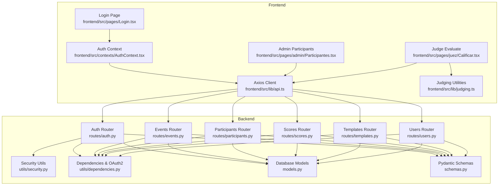
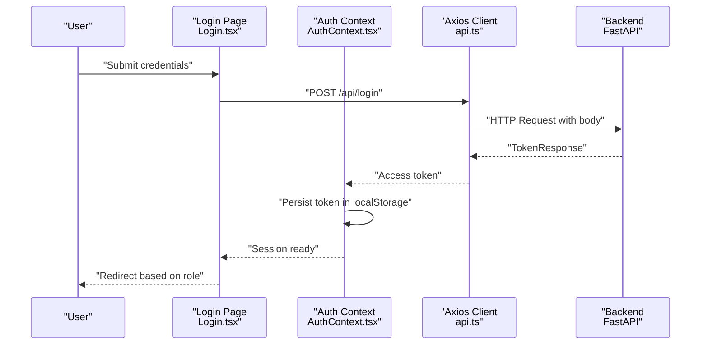
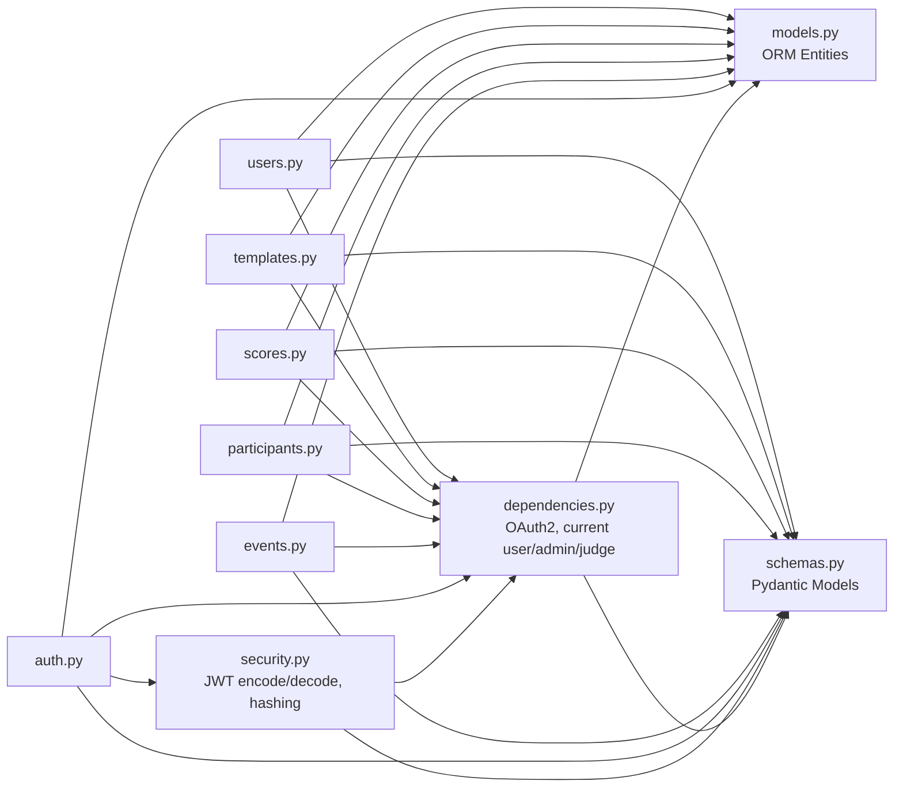

# API Integration Layer

<cite>
**Referenced Files in This Document**
- [api.ts](file://frontend/src/lib/api.ts)
- [judging.ts](file://frontend/src/lib/judging.ts)
- [AuthContext.tsx](file://frontend/src/contexts/AuthContext.tsx)
- [Login.tsx](file://frontend/src/pages/Login.tsx)
- [Participantes.tsx](file://frontend/src/pages/admin/Participantes.tsx)
- [Calificar.tsx](file://frontend/src/pages/juez/Calificar.tsx)
- [App.tsx](file://frontend/src/App.tsx)
- [auth.py](file://routes/auth.py)
- [events.py](file://routes/events.py)
- [participants.py](file://routes/participants.py)
- [scores.py](file://routes/scores.py)
- [templates.py](file://routes/templates.py)
- [users.py](file://routes/users.py)
- [models.py](file://models.py)
- [schemas.py](file://schemas.py)
- [security.py](file://utils/security.py)
- [dependencies.py](file://utils/dependencies.py)
</cite>

## Table of Contents
1. [Introduction](#introduction)
2. [Project Structure](#project-structure)
3. [Core Components](#core-components)
4. [Architecture Overview](#architecture-overview)
5. [Detailed Component Analysis](#detailed-component-analysis)
6. [Dependency Analysis](#dependency-analysis)
7. [Performance Considerations](#performance-considerations)
8. [Troubleshooting Guide](#troubleshooting-guide)
9. [Conclusion](#conclusion)

## Introduction
This document describes the API integration layer used by the frontend application to communicate with the FastAPI backend. It covers HTTP client configuration, authentication header injection, request/response patterns, error handling, and the API wrapper functions for resources such as authentication, events, participants, scores, templates, and users. It also documents the judging utilities and their integration with the scoring system, including data validation, loading state management, and practical examples of GET/POST/PUT/DELETE operations.

## Project Structure
The API integration spans two primary areas:
- Frontend (React + TypeScript): Axios client configuration, authentication context, page components, and judging utilities.
- Backend (FastAPI + SQLAlchemy): Resource endpoints, Pydantic models and schemas, and security/dependency utilities.

**Diagram sources**
- [api.ts:1-33](file://frontend/src/lib/api.ts#L1-L33)
- [AuthContext.tsx:1-144](file://frontend/src/contexts/AuthContext.tsx#L1-L144)
- [Login.tsx:1-124](file://frontend/src/pages/Login.tsx#L1-L124)
- [Participantes.tsx:1-693](file://frontend/src/pages/admin/Participantes.tsx#L1-L693)
- [Calificar.tsx:1-398](file://frontend/src/pages/juez/Calificar.tsx#L1-L398)
- [judging.ts:1-64](file://frontend/src/lib/judging.ts#L1-L64)
- [auth.py:1-36](file://routes/auth.py#L1-L36)
- [events.py:1-74](file://routes/events.py#L1-L74)
- [participants.py:1-400](file://routes/participants.py#L1-L400)
- [scores.py:1-132](file://routes/scores.py#L1-L132)
- [templates.py:1-64](file://routes/templates.py#L1-L64)
- [users.py:1-192](file://routes/users.py#L1-L192)
- [security.py:1-51](file://utils/security.py#L1-L51)
- [dependencies.py:1-71](file://utils/dependencies.py#L1-L71)
- [models.py:1-95](file://models.py#L1-L95)
- [schemas.py:1-152](file://schemas.py#L1-L152)

**Section sources**
- [api.ts:1-33](file://frontend/src/lib/api.ts#L1-L33)
- [AuthContext.tsx:1-144](file://frontend/src/contexts/AuthContext.tsx#L1-L144)
- [Login.tsx:1-124](file://frontend/src/pages/Login.tsx#L1-L124)
- [Participantes.tsx:1-693](file://frontend/src/pages/admin/Participantes.tsx#L1-L693)
- [Calificar.tsx:1-398](file://frontend/src/pages/juez/Calificar.tsx#L1-L398)
- [judging.ts:1-64](file://frontend/src/lib/judging.ts#L1-L64)
- [auth.py:1-36](file://routes/auth.py#L1-L36)
- [events.py:1-74](file://routes/events.py#L1-L74)
- [participants.py:1-400](file://routes/participants.py#L1-L400)
- [scores.py:1-132](file://routes/scores.py#L1-L132)
- [templates.py:1-64](file://routes/templates.py#L1-L64)
- [users.py:1-192](file://routes/users.py#L1-L192)
- [security.py:1-51](file://utils/security.py#L1-L51)
- [dependencies.py:1-71](file://utils/dependencies.py#L1-L71)
- [models.py:1-95](file://models.py#L1-L95)
- [schemas.py:1-152](file://schemas.py#L1-L152)

## Core Components
- Axios client configuration and base URL resolution.
- Authentication context managing tokens and session lifecycle.
- API error message extraction utility.
- Judging utilities for template and score data modeling and transformation.
- Backend routers exposing CRUD and specialized endpoints for auth, events, participants, scores, templates, and users.

Key responsibilities:
- Centralized HTTP client creation and base URL determination.
- Token-based authentication header injection in requests.
- Unified error handling via a dedicated helper.
- Strong typing for judging data structures and template evaluation logic.
- Backend validation and permission enforcement using Pydantic and dependency injectors.

**Section sources**
- [api.ts:1-33](file://frontend/src/lib/api.ts#L1-L33)
- [AuthContext.tsx:1-144](file://frontend/src/contexts/AuthContext.tsx#L1-L144)
- [Login.tsx:1-124](file://frontend/src/pages/Login.tsx#L1-L124)
- [judging.ts:1-64](file://frontend/src/lib/judging.ts#L1-L64)
- [auth.py:1-36](file://routes/auth.py#L1-L36)
- [events.py:1-74](file://routes/events.py#L1-L74)
- [participants.py:1-400](file://routes/participants.py#L1-L400)
- [scores.py:1-132](file://routes/scores.py#L1-L132)
- [templates.py:1-64](file://routes/templates.py#L1-L64)
- [users.py:1-192](file://routes/users.py#L1-L192)

## Architecture Overview
The frontend uses a single Axios instance configured with a dynamic base URL. Components call endpoints directly, injecting the Bearer token from the authentication context. Backend endpoints enforce permissions and validate payloads using Pydantic models and dependency injectors. The judging utilities transform template structures into editable score maps and serialize them back to the backend.

**Diagram sources**
- [Login.tsx:1-124](file://frontend/src/pages/Login.tsx#L1-L124)
- [AuthContext.tsx:1-144](file://frontend/src/contexts/AuthContext.tsx#L1-L144)
- [api.ts:1-33](file://frontend/src/lib/api.ts#L1-L33)
- [auth.py:1-36](file://routes/auth.py#L1-L36)

## Detailed Component Analysis

### HTTP Client Configuration and Error Handling
- Axios instance creation with a dynamic base URL derived from the browser environment or a Vite environment variable.
- Utility to extract user-friendly error messages from Axios errors or generic errors.

Implementation highlights:
- Base URL resolution for development and production environments.
- Centralized error message extraction for consistent UX.

**Section sources**
- [api.ts:1-33](file://frontend/src/lib/api.ts#L1-L33)

### Authentication Context and Header Injection
- Stores and hydrates session from localStorage.
- Provides login/logout functions and exposes user state.
- Components manually attach Authorization headers to requests.

Patterns:
- Manual Authorization header injection in components for explicit control.
- Token parsing helpers to derive user metadata from JWT claims.

**Section sources**
- [AuthContext.tsx:1-144](file://frontend/src/contexts/AuthContext.tsx#L1-L144)
- [Participantes.tsx:108-131](file://frontend/src/pages/admin/Participantes.tsx#L108-L131)
- [Calificar.tsx:122-142](file://frontend/src/pages/juez/Calificar.tsx#L122-L142)

### API Wrapper Functions and Resource Endpoints
The frontend interacts with the following backend endpoints:

- Authentication
  - POST /api/login → TokenResponse
- Events
  - GET /api/events → list[EventResponse]
  - POST /api/events → EventResponse (201)
  - PATCH /api/events/{event_id} → EventResponse
- Participants
  - GET /api/participants → list[ParticipantResponse]
  - POST /api/participants → ParticipantResponse (201)
  - PUT /api/participants/{participant_id} → ParticipantResponse
  - PATCH /api/participants/{participant_id}/nombre → ParticipantResponse
  - POST /api/participants/upload → ParticipantUploadResponse (201)
- Scores
  - POST /api/scores → ScoreResponse
  - GET /api/scores → list[ScoreResponse]
- Templates
  - POST /api/templates → TemplateResponse
  - GET /api/templates/{modalidad}/{categoria} → TemplateResponse
- Users
  - GET /api/users → list[UserResponse]
  - POST /api/users → UserResponse (201)
  - PUT /api/users/{user_id}/permissions → UserResponse
  - PATCH /api/users/{user_id}/credentials → UserResponse
  - PATCH /api/users/me/credentials → UserResponse

Frontend usage examples:
- GET /api/events with Authorization header.
- GET /api/participants with query parameters and Authorization header.
- POST /api/participants/upload with multipart/form-data and Authorization header.
- POST /api/scores with Authorization header and structured payload.

**Section sources**
- [auth.py:1-36](file://routes/auth.py#L1-L36)
- [events.py:1-74](file://routes/events.py#L1-L74)
- [participants.py:1-400](file://routes/participants.py#L1-L400)
- [scores.py:1-132](file://routes/scores.py#L1-L132)
- [templates.py:1-64](file://routes/templates.py#L1-L64)
- [users.py:1-192](file://routes/users.py#L1-L192)
- [Participantes.tsx:108-181](file://frontend/src/pages/admin/Participantes.tsx#L108-L181)
- [Calificar.tsx:121-241](file://frontend/src/pages/juez/Calificar.tsx#L121-L241)

### Request/Response Transformation and Validation
- Backend validation via Pydantic models ensures strict payload validation and serialization.
- Frontend typing via judging utilities ensures safe transformation of template structures into score maps and vice versa.

Transformation patterns:
- Template sections and criteria transformed into a flat score map keyed by section::criterion.
- Payload assembled from the score map for submission to /api/scores.

**Section sources**
- [judging.ts:1-64](file://frontend/src/lib/judging.ts#L1-L64)
- [Calificar.tsx:67-76](file://frontend/src/pages/juez/Calificar.tsx#L67-L76)
- [scores.py:133-137](file://routes/scores.py#L133-L137)
- [schemas.py:133-151](file://schemas.py#L133-L151)

### Authentication Headers Injection
- Components manually attach Authorization: Bearer {token} headers to each request.
- The AuthContext persists the token and parses user metadata from the token.

Integration points:
- Login flow stores token and redirects based on role.
- All protected endpoints rely on the presence of a valid token.

**Section sources**
- [AuthContext.tsx:95-116](file://frontend/src/contexts/AuthContext.tsx#L95-L116)
- [Participantes.tsx:108-131](file://frontend/src/pages/admin/Participantes.tsx#L108-L131)
- [Calificar.tsx:122-142](file://frontend/src/pages/juez/Calificar.tsx#L122-L142)

### Error Propagation Patterns
- Frontend uses getApiErrorMessage to present meaningful messages derived from server responses or generic errors.
- Backend raises HTTPException with appropriate status codes and detail messages.

Common patterns:
- 400 Bad Request for invalid inputs or missing fields.
- 401 Unauthorized for invalid or missing credentials.
- 403 Forbidden for insufficient permissions.
- 404 Not Found for missing resources.
- 409 Conflict for uniqueness violations.

**Section sources**
- [api.ts:16-32](file://frontend/src/lib/api.ts#L16-L32)
- [Login.tsx:38-61](file://frontend/src/pages/Login.tsx#L38-L61)
- [auth.py:17-21](file://routes/auth.py#L17-L21)
- [participants.py:86-89](file://routes/participants.py#L86-L89)
- [scores.py:63-67](file://routes/scores.py#L63-L67)
- [users.py:37-47](file://routes/users.py#L37-L47)

### Loading State Management
- Components maintain local loading flags during network operations.
- Messages are shown conditionally while data is being fetched or saved.

Examples:
- Loading lists, saving manual entries, uploading files, and saving scores.

**Section sources**
- [Participantes.tsx:126-138](file://frontend/src/pages/admin/Participantes.tsx#L126-L138)
- [Participantes.tsx:227-271](file://frontend/src/pages/admin/Participantes.tsx#L227-L271)
- [Participantes.tsx:149-187](file://frontend/src/pages/admin/Participantes.tsx#L149-L187)
- [Calificar.tsx:117-185](file://frontend/src/pages/juez/Calificar.tsx#L117-L185)
- [Calificar.tsx:210-241](file://frontend/src/pages/juez/Calificar.tsx#L210-L241)

### Retry Mechanisms, Timeout Handling, and Offline Scenarios
- The current implementation does not configure Axios interceptors for retries or timeouts.
- Offline scenarios are handled by catching errors and displaying user-friendly messages via getApiErrorMessage.

Recommendations:
- Add Axios interceptors for automatic retry on transient network errors.
- Configure request/response timeouts to improve UX under poor connectivity.
- Implement offline detection and queue operations for write actions.

**Section sources**
- [api.ts:1-33](file://frontend/src/lib/api.ts#L1-L33)
- [Participantes.tsx:168-187](file://frontend/src/pages/admin/Participantes.tsx#L168-L187)
- [Calificar.tsx:218-241](file://frontend/src/pages/juez/Calificar.tsx#L218-L241)

### Judging Utilities and Scoring Integration
- Data models define template sections and criteria, participant and score structures.
- Utilities compute total scores from nested criterion maps and assemble payloads for submission.

Scoring pipeline:
- Load template by modalidad/categoria.
- Load participants filtered by event and category.
- Optionally load existing scores to prefill the form.
- Build score map from template sections and criteria.
- Submit POST /api/scores with computed payload.

**Section sources**
- [judging.ts:18-63](file://frontend/src/lib/judging.ts#L18-L63)
- [Calificar.tsx:101-185](file://frontend/src/pages/juez/Calificar.tsx#L101-L185)
- [Calificar.tsx:210-241](file://frontend/src/pages/juez/Calificar.tsx#L210-L241)
- [scores.py:16-26](file://routes/scores.py#L16-L26)
- [scores.py:43-114](file://routes/scores.py#L43-L114)

## Dependency Analysis
The backend enforces permissions and validates requests using dependency injectors and Pydantic schemas. Security utilities manage token creation and verification.

**Diagram sources**
- [security.py:1-51](file://utils/security.py#L1-L51)
- [dependencies.py:1-71](file://utils/dependencies.py#L1-L71)
- [models.py:1-95](file://models.py#L1-L95)
- [schemas.py:1-152](file://schemas.py#L1-L152)
- [auth.py:1-36](file://routes/auth.py#L1-L36)
- [events.py:1-74](file://routes/events.py#L1-L74)
- [participants.py:1-400](file://routes/participants.py#L1-L400)
- [scores.py:1-132](file://routes/scores.py#L1-L132)
- [templates.py:1-64](file://routes/templates.py#L1-L64)
- [users.py:1-192](file://routes/users.py#L1-L192)

**Section sources**
- [security.py:1-51](file://utils/security.py#L1-L51)
- [dependencies.py:1-71](file://utils/dependencies.py#L1-L71)
- [models.py:1-95](file://models.py#L1-L95)
- [schemas.py:1-152](file://schemas.py#L1-L152)
- [auth.py:1-36](file://routes/auth.py#L1-L36)
- [events.py:1-74](file://routes/events.py#L1-L74)
- [participants.py:1-400](file://routes/participants.py#L1-L400)
- [scores.py:1-132](file://routes/scores.py#L1-L132)
- [templates.py:1-64](file://routes/templates.py#L1-L64)
- [users.py:1-192](file://routes/users.py#L1-L192)

## Performance Considerations
- Use concurrent requests where possible (e.g., loading template, participants, and scores together).
- Minimize re-renders by structuring state updates efficiently.
- Avoid unnecessary refetches by caching responses and invalidating selectively.
- Consider pagination for large lists (participants/events) to reduce payload sizes.

[No sources needed since this section provides general guidance]

## Troubleshooting Guide
Common issues and resolutions:
- Invalid credentials: Ensure username/password meet backend length constraints and that the endpoint returns a 401 with a detailed message.
- Permission denied: Verify the user role and that the proper dependency injectors are applied (admin/judge).
- Missing Authorization header: Confirm that components attach the Bearer token to each request.
- Uniqueness conflicts: Plate numbers must be unique per event; backend returns 409 if violated.
- Template mismatch: Scores require a matching template modalidad/categoria; backend returns 400 if mismatched.
- Upload failures: Validate file type (.xlsx), non-empty content, and required columns.

**Section sources**
- [auth.py:17-21](file://routes/auth.py#L17-L21)
- [users.py:37-47](file://routes/users.py#L37-L47)
- [participants.py:86-89](file://routes/participants.py#L86-L89)
- [participants.py:175-178](file://routes/participants.py#L175-L178)
- [scores.py:63-67](file://routes/scores.py#L63-L67)
- [Participantes.tsx:149-187](file://frontend/src/pages/admin/Participantes.tsx#L149-L187)
- [Calificar.tsx:218-241](file://frontend/src/pages/juez/Calificar.tsx#L218-L241)

## Conclusion
The API integration layer combines a centralized Axios client, explicit authentication header injection, and strong backend validation to deliver a robust and secure user experience. The judging utilities enable flexible template-driven scoring, while frontend components manage loading states and error presentation. Future enhancements could include built-in retry and timeout handling, along with offline support, to further improve resilience and user experience.