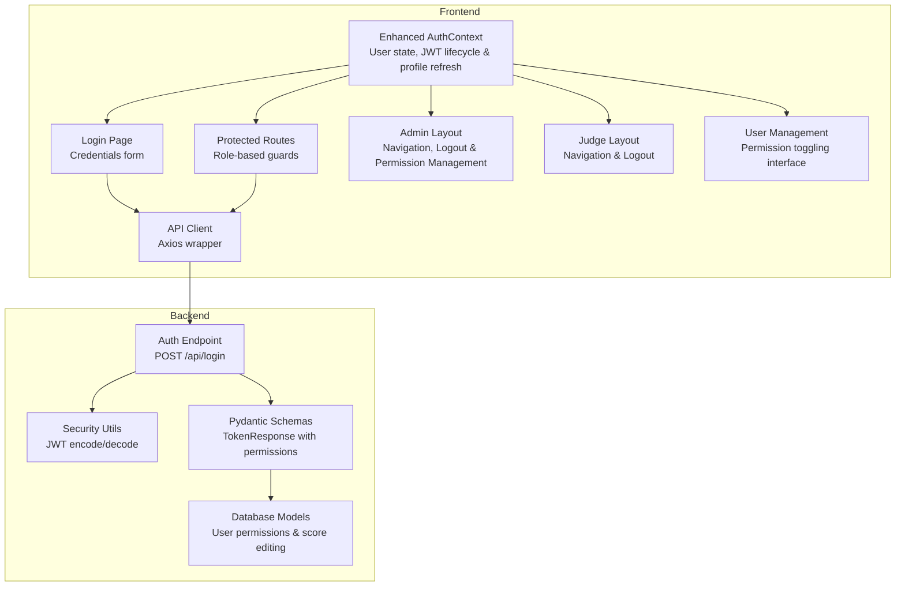
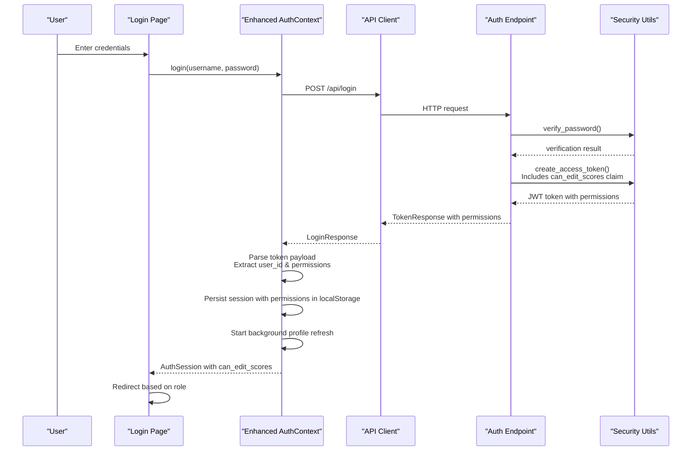
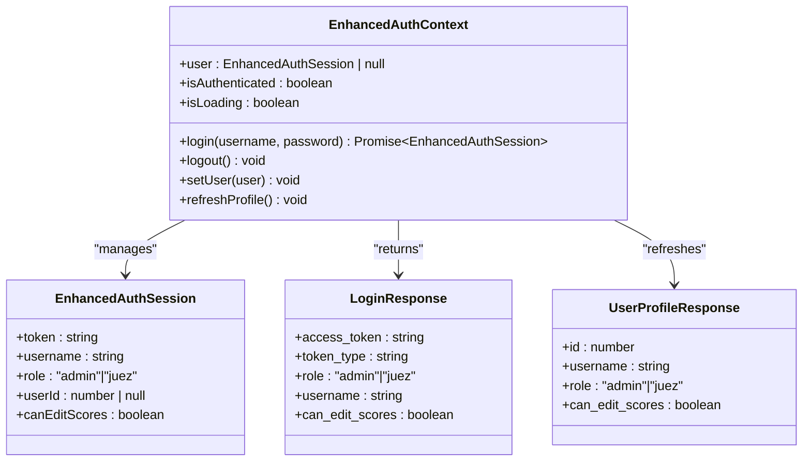
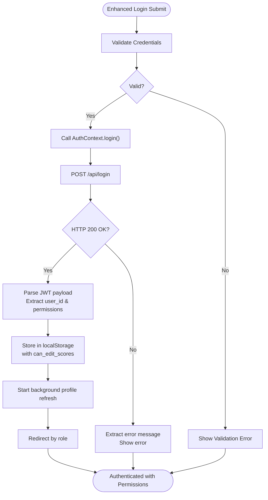
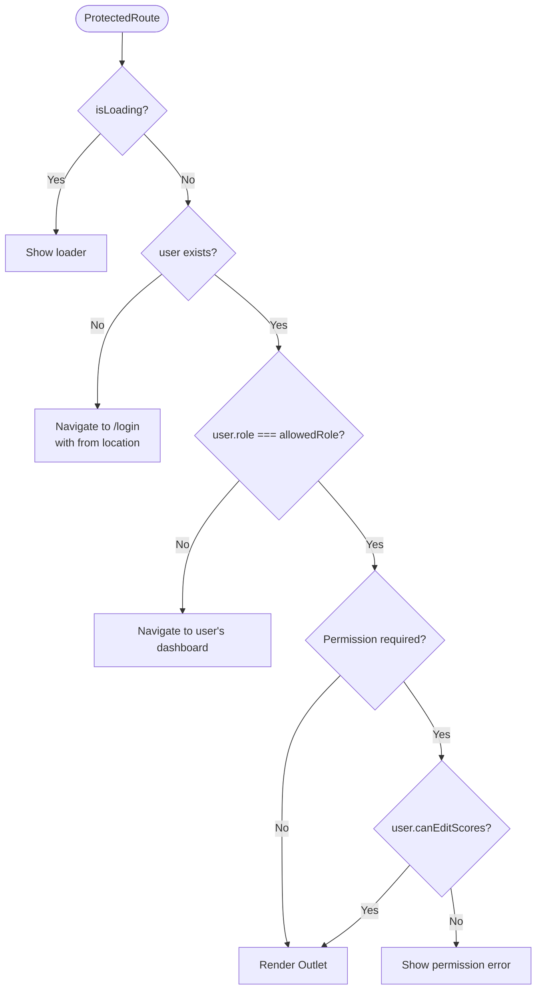
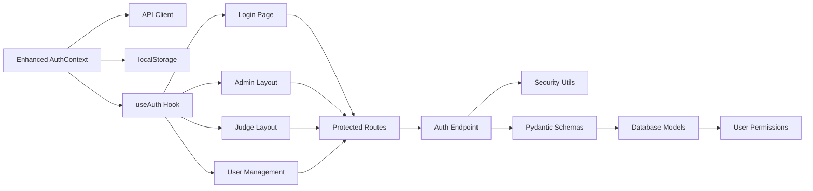

# Authentication Context

<cite>
**Referenced Files in This Document**
- [AuthContext.tsx](file://frontend/src/contexts/AuthContext.tsx)
- [api.ts](file://frontend/src/lib/api.ts)
- [App.tsx](file://frontend/src/App.tsx)
- [main.tsx](file://frontend/src/main.tsx)
- [Login.tsx](file://frontend/src/pages/Login.tsx)
- [AdminLayout.tsx](file://frontend/src/pages/admin/AdminLayout.tsx)
- [JuezLayout.tsx](file://frontend/src/pages/juez/JuezLayout.tsx)
- [Usuarios.tsx](file://frontend/src/pages/admin/Usuarios.tsx)
- [auth.py](file://routes/auth.py)
- [security.py](file://utils/security.py)
- [schemas.py](file://schemas.py)
- [models.py](file://models.py)
</cite>

## Update Summary
**Changes Made**
- Enhanced AuthContext with improved token parsing and user profile management
- Added support for `can_edit_scores` permission field in authentication context
- Implemented automatic user profile refresh mechanism
- Updated backend authentication to include permission claims
- Enhanced user management interface with permission toggling capabilities

## Table of Contents
1. [Introduction](#introduction)
2. [Project Structure](#project-structure)
3. [Core Components](#core-components)
4. [Architecture Overview](#architecture-overview)
5. [Detailed Component Analysis](#detailed-component-analysis)
6. [Dependency Analysis](#dependency-analysis)
7. [Performance Considerations](#performance-considerations)
8. [Troubleshooting Guide](#troubleshooting-guide)
9. [Conclusion](#conclusion)

## Introduction
This document provides comprehensive authentication context documentation for the JWT-based authentication system. It covers the enhanced AuthContext implementation with improved token parsing, user profile management, and better session handling. The system now includes support for the `can_edit_scores` permission, enabling fine-grained access control for score editing operations. The documentation covers user state management, login/logout functionality, token handling, authentication flow, role-based access control (admin/judge permissions), context provider setup, consumer patterns, hook usage, error handling, security considerations, state synchronization, and integration with protected routes.

## Project Structure
The authentication system spans the frontend React application and the backend FastAPI service with enhanced permission management:

- Frontend:
  - AuthContext manages user state, JWT lifecycle, and automatic profile refresh
  - Login page handles credentials and redirects based on role
  - Protected route guards enforce role-based access
  - API client centralizes HTTP requests with error handling
  - Admin and Judge layouts consume AuthContext for navigation, logout, and permission management
  - Enhanced user management interface with permission toggling

- Backend:
  - Authentication endpoint validates credentials, issues JWT tokens with role and permission claims
  - Security utilities manage token creation, verification, and expiration
  - Pydantic schemas define token response structure with permission fields
  - Database models store user permissions including score editing capabilities

**Diagram sources**
- [AuthContext.tsx:1-183](file://frontend/src/contexts/AuthContext.tsx#L1-L183)
- [Login.tsx:1-124](file://frontend/src/pages/Login.tsx#L1-L124)
- [App.tsx:1-131](file://frontend/src/App.tsx#L1-L131)
- [api.ts:1-41](file://frontend/src/lib/api.ts#L1-L41)
- [AdminLayout.tsx:1-252](file://frontend/src/pages/admin/AdminLayout.tsx#L1-L252)
- [JuezLayout.tsx:1-199](file://frontend/src/pages/juez/JuezLayout.tsx#L1-L199)
- [auth.py:1-37](file://routes/auth.py#L1-L37)
- [security.py:1-54](file://utils/security.py#L1-L54)
- [schemas.py:15-21](file://schemas.py#L15-L21)
- [models.py:11-26](file://models.py#L11-L26)

**Section sources**
- [AuthContext.tsx:1-183](file://frontend/src/contexts/AuthContext.tsx#L1-L183)
- [App.tsx:1-131](file://frontend/src/App.tsx#L1-L131)
- [api.ts:1-41](file://frontend/src/lib/api.ts#L1-L41)
- [auth.py:1-37](file://routes/auth.py#L1-L37)
- [security.py:1-54](file://utils/security.py#L1-L54)
- [schemas.py:15-21](file://schemas.py#L15-L21)
- [models.py:11-26](file://models.py#L11-L26)

## Core Components
- **Enhanced AuthContext**: Centralizes authentication state, login/logout, token hydration from localStorage, and automatic user profile refresh
- **Login Page**: Handles credential submission, error display, and role-based redirect
- **Protected Routes**: Guards admin/judge routes based on user role and loading state
- **API Client**: Axios instance with base URL and error extraction utility
- **Backend Auth Endpoint**: Validates credentials, issues JWT tokens with role and permission claims
- **Security Utilities**: JWT encoding/decoding and password hashing/verification
- **Pydantic Schemas**: Defines TokenResponse structure with permission fields for frontend consumption
- **Database Models**: Store user permissions including score editing capabilities

Key implementation highlights:
- **Enhanced JWT parsing**: Improved token payload parsing with robust error handling for user_id extraction
- **Automatic profile refresh**: Background refresh mechanism that periodically updates user permissions
- **Session persistence**: Stores token, user metadata, and permission flags in localStorage
- **Role-based routing**: Redirects authenticated users to appropriate dashboards
- **Permission management**: Supports `can_edit_scores` flag for fine-grained access control
- **Token usage**: Passes Authorization header with Bearer token for protected API calls

**Section sources**
- [AuthContext.tsx:12-35](file://frontend/src/contexts/AuthContext.tsx#L12-L35)
- [AuthContext.tsx:66-132](file://frontend/src/contexts/AuthContext.tsx#L66-L132)
- [Login.tsx:15-61](file://frontend/src/pages/Login.tsx#L15-L61)
- [App.tsx:17-69](file://frontend/src/App.tsx#L17-L69)
- [api.ts:4-41](file://frontend/src/lib/api.ts#L4-L41)
- [auth.py:13-37](file://routes/auth.py#L13-L37)
- [security.py:29-39](file://utils/security.py#L29-L39)
- [schemas.py:15-21](file://schemas.py#L15-L21)
- [models.py:11-26](file://models.py#L11-L26)

## Architecture Overview
The enhanced authentication flow integrates frontend and backend components with improved permission management:

**Diagram sources**
- [Login.tsx:38-61](file://frontend/src/pages/Login.tsx#L38-L61)
- [AuthContext.tsx:95-150](file://frontend/src/contexts/AuthContext.tsx#L95-L150)
- [api.ts:11-13](file://frontend/src/lib/api.ts#L11-L13)
- [auth.py:13-37](file://routes/auth.py#L13-L37)
- [security.py:22-35](file://utils/security.py#L22-L35)

## Detailed Component Analysis

### Enhanced AuthContext Implementation
The enhanced AuthContext manages:
- **User state**: token, username, role, userId, and canEditScores permission flag
- **Loading state**: during initial hydration and background refresh
- **Login function**: posts credentials, parses token with permissions, persists session
- **Logout function**: clears localStorage and resets user state
- **Background refresh**: automatically updates user permissions periodically
- **Hook usage**: useAuth() provides context to consumers

**Diagram sources**
- [AuthContext.tsx:14-35](file://frontend/src/contexts/AuthContext.tsx#L14-L35)

Key behaviors:
- **Hydration from localStorage**: Loads session including permission flags on mount
- **Enhanced token parsing**: Robust parsing with error handling for user_id extraction
- **Permission normalization**: Ensures canEditScores is properly typed as boolean
- **Background refresh**: Periodic API calls to update user permissions
- **Immediate state updates**: Synchronizes localStorage and state atomically

**Section sources**
- [AuthContext.tsx:66-132](file://frontend/src/contexts/AuthContext.tsx#L66-L132)
- [AuthContext.tsx:43-63](file://frontend/src/contexts/AuthContext.tsx#L43-L63)
- [AuthContext.tsx:105-131](file://frontend/src/contexts/AuthContext.tsx#L105-L131)

### Enhanced Login Flow and Token Handling
The enhanced login process:
- Validates input and prevents submission when invalid
- Calls AuthContext.login() which posts to /api/login with permission claims
- Receives TokenResponse with can_edit_scores flag and constructs EnhancedAuthSession
- Persists session including permissions and starts background refresh
- Redirects based on role with immediate permission awareness

**Diagram sources**
- [Login.tsx:38-61](file://frontend/src/pages/Login.tsx#L38-L61)
- [AuthContext.tsx:95-150](file://frontend/src/contexts/AuthContext.tsx#L95-L150)
- [api.ts:16-41](file://frontend/src/lib/api.ts#L16-L41)

**Section sources**
- [Login.tsx:15-61](file://frontend/src/pages/Login.tsx#L15-L61)
- [AuthContext.tsx:95-150](file://frontend/src/contexts/AuthContext.tsx#L95-L150)
- [api.ts:16-41](file://frontend/src/lib/api.ts#L16-L41)

### Role-Based Access Control with Permission Management
Protected routes enforce:
- Loading state handling while checking authentication
- Unauthenticated users redirected to /login with from location
- Role mismatch redirects to user's dashboard
- **Enhanced permission checks**: Admins can toggle judge permissions for score editing
- Outlet rendering for allowed roles with permission-aware components

**Diagram sources**
- [App.tsx:52-69](file://frontend/src/App.tsx#L52-L69)

**Section sources**
- [App.tsx:17-69](file://frontend/src/App.tsx#L17-L69)

### Context Provider Setup and Consumer Patterns
Provider setup:
- AuthProvider wraps the application in main.tsx
- Initializes user state from localStorage including permission flags on mount
- Starts background profile refresh mechanism
- Exposes user, isAuthenticated, isLoading, login, logout, setUser

Consumer patterns:
- useAuth() hook retrieves context value with enhanced permission awareness
- LoginPage uses useAuth() for login and redirect with permission handling
- AdminLayout uses useAuth() for logout, user display, and permission management
- JudgeLayout uses useAuth() for logout and basic user operations
- Protected pages use useAuth() for Authorization header and permission-aware data fetching

**Section sources**
- [main.tsx:10-18](file://frontend/src/main.tsx#L10-L18)
- [AuthContext.tsx:135-183](file://frontend/src/contexts/AuthContext.tsx#L135-L183)
- [Login.tsx:18-36](file://frontend/src/pages/Login.tsx#L18-L36)
- [AdminLayout.tsx:24-36](file://frontend/src/pages/admin/AdminLayout.tsx#L24-L36)
- [JuezLayout.tsx:8-13](file://frontend/src/pages/juez/JuezLayout.tsx#L8-L13)

### Enhanced Hook Usage Throughout the Application
Hooks are used consistently with permission awareness:
- useAuth() in Login.tsx for authentication state and login with permission handling
- useAuth() in AdminLayout.tsx for logout, profile updates, and permission management
- useAuth() in JuezLayout.tsx for logout and basic user operations
- useAuth() in protected pages for Authorization header and permission-aware operations
- **Enhanced user management**: useAuth() for permission toggling in Usuarios.tsx

Example usage patterns:
- Reading user state, role, and canEditScores for conditional rendering
- Calling login() with credentials and handling permission-aware responses
- Using user.token for API requests with Authorization header
- **Permission-based UI**: Conditional rendering based on canEditScores flag
- **Permission updates**: setUser() after permission changes in admin interface

**Section sources**
- [Login.tsx:18-61](file://frontend/src/pages/Login.tsx#L18-L61)
- [AdminLayout.tsx:24-97](file://frontend/src/pages/admin/AdminLayout.tsx#L24-L97)
- [JuezLayout.tsx:8-13](file://frontend/src/pages/juez/JuezLayout.tsx#L8-L13)
- [Usuarios.tsx:235-260](file://frontend/src/pages/admin/Usuarios.tsx#L235-L260)

### Error Handling for Authentication Failures
Error handling mechanisms:
- getApiErrorMessage() extracts detailed error messages from AxiosError
- Login page displays user-friendly error messages on failed login
- Protected routes show loader while checking authentication
- API calls in components handle errors and display messages
- **Enhanced permission errors**: Clear messaging for permission-related failures

Common error scenarios:
- Invalid credentials: HTTP 401 with detail message
- Network errors: AxiosError fallback message
- Token parsing errors: Graceful fallback to empty session
- **Permission errors**: Specific handling for permission-denied scenarios

**Section sources**
- [api.ts:16-41](file://frontend/src/lib/api.ts#L16-L41)
- [Login.tsx:54-60](file://frontend/src/pages/Login.tsx#L54-L60)
- [App.tsx:33-49](file://frontend/src/App.tsx#L33-L49)

### Security Considerations
Security measures implemented:
- JWT token storage in localStorage
- **Enhanced token payload parsing**: Robust base64 decoding with error handling for user_id extraction
- Role and permission claims embedded in JWT
- Authorization header with Bearer token for API requests
- Password hashing and verification on backend
- Token expiration via JWT exp claim
- **Permission-based access control**: Fine-grained control over score editing operations

Potential improvements:
- Secure cookie storage for tokens (HttpOnly, SameSite)
- CSRF protection for API requests
- Refresh token mechanism for long sessions
- Token rotation and re-authentication prompts
- **Enhanced audit logging**: Track permission changes and score edits

**Section sources**
- [AuthContext.tsx:43-63](file://frontend/src/contexts/AuthContext.tsx#L43-L63)
- [AuthContext.tsx:101-106](file://frontend/src/contexts/AuthContext.tsx#L101-L106)
- [AdminLayout.tsx:79-86](file://frontend/src/pages/admin/AdminLayout.tsx#L79-L86)
- [security.py:17-26](file://utils/security.py#L17-L26)
- [security.py:29-39](file://utils/security.py#L29-L39)

### State Synchronization and Integration with Protected Routes
State synchronization:
- Enhanced AuthContext maintains synchronized user state across components
- localStorage ensures persistence including permission flags across page reloads
- **Background refresh**: useEffect triggers periodic profile updates
- **Atomic updates**: setUser() ensures localStorage and state stay in sync

Integration with protected routes:
- ProtectedRoute checks isLoading, user existence, role, and permissions
- Automatic redirects prevent unauthorized access
- **Permission-aware redirects**: Prevent access to score-editing features without proper permissions
- Outlet rendering allows nested protected pages with permission validation

**Section sources**
- [AuthContext.tsx:70-93](file://frontend/src/contexts/AuthContext.tsx#L70-L93)
- [AuthContext.tsx:105-131](file://frontend/src/contexts/AuthContext.tsx#L105-L131)
- [App.tsx:52-69](file://frontend/src/App.tsx#L52-L69)

## Dependency Analysis
The enhanced authentication system exhibits clear separation of concerns with expanded permission management:

**Diagram sources**
- [AuthContext.tsx:9-10](file://frontend/src/contexts/AuthContext.tsx#L9-L10)
- [api.ts:11-13](file://frontend/src/lib/api.ts#L11-L13)
- [Login.tsx:5](file://frontend/src/pages/Login.tsx#L5)
- [AdminLayout.tsx:4](file://frontend/src/pages/admin/AdminLayout.tsx#L4)
- [JuezLayout.tsx:3](file://frontend/src/pages/juez/JuezLayout.tsx#L3)
- [App.tsx:3](file://frontend/src/App.tsx#L3)
- [auth.py:7](file://routes/auth.py#L7)
- [security.py:6](file://utils/security.py#L6)
- [schemas.py:6](file://schemas.py#L6)
- [models.py:11](file://models.py#L11)

**Section sources**
- [AuthContext.tsx:9-10](file://frontend/src/contexts/AuthContext.tsx#L9-L10)
- [App.tsx:3-14](file://frontend/src/App.tsx#L3-L14)
- [auth.py:1-10](file://routes/auth.py#L1-L10)
- [security.py:1-7](file://utils/security.py#L1-L7)
- [schemas.py:1-7](file://schemas.py#L1-L7)
- [models.py:1-7](file://models.py#L1-L7)

## Performance Considerations
- **Enhanced token parsing overhead**: Minimal impact due to improved base64 decoding and JSON parsing with error handling
- **Background refresh optimization**: Efficient periodic API calls with error suppression
- **Permission caching**: Local storage ensures immediate permission availability without network calls
- **localStorage I/O**: Efficient for small session objects including permission flags; consider encryption for sensitive data
- **API call batching**: Protected pages could benefit from concurrent requests where appropriate
- **Loading states**: Proper isLoading handling prevents unnecessary re-renders and improves UX

## Troubleshooting Guide
Common issues and resolutions:
- **Login fails with invalid credentials**: Verify backend credentials and ensure proper error message propagation
- **Token parsing errors**: Check JWT structure and ensure valid base64 payload segment with enhanced error handling
- **Protected route infinite loading**: Ensure AuthProvider wraps the application and user state hydrates correctly
- **API request failures**: Confirm Authorization header format and token validity
- **Role mismatch**: Verify backend role assignment and frontend role handling
- **Permission issues**: Check database permissions and ensure can_edit_scores flag is properly synchronized
- **Background refresh failures**: Verify API connectivity and token validity for periodic profile updates

Debugging tips:
- Inspect localStorage for juzgamiento.auth key including permission flags
- Monitor network tab for /api/login and /api/users/me endpoints
- Use browser dev tools to inspect AuthContext state with enhanced permission data
- Check backend logs for authentication and authorization errors
- Verify database entries for user permission flags

**Section sources**
- [AuthContext.tsx:70-93](file://frontend/src/contexts/AuthContext.tsx#L70-L93)
- [Login.tsx:54-60](file://frontend/src/pages/Login.tsx#L54-L60)
- [App.tsx:33-49](file://frontend/src/App.tsx#L33-L49)

## Conclusion
The enhanced authentication context provides a robust, role-based authentication system with comprehensive permission management capabilities. The implementation demonstrates secure token handling, automatic profile refresh, enhanced error management, and seamless integration with protected routes. The addition of the `can_edit_scores` permission flag enables fine-grained access control for score editing operations, while the improved token parsing and session handling provide better reliability and user experience. While the current design relies on localStorage for token persistence, future enhancements could include secure cookie storage, refresh token mechanisms, and enhanced security measures to meet production requirements.