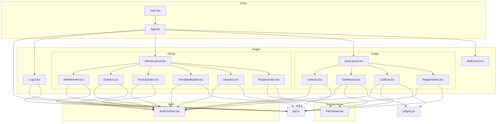
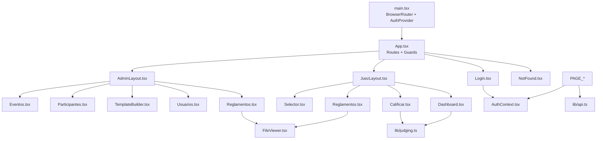
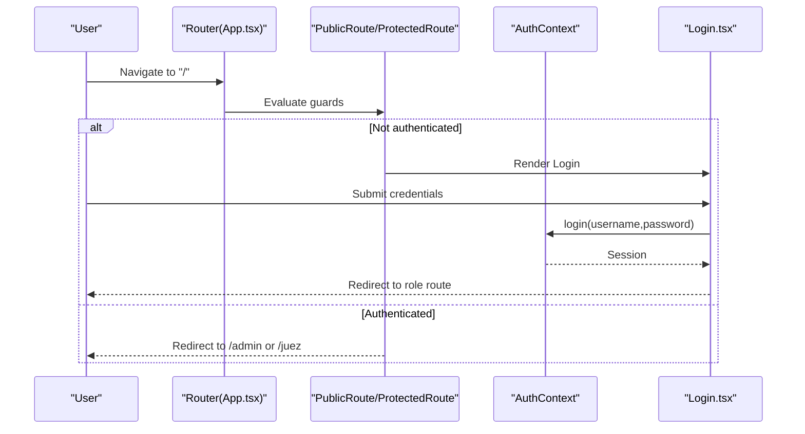
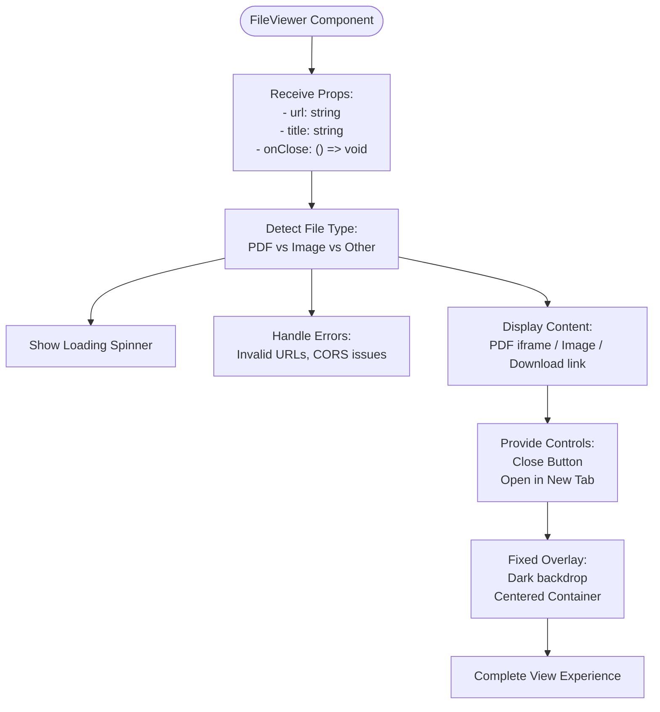
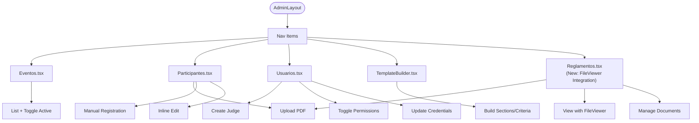
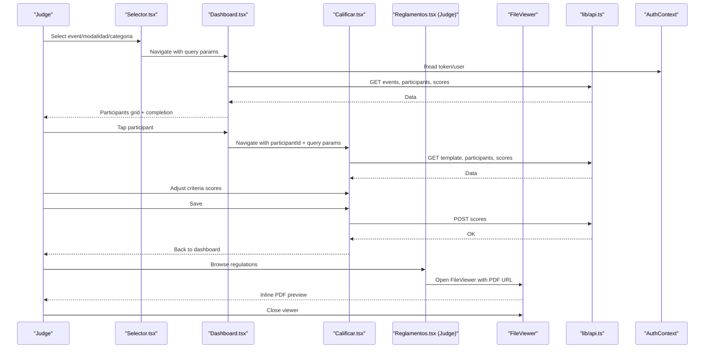
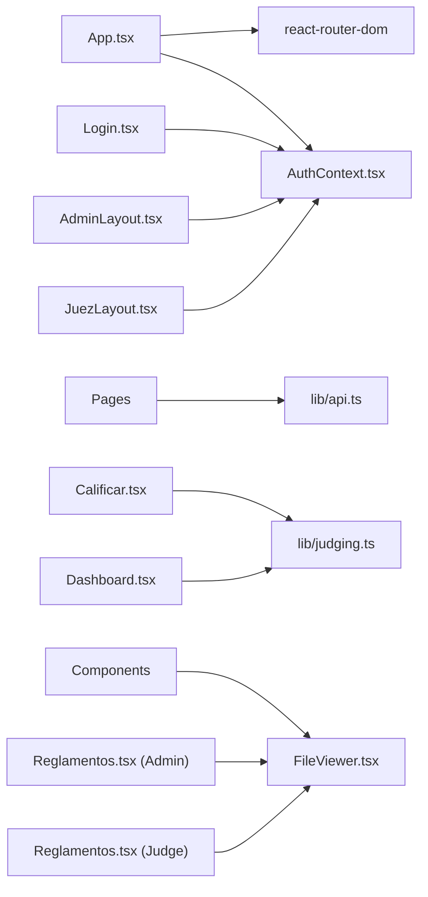

# Component Architecture

<cite>
**Referenced Files in This Document**
- [App.tsx](file://frontend/src/App.tsx)
- [main.tsx](file://frontend/src/main.tsx)
- [AuthContext.tsx](file://frontend/src/contexts/AuthContext.tsx)
- [api.ts](file://frontend/src/lib/api.ts)
- [judging.ts](file://frontend/src/lib/judging.ts)
- [Login.tsx](file://frontend/src/pages/Login.tsx)
- [AdminLayout.tsx](file://frontend/src/pages/admin/AdminLayout.tsx)
- [AdminHome.tsx](file://frontend/src/pages/admin/AdminHome.tsx)
- [Eventos.tsx](file://frontend/src/pages/admin/Eventos.tsx)
- [Participantes.tsx](file://frontend/src/pages/admin/Participantes.tsx)
- [TemplateBuilder.tsx](file://frontend/src/pages/admin/TemplateBuilder.tsx)
- [Usuarios.tsx](file://frontend/src/pages/admin/Usuarios.tsx)
- [Reglamentos.tsx](file://frontend/src/pages/admin/Reglamentos.tsx)
- [JuezLayout.tsx](file://frontend/src/pages/juez/JuezLayout.tsx)
- [Dashboard.tsx](file://frontend/src/pages/juez/Dashboard.tsx)
- [Selector.tsx](file://frontend/src/pages/juez/Selector.tsx)
- [Calificar.tsx](file://frontend/src/pages/juez/Calificar.tsx)
- [Reglamentos.tsx](file://frontend/src/pages/juez/Reglamentos.tsx)
- [FileViewer.tsx](file://frontend/src/components/FileViewer.tsx)
- [NotFound.tsx](file://frontend/src/pages/NotFound.tsx)
</cite>

## Update Summary
**Changes Made**
- Added comprehensive documentation for the new FileViewer component
- Updated component composition patterns to include FileViewer integration
- Enhanced document viewing capabilities section with detailed implementation
- Added FileViewer usage examples in admin and judge regulation pages
- Updated dependency analysis to include FileViewer as a reusable component

## Table of Contents
1. [Introduction](#introduction)
2. [Project Structure](#project-structure)
3. [Core Components](#core-components)
4. [Architecture Overview](#architecture-overview)
5. [Detailed Component Analysis](#detailed-component-analysis)
6. [Dependency Analysis](#dependency-analysis)
7. [Performance Considerations](#performance-considerations)
8. [Troubleshooting Guide](#troubleshooting-guide)
9. [Conclusion](#conclusion)

## Introduction
This document explains the React component architecture and organizational patterns used in the application. It covers the component hierarchy, prop passing strategies, state management approaches, and the specialized implementations for admin and judge roles. It also documents the main pages (Login, AdminHome, JudgeDashboard), component composition patterns, reusable UI elements, styling with Tailwind CSS, examples of form handling and data display, lifecycle management, performance optimization techniques, and accessibility considerations.

**Updated**: The application now includes a comprehensive FileViewer component that provides inline PDF and image viewing capabilities, enhancing the document management experience for both administrators and judges.

## Project Structure
The frontend is organized by feature and role:
- Root routing and guards live in the top-level app shell.
- Authentication state is centralized via a context provider.
- Pages are grouped under admin and judge namespaces, each with dedicated layouts.
- Shared libraries encapsulate API client and domain typing.
- **New**: FileViewer component provides inline PDF and image viewing capabilities with responsive design and error handling.

**Diagram sources**
- [main.tsx:1-19](file://frontend/src/main.tsx#L1-L19)
- [App.tsx:1-119](file://frontend/src/App.tsx#L1-L119)
- [AuthContext.tsx:1-144](file://frontend/src/contexts/AuthContext.tsx#L1-L144)
- [FileViewer.tsx:1-157](file://frontend/src/components/FileViewer.tsx#L1-L157)
- [Reglamentos.tsx:1-302](file://frontend/src/pages/admin/Reglamentos.tsx#L1-L302)
- [Reglamentos.tsx:1-171](file://frontend/src/pages/juez/Reglamentos.tsx#L1-L171)
- [Login.tsx:1-124](file://frontend/src/pages/Login.tsx#L1-L124)
- [AdminLayout.tsx:1-249](file://frontend/src/pages/admin/AdminLayout.tsx#L1-L249)
- [AdminHome.tsx:1-49](file://frontend/src/pages/admin/AdminHome.tsx#L1-L49)
- [Eventos.tsx:1-409](file://frontend/src/pages/admin/Eventos.tsx#L1-L409)
- [Participantes.tsx:1-693](file://frontend/src/pages/admin/Participantes.tsx#L1-L693)
- [TemplateBuilder.tsx:1-345](file://frontend/src/pages/admin/TemplateBuilder.tsx#L1-L345)
- [Usuarios.tsx:1-402](file://frontend/src/pages/admin/Usuarios.tsx#L1-L402)
- [JuezLayout.tsx:1-49](file://frontend/src/pages/juez/JuezLayout.tsx#L1-L49)
- [Selector.tsx:1-203](file://frontend/src/pages/juez/Selector.tsx#L1-L203)
- [Dashboard.tsx:1-271](file://frontend/src/pages/juez/Dashboard.tsx#L1-L271)
- [Calificar.tsx:1-398](file://frontend/src/pages/juez/Calificar.tsx#L1-L398)
- [NotFound.tsx:1-23](file://frontend/src/pages/NotFound.tsx#L1-L23)
- [api.ts:1-33](file://frontend/src/lib/api.ts#L1-L33)
- [judging.ts:1-64](file://frontend/src/lib/judging.ts#L1-L64)

**Section sources**
- [main.tsx:1-19](file://frontend/src/main.tsx#L1-L19)
- [App.tsx:1-119](file://frontend/src/App.tsx#L1-L119)

## Core Components
- Authentication Provider and Hook
  - Centralizes session state, persistence, and login/logout flows.
  - Provides loading, authentication status, and user metadata to consumers.
- Routing Guards
  - PublicRoute renders Login when unauthenticated; redirects authenticated users to their role home.
  - ProtectedRoute enforces role-based access and renders Outlet when authorized.
  - HomeRedirect sends authenticated users to the appropriate dashboard.
- Layouts
  - AdminLayout and JuezLayout wrap role-specific pages, provide navigation, and expose shared actions (logout, profile edit).
- **New**: FileViewer Component
  - Provides comprehensive document viewing capabilities with responsive design and error handling.
  - Supports PDF documents via iframe embedding, image files via direct display, and fallback download links for other formats.
  - Features fixed overlay with dark backdrop, centered container, loading states, error handling, and accessibility features.
  - Integrates seamlessly with regulation management pages for both admin and judge interfaces.
- Role-Specific Pages
  - Admin: Event management, participant import/edit, template builder, user management, regulation management with document viewing.
  - Judge: Event selector, dashboard of filtered participants, scoring sheet, regulation browsing with document preview.

**Section sources**
- [AuthContext.tsx:1-144](file://frontend/src/contexts/AuthContext.tsx#L1-L144)
- [App.tsx:17-88](file://frontend/src/App.tsx#L17-L88)
- [AdminLayout.tsx:22-249](file://frontend/src/pages/admin/AdminLayout.tsx#L22-L249)
- [JuezLayout.tsx:6-49](file://frontend/src/pages/juez/JuezLayout.tsx#L6-L49)
- [FileViewer.tsx:1-157](file://frontend/src/components/FileViewer.tsx#L1-L157)

## Architecture Overview
The application follows a layered pattern:
- Shell: main.tsx bootstraps the router and provider.
- Routing: App.tsx defines routes, guards, and nested layouts.
- State: AuthContext manages authentication state and exposes a hook.
- Domain: lib/api.ts provides a typed HTTP client; lib/judging.ts defines shared types.
- UI: Feature pages implement role-specific flows with Tailwind-based panels and forms.
- **New**: FileViewer component provides document viewing capabilities across admin and judge interfaces with comprehensive error handling and accessibility features.

**Diagram sources**
- [main.tsx:10-18](file://frontend/src/main.tsx#L10-L18)
- [App.tsx:91-118](file://frontend/src/App.tsx#L91-L118)
- [AuthContext.tsx:66-132](file://frontend/src/contexts/AuthContext.tsx#L66-L132)
- [FileViewer.tsx:1-157](file://frontend/src/components/FileViewer.tsx#L1-L157)
- [api.ts:11-13](file://frontend/src/lib/api.ts#L11-L13)
- [judging.ts:18-64](file://frontend/src/lib/judging.ts#L18-L64)

## Detailed Component Analysis

### Authentication and Routing Guards
- AuthProvider hydrates session from local storage, exposes login/logout, and persists tokens.
- PublicRoute prevents authenticated users from accessing Login and redirects based on role.
- ProtectedRoute enforces role and renders nested pages; otherwise redirects to the correct role route.
- HomeRedirect accelerates authenticated users to their dashboard.

**Diagram sources**
- [App.tsx:33-88](file://frontend/src/App.tsx#L33-L88)
- [AuthContext.tsx:95-116](file://frontend/src/contexts/AuthContext.tsx#L95-L116)
- [Login.tsx:15-61](file://frontend/src/pages/Login.tsx#L15-L61)

**Section sources**
- [AuthContext.tsx:66-132](file://frontend/src/contexts/AuthContext.tsx#L66-L132)
- [App.tsx:33-88](file://frontend/src/App.tsx#L33-L88)
- [Login.tsx:15-61](file://frontend/src/pages/Login.tsx#L15-L61)

### FileViewer Component
**New**: The FileViewer component provides comprehensive document viewing capabilities with the following features:

#### Core Features
- **Multi-format Support**: Handles PDF documents via iframe embedding, image files via direct display, and fallback download links for other formats
- **Responsive Design**: Fixed overlay with max-width container (max-w-6xl) and responsive height constraints (max-h-[90vh])
- **Loading States**: Animated spinner with blue loading indicator during document loading with timeout handling
- **Error Handling**: Graceful error states with rose-500 error styling, retry options, and external download fallbacks
- **Accessibility**: Proper alt text for images and title attributes for PDF iframes
- **Navigation Controls**: Close button with rose-600 styling and external open option for seamless user experience
- **Dynamic URL Resolution**: Automatic detection of file types (PDF vs Image) and server root resolution for local development

**Diagram sources**
- [FileViewer.tsx:1-157](file://frontend/src/components/FileViewer.tsx#L1-L157)

**Section sources**
- [FileViewer.tsx:1-157](file://frontend/src/components/FileViewer.tsx#L1-L157)

### Admin Role Implementation
- AdminLayout provides navigation and a profile edit modal with optimistic updates and server-side validation feedback.
- AdminHome displays role greeting and placeholders for future views.
- Eventos manages event creation, listing, toggling active state, and editing.
- Participantes handles bulk upload (.xlsx/.csv), manual registration, and per-event listing with inline editing.
- TemplateBuilder composes scoring templates with sections and criteria, validates inputs, and posts JSON structure.
- Usuarios creates judges, toggles permissions, and updates credentials.
- **New**: Reglamentos page manages regulation uploads, viewing, and deletion with FileViewer integration. The component includes comprehensive PDF upload functionality with modalidad filtering, file validation, and integrated document preview capabilities.

**Diagram sources**
- [AdminLayout.tsx:8-168](file://frontend/src/pages/admin/AdminLayout.tsx#L8-L168)
- [Reglamentos.tsx:1-302](file://frontend/src/pages/admin/Reglamentos.tsx#L1-L302)
- [Eventos.tsx:28-409](file://frontend/src/pages/admin/Eventos.tsx#L28-L409)
- [Participantes.tsx:74-693](file://frontend/src/pages/admin/Participantes.tsx#L74-L693)
- [TemplateBuilder.tsx:47-345](file://frontend/src/pages/admin/TemplateBuilder.tsx#L47-L345)
- [Usuarios.tsx:15-402](file://frontend/src/pages/admin/Usuarios.tsx#L15-L402)

**Section sources**
- [AdminLayout.tsx:22-249](file://frontend/src/pages/admin/AdminLayout.tsx#L22-L249)
- [AdminHome.tsx:4-49](file://frontend/src/pages/admin/AdminHome.tsx#L4-L49)
- [Eventos.tsx:28-409](file://frontend/src/pages/admin/Eventos.tsx#L28-L409)
- [Participantes.tsx:74-693](file://frontend/src/pages/admin/Participantes.tsx#L74-L693)
- [TemplateBuilder.tsx:47-345](file://frontend/src/pages/admin/TemplateBuilder.tsx#L47-L345)
- [Usuarios.tsx:15-402](file://frontend/src/pages/admin/Usuarios.tsx#L15-L402)
- [Reglamentos.tsx:1-302](file://frontend/src/pages/admin/Reglamentos.tsx#L1-L302)

### Judge Role Implementation
- JuezLayout provides a header with logout and role branding.
- SelectorPage lets judges choose active event, modalidad, and categoria; navigates to dashboard with query params.
- DashboardPage loads events, participants, and scores; computes completion; navigates to evaluation.
- CalificarPage loads template, participant, and existing scores; supports incremental scoring and saving.
- **New**: Reglamentos page allows judges to browse regulations filtered by their selected modalidad with FileViewer integration. The component implements modalidad-based filtering, responsive card layouts, and seamless document preview functionality.

**Diagram sources**
- [JuezLayout.tsx:6-49](file://frontend/src/pages/juez/JuezLayout.tsx#L6-L49)
- [Selector.tsx:24-203](file://frontend/src/pages/juez/Selector.tsx#L24-L203)
- [Dashboard.tsx:13-271](file://frontend/src/pages/juez/Dashboard.tsx#L13-L271)
- [Calificar.tsx:79-398](file://frontend/src/pages/juez/Calificar.tsx#L79-L398)
- [Reglamentos.tsx:1-171](file://frontend/src/pages/juez/Reglamentos.tsx#L1-L171)
- [FileViewer.tsx:1-157](file://frontend/src/components/FileViewer.tsx#L1-L157)
- [api.ts:11-13](file://frontend/src/lib/api.ts#L11-L13)
- [AuthContext.tsx:135-143](file://frontend/src/contexts/AuthContext.tsx#L135-L143)

**Section sources**
- [JuezLayout.tsx:6-49](file://frontend/src/pages/juez/JuezLayout.tsx#L6-L49)
- [Selector.tsx:24-203](file://frontend/src/pages/juez/Selector.tsx#L24-L203)
- [Dashboard.tsx:13-271](file://frontend/src/pages/juez/Dashboard.tsx#L13-L271)
- [Calificar.tsx:79-398](file://frontend/src/pages/juez/Calificar.tsx#L79-L398)
- [Reglamentos.tsx:1-171](file://frontend/src/pages/juez/Reglamentos.tsx#L1-L171)
- [FileViewer.tsx:1-157](file://frontend/src/components/FileViewer.tsx#L1-L157)

### Main Page Components and Responsibilities
- Login
  - Handles credentials submission, redirects based on role, and displays API errors.
- AdminHome
  - Welcomes admin, lists quick-access cards, and logs out.
- JudgeDashboard
  - Filters participants by event/modalidad/categoria, shows progress, and opens evaluation.
- **New**: Reglamentos (Admin)
  - Manages PDF regulation uploads with modalidad filtering, viewing, and deletion with FileViewer integration.
- **New**: Reglamentos (Judge)
  - Allows judges to browse regulations filtered by modalidad with inline viewing capabilities through FileViewer.

**Section sources**
- [Login.tsx:15-124](file://frontend/src/pages/Login.tsx#L15-L124)
- [AdminHome.tsx:4-49](file://frontend/src/pages/admin/AdminHome.tsx#L4-L49)
- [Dashboard.tsx:13-271](file://frontend/src/pages/juez/Dashboard.tsx#L13-L271)
- [Reglamentos.tsx:1-302](file://frontend/src/pages/admin/Reglamentos.tsx#L1-L302)
- [Reglamentos.tsx:1-171](file://frontend/src/pages/juez/Reglamentos.tsx#L1-L171)

### Component Composition Patterns and Reusable UI
- Panels and Forms
  - Consistent panel containers with rounded borders and spacing; form controls use touch-friendly inputs and buttons.
- Navigation
  - AdminLayout uses NavLink for active-state styling; JuezLayout uses a header with action buttons.
- Modals and Overlays
  - AdminLayout's profile edit modal uses a fixed overlay with controlled inputs and validation feedback.
  - **New**: FileViewer uses fixed overlay with dark backdrop (bg-black/80) and centered container for document viewing.
- Data Display
  - Dashboard uses grid cards with conditional styling based on completion; Selector shows formatted event labels.
  - **New**: Regulation cards display titles, modalidad tags, and FileViewer-triggered viewing with PDF preview.

**Section sources**
- [AdminLayout.tsx:99-249](file://frontend/src/pages/admin/AdminLayout.tsx#L99-L249)
- [Dashboard.tsx:109-271](file://frontend/src/pages/juez/Dashboard.tsx#L109-L271)
- [Selector.tsx:95-203](file://frontend/src/pages/juez/Selector.tsx#L95-L203)
- [FileViewer.tsx:42-155](file://frontend/src/components/FileViewer.tsx#L42-L155)

### Styling Approach with Tailwind CSS
- Utility-first classes define layout, color, spacing, and typography.
- Responsive variants (sm:, lg:) adapt panels and grids for different screen sizes.
- Interactive states (hover, focus, active) and shadows emphasize affordances.
- Brand and neutral palettes are consistently applied across components.
- **New**: FileViewer uses dark theme with slate-900 backgrounds, rose-600 close buttons, and brand-500 accents for consistent design language.

### Form Handling Examples
- Login: Controlled inputs, submit prevention, loading state, and error messaging.
- Selector: Validates selection before navigating; uses URLSearchParams to pass filters.
- Participantes: Bulk upload with FormData; manual registration with multi-assignment support; inline editing with validation.
- TemplateBuilder: Dynamic sections and criteria with real-time JSON preview; validation before save.
- Usuarios: Conditional permission toggle and credential updates with optimistic UX.
- **New**: Reglamentos (Admin): PDF upload with FormData, validation, and FileViewer integration for viewing.
- **New**: Reglamentos (Judge): Modalidad filtering and FileViewer integration for document preview.

**Section sources**
- [Login.tsx:15-124](file://frontend/src/pages/Login.tsx#L15-L124)
- [Selector.tsx:78-93](file://frontend/src/pages/juez/Selector.tsx#L78-L93)
- [Participantes.tsx:149-271](file://frontend/src/pages/admin/Participantes.tsx#L149-L271)
- [TemplateBuilder.tsx:142-190](file://frontend/src/pages/admin/TemplateBuilder.tsx#L142-L190)
- [Usuarios.tsx:61-180](file://frontend/src/pages/admin/Usuarios.tsx#L61-L180)
- [Reglamentos.tsx:1-302](file://frontend/src/pages/admin/Reglamentos.tsx#L1-L302)
- [Reglamentos.tsx:1-171](file://frontend/src/pages/juez/Reglamentos.tsx#L1-L171)

### Data Display Components and Interactive Elements
- Dashboard participant cards reflect completion status with dynamic classes and badges.
- Selector selects event, modalidad, and categoria; shows current selection summary.
- Calificar provides increment buttons per criterion and a sticky footer with total score and save button.
- **New**: Regulation cards display titles, modalidad tags, and FileViewer-triggered viewing with PDF preview.
- **New**: FileViewer provides inline document viewing with loading states and error handling.

**Section sources**
- [Dashboard.tsx:197-271](file://frontend/src/pages/juez/Dashboard.tsx#L197-L271)
- [Selector.tsx:172-203](file://frontend/src/pages/juez/Selector.tsx#L172-L203)
- [Calificar.tsx:243-398](file://frontend/src/pages/juez/Calificar.tsx#L243-L398)
- [Reglamentos.tsx:250-288](file://frontend/src/pages/admin/Reglamentos.tsx#L250-L288)
- [Reglamentos.tsx:131-157](file://frontend/src/pages/juez/Reglamentos.tsx#L131-L157)
- [FileViewer.tsx:72-147](file://frontend/src/components/FileViewer.tsx#L72-L147)

### Component Lifecycle Management
- Effects orchestrate data fetching on mount and when dependencies change.
- Memoization avoids unnecessary recalculations (e.g., completion count, template preview).
- Cleanup and early returns prevent redundant network calls when token or context is missing.
- **New**: FileViewer manages loading states and error handling through useState hooks with useEffect for cleanup.

**Section sources**
- [Dashboard.tsx:33-95](file://frontend/src/pages/juez/Dashboard.tsx#L33-L95)
- [Selector.tsx:45-76](file://frontend/src/pages/juez/Selector.tsx#L45-L76)
- [Calificar.tsx:106-185](file://frontend/src/pages/juez/Calificar.tsx#L106-L185)
- [FileViewer.tsx:27-40](file://frontend/src/components/FileViewer.tsx#L27-L40)

### Performance Considerations
- Parallel data loading reduces latency (Promise.all for dashboard).
- Memoization of derived values (e.g., total score, preview JSON) minimizes re-renders.
- Conditional rendering hides heavy loaders until data arrives.
- Avoid excessive re-renders by passing stable callbacks and avoiding inline object/function creation in render scope.
- **New**: FileViewer optimizes performance through lazy loading of PDF content, efficient error state management, and automatic file type detection.

**Section sources**
- [Dashboard.tsx:48-95](file://frontend/src/pages/juez/Dashboard.tsx#L48-L95)
- [Calificar.tsx:101-104](file://frontend/src/pages/juez/Calificar.tsx#L101-L104)
- [TemplateBuilder.tsx:57-67](file://frontend/src/pages/admin/TemplateBuilder.tsx#L57-L67)
- [FileViewer.tsx:17-25](file://frontend/src/components/FileViewer.tsx#L17-L25)

### Accessibility Considerations
- Semantic labels and inputs improve screen reader support.
- Disabled states communicate interactivity constraints.
- Keyboard-friendly controls (buttons, selects) and focus styles enhance usability.
- Sufficient color contrast and readable text sizes across panels and forms.
- **New**: FileViewer includes proper alt text for images, title attributes for PDF iframes, and accessible close button with proper ARIA attributes.

## Dependency Analysis
The frontend depends on:
- React Router for routing and guards.
- Axios for HTTP requests with a shared client.
- Local storage for session persistence.
- TypeScript types for judging domain entities.
- **New**: FileViewer component as a reusable document viewing utility integrated into regulation management pages.

**Diagram sources**
- [App.tsx:1-14](file://frontend/src/App.tsx#L1-L14)
- [AuthContext.tsx:9-13](file://frontend/src/contexts/AuthContext.tsx#L9-L13)
- [api.ts:1-13](file://frontend/src/lib/api.ts#L1-L13)
- [judging.ts:1-64](file://frontend/src/lib/judging.ts#L1-L64)
- [FileViewer.tsx:1-157](file://frontend/src/components/FileViewer.tsx#L1-L157)
- [Reglamentos.tsx:1-302](file://frontend/src/pages/admin/Reglamentos.tsx#L1-L302)
- [Reglamentos.tsx:1-171](file://frontend/src/pages/juez/Reglamentos.tsx#L1-L171)

**Section sources**
- [App.tsx:1-14](file://frontend/src/App.tsx#L1-L14)
- [AuthContext.tsx:9-13](file://frontend/src/contexts/AuthContext.tsx#L9-L13)
- [api.ts:1-13](file://frontend/src/lib/api.ts#L1-L13)
- [judging.ts:1-64](file://frontend/src/lib/judging.ts#L1-L64)
- [FileViewer.tsx:1-157](file://frontend/src/components/FileViewer.tsx#L1-L157)

## Performance Considerations
- Prefer memoization for derived data and expensive computations.
- Batch API calls when possible to reduce round trips.
- Lazy-load heavy components only when necessary.
- Keep state granular to avoid unnecessary re-renders.
- **New**: FileViewer optimizes performance through efficient state management, conditional rendering, and automatic file type detection.

## Troubleshooting Guide
- Authentication errors
  - Verify token presence and validity; check local storage hydration and expiration handling.
- API failures
  - Use getApiErrorMessage to surface backend messages; inspect network tab for 4xx/5xx responses.
- Navigation issues
  - Confirm ProtectedRoute allowedRole matches user role; ensure query params are present for judge flows.
- Form validation
  - Ensure required fields are trimmed and validated before submission; show concise error messages.
- **New**: FileViewer issues
  - Verify PDF URLs are accessible and not blocked by CORS policies; check browser console for iframe loading errors.
  - Ensure FileViewer receives valid props (url, title, onClose); verify URL format includes protocol (http/https).
  - Check server root resolution for local development environments using getServerRoot() function.
  - Verify file type detection logic for PDF (.pdf) and image extensions (jpg, jpeg, png, gif, webp, bmp).

**Section sources**
- [AuthContext.tsx:70-93](file://frontend/src/contexts/AuthContext.tsx#L70-L93)
- [api.ts:16-32](file://frontend/src/lib/api.ts#L16-L32)
- [App.tsx:52-69](file://frontend/src/App.tsx#L52-L69)
- [Login.tsx:38-61](file://frontend/src/pages/Login.tsx#L38-L61)
- [FileViewer.tsx:10-15](file://frontend/src/components/FileViewer.tsx#L10-L15)
- [FileViewer.tsx:22-25](file://frontend/src/components/FileViewer.tsx#L22-L25)

## Conclusion
The application employs a clean, role-based component architecture with centralized authentication, robust routing guards, and consistent UI patterns. Admin and judge experiences are tailored through dedicated layouts and pages, while shared libraries and types ensure maintainability. The addition of the FileViewer component enhances document management capabilities by providing inline PDF and image viewing without external downloads. The component features comprehensive error handling, responsive design, and accessibility considerations. The design emphasizes composability, accessibility, and performance through memoization and efficient data fetching strategies, with the new FileViewer component adding comprehensive document viewing functionality across both admin and judge interfaces. The FileViewer component serves as a reusable utility that improves user experience by eliminating the need for external applications while maintaining security and performance standards.