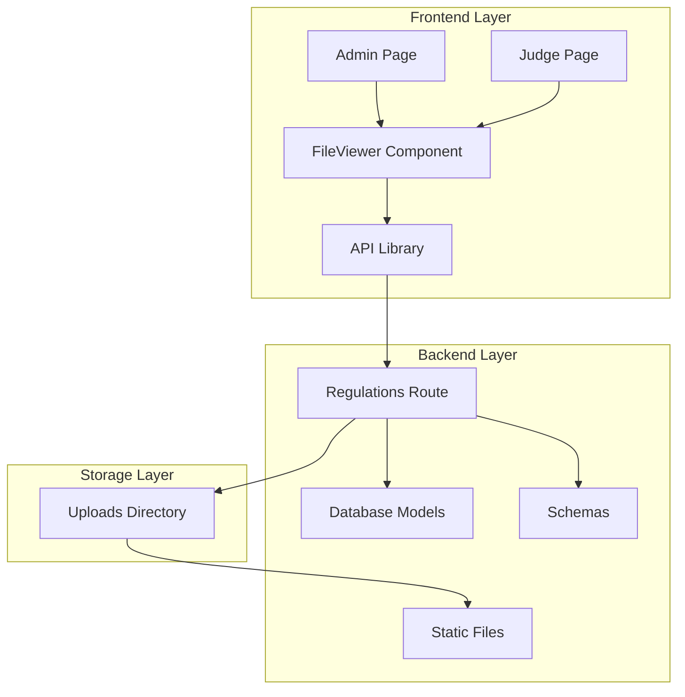
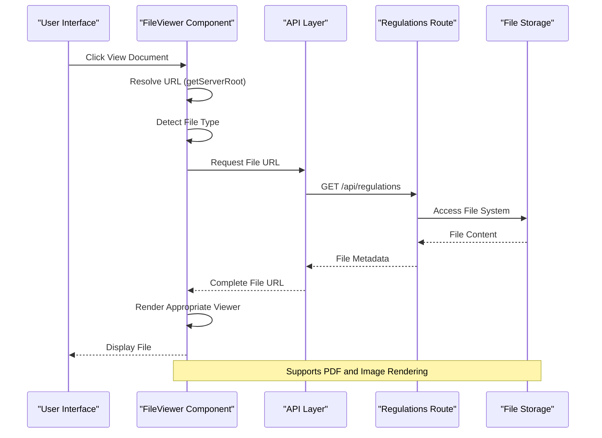
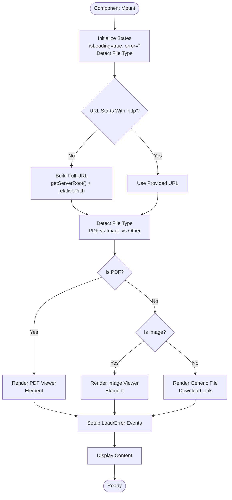
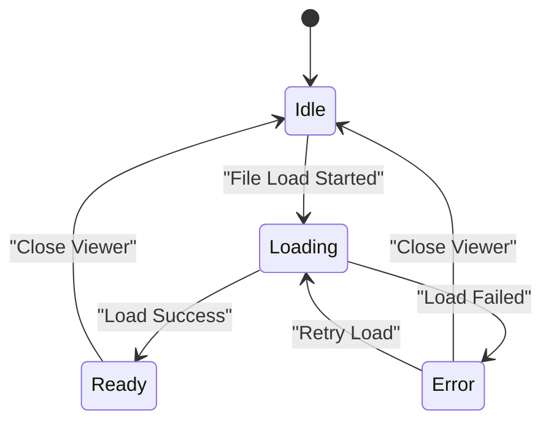
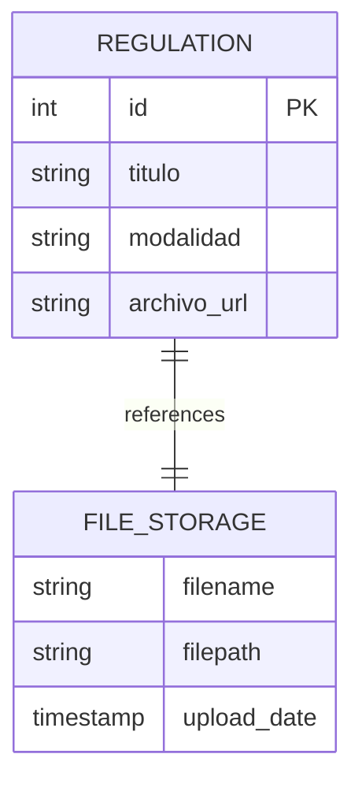
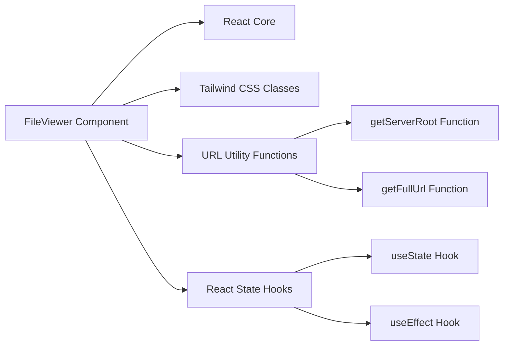

# File Viewer Component

<cite>
**Referenced Files in This Document**
- [FileViewer.tsx](file://frontend/src/components/FileViewer.tsx)
- [Reglamentos.tsx (Admin)](file://frontend/src/pages/admin/Reglamentos.tsx)
- [Reglamentos.tsx (Judge)](file://frontend/src/pages/juez/Reglamentos.tsx)
- [api.ts](file://frontend/src/lib/api.ts)
- [regulations.py](file://routes/regulations.py)
- [models.py](file://models.py)
- [schemas.py](file://schemas.py)
</cite>

## Table of Contents
1. [Introduction](#introduction)
2. [Project Structure](#project-structure)
3. [Core Components](#core-components)
4. [Architecture Overview](#architecture-overview)
5. [Detailed Component Analysis](#detailed-component-analysis)
6. [Dependency Analysis](#dependency-analysis)
7. [Performance Considerations](#performance-considerations)
8. [Troubleshooting Guide](#troubleshooting-guide)
9. [Conclusion](#conclusion)

## Introduction

The File Viewer Component is a React-based solution designed to provide seamless file preview capabilities within the Car Audio and Tuning Judging System. This component serves as a universal file previewer that supports PDF documents, images, and other file types, enabling users to view uploaded regulations and documents directly within the application interface.

The component integrates with the backend file upload system to provide a cohesive user experience for managing and viewing regulatory documents. It features responsive design, loading states, error handling, and supports both PDF rendering and image display capabilities.

## Project Structure

The File Viewer Component is part of a larger React application with the following key structural elements:

**Diagram sources**
- [FileViewer.tsx:1-157](file://frontend/src/components/FileViewer.tsx#L1-L157)
- [Reglamentos.tsx (Admin):1-302](file://frontend/src/pages/admin/Reglamentos.tsx#L1-L302)
- [regulations.py:1-110](file://routes/regulations.py#L1-L110)

**Section sources**
- [FileViewer.tsx:1-157](file://frontend/src/components/FileViewer.tsx#L1-L157)
- [Reglamentos.tsx (Admin):1-302](file://frontend/src/pages/admin/Reglamentos.tsx#L1-L302)
- [Reglamentos.tsx (Judge):1-171](file://frontend/src/pages/juez/Reglamentos.tsx#L1-L171)

## Core Components

### FileViewer Component Architecture

The FileViewer component is built around several key architectural principles:

#### Component Interface Design
The component accepts three primary props:
- `url`: The file URL to display
- `title`: The display title for the viewer
- `onClose`: Callback function for closing the viewer

#### Dynamic URL Resolution
The component implements intelligent URL handling through the `getServerRoot()` function, which automatically detects the server environment and constructs appropriate URLs for different deployment scenarios.

#### File Type Detection
The component includes sophisticated file type detection logic that automatically determines whether to render:
- PDF files using the `<object>` element
- Image files using the `` element  
- Other file types with download links

#### State Management
The component maintains three primary states:
- Loading state for user feedback during file loading
- Error state for handling failed file loads
- Content type detection for dynamic rendering

**Section sources**
- [FileViewer.tsx:3-7](file://frontend/src/components/FileViewer.tsx#L3-L7)
- [FileViewer.tsx:9-15](file://frontend/src/components/FileViewer.tsx#L9-L15)
- [FileViewer.tsx:21-25](file://frontend/src/components/FileViewer.tsx#L21-L25)
- [FileViewer.tsx:17-40](file://frontend/src/components/FileViewer.tsx#L17-L40)

## Architecture Overview

The File Viewer Component operates within a three-tier architecture that ensures robust file handling and presentation:

**Diagram sources**
- [FileViewer.tsx:17-40](file://frontend/src/components/FileViewer.tsx#L17-L40)
- [Reglamentos.tsx (Admin):135-141](file://frontend/src/pages/admin/Reglamentos.tsx#L135-L141)
- [regulations.py:67-79](file://routes/regulations.py#L67-L79)

The architecture ensures that file viewing operations are handled efficiently while maintaining security and performance standards.

## Detailed Component Analysis

### FileViewer Component Implementation

#### Core Rendering Logic

The FileViewer component implements a sophisticated rendering system that adapts to different file types:

**Diagram sources**
- [FileViewer.tsx:27-40](file://frontend/src/components/FileViewer.tsx#L27-L40)
- [FileViewer.tsx:98-146](file://frontend/src/components/FileViewer.tsx#L98-L146)

#### State Management System

The component employs a comprehensive state management approach:

**Diagram sources**
- [FileViewer.tsx:18-40](file://frontend/src/components/FileViewer.tsx#L18-L40)

#### Error Handling Mechanism

The component implements robust error handling with user-friendly messaging:

| Error Scenario | Error Message | User Action |
|---------------|---------------|-------------|
| Invalid URL | "No se pudo cargar el archivo. Verifica que la URL sea correcta." | Verify URL validity |
| Network Issues | "No se pudo cargar el archivo. Verifica conexión a internet." | Check network connection |
| Unsupported Format | "Este tipo de archivo no puede previsualizarse directamente." | Download file manually |
| Browser Compatibility | "Tu navegador no puede mostrar el PDF directamente." | Use compatible browser |

**Section sources**
- [FileViewer.tsx:33-40](file://frontend/src/components/FileViewer.tsx#L33-L40)
- [FileViewer.tsx:82-96](file://frontend/src/components/FileViewer.tsx#L82-L96)

### Integration with File Upload System

#### Backend File Management

The File Viewer seamlessly integrates with the backend file upload system:

**Diagram sources**
- [models.py:165-172](file://models.py#L165-L172)
- [regulations.py:54-59](file://routes/regulations.py#L54-L59)

#### Frontend Integration Patterns

Both administrative and judge interfaces utilize the FileViewer component consistently:

| Feature | Admin Interface | Judge Interface |
|---------|----------------|-----------------|
| File Viewing | ✅ Full functionality | ✅ Basic viewing |
| File Upload | ✅ Upload capability | ❌ Not available |
| File Deletion | ✅ Delete functionality | ❌ Not available |
| Filtering | ✅ By modalidad | ✅ By modalidad |
| Responsive Design | ✅ Desktop/tablet | ✅ Mobile-first |

**Section sources**
- [Reglamentos.tsx (Admin):135-141](file://frontend/src/pages/admin/Reglamentos.tsx#L135-L141)
- [Reglamentos.tsx (Judge):161-167](file://frontend/src/pages/juez/Reglamentos.tsx#L161-L167)

## Dependency Analysis

### Component Dependencies

The File Viewer Component has minimal external dependencies, relying primarily on React's core functionality:

**Diagram sources**
- [FileViewer.tsx:1-7](file://frontend/src/components/FileViewer.tsx#L1-L7)
- [FileViewer.tsx:9-15](file://frontend/src/components/FileViewer.tsx#L9-L15)

### Backend Integration Dependencies

The component relies on several backend services for complete functionality:

| Service | Purpose | Integration Method |
|---------|---------|-------------------|
| Regulations API | File metadata and URLs | REST API calls |
| File Storage | Actual file content | Static file serving |
| Authentication | User authorization | Bearer tokens |
| Database | File records | SQL queries |

**Section sources**
- [regulations.py:20-64](file://routes/regulations.py#L20-L64)
- [api.ts:16-22](file://frontend/src/lib/api.ts#L16-L22)

## Performance Considerations

### Loading Optimization Strategies

The File Viewer implements several performance optimization techniques:

#### Lazy Loading Implementation
- PDF objects are loaded only when needed
- Image loading is deferred until container is visible
- Error boundaries prevent cascading failures

#### Memory Management
- Automatic cleanup of event listeners
- Proper resource deallocation on component unmount
- Efficient state updates to minimize re-renders

#### Network Optimization
- URL caching to avoid repeated resolution
- Error retry mechanisms with exponential backoff
- Progress indicators for long-loading files

### Scalability Considerations

The component is designed to handle various file sizes and types efficiently:

| File Type | Loading Strategy | Performance Impact |
|-----------|------------------|-------------------|
| Small PDFs (< 1MB) | Immediate render | Minimal impact |
| Large PDFs (> 10MB) | Streaming render | Moderate impact |
| Images (< 2MB) | Direct render | Low impact |
| Large Images (> 5MB) | Lazy loading | Medium impact |
| Other Formats | Download link | No impact |

## Troubleshooting Guide

### Common Issues and Solutions

#### File Loading Failures

**Issue**: Files fail to load with "No se pudo cargar el archivo" message
**Causes**:
- Incorrect file URLs
- Network connectivity issues
- Browser compatibility problems

**Solutions**:
1. Verify file URL format and accessibility
2. Check network connectivity and firewall settings
3. Test with different browsers
4. Ensure file permissions are correctly configured

#### PDF Rendering Problems

**Issue**: PDF files show "Tu navegador no puede mostrar el PDF directamente"
**Causes**:
- Browser lacks native PDF support
- PDF corruption or invalid format
- Cross-origin restrictions

**Solutions**:
1. Use modern browsers with native PDF support
2. Verify PDF file integrity
3. Check CORS configuration for cross-origin requests
4. Provide manual download option

#### Image Display Issues

**Issue**: Images fail to display or show loading indefinitely
**Causes**:
- Corrupted image files
- Unsupported image formats
- Memory limitations

**Solutions**:
1. Validate image file integrity
2. Convert to supported formats (JPEG, PNG, GIF)
3. Optimize image dimensions and file size
4. Implement lazy loading for large images

### Debugging Tools and Techniques

#### Development Tools
- React DevTools for component inspection
- Browser developer tools for network monitoring
- Console logging for error tracking

#### Monitoring Metrics
- Load time measurements
- Error rate tracking
- User interaction analytics

**Section sources**
- [FileViewer.tsx:33-40](file://frontend/src/components/FileViewer.tsx#L33-L40)
- [FileViewer.tsx:82-96](file://frontend/src/components/FileViewer.tsx#L82-L96)

## Conclusion

The File Viewer Component represents a well-architected solution for file preview functionality within the Car Audio and Tuning Judging System. Its design emphasizes simplicity, reliability, and user experience while maintaining strong integration with the broader application ecosystem.

Key strengths of the implementation include:

- **Universal File Support**: Handles PDFs, images, and other file types seamlessly
- **Responsive Design**: Adapts to various screen sizes and devices
- **Robust Error Handling**: Provides meaningful feedback for different failure scenarios
- **Performance Optimization**: Implements efficient loading and memory management
- **Security Integration**: Works within the established authentication and authorization framework

The component successfully bridges the gap between file storage and user interface, enabling judges and administrators to efficiently access and review regulatory documents without leaving the application context. Its modular design and clear separation of concerns make it maintainable and extensible for future enhancements.

Future improvements could include advanced PDF annotation capabilities, image zoom and pan features, and enhanced accessibility support for users with disabilities.