# Frontend Application Architecture

<cite>
**Referenced Files in This Document**
- [main.tsx](file://frontend/src/main.tsx)
- [App.tsx](file://frontend/src/App.tsx)
- [AuthContext.tsx](file://frontend/src/contexts/AuthContext.tsx)
- [api.ts](file://frontend/src/lib/api.ts)
- [judging.ts](file://frontend/src/lib/judging.ts)
- [AdminLayout.tsx](file://frontend/src/pages/admin/AdminLayout.tsx)
- [JuezLayout.tsx](file://frontend/src/pages/juez/JuezLayout.tsx)
- [Login.tsx](file://frontend/src/pages/Login.tsx)
- [NotFound.tsx](file://frontend/src/pages/NotFound.tsx)
- [Reglamentos.tsx](file://frontend/src/pages/admin/Reglamentos.tsx)
- [Categorias.tsx](file://frontend/src/pages/admin/Categorias.tsx)
- [Participantes.tsx](file://frontend/src/pages/admin/Participantes.tsx)
- [Copia de Participantes.tsx](file://frontend/src/pages/admin/Copia de Participantes.tsx)
- [Reglamentos.tsx](file://frontend/src/pages/juez/Reglamentos.tsx)
- [FileViewer.tsx](file://frontend/src/components/FileViewer.tsx)
- [TemplatesList.tsx](file://frontend/src/pages/admin/TemplatesList.tsx)
- [EvaluationTemplateEditor.tsx](file://frontend/src/pages/admin/EvaluationTemplateEditor.tsx)
- [package.json](file://frontend/package.json)
- [vite.config.ts](file://frontend/vite.config.ts)
- [tailwind.config.ts](file://frontend/tailwind.config.ts)
- [tsconfig.json](file://frontend/tsconfig.json)
- [index.css](file://frontend/src/index.css)
</cite>

## Update Summary
**Changes Made**
- Added comprehensive documentation for new regulation management system
- Documented category management with hierarchical modalities, categories, and subcategories
- Enhanced participant management interface with advanced features
- Integrated FileViewer component for document preview
- Updated navigation structure with new admin routes
- Added evaluation template management system with visual editor
- Documented judge-side regulation access with modal filters

## Table of Contents
1. [Introduction](#introduction)
2. [Project Structure](#project-structure)
3. [Core Components](#core-components)
4. [Architecture Overview](#architecture-overview)
5. [Detailed Component Analysis](#detailed-component-analysis)
6. [New Feature Components](#new-feature-components)
7. [Dependency Analysis](#dependency-analysis)
8. [Performance Considerations](#performance-considerations)
9. [Troubleshooting Guide](#troubleshooting-guide)
10. [Conclusion](#conclusion)
11. [Appendices](#appendices)

## Introduction
This document describes the frontend architecture of the React-based Juzgamiento application. It covers the component hierarchy, routing configuration with React Router, state management via React Context and hooks, authentication context implementation, API integration layer with Axios, and judging utility functions. It also explains the overall application structure, file organization, and TypeScript integration, along with component composition patterns, prop drilling solutions, state synchronization between frontend and backend, the build process using Vite, styling approach with Tailwind CSS, and development workflow. Finally, it addresses performance optimization techniques, error boundary implementation, and user experience considerations.

**Updated** Added comprehensive coverage of new regulation management, category management, evaluation template system, and enhanced participant management features.

## Project Structure
The frontend is organized around a clear separation of concerns with enhanced administrative capabilities:
- Root entry initializes React, React Router, and the authentication provider.
- Routing is centralized in the main App component with protected/public route wrappers.
- Authentication state is managed via a dedicated context provider.
- API integration is encapsulated in a reusable Axios client with error helpers.
- Judging-related domain types and constants live in a dedicated module.
- Pages are grouped by role (admin, judge) with shared layouts and enhanced navigation.
- New regulation management system with PDF upload and preview capabilities.
- Hierarchical category management system for modalities, categories, and subcategories.
- Advanced participant management with bulk upload, manual registration, and editing capabilities.
- Evaluation template management system with visual editor for scoring templates.
- FileViewer component for document preview and download functionality.
- Styling leverages Tailwind CSS with custom theme extensions.
- Build and tooling are configured via Vite and TypeScript.

```mermaid
graph TB
subgraph "Entry Point"
MAIN["main.tsx"]
end
subgraph "Routing Layer"
APP["App.tsx"]
PUBLIC_ROUTE["PublicRoute"]
PROTECTED_ROUTE["ProtectedRoute"]
HOME_REDIRECT["HomeRedirect"]
end
subgraph "State Management"
AUTH_PROVIDER["AuthProvider<br/>AuthContext.tsx"]
USE_AUTH["useAuth()<br/>AuthContext.tsx"]
end
subgraph "API Layer"
AXIOS["Axios Instance<br/>api.ts"]
ERROR_HELPER["getApiErrorMessage()<br/>api.ts"]
ENDPOINT_REGULATIONS["/api/regulations"]
ENDPOINT_MODALITIES["/api/modalities"]
ENDPOINT_PARTICIPANTS["/api/participants"]
ENDPOINT_EVENTS["/api/events"]
ENDPOINT_USERS["/api/users"]
ENDPOINT_TEMPLATES["/api/evaluation-templates"]
ENDPOINT_SCORES["/api/scores"]
end
subgraph "Domain Types"
JUDGING_TYPES["Judging Types & Constants<br/>judging.ts"]
ENDPOINT_TYPES["Endpoint Response Types"]
ENDPOINT_TYPES --> REGULATION_TYPE["Regulation Type"]
ENDPOINT_TYPES --> MODALITY_TYPE["Modality Type"]
ENDPOINT_TYPES --> PARTICIPANT_TYPE["Participant Type"]
ENDPOINT_TYPES --> EVENT_TYPE["Event Type"]
ENDPOINT_TYPES --> USER_TYPE["User Type"]
ENDPOINT_TYPES --> TEMPLATE_TYPE["Template Type"]
ENDPOINT_TYPES --> SCORE_TYPE["Score Type"]
ENDPOINT_TYPES --> EVALUATION_TEMPLATE["Evaluation Template Types"]
end
subgraph "Pages & Layouts"
LOGIN_PAGE["Login.tsx"]
ADMIN_LAYOUT["AdminLayout.tsx"]
JUEZ_LAYOUT["JuezLayout.tsx"]
REGULAMENTOS_ADMIN["Reglamentos.tsx (Admin)"]
REGULAMENTOS_JUEZ["Reglamentos.tsx (Judge)"]
CATEGORIAS["Categorias.tsx"]
PARTICIPANTES["Participantes.tsx"]
TEMPLATES_LIST["TemplatesList.tsx"]
TEMPLATE_EDITOR["EvaluationTemplateEditor.tsx"]
FILE_VIEWER["FileViewer.tsx"]
NOT_FOUND["NotFound.tsx"]
end
subgraph "Styling & Tooling"
TAILWIND["Tailwind Config<br/>tailwind.config.ts"]
INDEX_CSS["Global Styles<br/>index.css"]
VITE["Vite Config<br/>vite.config.ts"]
TS_CONFIG["TypeScript Config<br/>tsconfig.json"]
ENDPOINT_TYPES --> FILE_VIEWER
ENDPOINT_TYPES --> ADMIN_LAYOUT
ENDPOINT_TYPES --> JUEZ_LAYOUT
ENDPOINT_TYPES --> LOGIN_PAGE
ENDPOINT_TYPES --> NOT_FOUND
ENDPOINT_TYPES --> REGULAMENTOS_ADMIN
ENDPOINT_TYPES --> REGULAMENTOS_JUEZ
ENDPOINT_TYPES --> CATEGORIAS
ENDPOINT_TYPES --> PARTICIPANTES
ENDPOINT_TYPES --> TEMPLATES_LIST
ENDPOINT_TYPES --> TEMPLATE_EDITOR
ENDPOINT_TYPES --> FILE_VIEWER
ENDPOINT_TYPES --> AXIOS
ENDPOINT_TYPES --> ERROR_HELPER
ENDPOINT_TYPES --> AUTH_PROVIDER
ENDPOINT_TYPES --> USE_AUTH
ENDPOINT_TYPES --> APP
ENDPOINT_TYPES --> PUBLIC_ROUTE
ENDPOINT_TYPES --> PROTECTED_ROUTE
ENDPOINT_TYPES --> HOME_REDIRECT
TAILWIND --> INDEX_CSS
VITE --> MAIN
TS_CONFIG --> MAIN
```

**Diagram sources**
- [main.tsx:1-19](file://frontend/src/main.tsx#L1-L19)
- [App.tsx:1-131](file://frontend/src/App.tsx#L1-L131)
- [AuthContext.tsx:1-144](file://frontend/src/contexts/AuthContext.tsx#L1-L144)
- [api.ts:1-33](file://frontend/src/lib/api.ts#L1-L33)
- [judging.ts:1-144](file://frontend/src/lib/judging.ts#L1-L144)
- [AdminLayout.tsx:1-252](file://frontend/src/pages/admin/AdminLayout.tsx#L1-L252)
- [JuezLayout.tsx:1-199](file://frontend/src/pages/juez/JuezLayout.tsx#L1-L199)
- [Login.tsx:1-124](file://frontend/src/pages/Login.tsx#L1-L124)
- [NotFound.tsx:1-23](file://frontend/src/pages/NotFound.tsx#L1-L23)
- [Reglamentos.tsx:1-302](file://frontend/src/pages/admin/Reglamentos.tsx#L1-L302)
- [Reglamentos.tsx:1-171](file://frontend/src/pages/juez/Reglamentos.tsx#L1-L171)
- [Categorias.tsx:1-263](file://frontend/src/pages/admin/Categorias.tsx#L1-L263)
- [Participantes.tsx:1-798](file://frontend/src/pages/admin/Participantes.tsx#L1-L798)
- [TemplatesList.tsx:1-252](file://frontend/src/pages/admin/TemplatesList.tsx#L1-L252)
- [EvaluationTemplateEditor.tsx:1-800](file://frontend/src/pages/admin/EvaluationTemplateEditor.tsx#L1-L800)
- [FileViewer.tsx:1-157](file://frontend/src/components/FileViewer.tsx#L1-L157)
- [tailwind.config.ts:1-32](file://frontend/tailwind.config.ts#L1-L32)
- [index.css:1-52](file://frontend/src/index.css#L1-L52)
- [vite.config.ts:1-8](file://frontend/vite.config.ts#L1-L8)
- [tsconfig.json:1-22](file://frontend/tsconfig.json#L1-L22)

**Section sources**
- [main.tsx:1-19](file://frontend/src/main.tsx#L1-L19)
- [App.tsx:1-131](file://frontend/src/App.tsx#L1-L131)
- [package.json:1-28](file://frontend/package.json#L1-L28)

## Core Components
- Authentication Provider and Hook: Centralizes login/logout, session hydration from local storage, JWT parsing, and user state exposure to the app.
- API Client and Error Helper: Encapsulates base URL determination, Axios instance creation, and robust error message extraction.
- Judging Domain Types: Defines official modalities, categories, and data structures for events, participants, scores, and templates.
- Routing Wrappers: PublicRoute, ProtectedRoute, and HomeRedirect manage navigation based on authentication state and roles.
- Role-Based Layouts: AdminLayout and JuezLayout provide consistent headers and navigation for each role, with shared logout and profile editing flows.
- Login Page: Handles credentials submission, redirects after successful login, and displays API errors.
- Global Styles and Theme: Tailwind configuration extends brand colors, shadows, and custom utilities for inputs and buttons.
- FileViewer Component: Provides document preview functionality for PDFs and images with download capabilities.
- Evaluation Template System: Manages master templates for each modality with visual editor and scoring configurations.

**Updated** Enhanced with new FileViewer component, evaluation template management system, and improved navigation structure.

**Section sources**
- [AuthContext.tsx:1-144](file://frontend/src/contexts/AuthContext.tsx#L1-L144)
- [api.ts:1-33](file://frontend/src/lib/api.ts#L1-L33)
- [judging.ts:1-144](file://frontend/src/lib/judging.ts#L1-L144)
- [App.tsx:22-93](file://frontend/src/App.tsx#L22-L93)
- [AdminLayout.tsx:1-252](file://frontend/src/pages/admin/AdminLayout.tsx#L1-L252)
- [JuezLayout.tsx:1-199](file://frontend/src/pages/juez/JuezLayout.tsx#L1-L199)
- [Login.tsx:1-124](file://frontend/src/pages/Login.tsx#L1-L124)
- [tailwind.config.ts:1-32](file://frontend/tailwind.config.ts#L1-L32)
- [index.css:1-52](file://frontend/src/index.css#L1-L52)
- [FileViewer.tsx:1-157](file://frontend/src/components/FileViewer.tsx#L1-L157)
- [TemplatesList.tsx:1-252](file://frontend/src/pages/admin/TemplatesList.tsx#L1-L252)
- [EvaluationTemplateEditor.tsx:1-800](file://frontend/src/pages/admin/EvaluationTemplateEditor.tsx#L1-L800)

## Architecture Overview
The application follows a layered architecture with enhanced administrative capabilities:
- Presentation Layer: React components organized by role and feature, including new regulation management and category management systems.
- Routing Layer: Centralized routes with wrapper components enforcing authentication and role checks.
- State Management Layer: React Context provides global authentication state and actions.
- API Integration Layer: Axios client with environment-aware base URL and error normalization, supporting new endpoints for regulations, modalities, participants, and evaluation templates.
- Domain Layer: Judging types and constants define the data contracts for events, participants, scoring templates, and evaluation systems.
- Styling and Tooling: Tailwind CSS for utility-first styling and Vite for fast builds and dev server.

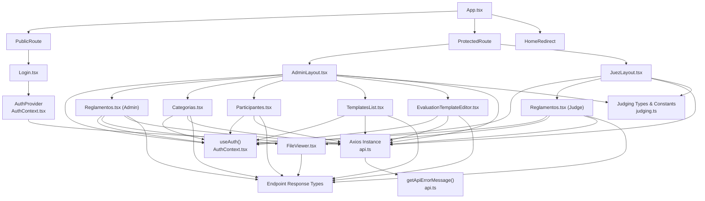

**Diagram sources**
- [App.tsx:1-131](file://frontend/src/App.tsx#L1-L131)
- [AuthContext.tsx:1-144](file://frontend/src/contexts/AuthContext.tsx#L1-L144)
- [api.ts:1-33](file://frontend/src/lib/api.ts#L1-L33)
- [judging.ts:1-144](file://frontend/src/lib/judging.ts#L1-L144)
- [AdminLayout.tsx:1-252](file://frontend/src/pages/admin/AdminLayout.tsx#L1-L252)
- [JuezLayout.tsx:1-199](file://frontend/src/pages/juez/JuezLayout.tsx#L1-L199)
- [Login.tsx:1-124](file://frontend/src/pages/Login.tsx#L1-L124)
- [Reglamentos.tsx:1-302](file://frontend/src/pages/admin/Reglamentos.tsx#L1-L302)
- [Reglamentos.tsx:1-171](file://frontend/src/pages/juez/Reglamentos.tsx#L1-L171)
- [Categorias.tsx:1-263](file://frontend/src/pages/admin/Categorias.tsx#L1-L263)
- [Participantes.tsx:1-798](file://frontend/src/pages/admin/Participantes.tsx#L1-L798)
- [TemplatesList.tsx:1-252](file://frontend/src/pages/admin/TemplatesList.tsx#L1-L252)
- [EvaluationTemplateEditor.tsx:1-800](file://frontend/src/pages/admin/EvaluationTemplateEditor.tsx#L1-L800)
- [FileViewer.tsx:1-157](file://frontend/src/components/FileViewer.tsx#L1-L157)

## Detailed Component Analysis

### Authentication Context Implementation
The AuthContext manages:
- Session hydration from localStorage on startup.
- Login flow invoking the backend API and persisting tokens.
- Logout clearing stored session and resetting state.
- JWT payload parsing to extract user ID.
- Exposing user, authentication status, loading state, and actions to consumers.

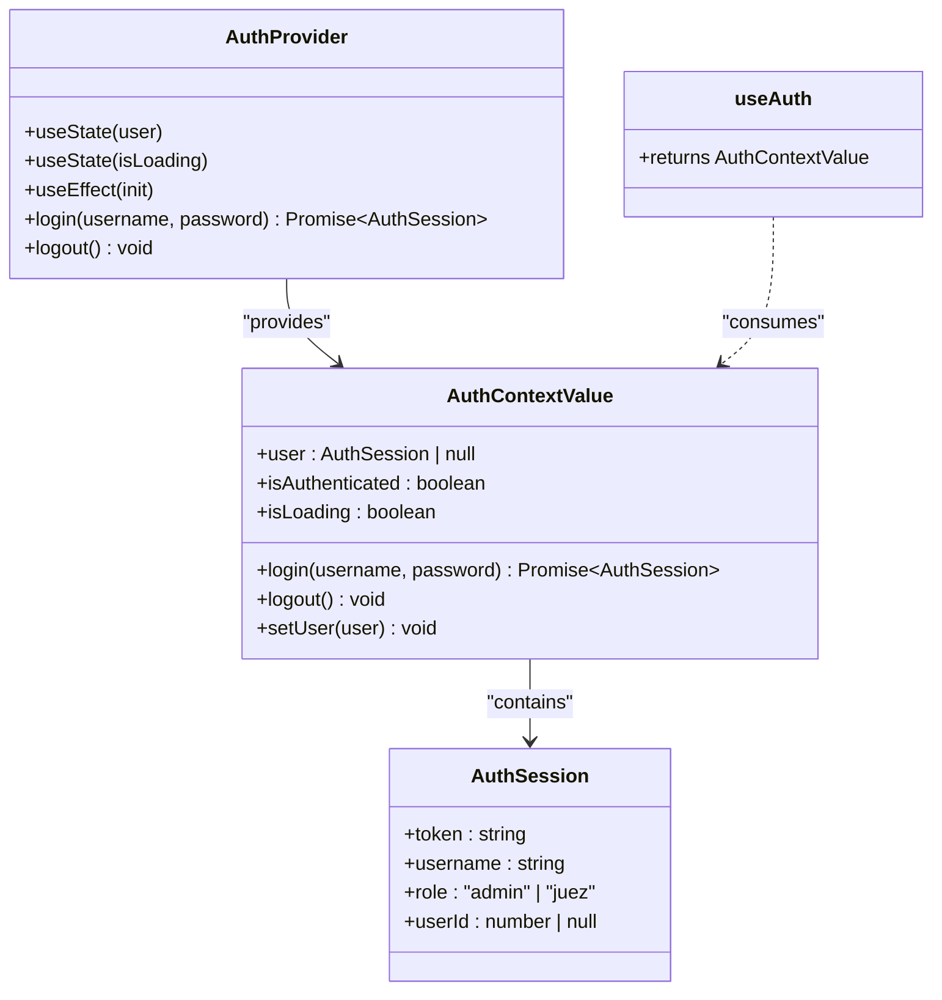

**Diagram sources**
- [AuthContext.tsx:12-35](file://frontend/src/contexts/AuthContext.tsx#L12-L35)
- [AuthContext.tsx:66-132](file://frontend/src/contexts/AuthContext.tsx#L66-L132)
- [AuthContext.tsx:135-143](file://frontend/src/contexts/AuthContext.tsx#L135-L143)

Key implementation highlights:
- Local storage persistence with a dedicated key for session storage.
- Token parsing to derive user ID from JWT payload.
- Controlled loading state during initialization and login operations.
- Strict typing for role and session shape.

**Section sources**
- [AuthContext.tsx:1-144](file://frontend/src/contexts/AuthContext.tsx#L1-L144)

### Routing Configuration with React Router
The routing layer defines:
- PublicRoute: Redirects authenticated users to their role-specific home or renders the login page while checking loading state.
- ProtectedRoute: Enforces authentication and role checks, redirecting unauthorized users appropriately.
- HomeRedirect: Redirects based on current user role.
- Nested routes for admin and judge areas with lazy-loaded page components and index defaults.
- New navigation items for regulation management, category management, evaluation templates, and enhanced participant management.

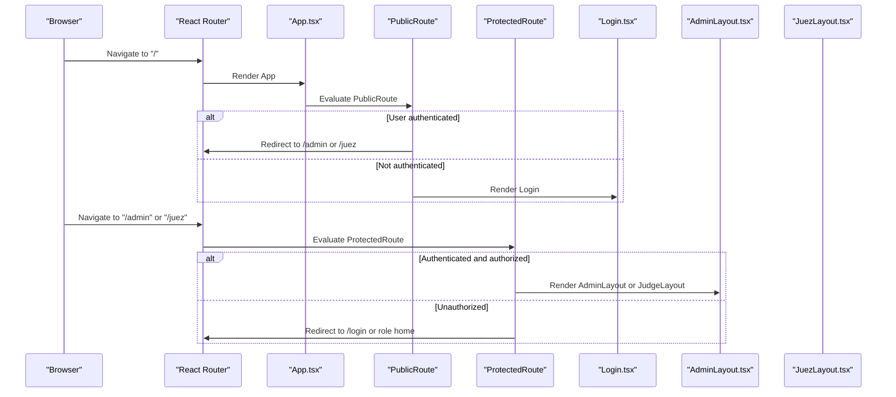

**Diagram sources**
- [App.tsx:22-93](file://frontend/src/App.tsx#L22-L93)
- [Login.tsx:1-124](file://frontend/src/pages/Login.tsx#L1-L124)
- [AdminLayout.tsx:1-252](file://frontend/src/pages/admin/AdminLayout.tsx#L1-L252)
- [JuezLayout.tsx:1-199](file://frontend/src/pages/juez/JuezLayout.tsx#L1-L199)

**Section sources**
- [App.tsx:1-131](file://frontend/src/App.tsx#L1-L131)

### API Integration Layer with Axios
The API client:
- Determines the base URL either from environment variables or a browser-derived default.
- Creates an Axios instance with the computed base URL.
- Provides a helper to normalize error messages from AxiosError and generic errors.

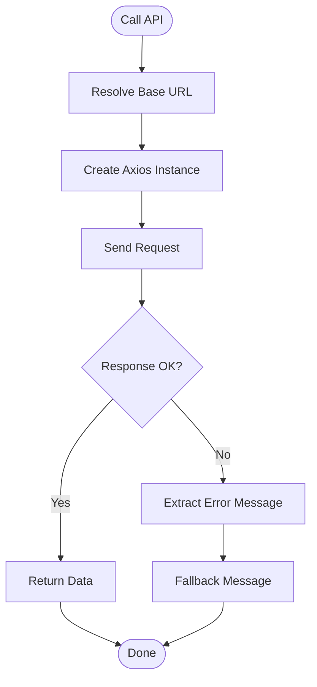

**Diagram sources**
- [api.ts:4-33](file://frontend/src/lib/api.ts#L4-L33)

**Section sources**
- [api.ts:1-33](file://frontend/src/lib/api.ts#L1-L33)

### Judging Utility Functions and Data Types
The judging module defines:
- Official modalities and categories as readonly arrays.
- Type definitions for events, participants, scores, and templates.
- Structured template sections and criteria for scoring.
- Complex evaluation template types with categorization options and scoring scales.

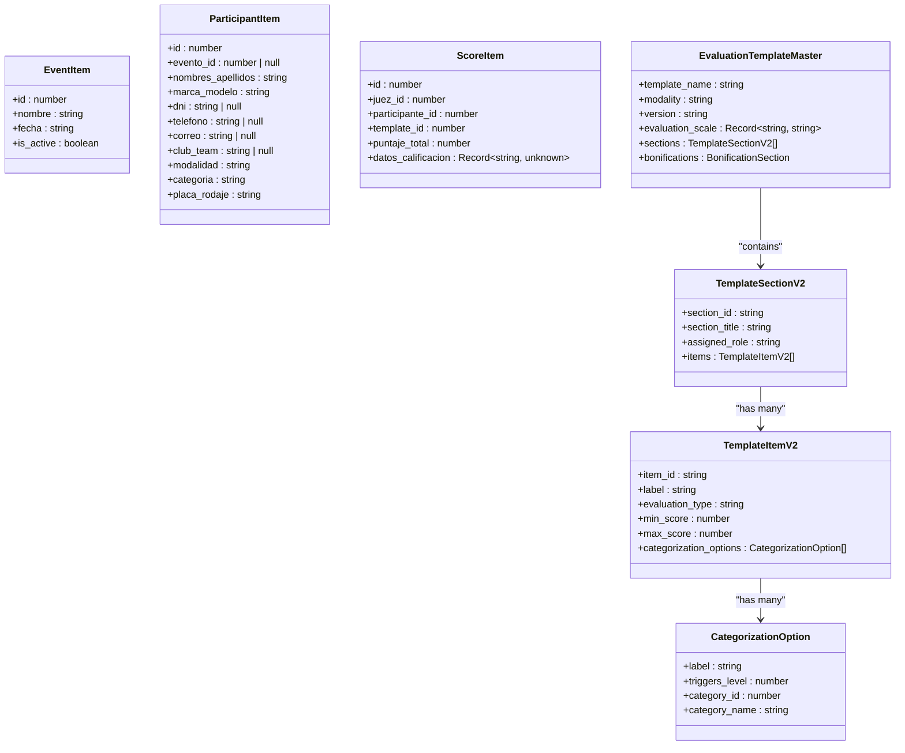

**Diagram sources**
- [judging.ts:18-144](file://frontend/src/lib/judging.ts#L18-L144)

**Section sources**
- [judging.ts:1-144](file://frontend/src/lib/judging.ts#L1-L144)

### Component Composition Patterns and Prop Drilling Solutions
- Context eliminates prop drilling by exposing user state and actions via useAuth.
- Layout components (AdminLayout, JuezLayout) wrap page components and share common UI and navigation.
- ProtectedRoute and PublicRoute act as composition boundaries to enforce policies without passing props down the tree.

**Section sources**
- [AuthContext.tsx:135-143](file://frontend/src/contexts/AuthContext.tsx#L135-L143)
- [AdminLayout.tsx:1-252](file://frontend/src/pages/admin/AdminLayout.tsx#L1-L252)
- [JuezLayout.tsx:1-199](file://frontend/src/pages/juez/JuezLayout.tsx#L1-L199)
- [App.tsx:57-74](file://frontend/src/App.tsx#L57-L74)

### State Synchronization Between Frontend and Backend
- Authentication state is synchronized with the backend through login/logout operations and persisted in localStorage.
- Profile updates (username/password) are sent to the backend and reflected in the AuthContext state when applicable.
- API errors are normalized and surfaced to users for immediate feedback.
- Evaluation template state is synchronized with backend CRUD operations for master templates.

**Section sources**
- [AuthContext.tsx:95-116](file://frontend/src/contexts/AuthContext.tsx#L95-L116)
- [AdminLayout.tsx:57-100](file://frontend/src/pages/admin/AdminLayout.tsx#L57-L100)
- [api.ts:16-32](file://frontend/src/lib/api.ts#L16-L32)

## New Feature Components

### Regulation Management System
The regulation management system provides comprehensive document handling capabilities:

#### Admin Regulation Management
- PDF upload functionality with validation and error handling
- Modal-based filtering for regulations
- File preview using FileViewer component
- CRUD operations for regulation management
- Integration with official modalities system

#### Judge Regulation Access
- Modal-based filtering for regulations
- Simplified interface for judges
- Direct file preview without upload capabilities

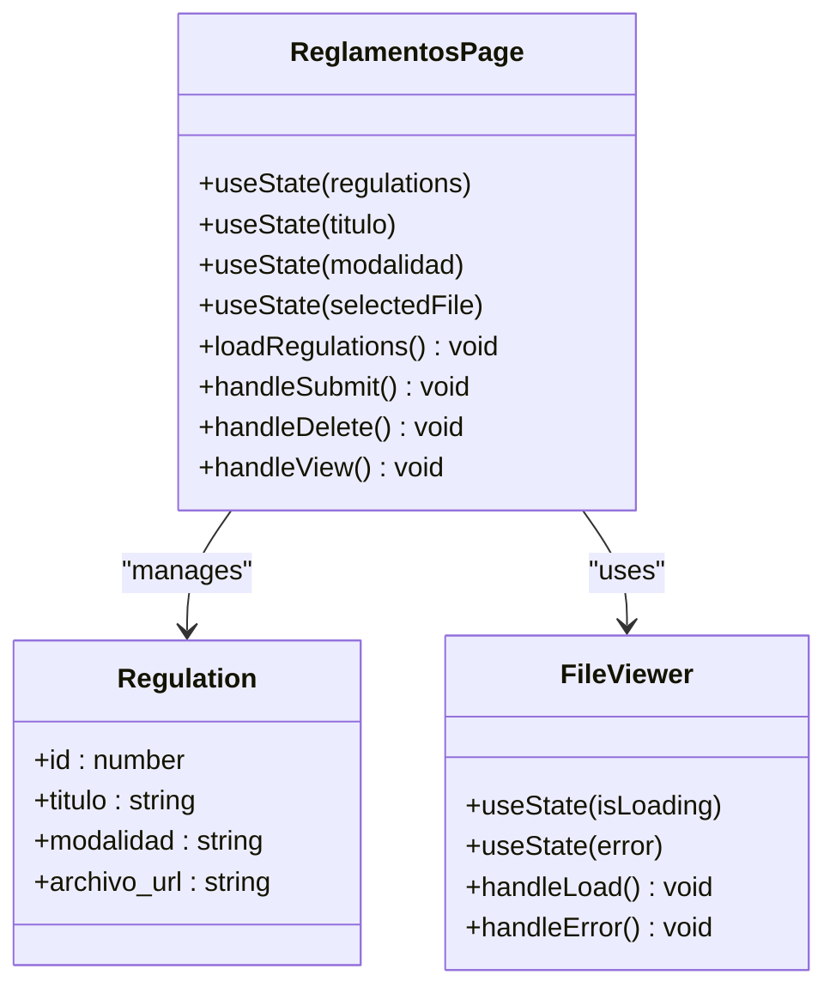

**Diagram sources**
- [Reglamentos.tsx:7-12](file://frontend/src/pages/admin/Reglamentos.tsx#L7-L12)
- [Reglamentos.tsx:22-141](file://frontend/src/pages/admin/Reglamentos.tsx#L22-L141)
- [FileViewer.tsx:3-7](file://frontend/src/components/FileViewer.tsx#L3-L7)

**Section sources**
- [Reglamentos.tsx:1-302](file://frontend/src/pages/admin/Reglamentos.tsx#L1-L302)
- [Reglamentos.tsx:1-171](file://frontend/src/pages/juez/Reglamentos.tsx#L1-L171)
- [FileViewer.tsx:1-157](file://frontend/src/components/FileViewer.tsx#L1-L157)

### Category Management System
The category management system provides hierarchical organization of competition categories:

#### Hierarchical Structure
- Modalities (top-level categories)
- Categories (second-level)
- Subcategories (third-level)
- Automatic cascading deletion
- Real-time updates

#### Administrative Features
- Dynamic addition and removal of categories
- Modal-based filtering for judges
- Comprehensive validation and error handling
- Responsive design with touch-friendly controls

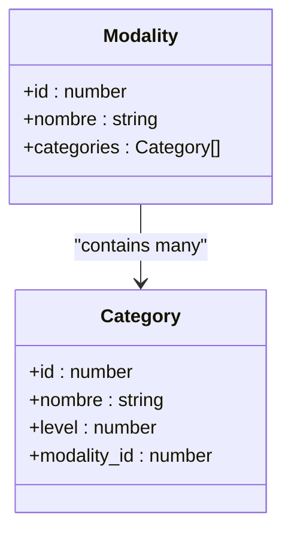

**Diagram sources**
- [Categorias.tsx:6-17](file://frontend/src/pages/admin/Categorias.tsx#L6-L17)

**Section sources**
- [Categorias.tsx:1-263](file://frontend/src/pages/admin/Categorias.tsx#L1-L263)

### Evaluation Template Management System
The evaluation template system provides comprehensive scoring template management:

#### Master Template Management
- Templates by modality with unique master templates
- Visual editor with drag-and-drop functionality
- Scoring scales and categorization options
- Preset templates for different modalities
- JSON preview and export capabilities

#### Template Editor Features
- Section-based template structure
- Item-level scoring with categorization options
- Bonification system for extra points
- Real-time validation and error handling
- Responsive design with touch-friendly controls

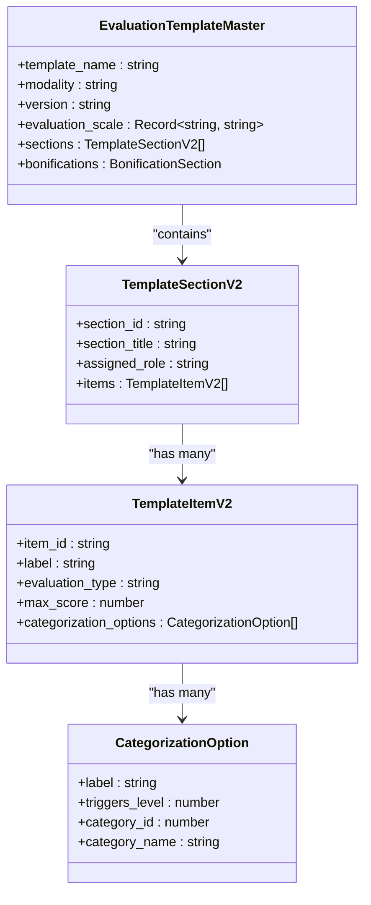

**Diagram sources**
- [judging.ts:40-88](file://frontend/src/lib/judging.ts#L40-L88)
- [EvaluationTemplateEditor.tsx:14-51](file://frontend/src/pages/admin/EvaluationTemplateEditor.tsx#L14-L51)

**Section sources**
- [TemplatesList.tsx:1-252](file://frontend/src/pages/admin/TemplatesList.tsx#L1-L252)
- [EvaluationTemplateEditor.tsx:1-800](file://frontend/src/pages/admin/EvaluationTemplateEditor.tsx#L1-L800)
- [judging.ts:1-144](file://frontend/src/lib/judging.ts#L1-L144)

### Enhanced Participant Management Interface
The participant management system has been significantly enhanced with new features:

#### Multi-Event Support
- Event selection dropdown for context
- Event-specific participant lists
- Dynamic loading based on selected event

#### Advanced Registration Options
- Bulk upload via Excel/CSV files
- Manual participant registration
- Multi-category assignment capability
- Real-time validation and error handling

#### Comprehensive Management Features
- Search and filtering capabilities
- Inline editing functionality
- Category assignment management
- Detailed participant information display

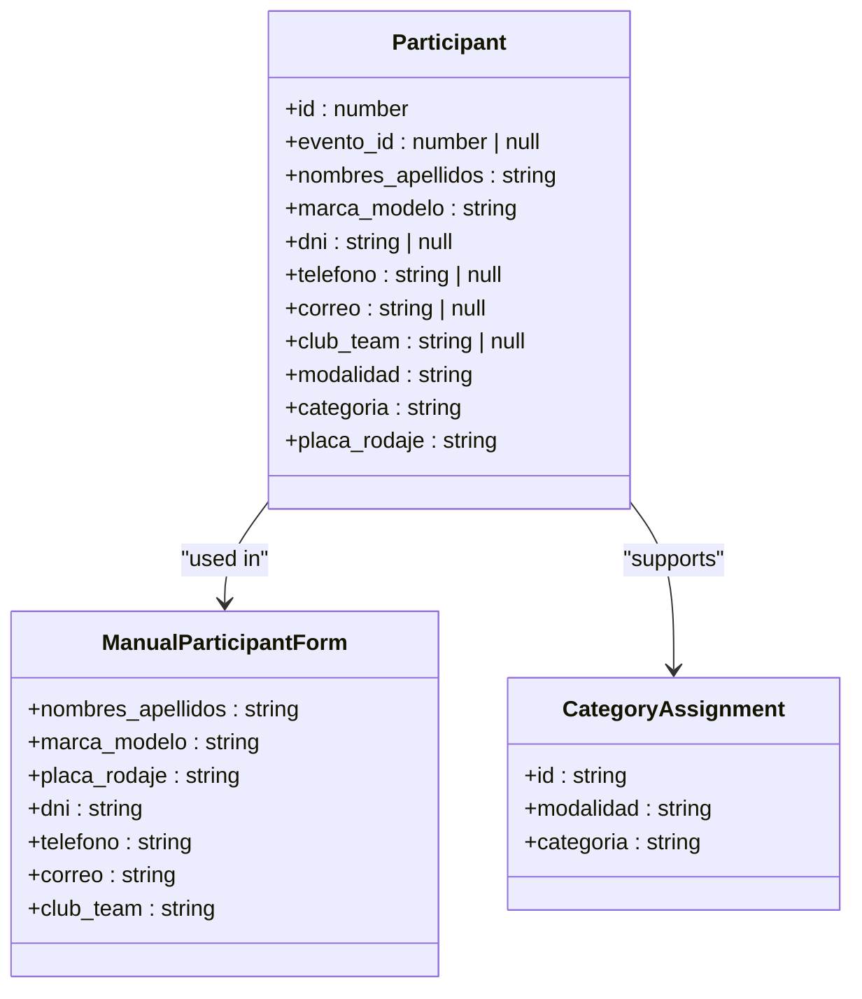

**Diagram sources**
- [Participantes.tsx:12-46](file://frontend/src/pages/admin/Participantes.tsx#L12-L46)

**Section sources**
- [Participantes.tsx:1-798](file://frontend/src/pages/admin/Participantes.tsx#L1-L798)

### FileViewer Component
The FileViewer component provides comprehensive document preview functionality:

#### Supported Formats
- PDF document preview with embedded viewer
- Image preview (JPG, PNG, GIF, etc.)
- Generic file download fallback
- Dynamic URL resolution

#### User Experience Features
- Modal-based interface
- Loading states and error handling
- Full-screen preview mode
- Download and external view options
- Responsive design for all devices

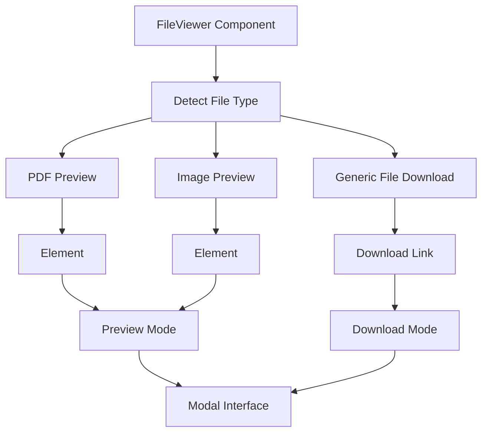

**Diagram sources**
- [FileViewer.tsx:17-157](file://frontend/src/components/FileViewer.tsx#L17-L157)

**Section sources**
- [FileViewer.tsx:1-157](file://frontend/src/components/FileViewer.tsx#L1-L157)

## Dependency Analysis
The frontend depends on:
- React and React Router for UI and routing.
- Axios for HTTP requests.
- Tailwind CSS for styling.
- Vite for build tooling and development server.
- TypeScript for type safety.
- New components for enhanced functionality.

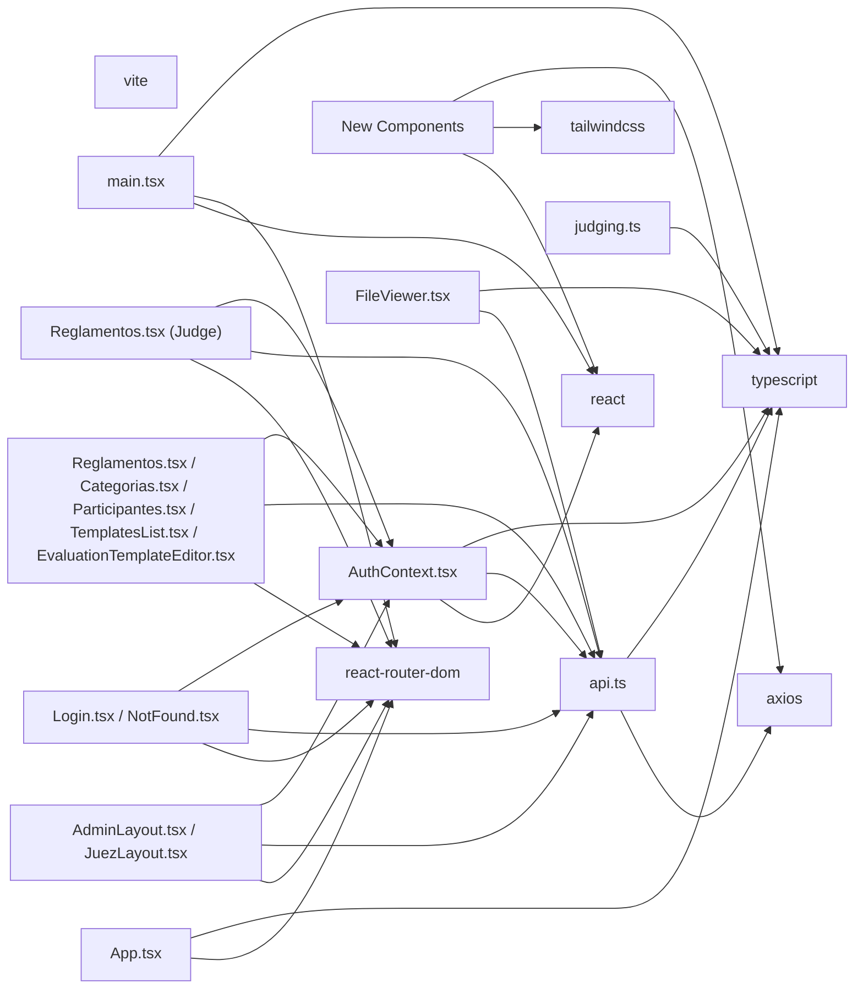

**Diagram sources**
- [package.json:11-26](file://frontend/package.json#L11-L26)
- [main.tsx:1-19](file://frontend/src/main.tsx#L1-L19)
- [App.tsx:1-131](file://frontend/src/App.tsx#L1-L131)
- [AuthContext.tsx:1-144](file://frontend/src/contexts/AuthContext.tsx#L1-L144)
- [api.ts:1-33](file://frontend/src/lib/api.ts#L1-L33)
- [judging.ts:1-144](file://frontend/src/lib/judging.ts#L1-L144)
- [AdminLayout.tsx:1-252](file://frontend/src/pages/admin/AdminLayout.tsx#L1-L252)
- [JuezLayout.tsx:1-199](file://frontend/src/pages/juez/JuezLayout.tsx#L1-L199)
- [Login.tsx:1-124](file://frontend/src/pages/Login.tsx#L1-L124)
- [NotFound.tsx:1-23](file://frontend/src/pages/NotFound.tsx#L1-L23)
- [Reglamentos.tsx:1-302](file://frontend/src/pages/admin/Reglamentos.tsx#L1-L302)
- [Reglamentos.tsx:1-171](file://frontend/src/pages/juez/Reglamentos.tsx#L1-L171)
- [Categorias.tsx:1-263](file://frontend/src/pages/admin/Categorias.tsx#L1-L263)
- [Participantes.tsx:1-798](file://frontend/src/pages/admin/Participantes.tsx#L1-L798)
- [TemplatesList.tsx:1-252](file://frontend/src/pages/admin/TemplatesList.tsx#L1-L252)
- [EvaluationTemplateEditor.tsx:1-800](file://frontend/src/pages/admin/EvaluationTemplateEditor.tsx#L1-L800)
- [FileViewer.tsx:1-157](file://frontend/src/components/FileViewer.tsx#L1-L157)

**Section sources**
- [package.json:1-28](file://frontend/package.json#L1-L28)

## Performance Considerations
- Lazy loading: Consider lazy-loading route components to reduce initial bundle size.
- Memoization: Use useMemo/useCallback for expensive computations in layouts and forms.
- Conditional rendering: Keep loading states visible until data is ready to avoid unnecessary re-renders.
- Network efficiency: Batch API calls where possible and leverage caching strategies for static data.
- Bundle analysis: Use Vite's built-in analyzer to inspect bundle composition and remove unused dependencies.
- CSS scope: Keep Tailwind utilities scoped to components to minimize CSS bloat.
- File handling: Optimize file upload and preview operations for large documents.
- State management: Implement efficient state updates for large participant lists and evaluation templates.
- Template rendering: Use virtualized lists for large template sections and items.

## Troubleshooting Guide
Common issues and resolutions:
- Authentication loops: Verify base URL resolution and ensure environment variables are correctly set.
- API errors: Use the error helper to surface meaningful messages; check network tab for backend responses.
- Role redirection: Confirm ProtectedRoute logic and user role propagation from AuthContext.
- Styling inconsistencies: Ensure Tailwind content paths match source files and rebuild styles after changes.
- File upload failures: Check file size limits and supported formats for PDF and image uploads.
- Category management issues: Verify hierarchical relationships and cascading deletion behavior.
- Participant import errors: Validate Excel/CSV format and required fields for bulk uploads.
- Template editor issues: Check JSON serialization/deserialization and template validation rules.
- Evaluation template conflicts: Ensure unique template assignments per modality.

**Section sources**
- [api.ts:16-32](file://frontend/src/lib/api.ts#L16-L32)
- [App.tsx:57-74](file://frontend/src/App.tsx#L57-L74)
- [tailwind.config.ts:5](file://frontend/tailwind.config.ts#L5)

## Conclusion
The Juzgamiento frontend employs a clean, layered architecture with React Router for routing, React Context for state management, and Axios for API integration. The design minimizes prop drilling through context and composition patterns, while TypeScript and Tailwind enhance developer productivity and UI consistency. The routing wrappers ensure secure and role-appropriate access, and the API layer centralizes error handling and base URL configuration. 

**Updated** The application now includes comprehensive regulation management, hierarchical category organization, evaluation template system with visual editor, and enhanced participant management capabilities, providing a solid foundation for administration and judging workflows with modern document handling and user experience features.

## Appendices

### Build Process Using Vite
- Development server runs with hot module replacement and host/port configuration.
- Production build validates TypeScript and generates optimized assets.
- Preview serves the production build locally for testing.

**Section sources**
- [package.json:6-10](file://frontend/package.json#L6-L10)
- [vite.config.ts:1-8](file://frontend/vite.config.ts#L1-L8)

### Styling Approach with Tailwind CSS
- Global base styles define dark theme, fonts, and component utilities.
- Tailwind config extends brand colors, shadows, and border radius for consistent UI.
- Custom utilities for touch-friendly inputs and buttons unify interaction patterns.

**Section sources**
- [index.css:1-52](file://frontend/src/index.css#L1-L52)
- [tailwind.config.ts:4-31](file://frontend/tailwind.config.ts#L4-L31)

### TypeScript Integration
- Strict compiler options enable type safety across the codebase.
- JSX transform configured for React components.
- Module resolution and bundler-friendly settings support Vite and React Fast Refresh.

**Section sources**
- [tsconfig.json:2-18](file://frontend/tsconfig.json#L2-L18)

### New Component Integration
- FileViewer component seamlessly integrates with regulation management systems.
- Evaluation template system provides comprehensive scoring template management with visual editor.
- Enhanced participant management maintains backward compatibility with existing functionality.
- Category management provides extensible hierarchical structure for future expansion.
- Regulation management supports both admin and judge perspectives with appropriate permissions.
- TemplatesList provides overview and management interface for evaluation templates.
- EvaluationTemplateEditor offers advanced visual editing capabilities for complex scoring systems.

**Section sources**
- [FileViewer.tsx:1-157](file://frontend/src/components/FileViewer.tsx#L1-L157)
- [Reglamentos.tsx:1-302](file://frontend/src/pages/admin/Reglamentos.tsx#L1-L302)
- [Categorias.tsx:1-263](file://frontend/src/pages/admin/Categorias.tsx#L1-L263)
- [Participantes.tsx:1-798](file://frontend/src/pages/admin/Participantes.tsx#L1-L798)
- [TemplatesList.tsx:1-252](file://frontend/src/pages/admin/TemplatesList.tsx#L1-L252)
- [EvaluationTemplateEditor.tsx:1-800](file://frontend/src/pages/admin/EvaluationTemplateEditor.tsx#L1-L800)