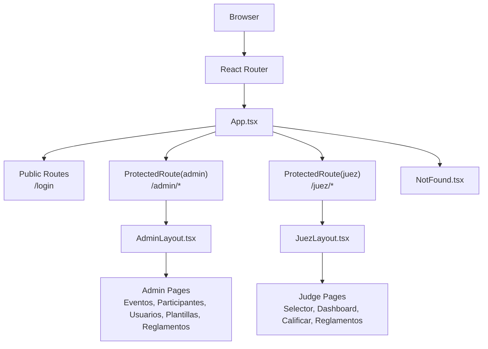
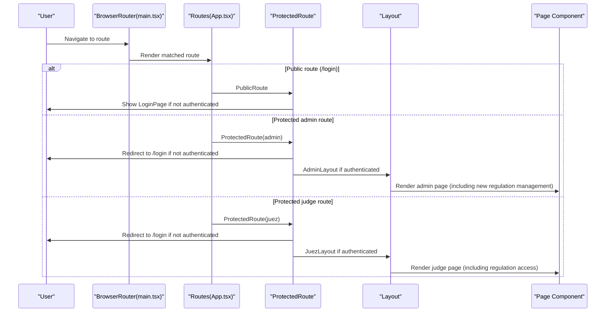
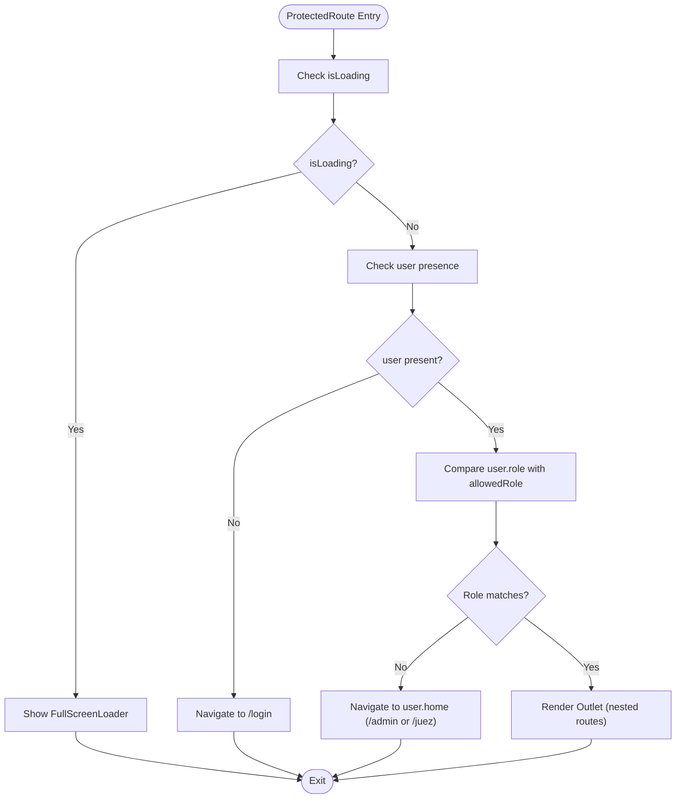
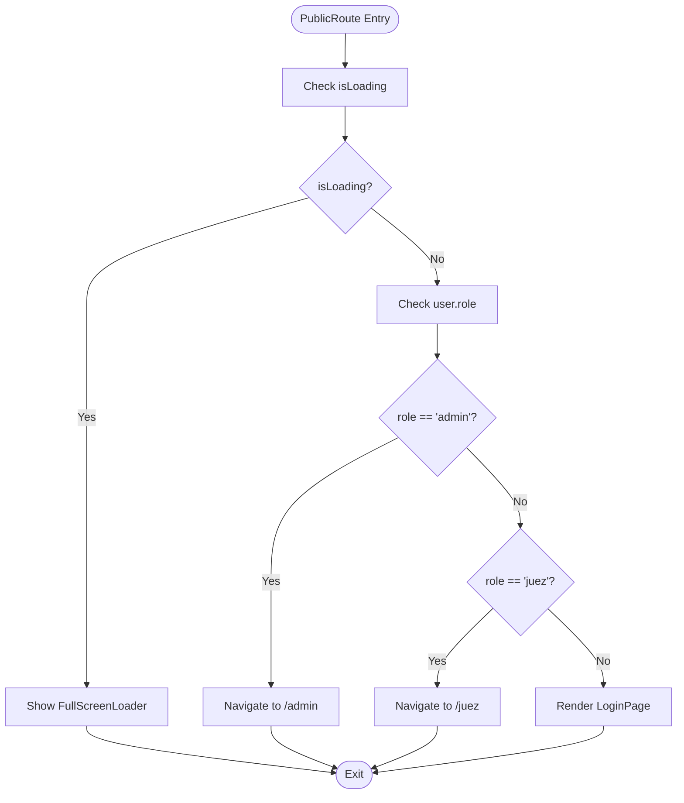
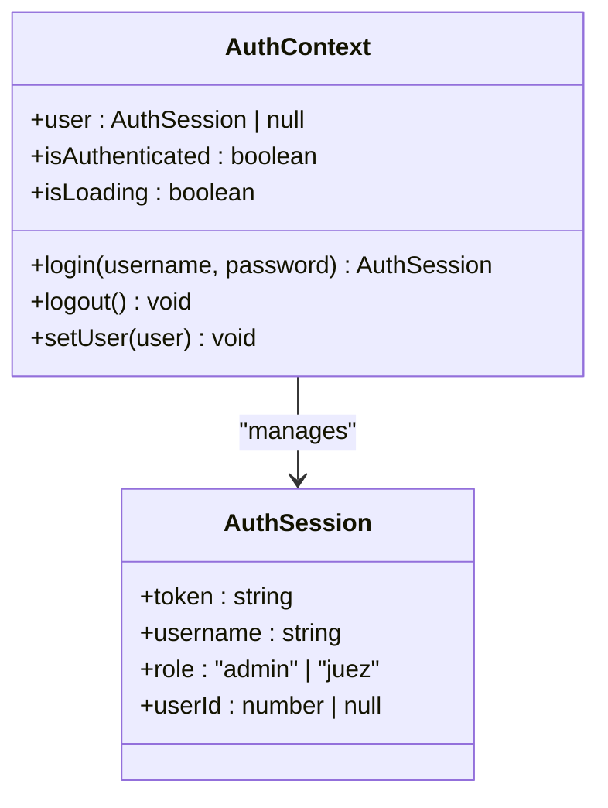
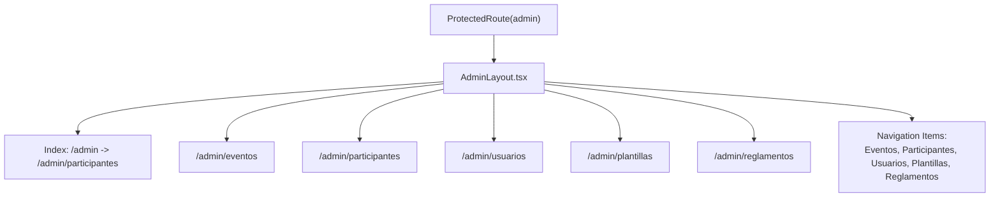
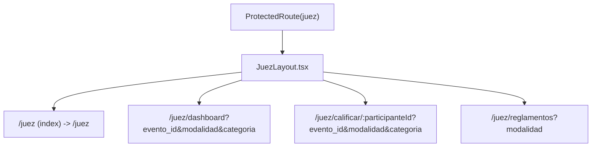
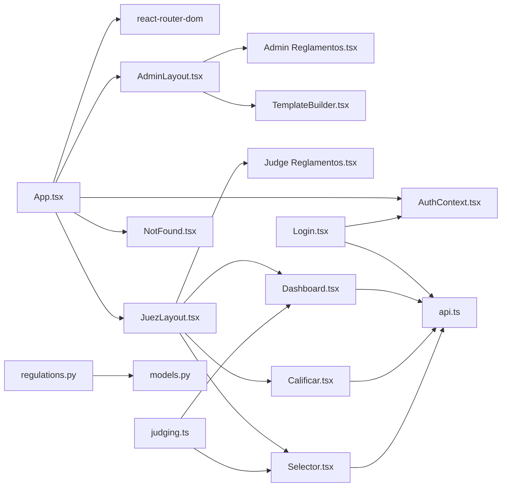

# Routing System

<cite>
**Referenced Files in This Document**
- [App.tsx](file://frontend/src/App.tsx)
- [main.tsx](file://frontend/src/main.tsx)
- [AuthContext.tsx](file://frontend/src/contexts/AuthContext.tsx)
- [AdminLayout.tsx](file://frontend/src/pages/admin/AdminLayout.tsx)
- [JuezLayout.tsx](file://frontend/src/pages/juez/JuezLayout.tsx)
- [Login.tsx](file://frontend/src/pages/Login.tsx)
- [NotFound.tsx](file://frontend/src/pages/NotFound.tsx)
- [api.ts](file://frontend/src/lib/api.ts)
- [Participantes.tsx](file://frontend/src/pages/admin/Participantes.tsx)
- [Dashboard.tsx](file://frontend/src/pages/juez/Dashboard.tsx)
- [Calificar.tsx](file://frontend/src/pages/juez/Calificar.tsx)
- [Selector.tsx](file://frontend/src/pages/juez/Selector.tsx)
- [judging.ts](file://frontend/src/lib/judging.ts)
- [Reglamentos.tsx](file://frontend/src/pages/admin/Reglamentos.tsx)
- [Reglamentos.tsx](file://frontend/src/pages/juez/Reglamentos.tsx)
- [TemplateBuilder.tsx](file://frontend/src/pages/admin/TemplateBuilder.tsx)
- [regulations.py](file://routes/regulations.py)
- [models.py](file://models.py)
</cite>

## Update Summary
**Changes Made**
- Added new regulation management routes for both admin and judge interfaces
- Enhanced judge dashboard navigation with regulation access
- Integrated regulation upload, viewing, and management functionality
- Added template builder functionality for creating evaluation forms
- Updated routing structure to accommodate new administrative capabilities

## Table of Contents
1. [Introduction](#introduction)
2. [Project Structure](#project-structure)
3. [Core Components](#core-components)
4. [Architecture Overview](#architecture-overview)
5. [Detailed Component Analysis](#detailed-component-analysis)
6. [Dependency Analysis](#dependency-analysis)
7. [Performance Considerations](#performance-considerations)
8. [Troubleshooting Guide](#troubleshooting-guide)
9. [Conclusion](#conclusion)

## Introduction
This document describes the React routing system for the application, focusing on how routes are configured, protected, and organized into role-based interfaces. It explains the ProtectedRoute mechanism, authentication flow integration, automatic redirection logic, nested routing for admin and judge interfaces, layout components, and error handling for invalid routes. It also covers dynamic parameters, loading states during authentication checks, and navigation patterns.

**Updated** Added comprehensive regulation management routes and enhanced judge dashboard navigation with real-time regulation access and template building capabilities.

## Project Structure
The routing system is implemented in the frontend React application with a clear separation between public, protected, and nested routes. Authentication state is managed globally via a context provider, and routes are organized under two distinct layouts: AdminLayout for administrative users and JuezLayout for judges.

**Diagram sources**
- [App.tsx:91-118](file://frontend/src/App.tsx#L91-L118)
- [main.tsx:10-18](file://frontend/src/main.tsx#L10-L18)

**Section sources**
- [App.tsx:91-118](file://frontend/src/App.tsx#L91-L118)
- [main.tsx:10-18](file://frontend/src/main.tsx#L10-L18)

## Core Components
- App routing configuration with nested routes, index routes, and wildcard handling.
- ProtectedRoute component enforcing role-based access and redirecting unauthorized users.
- PublicRoute component handling login redirection based on current user role.
- Layout components AdminLayout and JuezLayout providing consistent UI scaffolding and navigation.
- AuthContext managing authentication state, login/logout, and token parsing.
- API client with error extraction utilities for consistent error messaging.

**Updated** Added regulation management and template building components with comprehensive CRUD operations for regulatory documents.

**Section sources**
- [App.tsx:17-69](file://frontend/src/App.tsx#L17-L69)
- [AuthContext.tsx:66-132](file://frontend/src/contexts/AuthContext.tsx#L66-L132)
- [api.ts:16-32](file://frontend/src/lib/api.ts#L16-L32)

## Architecture Overview
The routing architecture separates concerns by role and provides nested routes for each interface. ProtectedRoute ensures only authorized users can access protected areas, while PublicRoute prevents authenticated users from accessing login. NotFound handles invalid routes gracefully.

**Diagram sources**
- [main.tsx:10-18](file://frontend/src/main.tsx#L10-L18)
- [App.tsx:91-118](file://frontend/src/App.tsx#L91-L118)
- [App.tsx:52-69](file://frontend/src/App.tsx#L52-L69)

## Detailed Component Analysis

### ProtectedRoute Component
ProtectedRoute enforces role-based access and handles loading states. It redirects unauthenticated users to the login page and redirects users to the correct home route based on their role. When authenticated and authorized, it renders nested routes via Outlet.

**Diagram sources**
- [App.tsx:52-69](file://frontend/src/App.tsx#L52-L69)

**Section sources**
- [App.tsx:52-69](file://frontend/src/App.tsx#L52-L69)

### PublicRoute Component
PublicRoute prevents authenticated users from accessing the login page. It redirects users to their respective home routes based on role or renders the login form when unauthenticated.

**Diagram sources**
- [App.tsx:33-49](file://frontend/src/App.tsx#L33-L49)

**Section sources**
- [App.tsx:33-49](file://frontend/src/App.tsx#L33-L49)

### HomeRedirect Component
HomeRedirect provides a central redirect for the root path. It navigates to the appropriate role-specific home route or to login if not authenticated.

**Section sources**
- [App.tsx:72-88](file://frontend/src/App.tsx#L72-L88)

### AuthContext Integration
AuthContext manages authentication state, persists sessions to local storage, parses tokens to extract user IDs, and exposes login/logout functions. It integrates with ProtectedRoute and PublicRoute to drive redirection logic.

**Diagram sources**
- [AuthContext.tsx:12-35](file://frontend/src/contexts/AuthContext.tsx#L12-L35)
- [AuthContext.tsx:66-132](file://frontend/src/contexts/AuthContext.tsx#L66-L132)

**Section sources**
- [AuthContext.tsx:66-132](file://frontend/src/contexts/AuthContext.tsx#L66-L132)

### Admin Layout and Nested Routes
AdminLayout provides a consistent header, navigation, and outlet for nested admin pages. Index routes define default subpaths for admin sections. **Updated** Now includes regulation management and template building capabilities.

**Diagram sources**
- [App.tsx:97-107](file://frontend/src/App.tsx#L97-L107)
- [AdminLayout.tsx:8-14](file://frontend/src/pages/admin/AdminLayout.tsx#L8-L14)

**Section sources**
- [App.tsx:97-107](file://frontend/src/App.tsx#L97-L107)
- [AdminLayout.tsx:8-14](file://frontend/src/pages/admin/AdminLayout.tsx#L8-L14)

### Judge Layout and Nested Routes
JuezLayout provides a judge-specific header and outlet. Judge routes include a selector for filtering participants, a dashboard listing filtered participants, and a scoring page with dynamic parameters. **Updated** Now includes comprehensive regulation access with modalidad filtering.

**Diagram sources**
- [App.tsx:110-116](file://frontend/src/App.tsx#L110-L116)
- [Dashboard.tsx:18-20](file://frontend/src/pages/juez/Dashboard.tsx#L18-L20)
- [Calificar.tsx:82-90](file://frontend/src/pages/juez/Calificar.tsx#L82-L90)
- [Reglamentos.tsx:17-18](file://frontend/src/pages/juez/Reglamentos.tsx#L17-18)

**Section sources**
- [App.tsx:110-116](file://frontend/src/App.tsx#L110-L116)
- [Dashboard.tsx:18-20](file://frontend/src/pages/juez/Dashboard.tsx#L18-L20)
- [Calificar.tsx:82-90](file://frontend/src/pages/juez/Calificar.tsx#L82-L90)
- [Reglamentos.tsx:17-18](file://frontend/src/pages/juez/Reglamentos.tsx#L17-18)

### Regulation Management System
**New Feature** Comprehensive regulation management system for both admin and judge interfaces.

#### Admin Regulation Management
The admin interface provides full CRUD operations for regulatory documents:
- Upload new PDF regulations with title and modalidad
- View and manage existing regulations
- Delete regulations with file cleanup
- Filter regulations by modalidad
- File viewer integration for PDF preview

#### Judge Regulation Access
The judge interface provides filtered access to regulations:
- Modalidad-based filtering for relevant regulations
- Direct PDF viewing capability
- Responsive design for mobile devices
- Error handling and loading states

**Section sources**
- [Reglamentos.tsx:1-302](file://frontend/src/pages/admin/Reglamentos.tsx#L1-L302)
- [Reglamentos.tsx:1-160](file://frontend/src/pages/juez/Reglamentos.tsx#L1-L160)
- [regulations.py:1-110](file://routes/regulations.py#L1-L110)
- [models.py:97-104](file://models.py#L97-L104)

### Template Builder System
**New Feature** Advanced template builder for creating evaluation forms with JSON structure validation.

The template builder enables administrators to create custom evaluation templates:
- Multi-section template creation
- Dynamic criteria management
- Real-time JSON preview
- Modalidad and category selection
- Validation and error handling
- Edit mode for existing templates

**Section sources**
- [TemplateBuilder.tsx:1-476](file://frontend/src/pages/admin/TemplateBuilder.tsx#L1-L476)

### Login Page and Navigation Patterns
Login page handles authentication submission, redirects based on role, and preserves intended destination via location state. It integrates with ProtectedRoute and PublicRoute to ensure correct navigation.

**Section sources**
- [Login.tsx:15-61](file://frontend/src/pages/Login.tsx#L15-L61)

### Error Handling and NotFound
NotFound provides a friendly 404 page with a link back to login. It is rendered for unmatched routes.

**Section sources**
- [App.tsx:119](file://frontend/src/App.tsx#L119)
- [NotFound.tsx:4-22](file://frontend/src/pages/NotFound.tsx#L4-L22)

### Dynamic Parameters and Query Strings
Judge routes use dynamic parameters and query strings:
- Dynamic parameter: :participanteId in /juez/calificar/:participanteId
- Query parameters: evento_id, modalidad, categoria in /juez/dashboard and subsequent navigation
- **Updated** Modalidad filtering in /juez/reglamentos?modalidad

**Section sources**
- [App.tsx:114](file://frontend/src/App.tsx#L114)
- [Dashboard.tsx:18-20](file://frontend/src/pages/juez/Dashboard.tsx#L18-L20)
- [Calificar.tsx:82-90](file://frontend/src/pages/juez/Calificar.tsx#L82-L90)
- [Reglamentos.tsx:17-18](file://frontend/src/pages/juez/Reglamentos.tsx#L17-18)

### Role-Based Routing Examples
- Admin access: ProtectedRoute with allowedRole=admin
- Judge access: ProtectedRoute with allowedRole=juez
- Automatic redirection: PublicRoute redirects authenticated users to /admin or /juez
- Role mismatch: ProtectedRoute redirects to the correct home route

**Section sources**
- [App.tsx:52-69](file://frontend/src/App.tsx#L52-L69)
- [App.tsx:33-49](file://frontend/src/App.tsx#L33-L49)

## Dependency Analysis
The routing system depends on React Router for navigation and on AuthContext for authentication state. API utilities support data fetching within page components. **Updated** Added dependencies for regulation management and template building.

**Diagram sources**
- [App.tsx:1-16](file://frontend/src/App.tsx#L1-L16)
- [AuthContext.tsx:9](file://frontend/src/contexts/AuthContext.tsx#L9)
- [api.ts:11-13](file://frontend/src/lib/api.ts#L11-L13)
- [judging.ts:1-16](file://frontend/src/lib/judging.ts#L1-L16)
- [regulations.py:1-110](file://routes/regulations.py#L1-L110)
- [models.py:97-104](file://models.py#L97-L104)

**Section sources**
- [App.tsx:1-16](file://frontend/src/App.tsx#L1-L16)
- [AuthContext.tsx:9](file://frontend/src/contexts/AuthContext.tsx#L9)
- [api.ts:11-13](file://frontend/src/lib/api.ts#L11-L13)
- [judging.ts:1-16](file://frontend/src/lib/judging.ts#L1-L16)
- [regulations.py:1-110](file://routes/regulations.py#L1-L110)
- [models.py:97-104](file://models.py#L97-L104)

## Performance Considerations
- Lazy loading: Consider lazy-loading page components to reduce initial bundle size.
- Conditional rendering: ProtectedRoute already avoids unnecessary re-renders by checking isLoading and user presence.
- Parallel data fetching: Judge pages use Promise.all for concurrent API calls, improving responsiveness.
- **Updated** Efficient regulation loading with modalidad filtering reduces API calls and improves performance.
- **Updated** Template builder uses real-time JSON preview to minimize unnecessary API requests.

## Troubleshooting Guide
Common issues and resolutions:
- Stuck on loader: Ensure AuthContext completes hydration before ProtectedRoute renders. The loader appears while isLoading is true.
- Unexpected redirects: Verify ProtectedRoute.allowedRole matches user.role. Role mismatches trigger automatic redirection to the correct home route.
- Login loop: Confirm PublicRoute does not redirect authenticated users to /login. Check user.role and token validity.
- 404 errors: NotFound is rendered for unmatched routes. Ensure route paths match the configured routes.
- API errors: Use getApiErrorMessage to surface server-side messages consistently.
- **Updated** Regulation upload failures: Check PDF format validation and file size limits in backend.
- **Updated** Template validation errors: Ensure modalidad and categoria are properly selected before saving.

**Section sources**
- [App.tsx:22-30](file://frontend/src/App.tsx#L22-L30)
- [App.tsx:52-69](file://frontend/src/App.tsx#L52-L69)
- [App.tsx:33-49](file://frontend/src/App.tsx#L33-L49)
- [App.tsx:119](file://frontend/src/App.tsx#L119)
- [api.ts:16-32](file://frontend/src/lib/api.ts#L16-L32)

## Conclusion
The routing system provides a robust, role-based navigation structure with clear separation between public and protected routes. ProtectedRoute and PublicRoute enforce access control and handle redirection logic seamlessly. AdminLayout and JuezLayout maintain consistent UI scaffolding, while nested routes and dynamic parameters enable flexible navigation patterns. 

**Updated** The system now includes comprehensive regulation management capabilities with admin-only upload functionality and judge-accessible filtered regulation viewing. The addition of template building tools enhances the administrative capabilities significantly. The integration with AuthContext and API utilities ensures reliable authentication and data handling across the application, supporting both the core judging workflow and the new regulatory management features.