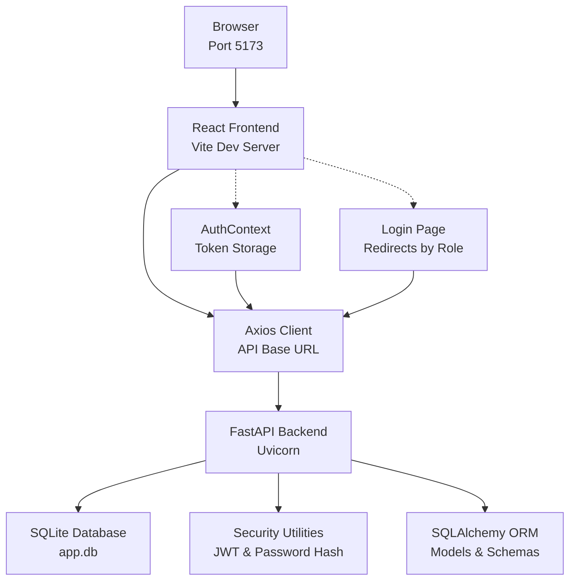

# Getting Started

<cite>
**Referenced Files in This Document**
- [requirements.txt](file://requirements.txt)
- [start.sh](file://start.sh)
- [main.py](file://main.py)
- [database.py](file://database.py)
- [models.py](file://models.py)
- [schemas.py](file://schemas.py)
- [seed_templates.py](file://seed_templates.py)
- [utils/security.py](file://utils/security.py)
- [routes/auth.py](file://routes/auth.py)
- [frontend/package.json](file://frontend/package.json)
- [frontend/src/lib/api.ts](file://frontend/src/lib/api.ts)
- [frontend/src/pages/Login.tsx](file://frontend/src/pages/Login.tsx)
- [frontend/src/contexts/AuthContext.tsx](file://frontend/src/contexts/AuthContext.tsx)
</cite>

## Table of Contents
1. [Introduction](#introduction)
2. [Prerequisites](#prerequisites)
3. [Installation](#installation)
4. [Development Environment](#development-environment)
5. [Initial Setup](#initial-setup)
6. [Basic Usage](#basic-usage)
7. [Architecture Overview](#architecture-overview)
8. [Verification Steps](#verification-steps)
9. [Troubleshooting](#troubleshooting)
10. [Conclusion](#conclusion)

## Introduction
This guide helps you install, configure, and run the Juzgamiento application locally. It covers backend and frontend setup, database initialization, development server startup, and first-time usage for administrators and judges. The system uses FastAPI for the backend, SQLite for persistence, and a React-based frontend served via Vite.

## Prerequisites
- Python 3.8 or newer
- Node.js and npm (for the frontend)
- Basic understanding of SQLite and relational databases
- Bash shell (for the development script)

These requirements are evident from:
- Backend dependencies declared in [requirements.txt](file://requirements.txt)
- Frontend dependencies and scripts in [frontend/package.json](file://frontend/package.json)
- Database engine configuration in [database.py](file://database.py)
- Application bootstrap in [main.py](file://main.py)

**Section sources**
- [requirements.txt:1-10](file://requirements.txt#L1-L10)
- [frontend/package.json:1-28](file://frontend/package.json#L1-L28)
- [database.py:19-23](file://database.py#L19-L23)
- [main.py:1-38](file://main.py#L1-L38)

## Installation
Follow these steps to prepare your environment:

1) Backend virtual environment and dependencies
- Create a Python virtual environment and activate it.
- Install Python dependencies:
  - Run: pip install -r requirements.txt

2) Frontend dependencies
- Navigate to the frontend directory and install packages:
  - Run: npm install

3) Database initialization
- On first run, the backend initializes the SQLite database and applies migrations automatically during startup. The database file path is resolved relative to the project root.

Notes:
- The backend startup creates tables and runs SQLite migrations via [main.py](file://main.py) and [database.py](file://database.py).
- The frontend build and dev scripts are defined in [frontend/package.json](file://frontend/package.json).

**Section sources**
- [requirements.txt:1-10](file://requirements.txt#L1-L10)
- [frontend/package.json:6-10](file://frontend/package.json#L6-L10)
- [main.py:14-38](file://main.py#L14-L38)
- [database.py:36-93](file://database.py#L36-L93)

## Development Environment
Start the development environment using the provided script:

- Run the development launcher:
  - ./start.sh

What the script does:
- Stops previous instances on ports 8000 (backend) and 5173 (frontend) if any.
- Activates the Python virtual environment and starts the FastAPI server with hot reload.
- Starts the frontend development server on port 5173.

Ports:
- Backend: http://localhost:8000
- Frontend: http://localhost:5173

Environment variables:
- JWT_SECRET_KEY: Used to sign tokens. Defaults are embedded in [utils/security.py](file://utils/security.py).
- ACCESS_TOKEN_EXPIRE_MINUTES: Controls token lifetime. Defaults are embedded in [utils/security.py](file://utils/security.py).

Frontend base URL:
- The frontend client targets the backend on port 8000 by default, as configured in [frontend/src/lib/api.ts](file://frontend/src/lib/api.ts).

**Section sources**
- [start.sh:1-16](file://start.sh#L1-L16)
- [utils/security.py:9-14](file://utils/security.py#L9-L14)
- [frontend/src/lib/api.ts:4-13](file://frontend/src/lib/api.ts#L4-L13)

## Initial Setup
After starting the app, initialize the system:

1) Database and migrations
- On first launch, the backend creates tables and applies SQLite migrations automatically. See [main.py](file://main.py) and [database.py](file://database.py).

2) Default scoring templates
- The system seeds two scoring templates ("SQ Master" and "Tuning Pro") if they do not exist. See [seed_templates.py](file://seed_templates.py).

3) Create an initial administrator account
- The backend does not include an automatic admin account creation endpoint in the provided routes. To create an admin user, you can:
  - Use the backend’s user management routes (if exposed) to create a user with role "admin".
  - Alternatively, seed a user programmatically or via a one-off script using the hashing utilities in [utils/security.py](file://utils/security.py) and the models in [models.py](file://models.py).

4) First-time login
- Access the frontend at http://localhost:5173 and log in with the admin credentials you created.

Note: The authentication flow is handled by the backend login endpoint and the frontend login page. See [routes/auth.py](file://routes/auth.py), [frontend/src/pages/Login.tsx](file://frontend/src/pages/Login.tsx), and [frontend/src/contexts/AuthContext.tsx](file://frontend/src/contexts/AuthContext.tsx).

**Section sources**
- [main.py:14-38](file://main.py#L14-L38)
- [database.py:36-93](file://database.py#L36-L93)
- [seed_templates.py:113-137](file://seed_templates.py#L113-L137)
- [routes/auth.py:13-35](file://routes/auth.py#L13-L35)
- [frontend/src/pages/Login.tsx:15-61](file://frontend/src/pages/Login.tsx#L15-L61)
- [frontend/src/contexts/AuthContext.tsx:66-132](file://frontend/src/contexts/AuthContext.tsx#L66-L132)

## Basic Usage
Administrator tasks:
- Log in to the admin dashboard at /admin.
- Manage users, events, participants, and scoring templates.
- Assign permissions (e.g., allow judges to edit scores) as needed.

Judge tasks:
- Log in to the judge dashboard at /juez.
- Select events and participants to evaluate.
- Use the scoring forms to enter scores and submit evaluations.

Frontend routing:
- The login page redirects authenticated users to their respective dashboards. See [frontend/src/pages/Login.tsx](file://frontend/src/pages/Login.tsx) and [frontend/src/contexts/AuthContext.tsx](file://frontend/src/contexts/AuthContext.tsx).

Backend authentication:
- The login endpoint validates credentials and issues a signed JWT. See [routes/auth.py](file://routes/auth.py) and token signing in [utils/security.py](file://utils/security.py).

**Section sources**
- [frontend/src/pages/Login.tsx:25-61](file://frontend/src/pages/Login.tsx#L25-L61)
- [frontend/src/contexts/AuthContext.tsx:66-132](file://frontend/src/contexts/AuthContext.tsx#L66-L132)
- [routes/auth.py:13-35](file://routes/auth.py#L13-L35)
- [utils/security.py:29-35](file://utils/security.py#L29-L35)

## Architecture Overview
High-level runtime architecture for local development:

**Diagram sources**
- [frontend/src/lib/api.ts:4-13](file://frontend/src/lib/api.ts#L4-L13)
- [frontend/src/pages/Login.tsx:15-61](file://frontend/src/pages/Login.tsx#L15-L61)
- [frontend/src/contexts/AuthContext.tsx:66-132](file://frontend/src/contexts/AuthContext.tsx#L66-L132)
- [main.py:17-38](file://main.py#L17-L38)
- [database.py:19-23](file://database.py#L19-L23)
- [utils/security.py:9-14](file://utils/security.py#L9-L14)
- [models.py:11-95](file://models.py#L11-L95)
- [schemas.py:10-45](file://schemas.py#L10-L45)

## Verification Steps
Confirm the system is running correctly:

1) Backend health check
- Request: GET /health
- Expected: {"status":"ok"}

2) Database readiness
- Confirm the SQLite file exists at the project root and contains tables created by the backend.

3) Frontend availability
- Open http://localhost:5173 and verify the login page loads.

4) Authentication flow
- Submit credentials on the login page; ensure redirection to the appropriate dashboard (/admin or /juez).

5) CORS configuration
- The backend allows cross-origin requests from any origin for development. See [main.py](file://main.py).

**Section sources**
- [main.py:35-38](file://main.py#L35-L38)
- [database.py:12-12](file://database.py#L12-L12)
- [frontend/src/lib/api.ts:4-13](file://frontend/src/lib/api.ts#L4-L13)
- [frontend/src/pages/Login.tsx:15-61](file://frontend/src/pages/Login.tsx#L15-L61)
- [main.py:19-25](file://main.py#L19-L25)

## Troubleshooting
Common issues and resolutions:

- Port conflicts
  - If ports 8000 or 5173 are in use, the script kills existing processes before starting. See [start.sh](file://start.sh).

- Backend fails to start
  - Ensure the Python virtual environment is activated and dependencies installed per [requirements.txt](file://requirements.txt).
  - Verify the database path resolves correctly in [database.py](file://database.py).

- Frontend cannot reach backend
  - Confirm the frontend API base URL targets port 8000. See [frontend/src/lib/api.ts](file://frontend/src/lib/api.ts).
  - Ensure the backend is running on port 8000.

- Login errors
  - Check that the user exists and credentials are correct. The login endpoint returns a 401 for invalid credentials. See [routes/auth.py](file://routes/auth.py).
  - Inspect the frontend error messaging in [frontend/src/pages/Login.tsx](file://frontend/src/pages/Login.tsx).

- Token-related warnings
  - The default JWT secret and expiration are embedded for development. Set environment variables for production. See [utils/security.py](file://utils/security.py).

- Database migration issues
  - The backend applies SQLite migrations on startup. Review the migration logic in [database.py](file://database.py).

**Section sources**
- [start.sh:1-16](file://start.sh#L1-L16)
- [requirements.txt:1-10](file://requirements.txt#L1-L10)
- [database.py:12-12](file://database.py#L12-L12)
- [frontend/src/lib/api.ts:4-13](file://frontend/src/lib/api.ts#L4-L13)
- [routes/auth.py:13-35](file://routes/auth.py#L13-L35)
- [frontend/src/pages/Login.tsx:44-61](file://frontend/src/pages/Login.tsx#L44-L61)
- [utils/security.py:9-14](file://utils/security.py#L9-L14)
- [database.py:36-93](file://database.py#L36-L93)

## Conclusion
You now have a working local installation of Juzgamiento. Use the development script to start both backend and frontend, create an administrator account, and begin managing events and scoring. For production, configure secure secrets and review CORS and database settings.