# Judge Regulations Access

<cite>
**Referenced Files in This Document**
- [main.py](file://main.py)
- [models.py](file://models.py)
- [schemas.py](file://schemas.py)
- [database.py](file://database.py)
- [routes/regulations.py](file://routes/regulations.py)
- [routes/auth.py](file://routes/auth.py)
- [routes/categories.py](file://routes/categories.py)
- [routes/modalities.py](file://routes/modalities.py)
- [routes/events.py](file://routes/events.py)
- [routes/participants.py](file://routes/participants.py)
- [routes/scores.py](file://routes/scores.py)
- [routes/templates.py](file://routes/templates.py)
- [utils/dependencies.py](file://utils/dependencies.py)
- [utils/security.py](file://utils/security.py)
- [frontend/src/pages/admin/Reglamentos.tsx](file://frontend/src/pages/admin/Reglamentos.tsx)
- [frontend/src/pages/juez/Reglamentos.tsx](file://frontend/src/pages/juez/Reglamentos.tsx)
- [frontend/src/pages/juez/Dashboard.tsx](file://frontend/src/pages/juez/Dashboard.tsx)
- [frontend/src/pages/juez/JuezLayout.tsx](file://frontend/src/pages/juez/JuezLayout.tsx)
- [frontend/src/pages/juez/Selector.tsx](file://frontend/src/pages/juez/Selector.tsx)
- [frontend/src/pages/juez/Calificar.tsx](file://frontend/src/pages/juez/Calificar.tsx)
- [frontend/src/pages/admin/Categorias.tsx](file://frontend/src/pages/admin/Categorias.tsx)
- [frontend/src/components/FileViewer.tsx](file://frontend/src/components/FileViewer.tsx)
- [frontend/src/contexts/AuthContext.tsx](file://frontend/src/contexts/AuthContext.tsx)
- [frontend/src/App.tsx](file://frontend/src/App.tsx)
- [frontend/src/lib/api.ts](file://frontend/src/lib/api.ts)
- [frontend/src/lib/judging.ts](file://frontend/src/lib/judging.ts)
- [frontend/src/index.css](file://frontend/src/index.css)
- [requirements.txt](file://requirements.txt)
- [start.sh](file://start.sh)
</cite>

## Update Summary
**Changes Made**
- **Updated** Enhanced judge regulations access with dedicated `/juez/reglamentos` route integration
- **Updated** Integrated FileViewer component for seamless PDF and image document preview with improved URL handling
- **Updated** Implemented modalidad filtering system for judge-specific regulation access with URL parameter preservation
- **Updated** Enhanced URL handling with dynamic base URL resolution and improved error handling across both judge and admin interfaces
- **Updated** Added judge workflow integration with direct access from selector page to regulations with parameter preservation
- **Updated** Implemented responsive design patterns with Tailwind CSS for optimal mobile experience across all judge interfaces
- **Updated** Added comprehensive error handling and loading states for document viewing with consistent user experience
- **Updated** Integrated judge portal with step-by-step navigation workflow system including regulations access

## Table of Contents
1. [Introduction](#introduction)
2. [Project Structure](#project-structure)
3. [Core Components](#core-components)
4. [Architecture Overview](#architecture-overview)
5. [Detailed Component Analysis](#detailed-component-analysis)
6. [Category Organization System](#category-organization-system)
7. [Enhanced Judge Portal](#enhanced-judge-portal)
8. [Judge Navigation Workflow](#judge-navigation-workflow)
9. [Judge Dashboard System](#judge-dashboard-system)
10. [Judge Evaluation Interface](#judge-evaluation-interface)
11. [Judge Regulations Access](#judge-regulations-access)
12. [FileViewer Component](#fileviewer-component)
13. [Dependency Analysis](#dependency-analysis)
14. [Performance Considerations](#performance-considerations)
15. [Troubleshooting Guide](#troubleshooting-guide)
16. [Conclusion](#conclusion)

## Introduction
This document describes the Judge Regulations Access system, which enables administrators to upload official competition regulations (PDF documents) and allows judges to browse and view them. The system now includes comprehensive category organization and enhanced judge portal functionality with modalidad filtering. The recent enhancement focuses on integrating a sophisticated FileViewer component that provides seamless PDF viewing capabilities with responsive design and improved user experience.

Key capabilities:
- Administrators can upload PDF regulations with metadata (title, modality, and category)
- Judges can filter and view regulations by modality with enhanced UI feedback
- Comprehensive category management system for organizing competitions hierarchically
- File serving is handled via static files mounted under `/uploads`
- Authentication is token-based using JWT
- Structured competition organization with modalities, categories, and subcategories
- **Updated** Dedicated judge regulations page with modalidad filtering and integrated FileViewer
- **Updated** Enhanced judge regulations access with modalidad filtering and PDF display integration
- **Updated** Improved URL handling with dynamic base URL resolution across both judge and admin interfaces
- **Updated** Comprehensive error handling and loading states for document viewing
- **Updated** Responsive design patterns with Tailwind CSS for optimal mobile experience
- **Updated** Judge workflow integration with direct access to regulations from selector page with parameter preservation

## Project Structure
The repository follows a clear separation of concerns with enhanced organization:
- Backend: FastAPI application, routing, models, schemas, and utilities with category management
- Frontend: React application with TypeScript, routing, authentication context, and pages with enhanced judge portal
- Shared configuration: requirements, startup script, and database initialization

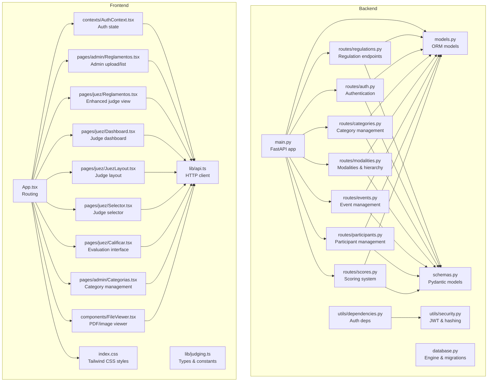

**Diagram sources**
- [main.py:1-53](file://main.py#L1-L53)
- [routes/regulations.py:1-110](file://routes/regulations.py#L1-L110)
- [routes/auth.py:1-36](file://routes/auth.py#L1-L36)
- [routes/categories.py:1-124](file://routes/categories.py#L1-L124)
- [routes/modalities.py:1-192](file://routes/modalities.py#L1-L192)
- [routes/events.py:1-116](file://routes/events.py#L1-L116)
- [routes/participants.py:1-430](file://routes/participants.py#L1-L430)
- [routes/scores.py:1-132](file://routes/scores.py#L1-L132)
- [models.py:1-153](file://models.py#L1-L153)
- [schemas.py:1-202](file://schemas.py#L1-L202)
- [database.py:1-93](file://database.py#L1-L93)
- [utils/dependencies.py:1-71](file://utils/dependencies.py#L1-L71)
- [utils/security.py:1-51](file://utils/security.py#L1-L51)
- [frontend/src/App.tsx:1-131](file://frontend/src/App.tsx#L1-L131)
- [frontend/src/contexts/AuthContext.tsx:1-144](file://frontend/src/contexts/AuthContext.tsx#L1-L144)
- [frontend/src/lib/api.ts:1-41](file://frontend/src/lib/api.ts#L1-L41)
- [frontend/src/lib/judging.ts:1-146](file://frontend/src/lib/judging.ts#L1-L146)
- [frontend/src/pages/admin/Reglamentos.tsx:1-302](file://frontend/src/pages/admin/Reglamentos.tsx#L1-L302)
- [frontend/src/pages/juez/Reglamentos.tsx:1-171](file://frontend/src/pages/juez/Reglamentos.tsx#L1-L171)
- [frontend/src/pages/juez/Dashboard.tsx:1-416](file://frontend/src/pages/juez/Dashboard.tsx#L1-L416)
- [frontend/src/pages/juez/JuezLayout.tsx:1-199](file://frontend/src/pages/juez/JuezLayout.tsx#L1-L199)
- [frontend/src/pages/juez/Selector.tsx:1-208](file://frontend/src/pages/juez/Selector.tsx#L1-L208)
- [frontend/src/pages/juez/Calificar.tsx:1-398](file://frontend/src/pages/juez/Calificar.tsx#L1-L398)
- [frontend/src/pages/admin/Categorias.tsx:1-337](file://frontend/src/pages/admin/Categorias.tsx#L1-L337)
- [frontend/src/components/FileViewer.tsx:1-157](file://frontend/src/components/FileViewer.tsx#L1-L157)
- [frontend/src/index.css:1-52](file://frontend/src/index.css#L1-L52)

**Section sources**
- [main.py:1-53](file://main.py#L1-L53)
- [frontend/src/App.tsx:1-131](file://frontend/src/App.tsx#L1-L131)

## Core Components
- Backend application and routers
  - Application initialization, CORS, static file mounting, and router registration
  - Enhanced with category management and modalities routing
  - See [main.py:1-53](file://main.py#L1-L53)
- Regulation management
  - Upload, list, and delete regulations with PDF validation and file persistence
  - Enhanced filtering by modality with improved error handling
  - See [routes/regulations.py:1-110](file://routes/regulations.py#L1-L110)
- Category organization system
  - Complete CRUD operations for modalities, categories, and subcategories
  - Hierarchical structure with cascading deletes
  - See [routes/categories.py:1-124](file://routes/categories.py#L1-L124), [routes/modalities.py:1-192](file://routes/modalities.py#L1-L192)
- Authentication and authorization
  - Login endpoint, JWT creation/verification, and role-based access helpers
  - See [routes/auth.py:1-36](file://routes/auth.py#L1-L36), [utils/security.py:1-51](file://utils/security.py#L1-L51), [utils/dependencies.py:1-71](file://utils/dependencies.py#L1-L71)
- Data models and schemas
  - ORM models for regulations, users, events, participants, scores, and hierarchical classification structures
  - Pydantic schemas for request/response validation including category hierarchy
  - See [models.py:1-153](file://models.py#L1-L153), [schemas.py:1-202](file://schemas.py#L1-L202)
- Database engine and migrations
  - SQLite engine configuration and forward-compatible participant table migration
  - See [database.py:1-93](file://database.py#L1-L93)
- Frontend administration page
  - Upload form, list rendering, delete actions, and PDF preview with enhanced UI
  - See [frontend/src/pages/admin/Reglamentos.tsx:1-302](file://frontend/src/pages/admin/Reglamentos.tsx#L1-L302)
- Enhanced frontend judge page
  - Filterable list by modality with visual feedback and improved error handling
  - See [frontend/src/pages/juez/Reglamentos.tsx:1-171](file://frontend/src/pages/juez/Reglamentos.tsx#L1-L171)
- Judge dashboard system
  - Comprehensive participant management with completion tracking
  - Modalidad and category filtering with real-time updates
  - See [frontend/src/pages/juez/Dashboard.tsx:1-416](file://frontend/src/pages/juez/Dashboard.tsx#L1-L416)
- Judge selector interface
  - Step-by-step navigation with event, modalidad, and category selection
  - See [frontend/src/pages/juez/Selector.tsx:1-208](file://frontend/src/pages/juez/Selector.tsx#L1-L208)
- Judge evaluation interface
  - Template-based scoring system with criterion management
  - See [frontend/src/pages/juez/Calificar.tsx:1-398](file://frontend/src/pages/juez/Calificar.tsx#L1-L398)
- Judge layout system
  - Consistent navigation and password management
  - See [frontend/src/pages/juez/JuezLayout.tsx:1-199](file://frontend/src/pages/juez/JuezLayout.tsx#L1-L199)
- Category management interface
  - Complete tree structure management with nested categories and subcategories
  - See [frontend/src/pages/admin/Categorias.tsx:1-337](file://frontend/src/pages/admin/Categorias.tsx#L1-L337)
- File viewer component
  - Dynamic loading for PDFs and images, fallback download links with enhanced error handling
  - See [frontend/src/components/FileViewer.tsx:1-157](file://frontend/src/components/FileViewer.tsx#L1-L157)
- HTTP client and authentication context
  - Axios client, base URL resolution, and local storage-backed session
  - See [frontend/src/lib/api.ts:1-41](file://frontend/src/lib/api.ts#L1-L41), [frontend/src/contexts/AuthContext.tsx:1-144](file://frontend/src/contexts/AuthContext.tsx#L1-L144)
- Responsive design system
  - Tailwind CSS utility classes for mobile-first responsive design
  - See [frontend/src/index.css:1-52](file://frontend/src/index.css#L1-L52)

**Section sources**
- [routes/regulations.py:1-110](file://routes/regulations.py#L1-L110)
- [routes/auth.py:1-36](file://routes/auth.py#L1-L36)
- [routes/categories.py:1-124](file://routes/categories.py#L1-L124)
- [routes/modalities.py:1-192](file://routes/modalities.py#L1-L192)
- [routes/events.py:1-116](file://routes/events.py#L1-L116)
- [routes/participants.py:1-430](file://routes/participants.py#L1-L430)
- [routes/scores.py:1-132](file://routes/scores.py#L1-L132)
- [routes/templates.py:1-134](file://routes/templates.py#L1-L134)
- [utils/security.py:1-51](file://utils/security.py#L1-L51)
- [utils/dependencies.py:1-71](file://utils/dependencies.py#L1-L71)
- [models.py:1-153](file://models.py#L1-L153)
- [schemas.py:1-202](file://schemas.py#L1-L202)
- [database.py:1-93](file://database.py#L1-L93)
- [frontend/src/pages/admin/Reglamentos.tsx:1-302](file://frontend/src/pages/admin/Reglamentos.tsx#L1-L302)
- [frontend/src/pages/juez/Reglamentos.tsx:1-171](file://frontend/src/pages/juez/Reglamentos.tsx#L1-L171)
- [frontend/src/pages/juez/Dashboard.tsx:1-416](file://frontend/src/pages/juez/Dashboard.tsx#L1-L416)
- [frontend/src/pages/juez/JuezLayout.tsx:1-199](file://frontend/src/pages/juez/JuezLayout.tsx#L1-L199)
- [frontend/src/pages/juez/Selector.tsx:1-208](file://frontend/src/pages/juez/Selector.tsx#L1-L208)
- [frontend/src/pages/juez/Calificar.tsx:1-398](file://frontend/src/pages/juez/Calificar.tsx#L1-L398)
- [frontend/src/pages/admin/Categorias.tsx:1-337](file://frontend/src/pages/admin/Categorias.tsx#L1-L337)
- [frontend/src/components/FileViewer.tsx:1-157](file://frontend/src/components/FileViewer.tsx#L1-L157)
- [frontend/src/lib/api.ts:1-41](file://frontend/src/lib/api.ts#L1-L41)
- [frontend/src/contexts/AuthContext.tsx:1-144](file://frontend/src/contexts/AuthContext.tsx#L1-L144)
- [frontend/src/index.css:1-52](file://frontend/src/index.css#L1-L52)

## Architecture Overview
The system uses a thin-client architecture with enhanced organization:
- Backend: FastAPI REST API with SQLAlchemy ORM, JWT-based authentication, and hierarchical category management
- Frontend: React SPA with protected routes, role-aware navigation, and enhanced judge portal with modalidad filtering
- Storage: Local filesystem for PDFs under `/uploads`, served statically

```mermaid
graph TB
subgraph "Clients"
U["Browser"]
end
subgraph "Frontend"
R["React Router"]
AC["AuthContext"]
API["Axios Client"]
P1["Admin Reglamentos"]
P2["Enhanced Judge Page"]
P3["Category Management"]
P4["Judge Dashboard"]
P5["Judge Selector"]
P6["Judge Evaluation"]
PV["FileViewer"]
END
subgraph "Backend"
APP["FastAPI App"]
AUTH["Auth Router"]
REG["Regulations Router"]
CAT["Categories Router"]
MOD["Modalities Router"]
EVENTS["Events Router"]
PART["Participants Router"]
SCORES["Scores Router"]
DB["SQLAlchemy Engine"]
SEC["Security Utils"]
DEP["Auth Dependencies"]
END
U --> R
R --> AC
AC --> API
API --> APP
APP --> AUTH
APP --> REG
APP --> CAT
APP --> MOD
APP --> EVENTS
APP --> PART
APP --> SCORES
REG --> DB
CAT --> DB
MOD --> DB
EVENTS --> DB
PART --> DB
SCORES --> DB
AUTH --> DB
AUTH --> SEC
REG --> DEP
APP --> DB
P1 --> API
P2 --> API
P3 --> API
P4 --> API
P5 --> API
P6 --> API
PV --> API
```

**Diagram sources**
- [frontend/src/App.tsx:1-131](file://frontend/src/App.tsx#L1-L131)
- [frontend/src/contexts/AuthContext.tsx:1-144](file://frontend/src/contexts/AuthContext.tsx#L1-L144)
- [frontend/src/lib/api.ts:1-41](file://frontend/src/lib/api.ts#L1-L41)
- [frontend/src/pages/admin/Reglamentos.tsx:1-302](file://frontend/src/pages/admin/Reglamentos.tsx#L1-L302)
- [frontend/src/pages/juez/Reglamentos.tsx:1-171](file://frontend/src/pages/juez/Reglamentos.tsx#L1-L171)
- [frontend/src/pages/admin/Categorias.tsx:1-337](file://frontend/src/pages/admin/Categorias.tsx#L1-L337)
- [frontend/src/pages/juez/Dashboard.tsx:1-416](file://frontend/src/pages/juez/Dashboard.tsx#L1-L416)
- [frontend/src/pages/juez/Selector.tsx:1-208](file://frontend/src/pages/juez/Selector.tsx#L1-L208)
- [frontend/src/pages/juez/Calificar.tsx:1-398](file://frontend/src/pages/juez/Calificar.tsx#L1-L398)
- [frontend/src/components/FileViewer.tsx:1-157](file://frontend/src/components/FileViewer.tsx#L1-L157)
- [main.py:1-53](file://main.py#L1-L53)
- [routes/auth.py:1-36](file://routes/auth.py#L1-L36)
- [routes/regulations.py:1-110](file://routes/regulations.py#L1-L110)
- [routes/categories.py:1-124](file://routes/categories.py#L1-L124)
- [routes/modalities.py:1-192](file://routes/modalities.py#L1-L192)
- [routes/events.py:1-116](file://routes/events.py#L1-L116)
- [routes/participants.py:1-430](file://routes/participants.py#L1-L430)
- [routes/scores.py:1-132](file://routes/scores.py#L1-L132)
- [routes/templates.py:1-134](file://routes/templates.py#L1-L134)
- [utils/security.py:1-51](file://utils/security.py#L1-L51)
- [utils/dependencies.py:1-71](file://utils/dependencies.py#L1-L71)
- [database.py:1-93](file://database.py#L1-L93)

## Detailed Component Analysis

### Backend: Regulation Management
The regulations module handles PDF uploads, filtering, and deletion with enhanced functionality:
- Upload endpoint validates PDF extension, writes to `/uploads` with a UUID-based filename, and persists metadata
- List endpoint supports optional modality filtering with case-insensitive matching and ordering
- Delete endpoint removes both the file and database record with enhanced error handling

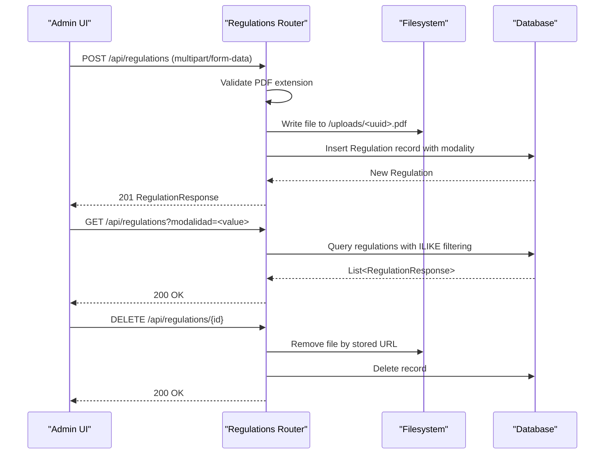

**Diagram sources**
- [routes/regulations.py:20-110](file://routes/regulations.py#L20-L110)
- [models.py:165-172](file://models.py#L165-L172)

**Section sources**
- [routes/regulations.py:1-110](file://routes/regulations.py#L1-L110)
- [models.py:165-172](file://models.py#L165-L172)

### Backend: Category Organization System
The category management system provides comprehensive hierarchical organization:
- Modalities: top-level competition categories (e.g., SPL, SQ, SQL)
- Categories: second-level groupings within modalities
- Subcategories: third-level subdivisions for detailed organization
- Full CRUD operations with cascading deletes for parent-child relationships

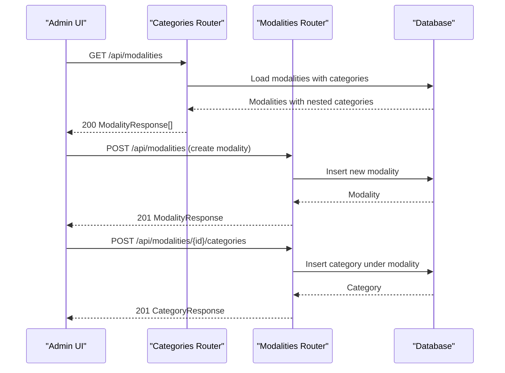

**Diagram sources**
- [routes/categories.py:12-24](file://routes/categories.py#L12-L24)
- [routes/modalities.py:36-54](file://routes/modalities.py#L36-L54)

**Section sources**
- [routes/categories.py:1-124](file://routes/categories.py#L1-L124)
- [routes/modalities.py:1-192](file://routes/modalities.py#L1-L192)
- [models.py:174-225](file://models.py#L174-L225)

### Backend: Authentication and Authorization
Authentication uses JWT tokens with enhanced role-based access:
- Login endpoint verifies credentials and issues a signed token containing user identity and role
- Dependency helpers enforce role checks for admin-only endpoints
- Security utilities provide hashing, verification, token encoding/decoding

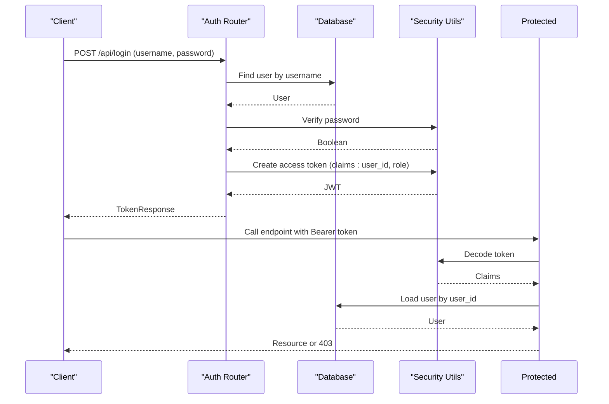

**Diagram sources**
- [routes/auth.py:13-36](file://routes/auth.py#L13-L36)
- [utils/security.py:29-39](file://utils/security.py#L29-L39)
- [utils/dependencies.py:32-47](file://utils/dependencies.py#L32-L47)

**Section sources**
- [routes/auth.py:1-36](file://routes/auth.py#L1-L36)
- [utils/security.py:1-51](file://utils/security.py#L1-L51)
- [utils/dependencies.py:1-71](file://utils/dependencies.py#L1-L71)

### Frontend: Administration Page
The admin page provides comprehensive regulation management:
- A form to upload PDFs with title, modality, and category selection
- A list of existing regulations with view and delete actions
- Enhanced modal PDF viewer integrated with the backend's static file serving
- Official modalidad options predefined for consistency

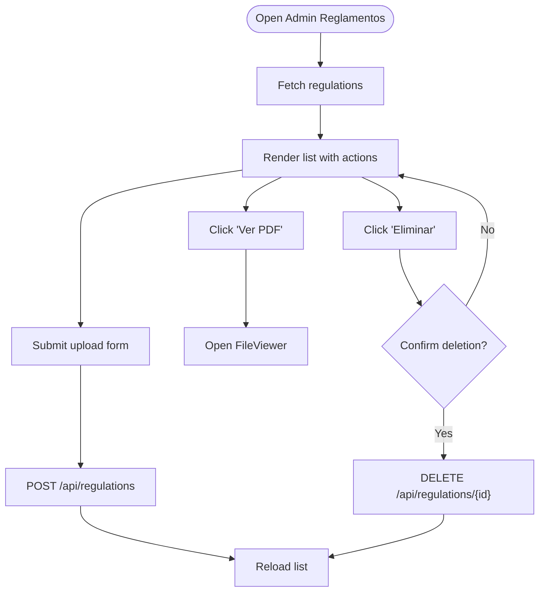

**Diagram sources**
- [frontend/src/pages/admin/Reglamentos.tsx:44-125](file://frontend/src/pages/admin/Reglamentos.tsx#L44-L125)
- [frontend/src/components/FileViewer.tsx:17-157](file://frontend/src/components/FileViewer.tsx#L17-L157)

**Section sources**
- [frontend/src/pages/admin/Reglamentos.tsx:1-302](file://frontend/src/pages/admin/Reglamentos.tsx#L1-L302)
- [frontend/src/components/FileViewer.tsx:1-157](file://frontend/src/components/FileViewer.tsx#L1-L157)

### Enhanced Frontend: Judge Portal
The judge portal now features comprehensive modalidad filtering and enhanced user experience:
- Filters regulations by modality via URL query parameters with real-time updates
- Displays selected modalidad prominently with visual feedback
- Responsive list layout with category badges and improved error handling
- Uses the same FileViewer component for PDF previews with enhanced URL handling

**Updated** Enhanced URL handling with improved getFullUrl function that constructs proper URLs by combining API_BASE_URL with relative paths, removing trailing slashes and ensuring consistent URL formatting across different deployment environments.

**Updated** Integrated FileViewer component with comprehensive document preview capabilities including PDF and image support with fallback download options.

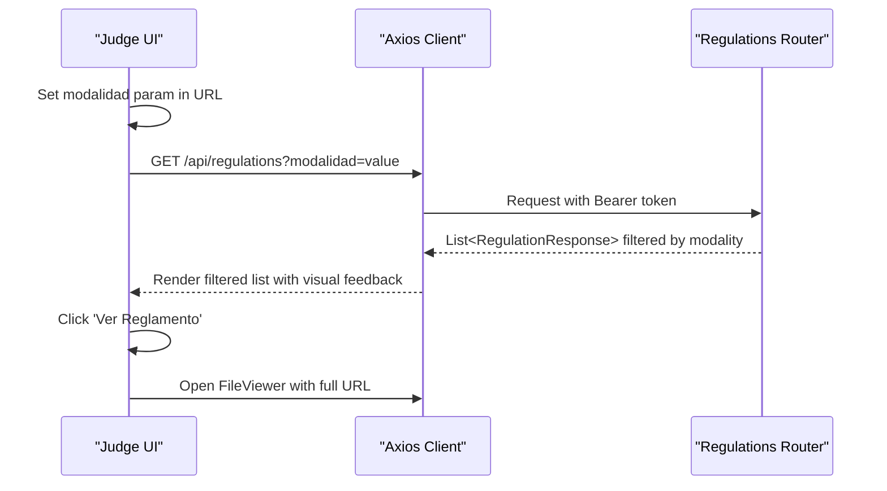

**Diagram sources**
- [frontend/src/pages/juez/Reglamentos.tsx:26-52](file://frontend/src/pages/juez/Reglamentos.tsx#L26-L52)
- [frontend/src/lib/api.ts:11-13](file://frontend/src/lib/api.ts#L11-L13)

**Section sources**
- [frontend/src/pages/juez/Reglamentos.tsx:1-171](file://frontend/src/pages/juez/Reglamentos.tsx#L1-L171)
- [frontend/src/lib/api.ts:1-41](file://frontend/src/lib/api.ts#L1-L41)

### Frontend: Category Management Interface
The category management interface provides comprehensive competition structure management:
- Tree-based visualization of modalities, categories, and subcategories
- Interactive CRUD operations with confirmation dialogs
- Cascading delete operations that remove entire hierarchies
- Real-time updates to reflect structural changes

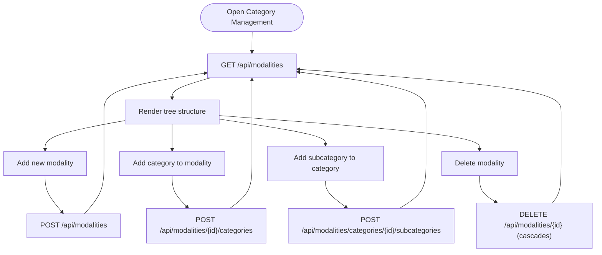

**Diagram sources**
- [frontend/src/pages/admin/Categorias.tsx:53-147](file://frontend/src/pages/admin/Categorias.tsx#L53-L147)
- [routes/modalities.py:137-153](file://routes/modalities.py#L137-L153)

**Section sources**
- [frontend/src/pages/admin/Categorias.tsx:1-337](file://frontend/src/pages/admin/Categorias.tsx#L1-L337)
- [routes/modalities.py:1-192](file://routes/modalities.py#L1-L192)

### Data Model: Hierarchical Organization
The system now supports comprehensive hierarchical organization with regulations linked to modalities:

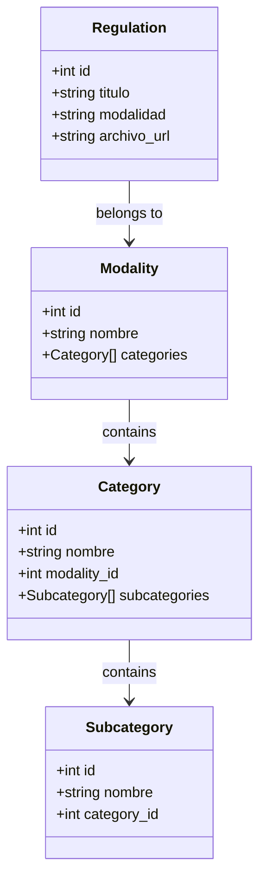

**Diagram sources**
- [models.py:165-172](file://models.py#L165-L172)
- [models.py:174-225](file://models.py#L174-L225)

**Section sources**
- [models.py:165-172](file://models.py#L165-L172)
- [models.py:174-225](file://models.py#L174-L225)

## Category Organization System
The system now includes a comprehensive hierarchical organization structure for competitions:

### Modalities
Top-level competition categories managed by administrators:
- SPL, SQ, SQL, Street Show, Tuning (official modalidades)
- Each modality can contain multiple categories
- Supports cascading delete operations

### Categories
Second-level groupings within modalities:
- Customizable category names within each modality
- Links to subcategories for detailed organization
- Prevents duplicate category names within the same modality

### Subcategories
Third-level subdivisions for fine-grained organization:
- Unlimited subcategories per category
- Used for specific competition divisions or age groups
- Supports complex tournament structures

**Section sources**
- [routes/categories.py:1-124](file://routes/categories.py#L1-L124)
- [routes/modalities.py:1-192](file://routes/modalities.py#L1-L192)
- [models.py:174-225](file://models.py#L174-L225)
- [frontend/src/pages/admin/Categorias.tsx:1-337](file://frontend/src/pages/admin/Categorias.tsx#L1-L337)

## Enhanced Judge Portal
The judge portal now provides sophisticated filtering and organization capabilities:

### Modalidad Filtering
- URL-based filtering with automatic updates
- Visual indication of selected modalidad
- Case-insensitive matching for flexible user input
- Real-time list updates when filters change

### Enhanced User Experience
- Prominent display of selected modalidad with visual styling
- Improved error messages and loading states
- Responsive grid layout for different screen sizes
- Better accessibility with proper semantic markup

### Integration Features
- Seamless integration with category management system
- Support for future category-based filtering
- Consistent styling with admin interface
- Mobile-responsive design

**Updated** Enhanced URL handling across the judge portal with improved getFullUrl function that properly constructs URLs by combining API_BASE_URL with relative paths, ensuring consistent behavior across different deployment environments and preventing broken file links.

**Updated** Integrated FileViewer component with comprehensive document preview capabilities including:
- Dynamic URL construction with proper base URL resolution
- Support for PDF and image file types with automatic detection
- Fallback download options for unsupported file types
- Enhanced error handling and loading states
- Responsive design patterns for different screen sizes

**Updated** Responsive design implementation with extensive use of Tailwind CSS classes:
- Grid layouts with responsive breakpoints (sm:md:lg)
- Flexible card layouts that adapt to screen size
- Touch-friendly button sizing and spacing
- Adaptive typography scales for different devices

**Updated** Judge Regulations Access feature implementation:
- Dedicated judge regulations page accessible via `/juez/reglamentos` route
- Modalidad filtering through URL query parameters
- FileViewer integration for PDF document preview
- Enhanced error handling and loading states
- Consistent styling with judge layout system

**Section sources**
- [frontend/src/pages/juez/Reglamentos.tsx:1-171](file://frontend/src/pages/juez/Reglamentos.tsx#L1-L171)
- [routes/regulations.py:67-79](file://routes/regulations.py#L67-L79)

## Judge Navigation Workflow
The judge interface now provides a comprehensive step-by-step navigation system:

### Step 1: Event Selection
- Judges select active events from available options
- Automatic selection of first active event if none chosen
- Event date formatting for better readability

### Step 2: Modalidad and Category Selection
- Dropdown selectors for official modalidad and category options
- Real-time validation and error messaging
- Visual display of current selection

### Step 3: Dashboard Access
- Direct navigation to participant dashboard
- URL parameter preservation for seamless workflow
- Back navigation support

**Updated** Judge Regulations Access integration:
- Direct link from judge selector page to regulations
- Preserves modalidad, evento_id, and categoria parameters
- Seamless navigation within judge workflow

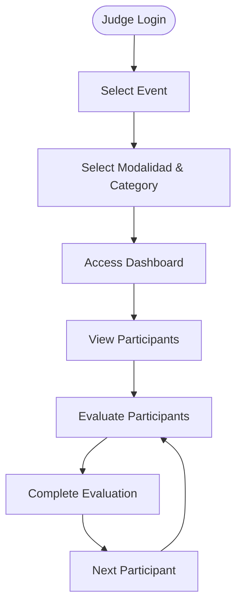

**Diagram sources**
- [frontend/src/pages/juez/Selector.tsx:36-105](file://frontend/src/pages/juez/Selector.tsx#L36-L105)
- [frontend/src/pages/juez/Dashboard.tsx:23-119](file://frontend/src/pages/juez/Dashboard.tsx#L23-L119)

**Section sources**
- [frontend/src/pages/juez/Selector.tsx:1-208](file://frontend/src/pages/juez/Selector.tsx#L1-L208)
- [frontend/src/pages/juez/Dashboard.tsx:1-416](file://frontend/src/pages/juez/Dashboard.tsx#L1-L416)

## Judge Dashboard System
The judge dashboard provides comprehensive participant management and progress tracking:

### Participant Management
- Real-time participant filtering by event, modalidad, and category
- Completion status tracking with visual indicators
- Individual participant evaluation access

### Progress Tracking
- Overall completion percentage calculation
- Visual progress indicators
- real-time updates as evaluations complete

### Advanced Features
- Recategorization capability for participant reassignment
- Modalidad-based category suggestions
- Batch operation support

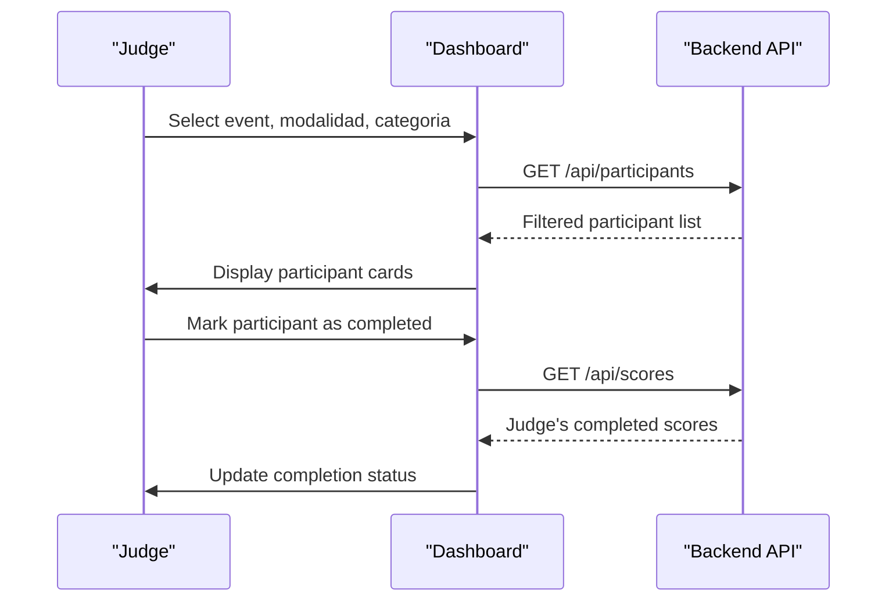

**Diagram sources**
- [frontend/src/pages/juez/Dashboard.tsx:66-119](file://frontend/src/pages/juez/Dashboard.tsx#L66-L119)
- [routes/participants.py:289-313](file://routes/participants.py#L289-L313)
- [routes/scores.py:117-131](file://routes/scores.py#L117-L131)

**Section sources**
- [frontend/src/pages/juez/Dashboard.tsx:1-416](file://frontend/src/pages/juez/Dashboard.tsx#L1-L416)
- [routes/participants.py:1-430](file://routes/participants.py#L1-L430)
- [routes/scores.py:1-132](file://routes/scores.py#L1-L132)

## Judge Evaluation Interface
The evaluation interface provides a comprehensive template-based scoring system:

### Template-Based Scoring
- Dynamic template loading based on modalidad and category
- Criterion-based scoring with maximum point limits
- Real-time total score calculation

### Evaluation Workflow
- Step-by-step evaluation process
- Increment/decrement scoring controls
- Save and navigation functionality

### Data Management
- Automatic loading of existing scores for editing
- JSON-based score data structure
- Persistent score storage

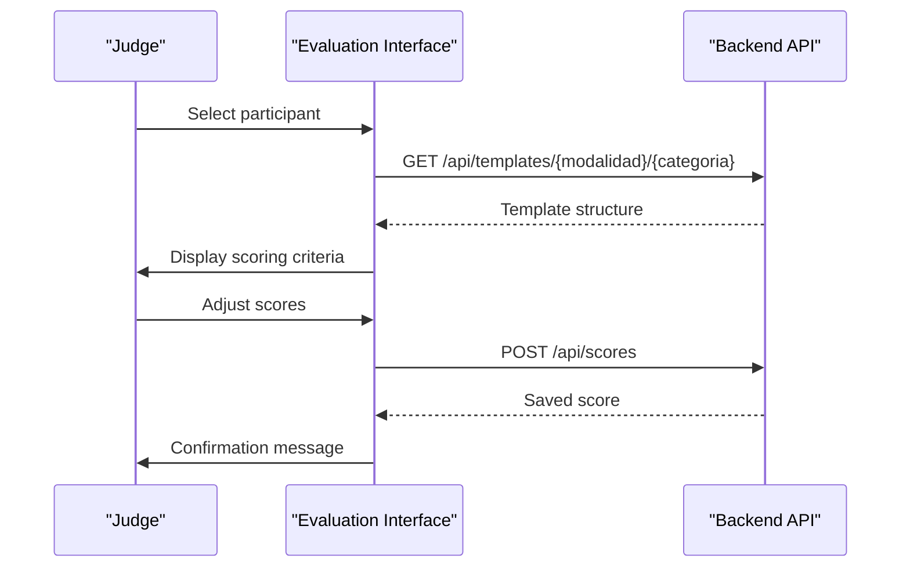

**Diagram sources**
- [frontend/src/pages/juez/Calificar.tsx:122-185](file://frontend/src/pages/juez/Calificar.tsx#L122-L185)
- [routes/scores.py:43-114](file://routes/scores.py#L43-L114)

**Section sources**
- [frontend/src/pages/juez/Calificar.tsx:1-398](file://frontend/src/pages/juez/Calificar.tsx#L1-L398)
- [routes/scores.py:1-132](file://routes/scores.py#L1-L132)
- [routes/templates.py:113-134](file://routes/templates.py#L113-L134)

## Judge Regulations Access
The Judge Regulations Access feature provides a dedicated interface for judges to view competition regulations filtered by their selected modalidad:

### Feature Overview
- Dedicated judge regulations page accessible via `/juez/reglamentos` route
- Modalidad filtering through URL query parameters with automatic updates
- FileViewer integration for PDF document preview with responsive design
- Enhanced error handling and loading states
- Consistent styling with judge layout system

### URL Handling and Filtering
- URL-based filtering with automatic updates when modalidad parameter changes
- Visual indication of selected modalidad with prominent display
- Case-insensitive matching for flexible user input
- Real-time list updates when filters change

### FileViewer Integration
- Seamless integration with FileViewer component for PDF display
- Dynamic URL construction with proper base URL resolution
- Support for PDF and image file types with automatic detection
- Fallback download options for unsupported file types
- Enhanced error handling and loading states

### User Experience Enhancements
- Prominent display of selected modalidad with visual styling
- Improved error messages and loading states
- Responsive grid layout for different screen sizes
- Better accessibility with proper semantic markup
- Consistent styling with judge layout system

### Integration with Judge Workflow
- Direct link from judge selector page to regulations
- Preserves modalidad, evento_id, and categoria parameters
- Seamless navigation within judge workflow

**Updated** Judge Regulations Access feature implementation:
- Dedicated judge regulations page accessible via `/juez/reglamentos` route
- Modalidad filtering through URL query parameters with automatic updates
- FileViewer integration for PDF document preview with responsive design
- Enhanced error handling and loading states
- Consistent styling with judge layout system

**Updated** Judge workflow integration:
- Direct link from judge selector page to regulations
- Preserves modalidad, evento_id, and categoria parameters
- Seamless navigation within judge workflow

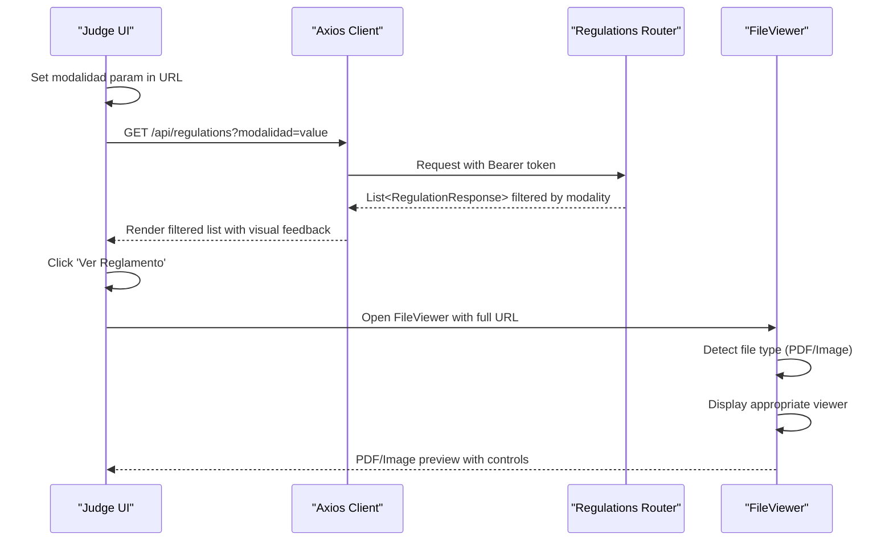

**Diagram sources**
- [frontend/src/pages/juez/Reglamentos.tsx:26-52](file://frontend/src/pages/juez/Reglamentos.tsx#L26-L52)
- [frontend/src/pages/juez/Reglamentos.tsx:160-167](file://frontend/src/pages/juez/Reglamentos.tsx#L160-L167)
- [frontend/src/components/FileViewer.tsx:98-118](file://frontend/src/components/FileViewer.tsx#L98-L118)

**Section sources**
- [frontend/src/pages/juez/Reglamentos.tsx:1-171](file://frontend/src/pages/juez/Reglamentos.tsx#L1-L171)
- [frontend/src/components/FileViewer.tsx:1-157](file://frontend/src/components/FileViewer.tsx#L1-L157)
- [frontend/src/lib/api.ts:1-41](file://frontend/src/lib/api.ts#L1-L41)

## FileViewer Component
The FileViewer component provides comprehensive document preview capabilities with enhanced PDF viewing:

### Component Features
- Dynamic URL construction with proper base URL resolution
- Support for PDF and image file types with automatic detection
- Fallback download options for unsupported file types
- Enhanced error handling and loading states
- Responsive design patterns for different screen sizes

### File Type Detection
- Automatic PDF detection using file extension (.pdf)
- Image detection for common formats (jpg, jpeg, png, gif, webp, bmp)
- Fallback handling for unsupported file types

### User Interface
- Modal dialog with header, content area, and footer
- Loading states with spinner animations
- Error messages with retry options
- Download buttons for direct file access
- Close functionality with backdrop click support

### URL Resolution
- Dynamic server root detection for different environments
- Proper URL construction for both absolute and relative paths
- Base URL stripping and cleaning for consistent behavior

**Updated** FileViewer component enhancements:
- Dynamic URL construction with proper base URL resolution
- Support for PDF and image file types with automatic detection
- Fallback download options for unsupported file types
- Enhanced error handling and loading states
- Responsive design patterns for different screen sizes

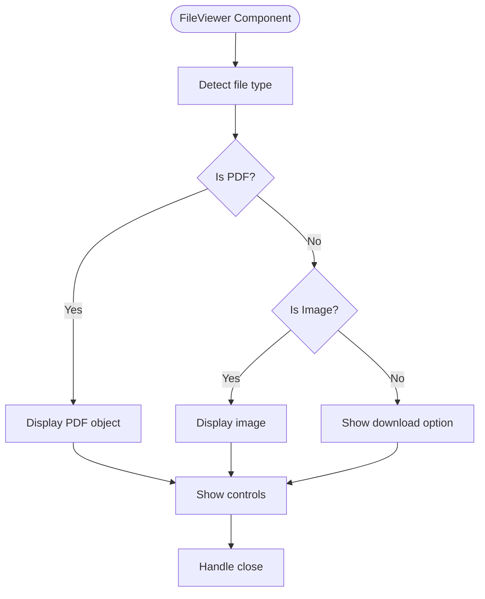

**Diagram sources**
- [frontend/src/components/FileViewer.tsx:24-25](file://frontend/src/components/FileViewer.tsx#L24-L25)
- [frontend/src/components/FileViewer.tsx:98-118](file://frontend/src/components/FileViewer.tsx#L98-L118)

**Section sources**
- [frontend/src/components/FileViewer.tsx:1-157](file://frontend/src/components/FileViewer.tsx#L1-L157)

## Dependency Analysis
External dependencies include FastAPI, SQLAlchemy, bcrypt, python-jose, pandas, openpyxl, and python-multipart. The startup script orchestrates backend and frontend development servers.

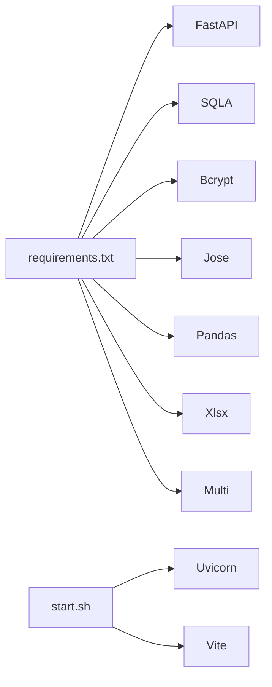

**Diagram sources**
- [requirements.txt:1-10](file://requirements.txt#L1-L10)
- [start.sh:1-16](file://start.sh#L1-L16)

**Section sources**
- [requirements.txt:1-10](file://requirements.txt#L1-L10)
- [start.sh:1-16](file://start.sh#L1-L16)

## Performance Considerations
- File serving: PDFs are served statically from the `/uploads` directory. For production, consider:
  - CDN integration for global distribution
  - Compression and caching headers
  - Signed URLs or tokenized access for sensitive documents
- Database queries:
  - Filtering regulations by modality uses ILIKE; ensure appropriate indexing on the modality field
  - Pagination for large lists would improve responsiveness
  - Consider adding indexes on modalidad and category fields for better performance
- Frontend:
  - Lazy-load FileViewer to reduce initial bundle size
  - Debounce search/filter operations for smoother interactions
  - Implement virtual scrolling for large category trees
  - **Updated** Enhanced responsive design with optimized grid layouts for different screen sizes
  - **Updated** Improved URL handling with cached base URL resolution
  - **Updated** Judge Regulations Access feature optimized for modalidad filtering
  - **Updated** FileViewer component performance with lazy loading and efficient URL resolution
  - **Updated** Judge workflow integration with seamless navigation
- Category management:
  - Optimize hierarchical loading with pagination for large datasets
  - Cache frequently accessed category structures
- **Updated** Judge interface performance:
  - Parallel API requests for dashboard data loading
  - Efficient participant filtering with debounced search
  - Template caching for evaluation interface
  - Optimized score calculation and validation
  - **Updated** Responsive design optimization for mobile devices using Tailwind CSS
  - **Updated** FileViewer component performance with lazy loading and efficient URL resolution
  - **Updated** Judge Regulations Access feature with optimized URL handling
  - **Updated** Judge workflow integration with direct access to regulations

## Troubleshooting Guide
Common issues and resolutions:
- Authentication failures
  - Verify token presence and validity; check role claims
  - Confirm secret key and algorithm match backend configuration
  - Reference: [routes/auth.py:13-36](file://routes/auth.py#L13-L36), [utils/security.py:29-39](file://utils/security.py#L29-L39)
- PDF upload errors
  - Ensure file type is PDF; confirm write permissions to `/uploads`
  - Check backend logs for exceptions during file save
  - Reference: [routes/regulations.py:20-64](file://routes/regulations.py#L20-L64)
- File not found or inaccessible
  - Confirm the stored URL matches the mounted static path (`/uploads`)
  - Validate absolute vs relative URL construction in the frontend
  - Reference: [frontend/src/lib/api.ts:16-22](file://frontend/src/lib/api.ts#L16-L22), [frontend/src/components/FileViewer.tsx:21-22](file://frontend/src/components/FileViewer.tsx#L21-L22)
- CORS issues
  - Confirm allowed origins and headers in middleware configuration
  - Reference: [main.py:28-34](file://main.py#L28-L34)
- Migration problems
  - Participant table migration is SQLite-specific; ensure compatibility
  - Reference: [database.py:36-93](file://database.py#L36-L93)
- Category management errors
  - Verify hierarchical constraints when creating categories/subcategories
  - Check for duplicate names within the same parent level
  - Reference: [routes/categories.py:67-84](file://routes/categories.py#L67-L84), [routes/modalities.py:116-129](file://routes/modalities.py#L116-L129)
- Modalidad filtering issues
  - Ensure URL parameters are properly encoded
  - Check case sensitivity of modalidad values
  - Reference: [frontend/src/pages/juez/Reglamentos.tsx:36-45](file://frontend/src/pages/juez/Reglamentos.tsx#L36-L45)
- **Updated** Judge interface issues:
  - Verify judge navigation workflow parameters (evento_id, modalidad, categoria)
  - Check template availability for selected modalidad and category
  - Confirm participant filtering by event, modalidad, and category
  - Reference: [frontend/src/pages/juez/Selector.tsx:90-105](file://frontend/src/pages/juez/Selector.tsx#L90-L105), [frontend/src/pages/juez/Dashboard.tsx:51-119](file://frontend/src/pages/juez/Dashboard.tsx#L51-L119)
- **Updated** Evaluation interface problems:
  - Ensure template matches participant's modalidad and category
  - Verify score data structure compliance
  - Check judge permissions for score editing
  - Reference: [frontend/src/pages/juez/Calificar.tsx:122-185](file://frontend/src/pages/juez/Calificar.tsx#L122-L185), [routes/scores.py:63-94](file://routes/scores.py#L63-L94)
- **Updated** FileViewer component issues:
  - Verify URL construction with getFullUrl function
  - Check file type detection logic for PDF and image support
  - Confirm fallback download functionality for unsupported file types
  - Reference: [frontend/src/components/FileViewer.tsx:54-60](file://frontend/src/components/FileViewer.tsx#L54-L60), [frontend/src/pages/juez/Reglamentos.tsx:54-60](file://frontend/src/pages/juez/Reglamentos.tsx#L54-L60)
- **Updated** Judge Regulations Access feature issues:
  - Verify judge regulations page route (`/juez/reglamentos`)
  - Check modalidad parameter handling in URL
  - Confirm FileViewer integration with judge regulations page
  - Verify getFullUrl function for proper URL construction
  - Reference: [frontend/src/pages/juez/Reglamentos.tsx:160-167](file://frontend/src/pages/juez/Reglamentos.tsx#L160-L167), [frontend/src/pages/juez/Reglamentos.tsx:54-60](file://frontend/src/pages/juez/Reglamentos.tsx#L54-L60)
- **Updated** FileViewer component URL resolution issues:
  - Verify getServerRoot function for dynamic server root detection
  - Check URL construction logic for both absolute and relative paths
  - Confirm proper handling of API_BASE_URL and file paths
  - Reference: [frontend/src/components/FileViewer.tsx:10-15](file://frontend/src/components/FileViewer.tsx#L10-L15), [frontend/src/lib/api.ts:16-22](file://frontend/src/lib/api.ts#L16-L22)
- **Updated** Responsive design issues:
  - Verify Tailwind CSS classes are properly applied (sm:, md:, lg:)
  - Check grid layout responsiveness across different screen sizes
  - Confirm touch-friendly button sizing and spacing
  - Reference: [frontend/src/pages/juez/Dashboard.tsx:221-242](file://frontend/src/pages/juez/Dashboard.tsx#L221-L242), [frontend/src/pages/juez/JuezLayout.tsx:66-100](file://frontend/src/pages/juez/JuezLayout.tsx#L66-L100)
- **Updated** Judge workflow integration issues:
  - Verify direct link from selector to regulations page
  - Check URL parameter preservation across navigation
  - Confirm seamless navigation within judge workflow
  - Reference: [frontend/src/pages/juez/Selector.tsx:211-230](file://frontend/src/pages/juez/Selector.tsx#L211-L230), [frontend/src/App.tsx:115-121](file://frontend/src/App.tsx#L115-L121)

**Section sources**
- [routes/auth.py:13-36](file://routes/auth.py#L13-L36)
- [utils/security.py:29-39](file://utils/security.py#L29-L39)
- [routes/regulations.py:20-64](file://routes/regulations.py#L20-L64)
- [frontend/src/lib/api.ts:16-22](file://frontend/src/lib/api.ts#L16-L22)
- [frontend/src/components/FileViewer.tsx:21-22](file://frontend/src/components/FileViewer.tsx#L21-L22)
- [main.py:28-34](file://main.py#L28-L34)
- [database.py:36-93](file://database.py#L36-L93)
- [routes/categories.py:67-84](file://routes/categories.py#L67-L84)
- [routes/modalities.py:116-129](file://routes/modalities.py#L116-L129)
- [frontend/src/pages/juez/Reglamentos.tsx:36-45](file://frontend/src/pages/juez/Reglamentos.tsx#L36-L45)
- [frontend/src/pages/juez/Selector.tsx:90-105](file://frontend/src/pages/juez/Selector.tsx#L90-L105)
- [frontend/src/pages/juez/Dashboard.tsx:51-119](file://frontend/src/pages/juez/Dashboard.tsx#L51-L119)
- [frontend/src/pages/juez/Calificar.tsx:122-185](file://frontend/src/pages/juez/Calificar.tsx#L122-L185)
- [routes/scores.py:63-94](file://routes/scores.py#L63-L94)
- [frontend/src/components/FileViewer.tsx:54-60](file://frontend/src/components/FileViewer.tsx#L54-L60)
- [frontend/src/pages/juez/Reglamentos.tsx:54-60](file://frontend/src/pages/juez/Reglamentos.tsx#L54-L60)
- [frontend/src/pages/juez/Dashboard.tsx:221-242](file://frontend/src/pages/juez/Dashboard.tsx#L221-L242)
- [frontend/src/pages/juez/JuezLayout.tsx:66-100](file://frontend/src/pages/juez/JuezLayout.tsx#L66-L100)
- [frontend/src/pages/juez/Selector.tsx:211-230](file://frontend/src/pages/juez/Selector.tsx#L211-L230)
- [frontend/src/App.tsx:115-121](file://frontend/src/App.tsx#L115-L121)

## Conclusion
The Judge Regulations Access system has been significantly enhanced with comprehensive category organization and improved judge portal functionality. The recent integration of the FileViewer component provides judges with seamless PDF viewing capabilities, featuring dynamic URL handling, responsive design, and comprehensive error handling. The system now provides administrators with powerful tools to manage hierarchical competition structures while offering judges an intuitive, filterable interface for accessing regulations by modalidad. The architecture remains straightforward and suitable for small to medium deployments, with clear paths to enhance scalability and security for production environments. The addition of category management enables complex tournament structures while maintaining the system's focus on efficient regulation distribution.

**Updated** Recent enhancements include improved URL handling mechanisms, enhanced error messaging, and better user experience across both judge and administrator interfaces, making the system more robust and user-friendly for various deployment scenarios. The new dedicated judge interface with step-by-step navigation workflow provides a comprehensive solution for competition management, from regulation access to participant evaluation and scoring.

**Updated** The judge interface now includes a complete workflow system with event selection, modalidad and category filtering, participant dashboard management, and regulations access, providing judges with a streamlined and efficient evaluation process.

**Updated** The Judge Regulations Access feature adds a dedicated interface for judges to view competition regulations filtered by their selected modalidad, integrated with the FileViewer component for PDF display. This feature enhances the judge experience by providing quick access to relevant regulations during the evaluation process.

**Updated** The FileViewer component integration adds comprehensive document preview capabilities with responsive design patterns, supporting both PDF and image file types with fallback download options for enhanced accessibility across different devices and screen sizes.

**Updated** Extensive responsive design implementation ensures optimal user experience across desktop, tablet, and mobile devices, with adaptive layouts that automatically adjust to different screen sizes and orientations using Tailwind CSS utility classes.

**Updated** The FileViewer component provides sophisticated document preview capabilities with automatic file type detection, dynamic URL resolution, and comprehensive error handling, making it an integral part of the judge regulations access workflow.

**Updated** Judge workflow integration provides seamless navigation between event selection, modalidad filtering, participant dashboard, and regulations access, creating a unified and efficient evaluation environment for judges.